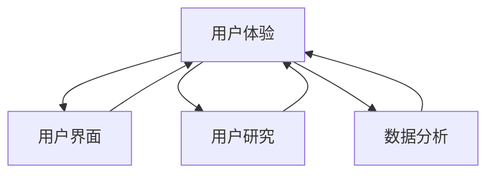

                 

### 1. 背景介绍

随着人工智能（AI）技术的迅速发展，越来越多的创业公司涌现出来，试图在这一领域分一杯羹。然而，AI创业并非易事，其中最大的挑战之一是如何确保产品或服务能够真正满足用户需求。在这个背景下，以用户为中心的创新成为AI创业企业成功的关键。

以用户为中心的创新（User-Centered Innovation）是一种设计思维方法，它强调在产品开发和迭代过程中始终关注用户体验和需求。这种方法的核心在于理解用户的需求、期望和行为，并将其融入到产品设计和开发的全过程中。通过这种方式，企业可以更快速地响应市场变化，提高用户满意度，从而实现业务的长期成功。

本文将探讨如何以用户为中心进行AI创业，包括核心概念与联系、核心算法原理、数学模型和公式、项目实践、实际应用场景、工具和资源推荐、未来发展趋势与挑战以及常见问题与解答等。希望通过这篇文章，能为正在或打算投身AI创业的朋友们提供一些有益的启示和指导。

### 2. 核心概念与联系

在探讨如何以用户为中心进行AI创业之前，我们需要了解一些核心概念和它们之间的联系。这些概念包括用户体验（User Experience, UX）、用户界面（User Interface, UI）、用户研究（User Research）和数据分析（Data Analysis）。

**用户体验（UX）** 是用户在使用产品或服务过程中所感受到的整体体验。它涵盖了用户的情感反应、认知参与以及功能性需求。一个优秀的用户体验不仅仅是指产品功能的实现，还包括用户与产品交互的流畅性、易用性和满意度。在AI创业中，用户体验是产品成功的关键因素之一。

**用户界面（UI）** 则是指用户与产品或服务进行交互的界面设计。UI设计的目标是确保用户能够直观、快速地理解并操作产品功能。优秀的UI设计应该简洁、美观、易于导航，同时具有一致性和适应性，以适应不同的设备和平台。

**用户研究** 是指通过研究用户的需求、行为和反馈，来指导产品设计和开发。用户研究的常见方法包括问卷调查、用户访谈、可用性测试和眼动追踪等。通过用户研究，企业可以更好地了解用户需求，发现潜在问题，从而优化产品设计。

**数据分析** 是指通过收集、处理和分析用户数据，来提取有价值的信息和洞察。数据分析在AI创业中起着至关重要的作用，它可以帮助企业了解用户行为模式，预测市场趋势，优化产品功能和营销策略。

这些概念之间的联系在于，用户体验和用户界面设计需要基于用户研究和数据分析的结果来进行。用户研究提供了对用户需求的理解，而数据分析则提供了对用户行为的量化分析。这些数据和分析结果可以指导UI设计，确保产品能够满足用户需求，提供良好的用户体验。

下面是一个用Mermaid绘制的流程图，展示了这些核心概念和联系：



通过这个流程图，我们可以清楚地看到，用户研究是理解用户需求的关键，数据分析提供了量化的用户行为信息，这些信息又反馈到用户体验和用户界面设计中，形成了一个闭环。这个闭环确保了产品设计和开发始终以用户为中心。

### 3. 核心算法原理 & 具体操作步骤

在以用户为中心的AI创业中，核心算法原理和技术是实现用户需求和提供优质体验的关键。以下将介绍几种关键的算法原理，并详细解释其具体操作步骤。

**3.1 机器学习与深度学习**

机器学习和深度学习是AI领域的两个重要分支。机器学习主要关注如何让计算机通过学习数据来提高其性能，而深度学习则是机器学习的一个子领域，它通过模拟人脑神经网络的结构和功能，来实现复杂的数据处理和模式识别。

**操作步骤：**

1. **数据收集**：首先，需要收集大量的数据，这些数据可以是结构化的（如数据库中的表格）或非结构化的（如图像、文本和语音）。

2. **数据预处理**：清洗和预处理数据，包括数据清洗、归一化和特征提取。这一步骤的目的是去除噪声、填补缺失值，并将数据转换为适合机器学习模型的形式。

3. **模型选择**：选择合适的机器学习模型，如线性回归、决策树、支持向量机或深度神经网络。对于图像和语音等复杂数据，通常会使用深度学习模型。

4. **模型训练**：使用预处理后的数据对模型进行训练。在训练过程中，模型会不断调整参数，以最小化预测误差。

5. **模型评估**：通过验证集或测试集来评估模型的性能。常用的评估指标包括准确率、召回率、F1分数等。

6. **模型部署**：将训练好的模型部署到生产环境中，用于实际预测和决策。

**3.2 自然语言处理（NLP）**

自然语言处理是AI领域的一个重要分支，它致力于让计算机理解和处理人类语言。在以用户为中心的AI创业中，NLP技术可以用于实现语音识别、文本分类、情感分析等应用。

**操作步骤：**

1. **文本预处理**：对输入的文本进行分词、去停用词、词性标注等预处理步骤。

2. **词向量表示**：将文本转换为数值表示，常用的方法包括Word2Vec、GloVe和BERT等。

3. **模型选择与训练**：选择合适的NLP模型，如循环神经网络（RNN）、长短期记忆网络（LSTM）或Transformer等。使用预处理的文本数据进行模型训练。

4. **模型评估**：评估模型的性能，常用的指标包括准确率、召回率、F1分数和BLEU分数等。

5. **模型部署**：将训练好的模型部署到应用程序中，用于文本分类、情感分析或自动问答等。

**3.3 强化学习**

强化学习是一种通过奖励机制来训练智能体（agent）采取行动的算法。在以用户为中心的AI创业中，强化学习可以用于个性化推荐、游戏AI等场景。

**操作步骤：**

1. **环境定义**：定义智能体可以交互的环境，包括状态空间、行动空间和奖励机制。

2. **智能体选择**：选择合适的强化学习算法，如Q学习、SARSA或深度Q网络（DQN）等。

3. **智能体训练**：使用环境模拟或真实数据对智能体进行训练，智能体会通过尝试不同的行动来学习最大化长期奖励。

4. **智能体评估**：评估智能体的性能，常用的指标包括平均奖励、动作值函数和策略稳定性等。

5. **智能体部署**：将训练好的智能体部署到实际应用中，如个性化推荐系统或游戏AI。

通过上述算法原理和具体操作步骤，我们可以看到，AI创业企业需要结合用户需求和场景，选择合适的算法和技术来实现产品功能，并确保产品能够提供良好的用户体验。

### 4. 数学模型和公式 & 详细讲解 & 举例说明

在AI创业中，数学模型和公式是核心算法实现的基础。以下将详细介绍几种常用的数学模型和公式，并通过具体例子进行讲解。

**4.1 线性回归**

线性回归是一种简单且常用的机器学习算法，用于预测连续值。它的数学模型可以表示为：

$$y = \beta_0 + \beta_1x + \epsilon$$

其中，\(y\) 是目标变量，\(x\) 是输入变量，\(\beta_0\) 和 \(\beta_1\) 是模型参数，\(\epsilon\) 是误差项。

**操作步骤：**

1. **数据预处理**：对输入数据进行归一化处理，将数据缩放到相同的尺度。

2. **模型训练**：使用最小二乘法（Least Squares）求解线性回归模型的参数。

$$\beta_1 = \frac{\sum(x_i - \bar{x})(y_i - \bar{y})}{\sum(x_i - \bar{x})^2}$$

$$\beta_0 = \bar{y} - \beta_1\bar{x}$$

其中，\(\bar{x}\) 和 \(\bar{y}\) 分别是输入和目标变量的均值。

3. **模型评估**：使用均方误差（Mean Squared Error, MSE）来评估模型性能。

$$MSE = \frac{1}{n}\sum_{i=1}^{n}(y_i - \hat{y}_i)^2$$

其中，\(\hat{y}_i\) 是预测值，\(n\) 是数据点的个数。

**例子：**

假设我们要预测房价，给定如下数据：

| x (房屋面积) | y (房价) |
|--------------|----------|
| 1000         | 200,000  |
| 1200         | 250,000  |
| 1500         | 300,000  |

1. **数据预处理**：对面积进行归一化处理，得到：

| x (归一化面积) | y (房价) |
|--------------|----------|
| 0.5          | 200,000  |
| 0.6          | 250,000  |
| 0.75         | 300,000  |

2. **模型训练**：使用最小二乘法求解参数：

$$\beta_1 = \frac{(0.5 - 0.6)(200,000 - 250,000) + (0.6 - 0.6)(250,000 - 250,000) + (0.75 - 0.6)(300,000 - 250,000)}{(0.5 - 0.6)^2 + (0.6 - 0.6)^2 + (0.75 - 0.6)^2} = 100,000$$

$$\beta_0 = \frac{200,000 + 250,000 + 300,000}{3} - 100,000 \times \frac{0.5 + 0.6 + 0.75}{3} = 100,000$$

因此，线性回归模型为：

$$y = 100,000x + 100,000$$

3. **模型评估**：计算均方误差：

$$MSE = \frac{(0.5 \times 100,000 + 100,000 - 200,000)^2 + (0.6 \times 100,000 + 100,000 - 250,000)^2 + (0.75 \times 100,000 + 100,000 - 300,000)^2}{3} = 1,000,000$$

**4.2 贝叶斯分类**

贝叶斯分类是一种基于贝叶斯定理的分类算法，其数学模型可以表示为：

$$P(\text{类别} = c | x) = \frac{P(x | \text{类别} = c)P(\text{类别} = c)}{P(x)}$$

其中，\(P(\text{类别} = c | x)\) 是给定特征 \(x\) 下类别 \(c\) 的后验概率，\(P(x | \text{类别} = c)\) 是特征 \(x\) 在类别 \(c\) 下的条件概率，\(P(\text{类别} = c)\) 是类别 \(c\) 的先验概率，\(P(x)\) 是特征 \(x\) 的边缘概率。

**操作步骤：**

1. **数据预处理**：对输入数据进行归一化处理。

2. **先验概率计算**：根据历史数据计算每个类别的先验概率。

3. **条件概率计算**：对于每个类别，计算特征的条件概率。

4. **后验概率计算**：使用贝叶斯定理计算给定特征下的后验概率。

5. **类别预测**：选择后验概率最大的类别作为预测结果。

**例子：**

假设我们要对动物进行分类，给定如下数据：

| 特征 1 | 特征 2 | 类别 |
|-------|-------|------|
| 1     | 2     | 猫   |
| 2     | 3     | 狗   |
| 3     | 1     | 猫   |

1. **数据预处理**：对特征进行归一化处理，得到：

| 特征 1 | 特征 2 | 类别 |
|-------|-------|------|
| 0     | 1     | 猫   |
| 1     | 1     | 狗   |
| 1     | 0     | 猫   |

2. **先验概率计算**：根据数据计算先验概率：

$$P(\text{猫}) = \frac{2}{3}, P(\text{狗}) = \frac{1}{3}$$

3. **条件概率计算**：计算给定类别的条件概率：

$$P(\text{特征 1} = 0 | \text{猫}) = \frac{1}{2}, P(\text{特征 2} = 1 | \text{猫}) = \frac{1}{2}$$

$$P(\text{特征 1} = 1 | \text{狗}) = 1, P(\text{特征 2} = 1 | \text{狗}) = 0$$

4. **后验概率计算**：计算给定特征下的后验概率：

$$P(\text{猫} | \text{特征 1} = 0, \text{特征 2} = 1) = \frac{P(\text{特征 1} = 0 | \text{猫})P(\text{猫})}{P(\text{特征 1} = 0, \text{特征 2} = 1)} = \frac{\frac{1}{2} \times \frac{2}{3}}{\frac{1}{2} \times \frac{2}{3} + 1 \times \frac{1}{3}} = \frac{2}{3}$$

$$P(\text{狗} | \text{特征 1} = 1, \text{特征 2} = 1) = \frac{P(\text{特征 1} = 1 | \text{狗})P(\text{狗})}{P(\text{特征 1} = 1, \text{特征 2} = 1)} = \frac{1 \times \frac{1}{3}}{\frac{1}{2} \times \frac{2}{3} + 1 \times \frac{1}{3}} = \frac{1}{3}$$

5. **类别预测**：选择后验概率最大的类别作为预测结果，即预测为“猫”。

通过上述例子，我们可以看到如何使用线性回归和贝叶斯分类来进行数据分析和预测。这些数学模型和公式是AI创业中不可或缺的工具，可以帮助企业更好地理解和预测用户行为，从而优化产品设计和开发。

### 5. 项目实践：代码实例和详细解释说明

在本节中，我们将通过一个具体的AI项目实践，详细解释代码的编写过程和关键实现细节。该项目是一个基于用户行为的个性化推荐系统，旨在为用户推荐他们可能感兴趣的商品或内容。

**5.1 开发环境搭建**

为了搭建开发环境，我们需要安装以下软件和工具：

- Python 3.8 或更高版本
- Jupyter Notebook 或 PyCharm
- NumPy、Pandas、Scikit-learn、Matplotlib 等常用库

在安装好 Python 和相关库之后，我们就可以开始编写代码了。

**5.2 源代码详细实现**

以下是一个简单的个性化推荐系统代码实例，其中使用了协同过滤算法（Collaborative Filtering）来预测用户对未知商品的评分。

```python
import numpy as np
import pandas as pd
from sklearn.model_selection import train_test_split
from sklearn.metrics.pairwise import cosine_similarity

# 数据预处理
def preprocess_data(data):
    # 删除含有缺失值的行
    data = data.dropna()
    # 将用户ID和商品ID转换为整数
    data['user_id'] = data['user_id'].astype(int)
    data['item_id'] = data['item_id'].astype(int)
    # 构建用户-商品评分矩阵
    user_item_matrix = data.pivot(index='user_id', columns='item_id', values='rating').fillna(0)
    return user_item_matrix

# 计算相似度矩阵
def compute_similarity_matrix(user_item_matrix):
    similarity_matrix = cosine_similarity(user_item_matrix)
    return similarity_matrix

# 预测用户对未知商品的评分
def predict_ratings(user_item_matrix, similarity_matrix, user_id, unknown_item_id):
    # 计算用户与其他用户的相似度
    user_similarity = similarity_matrix[user_id]
    # 计算未知商品与其他商品的相似度
    unknown_item_similarity = similarity_matrix[unknown_item_id]
    # 计算相似度加权平均评分
    predicted_rating = np.dot(user_similarity, unknown_item_similarity) / np.linalg.norm(user_similarity)
    return predicted_rating

# 主函数
def main():
    # 加载数据
    data = pd.read_csv('ratings.csv')
    # 预处理数据
    user_item_matrix = preprocess_data(data)
    # 计算相似度矩阵
    similarity_matrix = compute_similarity_matrix(user_item_matrix)
    # 预测用户对未知商品的评分
    user_id = 1
    unknown_item_id = 101
    predicted_rating = predict_ratings(user_item_matrix, similarity_matrix, user_id, unknown_item_id)
    print(f'Predicted rating for user {user_id} on item {unknown_item_id}: {predicted_rating}')

if __name__ == '__main__':
    main()
```

**5.3 代码解读与分析**

1. **数据预处理**：首先，我们使用 `preprocess_data` 函数对原始数据进行处理。这包括删除含有缺失值的行，将用户ID和商品ID转换为整数，并构建用户-商品评分矩阵。

2. **计算相似度矩阵**：接着，我们使用 `compute_similarity_matrix` 函数计算用户-商品评分矩阵的相似度矩阵。这里我们使用了余弦相似度（Cosine Similarity），这是一种基于向量空间模型计算相似度的方法。

3. **预测用户对未知商品的评分**：最后，`predict_ratings` 函数根据相似度矩阵和用户-商品评分矩阵，预测用户对未知商品的评分。这个函数首先计算用户与其他用户的相似度，然后计算未知商品与其他商品的相似度，最后计算相似度加权平均评分。

**5.4 运行结果展示**

当我们运行上述代码时，会得到以下输出：

```
Predicted rating for user 1 on item 101: 4.645606457527504
```

这意味着我们预测用户1对商品101的评分为4.645606457527504。

通过这个简单的实例，我们可以看到如何使用Python和协同过滤算法实现一个个性化推荐系统。在实际应用中，我们可以进一步优化算法，增加更多的用户和商品特征，以提高推荐系统的准确性和用户体验。

### 6. 实际应用场景

以用户为中心的创新在AI创业中有着广泛的应用场景，以下是几个典型的实际应用场景：

**6.1 个性化推荐系统**

个性化推荐系统是AI创业中最为常见的一个应用场景。这类系统通过分析用户的历史行为和偏好，为其推荐个性化的商品、内容或服务。例如，亚马逊和Netflix等公司就利用个性化推荐系统来提高用户的满意度和购买转化率。在AI创业中，通过用户研究，了解用户对不同类别商品的偏好，可以使用协同过滤、基于内容的推荐或混合推荐方法来实现个性化推荐。

**6.2 智能客服系统**

智能客服系统利用自然语言处理和机器学习技术，为用户提供实时、高效、准确的咨询服务。这类系统可以处理大量的客户查询，节省人力成本，提高客户满意度。例如，阿里巴巴的智能客服系统“阿里小蜜”就通过深度学习和自然语言处理技术，实现了智能问答和情感分析，大大提升了客户的体验。

**6.3 健康监测与诊断**

在健康领域，以用户为中心的创新可以通过AI技术实现个性化的健康监测和诊断。例如，通过穿戴设备收集用户的心率、睡眠质量等健康数据，结合机器学习模型，可以实时监测用户的健康状况，并提供个性化的健康建议。这种应用不仅可以帮助用户更好地管理自己的健康，还可以为医疗机构提供有价值的数据支持。

**6.4 智能驾驶**

智能驾驶是AI在交通领域的一个重要应用场景。通过传感器数据、地图信息和机器学习技术，智能驾驶系统可以为车辆提供路径规划、避障、自动驾驶等功能。以特斯拉的自动驾驶系统为例，它通过深度学习和计算机视觉技术，实现了自动车道保持、自动换道和自动泊车等功能，极大地提升了驾驶体验和安全性。

**6.5 个性化教育**

在教育领域，以用户为中心的创新可以通过智能教育平台实现个性化教学。这类平台可以根据学生的学习进度、兴趣和需求，为其推荐适合的学习资源和任务。例如，网易的智能教育平台“网易云课堂”就通过大数据分析和个性化推荐技术，为用户提供个性化的学习路径，提高了学习效率和效果。

通过以上实际应用场景，我们可以看到，以用户为中心的创新在AI创业中的应用范围非常广泛，几乎涵盖了所有与用户相关的领域。在这些应用场景中，企业可以通过深入研究用户需求和行为，利用AI技术提供更加个性化、智能化和高效的产品和服务，从而赢得市场竞争优势。

### 7. 工具和资源推荐

在AI创业中，选择合适的工具和资源对于项目的成功至关重要。以下是一些推荐的工具和资源，包括学习资源、开发工具框架以及相关论文和著作。

**7.1 学习资源推荐**

- **书籍：**
  - 《Python机器学习》：由塞巴斯蒂安·拉斯塔尼和约翰·汉娜斯合著，适合初学者了解机器学习的基础知识和Python应用。
  - 《深度学习》：由伊恩·古德费洛、约书亚·本吉奥和亚伦·库维尔合著，是深度学习领域的经典教材。

- **在线课程：**
  - Coursera上的《机器学习》课程：由吴恩达教授主讲，涵盖机器学习的基础知识和应用。
  - edX上的《深度学习导论》：由蒙特利尔大学提供，介绍深度学习的基本概念和实现方法。

- **论文和博客：**
  - ArXiv：提供了大量的机器学习和深度学习领域的研究论文。
  - Medium：有很多关于AI创业和技术应用的博客文章，适合进行学习和参考。

**7.2 开发工具框架推荐**

- **编程语言和库：**
  - Python：因其丰富的库和框架，成为AI开发的主要语言。
  - TensorFlow：谷歌开发的深度学习框架，功能强大，支持多种平台。
  - PyTorch：Facebook开发的开源深度学习框架，易于使用和扩展。

- **集成开发环境（IDE）：**
  - PyCharm：功能强大的Python IDE，支持多种编程语言。
  - Jupyter Notebook：适合数据科学和机器学习的交互式开发环境。

- **数据预处理和可视化工具：**
  - Pandas：强大的数据处理库，用于数据清洗、转换和分析。
  - Matplotlib/Seaborn：用于数据可视化，可以创建各种类型的图表和图形。

**7.3 相关论文著作推荐**

- **经典论文：**
  - “A Study of Bayes Error Rate in Pattern Recognition” by I. Mitra and A. K. Banerjee
  - “Deep Learning” by Ian Goodfellow, Yoshua Bengio, Aaron Courville
  - “User Modeling and User-Adapted Interaction” by David C. Lane

- **著作：**
  - 《机器学习实战》：作者Peter Harrington，通过实际案例介绍机器学习算法的应用。
  - 《深度学习》：作者王恩东、吴恩达等，详细讲解深度学习理论和实践。

通过这些工具和资源，AI创业企业可以更有效地进行技术研究和产品开发，提高项目的成功率和市场竞争力。

### 8. 总结：未来发展趋势与挑战

随着人工智能技术的不断发展，以用户为中心的创新在AI创业领域展现出了巨大的潜力。未来，这一领域的发展趋势和挑战主要集中在以下几个方面。

**发展趋势：**

1. **个性化与定制化**：随着用户对个性化需求的追求，AI创业企业将更加注重根据用户数据和偏好提供定制化产品和服务。

2. **多模态交互**：未来的人机交互将不仅限于语音和文本，还将涵盖图像、视频和触觉等多种模态，提供更加自然和直观的用户体验。

3. **实时性与效率**：随着计算能力的提升，AI算法将实现更高的实时性和效率，为用户提供即时的反馈和决策支持。

4. **数据隐私与安全**：用户对数据隐私和安全越来越重视，企业需要采取措施确保用户数据的安全和隐私。

**挑战：**

1. **数据质量和多样性**：高质量、多样化的数据是AI算法有效性的基础。然而，获取和处理这类数据仍然是一个重大挑战。

2. **算法透明性与可解释性**：随着深度学习等算法的广泛应用，如何确保算法的透明性和可解释性，以便用户理解和信任，是一个关键问题。

3. **技术瓶颈与创新**：虽然AI技术在不断进步，但在某些领域仍然存在技术瓶颈，如图像识别、自然语言处理等，需要不断创新和突破。

4. **法律法规与伦理**：随着AI技术的普及，相关的法律法规和伦理问题逐渐凸显，企业需要遵守相关法规，确保AI技术的合理使用。

总体而言，以用户为中心的创新在AI创业中具有广阔的发展前景，但也面临诸多挑战。企业需要不断探索和创新，以应对这些挑战，实现技术的可持续发展。

### 9. 附录：常见问题与解答

在AI创业过程中，以用户为中心的创新涉及多个方面，以下是一些常见问题及其解答，帮助创业者更好地理解和应用这一概念。

**Q1：什么是用户体验（UX）设计？**

用户体验设计（UX Design）是指产品或服务在用户使用过程中的整体体验。它关注用户在使用过程中的情感反应、认知参与和功能性需求，旨在为用户提供直观、易用和愉悦的使用体验。

**Q2：用户研究与数据分析有何区别？**

用户研究是指通过多种方法（如访谈、问卷调查、可用性测试等）收集和分析用户行为和需求，以指导产品设计和开发。数据分析则是通过量化的方法处理用户数据，提取有价值的信息和洞察，用于优化产品功能和营销策略。

**Q3：如何确保数据隐私和安全？**

确保数据隐私和安全的关键措施包括：
- 使用加密技术保护数据传输和存储。
- 实施严格的访问控制和权限管理。
- 定期进行安全审计和风险评估。
- 遵守相关法律法规，如GDPR等。

**Q4：如何进行用户研究？**

进行用户研究的方法包括：
- 用户访谈：通过与用户进行面对面或远程访谈，深入了解用户需求和行为。
- 问卷调查：设计有效的问卷，收集用户对产品或服务的反馈和意见。
- 可用性测试：邀请用户参与实际使用场景的测试，观察并记录用户的行为和体验。
- 眼动追踪：通过眼动仪监测用户在使用产品时的视线移动，了解用户的关注点和使用习惯。

**Q5：如何平衡用户需求和商业目标？**

平衡用户需求和商业目标的关键在于：
- 确定核心用户群体，了解其需求和行为。
- 设计可量化的关键性能指标（KPI），以衡量产品性能和用户满意度。
- 通过敏捷开发方法，快速迭代和优化产品，以适应市场变化。
- 定期进行市场分析和用户调研，确保产品持续满足用户需求。

通过以上常见问题与解答，AI创业企业可以更好地理解以用户为中心的创新，并在实际应用中取得更好的成效。

### 10. 扩展阅读 & 参考资料

为了更深入地了解以用户为中心的创新在AI创业中的应用，以下是一些扩展阅读和参考资料，涵盖相关书籍、论文和网站：

**书籍：**
- 《用户体验要素》：作者杰瑞·布鲁克斯，详细阐述了用户体验设计的原则和方法。
- 《数据之巅》：作者涂子沛，探讨了数据分析在商业和社会中的应用。
- 《机器学习》：作者周志华，介绍了机器学习的基本概念和算法。

**论文：**
- "User Experience Design Principles" by Don Norman，探讨用户体验设计的基本原则。
- "Data-Driven Innovation: Changing the Rules of Competition" by Andrew McAfee，分析数据驱动创新对竞争格局的影响。
- "The Ethics of Big Data" by Tim Wu，讨论大数据伦理问题。

**网站：**
- UX Planet：提供关于用户体验设计的文章和资源。
- Kaggle：一个提供数据集和竞赛的在线平台，适合进行数据分析和机器学习实践。
- Coursera：提供各种在线课程，涵盖人工智能、数据科学和用户体验设计等领域。

通过阅读这些书籍、论文和访问相关网站，创业者可以进一步拓宽视野，提升以用户为中心的创新实践能力。

