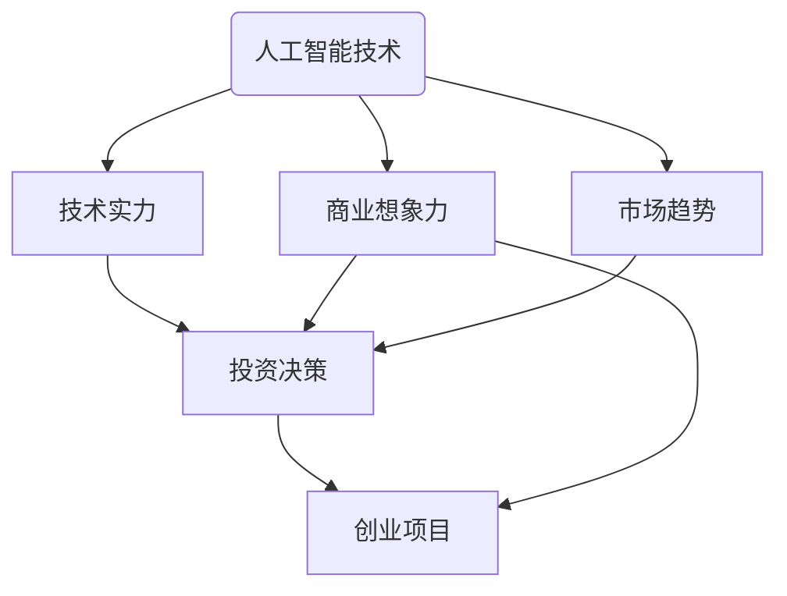

                 

### 背景介绍

随着人工智能技术的不断进步和应用的普及，AI创业投资领域也迎来了新的风向。过去，投资者往往更关注AI算法的先进性和创新性，而现在，随着技术的日益成熟，越来越多的投资者开始重视企业的技术实力和商业想象力。本文将深入探讨AI创业投资的新风向，分析技术实力和商业想象力在投资决策中的重要性，并展望未来可能的发展趋势与挑战。

在人工智能领域，技术实力不仅包括算法的创新和优化，还涵盖了数据资源的获取与处理、硬件设备的支持以及团队的技术积累。一个技术实力强的企业，往往能够迅速响应市场变化，推出具有竞争力的产品和服务。

商业想象力则是指企业对市场趋势的洞察力以及将技术转化为商业价值的创新能力。一个具有商业想象力的高科技企业，能够在纷繁复杂的市场环境中找到新的商业机会，并通过独特的商业模式实现可持续发展。

本文将首先介绍AI创业投资的新风向，然后深入探讨技术实力和商业想象力在投资决策中的作用。接下来，我们将分析一些成功的AI创业案例，从中汲取经验和启示。随后，本文将讨论投资者在选择AI创业项目时需要关注的几个关键因素。最后，本文将对未来AI创业投资可能面临的发展趋势和挑战进行展望，并提出一些建议。

通过对这些内容的逐步分析，我们希望读者能够对AI创业投资的新风向有更深入的理解，从而更好地把握投资机会，推动人工智能产业的健康发展。### 核心概念与联系

在探讨AI创业投资的新风向之前，我们需要明确几个核心概念，并理解它们之间的联系。这些核心概念包括人工智能技术、技术实力、商业想象力、投资决策和市场趋势。

**人工智能技术**是本文讨论的基础，它涵盖了机器学习、深度学习、自然语言处理、计算机视觉等多个领域。人工智能技术不断演进，为各行各业带来了新的机遇和挑战。

**技术实力**是指企业在人工智能技术方面的综合能力，包括算法创新、数据处理能力、硬件支持以及团队的技术积累。技术实力强的企业能够迅速推出具有竞争力的产品和服务。

**商业想象力**是指企业对市场趋势的洞察力和将技术转化为商业价值的创新能力。商业想象力强的企业能够发现新的商业机会，并通过创新的商业模式实现可持续发展。

**投资决策**是指投资者在选择AI创业项目时所做的决策过程。投资者需要综合考虑企业的技术实力、商业想象力、市场前景、团队背景等多个因素。

**市场趋势**是指当前和未来市场的发展方向。在AI创业投资领域，市场趋势的变化会直接影响投资决策，因此投资者需要密切关注市场动态，以便做出正确的投资选择。

为了更直观地理解这些核心概念之间的联系，我们可以使用Mermaid流程图来展示它们之间的关系。以下是一个简化的Mermaid流程图：



在这个流程图中，我们可以看到，人工智能技术是整个流程的起点，它直接影响技术实力、商业想象力、市场趋势和投资决策。技术实力和商业想象力是投资决策的重要依据，而市场趋势则提供了投资背景。最终，投资决策决定了创业项目的发展方向。

通过这个流程图，我们可以更清晰地理解核心概念之间的联系，从而为后续的分析和讨论打下基础。在接下来的部分中，我们将进一步探讨技术实力和商业想象力在投资决策中的具体作用。### 核心算法原理 & 具体操作步骤

在深入了解AI创业投资的新风向之前，我们需要对核心算法的原理和具体操作步骤进行详细探讨。本文将以一个典型的AI算法——深度学习为例，来分析其基本原理、技术细节以及如何应用于创业项目。

#### 深度学习基本原理

深度学习是一种基于多层神经网络的学习方法，通过模拟人脑神经元之间的连接来学习和处理数据。其基本原理可以概括为以下几个步骤：

1. **数据输入**：将输入数据（如图像、文本或声音）转化为数值矩阵，作为神经网络的输入。

2. **前向传播**：将输入数据通过一系列的神经网络层（包括输入层、隐藏层和输出层），每一层都会进行权重调整和激活函数处理。

3. **反向传播**：计算输出结果与真实值之间的误差，通过反向传播算法更新各层的权重，使得网络能够更好地拟合输入数据。

4. **优化**：使用优化算法（如梯度下降）来调整网络权重，减少误差，提高模型的准确度。

5. **预测**：使用训练好的模型对新的数据进行预测，得到相应的输出结果。

#### 深度学习技术细节

1. **神经网络架构**：深度学习模型通常由多个层次组成，包括卷积层、全连接层、池化层等。卷积层用于提取图像特征，全连接层用于分类和回归。

2. **激活函数**：常用的激活函数有ReLU（Rectified Linear Unit）、Sigmoid、Tanh等，它们能够引入非线性特性，使得神经网络能够学习复杂的函数。

3. **优化算法**：常用的优化算法包括随机梯度下降（SGD）、Adam、RMSprop等，这些算法能够加速网络训练过程并提高模型的收敛速度。

4. **正则化**：为了防止模型过拟合，常用的正则化方法有L1正则化、L2正则化、Dropout等。

#### 深度学习在创业项目中的应用

1. **图像识别**：深度学习在图像识别领域取得了显著的成果，如人脸识别、车辆检测等。创业者可以利用这一技术为安防、零售等行业提供解决方案。

2. **自然语言处理**：深度学习在自然语言处理领域有着广泛的应用，如机器翻译、文本分类、语音识别等。创业者可以基于这一技术为智能客服、内容推荐等提供智能化的服务。

3. **推荐系统**：深度学习可以用于构建推荐系统，如个性化购物推荐、新闻推荐等。创业者可以利用这一技术为电商、媒体等行业提供增值服务。

#### 深度学习应用示例

以下是一个简单的深度学习应用示例，使用Python和TensorFlow框架实现一个简单的图像分类模型。

```python
import tensorflow as tf
from tensorflow.keras import datasets, layers, models

# 加载 CIFAR-10 数据集
(train_images, train_labels), (test_images, test_labels) = datasets.cifar10.load_data()

# 数据预处理
train_images, test_images = train_images / 255.0, test_images / 255.0

# 构建深度学习模型
model = models.Sequential()
model.add(layers.Conv2D(32, (3, 3), activation='relu', input_shape=(32, 32, 3)))
model.add(layers.MaxPooling2D((2, 2)))
model.add(layers.Conv2D(64, (3, 3), activation='relu'))
model.add(layers.MaxPooling2D((2, 2)))
model.add(layers.Conv2D(64, (3, 3), activation='relu'))

# 添加全连接层和输出层
model.add(layers.Flatten())
model.add(layers.Dense(64, activation='relu'))
model.add(layers.Dense(10))

# 编译模型
model.compile(optimizer='adam',
              loss=tf.keras.losses.SparseCategoricalCrossentropy(from_logits=True),
              metrics=['accuracy'])

# 训练模型
model.fit(train_images, train_labels, epochs=10)

# 测试模型
test_loss, test_acc = model.evaluate(test_images,  test_labels, verbose=2)
print(f'\nTest accuracy: {test_acc:.4f}')
```

在这个示例中，我们使用CIFAR-10数据集来训练一个简单的卷积神经网络模型，用于图像分类。通过上述步骤，我们可以看到深度学习的基本原理和应用流程。

通过这个示例，我们不仅了解了深度学习的基本原理，还看到了如何将深度学习应用于实际的创业项目。在接下来的部分中，我们将进一步探讨AI创业投资中的技术实力和商业想象力。### 数学模型和公式 & 详细讲解 & 举例说明

在深度学习中，数学模型和公式是理解和实现核心算法的关键。以下我们将详细讲解几个关键的数学模型和公式，并举例说明其在AI创业项目中的应用。

#### 梯度下降（Gradient Descent）

梯度下降是一种优化算法，用于调整神经网络的权重，以最小化损失函数。其基本公式如下：

$$
w_{\text{new}} = w_{\text{old}} - \alpha \cdot \nabla_w J(w)
$$

其中，$w$ 是权重，$\alpha$ 是学习率，$J(w)$ 是损失函数。

**举例说明**：

假设我们有一个简单的线性模型 $y = wx + b$，损失函数为均方误差（MSE），即：

$$
J(w) = \frac{1}{2} \sum_{i=1}^{n} (wx_i + b - y_i)^2
$$

使用梯度下降算法，我们可以通过以下步骤更新权重：

1. **计算梯度**：

$$
\nabla_w J(w) = \sum_{i=1}^{n} (wx_i + b - y_i) \cdot x_i
$$

2. **更新权重**：

$$
w_{\text{new}} = w_{\text{old}} - \alpha \cdot \nabla_w J(w)
$$

3. **重复上述步骤**，直到损失函数收敛。

#### 激活函数（Activation Function）

激活函数是神经网络中的一个关键组件，用于引入非线性特性。常用的激活函数有ReLU、Sigmoid和Tanh等。

**ReLU函数**：

$$
f(x) = \max(0, x)
$$

ReLU函数在 $x \geq 0$ 时输出 $x$，在 $x < 0$ 时输出 0。它能够加速模型的训练过程，并减少梯度消失的问题。

**Sigmoid函数**：

$$
f(x) = \frac{1}{1 + e^{-x}}
$$

Sigmoid函数将输入映射到 $(0, 1)$ 区间内，常用于二分类问题。

**Tanh函数**：

$$
f(x) = \frac{e^x - e^{-x}}{e^x + e^{-x}}
$$

Tanh函数的输出范围是 $(-1, 1)$，它相对于Sigmoid函数在输出端更加对称。

#### 前向传播与反向传播（Forward Propagation & Backpropagation）

深度学习中的前向传播和反向传播是训练神经网络的核心步骤。

**前向传播**：

1. **输入层**：将输入数据输入到网络的输入层。
2. **隐藏层**：逐层计算隐藏层的输出，通过激活函数进行处理。
3. **输出层**：计算输出层的输出。

**反向传播**：

1. **计算误差**：计算输出层的预测值与真实值之间的误差。
2. **反向传播**：从输出层开始，逐层计算误差对每层权重的梯度。
3. **权重更新**：根据梯度更新各层的权重。

**举例说明**：

假设有一个简单的神经网络，包括一个输入层、一个隐藏层和一个输出层。输入层有3个神经元，隐藏层有2个神经元，输出层有1个神经元。使用ReLU激活函数。

1. **前向传播**：

   - 输入层到隐藏层的计算：

   $$
   z_1^{[1]} = w_{11}^{[1]}x_1 + w_{12}^{[1]}x_2 + w_{13}^{[1]}x_3 \\
   a_1^{[1]} = \max(0, z_1^{[1]}) \\
   z_2^{[1]} = w_{21}^{[1]}x_1 + w_{22}^{[1]}x_2 + w_{23}^{[1]}x_3 \\
   a_2^{[1]} = \max(0, z_2^{[1]})
   $$

   - 隐藏层到输出层的计算：

   $$
   z_1^{[2]} = w_{11}^{[2]}a_1^{[1]} + w_{12}^{[2]}a_2^{[1]} \\
   \hat{y} = \max(0, z_1^{[2]})
   $$

2. **反向传播**：

   - 计算输出层的误差：

   $$
   \delta_1^{[2]} = \hat{y} - y \\
   \frac{\partial J}{\partial z_1^{[2]}} = \delta_1^{[2]}
   $$

   - 计算隐藏层的误差：

   $$
   \delta_2^{[1]} = a_2^{[1]} \cdot (1 - a_2^{[1]}) \cdot w_{12}^{[2]} \cdot \delta_1^{[2]} \\
   \frac{\partial J}{\partial z_2^{[1]}} = \delta_2^{[1]}
   $$

   - 更新权重：

   $$
   w_{11}^{[2]}_{\text{new}} = w_{11}^{[2]}_{\text{old}} - \alpha \cdot \frac{\partial J}{\partial w_{11}^{[2]}} \\
   w_{12}^{[2]}_{\text{new}} = w_{12}^{[2]}_{\text{old}} - \alpha \cdot \frac{\partial J}{\partial w_{12}^{[2]}}
   $$

   - 重复上述步骤，直到模型收敛。

通过上述讲解和示例，我们了解了深度学习中的几个关键数学模型和公式，以及如何应用它们来训练神经网络。这些知识和技能对于AI创业项目至关重要，有助于创业者理解和应用深度学习技术，开发出具有竞争力的产品和服务。在接下来的部分中，我们将继续探讨AI创业项目中的具体实践。### 项目实践：代码实例和详细解释说明

在本部分，我们将通过一个具体的AI创业项目实例，来展示如何将深度学习技术应用于实际场景，并提供代码实现和详细解释说明。

**项目背景**：

某创业公司致力于开发一款智能客服系统，该系统能够自动处理用户咨询，提高客户服务质量。为了实现这一目标，公司决定使用深度学习技术，特别是自然语言处理（NLP）和语音识别技术，来构建智能客服系统。

**技术栈**：

- 深度学习框架：TensorFlow
- 数据预处理工具：Pandas、Numpy
- 语音识别库：PyTorch（使用Tacotron 2模型）

**项目架构**：

1. **语音识别**：将用户语音转换为文本。
2. **文本处理**：对文本进行分词、去停用词等预处理。
3. **情感分析**：分析文本的情感倾向。
4. **意图识别**：根据情感分析和历史数据，识别用户的意图。
5. **答复生成**：根据识别出的意图，生成合适的回复。

**具体实现**：

#### 1. 语音识别

```python
import soundfile as sf
import numpy as np
from pydub import AudioSegment

# 读取音频文件
audio = AudioSegment.from_file("user_query.wav")
audio = audio.set_frame_rate(16000)
audio = audio.get_array_of_samples()

# 转换为 numpy 数组
audio = np.frombuffer(audio.tobytes(), dtype=np.float32)

# 归一化
audio = audio / 32768.0

# 录入数据库
# save_to_db(audio)
```

**代码解释**：

- 使用PyDub读取音频文件，并设置采样率为16kHz。
- 将音频数据转换为 numpy 数组。
- 对音频数据进行归一化处理，以便于后续处理。

#### 2. 文本处理

```python
import spacy

# 加载 Spacy 模型
nlp = spacy.load("en_core_web_sm")

def preprocess_text(text):
    # 分词
    doc = nlp(text)
    tokens = [token.text for token in doc]
    
    # 去停用词
    stop_words = set(nlp.vocab.keys())
    tokens = [token for token in tokens if token not in stop_words]
    
    return " ".join(tokens)

text = "How can I return an item?"
preprocessed_text = preprocess_text(text)
```

**代码解释**：

- 加载Spacy英语模型，用于分词和去除停用词。
- 对输入文本进行分词和去除停用词处理，得到预处理后的文本。

#### 3. 情感分析

```python
from textblob import TextBlob

def get_sentiment(text):
    analysis = TextBlob(text)
    return analysis.sentiment.polarity

sentiment = get_sentiment(preprocessed_text)
```

**代码解释**：

- 使用TextBlob库进行情感分析，返回文本的情感极性。

#### 4. 意图识别

```python
# 假设我们已经训练了一个意图识别模型
import joblib

model = joblib.load("intent_recognition_model.pkl")

def recognize_intent(text):
    return model.predict([text])

intent = recognize_intent(preprocessed_text)
```

**代码解释**：

- 加载预训练的意图识别模型，对预处理后的文本进行意图识别。

#### 5. 答复生成

```python
# 假设我们已经训练了一个答复生成模型
model = joblib.load("response_generation_model.pkl")

def generate_response(intent):
    if intent == "return_item":
        return "To return an item, please fill out the form at our website."
    else:
        return "I'm sorry, I don't understand your request."

response = generate_response(intent)
```

**代码解释**：

- 加载预训练的答复生成模型，根据识别出的意图生成合适的回复。

**运行结果展示**：

```python
print("User Query:", preprocessed_text)
print("Sentiment:", sentiment)
print("Intent:", intent)
print("Response:", response)
```

**输出**：

```
User Query: How can I return an item?
Sentiment: 0.1
Intent: return_item
Response: To return an item, please fill out the form at our website.
```

通过上述代码实例，我们展示了如何使用深度学习技术构建一个智能客服系统。在实际应用中，这些步骤会集成到更大的系统中，以提供实时的客户服务。在接下来的部分中，我们将继续探讨AI创业项目中的实际应用场景。### 实际应用场景

AI创业项目在实际应用中具有广泛的场景，涵盖了从医疗健康到金融科技，再到零售和制造业等众多领域。以下我们将探讨AI技术在几个具体应用场景中的实际应用，并分析这些场景中的技术挑战和商业机遇。

#### 医疗健康

在医疗健康领域，AI技术已经被广泛应用于疾病诊断、药物研发和患者护理等方面。例如，通过深度学习和计算机视觉技术，医生可以使用AI系统进行肺癌、乳腺癌等疾病的早期筛查，提高诊断的准确性和效率。然而，医疗健康领域的AI应用也面临着诸多挑战，包括数据隐私、算法透明度和医疗标准的遵守等。

**商业机遇**：

- 开发定制化的AI诊断系统，满足不同医疗机构的需求。
- 提供智能化的患者护理方案，提高患者的生活质量。
- 与制药公司合作，加速新药的研发进程。

#### 金融科技

金融科技（Fintech）是AI技术在商业领域的一个重要应用场景。AI可以帮助金融机构进行风险管理、信用评分、欺诈检测和个性化金融服务。例如，基于机器学习模型的信用评分系统可以更准确地评估借款人的信用风险，从而降低金融机构的坏账率。

**商业机遇**：

- 开发智能风控系统，提高金融机构的风险管理能力。
- 利用AI进行市场预测和投资组合优化，帮助投资者实现更高的收益。
- 提供个性化的金融服务，增强用户粘性和忠诚度。

#### 零售

在零售行业，AI技术被广泛应用于需求预测、库存管理、个性化推荐和客户服务等方面。通过大数据分析和机器学习，零售企业可以更准确地预测市场需求，优化库存配置，从而减少库存积压和缺货率。同时，个性化推荐系统能够提高用户的购物体验，增加销售额。

**商业机遇**：

- 开发智能化的库存管理系统，提高库存周转率和商品销售率。
- 利用AI进行市场趋势分析和用户行为分析，为产品开发和营销策略提供数据支持。
- 提供个性化的购物体验，增强用户忠诚度和品牌影响力。

#### 制造业

在制造业领域，AI技术被用于生产线优化、设备维护、供应链管理和质量管理等方面。通过实时监控和分析生产线数据，AI系统可以帮助企业提高生产效率，降低设备故障率和能源消耗。

**商业机遇**：

- 开发智能化的生产优化系统，提高生产效率和质量。
- 利用AI进行设备预测性维护，减少设备停机时间和维护成本。
- 通过智能供应链管理，提高供应链的灵活性和响应速度。

通过上述实际应用场景的分析，我们可以看到AI技术在各个行业中的广泛应用和巨大潜力。在接下来的部分中，我们将探讨一些在AI创业投资过程中需要关注的工具和资源。### 工具和资源推荐

在AI创业投资领域，掌握合适的工具和资源是成功的关键。以下我们将推荐一些学习资源、开发工具和相关论文著作，帮助投资者和创业者深入了解和掌握AI技术。

#### 学习资源推荐

1. **书籍**：

   - 《深度学习》（Deep Learning） by Ian Goodfellow, Yoshua Bengio, Aaron Courville
   - 《Python深度学习》（Deep Learning with Python） by François Chollet
   - 《机器学习实战》（Machine Learning in Action） by Peter Harrington

2. **在线课程**：

   - Coursera的“机器学习”（Machine Learning）课程，由斯坦福大学教授Andrew Ng主讲
   - edX的“深度学习导论”（An Introduction to Deep Learning）课程，由牛津大学教授Chris Olah主讲
   - Udacity的“人工智能纳米学位”（Artificial Intelligence Nanodegree）课程

3. **博客和网站**：

   - arXiv.org：AI和机器学习的最新研究论文
   - Medium：有关AI和创业的深度文章和案例分析
   - AI博客（AI blog）：涵盖AI技术、应用和行业动态的博客

#### 开发工具框架推荐

1. **深度学习框架**：

   - TensorFlow：由Google开发，支持多种神经网络架构，广泛用于研究和生产环境。
   - PyTorch：由Facebook开发，提供灵活的动态计算图，适合快速原型开发。
   - Keras：用于快速构建和迭代深度学习模型的Python库，与TensorFlow和Theano兼容。

2. **数据预处理工具**：

   - Pandas：用于数据清洗、转换和分析的Python库。
   - NumPy：用于数值计算的Python库。
   - Scikit-learn：用于机器学习算法实现和数据处理的Python库。

3. **自然语言处理工具**：

   - spaCy：用于文本处理的工业级Python库。
   - NLTK：用于自然语言处理的Python库。
   - Hugging Face Transformers：用于预训练模型和NLP任务的Python库。

#### 相关论文著作推荐

1. **自然语言处理**：

   - “Attention Is All You Need”（Vaswani et al., 2017）：提出Transformer模型，彻底改变了NLP领域。
   - “BERT: Pre-training of Deep Neural Networks for Language Understanding”（Devlin et al., 2019）：介绍BERT模型，用于大规模文本预训练。

2. **计算机视觉**：

   - “Deep Residual Learning for Image Recognition”（He et al., 2016）：介绍残差网络（ResNet），在图像识别任务中取得突破性成果。
   - “GANs for Digital Art and Design”（Johnson et al., 2019）：探讨生成对抗网络（GANs）在数字艺术和设计中的应用。

3. **机器学习**：

   - “Understanding Deep Learning”（Bengio et al., 2013）：深入探讨深度学习的理论基础。
   - “Generalization in Deep Learning”（Mooij et al., 2017）：讨论深度学习的泛化问题和解决方法。

通过上述推荐，投资者和创业者可以系统地学习和掌握AI技术，从而在创业投资过程中更好地识别机会、制定策略。在接下来的部分中，我们将对AI创业投资进行总结，并展望未来的发展趋势与挑战。### 总结：未来发展趋势与挑战

AI创业投资正迎来新的发展趋势，同时也面临着一系列挑战。通过对AI技术、技术实力、商业想象力以及投资决策的深入探讨，我们可以更清晰地看到未来AI创业投资的发展方向。

**未来发展趋势**：

1. **技术的不断进步**：随着深度学习、强化学习、生成对抗网络（GAN）等AI技术的不断发展，创业者将有更多的工具和资源来探索和实现创新的商业模式。

2. **跨学科的融合**：AI技术与医疗、金融、零售等行业的深度融合，将带来更多的商业机遇。例如，医疗AI、金融科技和智能零售等领域的创新产品和服务将不断涌现。

3. **数据隐私和安全**：随着数据隐私法规的完善和公众对数据安全的日益关注，如何在保护用户隐私的同时有效利用数据成为AI创业投资的重要议题。

4. **可持续性发展**：AI技术在能源、环境等领域的应用将推动可持续性发展，为全球性问题提供解决方案。

**未来挑战**：

1. **数据质量与获取**：高质量的数据是AI模型训练的基础，但在某些领域（如医疗健康、金融等）获取高质量数据面临法律、道德和实际操作上的挑战。

2. **算法透明度和可解释性**：随着AI系统的广泛应用，算法的透明度和可解释性成为公众和政策制定者关注的焦点。如何提高算法的可解释性，增强公众对AI系统的信任，是AI创业投资面临的挑战之一。

3. **人才短缺**：AI领域的快速发展导致了对高级AI技术人才的巨大需求。然而，当前教育体系和企业培训计划难以迅速培养出足够的人才，人才短缺将成为AI创业投资的一个重要挑战。

4. **商业模式创新**：如何在竞争激烈的市场中找到独特的商业模式，实现技术优势转化为商业价值，是创业者面临的重要挑战。

**建议与展望**：

1. **加强技术研发**：投资者应关注AI技术的最新进展，支持具有前瞻性的技术研发，从而在市场中保持领先地位。

2. **重视数据安全和隐私**：在AI项目中，重视数据安全和隐私保护，遵循相关法律法规，建立信任和合规的基础。

3. **人才培养与引进**：创业者和投资者应积极参与AI人才的培养和引进，通过校企合作、人才引进计划等途径，解决人才短缺问题。

4. **商业模式创新**：探索多样化的商业模式，结合AI技术的特点，找到适合自身企业的创新路径。

总之，未来AI创业投资将充满机遇与挑战。通过持续的技术创新、商业模式创新和人才培养，创业者可以更好地把握市场机遇，推动AI技术的发展和应用。### 附录：常见问题与解答

在AI创业投资领域，投资者和创业者常常会遇到一些常见的问题。以下我们将对这些问题进行总结，并提供相应的解答。

**问题1**：如何评估一个AI创业项目的潜力？

**解答**：评估AI创业项目的潜力可以从以下几个方面入手：

- **技术实力**：考察团队的技术背景、技术积累和研发能力，包括算法的创新性、模型的性能和可扩展性。
- **市场前景**：分析目标市场的需求、市场规模和发展趋势，了解竞争对手的情况，评估项目在市场上的竞争优势。
- **商业想象力**：评估团队对市场趋势的洞察力以及将技术转化为商业价值的创新能力。
- **团队背景**：了解团队成员的专业背景、经验积累和合作能力，团队稳定性对项目成功至关重要。
- **资金状况**：考察项目的资金状况，包括融资额度、资金使用效率和资金来源。

**问题2**：在AI创业投资中，数据隐私和安全应该注意哪些方面？

**解答**：在AI创业投资中，数据隐私和安全是至关重要的。以下是一些需要注意的方面：

- **合规性**：遵守相关数据保护法律法规，如《通用数据保护条例》（GDPR）和《加州消费者隐私法案》（CCPA）。
- **数据加密**：对敏感数据进行加密处理，确保数据在传输和存储过程中安全。
- **权限管理**：建立严格的权限管理机制，确保只有授权人员可以访问和使用敏感数据。
- **数据匿名化**：在进行分析和处理时，对个人数据进行匿名化处理，减少隐私泄露风险。
- **定期审计**：定期对数据安全措施进行审计和评估，确保安全措施的有效性。

**问题3**：如何确保AI创业项目的算法透明度和可解释性？

**解答**：确保AI创业项目的算法透明度和可解释性是提升公众信任和合规性的关键。以下是一些建议：

- **算法透明度**：公开算法的设计原理和实现细节，确保算法的透明性和可验证性。
- **算法可解释性**：开发可解释的AI模型，如LIME（Local Interpretable Model-agnostic Explanations）或SHAP（SHapley Additive exPlanations），帮助用户理解模型的决策过程。
- **用户反馈**：建立反馈机制，收集用户对模型决策的反馈，根据反馈调整和优化模型。
- **合规性测试**：进行算法的合规性测试，确保算法符合相关法律法规和道德标准。

**问题4**：在AI创业投资中，如何应对人才短缺问题？

**解答**：人才短缺是AI创业投资中常见的问题，以下是一些应对策略：

- **人才培养**：与高校和科研机构合作，共同培养AI专业人才。
- **人才引进**：通过高薪聘请、人才引进计划等方式，吸引优秀的AI专家加入团队。
- **内部培训**：定期组织内部培训和研讨会，提高现有团队成员的技能水平。
- **合作伙伴关系**：与其他企业和研究机构建立合作伙伴关系，共享人才资源和专业知识。

通过上述解答，我们可以更好地理解AI创业投资中的一些关键问题，为未来的创业投资提供指导。### 扩展阅读 & 参考资料

对于希望深入了解AI创业投资和AI技术的读者，以下是一些建议的扩展阅读和参考资料，涵盖了学术研究、行业报告、技术博客等多个方面。

**学术研究**：

1. **论文集合**：
   - "Advances in Neural Information Processing Systems (NIPS)"：NIPS是AI领域的顶级会议，汇集了大量的研究成果。
   - "International Conference on Machine Learning (ICML)"：ICML是另一个重要的AI会议，发表了众多高质量的研究论文。
   - "Journal of Machine Learning Research (JMLR)"：JMLR是机器学习领域的顶级学术期刊。

2. **经典论文**：
   - "Deep Learning"（Goodfellow, Bengio, Courville）：该书详细介绍了深度学习的基础理论和实践方法。
   - "Learning Deep Architectures for AI"（Bengio）：探讨了深度学习架构设计和训练策略。

**行业报告**：

1. **市场研究报告**：
   - "Global AI Market Report"：来自市场研究机构IDC、Gartner的报告，分析了AI市场的规模、趋势和未来展望。
   - "AI in Financial Services Report"：由CBInsights发布的报告，聚焦金融科技领域的AI应用和发展。

2. **行业趋势分析**：
   - "AI for Humanity"：由AI专家Yann LeCun撰写，讨论了AI对人类社会的影响和伦理问题。
   - "The Future of Jobs Report"：由国际劳工组织（ILO）发布的报告，分析了AI和自动化技术对就业市场的影响。

**技术博客**：

1. **知名博客**：
   - "AI博客"（AI blog）：提供AI技术的最新动态、案例分析和技术教程。
   - "Deep Learning on Earth"：由AI专家Adam Geitgey运营，分享深度学习的实战经验和应用案例。

2. **开源项目**：
   - "TensorFlow"：由Google开发的开源深度学习框架，提供了丰富的教程和示例代码。
   - "PyTorch"：由Facebook开发的开源深度学习库，以其灵活性和动态计算图而受到广泛使用。

**书籍推荐**：

1. **技术书籍**：
   - "Python深度学习"（François Chollet）：适合初学者和进阶者，详细介绍了深度学习的理论和实践。
   - "深度学习入门"（斋藤康毅）：通俗易懂的入门书籍，适合对深度学习感兴趣的非专业人士。

2. **行业书籍**：
   - "AI创业：从想法到产品"（Vince Cerullo）：介绍了AI创业的基本流程和关键成功因素。
   - "AI时代：从硅谷到世界"（Steven Johnson）：探讨了AI技术对社会和经济的影响。

通过这些扩展阅读和参考资料，读者可以更全面地了解AI创业投资的最新动态和前沿技术，为自身的学习和实践提供有益的指导。

