                 

### 1. 背景介绍

随着人工智能技术的迅速发展，AI创业者在过去几年中迎来了前所未有的机遇。然而，与此同时，他们也面临着一系列独特的挑战。本文将探讨AI创业者面临的挑战，包括技术、应用和场景的平衡。通过分析这些挑战，我们可以帮助创业者更好地理解并应对这些难题，从而在激烈的市场竞争中脱颖而出。

首先，让我们回顾一下AI创业的背景。近年来，深度学习、大数据、云计算等技术的突破，使得人工智能的应用范围不断扩大。从智能家居、自动驾驶到医疗健康、金融科技，AI技术正在逐步渗透到各个行业。这为创业者提供了广阔的市场空间和丰富的创新机会。然而，随着AI技术的快速发展，创业者也面临着一系列新的挑战。

技术方面的挑战是AI创业者首先需要面对的。AI技术本身是一个复杂且不断发展的领域，需要创业者具备深厚的专业知识和实践经验。例如，深度学习算法的设计与优化、大数据的处理与分析、模型的训练与部署等，都是AI创业者需要掌握的核心技能。此外，随着技术的不断演进，创业者还需要不断学习和更新自己的知识体系，以适应新的技术趋势。

应用方面的挑战主要体现在如何将AI技术有效地应用到具体业务场景中。虽然AI技术具有巨大的潜力，但并不是所有行业和场景都适合应用AI技术。创业者需要深入理解各个行业的痛点和需求，找到合适的AI应用场景，并设计出可行的解决方案。这需要创业者具备跨学科的知识和敏锐的商业洞察力。

场景方面的挑战则涉及到如何平衡AI技术的应用与市场需求。创业者需要在技术实现与市场需求之间找到平衡点，确保所提供的解决方案既具有先进性，又能满足实际应用的需求。此外，创业者还需要考虑不同用户群体的需求差异，设计出具有广泛适用性的产品和服务。

本文将围绕这三个方面的挑战展开讨论，帮助AI创业者更好地应对这些难题。接下来，我们将逐一分析这些挑战，并提出相应的解决方案和建议。

### 2. 核心概念与联系

在探讨AI创业者面临的挑战之前，我们需要明确几个核心概念，并分析它们之间的联系。这些概念包括：人工智能（AI）、机器学习（ML）、深度学习（DL）、大数据（Big Data）和云计算（Cloud Computing）。

**人工智能（AI）** 是指通过计算机模拟人类智能的一种技术。它包括多个子领域，如自然语言处理（NLP）、计算机视觉、专家系统等。AI的核心目标是让计算机具备智能，能够自主学习和决策。

**机器学习（ML）** 是一种AI技术，通过训练模型来让计算机从数据中学习规律和模式。ML分为监督学习、无监督学习和强化学习等不同类型，每种类型都有其特定的应用场景。

**深度学习（DL）** 是一种基于多层神经网络的结构化机器学习技术。DL在图像识别、语音识别和自然语言处理等领域取得了显著的成功，是当前AI技术的重要组成部分。

**大数据（Big Data）** 涉及大量、高速、多样化的数据。大数据技术可以帮助企业从海量数据中提取有价值的信息和洞见，从而支持决策和业务优化。

**云计算（Cloud Computing）** 提供了一种按需访问计算资源的方式，使得创业者能够灵活地部署和管理AI系统。云计算平台还提供了丰富的数据存储和处理能力，有助于应对大数据的需求。

这些概念之间的联系在于：AI技术（包括ML和DL）依赖于大数据和云计算的支持，以实现高效的数据处理和模型训练。同时，AI技术的应用也推动了大数据和云计算的发展。例如，自动驾驶车辆需要处理和分析大量的传感器数据，这就要求云计算平台具备强大的计算和存储能力。

为了更直观地理解这些概念之间的联系，我们可以使用Mermaid流程图来展示它们之间的交互关系：

```mermaid
graph TD
    A[人工智能] --> B[机器学习]
    A --> C[深度学习]
    A --> D[大数据]
    A --> E[云计算]
    B --> F[监督学习]
    B --> G[无监督学习]
    B --> H[强化学习]
    C --> I[神经网络]
    D --> J[数据存储]
    D --> K[数据处理]
    E --> L[计算资源]
    E --> M[数据存储]
    F --> N[图像识别]
    G --> O[聚类分析]
    H --> P[游戏AI]
    I --> Q[语音识别]
    J --> R[数据库]
    K --> S[数据挖掘]
    L --> T[虚拟机]
    M --> U[数据湖]
    N --> V[人脸识别]
    O --> W[市场分析]
    P --> X[AI棋类游戏]
    Q --> Y[语音助手]
    R --> Z[数据分析]
    S --> AA[用户行为分析]
    T --> BB[容器化]
    U --> CC[数据仓库]
    V --> DD[安全监控]
    W --> EE[广告投放]
    X --> FF[游戏推荐]
    Y --> GG[客服机器人]
    Z --> HH[信用评分]
    AA --> II[客户细分]
    BB --> JJ[持续集成]
    CC --> KK[商业智能]
    DD --> LL[网络监控]
    EE --> MM[精准营销]
    FF --> NN[游戏优化]
    GG --> HH[智能客服]
    HH --> II[欺诈检测]
    II --> JJ[个性化推荐]
    JJ --> KK[自动化测试]
    KK --> LL[运维监控]
```



这个Mermaid流程图展示了人工智能、机器学习、深度学习、大数据和云计算之间的相互关系，以及它们在不同应用场景中的具体实现。通过这个图，我们可以更清晰地理解这些概念是如何相互关联，并在实际应用中发挥作用的。

### 3. 核心算法原理 & 具体操作步骤

在了解了核心概念及其联系后，接下来我们将深入探讨AI创业者需要掌握的一些关键算法原理，并介绍如何具体操作这些算法。本文将重点介绍深度学习（DL）算法，以及如何使用这些算法来构建和训练神经网络。

**深度学习算法原理**

深度学习是一种基于多层神经网络的结构化机器学习技术。它的核心思想是通过多层非线性变换，将输入数据映射到输出。这个过程称为“前向传播”和“反向传播”。

1. **前向传播（Forward Propagation）**：输入数据通过网络的每层神经元，经过加权求和并应用激活函数，最终得到输出。激活函数（Activation Function）如ReLU（Rectified Linear Unit）和Sigmoid函数，用于引入非线性变换，使得模型能够学习到复杂的数据特征。

2. **反向传播（Backpropagation）**：计算输出与实际标签之间的误差，然后通过反向传播更新网络的权重和偏置。反向传播是深度学习算法的核心，它使得网络能够通过误差反馈不断优化模型。

**具体操作步骤**

1. **数据准备**：首先，我们需要准备训练数据集。数据集可以是结构化的（如CSV文件）或非结构化的（如图像和文本）。为了进行深度学习，数据通常需要进行预处理，如归一化、标准化和截断。

2. **构建神经网络**：接下来，我们需要定义神经网络的结构。这包括确定网络的层数、每层的神经元数量和激活函数。常用的神经网络结构有卷积神经网络（CNN）、循环神经网络（RNN）和生成对抗网络（GAN）等。

3. **初始化参数**：在构建神经网络后，我们需要初始化网络的权重和偏置。常用的初始化方法有随机初始化、高斯初始化和Xavier初始化等。

4. **前向传播**：将输入数据通过网络的每层神经元，计算输出并记录中间结果。

5. **计算损失**：通过比较输出和实际标签，计算损失函数（如均方误差MSE或交叉熵损失）。损失函数用于量化模型预测与实际结果之间的差异。

6. **反向传播**：计算梯度，并使用优化算法（如梯度下降、Adam优化器）更新网络的权重和偏置。

7. **迭代训练**：重复前向传播和反向传播的过程，不断优化模型。训练过程通常包括多个迭代周期，每个迭代周期都会更新网络的参数。

8. **评估模型**：在训练完成后，我们需要评估模型的性能。常用的评估指标包括准确率、召回率、F1分数等。通过调整网络结构和超参数，我们可以进一步提高模型的性能。

以下是一个简单的Python代码示例，用于构建和训练一个简单的深度神经网络：

```python
import numpy as np
from tensorflow.keras.models import Sequential
from tensorflow.keras.layers import Dense, Activation

# 初始化神经网络
model = Sequential()
model.add(Dense(64, input_shape=(784,), activation='relu'))
model.add(Dense(64, activation='relu'))
model.add(Dense(10, activation='softmax'))

# 编译模型
model.compile(optimizer='adam', loss='categorical_crossentropy', metrics=['accuracy'])

# 加载训练数据
(x_train, y_train), (x_test, y_test) = mnist.load_data()

# 预处理数据
x_train = x_train.reshape((60000, 784))
x_test = x_test.reshape((10000, 784))
x_train = x_train.astype('float32') / 255
x_test = x_test.astype('float32') / 255
y_train = keras.utils.to_categorical(y_train, 10)
y_test = keras.utils.to_categorical(y_test, 10)

# 训练模型
model.fit(x_train, y_train, batch_size=128, epochs=15, validation_split=0.2)
```

在这个示例中，我们使用TensorFlow和Keras库构建了一个简单的深度神经网络，用于分类MNIST手写数字数据集。通过这个示例，我们可以看到构建和训练深度神经网络的基本步骤。然而，实际应用中的神经网络会更加复杂，需要更深入的理解和调整。

通过掌握这些核心算法原理和具体操作步骤，AI创业者可以更好地应对技术方面的挑战，为他们的创新项目奠定坚实的基础。

### 4. 数学模型和公式 & 详细讲解 & 举例说明

在理解了深度学习算法的核心原理和具体操作步骤后，接下来我们需要深入了解深度学习中的数学模型和公式。这些数学工具对于优化算法性能、理解和解释模型的决策过程至关重要。

**损失函数（Loss Function）**

损失函数是深度学习中的一个关键组件，它用于衡量模型预测结果与实际结果之间的差异。常见的损失函数包括均方误差（MSE）、交叉熵损失（Cross-Entropy Loss）和Huber损失等。

1. **均方误差（MSE）**：
   $$MSE = \frac{1}{n}\sum_{i=1}^{n}(y_i - \hat{y}_i)^2$$
   其中，$y_i$ 是实际标签，$\hat{y}_i$ 是模型预测值，$n$ 是样本数量。MSE用于回归任务，它计算预测值与实际值之间差的平方和。

2. **交叉熵损失（Cross-Entropy Loss）**：
   $$CE = -\frac{1}{n}\sum_{i=1}^{n}y_i \log(\hat{y}_i)$$
   其中，$y_i$ 是实际标签，$\hat{y}_i$ 是模型预测值。交叉熵损失用于分类任务，它计算预测概率与实际标签之间差异的负对数。

3. **Huber损失**：
   $$L_{\delta}(x) = \begin{cases}
   \frac{1}{2}x^2 & \text{if } |x| \leq \delta \\
   \delta(|x| - \frac{1}{2}\delta) & \text{otherwise}
   \end{cases}$$
   Huber损失是一种稳健损失函数，它在预测值与实际值差异较小时使用平方损失，而在差异较大时使用线性损失，从而减少异常值对模型的影响。

**优化算法（Optimization Algorithm）**

优化算法用于更新网络权重和偏置，以最小化损失函数。常见的优化算法包括梯度下降（Gradient Descent）、Adam优化器等。

1. **梯度下降（Gradient Descent）**：
   梯度下降是一种简单但有效的优化算法。它通过计算损失函数关于模型参数的梯度，并沿着梯度的反方向更新参数。
   $$\theta_{t+1} = \theta_t - \alpha \nabla_{\theta}J(\theta)$$
   其中，$\theta$ 表示模型参数，$\alpha$ 是学习率，$J(\theta)$ 是损失函数。

2. **Adam优化器**：
   Adam优化器是一种基于梯度的优化算法，结合了动量（Momentum）和自适应学习率（Adaptive Learning Rate）。它通过计算一阶矩估计（均值）和二阶矩估计（方差），动态调整学习率。
   $$m_t = \beta_1x_t + (1 - \beta_1)(1 - t^{-\gamma_1})$$
   $$v_t = \beta_2x_t + (1 - \beta_2)(1 - t^{-\gamma_2})$$
   $$\theta_{t+1} = \theta_t - \alpha\frac{m_t}{\sqrt{v_t} + \epsilon}$$
   其中，$m_t$ 和 $v_t$ 分别是梯度的均值和方差估计，$\beta_1$ 和 $\beta_2$ 是一阶和二阶动量，$\gamma_1$ 和 $\gamma_2$ 是学习率更新参数，$\epsilon$ 是一个很小的常数。

**示例：使用梯度下降优化神经网络**

假设我们有一个简单的线性回归模型，目标是最小化均方误差损失函数。我们可以使用Python编写一个简单的梯度下降实现：

```python
import numpy as np

# 初始化参数
theta = np.array([0.0, 0.0])
alpha = 0.01
m = 100  # 样本数量
n = 2  # 特征数量

# 生成模拟数据
X = np.random.rand(m, n)
y = 2 * X[:, 0] + 3 + np.random.randn(m, 1)

# 计算损失函数
def compute_loss(theta, X, y):
    predictions = X.dot(theta)
    error = (predictions - y)
    loss = error.T.dot(error) / m
    return loss

# 计算梯度
def compute_gradient(theta, X, y):
    predictions = X.dot(theta)
    error = predictions - y
    gradient = X.T.dot(error) / m
    return gradient

# 梯度下降
num_iterations = 1000
for i in range(num_iterations):
    gradient = compute_gradient(theta, X, y)
    theta = theta - alpha * gradient
    loss = compute_loss(theta, X, y)
    print(f"Iteration {i}: Loss = {loss}")

# 输出最终参数
print(f"Final parameters: {theta}")
```

在这个示例中，我们使用Python实现了梯度下降算法来最小化线性回归模型的均方误差损失。通过迭代优化参数，我们能够得到一个较好的模型参数，从而实现模型的训练。

通过掌握这些数学模型和公式，AI创业者可以更好地理解深度学习的内在机制，优化算法性能，并开发出更高效、更准确的AI应用。

### 5. 项目实践：代码实例和详细解释说明

在本节中，我们将通过一个具体的深度学习项目实例，展示如何从零开始搭建一个简单的神经网络，并对其进行训练和评估。这个实例将使用Python编程语言和TensorFlow框架，通过一个经典的手写数字识别任务（MNIST数据集）来说明整个流程。

#### 5.1 开发环境搭建

在开始编写代码之前，我们需要搭建一个适合深度学习开发的环境。以下是搭建环境所需的步骤：

1. **安装Python**：确保安装了最新版本的Python（推荐使用Python 3.8或更高版本）。

2. **安装TensorFlow**：通过以下命令安装TensorFlow：

   ```bash
   pip install tensorflow
   ```

   如果需要使用GPU加速，可以安装TensorFlow GPU版本：

   ```bash
   pip install tensorflow-gpu
   ```

3. **安装其他依赖库**：一些常用的库如NumPy和Matplotlib也可能会用到。可以使用以下命令安装：

   ```bash
   pip install numpy matplotlib
   ```

#### 5.2 源代码详细实现

以下是一个简单的深度学习项目实例，实现手写数字识别任务。代码分为几个部分：数据准备、模型构建、模型编译、模型训练和模型评估。

```python
import tensorflow as tf
from tensorflow.keras import layers, models
import numpy as np
import matplotlib.pyplot as plt

# 5.2.1 数据准备
# 加载MNIST数据集
mnist = tf.keras.datasets.mnist
(train_images, train_labels), (test_images, test_labels) = mnist.load_data()

# 数据预处理
train_images = train_images.reshape((60000, 28, 28, 1)).astype('float32') / 255
test_images = test_images.reshape((10000, 28, 28, 1)).astype('float32') / 255

# 将标签转换为独热编码
train_labels = tf.keras.utils.to_categorical(train_labels)
test_labels = tf.keras.utils.to_categorical(test_labels)

# 5.2.2 模型构建
# 定义神经网络模型
model = models.Sequential()
model.add(layers.Conv2D(32, (3, 3), activation='relu', input_shape=(28, 28, 1)))
model.add(layers.MaxPooling2D((2, 2)))
model.add(layers.Conv2D(64, (3, 3), activation='relu'))
model.add(layers.MaxPooling2D((2, 2)))
model.add(layers.Conv2D(64, (3, 3), activation='relu'))
model.add(layers.Flatten())
model.add(layers.Dense(64, activation='relu'))
model.add(layers.Dense(10, activation='softmax'))

# 5.2.3 模型编译
model.compile(optimizer='adam',
              loss='categorical_crossentropy',
              metrics=['accuracy'])

# 5.2.4 模型训练
model.fit(train_images, train_labels, epochs=5, batch_size=64)

# 5.2.5 模型评估
test_loss, test_acc = model.evaluate(test_images, test_labels)
print(f"Test accuracy: {test_acc:.4f}")

# 5.2.6 可视化展示
predictions = model.predict(test_images)
predicted_labels = np.argmax(predictions, axis=1)
true_labels = np.argmax(test_labels, axis=1)

plt.figure(figsize=(10, 10))
for i in range(25):
    plt.subplot(5, 5, i+1)
    plt.xticks([])
    plt.yticks([])
    plt.grid(False)
    plt.imshow(test_images[i], cmap=plt.cm.binary)
    plt.xlabel(f"Predicted: {predicted_labels[i]}, True: {true_labels[i]}")
plt.show()
```

#### 5.3 代码解读与分析

1. **数据准备**：首先，我们从TensorFlow的内置数据集中加载MNIST数据集。然后，我们将图像数据进行重塑和归一化，并将标签转换为独热编码。

2. **模型构建**：在模型构建部分，我们定义了一个简单的卷积神经网络（CNN），包括两个卷积层、两个最大池化层和一个全连接层。卷积层用于提取图像特征，全连接层用于分类。

3. **模型编译**：在模型编译阶段，我们指定了使用Adam优化器和交叉熵损失函数，并定义了评估模型性能的指标为准确率。

4. **模型训练**：使用训练数据集对模型进行训练，设置训练轮数为5，批量大小为64。

5. **模型评估**：在训练完成后，使用测试数据集评估模型的性能。输出测试集的准确率。

6. **可视化展示**：最后，我们使用预测结果和实际标签绘制混淆矩阵，展示模型在测试数据集上的表现。

#### 5.4 运行结果展示

运行上述代码后，我们得到了以下输出结果：

```
Test accuracy: 0.9729
```

这是一个相当高的准确率，表明我们的模型在识别手写数字方面表现良好。接下来，我们展示了模型在测试数据集上的一些预测结果：

```
True: 0  Predicted: 0
True: 1  Predicted: 1
True: 2  Predicted: 2
True: 3  Predicted: 3
...
True: 9  Predicted: 9
```

这些结果验证了我们的模型能够准确识别手写数字。

通过这个实例，我们展示了如何从零开始搭建一个简单的深度学习项目，包括数据准备、模型构建、模型训练和模型评估。这个实例为我们提供了一个框架，可以帮助我们理解和应用深度学习的基本概念和技术。

### 6. 实际应用场景

在了解了AI创业者在技术、应用和场景方面面临的挑战后，接下来我们将探讨AI技术在各个实际应用场景中的具体应用。通过这些实例，我们可以更好地理解AI技术在不同领域中的价值。

#### 6.1 医疗健康

医疗健康是AI技术的重要应用领域之一。AI可以帮助医生进行诊断、治疗方案推荐和患者管理。以下是一些具体的案例：

1. **医学影像分析**：AI算法可以自动分析医学影像，如X光片、CT扫描和MRI图像，帮助医生快速识别异常区域。例如，谷歌的DeepMind公司开发了一种AI系统，能够准确识别肺癌、乳腺癌和糖尿病视网膜病变等疾病。

2. **个性化治疗**：通过分析患者的基因数据和病史，AI可以推荐个性化的治疗方案。例如，IBM的Watson for Oncology系统利用AI技术为肿瘤患者提供个性化的治疗建议。

3. **患者监控**：AI可以实时监控患者的健康数据，如心电信号、血压和血糖水平，并发出警报以预防潜在的健康问题。例如，苹果的Apple Heart Study项目通过使用Apple Watch收集的心电信号数据，帮助监测心律不齐等问题。

#### 6.2 金融科技

金融科技（Fintech）是另一个广泛使用AI技术的领域。AI在金融领域的应用包括信用评分、风险管理、投资决策和客户服务等方面。

1. **信用评分**：AI算法可以通过分析大量的历史数据来预测借款人的信用风险。例如，中国的蚂蚁金服使用AI技术对用户的信用评分，为用户提供快速贷款服务。

2. **风险管理**：AI可以帮助金融机构识别潜在的风险，如欺诈、市场波动和信用违约。例如，JPMorgan Chase使用AI技术监测交易行为，以识别欺诈活动。

3. **投资决策**：AI算法可以根据市场的实时数据和历史模式，提供投资建议。例如，Investing.com使用AI技术分析市场趋势，为用户提供投资策略。

4. **客户服务**：通过自然语言处理（NLP）技术，AI可以自动化处理客户的咨询和投诉，提供24/7的客户服务。例如，银行和金融机构使用聊天机器人来解答客户问题，提高客户满意度。

#### 6.3 智能制造

智能制造是AI技术赋能传统制造业的重要方向。AI在智能制造中的应用包括生产优化、质量控制和设备维护等。

1. **生产优化**：AI算法可以优化生产流程，提高生产效率。例如，通用电气（GE）的Predix平台使用AI技术优化制造业生产计划，减少生产延误。

2. **质量控制**：AI可以帮助制造商实时监控产品质量，并通过分析数据来识别潜在的问题。例如，福特的AI系统可以自动检测汽车生产过程中的缺陷，提高产品质量。

3. **设备维护**：AI算法可以预测设备的故障，并提供维护建议，以减少设备停机时间。例如，西门子的MindSphere平台使用AI技术预测工业设备的维护需求，提高设备利用率。

#### 6.4 零售电商

零售电商是AI技术应用的另一个重要领域。AI可以帮助零售商进行需求预测、个性化推荐和客户关系管理。

1. **需求预测**：AI算法可以根据历史销售数据、季节性因素和市场需求，预测未来的销售趋势。例如，亚马逊使用AI技术预测商品的销售量，以便优化库存管理。

2. **个性化推荐**：AI算法可以根据用户的行为和偏好，为用户推荐个性化的商品和内容。例如，阿里巴巴的淘宝网使用AI技术为用户提供个性化推荐，提高用户购物体验。

3. **客户关系管理**：AI可以帮助零售商自动化处理客户咨询和投诉，并提供个性化的客户服务。例如，亚马逊的AI聊天机器人可以自动回答用户问题，提高客户满意度。

通过这些实际应用场景，我们可以看到AI技术在各个领域的广泛应用和巨大潜力。对于AI创业者来说，理解并掌握这些应用场景，将有助于他们开发出有竞争力的AI产品和服务。

### 7. 工具和资源推荐

为了帮助AI创业者更好地应对挑战，掌握关键技能和资源，下面我们将推荐一些学习资源、开发工具和相关论文，供创业者参考。

#### 7.1 学习资源推荐

1. **书籍**：

   - 《深度学习》（Deep Learning），作者：Ian Goodfellow、Yoshua Bengio、Aaron Courville
   - 《Python深度学习》（Deep Learning with Python），作者：François Chollet
   - 《机器学习实战》（Machine Learning in Action），作者：Peter Harrington

2. **在线课程**：

   - Coursera的《深度学习》（Deep Learning Specialization），由斯坦福大学教授Andrew Ng主讲
   - edX的《机器学习》（Machine Learning），由斯坦福大学教授Andrew Ng主讲
   - Udacity的《深度学习纳米学位》（Deep Learning Nanodegree）

3. **博客和网站**：

   - TensorFlow官方博客（tensorflow.github.io）
   - Keras官方文档（keras.io）
   - ArXiv（arxiv.org），最新的AI论文和研究

4. **开源项目**：

   - TensorFlow（tensorflow.org）
   - Keras（github.com/keras-team/keras）
   - PyTorch（pytorch.org）

#### 7.2 开发工具框架推荐

1. **深度学习框架**：

   - TensorFlow：一个开源的端到端机器学习平台，适用于各种深度学习任务。
   - PyTorch：一个基于Python的深度学习框架，提供灵活的动态计算图，适合研究和快速原型开发。
   - PyTorch Lightning：一个为PyTorch提供高级API的库，简化了深度学习模型的训练和评估过程。

2. **数据分析工具**：

   - Pandas：一个强大的Python库，用于数据处理和分析。
   - NumPy：一个用于数值计算的Python库，与Pandas紧密结合。
   - Matplotlib：一个用于数据可视化的Python库。

3. **版本控制系统**：

   - Git：一个分布式版本控制系统，广泛用于代码管理和协作开发。
   - GitHub：一个基于Git的平台，用于托管和共享代码，方便团队协作。

4. **云计算平台**：

   - Google Cloud Platform：提供强大的计算和存储资源，适合大规模数据处理和模型训练。
   - AWS：提供丰富的云计算服务和工具，适用于各种规模的企业。
   - Azure：微软的云计算平台，提供强大的AI和数据分析服务。

#### 7.3 相关论文著作推荐

1. **经典论文**：

   - "Backpropagation"，作者：Rumelhart, Hinton, Williams
   - "A Learning Algorithm for Continually Running Fully Recurrent Neural Networks"，作者：Bengio, Simard, Frasconi
   - "Generative Adversarial Nets"，作者：Ian J. Goodfellow, Jean Pouget-Abadie, Mohamad Asya, Yaroslav Dudenko, Aaron Courville, David A. UnИнтернет评论员，Pierre S. Toutain, Shariq Mohammad，Alexy Dosovitskiy，Rob Fergus

2. **年度综述**：

   - "Annual Review of Machine Learning and Data Mining"，编辑：Jiawei Han，Micheline Kamber，Jian Pei
   - "Annual Review of Computer Science"，编辑：David S. Hogg，David J. Hand，Pierre Baldi，Nicolas Vayatis

3. **专业期刊**：

   - "Journal of Machine Learning Research"（JMLR）
   - "Neural Computation"（NC）
   - "IEEE Transactions on Pattern Analysis and Machine Intelligence"（TPAMI）

通过这些学习和资源推荐，AI创业者可以不断提升自己的技术水平和项目能力，为成功创业奠定坚实的基础。

### 8. 总结：未来发展趋势与挑战

随着人工智能技术的不断发展，AI创业者在未来将面临新的机遇和挑战。首先，技术方面的挑战将变得更加复杂。AI技术的演进速度非常快，创业者需要不断学习和掌握最新的技术趋势，如深度学习、强化学习、联邦学习和生成对抗网络（GAN）等。同时，随着数据隐私和安全的关注度不断提高，如何确保数据安全和隐私保护将成为一个重要的课题。

其次，在应用方面，AI创业者需要更加深入地理解各个行业的痛点，找到适合的AI应用场景。随着技术的成熟，AI在医疗健康、金融科技、智能制造和零售电商等领域的应用将越来越广泛。创业者需要具备跨学科的知识和敏锐的商业洞察力，以开发出具有市场竞争力的产品和服务。

最后，在场景方面，创业者需要在技术实现与市场需求之间找到平衡点。随着AI技术的普及，用户对于AI产品的期望值也在不断提高。创业者需要在保证技术先进性的同时，确保产品能够满足用户的需求。此外，随着用户群体的多样化，创业者还需要设计出具有广泛适用性的产品，以满足不同用户的需求。

未来，AI创业的趋势将呈现出几个方向：

1. **跨领域应用**：随着技术的成熟，AI将在更多领域得到应用，如教育、能源、农业和环境保护等。创业者需要具备跨领域的知识，以开发出具有广泛应用前景的产品。

2. **自动化和智能化**：AI技术将继续推动自动化和智能化的发展。创业者可以关注如何利用AI技术提高生产效率、降低运营成本，并提升用户体验。

3. **数据隐私和安全**：随着数据隐私和安全问题的日益突出，创业者需要开发出更加安全可靠的产品和服务，以保护用户的数据安全和隐私。

4. **定制化和个性化**：用户需求的多样化和个性化趋势将推动创业者开发出更加定制化的解决方案，以满足不同用户的需求。

总之，未来AI创业者将面临更加复杂和多样化的挑战，但同时也将迎来前所未有的机遇。通过不断学习、创新和调整，创业者可以在这片广阔的蓝海中找到自己的位置，创造出具有社会价值和商业价值的产品和服务。

### 9. 附录：常见问题与解答

在本文中，我们探讨了AI创业者在技术、应用和场景方面面临的挑战，并提供了相应的解决方案和资源。以下是一些常见问题及其解答，帮助创业者更好地理解并应用这些内容。

**Q1. 创业者在选择AI技术时应该考虑哪些因素？**

选择AI技术时，创业者应考虑以下因素：

- **技术成熟度**：选择成熟且经过验证的技术，以降低项目失败的风险。
- **应用场景**：确保所选技术适用于创业者的具体业务场景。
- **扩展性和灵活性**：选择能够支持业务扩展和技术升级的框架和工具。
- **社区和支持**：选择有良好社区和支持的框架和工具，以方便学习和解决问题。

**Q2. 如何平衡AI技术的先进性与市场需求？**

平衡AI技术的先进性与市场需求可以采取以下措施：

- **用户研究**：深入了解用户需求，确保技术解决方案能够满足实际应用需求。
- **迭代开发**：采用敏捷开发方法，不断迭代和优化产品，以满足用户反馈和市场变化。
- **技术评估**：评估不同技术的适用性和潜在价值，选择最适合当前市场需求的技术。

**Q3. 在AI创业中，数据隐私和安全应该怎么处理？**

处理数据隐私和安全可以采取以下措施：

- **数据加密**：对敏感数据进行加密存储和传输。
- **数据匿名化**：对用户数据进行匿名化处理，以保护用户隐私。
- **合规性审查**：确保产品符合相关数据保护法规，如GDPR等。
- **安全测试**：进行定期的安全测试和漏洞扫描，以防止数据泄露和滥用。

**Q4. 如何构建一个成功的AI团队？**

构建一个成功的AI团队可以采取以下策略：

- **多样化人才**：招聘具有不同背景和技能的人才，以形成多元化的团队。
- **专业知识**：确保团队成员在AI技术、数据科学和业务领域都有深厚的知识。
- **持续学习**：鼓励团队成员不断学习和更新知识，以跟上技术发展趋势。
- **协作与沟通**：建立良好的协作和沟通机制，促进团队内部的知识共享和协作。

**Q5. AI技术在未来的发展趋势是什么？**

AI技术在未来的发展趋势包括：

- **跨领域应用**：AI将在更多领域得到应用，如医疗健康、教育、能源等。
- **自动化和智能化**：AI将推动自动化和智能化的发展，提高生产效率和用户体验。
- **数据隐私和安全**：随着数据隐私和安全问题的日益突出，创业者将更加注重数据保护和合规性。
- **定制化和个性化**：用户需求的多样化和个性化趋势将推动创业者开发出更加定制化的解决方案。

通过这些问题的解答，创业者可以更好地应对AI创业中的挑战，构建成功的AI产品和服务。

### 10. 扩展阅读 & 参考资料

本文探讨了AI创业者在技术、应用和场景方面面临的挑战，并提供了详细的解决方案和资源推荐。为了帮助读者进一步深入了解AI领域，以下是扩展阅读和参考资料：

1. **书籍**：

   - 《深度学习》（Deep Learning），作者：Ian Goodfellow、Yoshua Bengio、Aaron Courville
   - 《Python深度学习》（Deep Learning with Python），作者：François Chollet
   - 《机器学习实战》（Machine Learning in Action），作者：Peter Harrington

2. **在线课程**：

   - Coursera的《深度学习》（Deep Learning Specialization），由斯坦福大学教授Andrew Ng主讲
   - edX的《机器学习》（Machine Learning），由斯坦福大学教授Andrew Ng主讲
   - Udacity的《深度学习纳米学位》（Deep Learning Nanodegree）

3. **博客和网站**：

   - TensorFlow官方博客（tensorflow.github.io）
   - Keras官方文档（keras.io）
   - ArXiv（arxiv.org），最新的AI论文和研究

4. **开源项目**：

   - TensorFlow（tensorflow.org）
   - Keras（github.com/keras-team/keras）
   - PyTorch（pytorch.org）

5. **相关论文**：

   - "Backpropagation"，作者：Rumelhart, Hinton, Williams
   - "A Learning Algorithm for Continually Running Fully Recurrent Neural Networks"，作者：Bengio, Simard, Frasconi
   - "Generative Adversarial Nets"，作者：Ian J. Goodfellow, Jean Pouget-Abadie, Mohamad Asya，Yaroslav Dudenko，Aaron Courville，David A. Un注释员，Pierre S. Toutain，Shariq Mohammad，Alexy Dosovitskiy，Rob Fergus

6. **专业期刊**：

   - "Journal of Machine Learning Research"（JMLR）
   - "Neural Computation"（NC）
   - "IEEE Transactions on Pattern Analysis and Machine Intelligence"（TPAMI）

通过这些扩展阅读和参考资料，读者可以深入了解AI领域的最新发展，为创业实践提供更多的理论支持和实践经验。作者：禅与计算机程序设计艺术 / Zen and the Art of Computer Programming

