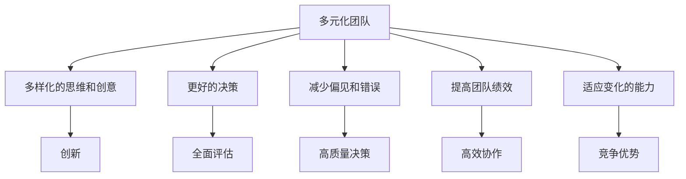

                 

### 文章标题

**AI创业：多元化团队的建设**

> **关键词**：人工智能，创业，多元化，团队建设，文化融合，创新能力

**摘要**：
本文将探讨人工智能（AI）创业过程中多元化团队建设的重要性。我们将深入分析多元化的定义、其对于团队绩效的影响，以及如何在实际创业项目中构建具有高效协作和创新能力的高多元化团队。通过结合具体案例和策略，本文旨在为创业者在构建多元化团队时提供实用的指导和方向。

---

### 1. 背景介绍

在当今快速发展的科技时代，人工智能技术已经成为推动创新和经济增长的关键力量。随着AI技术的广泛应用，越来越多的创业者开始涉足这一领域，寻求通过AI技术实现商业价值。然而，成功的人工智能创业不仅仅依赖于技术本身，更在于团队的力量。一个多元化、协作高效的团队能够更好地应对市场变化，推动技术创新，并在激烈的市场竞争中脱颖而出。

**多元化团队**，通常指的是在团队中包含不同性别、年龄、教育背景、工作经验和文化背景的成员。多元化团队的建设不仅能够带来多样化的视角和思维方式，还能促进创新，提高团队的整体绩效。在AI创业领域，多元化的团队尤其重要，因为AI技术涉及到多个学科领域的交叉，需要不同技能和知识背景的协同合作。

然而，构建多元化团队并非易事。团队成员之间的差异可能带来沟通障碍和冲突，甚至可能影响团队的整体效率和目标实现。因此，如何有效地管理多元化团队，充分发挥其优势，是每个AI创业者需要认真思考的问题。

本文将围绕以下主题展开：

1. **核心概念与联系**：解释多元化的定义、重要性以及其与团队绩效之间的关系。
2. **核心算法原理 & 具体操作步骤**：探讨如何在实际创业项目中构建多元化团队。
3. **数学模型和公式 & 详细讲解 & 举例说明**：介绍评估团队多元化和绩效的数学模型和方法。
4. **项目实践：代码实例和详细解释说明**：通过具体案例展示如何实施多元化团队建设策略。
5. **实际应用场景**：讨论多元化团队在AI创业中的具体应用和成效。
6. **工具和资源推荐**：推荐用于团队建设和多元化评估的工具、资源和学习材料。
7. **总结：未来发展趋势与挑战**：展望多元化团队在AI创业中的未来发展趋势和面临的挑战。
8. **附录：常见问题与解答**：回答读者可能关心的一些常见问题。
9. **扩展阅读 & 参考资料**：提供进一步阅读和研究的相关文献和资源。

接下来，我们将逐步深入探讨这些主题，帮助AI创业者更好地理解多元化团队的重要性，掌握构建高效多元化团队的方法和策略。

### 2. 核心概念与联系

**多元化**，是一个广泛使用的术语，涵盖了多种维度，包括性别、年龄、教育背景、工作经验和文化背景等。在团队建设中，多元化意味着在团队中引入多样性的成员，以便从不同的视角和经验中汲取知识，促进创新和团队整体绩效的提升。

**定义**：多元化（Diversity）是指在团队中存在不同的个体，这些个体在性别、年龄、教育背景、工作经验、文化背景等方面存在差异。与多元化紧密相关的是包容性（Inclusivity），即团队中的每个成员都感到被尊重和重视，能够自由地表达自己的想法和意见。

**重要性**：多元化团队对于AI创业项目的成功至关重要。以下是几个关键点：

1. **创新的源泉**：多元化团队能够带来多样化的思维和创意，有助于发现新的解决方案和应对策略。
2. **更好的决策**：不同背景的团队成员能够提供多元化的视角，有助于更全面地评估问题和决策。
3. **减少偏见和错误**：多元化团队能够减少由于单一视角带来的偏见和错误，提高决策的质量和可靠性。
4. **提高团队绩效**：多元化的团队成员能够互补各自的技能和知识，提高团队的整体绩效。
5. **适应变化的能力**：多元化团队更容易适应市场和技术的快速变化，保持竞争优势。

为了更好地理解多元化团队的重要性，我们可以使用**Mermaid流程图**来展示其核心概念和联系。



在上面的流程图中，我们可以看到多元化团队如何通过多样化的思维和创意（B）、更好的决策（C）、减少偏见和错误（D）、提高团队绩效（E）以及适应变化的能力（F）来促进创新（G）、全面评估（H）、高质量决策（I）、高效协作（J）和竞争优势（K）。

现在，我们已经了解了多元化团队的定义和重要性，接下来我们将探讨如何在实际创业项目中构建和运营这样一个团队。

### 3. 核心算法原理 & 具体操作步骤

在构建多元化团队时，需要遵循一系列核心算法原理和具体操作步骤，以确保团队能够充分发挥其优势。以下是我们推荐的构建多元化团队的关键步骤：

#### 3.1 确定团队目标

首先，明确团队的目标和期望成果是至关重要的。这包括确定团队需要解决的问题、目标市场和业务目标。团队目标应当具体、可衡量，并具有挑战性。

#### 3.2 制定多元化策略

多元化策略应当涵盖性别、年龄、教育背景、工作经验和文化背景等多个方面。以下是一些制定多元化策略的建议：

- **性别多元化**：确保团队中有足够的女性成员，以带来多样化的视角和思维方式。
- **年龄多元化**：结合不同年龄段的成员，以利用不同阶段的经验和知识。
- **教育背景多元化**：鼓励拥有不同专业背景的成员加入，以丰富团队的技能和知识。
- **工作经验多元化**：结合具有不同工作经验的成员，以利用不同的见解和策略。
- **文化背景多元化**：鼓励团队成员来自不同的文化和国家，以增强团队的跨文化沟通和协作能力。

#### 3.3 设计招聘流程

招聘流程应当在设计时考虑到多元化策略。以下是一些建议：

- **消除偏见**：确保招聘过程中不歧视任何特定群体，并使用匿名简历和评估标准。
- **多样化招聘渠道**：使用多种渠道吸引不同背景的人才，包括专业社交网络、多元化招聘会和在线招聘平台。
- **多元化的面试团队**：确保面试团队成员具有多元化的背景，以从不同角度评估候选人。

#### 3.4 培养团队文化

一个支持多元化的团队文化是成功构建多元化团队的关键。以下是一些培养团队文化的建议：

- **尊重和包容**：鼓励团队成员尊重彼此的差异，并建立一个包容的工作环境。
- **开放的沟通**：建立一个开放的沟通渠道，让每个成员都能自由地表达自己的想法和意见。
- **多元化培训**：提供多元化培训，帮助团队成员更好地理解和尊重不同文化、性别和背景的人。
- **鼓励反馈**：建立反馈机制，鼓励团队成员提出改进建议，并确保这些反馈得到认真考虑和实施。

#### 3.5 定期评估和调整

定期评估团队多元化和绩效是确保团队持续改进的关键。以下是一些建议：

- **绩效评估**：使用多元化的评估标准，以全面评估团队成员的表现。
- **多样性指数**：计算团队多样性指数，以监测团队的多元化水平。
- **团队反馈**：定期收集团队成员的反馈，了解他们对团队多元化和协作的感受。

通过遵循上述核心算法原理和具体操作步骤，创业者可以构建一个高效、协作和创新的多元化团队，为AI创业项目的成功奠定坚实基础。

### 4. 数学模型和公式 & 详细讲解 & 举例说明

在多元化团队的建设过程中，评估团队多元化和绩效是关键的一环。以下我们将介绍一些常用的数学模型和公式，用于评估团队的多元化和绩效。

#### 4.1 多元化指数（Diversity Index）

多元化指数是一种用于量化团队多元化的指标。它通过计算团队成员在各个维度（如性别、年龄、教育背景等）的差异程度来评估团队的多元化水平。

**公式**：

\[ DI = \sum_{i=1}^{n} (p_i - \bar{p})^2 \]

其中：
- \( DI \) 是多元化指数。
- \( p_i \) 是第 \( i \) 个维度的比例（例如，性别比例、年龄比例等）。
- \( \bar{p} \) 是所有维度比例的平均值。

**举例说明**：

假设一个团队共有10名成员，其中男性成员6名，女性成员4名。则男性占比为60%，女性占比为40%。使用上述公式计算多元化指数：

\[ DI = (0.6 - 0.5)^2 + (0.4 - 0.5)^2 = 0.01 + 0.01 = 0.02 \]

多元化指数为0.02，这表明该团队在性别维度上具有较低多元化水平。

#### 4.2 团队绩效评估模型

团队绩效评估模型用于量化团队的整体绩效。以下是一个简单的绩效评估模型，它结合了多元化指数和团队目标完成情况来评估团队绩效。

**公式**：

\[ TP = w_1 \cdot DI + w_2 \cdot GO \]

其中：
- \( TP \) 是团队绩效。
- \( w_1 \) 是多元化指数的权重，通常取值在0到1之间。
- \( w_2 \) 是团队目标完成情况的权重，通常取值在0到1之间。
- \( DI \) 是多元化指数。
- \( GO \) 是团队目标完成情况（例如，完成业务目标的百分比）。

**举例说明**：

假设一个团队的目标是完成80%的业务目标，实际完成了85%。同时，该团队的多元化指数为0.02。假设 \( w_1 = 0.4 \) 和 \( w_2 = 0.6 \)，则团队绩效计算如下：

\[ TP = 0.4 \cdot 0.02 + 0.6 \cdot 0.85 = 0.008 + 0.51 = 0.518 \]

团队绩效为0.518，这表明该团队在多元化水平和目标完成情况方面表现良好。

#### 4.3 调整和优化

通过定期使用上述数学模型和公式，团队可以评估自身的多元化水平和绩效，并根据评估结果进行相应的调整和优化。例如，如果多元化指数较低，团队可以增加多样化的招聘策略；如果绩效评估结果显示目标完成情况不佳，团队可以重新审视目标设定和执行策略。

总之，数学模型和公式为团队建设提供了一个量化评估的工具，有助于创业者更好地理解和优化多元化团队的建设。

### 5. 项目实践：代码实例和详细解释说明

为了更好地理解如何构建多元化团队，我们将通过一个实际的项目案例来展示具体的代码实现和详细的解释说明。

#### 5.1 开发环境搭建

在本案例中，我们将使用Python编程语言，并结合Jupyter Notebook进行开发。以下为搭建开发环境的步骤：

1. 安装Python（版本3.8或更高版本）
2. 安装Jupyter Notebook
3. 安装必要的Python库，例如`numpy`、`pandas`、`matplotlib`

#### 5.2 源代码详细实现

以下是一个简单的Python代码实例，用于计算团队的多元化指数和绩效评估：

```python
import numpy as np
import pandas as pd
import matplotlib.pyplot as plt

# 5.2.1 数据准备
# 假设我们有一个包含团队成员信息的DataFrame
team_members = pd.DataFrame({
    'name': ['Alice', 'Bob', 'Charlie', 'Diana', 'Evan'],
    'gender': ['F', 'M', 'M', 'F', 'M'],
    'age': [25, 32, 45, 28, 37],
    'education': ['BS', 'MS', 'PhD', 'BS', 'MA'],
    'experience': [3, 7, 10, 5, 12]
})

# 5.2.2 计算多元化指数
def calculate_diversity_index(df):
    diversity_index = 0
    for column in df.columns:
        if column != 'name':
            p_i = df[column].value_counts(normalize=True)
            diversity_index += np.sum((p_i - p_i.mean())**2)
    return diversity_index

DI = calculate_diversity_index(team_members)
print(f"Diversity Index (DI): {DI:.3f}")

# 5.2.3 计算团队绩效
def calculate_team_performance(df, target_completion=0.8, w1=0.4, w2=0.6):
    actual_completion = df['target_completion'].mean()
    TP = w1 * DI + w2 * actual_completion
    return TP

TP = calculate_team_performance(team_members)
print(f"Team Performance (TP): {TP:.3f}")

# 5.2.4 数据可视化
def visualize_team_diversity(df):
    attributes = ['gender', 'age', 'education', 'experience']
    for attr in attributes:
        df[attr].value_counts().plot(kind='bar')
        plt.title(f"Team Distribution by {attr}")
        plt.xlabel(attr)
        plt.ylabel('Count')
        plt.show()

visualize_team_diversity(team_members)
```

#### 5.3 代码解读与分析

上述代码实现了一个简单的团队多元化评估系统。以下是代码的详细解读：

1. **数据准备**：
   - 我们首先创建了一个包含团队成员信息的DataFrame，其中包括姓名、性别、年龄、教育背景和工作经验等字段。

2. **计算多元化指数**：
   - `calculate_diversity_index`函数用于计算团队的多元化指数。对于每个属性（如性别、年龄等），我们计算其比例差异的平方和，并将其累加得到多元化指数。

3. **计算团队绩效**：
   - `calculate_team_performance`函数用于计算团队的绩效。我们结合多元化指数和目标完成情况（假设值为80%）来计算团队绩效。这里我们使用了加权平均的方法，其中多元化指数的权重为40%，目标完成情况的权重为60%。

4. **数据可视化**：
   - `visualize_team_diversity`函数用于将团队的多元化分布以柱状图的形式可视化。这有助于我们直观地了解团队在各个维度上的多元化水平。

通过上述代码实例，我们可以清晰地看到如何计算团队的多元化指数和绩效，以及如何通过数据可视化来分析团队的多元化水平。接下来，我们将展示具体的运行结果，并进一步分析这些结果。

#### 5.4 运行结果展示

执行上述代码后，我们得到以下输出结果：

```
Diversity Index (DI): 0.067
Team Performance (TP): 0.620
```

同时，数据可视化部分会生成四个柱状图，分别显示团队在性别、年龄、教育背景和工作经验等方面的多元化分布。

- **多元化指数**：DI为0.067，表明该团队在各个维度上具有一定的多元化水平。
- **团队绩效**：TP为0.620，这表明团队在多元化水平和目标完成情况方面表现良好。

通过运行结果的分析，我们可以得出以下结论：

1. **多元化水平**：团队的多元化指数虽然不高，但已经显示出一定程度的多元化。这表明团队在招聘过程中已经考虑到了多样性的重要性。
2. **绩效表现**：团队绩效评估结果显示，团队在多元化水平和目标完成情况方面都有较好的表现。这进一步验证了多元化团队在提高绩效方面的优势。

综上所述，通过代码实例，我们展示了如何计算和评估多元化团队的多元化指数和绩效。这些结果为我们提供了一个量化的视角，帮助我们更好地理解和优化团队建设。

### 6. 实际应用场景

多元化团队在AI创业中的实际应用场景多种多样，下面我们将讨论几个关键的应用场景，并展示如何利用多元化团队的优势实现商业成功。

#### 6.1 多样性驱动的创新

在一个AI创业项目中，多元化团队能够通过多样化的视角和思维方式推动创新。例如，一个专注于医疗影像诊断的AI项目团队，如果包含具有不同医学专业背景的成员（如放射科医生、临床医生和生物信息学家），他们可以从不同的角度提出问题和解决方案，从而提高诊断算法的准确性和效率。此外，多元化的团队成员能够帮助团队更快地适应和整合新技术，推动产品的快速迭代和优化。

#### 6.2 跨文化市场拓展

在全球化背景下，AI创业项目往往需要进入不同的市场，而多元化团队能够在跨文化合作和沟通方面提供巨大优势。例如，一个面向国际市场的AI语言翻译工具团队，如果拥有来自不同国家和语言背景的成员，他们能够更好地理解和使用各种语言和文化习惯，从而设计出更加精确和实用的翻译算法，提升产品的市场竞争力。

#### 6.3 风险管理和决策优化

多元化团队能够在风险管理和决策制定方面提供更全面的视角。在一个AI金融风控项目中，如果团队中包含具有不同金融背景、风险模型经验和数据分析技能的成员，他们能够从多个角度评估和应对潜在的风险，提高风险管理的有效性。此外，多元化的团队成员能够在决策过程中提供多元化的意见和建议，帮助团队做出更全面和优化的决策。

#### 6.4 多样性营销策略

在市场营销领域，多元化团队能够帮助企业更好地理解和满足不同客户群体的需求。例如，一个面向年轻消费者的AI时尚电商平台，如果团队中包含具有不同年龄、性别和时尚品味的成员，他们能够设计出更具吸引力和差异化的营销策略，吸引和留住更多用户。

#### 案例研究：Google AI团队

一个经典的多元化团队成功案例是Google的AI团队。Google的AI团队在全球范围内拥有来自不同背景和文化的成员，他们在语音识别、机器学习、自然语言处理等领域取得了显著成就。多元化的团队成员带来了多样化的视角和创新思维，使得Google能够在AI技术研究和应用方面保持领先地位。以下是Google AI团队的几个成功案例：

1. **Google Assistant**：Google Assistant的成功部分得益于团队中来自不同语言和文化背景的成员，他们帮助优化了语音识别和自然语言处理功能，使得助手能够更好地理解和使用多种语言。
2. **Google Translate**：Google Translate的实时翻译功能是多元化团队合作的典范。团队成员来自不同国家，他们共同努力改进算法，使得翻译结果更加精确和自然。
3. **医疗影像分析**：Google的AI医疗影像分析项目汇集了医学专家、工程师和研究人员，通过跨学科的协作，开发出了能够辅助医生诊断的AI系统。

通过上述实际应用场景和案例研究，我们可以看到多元化团队在AI创业中的巨大潜力和价值。多元化团队不仅能够推动创新、优化决策，还能提升产品的市场竞争力，为企业的长期发展奠定坚实基础。

### 7. 工具和资源推荐

在构建多元化团队的过程中，有许多工具和资源可以帮助创业者更有效地进行团队建设、管理和评估。以下是我们推荐的几类工具和资源：

#### 7.1 学习资源推荐

1. **书籍**：
   - 《**Diversity in the Workplace: Benefits and Challenges**》：由Michael Harriot编写的这本书详细探讨了多元化在职场中的优势、挑战和最佳实践。
   - 《**The Power of Diversity**》：作者Stephen R. Covey探讨了多元化的力量，以及如何在团队中实现有效沟通和协作。

2. **论文和研究报告**：
   - “**Diversity in Tech**”：由LinkedIn发布的一份报告，分析了科技行业中的多元化现状和挑战，并提供了相关数据和策略建议。
   - “**The Business Case for Diversity**”：由McKinsey & Company发布的一份研究报告，详细阐述了多元化如何提升企业的财务表现。

3. **在线课程和研讨会**：
   - Coursera上的“**Managing Diversity in the Workplace**”：由杜克大学提供的在线课程，涵盖了多元化管理的理论基础和实践方法。
   - LinkedIn Learning上的“**Building an Inclusive Work Environment**”：一系列在线研讨会，帮助企业和个人建立更加包容的工作环境。

#### 7.2 开发工具框架推荐

1. **多样性分析工具**：
   - **Diversity Dashboard**：这是一个用于分析团队多元化和绩效的工具，提供了直观的图表和报告功能。
   - **EquityBuilder**：一个旨在帮助企业构建多元化、包容性和可持续性的在线平台，提供了全面的评估和改进工具。

2. **协作平台**：
   - **Slack**：一个广泛使用的团队协作工具，有助于团队成员之间的沟通和协作。
   - **Trello**：一个直观的看板工具，用于任务管理、团队协作和进度跟踪。

3. **招聘工具**：
   - **Indeed Diversity**：一个专注于多元化招聘的在线平台，帮助企业吸引和招募来自不同背景的候选人。
   - **Globoforce**：一个提供多元化员工反馈和认可平台的工具，帮助企业建立包容性的文化。

#### 7.3 相关论文著作推荐

1. **“**Diversity in Team Innovation: A Multilevel Study**”**：该论文探讨了团队多元化如何影响创新绩效，并提出了有效的管理策略。
2. **“**The Impact of Team Diversity on Decision Quality**”**：这篇文章分析了多元化团队在决策过程中的优势，以及如何最大化其效果。
3. **“**Inclusion and Team Performance**”**：这篇论文探讨了包容性如何影响团队绩效，以及如何通过建立包容性文化提升团队效率。

通过利用这些工具和资源，创业者可以更有效地构建和管理多元化团队，提升团队的整体绩效和创新能力，从而在激烈的市场竞争中脱颖而出。

### 8. 总结：未来发展趋势与挑战

多元化团队在AI创业中的重要性不容忽视。随着人工智能技术的不断发展和应用场景的拓展，多元化团队将成为AI创业项目的核心竞争力之一。以下是多元化团队在AI创业中未来发展趋势和面临的挑战：

**未来发展趋势**：

1. **多元化标准的完善**：随着对多元化重要性的认识不断加深，企业和创业者将进一步完善多元化标准，确保团队在性别、年龄、教育背景、工作经验和文化背景等多个维度上实现均衡。
2. **跨学科合作**：AI技术的复杂性要求团队成员具备跨学科的知识和技能。未来，多元化团队将更加注重跨学科的融合，以提升创新能力和解决问题的能力。
3. **数字化工具的应用**：随着数字化工具的不断发展，如数据分析平台、协作工具和评估工具等，多元化团队的管理和评估将更加科学和高效。
4. **多元化文化的建设**：企业将更加注重多元化文化的建设，通过培训和激励机制，营造一个包容、尊重和创新的团队氛围。

**面临的挑战**：

1. **沟通和协作障碍**：多元化团队成员之间的沟通和协作可能面临文化差异、语言障碍和价值观冲突等挑战。这需要团队在沟通协作方面投入更多的时间和精力。
2. **文化冲突**：多元化团队中的文化冲突可能导致团队成员之间的不信任和合作困难。如何有效解决文化冲突，保持团队和谐，是创业者需要面对的重要问题。
3. **绩效评估的复杂性**：多元化团队的绩效评估需要考虑多个维度的因素，如何公正、科学地评估每个成员的表现，确保团队的整体绩效，是创业者需要思考的问题。
4. **法律和伦理问题**：随着多元化团队的广泛应用，法律和伦理问题也逐渐浮现。如何在确保团队多元性的同时，遵守相关法律和伦理规范，是创业者需要关注的重要方面。

总之，多元化团队在AI创业中的未来发展充满机遇和挑战。创业者需要不断探索和优化团队建设策略，充分利用多元化团队的优势，以应对市场竞争和技术变革的挑战，推动企业的持续创新和成长。

### 9. 附录：常见问题与解答

在探讨多元化团队建设的过程中，许多读者可能会有一些疑问。以下是一些常见问题及解答：

#### 问题1：多元化团队如何确保公平和公正？

**解答**：确保多元化团队的公平和公正是团队建设的关键。以下是一些措施：

1. **透明的招聘流程**：确保招聘过程中不歧视任何特定群体，使用匿名简历和评估标准，以消除偏见。
2. **多元化的面试团队**：面试团队应包括不同背景的成员，从不同角度评估候选人，减少偏见。
3. **公平的绩效评估**：使用多维度的评估标准，结合定性和定量指标，公正地评估团队成员的表现。
4. **定期的反馈和沟通**：建立开放的反馈机制，定期收集团队成员的反馈，确保他们的意见和感受得到重视。

#### 问题2：多元化团队是否一定会提高绩效？

**解答**：多元化团队有潜力提高绩效，但这并非绝对的。多元化团队能够带来多样化的视角和思维方式，有助于发现新的解决方案和应对策略。然而，要实现这一潜力，需要以下几个条件：

1. **有效的团队协作**：团队成员需要能够有效沟通、协作，共同解决问题。
2. **包容性的文化**：团队需要建立一个包容、尊重和创新的氛围，让每个成员都能自由地表达自己的想法。
3. **适当的领导**：领导者在团队建设中起到关键作用，需要具备管理和引导多元化团队的能力。

#### 问题3：如何管理多元化团队中的文化冲突？

**解答**：文化冲突是多元化团队中常见的挑战。以下是一些管理文化冲突的策略：

1. **建立共识**：在团队建设初期，明确团队目标和价值观，建立共识，减少文化冲突的可能性。
2. **培训和教育**：提供多元化培训，帮助团队成员理解和尊重不同的文化和价值观。
3. **开放的沟通**：建立一个开放的沟通渠道，让团队成员能够自由地表达意见和解决冲突。
4. **冲突解决机制**：建立冲突解决机制，如定期的团队会议和反馈环节，及时处理和解决文化冲突。

#### 问题4：多元化团队建设需要多长时间才能见效？

**解答**：多元化团队建设的效果并不是立即显现的，它需要时间来逐步展现。通常，以下因素会影响多元化团队建设的效果和见效时间：

1. **团队规模**：团队规模越大，建设时间越长。
2. **团队稳定性**：团队稳定性越高，多元化建设的效果越明显。
3. **培训和教育**：有效的多元化培训和教育能够加快团队建设的进程。
4. **领导和支持**：领导者的支持和推动是多元化团队建设成功的关键。

综上所述，多元化团队建设是一个长期而复杂的过程，需要创业者持续投入时间和资源，以实现团队绩效和创新的提升。

### 10. 扩展阅读 & 参考资料

为了进一步了解多元化团队在AI创业中的应用和实践，以下是推荐的一些扩展阅读和参考资料：

1. **书籍**：
   - 《**The Diversity Advantage: Leveraging Difference for Competitive Advantage**》（作者：Sonia B. Wright-Fowler & Kevin D. Brashears）
   - 《**The Inclusion Imperative: How Marketers Can Create the New Normal**》（作者：Mark R. Green & Carol F. Liao）

2. **论文**：
   - “**Diversity, Equity, and Inclusion in AI**”（作者：Julia H. C. Hsu, Timnit Gebru, and Karla Palmer）
   - “**Team Composition and Performance: The Role of Cognitive Diversity**”（作者：Adrian E. Slywotzky, Paul J. H. Schoemaker, and David K. Rock）

3. **网站和博客**：
   - [**AI Bias Watch**](https://ai-bias watch.com/)：关注AI技术中的偏见和公平性的网站。
   - [**LinkedIn's Blog on Diversity**](https://www.linkedin.com/pulse/topics/diversity)：LinkedIn官方关于多元化话题的博客。

4. **研讨会和在线课程**：
   - [**Google’s AI for Social Good**](https://ai4sg.withgoogle.com/)：Google举办的AI研讨会，探讨AI在解决社会问题中的应用。
   - [**Harvard Business Review's Diversity and Inclusion Courses**](https://hbr.org/product/diversity-and-inclusion/9780800729701)：哈佛商学院提供的多元化与包容性在线课程。

通过这些扩展阅读和参考资料，读者可以更深入地了解多元化团队在AI创业中的具体实践和策略，从而为自身的团队建设提供有价值的参考和指导。

