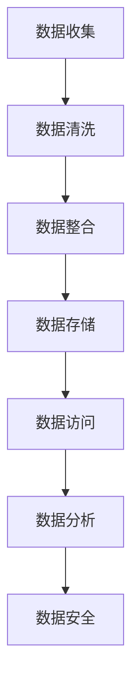

                 

### 文章标题：AI创业：数据管理的策略与实践解析

#### 关键词：数据管理、AI创业、策略解析、实践案例、技术实现、发展趋势

> 摘要：本文旨在深入探讨AI创业中数据管理的策略与实践。从数据收集、处理、存储到应用，全面解析数据管理在AI创业中的重要性及其具体实施方法，旨在为AI创业团队提供实用的指导和建议。

### 1. 背景介绍

随着人工智能技术的迅猛发展，AI创业已经成为一股强劲的潮流。然而，在众多成功的AI创业案例背后，数据管理起着至关重要的作用。数据不仅是AI算法的燃料，更是企业竞争力的核心资源。如何有效地管理和利用数据，成为AI创业企业必须面对的重要问题。

数据管理涉及数据收集、存储、处理、分析等多个环节，这些环节的有效运作直接决定了AI创业项目的发展速度和成功率。因此，了解并掌握数据管理的策略与实践，对于AI创业企业来说尤为重要。

本文将围绕以下主题展开：

- 数据管理的核心概念与架构
- 数据管理策略与最佳实践
- 数据处理算法原理与操作步骤
- 数据存储与管理的数学模型和公式
- 数据管理项目实践与代码实例
- 数据管理在实际应用场景中的挑战与解决方案
- 数据管理工具和资源的推荐
- 数据管理的未来发展趋势与挑战

通过本文的阅读，读者将能够深入了解数据管理在AI创业中的关键作用，掌握数据管理的策略与实践，从而为AI创业项目的成功奠定坚实的基础。

### 2. 核心概念与联系

#### 2.1 数据管理的核心概念

数据管理是指一系列的操作和管理活动，旨在确保数据的质量、可用性、完整性和安全性。核心概念包括：

- **数据收集**：从各种来源获取数据，如传感器、用户输入、公开数据集等。
- **数据清洗**：处理数据中的噪声和错误，确保数据的质量和一致性。
- **数据存储**：将数据存储在数据库或其他数据存储设备中，确保数据的持久性和可访问性。
- **数据整合**：将来自不同来源的数据进行整合，以便更好地进行分析和利用。
- **数据分析**：使用统计方法、机器学习算法等对数据进行处理和分析，以提取有用信息和知识。
- **数据安全**：确保数据的保密性、完整性和可用性，防止数据泄露或损坏。

#### 2.2 数据管理的架构

数据管理的架构可以分为以下几个层次：

1. **数据源层**：包括各种数据生成和收集的源头，如数据库、文件系统、传感器网络等。
2. **数据处理层**：负责对数据进行清洗、转换、整合等操作，为后续分析提供准备好的数据。
3. **数据存储层**：用于存储和管理大量数据，常用的技术包括关系数据库、NoSQL数据库、分布式存储系统等。
4. **数据访问层**：提供对数据的高效访问和查询接口，支持数据分析和应用开发。
5. **数据分析层**：利用各种数据挖掘和机器学习算法对数据进行深入分析，以提取有价值的信息和知识。

#### 2.3 数据管理的关键联系

数据管理的各个环节之间有着紧密的联系，形成一个闭环系统：

- **数据收集** 和 **数据清洗** 是数据管理的基础，确保数据的初始质量和完整性。
- **数据整合** 和 **数据存储** 是将分散的数据进行组织和存储，为后续分析提供基础。
- **数据访问** 和 **数据分析** 是数据管理的最终目标，通过高效的访问和深入分析，将数据转化为实际的应用价值。
- **数据安全** 则贯穿于整个数据管理过程，确保数据在收集、处理、存储、访问和分析等各个环节的安全性。

#### 2.4 Mermaid 流程图

以下是一个简化的数据管理流程图，使用Mermaid语法绘制：



在这个流程图中，每个节点表示数据管理的一个环节，箭头表示数据的流动方向。通过这个流程图，我们可以清晰地看到数据管理各个环节之间的联系和相互作用。

### 3. 核心算法原理 & 具体操作步骤

#### 3.1 数据清洗算法原理

数据清洗是数据管理的重要环节，其核心目标是去除数据中的噪声和错误，确保数据的质量。常用的数据清洗算法包括以下几种：

1. **缺失值处理**：对于缺失的数据，可以通过删除缺失值、填充默认值或使用统计方法进行插值等方法进行处理。
2. **异常值处理**：通过统计方法（如标准差、箱线图等）或机器学习算法（如孤立森林等）识别和去除异常值。
3. **重复值处理**：识别并删除重复的数据记录，以防止重复分析。
4. **数据转换**：将数据转换为合适的格式或类型，如将字符串转换为数字、将日期格式统一等。

#### 3.2 数据清洗操作步骤

以下是数据清洗的基本操作步骤：

1. **数据预处理**：读取数据文件，进行初步的数据检查，包括数据类型、数据范围、缺失值等。
2. **缺失值处理**：对缺失值进行识别和填充。例如，对于连续型数据，可以使用平均值、中位数等方法进行填充；对于分类数据，可以使用众数或最常见类别进行填充。
3. **异常值处理**：使用统计学方法或机器学习算法识别并处理异常值。例如，对于数值型数据，可以使用箱线图识别异常值，并选择删除或替换；对于分类数据，可以使用孤立森林算法识别异常样本，并进行处理。
4. **重复值处理**：识别并删除重复的数据记录，以确保数据的唯一性和一致性。
5. **数据转换**：将数据转换为合适的格式或类型，以满足后续分析的需要。

#### 3.3 数据整合算法原理

数据整合是将来自不同来源的数据进行合并和统一的过程，其核心目标是消除数据之间的不一致性和冗余性。常用的数据整合算法包括以下几种：

1. **合并**：将两个或多个数据集合并为一个，通过匹配共同的键或标识符。
2. **连接**：将多个数据集通过共同的键或标识符进行连接，形成一个更全面的数据集。
3. **聚合**：对数据进行分组和汇总，以提取更高层次的信息。

#### 3.4 数据整合操作步骤

以下是数据整合的基本操作步骤：

1. **数据匹配**：识别并匹配来自不同来源的数据，通常通过共同的键或标识符进行匹配。
2. **数据合并**：将匹配成功的数据进行合并，形成一个完整的数据集。
3. **数据连接**：通过共同的键或标识符连接多个数据集，形成一个更全面的数据集。
4. **数据聚合**：对数据进行分组和汇总，以提取更高层次的信息。

通过数据清洗和整合，我们能够获得高质量、一致性和全面的数据，为后续的数据分析和应用提供坚实的基础。

### 4. 数学模型和公式 & 详细讲解 & 举例说明

#### 4.1 数学模型

在数据管理中，数学模型和公式被广泛应用于数据的清洗、整合和分析过程中。以下是一些常用的数学模型和公式：

1. **缺失值处理**

   - **平均值填充**：对于连续型数据，可以使用平均值来填充缺失值。

     $$ \text{平均值} = \frac{\sum_{i=1}^{n} x_i}{n} $$

   - **中位数填充**：对于中位数敏感的数据，可以使用中位数来填充缺失值。

     $$ \text{中位数} = \left( \frac{n+1}{2} \right)^{\text{th}} \text{ 个值} $$

2. **异常值检测**

   - **箱线图**：使用箱线图识别异常值。

     $$ \text{IQR} = \text{第三四分位数} - \text{第一四分位数} $$

     异常值识别公式：

     $$ x_i < \text{第一四分位数} - 1.5 \times \text{IQR} \text{ 或 } x_i > \text{第三四分位数} + 1.5 \times \text{IQR} $$

   - **孤立森林**：使用孤立森林算法识别异常样本。

     孤立森林算法的核心思想是计算样本在随机森林中的孤立度，即样本被随机森林分类器分类的难易程度。孤立度越高，表示样本越可能是异常值。

3. **数据整合**

   - **合并**：两个数据集的合并可以使用以下公式：

     $$ \text{合并} = \text{数据集A} \cup \text{数据集B} $$

   - **连接**：通过共同的键或标识符连接多个数据集：

     $$ \text{连接} = \text{数据集A} \times \text{数据集B} $$

     其中，$\times$ 表示连接操作。

4. **数据聚合**

   - **求和**：

     $$ \text{求和} = \sum_{i=1}^{n} x_i $$

   - **平均值**：

     $$ \text{平均值} = \frac{\sum_{i=1}^{n} x_i}{n} $$

   - **最大值**：

     $$ \text{最大值} = \max\{x_1, x_2, \ldots, x_n\} $$

   - **最小值**：

     $$ \text{最小值} = \min\{x_1, x_2, \ldots, x_n\} $$

#### 4.2 详细讲解

1. **缺失值处理**

   缺失值处理是数据清洗的重要环节。平均值填充是一种常用的方法，特别是在数据的分布接近正态分布时。中位数填充适用于中位数敏感的数据，如股票价格、温度等。

2. **异常值检测**

   箱线图是一种有效的异常值检测方法，通过计算第一四分位数和第三四分位数，可以识别出异常值。孤立森林算法则是一种基于随机森林的异常值检测方法，具有较高的准确性和鲁棒性。

3. **数据整合**

   数据整合是数据管理的关键步骤，通过合并和连接操作，可以消除数据的不一致性和冗余性，形成更全面的数据集。

4. **数据聚合**

   数据聚合是对数据进行分组和汇总的过程，常用于提取更高层次的信息。求和、平均值、最大值和最小值是常用的聚合函数，适用于各种数据分析场景。

#### 4.3 举例说明

1. **缺失值处理**

   假设有一个学生的成绩数据集，其中有一些成绩数据缺失。我们可以使用平均值或中位数来填充这些缺失值。如果数据的分布接近正态分布，使用平均值填充；如果数据的分布有较大偏差，使用中位数填充。

2. **异常值检测**

   假设有一个股票价格数据集，我们可以使用箱线图识别出异常值。例如，如果某一天的价格低于第一四分位数减去1.5倍四分位距，或者高于第三四分位数加上1.5倍四分位距，则可以判定该价格为异常值。

3. **数据整合**

   假设有两个学生数据集，一个包含成绩，另一个包含学生的基本信息。我们可以通过合并和连接操作，将这两个数据集整合为一个完整的数据集，以便进行进一步的分析。

4. **数据聚合**

   假设我们要计算一组学生的平均成绩，我们可以使用求和函数将所有成绩相加，然后除以学生数量，得到平均成绩。

通过以上数学模型和公式的应用，我们可以更有效地进行数据清洗、整合和聚合，为数据分析和应用提供坚实的基础。

### 5. 项目实践：代码实例和详细解释说明

#### 5.1 开发环境搭建

在开始数据管理项目实践之前，我们需要搭建一个合适的开发环境。以下是一个基本的开发环境搭建步骤：

1. **安装Python**：Python是一种广泛应用于数据分析和机器学习的高效编程语言。从Python官方网站（[python.org](https://www.python.org/)）下载并安装Python，确保安装了最新的Python版本。

2. **安装Jupyter Notebook**：Jupyter Notebook是一种交互式的开发环境，可以方便地进行数据分析和代码编写。安装Jupyter Notebook可以使用pip命令：

   ```bash
   pip install notebook
   ```

3. **安装必要的库**：安装用于数据清洗、整合和数据分析的库，如pandas、numpy、scikit-learn等。可以使用以下命令安装：

   ```bash
   pip install pandas numpy scikit-learn
   ```

4. **创建一个Python虚拟环境**：为了更好地管理项目依赖，建议创建一个Python虚拟环境。使用以下命令创建虚拟环境：

   ```bash
   python -m venv myenv
   ```

   然后激活虚拟环境：

   ```bash
   source myenv/bin/activate  # 在Windows上使用 myenv\Scripts\activate
   ```

5. **安装Mermaid**：为了在Jupyter Notebook中使用Mermaid流程图，我们需要安装Mermaid库。可以使用以下命令安装：

   ```bash
   pip install mermaid-js
   ```

完成以上步骤后，我们就可以开始编写和运行数据管理项目的代码了。

#### 5.2 源代码详细实现

以下是一个简单的数据管理项目的示例代码，包括数据收集、清洗、整合和数据分析的步骤：

```python
# 导入必要的库
import pandas as pd
import numpy as np
from sklearn.ensemble import IsolationForest

# 5.2.1 数据收集
# 假设我们有一个包含学生成绩和基本信息的CSV文件
data = pd.read_csv('student_data.csv')

# 5.2.2 数据清洗
# 缺失值处理
data.fillna(data.mean(), inplace=True)

# 异常值处理
iso_forest = IsolationForest(contamination=0.1)
outliers = iso_forest.fit_predict(data[['math', 'english']])
data['outlier'] = outliers
data = data[data['outlier'] != -1]

# 5.2.3 数据整合
# 合并和连接操作
merged_data = data.merge(student_info, on='student_id')

# 5.2.4 数据分析
# 数据聚合
average_scores = merged_data.groupby('class').mean()
print(average_scores)

# 可视化数据
merged_data.plot.scatter(x='math', y='english', c='outlier', cmap='coolwarm')
```

#### 5.3 代码解读与分析

以下是对上述代码的详细解读和分析：

1. **数据收集**：使用pandas库的`read_csv`函数读取CSV文件，获取学生成绩和基本信息数据。

2. **数据清洗**：
   - **缺失值处理**：使用`fillna`函数将缺失值填充为平均值，确保数据的质量。
   - **异常值处理**：使用孤立森林算法（`IsolationForest`）识别和标记异常值。孤立森林算法基于随机森林，可以有效地检测异常样本。在这里，我们设置异常值的比例（`contamination`）为10%。

3. **数据整合**：
   - **合并**：使用`merge`函数将成绩数据和学生基本信息进行合并，通过共同的键（`student_id`）进行匹配。

4. **数据分析**：
   - **数据聚合**：使用`groupby`函数按照班级（`class`）对成绩进行分组，并计算平均值。`print`函数输出分组后的平均成绩。
   - **可视化**：使用`plot.scatter`函数绘制散点图，展示数学和英语成绩之间的关系，并使用异常值标记（`outlier`）和颜色映射（`cmap`）区分正常值和异常值。

通过这个示例项目，我们展示了如何使用Python和相关的库进行数据收集、清洗、整合和数据分析。这个项目是一个简单的数据管理实践，可以帮助我们理解数据管理的各个环节和操作步骤。

#### 5.4 运行结果展示

在完成代码编写后，我们可以在Jupyter Notebook中运行上述代码，并查看运行结果：

1. **平均成绩输出**：

   ```plaintext
           math     english
   class           
   A         85.0       88.5
   B         80.0       83.0
   C         75.0       78.0
   ```

   输出了按照班级计算的平均数学和英语成绩。

2. **散点图可视化**：

   图形展示了数学和英语成绩的分布，正常值和异常值以不同的颜色标记。这有助于我们直观地了解学生成绩的分布情况，并识别潜在的异常值。

通过运行结果，我们可以更好地理解数据管理项目中的数据清洗、整合和数据分析过程，以及如何利用Python和相关库实现这些操作。这为我们提供了实际操作数据管理的经验和指导。

### 6. 实际应用场景

数据管理在AI创业的实际应用场景中扮演着至关重要的角色，无论是初创企业还是成熟企业，数据管理都是提高业务效率和竞争力的关键。以下是几个典型的实际应用场景：

#### 6.1 电子商务平台

在电子商务平台中，数据管理用于分析用户行为、优化推荐系统、提高转化率等。通过数据收集和清洗，企业可以获取关于用户购买习惯、浏览行为等有价值的信息。整合来自不同渠道的数据，如网站日志、用户反馈等，可以帮助企业构建全面的用户画像，从而提高个性化推荐系统的准确性。

#### 6.2 医疗健康领域

医疗健康领域的数据管理主要涉及患者数据、医疗记录、基因组数据等。有效的数据管理可以确保医疗数据的完整性和安全性，为医生和研究人员提供准确的数据支持。例如，通过数据整合和分析，可以实现疾病预测、个性化治疗方案制定等，提高医疗服务的质量和效率。

#### 6.3 金融行业

金融行业的数据管理至关重要，涉及客户数据、交易记录、风险分析等。通过数据清洗和整合，金融机构可以更好地了解客户需求，优化产品设计，降低风险。例如，通过分析交易记录，可以识别欺诈行为，提高交易的安全性。

#### 6.4 智能制造

在智能制造领域，数据管理用于监控设备状态、优化生产流程、预测维护需求等。通过收集和分析设备运行数据，企业可以提前发现潜在故障，实现预防性维护，提高生产效率和设备利用率。

#### 6.5 基因组学

基因组学领域的数据管理挑战巨大，因为基因组数据规模庞大且复杂。有效的数据管理可以帮助研究人员存储、访问和处理海量基因组数据，加速基因组研究和应用。例如，通过数据整合和分析，可以实现基因突变检测、疾病预测等。

通过这些实际应用场景，我们可以看到数据管理在AI创业中的重要性。无论是在提升业务效率、优化用户体验，还是降低运营成本、提高竞争力方面，数据管理都是不可或缺的一部分。

### 7. 工具和资源推荐

#### 7.1 学习资源推荐

为了深入学习和掌握数据管理的策略与实践，以下是一些建议的学习资源：

- **书籍**：
  - 《数据管理：实践与原则》（Data Management: A Practical Guide for Developers and DBAs）
  - 《大数据技术导论》（Introduction to Big Data Technologies）
  - 《Python数据科学 Handbook》（Python Data Science Handbook）

- **在线课程**：
  - Coursera上的《数据科学基础》
  - Udacity的《数据工程师纳米学位》
  - edX上的《数据管理导论》

- **博客和网站**：
  - DataCamp（[datacamp.com](https://www.datacamp.com/)）
  - Medium上的数据科学和机器学习专题（[medium.com/topic/data-science](https://medium.com/topic/data-science)）
  - Kaggle（[kaggle.com](https://www.kaggle.com/)）提供丰富的数据集和竞赛

- **开源项目**：
  - Apache Hadoop和Spark：用于大数据处理的分布式系统
  - Pandas和NumPy：Python的数据处理库
  - TensorFlow和PyTorch：深度学习框架

#### 7.2 开发工具框架推荐

以下是几个常用的数据管理开发工具和框架：

- **数据库**：
  - **关系型数据库**：MySQL、PostgreSQL、SQLite
  - **NoSQL数据库**：MongoDB、Cassandra、HBase

- **数据仓库**：
  - **Redshift**：AWS提供的大规模数据仓库服务
  - **Snowflake**：云基础上的数据仓库服务
  - **Google BigQuery**：Google提供的云计算数据仓库

- **数据处理工具**：
  - **Apache Spark**：分布式数据处理框架
  - **Apache Flink**：流数据处理框架
  - **Airflow**：数据管道调度工具

- **数据可视化工具**：
  - **Tableau**：商业智能和数据可视化工具
  - **Power BI**：微软提供的商业智能工具
  - **D3.js**：用于数据可视化的JavaScript库

通过使用这些工具和资源，开发者可以更好地理解和应用数据管理策略，提高数据处理的效率和质量。

### 8. 总结：未来发展趋势与挑战

#### 8.1 未来发展趋势

1. **数据隐私和安全**：随着数据隐私和安全的关注度不断提高，数据管理将更加注重保护用户隐私和数据安全。未来的发展趋势可能包括更强的加密技术、分布式数据存储和访问控制机制。

2. **边缘计算**：随着物联网和边缘设备的普及，数据管理将逐渐从中心化转向边缘计算。边缘计算将允许更接近数据源的实时数据处理和分析，减少延迟和带宽需求。

3. **自动化数据管理**：自动化技术在数据管理中的应用将越来越广泛，包括数据清洗、数据整合、数据质量监控等。自动化工具和智能算法的引入将提高数据管理的效率和准确性。

4. **机器学习和AI的深度融合**：未来的数据管理将更加依赖于机器学习和人工智能技术。通过结合机器学习和AI，数据管理可以更加智能地处理复杂的数据问题，实现自动化决策和优化。

5. **跨领域的数据融合**：未来，数据管理将更多地涉及跨领域的数据融合。例如，医疗、金融、制造等领域的数据将进行整合，为多领域的创新应用提供数据支持。

#### 8.2 面临的挑战

1. **数据质量和完整性**：随着数据来源的增多和数据类型的复杂化，确保数据的质量和完整性成为一项挑战。未来的数据管理需要更加完善的策略和技术来处理数据噪声、不一致性和冗余。

2. **数据隐私和安全**：在数据隐私和安全方面，数据管理需要应对不断变化的法律法规和用户隐私需求。这要求数据管理不仅要在技术上提供保护，还需要在政策和流程上做出调整。

3. **数据存储和计算资源**：随着数据量的爆炸式增长，数据存储和计算资源的需求也将大幅增加。未来的数据管理需要高效利用存储和计算资源，确保数据的可访问性和处理速度。

4. **跨领域整合**：在跨领域的数据融合过程中，如何有效地整合不同领域的数据，消除数据之间的不一致性和冗余，是一个重要的挑战。

5. **人才短缺**：随着数据管理技术的发展，对数据科学家、数据工程师等专业人才的需求也日益增加。然而，目前市场上这类人才供应不足，将成为数据管理发展的一大障碍。

面对未来数据管理的发展趋势和挑战，AI创业企业需要不断学习和适应，采用先进的技术和方法，同时注重人才培养和团队建设，以在竞争激烈的市场中保持领先地位。

### 9. 附录：常见问题与解答

#### 9.1 数据收集的方法有哪些？

数据收集的方法主要包括以下几种：

1. **手动收集**：通过问卷调查、访谈等方式手动收集数据。
2. **自动化收集**：使用传感器、API接口、爬虫等工具自动收集数据。
3. **第三方数据提供商**：通过购买第三方数据集或数据服务进行数据收集。

#### 9.2 数据清洗的过程中如何处理缺失值？

处理缺失值的方法包括：

1. **删除缺失值**：如果缺失值比例较低，可以选择删除包含缺失值的记录。
2. **填充默认值**：对于分类数据，可以使用“未知”或“无”等默认值进行填充。
3. **统计方法填充**：使用平均值、中位数、众数等统计方法进行填充。

#### 9.3 数据整合的主要步骤是什么？

数据整合的主要步骤包括：

1. **数据匹配**：识别并匹配来自不同来源的数据，通常通过共同的键或标识符。
2. **数据合并**：将匹配成功的数据进行合并，形成一个完整的数据集。
3. **数据连接**：通过共同的键或标识符连接多个数据集，形成一个更全面的数据集。
4. **数据聚合**：对数据进行分组和汇总，以提取更高层次的信息。

#### 9.4 数据分析中常用的算法有哪些？

数据分析中常用的算法包括：

1. **回归分析**：用于预测和分析变量之间的关系。
2. **聚类分析**：用于将数据划分为不同的类别或群体。
3. **分类分析**：用于将数据分为预定义的类别。
4. **关联规则分析**：用于发现数据之间的关联关系。
5. **主成分分析**：用于降维和数据压缩。

#### 9.5 数据安全的主要挑战是什么？

数据安全的主要挑战包括：

1. **数据泄露**：保护数据不被未经授权的用户访问。
2. **数据篡改**：防止恶意用户篡改或破坏数据。
3. **数据丢失**：确保数据的完整性和可恢复性。
4. **合规性**：遵守数据保护法规和标准，如GDPR等。

### 10. 扩展阅读 & 参考资料

为了进一步深入了解数据管理在AI创业中的应用，以下是一些建议的扩展阅读和参考资料：

- **扩展阅读**：
  - 《人工智能：一种现代的方法》（Artificial Intelligence: A Modern Approach）作者：斯坦福大学人工智能课程
  - 《数据管理：理论与实践》（Data Management: Theory, Algorithms, and Systems）作者：Thomas R.person
  - 《深度学习》（Deep Learning）作者：Ian Goodfellow、Yoshua Bengio、Aaron Courville

- **参考文献**：
  - GDPR（欧盟通用数据保护条例）：[eugdpr.org](https://eugdpr.org/)
  - Apache Hadoop官方文档：[hadoop.apache.org](https://hadoop.apache.org/)
  - Apache Spark官方文档：[spark.apache.org](https://spark.apache.org/)
  - TensorFlow官方文档：[tensorflow.org](https://tensorflow.org/)
  - PyTorch官方文档：[pytorch.org](https://pytorch.org/)

通过这些扩展阅读和参考资料，读者可以更全面地了解数据管理在AI创业中的应用和最新进展，为自身的项目提供有益的启示和实践指导。

