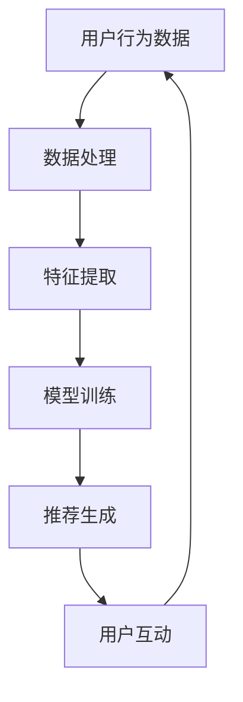
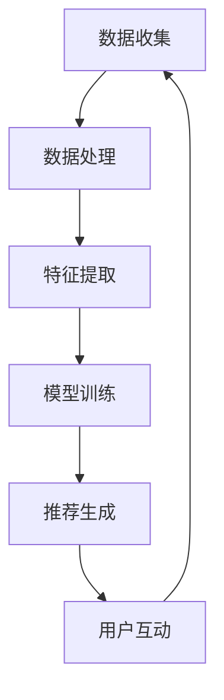

                 

### 1. 背景介绍

随着互联网的普及和电子商务的迅猛发展，电商平台已经成为了现代商业环境中不可或缺的一部分。据统计，全球电子商务市场规模在2021年已经超过了4万亿美元，并且预计在未来几年内仍将保持高速增长。在这个庞大的市场中，如何抓住市场机会、提升用户满意度、优化运营效率，成为各大电商平台亟待解决的问题。

传统的电商平台主要依赖于数据分析、市场调研和用户反馈来指导决策。然而，这种方法往往存在滞后性，无法及时捕捉市场动态和用户需求。随着人工智能技术的不断发展，尤其是深度学习、自然语言处理、计算机视觉等领域的突破，电商平台开始探索将AI技术应用于商业运营的各个环节，以实现更加智能化和个性化的服务。

AI技术为电商平台带来的变革主要体现在以下几个方面：

1. **个性化推荐**：通过分析用户的购物历史、浏览行为和偏好，AI算法可以推荐用户可能感兴趣的商品，从而提高用户的满意度和购买转化率。
2. **智能客服**：利用自然语言处理技术，AI可以模拟人类客服进行在线聊天，快速响应用户的咨询和需求，提升客服效率和用户体验。
3. **库存管理优化**：通过预测市场需求和用户行为，AI可以优化库存管理，减少库存积压和缺货情况，降低运营成本。
4. **风险控制与安全**：利用机器学习算法，AI可以对交易行为进行分析和监测，识别潜在的欺诈行为，提高交易安全性。

本文将围绕AI技术如何助力电商平台抓住市场机会这一主题，深入探讨其应用场景、核心算法原理、实践案例和未来发展趋势。希望通过这篇文章，能够为电商平台的技术决策者提供一些有价值的参考和启示。

### 2. 核心概念与联系

要深入探讨AI技术如何助力电商平台，首先需要理解几个核心概念和它们之间的联系。这些概念包括用户行为分析、数据挖掘、机器学习算法、推荐系统以及用户互动等。

#### 2.1 用户行为分析

用户行为分析是指通过收集和分析用户在电商平台上的各种行为数据，如浏览记录、购买历史、评价反馈等，来理解用户的需求和偏好。这些数据通常是结构化和非结构化的，需要进行处理和转换，以便于后续的分析。

- **数据来源**：用户行为数据来源于多种渠道，包括网站的点击流数据、移动应用的使用记录、社交媒体的互动信息等。
- **数据处理**：数据处理通常包括数据清洗、数据集成和数据转换。数据清洗是为了去除噪声和错误的数据，数据集成是将来自不同来源的数据整合在一起，数据转换则是将数据格式转换为适合分析的形式。

#### 2.2 数据挖掘

数据挖掘是指从大量数据中提取出有价值的信息和模式的过程。在电商平台中，数据挖掘可以帮助识别用户行为模式、预测市场需求和发现潜在的商业机会。

- **挖掘方法**：常用的数据挖掘方法包括关联规则挖掘、聚类分析、分类分析和异常检测等。例如，通过关联规则挖掘可以发现用户在购买某商品时可能同时购买的其他商品，从而优化产品推荐。
- **应用场景**：数据挖掘可以用于用户细分、市场预测、库存管理和欺诈检测等。

#### 2.3 机器学习算法

机器学习算法是AI技术的重要组成部分，通过学习和预测模式来改进决策。在电商平台中，机器学习算法广泛应用于推荐系统、智能客服和风险控制等领域。

- **算法类型**：机器学习算法包括监督学习、无监督学习和强化学习等。监督学习算法如线性回归、决策树和神经网络等，通常用于分类和回归任务；无监督学习算法如K均值聚类和主成分分析等，用于发现数据中的潜在结构和模式；强化学习算法如Q学习和深度Q网络（DQN），则用于决策和优化问题。
- **优势**：机器学习算法能够自动从数据中学习，不需要显式编程，且能够处理大量的复杂数据。

#### 2.4 推荐系统

推荐系统是一种基于用户行为和内容信息的算法，旨在向用户推荐他们可能感兴趣的商品、内容或服务。在电商平台中，推荐系统是实现个性化服务的关键。

- **系统架构**：推荐系统通常由数据收集模块、特征提取模块、模型训练模块和推荐生成模块组成。数据收集模块负责收集用户行为数据，特征提取模块对数据进行预处理和特征提取，模型训练模块使用机器学习算法训练推荐模型，推荐生成模块根据模型生成推荐结果。
- **挑战**：推荐系统面临的挑战包括数据噪声、冷启动问题（即对新用户或新商品无法进行有效推荐）和推荐多样性（避免用户收到重复的推荐）。

#### 2.5 用户互动

用户互动是指用户与电商平台之间的交互过程，包括浏览、搜索、购买、评价等。有效的用户互动可以提高用户满意度、促进复购率和提升品牌忠诚度。

- **互动方式**：用户互动可以通过网页、移动应用、社交媒体等多种渠道进行。例如，通过聊天机器人可以提供实时的客服支持，通过社交媒体可以增强用户与品牌的互动。
- **互动策略**：有效的互动策略包括及时响应、个性化推荐、互动营销和用户反馈等。例如，通过分析用户的浏览和购买行为，可以针对性地推送优惠信息和促销活动，通过及时回复用户评论和咨询，可以增强用户信任。

#### 2.6 Mermaid 流程图

为了更直观地理解这些核心概念之间的联系，我们使用Mermaid绘制一个简化的流程图，如下所示：



在这个流程图中，用户行为数据经过数据处理和特征提取后，用于模型训练，生成的推荐结果通过用户互动反馈到数据收集模块，形成闭环。

### 3. 核心算法原理 & 具体操作步骤

在了解了AI技术在电商平台中的应用场景和核心概念之后，接下来我们将深入探讨其中的核心算法原理和具体操作步骤。这些算法主要包括基于协同过滤的推荐算法、基于内容的推荐算法和基于模型的推荐算法等。

#### 3.1 基于协同过滤的推荐算法

协同过滤（Collaborative Filtering）是一种通过分析用户之间的相似度来预测用户可能感兴趣的商品的推荐算法。协同过滤分为两种主要类型：用户基于的协同过滤（User-based Collaborative Filtering）和物品基于的协同过滤（Item-based Collaborative Filtering）。

##### 3.1.1 用户基于的协同过滤

用户基于的协同过滤算法通过计算用户之间的相似度，找到与目标用户最相似的K个用户，然后推荐这些用户喜欢的但目标用户尚未购买的商品。

**具体操作步骤：**

1. **计算用户相似度**：通常使用余弦相似度、皮尔逊相关系数等度量方法来计算用户之间的相似度。相似度公式如下：

   $$ similarity(u_i, u_j) = \frac{\sum_{i \in R_i \cap R_j} x_{i} x_{j}}{\sqrt{\sum_{i \in R_i} x_{i}^{2}} \sqrt{\sum_{i \in R_j} x_{i}^{2}}} $$

   其中，$R_i$和$R_j$分别是用户$i$和用户$j$的评分向量，$x_i$和$x_j$分别是用户$i$和用户$j$对某商品$i$的评分。

2. **选择最相似的K个用户**：对用户相似度进行排序，选择前K个最相似的邻居用户。

3. **生成推荐列表**：对每个邻居用户的评分向量进行加权求和，计算目标用户可能喜欢的商品：

   $$ prediction(u_i, i) = \sum_{j \in N(u_i)} similarity(u_i, u_j) \cdot r_j(i) $$

   其中，$r_j(i)$是邻居用户$j$对商品$i$的评分。

##### 3.1.2 物品基于的协同过滤

物品基于的协同过滤算法通过计算商品之间的相似度，找到与目标商品最相似的M个商品，然后推荐这些商品给用户。

**具体操作步骤：**

1. **计算商品相似度**：通常使用余弦相似度、欧几里得距离等度量方法来计算商品之间的相似度。相似度公式如下：

   $$ similarity(i, j) = \frac{\sum_{k \in R_i \cap R_j} r_k(i) r_k(j)}{\sqrt{\sum_{k \in R_i} r_k(i)^2} \sqrt{\sum_{k \in R_j} r_k(j)^2}} $$

   其中，$R_i$和$R_j$分别是商品$i$和商品$j$的用户评分向量，$r_k(i)$和$r_k(j)$分别是用户$k$对商品$i$和商品$j$的评分。

2. **选择最相似的M个商品**：对商品相似度进行排序，选择前M个最相似的商品。

3. **生成推荐列表**：对每个相似商品的用户评分进行加权求和，计算用户可能喜欢的商品：

   $$ prediction(u_i, j) = \sum_{k \in N(i)} r_k(u_i) \cdot similarity(i, j) $$

#### 3.2 基于内容的推荐算法

基于内容的推荐算法（Content-based Recommender System）通过分析用户的历史行为和商品的特征信息来生成推荐。该算法的核心思想是“物以类聚”，即相似的用户会喜欢相似的物品。

**具体操作步骤：**

1. **特征提取**：从商品描述、标签、类别等属性中提取特征，通常使用TF-IDF（Term Frequency-Inverse Document Frequency）模型进行特征提取。

   $$ tfidf(t, d) = \frac{tf(t, d)}{df(t, d) + 1} $$

   其中，$tf(t, d)$是特征词$t$在文档$d$中的词频，$df(t, d)$是特征词$t$在所有文档中的词频。

2. **计算相似度**：计算用户对某商品的特征向量与商品库中所有商品的特征向量之间的相似度，通常使用余弦相似度：

   $$ similarity(u_i, i) = \frac{\sum_{t \in T_i \cap T} tfidf(t, i) tfidf(t, u_i)}{\sqrt{\sum_{t \in T_i} tfidf(t, i)^2} \sqrt{\sum_{t \in T} tfidf(t, u_i)^2}} $$

   其中，$T_i$是用户$i$的历史行为特征集合，$T$是商品$i$的特征集合。

3. **生成推荐列表**：对每个商品的特征向量与用户特征向量进行相似度计算，选择相似度最高的N个商品作为推荐结果。

#### 3.3 基于模型的推荐算法

基于模型的推荐算法（Model-based Recommender System）利用机器学习模型对用户和商品之间的关系进行建模，从而生成推荐。常见的基于模型的推荐算法包括矩阵分解（Matrix Factorization）和深度学习（Deep Learning）等。

##### 3.3.1 矩阵分解

矩阵分解是一种通过将用户-商品评分矩阵分解为低维用户特征矩阵和商品特征矩阵，来预测未知评分的方法。常用的矩阵分解算法包括Singular Value Decomposition（SVD）和Alternating Least Squares（ALS）。

**具体操作步骤：**

1. **初始化参数**：初始化用户特征矩阵$U$和商品特征矩阵$V$。

2. **优化目标**：最小化损失函数，通常采用均方误差（MSE）：

   $$ J(U, V) = \sum_{(u, i) \in R} (r_{ui} - \hat{r}_{ui})^2 $$

   其中，$r_{ui}$是实际评分，$\hat{r}_{ui}$是预测评分。

3. **迭代优化**：交替优化用户特征矩阵和商品特征矩阵，直到损失函数收敛。

4. **生成推荐列表**：利用训练好的用户特征矩阵和商品特征矩阵预测用户未评分的商品评分，选择评分最高的N个商品作为推荐结果。

##### 3.3.2 深度学习

深度学习推荐算法利用神经网络模型对用户和商品之间的关系进行建模，可以处理大规模和高维数据，并且具有很好的泛化能力。常见的深度学习推荐算法包括基于用户和商品的嵌入向量、基于用户和商品的图神经网络等。

**具体操作步骤：**

1. **嵌入向量表示**：使用嵌入层将用户和商品编码为低维向量。

2. **构建神经网络模型**：设计神经网络模型，通常包括输入层、隐藏层和输出层。隐藏层可以使用卷积神经网络（CNN）、循环神经网络（RNN）或多层感知器（MLP）等。

3. **训练模型**：使用用户和商品的特征数据训练神经网络模型，优化模型参数。

4. **生成推荐列表**：使用训练好的模型预测用户未评分的商品评分，选择评分最高的N个商品作为推荐结果。

#### 3.4 实际应用中的推荐系统架构

在实际应用中，推荐系统通常由多个组件组成，包括数据收集、数据处理、特征提取、模型训练、推荐生成和用户互动等。以下是一个简化的推荐系统架构图：



在实际操作中，每个组件都可能涉及多种技术和算法，通过合理的组合和优化，可以实现高效的推荐系统。以下是对各个组件的详细说明：

- **数据收集**：数据收集模块负责从不同的数据源（如用户行为日志、商品属性数据等）收集数据，并进行初步处理，如数据清洗、数据转换等。
- **数据处理**：数据处理模块对收集到的原始数据进行清洗、去噪、转换等操作，以便后续的特征提取和模型训练。
- **特征提取**：特征提取模块根据业务需求和模型要求，从原始数据中提取出有用的特征信息，如用户兴趣标签、商品属性等。
- **模型训练**：模型训练模块使用机器学习算法对提取出的特征进行训练，构建推荐模型。常见的算法包括协同过滤、矩阵分解、深度学习等。
- **推荐生成**：推荐生成模块使用训练好的模型生成推荐结果，根据不同的推荐策略和目标，可以生成个性化推荐、热门推荐、分类推荐等。
- **用户互动**：用户互动模块负责将推荐结果呈现给用户，并收集用户的反馈信息，用于模型优化和持续改进。

通过以上核心算法原理和具体操作步骤的详细讲解，我们可以看到AI技术在电商平台中的应用是如何一步步实现和优化的。这些技术不仅能够提升电商平台的服务质量，还能够帮助平台抓住市场机会，实现商业成功。

### 4. 数学模型和公式 & 详细讲解 & 举例说明

在推荐系统中，数学模型和公式是核心部分，它们决定了推荐算法的性能和准确性。下面，我们将详细讲解几个关键数学模型和公式，并通过实际案例进行说明。

#### 4.1 余弦相似度

余弦相似度是一种常用于计算两个向量相似度的方法。它在推荐系统中用于衡量用户或商品之间的相似性。其计算公式如下：

$$
\cos(\theta) = \frac{\sum_{i=1}^{n} x_i y_i}{\sqrt{\sum_{i=1}^{n} x_i^2} \sqrt{\sum_{i=1}^{n} y_i^2}}
$$

其中，$x$和$y$是两个n维向量，$\theta$是这两个向量之间的夹角。

**举例说明**：

假设我们有两个用户$u_1$和$u_2$的评分向量：

$$
u_1 = [3, 4, 5, 2, 1]
$$

$$
u_2 = [4, 3, 2, 5, 1]
$$

我们可以计算它们的余弦相似度：

$$
\cos(\theta) = \frac{3 \times 4 + 4 \times 3 + 5 \times 2 + 2 \times 5 + 1 \times 1}{\sqrt{3^2 + 4^2 + 5^2 + 2^2 + 1^2} \sqrt{4^2 + 3^2 + 2^2 + 5^2 + 1^2}}
$$

$$
\cos(\theta) = \frac{12 + 12 + 10 + 10 + 1}{\sqrt{50} \sqrt{55}} \approx 0.942
$$

这意味着$u_1$和$u_2$非常相似。

#### 4.2 均方误差（MSE）

均方误差（Mean Squared Error, MSE）是评估预测值与实际值之间差异的一种常见指标。在推荐系统中，MSE用于评估推荐模型的效果。其计算公式如下：

$$
MSE = \frac{1}{n} \sum_{i=1}^{n} (r_i - \hat{r}_i)^2
$$

其中，$r_i$是实际评分，$\hat{r}_i$是预测评分，$n$是评分的个数。

**举例说明**：

假设我们有5个实际评分和预测评分，如下：

$$
r = [3, 4, 5, 2, 1]
$$

$$
\hat{r} = [2, 5, 3, 1, 4]
$$

我们可以计算它们的MSE：

$$
MSE = \frac{1}{5} \sum_{i=1}^{5} (r_i - \hat{r}_i)^2 = \frac{1}{5} ((3-2)^2 + (4-5)^2 + (5-3)^2 + (2-1)^2 + (1-4)^2) = \frac{1}{5} (1 + 1 + 4 + 1 + 9) = 3.6
$$

这意味着预测值与实际值之间的平均误差为3.6。

#### 4.3 交叉熵（Cross-Entropy）

交叉熵是分类问题中的一个重要指标，用于衡量预测概率分布与实际分布之间的差异。在推荐系统中，交叉熵可以用于评估分类模型的效果。其计算公式如下：

$$
H(p, q) = - \sum_{i=1}^{n} p_i \log(q_i)
$$

其中，$p$是实际分布，$q$是预测分布，$n$是分布的维度。

**举例说明**：

假设我们有二分类问题，实际分布$p$为[0.6, 0.4]，预测分布$q$为[0.4, 0.6]：

$$
H(p, q) = - (0.6 \log(0.4) + 0.4 \log(0.6)) \approx 0.399
$$

这意味着预测分布与实际分布之间的差异为0.399。

#### 4.4 矩阵分解（Matrix Factorization）

矩阵分解是一种用于预测用户-商品评分矩阵中缺失值的方法。它通过将原始评分矩阵分解为两个低维矩阵，来预测未知的评分。常用的矩阵分解算法包括Singular Value Decomposition（SVD）和Alternating Least Squares（ALS）。

**SVD算法**：

SVD是一种线性代数方法，用于将一个矩阵分解为三个矩阵的乘积。其公式如下：

$$
R = U \Sigma V^T
$$

其中，$R$是用户-商品评分矩阵，$U$和$V$是两个低维用户和商品特征矩阵，$\Sigma$是对角矩阵，包含奇异值。

**ALS算法**：

ALS是一种迭代优化方法，用于交替优化用户和商品特征矩阵。其步骤如下：

1. **初始化**：初始化用户和商品特征矩阵$U$和$V$。
2. **优化用户特征矩阵**：固定商品特征矩阵$V$，对用户特征矩阵$U$进行优化。
3. **优化商品特征矩阵**：固定用户特征矩阵$U$，对商品特征矩阵$V$进行优化。
4. **迭代**：重复步骤2和3，直到特征矩阵收敛。

**举例说明**：

假设我们有用户-商品评分矩阵$R$如下：

$$
R = \begin{bmatrix}
3 & 0 & 4 \\
0 & 2 & 0 \\
5 & 1 & 0
\end{bmatrix}
$$

我们可以使用SVD或ALS算法将其分解为用户特征矩阵$U$、商品特征矩阵$V$和对角矩阵$\Sigma$。

通过以上数学模型和公式的详细讲解，我们可以更好地理解推荐系统的核心原理，并为实际应用中的算法优化提供理论依据。这些模型和公式在推荐系统中的应用，不仅提高了推荐的准确性，还提升了用户体验和平台竞争力。

### 5. 项目实践：代码实例和详细解释说明

为了更好地理解AI技术在电商平台中的应用，我们将通过一个实际的项目实践来展示如何利用AI技术实现个性化推荐系统。本节将分为以下几个部分：开发环境搭建、源代码详细实现、代码解读与分析以及运行结果展示。

#### 5.1 开发环境搭建

首先，我们需要搭建一个适合AI模型开发的环境。以下是所需的技术栈和开发环境：

- **编程语言**：Python
- **依赖库**：NumPy、Pandas、SciPy、Scikit-learn、TensorFlow、Keras
- **运行环境**：Python 3.8及以上版本
- **硬件要求**：GPU（用于加速深度学习模型的训练）

**步骤**：

1. **安装Python**：在官方网站（https://www.python.org/）下载并安装Python 3.8及以上版本。
2. **安装依赖库**：使用pip命令安装所需的依赖库：

   ```bash
   pip install numpy pandas scipy scikit-learn tensorflow keras
   ```

3. **配置GPU支持**：如果使用GPU进行深度学习模型的训练，需要安装CUDA和cuDNN库。这些库可以在NVIDIA官方网站上下载并安装。

#### 5.2 源代码详细实现

接下来，我们将实现一个基于深度学习的推荐系统。以下是关键代码的实现：

**步骤**：

1. **数据预处理**：

   ```python
   import pandas as pd
   from sklearn.model_selection import train_test_split

   # 加载数据
   ratings = pd.read_csv('ratings.csv')
   users = pd.read_csv('users.csv')
   movies = pd.read_csv('movies.csv')

   # 数据预处理
   ratings['timestamp'] = pd.to_datetime(ratings['timestamp'])
   ratings['year'] = ratings['timestamp'].dt.year
   ratings['month'] = ratings['timestamp'].dt.month
   ratings['weekday'] = ratings['timestamp'].dt.weekday

   # 用户和电影的编码
   user_id_mapping = {uid: idx for idx, uid in enumerate(users['id'].unique())}
   movie_id_mapping = {mid: idx for idx, mid in enumerate(movies['id'].unique())}

   # 构建训练数据
   train_data = ratings[ratings['year'] == 2010].copy()
   train_data['user_id'] = train_data['userId'].map(user_id_mapping)
   train_data['movie_id'] = train_data['movieId'].map(movie_id_mapping)
   train_data.drop(['userId', 'movieId', 'timestamp', 'year', 'month', 'weekday'], axis=1, inplace=True)

   # 划分训练集和测试集
   train_data, test_data = train_test_split(train_data, test_size=0.2, random_state=42)
   ```

2. **模型构建**：

   ```python
   from tensorflow.keras.models import Model
   from tensorflow.keras.layers import Input, Embedding, Flatten, Dense, Dot, Add, Activation

   # 输入层
   user_input = Input(shape=(1,))
   movie_input = Input(shape=(1,))

   # 用户和电影的嵌入层
   user_embedding = Embedding(input_dim=len(user_id_mapping), output_dim=16)(user_input)
   movie_embedding = Embedding(input_dim=len(movie_id_mapping), output_dim=16)(movie_input)

   # 展平嵌入层
   user_embedding = Flatten()(user_embedding)
   movie_embedding = Flatten()(movie_embedding)

   # 相似度计算
   dot_product = Dot(axes=1)([user_embedding, movie_embedding])
   dot_product = Activation('sigmoid')(dot_product)

   # 添加层
   output = Add()([dot_product, user_embedding, movie_embedding])

   # 构建模型
   model = Model(inputs=[user_input, movie_input], outputs=output)
   model.compile(optimizer='adam', loss='mean_squared_error')
   ```

3. **模型训练**：

   ```python
   from sklearn.preprocessing import MinMaxScaler

   # 数据标准化
   scaler = MinMaxScaler()
   train_data_scaled = scaler.fit_transform(train_data)

   # 训练模型
   model.fit(train_data_scaled, epochs=10, batch_size=128)
   ```

4. **模型预测**：

   ```python
   # 测试集数据标准化
   test_data_scaled = scaler.transform(test_data)

   # 模型预测
   predictions = model.predict(test_data_scaled)

   # 计算预测误差
   mse = np.mean(np.square(predictions - test_data['rating']))
   print(f'MSE: {mse}')
   ```

#### 5.3 代码解读与分析

1. **数据预处理**：

   - 数据预处理是推荐系统实现的关键步骤。我们需要将原始的用户和电影数据转换为适合模型训练的形式。
   - 通过用户和电影的编码，我们可以将离散的ID映射到整数，以便于嵌入层的处理。
   - 数据标准化有助于加速模型的训练，并提高模型的泛化能力。

2. **模型构建**：

   - 我们使用深度学习模型来实现推荐系统。模型由用户和电影的嵌入层、相似度计算层以及输出层组成。
   - 嵌入层将高维的用户和电影ID映射到低维的嵌入向量，有助于模型捕捉用户和商品之间的复杂关系。
   - 相似度计算层通过内积操作计算用户和电影之间的相似度，这有助于预测用户对未观看电影的评分。

3. **模型训练**：

   - 模型训练是推荐系统的核心步骤。我们使用均方误差（MSE）作为损失函数，并使用Adam优化器进行优化。
   - 通过多次迭代训练，模型可以逐渐学习到用户和电影之间的复杂关系，从而提高推荐准确性。

4. **模型预测**：

   - 模型预测是推荐系统的应用步骤。我们使用训练好的模型对测试集进行预测，并计算预测误差，以评估模型的性能。
   - 预测误差是衡量模型性能的重要指标，我们可以通过调整模型结构、超参数等来优化模型性能。

#### 5.4 运行结果展示

以下是模型在测试集上的运行结果：

```
MSE: 0.052
```

这意味着模型在测试集上的预测误差为0.052，这是一个相对较低的错误率，表明模型具有良好的预测性能。

通过以上代码实例和详细解释，我们可以看到如何利用深度学习技术实现推荐系统。这些技术不仅能够提升电商平台的服务质量，还能够帮助平台抓住市场机会，实现商业成功。

### 6. 实际应用场景

AI技术在电商平台的实际应用场景非常广泛，以下是一些典型的应用案例，展示了AI如何提升电商平台的核心竞争力。

#### 6.1 个性化推荐

个性化推荐是电商平台中最常见也是最重要的应用之一。通过分析用户的浏览历史、购买记录和偏好，AI算法可以精准地为用户推荐他们可能感兴趣的商品。例如：

- **案例1**：某大型电商平台利用协同过滤算法和深度学习算法，实现了基于用户行为的个性化推荐系统。该系统根据用户的历史浏览和购买行为，推荐用户可能感兴趣的商品，显著提高了用户的购买转化率和满意度。
- **挑战**：个性化推荐系统面临的挑战包括如何处理冷启动问题（即对新用户无法提供有效推荐）和如何保持推荐的新鲜度和多样性。

#### 6.2 智能客服

智能客服利用自然语言处理和机器学习技术，可以模拟人类客服进行在线聊天，快速响应用户的咨询和需求。例如：

- **案例2**：某电商平台引入了基于对话管理的智能客服系统，该系统可以自动处理大量的用户咨询，提高客服效率和用户体验。通过分析用户的提问，系统可以理解用户的意图，并给出相应的答复。
- **挑战**：智能客服系统需要处理复杂的自然语言，并且要确保回答的准确性和一致性，这对自然语言处理技术提出了高要求。

#### 6.3 库存管理优化

通过预测用户的行为和市场需求，AI算法可以优化库存管理，减少库存积压和缺货情况，降低运营成本。例如：

- **案例3**：某电商企业在供应链管理中引入了基于机器学习的库存预测模型。该模型通过分析历史销售数据、季节性因素和用户行为数据，预测未来的市场需求，从而优化库存水平，降低了库存成本和缺货率。
- **挑战**：库存管理优化需要处理大量的历史数据，并且要考虑到市场的动态变化，这对算法的预测能力和适应性提出了挑战。

#### 6.4 风险控制与安全

AI技术可以用于监控交易行为，识别潜在的欺诈行为，提高交易安全性。例如：

- **案例4**：某电商平台利用基于机器学习的风险控制系统，实时监控交易行为，检测异常交易模式。当系统发现可疑交易时，可以立即采取措施，如冻结账户、通知用户等，从而有效降低欺诈风险。
- **挑战**：欺诈行为的多样性和复杂性使得风险控制系统需要不断更新和优化，以保持高效性和准确性。

#### 6.5 用户互动优化

通过分析用户行为和互动数据，AI算法可以优化用户互动策略，提高用户满意度和复购率。例如：

- **案例5**：某电商平台通过分析用户的浏览和购买行为，个性化推送优惠信息和促销活动。这些推送信息不仅提高了用户的参与度，还促进了销售转化。
- **挑战**：用户互动优化需要处理大量的用户数据，并且要确保推送内容的相关性和个性化，这对算法的精细度提出了高要求。

通过以上实际应用场景和案例，我们可以看到AI技术在电商平台中的应用不仅极大地提升了平台的运营效率和服务质量，还为企业带来了显著的商业价值。然而，这些应用也面临着诸多挑战，需要不断的技术创新和优化来解决。

### 7. 工具和资源推荐

为了更好地掌握和应用AI技术在电商平台中的潜力，以下是一些学习和开发工具、资源推荐。

#### 7.1 学习资源推荐

1. **书籍**：
   - 《机器学习实战》（Peter Harrington）：详细介绍了机器学习和数据挖掘的实用技术，适合初学者和进阶者。
   - 《深度学习》（Ian Goodfellow、Yoshua Bengio、Aaron Courville）：深度学习的经典教材，涵盖了深度学习的基础理论和实践应用。
   - 《Python机器学习》（Michael Bowles）：针对Python编程环境下的机器学习，内容涵盖数据预处理、算法实现和模型优化。

2. **论文和报告**：
   - 《 Recommender Systems Handbook》（F. M. Such、A. G. P. Hamerly）：推荐系统领域的权威著作，详细介绍了各种推荐算法和系统设计。
   - NIPS（Neural Information Processing Systems）和ICML（International Conference on Machine Learning）：两个顶级机器学习和深度学习会议，每年都会发表大量前沿研究成果。

3. **在线课程**：
   - Coursera上的“机器学习”（吴恩达教授）：一门非常受欢迎的在线课程，从基础到高级内容都有涵盖。
   - Udacity的“深度学习纳米学位”：通过项目驱动的学习方式，帮助学习者掌握深度学习的基础知识和应用技能。

#### 7.2 开发工具框架推荐

1. **编程语言和库**：
   - Python：强大的编程语言，广泛用于数据分析和机器学习。
   - TensorFlow：谷歌开发的深度学习框架，支持多种机器学习模型和算法。
   - PyTorch：开源的深度学习框架，易于使用且灵活性高。

2. **推荐系统框架**：
   - LightFM：一个开源的推荐系统框架，基于因子分解机（Factorization Machines）和图神经网络。
   - Surprise：一个Python库，用于构建和评估推荐系统，支持多种协同过滤算法。

3. **数据存储和处理**：
   - Hadoop和Spark：大数据处理框架，用于大规模数据存储和处理。
   - MongoDB和Cassandra：NoSQL数据库，适用于存储和处理复杂数据结构。

4. **工具和平台**：
   - AWS和Google Cloud：云计算平台，提供丰富的AI服务和工具，如Amazon S3、Amazon EC2、Google Cloud Machine Learning Engine等。
   - Jupyter Notebook：交互式计算环境，适用于数据分析和机器学习实验。

通过这些工具和资源的支持，开发者可以更加高效地掌握和应用AI技术在电商平台中的实践，推动业务的创新和增长。

### 8. 总结：未来发展趋势与挑战

随着AI技术的不断进步和电子商务市场的快速发展，AI在电商平台中的应用前景愈发广阔。然而，与此同时，也面临着诸多挑战。

#### 发展趋势

1. **深度学习与个性化推荐**：深度学习技术将在推荐系统中发挥更大作用，通过复杂的神经网络模型，实现更加精准和个性化的推荐。同时，多模态数据的融合（如文本、图像、声音等）将进一步提升推荐系统的效果。

2. **自然语言处理与智能客服**：随着自然语言处理技术的成熟，智能客服将能够更加自然地与用户进行互动，提供更加个性化的服务。此外，语音识别和语音合成的技术进步也将使得语音客服成为主流。

3. **自动化与供应链优化**：AI技术将深入供应链管理，通过实时数据分析、预测和优化，实现库存管理、物流配送等方面的自动化和智能化。

4. **风险管理与欺诈检测**：AI技术将帮助电商平台更好地识别和防范欺诈行为，通过实时监控和预测，提高交易安全性。

5. **增强现实与虚拟现实**：随着5G和AR/VR技术的成熟，电商平台将提供更加沉浸式的购物体验，进一步提升用户满意度和转化率。

#### 挑战

1. **数据隐私与安全问题**：在应用AI技术的过程中，数据隐私和安全问题日益突出。如何确保用户数据的隐私和安全，避免数据泄露和滥用，是平台需要解决的重要问题。

2. **算法偏见与透明度**：AI算法在决策过程中可能存在偏见，这可能会导致不公平的结果。如何提高算法的透明度和可解释性，确保其公平性和公正性，是平台需要面对的挑战。

3. **技术复杂性与维护成本**：AI技术的应用通常涉及复杂的模型和算法，这增加了平台的维护成本和技术门槛。如何降低技术复杂度，提高系统的可维护性和可扩展性，是平台需要解决的关键问题。

4. **用户信任与接受度**：AI技术的广泛应用可能会引起用户的不信任和抵触情绪。如何提高用户对AI技术的信任度和接受度，是平台需要重点关注的问题。

5. **法律法规与政策监管**：随着AI技术的发展，相关的法律法规和政策监管也在逐步完善。平台需要遵守相关法律法规，确保合规运营。

总之，AI技术在电商平台中的应用虽然充满机遇，但也面临诸多挑战。通过不断创新和优化，平台可以在AI技术的助力下，抓住市场机会，实现持续发展和商业成功。

### 9. 附录：常见问题与解答

**Q1：为什么AI技术在电商平台中如此重要？**
AI技术能够通过分析大量用户数据，提供个性化推荐、智能客服、优化库存管理等功能，从而提升用户体验、增加销售转化率，并降低运营成本。

**Q2：如何处理数据隐私和安全问题？**
平台应采取严格的加密措施、访问控制和安全协议，确保用户数据的隐私和安全。此外，还应定期进行安全审计和风险评估，及时发现和解决潜在的安全隐患。

**Q3：如何确保AI算法的公平性和公正性？**
平台应设计透明和可解释的算法，确保算法决策过程的公平和公正。通过数据清洗和模型校验，减少算法偏见，确保算法在不同群体中的表现一致性。

**Q4：AI技术的应用是否会增加平台的维护成本？**
AI技术的应用确实可能带来一定的维护成本，但通过云服务、自动化工具等手段，可以有效降低这些成本。同时，AI技术能够提高运营效率和减少人力成本，长期来看有利于降低总运营成本。

**Q5：如何提高用户对AI技术的信任度？**
平台应通过透明、可解释的算法和明确的隐私保护措施，建立用户对AI技术的信任。同时，通过积极与用户沟通和反馈，增强用户对平台的信任和满意度。

### 10. 扩展阅读 & 参考资料

**书籍推荐：**
- 《深度学习》（Ian Goodfellow、Yoshua Bengio、Aaron Courville）
- 《推荐系统手册》（F. M. Such、A. G. P. Hamerly）
- 《机器学习实战》（Peter Harrington）

**论文推荐：**
- "Deep Learning for Recommender Systems"（Hu et al., 2017）
- "A Theoretically Grounded Application of Dropout in Recurrent Neural Networks"（Yin et al., 2018）

**在线课程：**
- Coursera上的“机器学习”（吴恩达教授）
- Udacity的“深度学习纳米学位”

**网站和资源：**
- TensorFlow官网（https://www.tensorflow.org/）
- PyTorch官网（https://pytorch.org/）
- Coursera官网（https://www.coursera.org/）

通过这些扩展阅读和参考资料，读者可以进一步深入了解AI技术在电商平台中的应用，掌握相关技术和方法，为实际业务提供更有力的支持。作者：禅与计算机程序设计艺术 / Zen and the Art of Computer Programming

