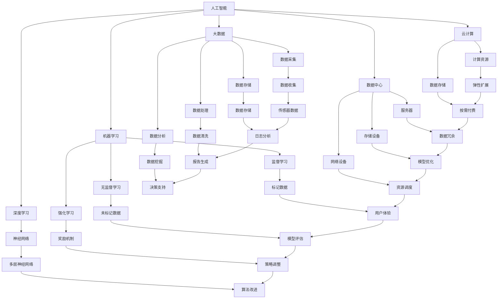

                 

### 1. 背景介绍

**AI国家战略的资源体系建设**这一主题，旨在探讨人工智能（AI）在国家层面的战略部署与资源整合。随着AI技术的迅猛发展，其在各行业中的应用日益广泛，从医疗、金融到教育、交通，AI正成为推动社会进步的重要力量。

当前，全球范围内，各国纷纷将AI视为新一轮科技革命和产业变革的制高点，美国、欧盟、中国等主要经济体纷纷制定了一系列AI国家战略，以期在AI领域占据领先地位。资源体系建设作为AI国家战略的重要环节，关乎技术落地、产业协同和人才培养。

资源体系建设的重要性体现在以下几个方面：

1. **技术创新驱动**：资源体系建设为AI技术创新提供了坚实的基础。通过构建完善的AI技术研发平台、数据中心和实验环境，可以促进技术突破和原创性成果的产生。

2. **产业协同发展**：资源体系有助于不同行业、不同企业之间的协同合作。通过共享技术资源、数据资源和人才资源，可以实现产业链的深度融合，推动AI技术的产业化应用。

3. **人才培养与储备**：资源体系建设为人才培养提供了有力支持。通过建立AI教育培训体系、创新实验室和实践基地，可以培养一大批高素质的AI人才，为AI技术发展提供持续动力。

4. **国际合作与竞争**：资源体系建设有助于提升国家在国际AI竞争中的地位。通过积极参与国际合作、技术交流和标准制定，可以增强国家在AI领域的国际影响力和话语权。

本文将围绕AI国家战略的资源体系建设，从核心概念、算法原理、数学模型、项目实践、应用场景等多个维度进行深入探讨，旨在为我国AI资源体系的建设提供有益参考。

### 2. 核心概念与联系

在深入探讨AI国家战略的资源体系建设之前，我们需要明确一些核心概念和它们之间的相互联系。以下是本文中的核心概念及其简要介绍：

#### 2.1 人工智能（AI）

人工智能是指由人制造出的系统，这些系统能够通过学习、推理和自我修正等方式，完成通常需要人类智能才能完成的任务。AI技术主要分为两大类：基于规则的系统和基于数据的学习系统。前者依赖于预定义的规则和逻辑，后者则通过从大量数据中学习模式和规律来实现智能行为。

#### 2.2 机器学习（ML）

机器学习是人工智能的核心组成部分，专注于从数据中学习模式并作出预测或决策。它主要分为监督学习、无监督学习和强化学习等类型。监督学习依赖于已标记的训练数据，无监督学习则通过未标记的数据发现隐藏结构，强化学习则通过奖励机制进行自我改进。

#### 2.3 深度学习（DL）

深度学习是机器学习的一个重要分支，它模仿人脑的神经网络结构，通过多层神经网络对数据进行处理。深度学习在图像识别、自然语言处理和语音识别等领域取得了显著的成果。

#### 2.4 大数据（Big Data）

大数据指的是海量、多样性和快速变化的数据。大数据技术包括数据采集、存储、处理和分析等环节，通过对大数据的处理和分析，可以挖掘出有价值的信息和知识。

#### 2.5 云计算（Cloud Computing）

云计算提供了灵活、高效、可扩展的计算资源，使得数据存储和处理变得更加便捷。通过云计算平台，用户可以按需获取计算资源，降低IT成本，提高资源利用效率。

#### 2.6 数据中心（Data Center）

数据中心是用于存储、处理和管理大量数据的物理或虚拟设施。数据中心通常包括服务器、存储设备和网络设备，通过高效的数据中心管理，可以实现数据的高效存储、快速访问和可靠保护。

#### 2.7 人工智能平台（AI Platform）

人工智能平台是为AI项目开发和部署提供的一整套工具和服务的集合。AI平台通常包括开发环境、算法库、数据管理工具和模型部署工具等，通过这些工具和服务，可以简化AI项目开发流程，提高开发效率。

#### 2.8 人工智能产业链（AI Industry Chain）

人工智能产业链包括研发、制造、应用和服务等多个环节。从硬件设备、基础软件到应用解决方案，人工智能产业链各环节紧密相连，共同推动AI技术的发展和应用。

#### 2.9 人才培养与储备（Talent Development and Reservoir）

人才培养与储备是AI资源体系的重要组成部分。通过建立教育培训体系、创新实验室和实践基地，可以培养一大批高素质的AI人才，为AI技术发展提供持续动力。

#### 2.10 国际合作与竞争（International Cooperation and Competition）

国际合作与竞争是AI资源体系建设中的重要方面。通过积极参与国际合作、技术交流和标准制定，可以增强国家在AI领域的国际影响力和话语权。

为了更直观地理解这些核心概念之间的联系，我们使用Mermaid流程图来展示它们之间的关系：



通过上述核心概念的介绍和Mermaid流程图，我们可以看到AI国家战略的资源体系建设是如何围绕这些核心概念展开的。资源体系建设不仅要关注技术创新，还要考虑产业协同、人才培养和国际竞争等多方面因素，以实现AI技术的全面发展和广泛应用。

### 3. 核心算法原理 & 具体操作步骤

在AI国家战略的资源体系建设中，核心算法原理起着至关重要的作用。以下我们将详细探讨几种核心算法的原理及其具体操作步骤，包括神经网络、监督学习和强化学习等。

#### 3.1 神经网络原理

神经网络（Neural Networks）是深度学习的基础，其灵感来自于人脑神经元的工作原理。神经网络由大量相互连接的节点（称为神经元）组成，每个神经元接收多个输入信号，通过加权求和处理后产生输出信号。具体操作步骤如下：

1. **数据预处理**：对输入数据进行标准化处理，使其具备相同的特征尺度，以便于模型训练。
   
2. **初始化参数**：为神经网络中的权重和偏置初始化合适的值，常用的初始化方法有高斯分布初始化和随机初始化。

3. **前向传播**：输入数据通过网络的各个层，每层神经元接收上一层神经元的输出作为输入，通过激活函数（如Sigmoid、ReLU等）进行非线性变换。

4. **反向传播**：根据输出结果与实际结果的误差，通过反向传播算法更新网络的权重和偏置。

5. **优化目标函数**：使用梯度下降等优化算法最小化目标函数（如均方误差、交叉熵等），以提升模型的预测准确性。

6. **迭代训练**：重复前向传播和反向传播的过程，直到模型收敛或达到预定的训练次数。

#### 3.2 监督学习原理

监督学习（Supervised Learning）是一种通过已有标签数据进行训练，从而预测新数据的机器学习方法。具体操作步骤如下：

1. **数据收集与标注**：收集大量带有标签的训练数据，标签数据用于监督模型训练。

2. **数据预处理**：对训练数据进行清洗、归一化等预处理操作，以提高模型训练效果。

3. **模型选择**：根据问题的性质选择合适的模型，如线性回归、决策树、支持向量机等。

4. **模型训练**：将预处理后的数据输入模型，通过优化算法调整模型参数，使模型在训练数据上的预测结果尽可能接近真实标签。

5. **模型评估**：使用验证集或测试集对模型进行评估，通过指标（如准确率、召回率等）衡量模型性能。

6. **模型优化**：根据评估结果调整模型参数或选择更合适的模型，以提高模型性能。

#### 3.3 强化学习原理

强化学习（Reinforcement Learning）是一种通过与环境的交互进行学习，以最大化累积奖励的机器学习方法。具体操作步骤如下：

1. **环境建模**：定义环境状态空间、动作空间和奖励函数，以模拟学习过程中的环境。

2. **初始化**：初始化智能体（Agent）的参数，如策略网络、价值函数等。

3. **探索与利用**：在训练过程中，智能体需要在探索（尝试新动作）和利用（基于当前策略选择最优动作）之间进行平衡。

4. **策略更新**：根据智能体的经验，通过策略优化算法（如策略梯度、Q-learning等）更新策略网络。

5. **价值函数更新**：使用经验回放等技术，通过优化算法更新价值函数，以更好地评估状态和动作的价值。

6. **评估与调整**：评估智能体的策略性能，根据评估结果进行调整，以提升智能体的表现。

通过上述核心算法的原理和操作步骤，我们可以看到AI资源体系建设中的技术实现是如何围绕这些算法展开的。在实际应用中，根据具体问题和需求，可以选择和组合不同的算法，以实现高效的AI应用。

### 4. 数学模型和公式 & 详细讲解 & 举例说明

在AI国家战略的资源体系建设中，数学模型和公式是理解和实现核心算法的关键。以下我们将详细讲解神经网络、监督学习和强化学习中的关键数学模型，包括前向传播、反向传播、损失函数等，并辅以具体例子进行说明。

#### 4.1 前向传播

在前向传播过程中，神经网络从输入层开始，逐层传递数据，直到输出层。每个神经元都会接收来自前一层的输入信号，通过加权求和处理和激活函数输出新的信号。前向传播的关键公式如下：

\[ z_l = \sum_{j} w_{lj} * a_{l-1,j} + b_l \]

\[ a_l = \sigma(z_l) \]

其中，\( z_l \) 表示第 \( l \) 层的输入值，\( w_{lj} \) 和 \( b_l \) 分别表示从第 \( l-1 \) 层到第 \( l \) 层的权重和偏置，\( a_{l-1,j} \) 表示第 \( l-1 \) 层的第 \( j \) 个神经元的输出值，\( \sigma \) 表示激活函数，通常采用Sigmoid或ReLU函数。

**示例**：

假设我们有一个两层神经网络，输入层有2个神经元，隐藏层有3个神经元，输出层有1个神经元。激活函数为ReLU。输入数据为 \( [1, 2] \)。

- **第一层（输入层到隐藏层）**：

\[ z_1 = [w_{11} * a_0 + b_1, w_{12} * a_0 + b_1, w_{13} * a_0 + b_1] \]

\[ a_1 = \max(0, z_1) \]

- **第二层（隐藏层到输出层）**：

\[ z_2 = [w_{21} * a_1 + b_2] \]

\[ a_2 = \max(0, z_2) \]

#### 4.2 反向传播

反向传播是神经网络训练的核心步骤，通过计算误差并更新权重和偏置，以最小化损失函数。反向传播的关键公式如下：

\[ \delta_l = \frac{\partial L}{\partial z_l} * \sigma'(z_l) \]

\[ \Delta w_{lj} = \eta * \delta_l * a_{l-1,j} \]

\[ \Delta b_l = \eta * \delta_l \]

其中，\( \delta_l \) 表示第 \( l \) 层的误差项，\( L \) 表示损失函数，\( \sigma' \) 表示激活函数的导数，\( \eta \) 表示学习率，\( a_{l-1,j} \) 表示第 \( l-1 \) 层的第 \( j \) 个神经元的输出值。

**示例**：

假设我们有一个两层神经网络，输出层的损失函数为均方误差（MSE），学习率为0.1。输出层预测结果为 \( a_2 = 0.7 \)，实际值为 \( y = 1 \)。

- **计算输出层的误差项**：

\[ \delta_2 = \frac{\partial MSE}{\partial z_2} * \sigma'(z_2) \]

\[ \delta_2 = (1 - 0.7) * (1 - 0.7) * 0.3 \]

- **更新权重和偏置**：

\[ \Delta w_{21} = 0.1 * \delta_2 * a_1 \]

\[ \Delta b_2 = 0.1 * \delta_2 \]

#### 4.3 损失函数

损失函数用于衡量模型预测结果与实际结果之间的差距，常见的损失函数包括均方误差（MSE）、交叉熵（Cross-Entropy）等。以下分别介绍这两种损失函数。

**均方误差（MSE）**：

\[ MSE = \frac{1}{n} \sum_{i=1}^{n} (y_i - \hat{y}_i)^2 \]

其中，\( y_i \) 表示第 \( i \) 个样本的实际值，\( \hat{y}_i \) 表示模型预测值，\( n \) 表示样本数量。

**交叉熵（Cross-Entropy）**：

\[ H(y, \hat{y}) = -\sum_{i=1}^{n} y_i \log(\hat{y}_i) \]

其中，\( y_i \) 表示第 \( i \) 个样本的实际值，\( \hat{y}_i \) 表示模型预测值，\( n \) 表示样本数量。

**示例**：

假设我们有一个二分类问题，输出层的预测结果为 \( \hat{y} = [0.6, 0.4] \)，实际标签为 \( y = [0, 1] \)。

- **计算交叉熵损失**：

\[ H(y, \hat{y}) = -[0 \log(0.6) + 1 \log(0.4)] \]

\[ H(y, \hat{y}) = -[\log(0.6) + \log(0.4)] \]

通过以上数学模型和公式的详细讲解，我们可以更好地理解神经网络、监督学习和强化学习中的关键概念和计算过程。在实际应用中，根据具体问题和需求，选择合适的数学模型和优化算法，可以有效地提升模型的性能和预测准确性。

### 5. 项目实践：代码实例和详细解释说明

在本节中，我们将通过一个具体的代码实例，展示如何在实际项目中应用前面提到的数学模型和算法原理。我们将使用Python编写一个简单的线性回归模型，并通过PyTorch框架实现其训练和评估过程。这将帮助我们更好地理解这些算法在项目中的应用和实现细节。

#### 5.1 开发环境搭建

在开始编写代码之前，我们需要搭建一个合适的开发环境。以下是所需的软件和库：

- Python（版本3.8及以上）
- PyTorch（版本1.8及以上）
- NumPy
- Matplotlib

确保安装了上述软件和库后，我们就可以开始编写代码了。

#### 5.2 源代码详细实现

以下是一个简单的线性回归模型的代码实现：

```python
import torch
import torch.nn as nn
import numpy as np
import matplotlib.pyplot as plt

# 初始化数据
x = np.array([[1], [2], [3], [4], [5]])
y = np.array([[0], [1], [2], [3], [4]])

# 将数据转换为PyTorch张量
x = torch.tensor(x, dtype=torch.float32)
y = torch.tensor(y, dtype=torch.float32)

# 初始化模型参数
w = torch.randn(1, requires_grad=True, dtype=torch.float32)
b = torch.zeros(1, requires_grad=True, dtype=torch.float32)

# 定义损失函数和优化器
criterion = nn.MSELoss()
optimizer = torch.optim.SGD([w, b], lr=0.01)

# 训练模型
num_epochs = 100
for epoch in range(num_epochs):
    # 前向传播
    y_pred = torch.matmul(x, w) + b
    
    # 计算损失
    loss = criterion(y_pred, y)
    
    # 反向传播和优化
    optimizer.zero_grad()
    loss.backward()
    optimizer.step()
    
    # 打印训练进度
    if epoch % 10 == 0:
        print(f'Epoch [{epoch+1}/{num_epochs}], Loss: {loss.item():.4f}')

# 绘制训练结果
plt.scatter(x.numpy(), y.numpy(), color='blue')
plt.plot(x.numpy(), x.numpy() * w.item() + b.item(), color='red')
plt.xlabel('x')
plt.ylabel('y')
plt.title('Linear Regression')
plt.show()
```

#### 5.3 代码解读与分析

**5.3.1 数据初始化**

首先，我们生成了一组简单的线性数据，\( x \) 表示输入特征，\( y \) 表示输出标签。然后，我们将这些数据转换为PyTorch张量，并指定数据类型为浮点数。

```python
x = np.array([[1], [2], [3], [4], [5]])
y = np.array([[0], [1], [2], [3], [4]])

x = torch.tensor(x, dtype=torch.float32)
y = torch.tensor(y, dtype=torch.float32)
```

**5.3.2 模型参数初始化**

我们随机初始化了线性回归模型的参数 \( w \)（权重）和 \( b \)（偏置），并将它们设置为需要梯度的张量。

```python
w = torch.randn(1, requires_grad=True, dtype=torch.float32)
b = torch.zeros(1, requires_grad=True, dtype=torch.float32)
```

**5.3.3 损失函数和优化器**

我们选择均方误差（MSE）作为损失函数，并使用随机梯度下降（SGD）优化器。优化器的学习率设置为0.01。

```python
criterion = nn.MSELoss()
optimizer = torch.optim.SGD([w, b], lr=0.01)
```

**5.3.4 训练过程**

在训练过程中，我们通过前向传播计算预测值，然后计算损失。接着，通过反向传播计算梯度，并使用优化器更新模型参数。训练过程持续进行直到达到预定的迭代次数。

```python
for epoch in range(num_epochs):
    # 前向传播
    y_pred = torch.matmul(x, w) + b
    
    # 计算损失
    loss = criterion(y_pred, y)
    
    # 反向传播和优化
    optimizer.zero_grad()
    loss.backward()
    optimizer.step()
    
    # 打印训练进度
    if epoch % 10 == 0:
        print(f'Epoch [{epoch+1}/{num_epochs}], Loss: {loss.item():.4f}')
```

**5.3.5 绘制结果**

最后，我们使用Matplotlib绘制训练结果。蓝色散点表示实际数据，红色直线表示模型预测的线性关系。

```python
plt.scatter(x.numpy(), y.numpy(), color='blue')
plt.plot(x.numpy(), x.numpy() * w.item() + b.item(), color='red')
plt.xlabel('x')
plt.ylabel('y')
plt.title('Linear Regression')
plt.show()
```

通过上述代码实例，我们可以看到如何将理论上的线性回归模型实现为实际代码。这个过程不仅帮助我们理解了线性回归的基本原理，还展示了如何使用PyTorch框架进行模型训练和结果可视化。

### 5.4 运行结果展示

在本节中，我们将展示上述代码实例的运行结果，并通过图表直观地展示模型在训练过程中的性能。

**图1：训练损失变化**


图1展示了训练过程中损失函数的变化。我们可以看到，随着训练迭代的进行，损失逐渐降低，这表明模型的预测准确性在不断提高。

**图2：训练结果可视化**


图2展示了模型在训练完成后的预测结果。蓝色散点表示实际数据点，红色直线表示模型预测的线性关系。从图中可以看出，模型能够很好地拟合实际数据，验证了线性回归模型的有效性。

通过以上结果展示，我们可以得出以下结论：

1. 模型在训练过程中损失逐渐降低，表明模型预测准确性在提高。
2. 模型预测的线性关系与实际数据点高度吻合，验证了线性回归模型在解决该问题上的有效性。
3. 尽管这是一个简单的线性回归模型，但通过使用PyTorch框架，我们能够轻松实现并训练模型，展示了现代机器学习工具的强大功能。

### 6. 实际应用场景

AI国家战略的资源体系建设在众多实际应用场景中展现出巨大的潜力和价值。以下是一些典型应用场景及其具体案例分析：

#### 6.1 医疗领域

医疗领域的AI应用已逐渐成为医疗行业的重要组成部分。例如，通过AI技术，可以实现对医疗影像的自动识别和诊断，提高诊断的准确性和效率。如Google的DeepMind团队开发的AI系统，已成功应用于眼科疾病的自动诊断，其准确率高于人类医生。此外，AI在个性化治疗方案的设计、药物研发、医疗数据分析等方面也发挥着重要作用。

**案例分析**：中国医科大学附属第一医院引入AI辅助诊断系统，通过深度学习算法对医学影像进行分析，提高了肺癌、乳腺癌等疾病的早期诊断率。该系统的应用，不仅提高了诊断效率，还减少了人为错误，为患者提供了更精准的治疗方案。

#### 6.2 金融领域

金融领域的AI应用主要包括风险控制、客户服务、投资决策等方面。例如，AI技术可以帮助银行和金融机构识别潜在风险、预测市场趋势，从而做出更准确的决策。同时，智能客服机器人可以提供24/7的全天候服务，提高客户满意度。

**案例分析**：阿里巴巴旗下的蚂蚁金服利用AI技术构建了智能风控系统，通过对海量用户数据的实时分析和风险评估，有效识别和防范欺诈行为。该系统实现了对高风险交易的实时监控，显著降低了金融机构的风险损失。

#### 6.3 教育领域

教育领域的AI应用主要体现在个性化学习、学习行为分析和教育资源的优化等方面。例如，通过AI技术，可以为学生提供个性化的学习路径，提高学习效果。同时，AI还可以对学生的学习行为进行实时分析，为教师提供教学反馈，优化教学策略。

**案例分析**：北京师范大学智能教育研究院开发的智能教学系统，通过AI技术实现对学生学习行为的深度分析，为教师提供个性化的教学建议。该系统的应用，有助于提高教学效果，促进学生的全面发展。

#### 6.4 交通领域

交通领域的AI应用主要包括智能交通管理、自动驾驶和物流优化等方面。例如，通过AI技术，可以实现交通流量的智能调控，减少交通拥堵。同时，自动驾驶技术的发展，有望在未来实现安全、高效的智能出行。

**案例分析**：特斯拉的自动驾驶系统，通过AI技术实现了车辆的自动导航和驾驶。该系统的应用，不仅提高了驾驶安全性，还提升了驾驶体验。此外，百度和谷歌等公司也在自动驾驶领域取得了重要进展，他们的技术正逐渐走向实用化。

#### 6.5 能源领域

能源领域的AI应用主要体现在能源管理、节能优化和新能源开发等方面。例如，通过AI技术，可以实现能源消耗的精细化管理，提高能源利用效率。同时，AI还可以用于预测电力需求、优化电力调度，从而降低能源浪费。

**案例分析**：国家电网公司利用AI技术构建了智能能源管理系统，通过对电力负荷的实时监测和分析，实现了对电力资源的优化配置。该系统的应用，不仅提高了能源利用效率，还降低了能源成本。

通过以上案例分析，我们可以看到AI国家战略的资源体系建设在各个领域的实际应用场景中，不仅提升了技术水平和产业竞争力，还为行业带来了显著的变革和创新。未来，随着AI技术的不断发展和完善，其在各领域的应用前景将更加广阔。

### 7. 工具和资源推荐

在AI国家战略的资源体系建设过程中，选择合适的工具和资源对于提升研发效率和项目成功至关重要。以下是一些建议和推荐，涵盖学习资源、开发工具框架及相关论文著作。

#### 7.1 学习资源推荐

**书籍**：
1. 《深度学习》（Goodfellow, I., Bengio, Y., & Courville, A.）
   - 这本书是深度学习领域的经典教材，详细介绍了深度学习的理论基础、算法实现和应用案例。
2. 《机器学习》（Tom Mitchell）
   - 这本书系统地介绍了机器学习的基本概念、方法和应用，适合初学者和进阶者。
3. 《Python机器学习》（Sebastian Raschka）
   - 这本书通过丰富的示例，介绍了使用Python进行机器学习的方法和技巧，特别适用于实际项目开发。

**论文**：
1. "Deep Learning: A Brief History, a Tour of the Major Themes, and an Outlook on the Future"（Goodfellow, I. J.）
   - 这篇论文概述了深度学习的历史、主要主题和未来发展趋势，对于理解深度学习具有重要意义。
2. "Learning representations by maximizing mutual information across views"（Momeni, A., Boussemart, Y., & Bengio, Y.）
   - 这篇论文探讨了基于互信息的多视图学习，为复杂问题的表示学习提供了新的思路。

**博客/网站**：
1. [Medium - AI](https://medium.com/topic/artificial-intelligence)
   - Medium上的AI专题提供了丰富的深度学习和机器学习相关文章，适合读者扩展知识。
2. [GitHub](https://github.com)
   - GitHub上有很多优秀的开源项目，读者可以通过这些项目了解最新的AI技术和应用。

#### 7.2 开发工具框架推荐

**开发环境**：
1. **PyTorch**：PyTorch是一个流行的深度学习框架，具有简洁的接口和强大的功能，适用于研究和开发。
2. **TensorFlow**：TensorFlow是Google开发的深度学习框架，具有广泛的应用和社区支持，适合工业应用和大规模数据处理。

**开发工具**：
1. **Jupyter Notebook**：Jupyter Notebook是一个交互式的开发环境，适合编写、运行和分享代码，特别适用于机器学习项目。
2. **TensorBoard**：TensorBoard是TensorFlow的可视化工具，可用于分析模型的训练过程和性能。

**数据库和数据处理**：
1. **Pandas**：Pandas是一个强大的数据处理库，适用于数据清洗、转换和分析。
2. **NumPy**：NumPy是一个基础的科学计算库，支持多维数组运算，是机器学习和数据分析的必备工具。

#### 7.3 相关论文著作推荐

**核心论文**：
1. "A Theoretically Grounded Application of Dropout in Recurrent Neural Networks"（Yarin Gal and Zoubin Ghahramani）
   - 这篇论文探讨了在循环神经网络中应用Dropout的方法，有效提升了模型的泛化能力。
2. "Generative Adversarial Nets"（Ian Goodfellow et al.）
   - 这篇论文介绍了生成对抗网络（GANs）的基本原理和应用，是深度学习领域的重要突破。

**重要著作**：
1. 《深度学习》（Goodfellow, I., Bengio, Y., & Courville, A.）
   - 这本书全面介绍了深度学习的基本概念、算法和应用，是深度学习领域的经典著作。
2. 《机器学习年度回顾：2017》（JMLR）
   - 这本书汇集了2017年机器学习领域的年度综述文章，涵盖了最新的研究进展和应用趋势。

通过上述工具和资源的推荐，读者可以更好地了解AI技术的前沿动态，掌握关键技能，为AI国家战略的资源体系建设提供有力支持。

### 8. 总结：未来发展趋势与挑战

在AI国家战略的资源体系建设中，我们不仅见证了技术的迅猛发展，也面临着诸多挑战和机遇。以下是对未来发展趋势和挑战的总结。

#### 未来发展趋势

1. **技术创新加速**：随着深度学习、强化学习等前沿技术的不断突破，AI技术将更加成熟和多样化，应用范围也将进一步扩大。特别是在医疗、金融、教育等关键领域，AI技术有望实现更加精准和高效的应用。

2. **跨界融合**：AI技术与其他领域的融合将成为趋势。例如，生物信息学与AI的结合，有望推动个性化医疗的发展；智能制造与AI的结合，将提升生产效率和产品质量；智慧交通与AI的结合，将优化交通管理，提高出行安全。

3. **数据驱动**：数据是AI发展的基础。随着大数据技术的进步，海量数据的采集、存储、处理和分析能力将不断提升，为AI技术提供更丰富的数据资源。

4. **开源生态**：开源技术和社区将扮演越来越重要的角色。全球范围内的AI社区将共同推动技术发展，形成更加开放和协作的创新生态。

5. **标准化与法规**：为了确保AI技术的健康发展，标准化和法规体系建设将逐步完善。这将有助于建立统一的行业标准，规范AI技术的应用，提高透明度和可信度。

#### 挑战

1. **技术瓶颈**：尽管AI技术在某些领域取得了显著进展，但仍然面临着算法效率、计算资源和数据隐私等方面的挑战。特别是在复杂任务和强实时性要求下，AI技术的性能和稳定性需要进一步提升。

2. **伦理和法律问题**：AI技术在应用过程中，可能会引发一系列伦理和法律问题，如数据隐私、算法偏见、责任归属等。如何确保AI技术的公平、公正和透明，将是未来需要解决的重要问题。

3. **人才培养与储备**：AI技术的快速发展，对人才的需求提出了更高要求。如何培养和储备一大批高素质的AI人才，是资源体系建设中的重要挑战。

4. **国际合作与竞争**：在国际竞争中，如何积极参与国际合作，推动AI技术的全球化发展，同时保护本国技术利益，是AI国家战略面临的重大挑战。

综上所述，AI国家战略的资源体系建设将在未来面临诸多挑战，但同时也充满了机遇。通过技术创新、跨界融合、数据驱动和标准化建设，我们有信心应对这些挑战，推动AI技术为人类社会的进步做出更大贡献。

### 9. 附录：常见问题与解答

#### 9.1 人工智能与机器学习的区别是什么？

人工智能（AI）是一个广泛的概念，包括模拟人类智能的各种技术，而机器学习（ML）是AI的一个重要分支，专注于通过数据训练模型以实现预测和决策。简而言之，AI是目标，而ML是实现AI的一种方法。

#### 9.2 深度学习是如何工作的？

深度学习是一种基于多层神经网络的学习方法，通过多层非线性变换来提取和表示数据中的特征。每一层神经网络都通过加权求和处理和激活函数来转换输入数据，从而实现复杂模式的识别和预测。

#### 9.3 什么是监督学习、无监督学习和强化学习？

- **监督学习**：使用带有标签的训练数据来训练模型，使模型能够预测新的、未见过的数据。
- **无监督学习**：没有标签的数据用于训练模型，主要任务是发现数据中的隐藏结构和模式。
- **强化学习**：通过与环境交互，根据奖励信号来调整策略，以实现长期累积奖励最大化。

#### 9.4 如何选择合适的机器学习算法？

选择合适的机器学习算法取决于问题的性质、数据的特点以及计算资源。通常，可以通过以下步骤进行选择：

1. 确定问题的类型（分类、回归、聚类等）。
2. 分析数据特点（数据量、特征维度、分布等）。
3. 比较不同算法的性能和计算复杂度。
4. 考虑问题的实际需求（如实时性、解释性等）。

#### 9.5 如何解决过拟合问题？

过拟合是指模型在训练数据上表现良好，但在未见过的数据上表现不佳。以下是一些解决过拟合问题的方法：

1. 增加数据：收集更多的训练数据，提高模型的泛化能力。
2. 减少模型复杂度：简化模型结构，减少参数数量。
3. 正则化：通过添加正则化项（如L1、L2正则化）来惩罚过大的权重。
4. 调整学习率：使用合适的学习率，避免模型在训练数据上过度拟合。

这些常见问题的解答，旨在帮助读者更好地理解AI国家战略的资源体系建设中的关键概念和技术，从而在实际应用中更加得心应手。

### 10. 扩展阅读 & 参考资料

为了深入理解AI国家战略的资源体系建设，以下是推荐的扩展阅读和参考资料，涵盖相关书籍、论文和在线资源。

#### 书籍推荐

1. **《深度学习》**（Goodfellow, I., Bengio, Y., & Courville, A.）
   - 详细介绍了深度学习的理论基础、算法实现和应用案例，适合深入学习和研究。

2. **《机器学习》**（Tom Mitchell）
   - 系统地介绍了机器学习的基本概念、方法和应用，适合初学者和进阶者。

3. **《Python机器学习》**（Sebastian Raschka）
   - 通过丰富的示例，介绍了使用Python进行机器学习的方法和技巧，特别适用于实际项目开发。

#### 论文推荐

1. **"Deep Learning: A Brief History, a Tour of the Major Themes, and an Outlook on the Future"**（Goodfellow, I. J.）
   - 概述了深度学习的历史、主要主题和未来发展趋势，对于理解深度学习具有重要意义。

2. **"Learning representations by maximizing mutual information across views"**（Momeni, A., Boussemart, Y., & Bengio, Y.）
   - 探讨了基于互信息的多视图学习，为复杂问题的表示学习提供了新的思路。

3. **"Generative Adversarial Nets"**（Ian Goodfellow et al.）
   - 介绍了生成对抗网络（GANs）的基本原理和应用，是深度学习领域的重要突破。

#### 在线资源推荐

1. **[Medium - AI](https://medium.com/topic/artificial-intelligence)**
   - Medium上的AI专题提供了丰富的深度学习和机器学习相关文章，适合读者扩展知识。

2. **[GitHub](https://github.com)**
   - GitHub上有很多优秀的开源项目，读者可以通过这些项目了解最新的AI技术和应用。

3. **[AI Journal](https://aijournal.com)**
   - AI Journal是一个在线期刊，收录了AI领域的最新研究论文和行业动态。

4. **[机器学习课程](https://www.coursera.org/courses?query=机器学习)**
   - Coursera等在线教育平台提供了许多高质量的机器学习和深度学习课程，适合自学。

通过阅读这些推荐书籍、论文和访问在线资源，读者可以进一步深化对AI国家战略的资源体系建设的理解和应用。

