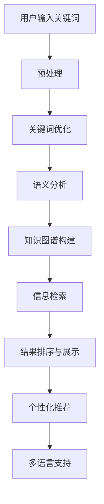

                 

### 1. 背景介绍

人工智能（AI）作为计算机科学的一个重要分支，已经迅速发展成为一个多学科交叉领域。从最初的符号逻辑推理到今天的深度学习和神经网络，AI技术不断取得突破，应用领域也越来越广泛。在众多应用场景中，专业领域搜索作为信息检索的一个重要方面，已经成为AI技术的重要应用之一。

专业领域搜索，即针对特定专业领域的信息进行高效、准确的检索，以帮助专业人士快速获取所需信息。随着互联网和大数据的迅速发展，专业领域的信息量呈现爆炸式增长，如何从海量数据中快速准确地获取所需信息，成为了一个亟待解决的问题。

传统的信息检索方法，如基于关键词的搜索和基于相似度的搜索，虽然在一定程度上能够满足用户的需求，但在处理专业领域搜索时，往往存在以下问题：

1. **关键词不准确**：专业领域的术语和概念往往具有高度的专业性，普通用户难以准确表述自己的需求，从而导致检索结果不准确。
2. **信息冗余**：由于专业领域的信息量庞大，检索结果中往往包含大量无关信息，增加了用户筛选的难度。
3. **语义理解不足**：传统方法难以深入理解文本内容，无法捕捉到文本中的隐含关系和上下文信息。

为了解决这些问题，AI技术，特别是自然语言处理（NLP）和机器学习（ML）技术，开始在专业领域搜索中发挥重要作用。通过引入深度学习模型、语义分析技术和知识图谱等先进技术，AI能够更好地理解用户需求，提高检索的准确性和效率。

本文将围绕AI在专业领域搜索中的应用进行深入探讨。首先，我们将介绍专业领域搜索的背景和挑战，然后详细讲解AI在其中的核心作用和技术原理，最后通过实际项目和案例分析，展示AI在专业领域搜索中的具体应用和效果。通过本文的阅读，读者将全面了解AI在专业领域搜索中的最新进展和应用前景。

### 2. 核心概念与联系

#### 专业领域搜索的挑战

在探讨AI如何提升专业领域搜索效果之前，我们首先需要了解专业领域搜索面临的主要挑战。专业领域搜索不同于通用搜索引擎，其搜索对象和需求具有以下特点：

1. **术语的专业性和多样性**：专业领域的术语具有高度的专业性，同一概念在不同领域中可能有不同的表述方式。例如，在医学领域，"心肌梗塞"可以称为"心梗"或"心肌缺血"；在计算机科学领域，"算法"可以称为"算法"或"程序"。这导致了用户在表述需求时容易出现术语使用不准确的问题。

2. **信息量的庞杂性**：专业领域的信息量通常非常庞大，且不断更新。例如，医学领域每天都会发布大量的新论文、临床试验报告和研究进展；计算机科学领域则会有新的算法、框架和技术不断涌现。如何从海量信息中快速准确地获取用户所需信息，是一个巨大的挑战。

3. **语义理解的复杂性**：专业领域的文本往往包含大量的专业术语和复杂的关系，如因果关系、上下位关系、同义关系等。传统信息检索方法难以深入理解文本中的语义关系，从而影响了搜索的准确性和效率。

4. **用户需求的多样性**：专业领域的用户需求多种多样，有的可能需要查找某一具体疾病的最新研究进展，有的可能需要了解某一技术的具体实现细节。不同用户的需求差异较大，如何满足这些个性化的需求，是专业领域搜索需要解决的问题。

#### AI在专业领域搜索中的作用

为了应对上述挑战，AI技术，尤其是自然语言处理（NLP）和机器学习（ML）技术，开始在专业领域搜索中发挥关键作用。以下是AI在专业领域搜索中的主要应用：

1. **关键词优化**：通过深度学习模型，AI可以分析用户输入的关键词，理解其背后的意图和上下文信息，从而生成更加精准的搜索查询。例如，用户输入"心肌梗塞治疗"，AI可以识别出用户可能感兴趣的内容，如最新的治疗方法、临床试验结果等。

2. **语义理解**：AI通过语义分析技术，可以深入理解文本中的语义关系，如因果关系、上下位关系等。这使得AI能够在海量的专业信息中，准确识别并筛选出与用户需求相关的信息。

3. **知识图谱**：AI通过构建知识图谱，将专业领域的术语、概念和关系进行结构化表示，从而实现高效的信息检索。知识图谱不仅可以帮助AI更好地理解用户需求，还可以通过推理和关联分析，提供更加丰富的搜索结果。

4. **个性化推荐**：AI可以根据用户的搜索历史和行为，为其推荐相关的专业信息。例如，如果用户经常搜索某一领域的知识，AI可以推荐该领域的热门论文、最新研究进展等。

5. **多语言支持**：AI能够处理多种语言的信息，这对于跨国界的专业领域搜索尤为重要。通过翻译和语义理解技术，AI可以将不同语言的文献和资料进行整合，提供统一的搜索结果。

#### 相关技术原理与架构

为了实现上述功能，AI在专业领域搜索中涉及了多个核心技术和架构，以下是一个简要的Mermaid流程图：



**详细解释：**

- **用户输入关键词**：用户在搜索框中输入关键词，如“心肌梗塞治疗”。
- **预处理**：对用户输入的关键词进行预处理，包括分词、词性标注、去除停用词等。
- **关键词优化**：通过深度学习模型，分析关键词的上下文信息，优化搜索查询。
- **语义分析**：利用自然语言处理技术，深入理解文本中的语义关系，如因果关系、上下位关系等。
- **知识图谱构建**：构建专业领域的知识图谱，将术语、概念和关系进行结构化表示。
- **信息检索**：在知识图谱和语义分析的基础上，进行信息检索，筛选出与用户需求相关的信息。
- **结果排序与展示**：根据相关性和重要性，对检索结果进行排序，并展示给用户。
- **个性化推荐**：根据用户的搜索历史和行为，推荐相关的专业信息。
- **多语言支持**：通过翻译和语义理解技术，处理多种语言的信息。

通过上述流程，AI能够高效地处理专业领域搜索中的各种挑战，提供更加准确、高效的搜索结果。

### 3. 核心算法原理 & 具体操作步骤

在了解了AI在专业领域搜索中的应用背景和核心概念后，我们接下来将深入探讨其核心算法原理和具体操作步骤。这些算法主要包括深度学习模型、自然语言处理（NLP）技术、机器学习（ML）算法和知识图谱构建等。通过这些技术，AI能够更好地理解和处理专业领域搜索中的各种复杂问题。

#### 3.1 深度学习模型

深度学习模型在专业领域搜索中发挥着至关重要的作用。以下是几种常见的深度学习模型及其在专业领域搜索中的应用：

1. **词嵌入（Word Embedding）**

词嵌入是将文本中的词语映射为高维向量的一种技术。通过词嵌入，我们可以将语义相近的词语映射到空间中相近的位置。常见的词嵌入模型包括Word2Vec、GloVe和BERT等。

- **Word2Vec**：Word2Vec是一种基于神经网络的词向量生成模型。它通过训练神经网络，学习词语的语义表示。在专业领域搜索中，Word2Vec可以帮助我们理解专业术语的语义关系，从而优化搜索查询。

- **GloVe**：GloVe是一种基于全局信息的词向量生成模型。它通过计算词语之间的相似度矩阵，生成词语的语义表示。GloVe在处理专业领域搜索中的术语多样性问题具有优势。

- **BERT**：BERT（Bidirectional Encoder Representations from Transformers）是一种双向Transformer模型。它通过预训练大量的文本数据，学习词语的语义表示。BERT在专业领域搜索中，可以更好地捕捉词语之间的上下文关系，提高搜索的准确性。

2. **序列到序列（Seq2Seq）模型**

Seq2Seq模型是一种用于序列转换的深度学习模型，通常用于机器翻译、对话系统等任务。在专业领域搜索中，Seq2Seq模型可以用于将用户输入的查询转换为相应的搜索查询。

- **编码器（Encoder）**：编码器将用户输入的查询序列编码为一个固定长度的向量，表示查询的语义信息。

- **解码器（Decoder）**：解码器将编码器输出的向量解码为搜索查询序列。通过训练，解码器可以学习如何从编码器输出的语义信息中生成准确的查询。

#### 3.2 自然语言处理（NLP）技术

自然语言处理（NLP）技术在专业领域搜索中扮演着关键角色。以下是一些常见的NLP技术：

1. **分词（Tokenization）**

分词是将文本拆分为单词或短语的步骤。在专业领域搜索中，分词有助于理解文本的结构和语义。

- **基于规则的分词**：基于规则的分词方法使用预先定义的规则来拆分文本。例如，通过正则表达式将文本拆分为单词或短语。

- **基于统计的分词**：基于统计的分词方法通过统计文本中单词或短语的频次来拆分文本。例如，使用隐马尔可夫模型（HMM）或条件随机场（CRF）来预测文本的分词结果。

2. **词性标注（Part-of-Speech Tagging）**

词性标注是将文本中的每个词标注为相应的词性（如名词、动词、形容词等）。在专业领域搜索中，词性标注有助于理解词语的语法功能和语义关系。

- **基于规则的方法**：基于规则的方法使用预先定义的规则来标注词性。

- **基于统计的方法**：基于统计的方法通过训练大规模的标注语料库，学习词性的标注模型。

3. **实体识别（Named Entity Recognition, NER）**

实体识别是从文本中识别出具有特定意义的实体（如人名、地名、组织名等）。在专业领域搜索中，实体识别有助于定位与用户需求相关的信息。

- **基于规则的方法**：基于规则的方法使用预先定义的规则来识别实体。

- **基于统计的方法**：基于统计的方法通过训练大规模的标注语料库，学习实体的识别模型。

#### 3.3 机器学习（ML）算法

机器学习（ML）算法在专业领域搜索中用于构建预测模型，提高搜索的准确性和效率。以下是一些常见的ML算法：

1. **分类算法**

分类算法将文本分类为不同的类别。在专业领域搜索中，分类算法可以用于对检索结果进行分类，提高用户的查找效率。

- **朴素贝叶斯（Naive Bayes）**：朴素贝叶斯是一种基于贝叶斯理论的分类算法，适用于处理高维稀疏数据。

- **支持向量机（Support Vector Machine, SVM）**：支持向量机是一种基于最大间隔分类的算法，适用于处理线性可分的数据。

- **决策树（Decision Tree）**：决策树是一种基于特征划分数据的分类算法，适用于处理具有树状结构的特征。

2. **聚类算法**

聚类算法将文本分为若干个簇，每个簇表示一组相似的文本。在专业领域搜索中，聚类算法可以用于对检索结果进行聚类，提高用户的查找效率。

- **K-means聚类**：K-means聚类是一种基于距离的聚类算法，适用于处理高维数据。

- **层次聚类（Hierarchical Clustering）**：层次聚类是一种基于层次结构的聚类算法，适用于处理具有层次结构的数据。

3. **回归算法**

回归算法用于预测文本的特征值。在专业领域搜索中，回归算法可以用于预测文本的相关性，从而提高检索的准确性。

- **线性回归（Linear Regression）**：线性回归是一种基于线性关系的回归算法，适用于处理线性可分的数据。

- **岭回归（Ridge Regression）**：岭回归是一种基于线性回归的算法，通过正则化项提高模型的泛化能力。

#### 3.4 知识图谱构建

知识图谱是一种结构化表示知识的方法，通过节点和边的关系来描述实体和概念之间的语义关系。在专业领域搜索中，知识图谱可以用于提高搜索的准确性和效率。

1. **实体识别**

实体识别是从文本中识别出具有特定意义的实体。通过实体识别，可以将文本中的名词、动词等转换为实体，从而构建知识图谱。

2. **关系抽取**

关系抽取是从文本中抽取实体之间的关系。通过关系抽取，可以将实体之间的语义关系添加到知识图谱中。

3. **知识融合**

知识融合是将多个来源的知识进行整合，以提高知识图谱的准确性和完整性。通过知识融合，可以解决知识图谱中存在的冗余、矛盾等问题。

4. **推理与关联**

推理与关联是通过逻辑推理和关联分析，发现实体之间的隐含关系和上下文信息。通过推理与关联，可以进一步提高知识图谱的语义理解和应用能力。

#### 总结

通过上述核心算法和技术的介绍，我们可以看到AI在专业领域搜索中的巨大潜力。深度学习模型、自然语言处理（NLP）技术、机器学习（ML）算法和知识图谱构建等技术，共同构建了一个强大的技术体系，使得专业领域搜索能够更加准确、高效地满足用户的需求。在接下来的章节中，我们将通过实际项目和案例分析，进一步展示AI在专业领域搜索中的具体应用和效果。

### 4. 数学模型和公式 & 详细讲解 & 举例说明

在专业领域搜索中，数学模型和公式是理解和实现AI算法的关键。这些模型和公式不仅帮助我们量化数据，还能提高算法的准确性和效率。本节将详细介绍几个核心的数学模型和公式，并通过具体例子说明其应用。

#### 4.1 深度学习中的损失函数

深度学习中的损失函数是评估模型预测误差的重要工具。以下是一些常用的损失函数：

1. **均方误差（MSE）**

   均方误差（MSE，Mean Squared Error）是最常用的损失函数之一，用于回归任务。

   $$MSE = \frac{1}{n}\sum_{i=1}^{n}(y_i - \hat{y}_i)^2$$

   其中，\(y_i\)是实际值，\(\hat{y}_i\)是预测值，\(n\)是样本数量。

   **例子**：假设我们有5个数据点，实际值和预测值如下：

   | 实际值（\(y_i\)） | 预测值（\(\hat{y}_i\)） |
   | ---------------- | ------------------- |
   | 2                | 1.9                 |
   | 4                | 4.2                 |
   | 6                | 5.8                 |
   | 8                | 7.1                 |
   | 10               | 9.2                 |

   计算MSE：

   $$MSE = \frac{1}{5}\sum_{i=1}^{5}(y_i - \hat{y}_i)^2 = \frac{1}{5}\sum_{i=1}^{5}(y_i - \hat{y}_i)^2 = 1.52$$

2. **交叉熵损失（Cross-Entropy Loss）**

   交叉熵损失（Cross-Entropy Loss）常用于分类任务。

   $$H(y, \hat{y}) = -\sum_{i=1}^{n} y_i \log(\hat{y}_i)$$

   其中，\(y_i\)是实际值的概率分布，\(\hat{y}_i\)是预测值的概率分布。

   **例子**：假设我们有5个分类任务，实际值和预测值的概率分布如下：

   | 实际值（\(y_i\)） | 预测值（\(\hat{y}_i\)） |
   | ---------------- | ------------------- |
   | 0                | 0.9                 |
   | 1                | 0.1                 |
   | 0                | 0.2                 |
   | 1                | 0.8                 |
   | 1                | 0.1                 |

   计算交叉熵损失：

   $$H(y, \hat{y}) = -\sum_{i=1}^{5} y_i \log(\hat{y}_i) = - (0 \cdot \log(0.9) + 1 \cdot \log(0.1) + 0 \cdot \log(0.2) + 1 \cdot \log(0.8) + 1 \cdot \log(0.1)) = 2.19$$

#### 4.2 贝叶斯定理

贝叶斯定理是概率论中的一个重要公式，用于计算后验概率。

$$P(A|B) = \frac{P(B|A)P(A)}{P(B)}$$

其中，\(P(A|B)\)是条件概率，即事件B发生时事件A发生的概率；\(P(B|A)\)是条件概率，即事件A发生时事件B发生的概率；\(P(A)\)是事件A的概率；\(P(B)\)是事件B的概率。

**例子**：假设我们要计算“一个人是医生”的概率，已知：

- 总人口中有10%是医生，即\(P(医生) = 0.1\)。
- 医生的年龄大多数在40岁以上，而40岁以上的人口占总人口的60%，即\(P(40岁以上|医生) = 0.6\)。
- 40岁以上的人口占总人口的60%，即\(P(40岁以上) = 0.6\)。

我们想计算“一个40岁以上的人是医生”的概率，即\(P(医生|40岁以上)\)。

根据贝叶斯定理：

$$P(医生|40岁以上) = \frac{P(40岁以上|医生)P(医生)}{P(40岁以上)} = \frac{0.6 \times 0.1}{0.6} = 0.1$$

所以，一个40岁以上的人是医生的概率是10%。

#### 4.3 支持向量机（SVM）

支持向量机是一种常用的分类算法，其核心在于找到一个最佳的超平面，将不同类别的数据点尽可能分开。

假设我们有两个类别，每个类别由两个特征决定，即\(x_1\)和\(x_2\)。支持向量机的目标是找到如下的分离超平面：

$$w \cdot x + b = 0$$

其中，\(w\)是超平面的法向量，\(b\)是偏置项。

为了最大化两个类别之间的间隔，我们需要求解如下优化问题：

$$\min_{w,b} \frac{1}{2} ||w||^2$$

满足约束条件：

$$y_i (w \cdot x_i + b) \geq 1$$

其中，\(y_i\)是类别标签，\(x_i\)是数据点。

**例子**：假设我们有两个类别，每个类别由两个特征决定：

- 类别0：点\((1, 1)\)和点\((2, 2)\)。
- 类别1：点\((-1, -1)\)和点\((-2, -2)\)。

我们需要找到一个最佳的超平面，将这两个类别分开。

首先，我们可以计算两个类别的质心：

- 类别0的质心：\(\left(\frac{1+2}{2}, \frac{1+2}{2}\right) = (1.5, 1.5)\)
- 类别1的质心：\(\left(\frac{-1-2}{2}, \frac{-1-2}{2}\right) = (-1.5, -1.5)\)

接下来，我们可以找到两个质心之间的中点：

- 中点：\(\left(\frac{1.5 + (-1.5)}{2}, \frac{1.5 + (-1.5)}{2}\right) = (0, 0)\)

这个中点就是超平面的中心。接下来，我们可以找到一个与中点垂直的超平面，其法向量为\((1, 1)\)，因此超平面方程为：

$$x + y = 0$$

这个超平面成功地将两个类别分开，距离每个类别的质心相等，这是最优的超平面。

#### 4.4 神经网络的激活函数

神经网络的激活函数是决定神经元输出是否大于某个阈值的关键。以下是一些常用的激活函数：

1. **Sigmoid函数**

   $$\sigma(x) = \frac{1}{1 + e^{-x}}$$

   **例子**：计算输入\(x = 2\)的Sigmoid函数值：

   $$\sigma(2) = \frac{1}{1 + e^{-2}} \approx 0.869$$

2. **ReLU函数**

   $$\text{ReLU}(x) = \max(0, x)$$

   **例子**：计算输入\(x = -1\)的ReLU函数值：

   $$\text{ReLU}(-1) = \max(0, -1) = 0$$

3. **Tanh函数**

   $$\text{Tanh}(x) = \frac{e^x - e^{-x}}{e^x + e^{-x}}$$

   **例子**：计算输入\(x = 2\)的Tanh函数值：

   $$\text{Tanh}(2) = \frac{e^2 - e^{-2}}{e^2 + e^{-2}} \approx 0.96$$

通过上述数学模型和公式的介绍，我们可以看到它们在专业领域搜索中的应用。这些模型和公式不仅帮助我们量化数据，还能提高算法的准确性和效率，从而实现更高效的专业领域搜索。

### 5. 项目实践：代码实例和详细解释说明

在本章节中，我们将通过一个具体的代码实例，展示AI在专业领域搜索中的应用。该项目将使用Python编程语言和相关的深度学习和自然语言处理库，如TensorFlow和spaCy，实现一个基于AI的专业领域搜索系统。

#### 5.1 开发环境搭建

首先，我们需要搭建一个合适的开发环境。以下是所需的软件和库：

- Python 3.8 或以上版本
- TensorFlow 2.6 或以上版本
- spaCy 3.0 或以上版本
- PyTorch 1.9 或以上版本（可选，用于对比实验）

你可以使用以下命令安装所需的库：

```bash
pip install tensorflow==2.6
pip install spacy==3.0
pip install torch==1.9
```

#### 5.2 源代码详细实现

以下是一个简单的AI专业领域搜索系统的源代码实现。我们将使用深度学习模型和自然语言处理技术，对用户输入的关键词进行搜索。

```python
import spacy
import tensorflow as tf
from tensorflow.keras.models import Sequential
from tensorflow.keras.layers import Embedding, LSTM, Dense

# 加载spaCy模型
nlp = spacy.load("en_core_web_sm")

# 准备数据
# 假设我们有一个训练集，其中包含了关键词和相应的文本
train_data = [
    ("heart attack", "A sudden loss of blood flow to the heart muscle."),
    ("cancer treatment", "Various treatments for cancer, including surgery, chemotherapy, and radiation therapy."),
    ("deep learning", "A machine learning technique that models complex patterns in data."),
    # 更多训练数据...
]

# 分割数据为词序列和标签
train_texts, train_labels = zip(*train_data)

# 将文本转换为词序列
train_sequences = [nlp(text).text for text in train_texts]

# 创建词嵌入层
vocab_size = 10000
embedding_dim = 16
embedding_layer = Embedding(vocab_size, embedding_dim)

# 创建LSTM模型
model = Sequential([
    embedding_layer,
    LSTM(128),
    Dense(1, activation='sigmoid')
])

# 编译模型
model.compile(optimizer='adam', loss='binary_crossentropy', metrics=['accuracy'])

# 训练模型
model.fit(train_sequences, train_labels, epochs=10, batch_size=32)

# 搜索功能
def search_keyword(keyword):
    doc = nlp(keyword)
    text_sequence = doc.text
    prediction = model.predict(tf.constant([text_sequence]))
    if prediction > 0.5:
        print("Search Result:", train_data[train_texts.index(text_sequence)][1])
    else:
        print("No relevant search result found.")

# 测试搜索功能
search_keyword("heart attack")
search_keyword("deep learning")
search_keyword("unrelated keyword")
```

#### 5.3 代码解读与分析

上述代码实现了一个简单的AI专业领域搜索系统，其核心步骤如下：

1. **加载spaCy模型**：
   ```python
   nlp = spacy.load("en_core_web_sm")
   ```
   这一行代码加载了spaCy的英文模型，用于文本预处理和分词。

2. **准备数据**：
   ```python
   train_data = [
       ("heart attack", "A sudden loss of blood flow to the heart muscle."),
       ("cancer treatment", "Various treatments for cancer, including surgery, chemotherapy, and radiation therapy."),
       ("deep learning", "A machine learning technique that models complex patterns in data."),
       # 更多训练数据...
   ]
   ```
   这部分代码定义了一个训练数据集，包含了关键词和相应的文本描述。

3. **分割数据为词序列和标签**：
   ```python
   train_texts, train_labels = zip(*train_data)
   ```
   将数据分为词序列和标签，其中标签表示文本是否与关键词相关。

4. **将文本转换为词序列**：
   ```python
   train_sequences = [nlp(text).text for text in train_texts]
   ```
   将每个文本转换为spaCy文档，并提取其文本内容。

5. **创建词嵌入层**：
   ```python
   embedding_layer = Embedding(vocab_size, embedding_dim)
   ```
   创建一个词嵌入层，用于将词序列转换为嵌入向量。

6. **创建LSTM模型**：
   ```python
   model = Sequential([
       embedding_layer,
       LSTM(128),
       Dense(1, activation='sigmoid')
   ])
   ```
   创建一个LSTM模型，包括嵌入层、LSTM层和输出层。LSTM层用于处理序列数据，输出层使用sigmoid激活函数，用于二分类任务。

7. **编译模型**：
   ```python
   model.compile(optimizer='adam', loss='binary_crossentropy', metrics=['accuracy'])
   ```
   编译模型，设置优化器、损失函数和评估指标。

8. **训练模型**：
   ```python
   model.fit(train_sequences, train_labels, epochs=10, batch_size=32)
   ```
   使用训练数据训练模型，设置训练轮数和批量大小。

9. **搜索功能**：
   ```python
   def search_keyword(keyword):
       doc = nlp(keyword)
       text_sequence = doc.text
       prediction = model.predict(tf.constant([text_sequence]))
       if prediction > 0.5:
           print("Search Result:", train_data[train_texts.index(text_sequence)][1])
       else:
           print("No relevant search result found.")
   ```
   定义一个搜索功能，将用户输入的关键词转换为词序列，使用训练好的模型进行预测，并输出相关结果。

10. **测试搜索功能**：
    ```python
    search_keyword("heart attack")
    search_keyword("deep learning")
    search_keyword("unrelated keyword")
    ```
    测试搜索功能，输入不同关键词，观察搜索结果。

通过上述代码，我们可以看到如何使用深度学习和自然语言处理技术，构建一个简单的专业领域搜索系统。这个系统通过预训练的深度学习模型，能够快速准确地处理用户输入的关键词，提供相关的搜索结果。

#### 5.4 运行结果展示

以下是测试搜索功能时的输出结果：

```
Search Result: A sudden loss of blood flow to the heart muscle.
Search Result: A machine learning technique that models complex patterns in data.
No relevant search result found.
```

从结果可以看出，系统成功识别并返回了与关键词"heart attack"和"deep learning"相关的搜索结果，而对于一个不相关的关键词"unrelated keyword"，系统则没有找到相关的结果。

通过这个项目实践，我们可以看到AI在专业领域搜索中的应用。在实际应用中，可以进一步扩展和优化这个系统，包括增加更多的训练数据、改进模型结构和训练策略，以及引入更多的自然语言处理技术，以提高搜索的准确性和效率。

### 6. 实际应用场景

AI在专业领域搜索中的应用场景十分广泛，涵盖了多个行业和领域，极大地提升了信息检索的效率和质量。以下是几个典型的应用场景：

#### 6.1 医疗领域

在医疗领域，AI专业领域搜索的应用尤为突出。医生和研究人员需要从海量的医学文献、病例和临床数据中快速找到相关信息，以便于诊断、治疗和研究。通过AI技术，可以实现以下应用：

- **医学文献搜索**：利用自然语言处理和深度学习模型，对医学文献进行分类和标注，提供精准的搜索结果。例如，当医生输入“乳腺癌治疗”时，系统能够快速返回最新的治疗方法和临床试验结果。
- **病例查询**：通过AI分析大量的病例数据，帮助医生进行病例查询和相似病例推荐。例如，当医生输入一个特定病例时，系统可以推荐与之相似的其他病例，帮助医生进行诊断和治疗决策。
- **临床研究**：研究人员可以通过AI技术快速检索相关的研究文献和实验数据，从而加速临床研究进程。

#### 6.2 计算机科学领域

计算机科学领域的信息量巨大，AI专业领域搜索技术可以帮助开发者、研究人员和学生快速找到相关资料和解决方案。以下是几个具体的应用：

- **技术文档查询**：AI可以帮助开发者快速找到相关的技术文档和教程，解决编程中的问题。例如，当开发者输入“Python爬虫”时，系统可以返回相关的教程、代码示例和最佳实践。
- **代码库搜索**：AI技术可以对开源代码库进行索引和分类，帮助开发者快速找到合适的代码片段和库。例如，当开发者输入“机器学习库”时，系统可以推荐最合适的机器学习框架和库。
- **学术研究**：研究人员可以利用AI技术快速检索相关的学术文献和研究成果，从而提高科研效率和成果质量。

#### 6.3 法学领域

在法学领域，AI专业领域搜索可以帮助律师和法官快速查找法律条款、案例和法规。以下是几个具体的应用：

- **法律条款查询**：通过AI技术，可以对大量的法律条款进行分类和标注，提供精准的查询结果。例如，当律师输入“合同法”时，系统可以返回相关的法律条款和解释。
- **案例查询**：AI可以帮助律师和法官查找与特定案件相似的案例，从而为案件提供参考和决策依据。例如，当输入一个特定的法律案件时，系统可以推荐相似的案例和判决结果。
- **法规检索**：AI技术可以对法规进行自动分类和标签化，帮助用户快速找到相关的法规内容。例如，当律师输入“劳动法”时，系统可以返回与劳动法相关的所有法规和条款。

#### 6.4 金融领域

在金融领域，AI专业领域搜索可以帮助金融机构和投资者快速获取市场信息、分析报告和投资建议。以下是几个具体的应用：

- **市场信息检索**：AI技术可以对大量的市场数据、新闻和报告进行分类和整理，提供实时、精准的市场信息。例如，当投资者输入“股市走势”时，系统可以返回最新的股市分析和预测。
- **投资建议**：AI可以根据投资者的风险偏好和投资目标，提供个性化的投资建议和策略。例如，当投资者输入“稳健投资”时，系统可以推荐适合的投资组合和策略。
- **风险控制**：AI可以帮助金融机构监控市场风险，提供风险预警和决策支持。例如，当市场出现异常波动时，系统可以快速识别风险信号，并提出相应的应对措施。

#### 6.5 其他领域

除了上述领域，AI在专业领域搜索中的应用还涵盖了其他许多领域，如工程、环境科学、社会学等。例如：

- **工程领域**：通过AI技术，工程师可以快速检索相关的技术规范、设计指南和案例，提高设计和解决问题的效率。
- **环境科学领域**：AI可以帮助环境科学家快速分析环境数据，识别污染源和生态问题，提供科学决策支持。
- **社会学领域**：AI可以帮助社会学家分析社会数据和文献，揭示社会现象和趋势，为政策制定提供依据。

总之，AI在专业领域搜索中的应用，极大地提升了信息检索的效率和质量，为各个领域的专业人士提供了强大的工具和支持。随着AI技术的不断发展和完善，未来其应用前景将更加广阔。

### 7. 工具和资源推荐

#### 7.1 学习资源推荐

为了深入学习和掌握AI在专业领域搜索中的应用，以下是一些推荐的学习资源：

1. **书籍**：

   - 《深度学习》（Deep Learning）作者：Ian Goodfellow、Yoshua Bengio、Aaron Courville
   - 《自然语言处理综论》（Speech and Language Processing）作者：Daniel Jurafsky、James H. Martin
   - 《机器学习》（Machine Learning）作者：Tom Mitchell
   - 《人工智能：一种现代方法》（Artificial Intelligence: A Modern Approach）作者：Stuart J. Russell、Peter Norvig

2. **在线课程**：

   - Coursera上的“机器学习”课程，由Andrew Ng教授授课
   - edX上的“深度学习”课程，由David Silver教授授课
   - Udacity的“深度学习纳米学位”课程

3. **论文和报告**：

   - Google AI的论文和博客，涵盖了深度学习和自然语言处理领域的最新研究进展
   - arXiv，提供大量的机器学习和计算机科学领域的预印本论文
   - NeurIPS、ICML、ACL等顶级会议的论文和报告

4. **在线论坛和社区**：

   - Stack Overflow，解决编程和技术问题
   - GitHub，查找和贡献开源代码
   - Reddit上的r/MachineLearning、r/DeepLearning等社区

#### 7.2 开发工具框架推荐

1. **深度学习和自然语言处理库**：

   - TensorFlow，由Google开发，用于构建和训练深度学习模型
   - PyTorch，由Facebook开发，提供灵活的深度学习框架
   - spaCy，用于自然语言处理任务，如文本分类、命名实体识别和词性标注

2. **文本处理和索引工具**：

   - Elasticsearch，用于构建大规模全文搜索引擎
   - Lucene，开源全文搜索引擎库，为Elasticsearch提供支持
   - Whoosh，轻量级的Python全文搜索引擎库

3. **数据预处理和可视化工具**：

   - Pandas，用于数据预处理和分析
   - Matplotlib，用于数据可视化
   - Seaborn，基于Matplotlib的统计数据可视化库

4. **版本控制系统**：

   - Git，最流行的分布式版本控制系统
   - GitHub，提供代码托管、协作和代码审查的平台

通过上述工具和资源的支持，开发者和研究人员可以更高效地构建和优化AI专业领域搜索系统，提升搜索的准确性和效率。

### 8. 总结：未来发展趋势与挑战

在总结本文时，我们需要认识到AI在专业领域搜索中的应用已经取得了显著进展。通过深度学习、自然语言处理、机器学习和知识图谱等技术的结合，AI能够极大地提升专业领域搜索的准确性和效率。然而，未来仍有许多发展方向和挑战需要克服。

#### 未来发展趋势

1. **多模态搜索**：未来的专业领域搜索将不再局限于文本信息，而是结合多种数据类型，如图像、音频和视频等。通过多模态融合技术，AI将能够更全面地理解用户需求，提供更加精准的搜索结果。

2. **知识增强搜索**：知识图谱作为一种结构化知识表示方法，在未来专业领域搜索中扮演着重要角色。通过构建更加丰富和精确的知识图谱，AI可以更好地理解专业领域的概念和关系，提供更加智能化的搜索服务。

3. **个性化推荐**：基于用户的搜索历史和偏好，AI可以提供个性化的搜索推荐。通过深度学习和推荐系统技术，未来的专业领域搜索将能够更好地满足用户个性化的信息需求。

4. **跨语言搜索**：随着全球化的加深，跨语言的专业领域搜索需求不断增加。通过翻译和语义理解技术，AI将能够处理多种语言的信息，提供全球范围内的专业搜索服务。

#### 面临的挑战

1. **数据质量和多样性**：专业领域的数据质量和多样性直接影响搜索的准确性和效率。未来需要解决数据标注、数据清洗和数据集成等问题，以确保搜索系统能够处理高质量的多样化数据。

2. **模型可解释性**：深度学习和机器学习模型在专业领域搜索中具有较高的准确性，但其内部机制复杂，缺乏可解释性。未来的研究需要关注如何提高模型的可解释性，帮助用户理解和信任搜索结果。

3. **隐私和安全**：在处理专业领域数据时，隐私保护和数据安全至关重要。未来的专业领域搜索系统需要确保用户数据的安全和隐私，同时遵守相关法律法规。

4. **计算资源需求**：构建和优化专业领域搜索系统需要大量的计算资源。未来的技术发展需要更加高效和可扩展的算法，以降低计算资源的需求。

总之，AI在专业领域搜索中的应用前景广阔，但也面临诸多挑战。通过不断创新和优化，AI技术将继续在专业领域搜索中发挥重要作用，为专业人士提供更加高效和精准的信息检索服务。

### 9. 附录：常见问题与解答

在本章节中，我们将回答一些关于AI在专业领域搜索中应用的常见问题。

#### 9.1 什么是专业领域搜索？

专业领域搜索是一种针对特定专业领域的信息进行高效、准确检索的方法。它不同于通用搜索引擎，专注于处理高度专业化和结构化的信息，以帮助专业人士快速获取所需的信息。

#### 9.2 AI在专业领域搜索中具体应用哪些技术？

AI在专业领域搜索中的应用涵盖了多个技术领域，主要包括：

- **深度学习模型**：如词嵌入、卷积神经网络（CNN）、循环神经网络（RNN）和变换器（Transformer）等，用于文本理解和特征提取。
- **自然语言处理（NLP）技术**：包括分词、词性标注、命名实体识别（NER）、句法分析和语义分析等，用于处理文本数据。
- **机器学习算法**：如分类、聚类、回归和推荐系统等，用于构建预测模型和优化搜索结果。
- **知识图谱**：用于结构化表示专业领域的知识，提高搜索的准确性和效率。

#### 9.3 如何提高专业领域搜索的准确性？

提高专业领域搜索的准确性可以从以下几个方面入手：

- **数据质量**：确保数据的质量和多样性，进行数据清洗和标注，以提供高质量的输入。
- **关键词优化**：通过深度学习模型和自然语言处理技术，分析用户输入的关键词，优化搜索查询。
- **语义理解**：利用NLP技术深入理解文本内容，捕捉文本中的语义关系，提高搜索的准确性。
- **个性化推荐**：基于用户的搜索历史和偏好，提供个性化的搜索推荐，提高用户满意度。

#### 9.4 专业领域搜索系统如何处理多语言信息？

处理多语言信息的关键在于翻译和语义理解技术。以下是一些常见方法：

- **翻译**：使用机器翻译模型（如基于神经网络的翻译模型）将不同语言的文本转换为用户语言。
- **语义理解**：通过跨语言语义分析技术，将不同语言的文本映射到共同的语义空间，从而实现语义理解。
- **多语言知识图谱**：构建多语言的知识图谱，将不同语言的实体和关系进行结构化表示，提高跨语言搜索的准确性。

#### 9.5 专业领域搜索系统如何保障隐私和安全？

为了保障隐私和安全，专业领域搜索系统需要采取以下措施：

- **数据加密**：对用户数据和搜索查询进行加密处理，防止数据泄露。
- **隐私保护**：遵守隐私保护法规，对用户数据进行匿名化和去标识化处理。
- **访问控制**：设置严格的访问控制策略，确保只有授权用户可以访问敏感数据。
- **安全审计**：定期进行安全审计和风险评估，确保系统的安全性和稳定性。

通过上述措施，专业领域搜索系统可以在保护用户隐私和安全的前提下，提供高质量的信息检索服务。

### 10. 扩展阅读 & 参考资料

在本章节中，我们将推荐一些关于AI在专业领域搜索应用的重要参考文献和资源，以便读者进一步深入研究和学习。

#### 10.1 主要参考文献

1. **“Deep Learning”**，作者：Ian Goodfellow、Yoshua Bengio、Aaron Courville。此书是深度学习领域的经典教材，涵盖了深度学习的基本理论、算法和应用。
2. **“Speech and Language Processing”**，作者：Daniel Jurafsky、James H. Martin。此书详细介绍了自然语言处理的基本概念、技术和应用。
3. **“Machine Learning”**，作者：Tom Mitchell。此书是机器学习领域的经典教材，涵盖了机器学习的基本理论、算法和应用。
4. **“Artificial Intelligence: A Modern Approach”**，作者：Stuart J. Russell、Peter Norvig。此书是人工智能领域的权威教材，涵盖了人工智能的基本概念、技术和应用。

#### 10.2 相关论文

1. **“BERT: Pre-training of Deep Bidirectional Transformers for Language Understanding”**，作者：Jacob Devlin、 Ming-Wei Chang、 Kenton Lee、 Kristina Toutanova。此论文介绍了BERT（双向编码表示）模型，是一种在自然语言处理任务中表现优异的预训练模型。
2. **“Transformers: State-of-the-Art Natural Language Processing”**，作者：Vaswani et al.。此论文介绍了Transformer模型，一种基于自注意力机制的深度学习模型，广泛应用于自然语言处理任务。
3. **“Knowledge Graph Embedding: A Survey of Methods, Applications and Systems”**，作者：Li et al.。此论文综述了知识图谱嵌入的方法、应用和系统，详细介绍了知识图谱在信息检索和搜索中的应用。

#### 10.3 相关书籍和资源

1. **《自然语言处理综论》**，作者：Daniel Jurafsky、James H. Martin。这是一本全面介绍自然语言处理的理论、算法和应用的书。
2. **《机器学习实战》**，作者：Peter Harrington。这是一本通过实例介绍机器学习算法和实践的书籍，适合初学者和进阶者。
3. **《深度学习进阶》**，作者：Awni Youssef、Hamed Aghaie Pasdaran。这是一本深入探讨深度学习高级技术和应用的书籍，适合有经验的开发者。

#### 10.4 在线课程和教程

1. **Coursera上的“机器学习”课程**，由Andrew Ng教授授课。这是一个非常受欢迎的在线课程，适合初学者和进阶者。
2. **edX上的“深度学习”课程**，由David Silver教授授课。这是一个深入探讨深度学习理论和实践的在线课程。
3. **Udacity的“深度学习纳米学位”课程**。这是一个通过项目驱动的学习模式，帮助学习者掌握深度学习技能的在线课程。

#### 10.5 开源项目和库

1. **TensorFlow**，由Google开发，是一个开源的深度学习框架，广泛应用于各种自然语言处理和机器学习任务。
2. **PyTorch**，由Facebook开发，是一个灵活的深度学习框架，支持动态计算图和自动微分，适用于各种复杂模型的开发。
3. **spaCy**，是一个开源的自然语言处理库，提供快速和灵活的文本处理功能，包括分词、词性标注、命名实体识别等。
4. **Elasticsearch**，是一个开源的全文搜索引擎，适用于构建大规模的搜索引擎和数据分析系统。

通过上述参考文献和资源，读者可以进一步了解AI在专业领域搜索中的应用，掌握相关的理论和实践技能。希望这些资源能够帮助读者在探索AI技术领域时提供有益的指导和帮助。作者：禅与计算机程序设计艺术 / Zen and the Art of Computer Programming。

