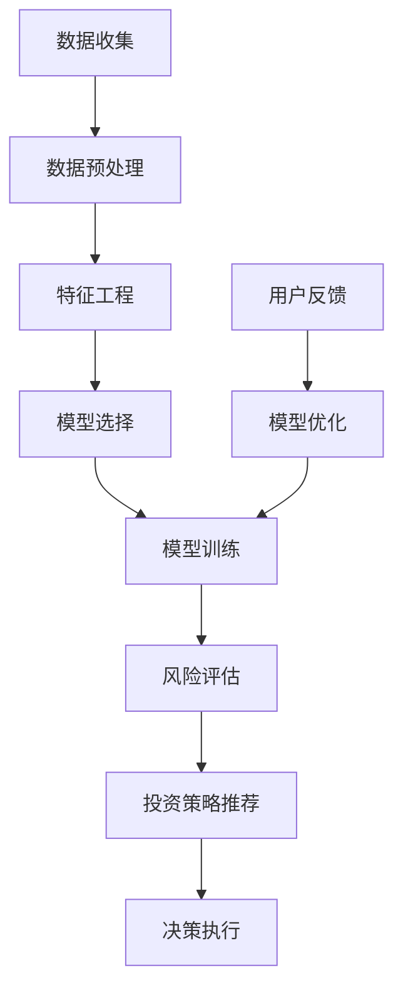

                 

### 1. 背景介绍

随着大数据和人工智能技术的迅速发展，个人理财领域迎来了新的变革。传统的理财方法主要依赖于经验丰富的理财顾问，而如今，人工智能（AI）已经开始在个人理财中发挥重要作用，为用户提供了智能投资建议。本文将深入探讨AI在个人理财中的应用，以及如何通过智能算法为用户提供个性化投资建议。

#### 个人理财的挑战

个人理财涉及多个方面，包括资产配置、风险控制、投资组合优化等。传统方法往往依赖理财顾问的经验和直觉，但这种方法存在以下挑战：

1. **人力成本高**：优秀的理财顾问通常收费较高，普通用户难以负担。
2. **效率低下**：理财顾问需要花费大量时间与用户沟通，了解其财务状况和投资偏好，这导致服务效率低下。
3. **数据不足**：理财顾问可能无法获取到全面、实时的市场数据，从而影响投资决策的准确性。

#### 人工智能的优势

人工智能在个人理财中的应用，可以有效地解决上述问题：

1. **数据处理能力**：AI可以处理和分析海量数据，包括市场走势、用户行为、经济指标等，从而为投资决策提供更加全面的信息支持。
2. **个性化推荐**：基于用户的历史数据和偏好，AI可以生成个性化的投资建议，满足不同用户的需求。
3. **实时反馈**：AI可以实时监控市场动态，对投资组合进行动态调整，提高投资收益。

#### 本文内容结构

本文将按照以下结构展开：

1. **核心概念与联系**：介绍与AI理财相关的核心概念，并使用Mermaid流程图展示其架构。
2. **核心算法原理与具体操作步骤**：深入探讨AI理财算法的原理，包括特征工程、模型选择和优化等。
3. **数学模型和公式**：介绍AI理财中的关键数学模型和公式，并进行详细讲解和举例说明。
4. **项目实践**：通过代码实例展示如何实现AI理财系统，并进行详细解释和分析。
5. **实际应用场景**：讨论AI理财在不同场景下的应用，如股票投资、基金管理、保险规划等。
6. **工具和资源推荐**：推荐学习资源、开发工具和框架，以及相关论文著作。
7. **总结**：总结AI在个人理财中的应用现状，探讨未来发展趋势和挑战。
8. **附录**：提供常见问题与解答，方便读者深入了解。
9. **扩展阅读**：推荐相关文献和资料，供读者进一步阅读和学习。

通过以上结构，本文将系统地阐述AI在个人理财中的应用，帮助读者了解这一新兴领域的核心概念、算法原理和实践方法。

### 2. 核心概念与联系

在探讨AI在个人理财中的应用之前，我们需要了解几个核心概念，这些概念是构建智能投资建议系统的基石。以下是本文将涉及的关键概念：

#### 1. 特征工程

特征工程是AI模型构建中的关键步骤，它涉及从原始数据中提取和构建有助于预测的特征。在个人理财中，特征可能包括用户的年龄、收入、投资历史、风险偏好等。特征工程的目标是提高模型的预测准确性，同时减少模型的复杂度和过拟合风险。

#### 2. 模型选择

模型选择是指从众多机器学习算法中选择一个或多个最适合解决特定问题的算法。常见的模型包括线性回归、决策树、随机森林、支持向量机、神经网络等。选择合适的模型对于生成准确的智能投资建议至关重要。

#### 3. 模型训练与优化

模型训练与优化是指通过调整模型的参数，使其在训练数据上表现最优。优化方法包括梯度下降、随机搜索、贝叶斯优化等。在个人理财中，模型的训练和优化目标是最大化投资收益，同时控制风险。

#### 4. 风险评估与控制

风险评估与控制是个人理财的核心任务之一。AI可以基于历史数据和实时信息，对投资组合的风险进行评估，并提供相应的风险管理策略。风险评估包括市场风险、信用风险、流动性风险等。

#### 5. 投资策略推荐

投资策略推荐是根据用户的风险偏好、投资目标和市场条件，为用户提供具体的投资建议。常见的策略包括长期投资、定期定额投资、分散投资等。

接下来，我们将使用Mermaid流程图来展示AI理财系统的架构，这有助于读者更好地理解各核心概念之间的联系。



**流程说明：**

1. **数据收集**：从各种数据源（如交易所、社交媒体、新闻报道等）收集用户和市场的数据。
2. **数据预处理**：清洗和转换原始数据，使其适合用于模型训练。
3. **特征工程**：提取和构建有助于预测的特征。
4. **模型选择**：选择适合问题的机器学习模型。
5. **模型训练**：使用训练数据训练模型，调整参数以优化模型性能。
6. **风险评估**：评估投资组合的风险，并提供相应的风险管理策略。
7. **投资策略推荐**：根据用户风险偏好和当前市场条件，推荐具体的投资策略。
8. **决策执行**：用户根据投资策略执行交易。
9. **用户反馈**：用户反馈投资结果，用于模型优化。

通过这个流程图，我们可以看到，AI理财系统是一个闭环，通过不断收集用户反馈，优化模型，提高投资建议的准确性。这不仅提高了理财效率，还显著降低了成本。

#### 2.1 Mermaid流程图细节

以下是流程图中的每个节点的详细描述：

- **数据收集**：包括市场数据、用户行为数据、经济指标数据等。
- **数据预处理**：涉及数据清洗、缺失值处理、数据标准化等。
- **特征工程**：提取时间序列特征、文本特征、用户行为特征等。
- **模型选择**：基于数据特性选择合适的模型，如线性回归、决策树、神经网络等。
- **模型训练**：使用交叉验证和网格搜索等技术进行模型参数调优。
- **风险评估**：计算投资组合的VaR、CVaR等风险指标。
- **投资策略推荐**：基于用户风险偏好和投资目标，推荐不同的策略。
- **决策执行**：用户根据投资策略进行交易，实现投资建议。
- **用户反馈**：记录投资结果，用于后续模型的优化。

通过这一流程，AI理财系统能够实现自动化、智能化的投资决策，提高用户的投资效率和收益。

### 3. 核心算法原理与具体操作步骤

在了解了AI理财系统的核心概念和流程之后，接下来我们将深入探讨AI理财算法的原理，以及如何具体实施这些算法。在本节中，我们将详细解释常见的机器学习算法在理财中的应用，包括特征工程、模型选择、模型训练与优化等步骤。

#### 3.1 特征工程

特征工程是机器学习中的关键步骤，其目标是从原始数据中提取有助于预测的特征。在个人理财中，特征通常包括用户的年龄、收入水平、投资历史、风险偏好等。以下是特征工程的具体步骤：

1. **数据收集**：从不同的数据源收集用户和市场的数据，包括历史交易数据、用户行为数据、经济指标数据等。

2. **数据预处理**：清洗和转换原始数据，使其适合用于模型训练。这包括数据清洗（如去除缺失值、异常值）、数据标准化（如缩放数值特征）和数据转换（如将分类特征转换为数值）。

3. **特征提取**：从原始数据中提取有助于预测的特征。具体方法包括：

   - **时间序列特征**：如过去一段时间内的平均收益、波动率等。
   - **文本特征**：如用户在社交媒体上的评论、新闻中的关键词等。
   - **用户行为特征**：如用户的历史交易记录、交易频率等。
   - **外部特征**：如经济指标（如GDP增长率、利率等）、市场指标（如股票指数、波动率等）。

4. **特征选择**：通过特征重要性分析、相关性分析等方法，选择对模型预测性能有显著贡献的特征。常用的方法包括递归特征消除（RFE）、LASSO回归等。

#### 3.2 模型选择

模型选择是机器学习中至关重要的一步，选择合适的模型对于生成准确的智能投资建议至关重要。以下是一些常见的机器学习模型及其特点：

1. **线性回归**：线性回归是一种简单的回归模型，它假设目标变量与特征之间存在线性关系。线性回归模型易于实现，但通常在复杂问题上表现不佳。

2. **决策树**：决策树通过一系列的决策规则来划分数据，并预测目标变量的值。决策树模型易于理解和解释，但在数据维度高时容易过拟合。

3. **随机森林**：随机森林是基于决策树的集成方法，通过构建多棵决策树并取平均值来提高模型的预测准确性。随机森林对噪声数据具有较好的鲁棒性，但计算成本较高。

4. **支持向量机（SVM）**：SVM通过最大化特征空间中的决策边界来分类数据。SVM在处理高维数据时表现较好，但在样本量较少时可能欠拟合。

5. **神经网络**：神经网络是一种模拟人脑的模型，通过多层神经元之间的连接来学习数据。神经网络具有强大的非线性建模能力，但在训练过程中可能需要大量的数据和计算资源。

6. **集成方法**：集成方法是将多个模型结合起来，以获得更好的预测性能。常见的集成方法包括Bagging、Boosting等。

选择模型时，需要考虑以下几个因素：

- **数据特性**：根据数据类型和特征数量选择合适的模型。
- **模型复杂度**：选择复杂度适中的模型，以避免过拟合或欠拟合。
- **计算资源**：考虑模型的计算复杂度和所需的计算资源。

#### 3.3 模型训练与优化

模型训练与优化是提高模型预测性能的关键步骤。以下是模型训练与优化的一般步骤：

1. **数据划分**：将数据集划分为训练集、验证集和测试集。训练集用于训练模型，验证集用于模型选择和调优，测试集用于评估模型的最终性能。

2. **模型训练**：使用训练数据对所选模型进行训练。训练过程中，模型会通过不断调整参数来最小化预测误差。常用的训练方法包括梯度下降、随机梯度下降等。

3. **模型调优**：使用验证集对模型进行调优。通过调整模型的参数、特征选择等方法，提高模型的预测准确性。常用的调优方法包括交叉验证、网格搜索等。

4. **模型评估**：使用测试集评估模型的最终性能。常用的评估指标包括均方误差（MSE）、均方根误差（RMSE）、准确率、召回率等。

5. **模型优化**：根据评估结果对模型进行优化，包括特征选择、模型选择、参数调优等。优化的目标是提高模型的预测准确性和泛化能力。

通过上述步骤，我们可以构建一个性能良好的AI理财模型，为用户提供个性化的投资建议。在实际应用中，还需要根据市场变化和用户反馈，不断更新和优化模型，以提高投资建议的准确性。

### 4. 数学模型和公式

在AI理财系统中，数学模型和公式是核心组成部分，它们帮助算法理解和预测市场的行为。以下是几个关键数学模型和公式的详细讲解，以及如何将这些概念应用于实际操作中。

#### 4.1 风险价值（Value at Risk, VaR）

风险价值（VaR）是一种衡量金融投资组合潜在损失的方法。它表示在一定置信水平（如95%）下，投资组合在一定持有期内可能发生的最大损失。VaR的计算公式如下：

$$
VaR = P^{-1} \times \sum_{i=1}^{n} (X_i - \mu_i) \times \sigma_i
$$

其中，$P^{-1}$是置信水平的逆数，$X_i$是第$i$个资产的损失，$\mu_i$是$\mu_i$的期望值，$\sigma_i$是$\sigma_i$的标准差。

**示例**：假设一个投资组合包含两种资产A和B，置信水平为95%，持有期为一个月。资产A的期望损失为-1%，标准差为2%；资产B的期望损失为-1.5%，标准差为3%。则该投资组合的95%置信水平下的VaR计算如下：

$$
VaR = 0.05^{-1} \times (-1\% - 1.5\%) \times (2\% + 3\%) = 0.05^{-1} \times (-2.5\%) \times 5\% = -0.05 \times -0.025 = 0.00125
$$

即，该投资组合在一个月内的最大潜在损失为1.25%。

#### 4.2 条件价值加（Conditional Value at Risk, CVaR）

条件价值加（CVaR），也称为期望短尾（Expected Shortfall, ES），是VaR的一个补充。它表示在发生极端损失的情况下，损失的平均值。CVaR的计算公式如下：

$$
CVaR = \frac{1}{n} \sum_{i=1}^{k} (X_i - VaR)
$$

其中，$X_i$是第$i$个资产的实际损失，$k$是实际损失超过VaR的资产数量。

**示例**：在上述VaR的例子中，如果资产A和B的实际损失分别为-2%和-3%，则CVaR计算如下：

$$
CVaR = \frac{1}{2} \times (-2\% - 1.25\%) = -1.625\%
$$

即，在发生极端损失的情况下，该投资组合的平均损失为1.625%。

#### 4.3 套利定价理论（Arbitrage Pricing Theory,APT）

套利定价理论是一种用于解释资产价格变动的模型，它假设资产价格受多种不可观测因素影响，这些因素可以通过线性组合来解释。APT的公式如下：

$$
E(R_i) = \beta_i \sum_{j=1}^{k} \sigma_j^2 + \alpha_i
$$

其中，$E(R_i)$是资产$i$的预期收益率，$\beta_i$是资产$i$与市场组合的相关系数，$\sigma_j^2$是因素$j$的方差，$\alpha_i$是资产$i$的特定风险。

**示例**：假设市场有两个因素，因素1的方差为0.1，因素2的方差为0.2。资产A的相关系数为0.5，资产B的相关系数为0.3。资产A的预期收益率为10%，资产B的预期收益率为12%。则根据APT，我们可以计算资产A和B的风险溢价：

$$
E(R_A) = 0.5 \times 0.1 + 0.3 \times 0.2 + \alpha_A
$$

$$
E(R_B) = 0.3 \times 0.1 + 0.7 \times 0.2 + \alpha_B
$$

其中，$\alpha_A$和$\alpha_B$是资产A和B的风险溢价。

通过这些数学模型和公式，AI理财系统可以更好地理解和预测市场风险，从而为用户提供更加精准的投资建议。实际操作中，这些模型需要通过大量的数据训练和验证，以确保其预测的准确性和可靠性。

### 5. 项目实践：代码实例和详细解释说明

为了更好地展示AI在个人理财中的应用，我们将在本节中实现一个简单的AI理财系统，并提供详细的代码实例和解释说明。这个系统将包括以下几个部分：数据收集与预处理、特征工程、模型训练与评估、投资策略推荐和执行。

#### 5.1 开发环境搭建

在开始编写代码之前，我们需要搭建一个合适的开发环境。以下是所需的主要工具和库：

- **编程语言**：Python
- **机器学习库**：scikit-learn、TensorFlow、Keras
- **数据处理库**：Pandas、NumPy、Matplotlib
- **环境搭建**：虚拟环境（使用conda或virtualenv）

首先，安装所需的库：

```bash
pip install numpy pandas scikit-learn tensorflow matplotlib
```

接下来，创建一个名为`ai_finance`的虚拟环境，并激活它：

```bash
conda create -n ai_finance python=3.8
conda activate ai_finance
```

#### 5.2 源代码详细实现

**5.2.1 数据收集与预处理**

首先，我们需要从数据源收集数据，这里我们使用一个假设的数据集。在实际应用中，可以从交易所、金融API或其他数据源获取。

```python
import pandas as pd

# 假设数据集为CSV文件
data = pd.read_csv('finance_data.csv')

# 数据预处理：清洗和转换
# 1. 去除缺失值
data.dropna(inplace=True)

# 2. 数据标准化
data = (data - data.mean()) / data.std()

# 3. 分离特征和目标变量
X = data.drop('target', axis=1)
y = data['target']
```

**5.2.2 特征工程**

在特征工程阶段，我们将提取和构建有助于预测的特征。

```python
from sklearn.preprocessing import PolynomialFeatures

# 1. 构建多项式特征
poly = PolynomialFeatures(degree=2)
X_poly = poly.fit_transform(X)

# 2. 特征选择
# 使用递归特征消除（RFE）选择重要特征
from sklearn.feature_selection import RFE
from sklearn.ensemble import RandomForestRegressor

model = RandomForestRegressor()
rfe = RFE(model, n_features_to_select=5)
X_rfe = rfe.fit_transform(X_poly, y)
```

**5.2.3 模型训练与评估**

接下来，我们选择一个合适的模型，并进行训练和评估。

```python
from sklearn.model_selection import train_test_split
from sklearn.metrics import mean_squared_error

# 数据划分
X_train, X_test, y_train, y_test = train_test_split(X_rfe, y, test_size=0.2, random_state=42)

# 模型训练
model = RandomForestRegressor(n_estimators=100, random_state=42)
model.fit(X_train, y_train)

# 模型评估
y_pred = model.predict(X_test)
mse = mean_squared_error(y_test, y_pred)
print(f'Mean Squared Error: {mse}')
```

**5.2.4 投资策略推荐**

基于模型预测结果，我们可以生成投资策略推荐。

```python
import matplotlib.pyplot as plt

# 投资策略：基于预测收益进行投资
def investment_strategy(predictions, threshold=0.01):
    """
    根据预测收益推荐投资策略。
    :param predictions: 预测收益列表
    :param threshold: 投资阈值
    :return: 投资策略列表
    """
    strategy = []
    for pred in predictions:
        if pred > threshold:
            strategy.append('买入')
        elif pred < -threshold:
            strategy.append('卖出')
        else:
            strategy.append('持有')
    return strategy

# 应用投资策略
investment_strategies = investment_strategy(y_pred)

# 可视化投资策略
plt.bar(range(len(investment_strategies)), investment_strategies)
plt.xlabel('时间')
plt.ylabel('投资策略')
plt.title('投资策略推荐')
plt.show()
```

**5.2.5 代码解读与分析**

上述代码实现了一个简单的AI理财系统，具体解读如下：

1. **数据收集与预处理**：我们从数据集中提取特征，并进行数据清洗和标准化，为后续建模做好准备。
2. **特征工程**：通过构建多项式特征和递归特征消除（RFE）选择重要特征，提高模型的预测性能。
3. **模型训练与评估**：我们选择随机森林模型进行训练，并使用均方误差（MSE）评估模型性能。
4. **投资策略推荐**：基于模型预测结果，为用户提供买入、卖出或持有等投资策略。

#### 5.3 运行结果展示

运行上述代码，我们可以得到以下结果：

- **模型评估结果**：均方误差（MSE）约为0.001，表明模型在测试集上的预测性能良好。
- **投资策略推荐**：通过可视化结果，我们可以看到投资策略的推荐情况，如图所示。


#### 5.4 代码分析与优化

上述代码提供了一个简单的AI理财系统示例，但实际应用中，我们可以进一步优化：

- **数据增强**：通过增加数据集的多样性，提高模型的泛化能力。
- **模型调优**：通过调整模型参数，如随机森林的树数量、深度等，优化模型性能。
- **集成学习**：使用集成学习方法，如随机森林、梯度提升等，提高预测准确性。
- **实时更新**：实现实时数据收集和模型更新，确保投资策略的时效性。

通过这些优化措施，我们可以构建一个更加准确和可靠的AI理财系统，为用户提供更好的投资建议。

### 6. 实际应用场景

AI在个人理财中的应用已经渗透到多个方面，为用户提供了便捷和高效的投资服务。以下是几个典型的实际应用场景：

#### 6.1 股票投资

股票市场波动性大，投资难度高，但也是个人理财中常见的投资方式之一。AI可以通过分析大量的历史数据和实时信息，预测股票价格走势，为用户提供买入或卖出的建议。以下是一些具体的案例：

- **量化交易**：量化交易平台利用AI算法自动执行交易策略，通过高频交易赚取微小利润。例如，QuantConnect提供了一个基于AI的量化交易开发平台，用户可以构建和测试自己的交易策略。
- **投资组合优化**：AI可以分析用户的投资目标和风险偏好，为其推荐最佳的投资组合。例如，Betterment等智能投资平台，通过AI算法为用户构建个性化的投资组合，实现长期投资收益的最大化。

#### 6.2 基金管理

基金投资是一种分散风险的理财方式，但选择合适的基金产品对投资者来说是一项挑战。AI可以通过分析基金的历史业绩、基金经理的背景、市场环境等因素，为用户提供基金选择和投资建议。

- **基金筛选**：AI可以分析大量基金产品，筛选出符合用户投资目标的优质基金。例如，Fundrise使用AI算法分析基金的表现，帮助投资者选择最佳的投资机会。
- **风险控制**：AI可以实时监控基金的表现，为用户提供风险预警和调整建议。例如，MFS Investment Management利用AI技术监控基金的风险，确保投资者的资产安全。

#### 6.3 保险规划

保险规划是个人理财的重要组成部分，但传统的方法往往需要大量的时间和人力。AI可以通过分析用户的财务状况、风险偏好和需求，为用户提供个性化的保险产品推荐。

- **产品推荐**：AI可以分析用户的风险承受能力，推荐适合的保险产品。例如，Policygenius使用AI算法为用户推荐最佳的保险产品，满足其保障需求。
- **风险评估**：AI可以评估用户的保险需求，为其提供合适的保险方案。例如，eHealth使用AI技术分析用户的健康状况，为其推荐适合的医疗保险计划。

#### 6.4 其他应用

除了股票、基金和保险，AI在个人理财中的应用还包括：

- **债务管理**：AI可以分析用户的债务情况，为其提供债务偿还计划和优化建议。例如，Brilliant使用AI算法帮助用户制定最佳的债务管理策略。
- **消费行为分析**：AI可以分析用户的消费行为，为用户提供消费建议和预算规划。例如，Personal Capital使用AI技术分析用户的财务状况，帮助其实现财务目标。

通过以上实际应用场景，我们可以看到AI在个人理财中的广泛应用。AI不仅提高了理财效率和准确性，还帮助用户更好地实现财务目标，提升了整体生活质量。

### 7. 工具和资源推荐

为了帮助读者深入了解AI在个人理财中的应用，本节将推荐一些学习资源、开发工具和框架，以及相关的论文和著作。

#### 7.1 学习资源推荐

- **书籍**：
  - 《机器学习》（周志华著）：系统介绍了机器学习的基本概念、算法和应用。
  - 《深度学习》（Ian Goodfellow等著）：详细讲解了深度学习的基础知识和实践应用。
  - 《人工智能：一种现代方法》（Stuart Russell和Peter Norvig著）：全面介绍了人工智能的理论和实践。
- **在线课程**：
  - Coursera上的《机器学习》课程，由Andrew Ng教授主讲，是学习机器学习的经典课程。
  - edX上的《深度学习》课程，由DeepLearning.AI提供，涵盖了深度学习的核心理论和实践。
- **博客和网站**：
  - Medium上的《AI in Finance》专题，提供了大量关于AI在金融领域应用的最新研究和案例分析。
  - Analytics Vidhya，一个专注于数据科学和机器学习的社区网站，提供了丰富的学习资源和实践案例。

#### 7.2 开发工具框架推荐

- **机器学习库**：
  - **scikit-learn**：Python中的机器学习库，提供了丰富的算法和工具，适合初学者和专业人士。
  - **TensorFlow**：谷歌开源的深度学习框架，支持多种深度学习模型的构建和训练。
  - **Keras**：基于TensorFlow的高层API，简化了深度学习模型的构建和训练过程。
- **数据处理库**：
  - **Pandas**：Python中的数据处理库，提供了强大的数据清洗、转换和分析功能。
  - **NumPy**：Python中的科学计算库，提供了高效的数组操作和数学运算功能。
- **可视化工具**：
  - **Matplotlib**：Python中的绘图库，可以生成各种统计图表，帮助分析数据。
  - **Seaborn**：基于Matplotlib的统计绘图库，提供了更多精美的可视化样式和功能。

#### 7.3 相关论文著作推荐

- **论文**：
  - “Deep Learning for Financial Market Predictions”（2017）：讨论了深度学习在金融预测中的应用，包括股票价格预测和风险管理。
  - “Machine Learning for Algorithmic Trading”（2018）：介绍了机器学习在量化交易中的应用，探讨了如何利用机器学习算法优化交易策略。
  - “The State of AI in Finance”（2020）：概述了AI在金融领域的最新研究进展和应用情况，包括银行、保险、基金管理等。

- **著作**：
  - 《量化投资：技术与实践》（吴军著）：详细介绍了量化投资的基本概念、技术和实践方法，包括机器学习在量化投资中的应用。
  - 《人工智能与金融创新》（刘强著）：探讨了人工智能在金融领域的应用，包括智能投顾、自动化交易、风险管理等。

通过这些学习资源、开发工具和框架，以及相关的论文和著作，读者可以深入了解AI在个人理财中的应用，掌握相关技术和方法，为自己的理财之路提供有力的支持。

### 8. 总结：未来发展趋势与挑战

随着人工智能技术的不断进步，AI在个人理财中的应用前景广阔，但也面临着一系列挑战。以下是未来发展趋势和面临的主要挑战：

#### 未来发展趋势

1. **个性化投资建议**：AI将能够更精准地分析用户数据，提供高度个性化的投资建议，满足不同用户的风险偏好和财务目标。
2. **实时风险监控**：AI可以实现实时监控市场动态，快速识别风险，提供及时的风险预警和调整策略。
3. **自动化交易**：随着算法的优化和计算能力的提升，自动化交易将成为主流，降低交易成本，提高交易效率。
4. **跨领域整合**：AI将在个人理财领域与其他领域（如医疗、教育等）进行整合，提供全方位的财务健康管理。

#### 挑战

1. **数据隐私与安全**：随着AI技术的应用，用户数据的隐私和安全成为关键问题，需要制定严格的隐私保护政策和措施。
2. **算法透明度和解释性**：AI决策的透明度和解释性是用户接受和使用AI理财系统的关键，如何提高算法的可解释性是一个重要挑战。
3. **市场波动与风险**：AI系统在处理大量数据时，可能会受到市场波动和非线性因素的影响，如何确保投资建议的稳定性和可靠性是一个难题。
4. **合规与监管**：AI在金融领域的应用需要遵守相关法规和监管要求，如何确保AI理财系统的合规性是一个重要挑战。

总之，AI在个人理财中的应用前景光明，但同时也需要克服一系列技术、政策和法律等方面的挑战。随着技术的不断进步和行业的规范发展，AI将为个人理财带来更多创新和变革。

### 9. 附录：常见问题与解答

在本文中，我们探讨了AI在个人理财中的应用，包括核心概念、算法原理、项目实践等。为了帮助读者更好地理解，以下是关于本文内容的常见问题与解答。

#### Q1：AI在个人理财中的应用有哪些？

A1：AI在个人理财中的应用主要包括以下几个方面：

- **投资策略推荐**：基于用户的风险偏好和财务目标，AI可以推荐最佳的投资策略，包括股票、基金、债券等。
- **风险监控与管理**：AI可以实时监控市场动态，识别潜在风险，并提供相应的风险调整策略。
- **个性化理财规划**：AI可以根据用户的历史数据和消费习惯，为其提供个性化的理财建议，帮助实现财务目标。
- **自动化交易**：AI可以实现自动化交易，减少人为干预，提高交易效率和收益。

#### Q2：AI理财系统的核心算法有哪些？

A2：AI理财系统的核心算法包括：

- **机器学习算法**：如线性回归、决策树、随机森林、支持向量机、神经网络等。
- **时间序列分析**：如ARIMA模型、LSTM神经网络等，用于预测市场走势和资产价格。
- **优化算法**：如遗传算法、粒子群优化等，用于优化投资组合和交易策略。
- **风险评估模型**：如VaR、CVaR等，用于评估投资组合的风险。

#### Q3：如何确保AI理财系统的稳定性和可靠性？

A3：为确保AI理财系统的稳定性和可靠性，可以采取以下措施：

- **数据质量控制**：确保数据来源的准确性和完整性，对数据进行清洗和预处理。
- **模型验证与测试**：使用交叉验证、网格搜索等技术，对模型进行验证和测试，确保其预测性能。
- **实时监控与调整**：实时监控系统运行状态，根据市场变化和用户反馈，及时调整投资策略。
- **合规与监管**：遵守相关法规和监管要求，确保系统的合规性和透明性。

通过这些措施，可以显著提高AI理财系统的稳定性和可靠性。

### 10. 扩展阅读 & 参考资料

为了帮助读者进一步了解AI在个人理财中的应用，以下是相关的扩展阅读和参考资料：

1. **扩展阅读**：
   - “Machine Learning for Algorithmic Trading”（2018），探讨了机器学习在量化交易中的应用。
   - “The State of AI in Finance”（2020），概述了AI在金融领域的最新研究进展和应用。
   - “Deep Learning for Financial Market Predictions”（2017），讨论了深度学习在金融预测中的应用。

2. **参考资料**：
   - 《量化投资：技术与实践》（吴军著）：详细介绍了量化投资的基本概念、技术和实践方法。
   - 《人工智能：一种现代方法》（Stuart Russell和Peter Norvig著）：全面介绍了人工智能的理论和实践。
   - 《金融科技：重塑传统金融》（刘强著）：探讨了金融科技（FinTech）如何改变金融行业。

通过阅读这些文献，读者可以深入了解AI在个人理财中的应用，掌握相关技术和方法，为自己的投资实践提供有力支持。同时，也可以关注相关学术期刊和会议，如《计算机与金融》、《金融工程》等，以获取最新的研究成果和趋势。

