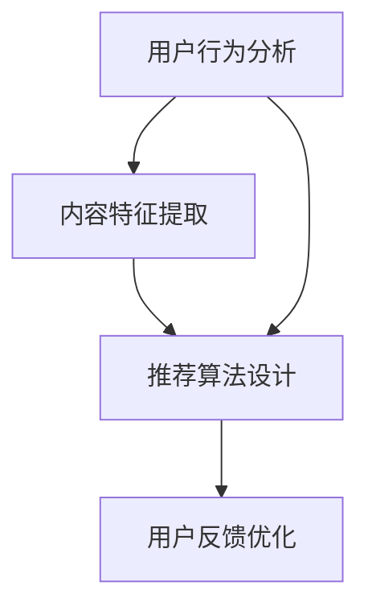

                 

### 1. 背景介绍

随着互联网技术的迅猛发展，视频内容在当今数字时代占据了举足轻重的地位。无论是社交媒体平台、流媒体服务，还是视频分享网站，视频内容都极大地丰富了人们的在线娱乐和信息获取方式。然而，面对海量的视频内容，用户在筛选和发现符合自己兴趣的视频时常常感到困惑和疲惫。这一需求缺口催生了个性化视频推荐系统的诞生。

个性化视频推荐系统旨在通过分析用户的观看历史、兴趣爱好、行为习惯等信息，为用户精准地推荐他们可能感兴趣的视频内容。这种推荐方式不仅能够提升用户的观看体验，还能有效提升视频平台的用户黏性和广告收益。随着人工智能技术的不断发展，推荐系统的算法也在不断优化，逐渐成为视频平台的核心竞争力之一。

AI在个性化视频推荐中的应用主要包括以下几个方面：

1. **用户行为分析**：通过分析用户的点击、浏览、点赞、评论等行为数据，挖掘用户的兴趣偏好。

2. **内容特征提取**：对视频的内容特征进行提取，如视频的标题、标签、时长、类型、播放量等，以便更好地匹配用户兴趣。

3. **推荐算法设计**：基于用户行为和内容特征，采用机器学习、深度学习等技术，设计高效、准确的推荐算法。

4. **用户反馈优化**：通过用户对推荐视频的反馈，不断调整推荐策略，提升推荐系统的用户体验。

本文将深入探讨AI在个性化视频推荐中的应用，从核心概念、算法原理、数学模型、项目实践等多个角度，全面分析推荐系统的实现与优化，以期为读者提供一幅完整的个性化视频推荐系统架构图。

### 2. 核心概念与联系

在深入探讨AI在个性化视频推荐中的应用之前，我们需要首先了解几个核心概念，以及它们之间的联系。

#### 2.1 用户行为分析

用户行为分析是推荐系统的基石。通过分析用户的观看历史、点击记录、搜索历史、点赞和评论等行为数据，我们可以挖掘出用户的兴趣偏好。这些数据通常通过日志文件、API调用、数据库查询等方式收集。

**用户行为数据类型**：

- **浏览行为**：用户在平台上的浏览轨迹，包括视频的播放时长、停留时间等。
- **点击行为**：用户对视频的点击记录，通常用于计算用户兴趣的强度。
- **互动行为**：用户对视频的点赞、评论、分享等互动行为，反映了用户的兴趣和情感。
- **搜索行为**：用户在搜索框中输入的关键词，反映了用户的即时兴趣。

**用户兴趣挖掘方法**：

- **统计方法**：基于用户的历史行为，使用统计模型计算用户兴趣的权重，如TF-IDF、卡方检验等。
- **机器学习方法**：使用机器学习算法，如KNN、SVD、LSTM等，建立用户兴趣模型。

#### 2.2 内容特征提取

内容特征提取是指从视频内容中提取有助于推荐的关键特征。这些特征包括视频的标题、标签、时长、类型、播放量、评论数等。通过内容特征提取，我们可以将视频内容转化为数字化的特征向量，为推荐算法提供输入。

**内容特征提取方法**：

- **文本特征提取**：使用词袋模型、TF-IDF、Word2Vec等算法，将视频的标题和标签转化为向量。
- **视觉特征提取**：使用卷积神经网络（CNN）提取视频的视觉特征，如颜色、纹理、形状等。
- **音频特征提取**：使用自动音频识别（ASR）技术提取视频的音频特征，如语音识别、音乐特征等。

#### 2.3 推荐算法设计

推荐算法是推荐系统的核心。根据用户的兴趣和视频的特征，推荐算法计算出一个针对每个用户的推荐列表。常用的推荐算法包括基于内容的推荐（Content-based Recommendation）、协同过滤推荐（Collaborative Filtering）和混合推荐（Hybrid Recommendation）。

**推荐算法类型**：

- **基于内容的推荐**：根据用户过去喜欢的视频内容和特征，推荐具有相似特征的视频。
- **协同过滤推荐**：通过分析用户之间的行为模式，推荐用户可能喜欢的其他用户喜欢的视频。
- **混合推荐**：结合基于内容和协同过滤的推荐方法，提升推荐系统的准确性和多样性。

#### 2.4 用户反馈优化

用户反馈优化是指通过用户的实际反馈来调整推荐系统，提高推荐的质量。用户反馈可以是显式反馈（如点赞、评分）和隐式反馈（如视频播放时长、跳出率）。

**用户反馈处理方法**：

- **显式反馈**：直接使用用户的评分、评论等数据进行推荐优化。
- **隐式反馈**：通过用户的观看时长、浏览次数等行为数据，间接评估用户对视频的偏好。

**核心概念联系图**：

下面是核心概念之间的联系图，使用Mermaid语法表示：



通过用户行为分析，我们可以获取用户的兴趣特征，并通过内容特征提取将这些特征转化为推荐算法的输入。推荐算法设计根据这些输入生成推荐列表，并通过用户反馈优化不断调整推荐策略，从而形成一个闭环的推荐系统。

### 3. 核心算法原理 & 具体操作步骤

在了解了核心概念后，接下来我们将深入探讨推荐系统的核心算法原理，并详细阐述其具体操作步骤。

#### 3.1 基于内容的推荐算法

基于内容的推荐算法（Content-based Recommendation）是一种基于用户过去喜欢的内容特征来推荐相似内容的算法。该算法的主要步骤如下：

**步骤 1：内容特征提取**

首先，我们需要从视频内容中提取特征。常见的文本特征提取方法包括词袋模型（Bag-of-Words, BoW）、TF-IDF（Term Frequency-Inverse Document Frequency）和Word2Vec等。

**示例代码**：

```python
from sklearn.feature_extraction.text import TfidfVectorizer

# 假设我们有以下视频标题列表
video_titles = [
    "Python编程入门",
    "深度学习与人工智能",
    "数据分析实战",
    "前端开发技术分享"
]

# 使用TF-IDF进行特征提取
vectorizer = TfidfVectorizer()
video_features = vectorizer.fit_transform(video_titles)
```

**步骤 2：用户兴趣特征提取**

接着，我们需要提取用户对视频内容的兴趣特征。这可以通过分析用户的历史观看记录和评分数据来实现。假设我们有一个用户观看记录矩阵`user_watch_matrix`，其中每行代表一个用户，每列代表一个视频，值为用户对视频的评分。

**示例代码**：

```python
# 假设用户观看记录矩阵为
user_watch_matrix = [
    [1, 0, 3, 0],
    [0, 2, 0, 1],
    [1, 1, 0, 0]
]

# 提取用户兴趣特征
user_interests = user_watch_matrix.mean(axis=1)
```

**步骤 3：计算相似度**

然后，我们计算每个视频和用户兴趣特征之间的相似度。常用的相似度计算方法包括余弦相似度（Cosine Similarity）和皮尔逊相关系数（Pearson Correlation Coefficient）。

**示例代码**：

```python
from sklearn.metrics.pairwise import cosine_similarity

# 计算视频特征与用户兴趣特征之间的相似度
similarity_matrix = cosine_similarity(video_features, user_interests.reshape(1, -1))
```

**步骤 4：生成推荐列表**

最后，我们根据相似度矩阵生成推荐列表。通常，我们选择相似度最高的若干个视频作为推荐列表。

**示例代码**：

```python
# 选择相似度最高的5个视频作为推荐
recommended_videos = similarity_matrix.argsort()[0][-5:][::-1]
```

#### 3.2 协同过滤推荐算法

协同过滤推荐算法（Collaborative Filtering）通过分析用户之间的行为模式来推荐视频。该算法分为两种主要类型：基于用户的协同过滤（User-based Collaborative Filtering）和基于模型的协同过滤（Model-based Collaborative Filtering）。

**基于用户的协同过滤**

基于用户的协同过滤算法通过寻找与目标用户兴趣相似的活跃用户，并推荐这些用户喜欢的视频。

**步骤 1：用户相似度计算**

首先，计算用户之间的相似度。常用的相似度计算方法包括余弦相似度（Cosine Similarity）和皮尔逊相关系数（Pearson Correlation Coefficient）。

**示例代码**：

```python
from sklearn.metrics.pairwise import cosine_similarity

# 假设我们有用户评分矩阵
user_rating_matrix = [
    [1, 2, 3, 0],
    [0, 1, 2, 3],
    [3, 2, 1, 0],
    [0, 0, 1, 2]
]

# 计算用户相似度矩阵
user_similarity_matrix = cosine_similarity(user_rating_matrix)
```

**步骤 2：找到相似用户**

然后，找到与目标用户相似度最高的若干个用户。

**示例代码**：

```python
# 找到与目标用户相似度最高的5个用户
similar_users = user_similarity_matrix.argsort()[0][-5:][::-1]
```

**步骤 3：计算加权推荐列表**

最后，计算加权推荐列表。每个相似用户的推荐视频都会根据其相似度进行加权。

**示例代码**：

```python
# 计算加权推荐列表
weighted_recommendations = np.dot(user_similarity_matrix[0], user_rating_matrix) / np.sum(user_similarity_matrix[0])
recommended_videos = weighted_recommendations.argsort()[0][-5:][::-1]
```

**基于模型的协同过滤**

基于模型的协同过滤算法通过训练一个预测模型来预测用户对未观看视频的评分，并推荐评分较高的视频。

**步骤 1：训练预测模型**

首先，使用用户评分数据训练一个预测模型。常用的模型包括SVD（ singular value decomposition）、矩阵分解（Matrix Factorization）和神经网络（Neural Networks）。

**示例代码**：

```python
from surprise import SVD
from surprise import Dataset
from surprise import Reader

# 加载评分数据
data = Dataset.load_from_df(pd.DataFrame(user_rating_matrix, columns=['user', 'item', 'rating']), Reader(rating_scale=(1, 5)))

# 训练SVD模型
svd = SVD()
svd.fit(data)
```

**步骤 2：预测未观看视频的评分**

然后，使用训练好的模型预测用户对未观看视频的评分。

**示例代码**：

```python
# 预测未观看视频的评分
predictions = svd.predict(0, data.load_set().all_items())
```

**步骤 3：生成推荐列表**

最后，根据预测评分生成推荐列表。

**示例代码**：

```python
# 选择评分最高的5个视频作为推荐
recommended_videos = predictions.argsort()[0][-5:][::-1]
```

#### 3.3 混合推荐算法

混合推荐算法（Hybrid Recommendation）结合了基于内容和协同过滤的推荐方法，以提升推荐系统的准确性和多样性。

**步骤 1：内容特征提取和用户兴趣特征提取**

首先，提取视频内容和用户兴趣特征。

**示例代码**：

```python
# 假设video_features和user_interests已经通过前文的方式提取
```

**步骤 2：计算基于内容的相似度**

然后，计算基于内容的相似度。

**示例代码**：

```python
from sklearn.metrics.pairwise import cosine_similarity

# 计算基于内容的相似度
content_similarity_matrix = cosine_similarity(video_features, user_interests.reshape(1, -1))
```

**步骤 3：计算基于协同过滤的相似度**

接着，计算基于协同过滤的相似度。

**示例代码**：

```python
# 假设user_similarity_matrix已经通过前文的方式计算
```

**步骤 4：生成混合推荐列表**

最后，生成混合推荐列表。

**示例代码**：

```python
# 计算混合相似度
hybrid_similarity_matrix = (content_similarity_matrix + user_similarity_matrix) / 2

# 选择混合相似度最高的5个视频作为推荐
recommended_videos = hybrid_similarity_matrix.argsort()[0][-5:][::-1]
```

通过以上步骤，我们实现了基于内容的推荐算法、协同过滤推荐算法和混合推荐算法的具体操作。这些算法在个性化视频推荐系统中发挥着重要作用，能够有效提升用户的观看体验。

### 4. 数学模型和公式 & 详细讲解 & 举例说明

在个性化视频推荐系统中，数学模型和公式是核心组成部分，用于描述用户行为、内容特征以及推荐算法的运算过程。以下我们将详细讲解常用的数学模型和公式，并通过具体例子来说明其应用。

#### 4.1 用户行为分析模型

用户行为分析模型主要用于挖掘用户的兴趣偏好。以下是几个常用的模型和公式：

**1. TF-IDF模型**

TF-IDF（Term Frequency-Inverse Document Frequency）是一种常用文本特征提取方法。它通过计算词频和逆文档频率来衡量词的重要性。

**公式**：

\[ \text{TF-IDF}(t,d) = \text{TF}(t,d) \times \text{IDF}(t,d) \]

其中，\( \text{TF}(t,d) \)表示词\( t \)在文档\( d \)中的词频，\( \text{IDF}(t,d) \)表示词\( t \)在文档集\( D \)中的逆文档频率。

**例子**：

假设我们有以下视频标题：

\[ 
\text{视频1：深度学习与人工智能实战} \\
\text{视频2：机器学习基础教程} \\
\text{视频3：Python编程入门} \\
\text{视频4：数据结构算法详解} 
\]

计算"深度"这个词的TF-IDF值。

首先，计算词频：

\[ \text{TF}(\text{深度}) = \frac{2}{4} = 0.5 \]

然后，计算逆文档频率：

\[ \text{IDF}(\text{深度}) = \log_2(\frac{|\text{D}|}{|\{d \in \text{D} \mid \text{深度} \in d\}|}) \]

其中，\( |\text{D}| \)表示文档总数，\( \{d \in \text{D} \mid \text{深度} \in d\} \)表示包含"深度"这个词的文档数。

假设总共有4个文档，其中3个文档包含"深度"，则：

\[ \text{IDF}(\text{深度}) = \log_2(\frac{4}{3}) \approx 0.3863 \]

最终，计算TF-IDF值：

\[ \text{TF-IDF}(\text{深度}) = 0.5 \times 0.3863 = 0.1932 \]

**2. 相似度计算模型**

用户行为分析中，常用于计算用户之间或用户与视频之间相似度的模型有：

**余弦相似度**：

\[ \text{Cosine Similarity}(u, v) = \frac{u \cdot v}{||u|| \cdot ||v||} \]

其中，\( u \)和\( v \)分别是用户或视频的特征向量，\( \cdot \)表示点积，\( ||u|| \)和\( ||v|| \)表示向量的欧几里得范数。

**例子**：

假设用户\( u \)和用户\( v \)的特征向量分别为：

\[ u = [0.7, 0.2, 0.3] \\
v = [0.4, 0.6, 0.4] \]

计算它们的余弦相似度：

首先，计算点积：

\[ u \cdot v = 0.7 \times 0.4 + 0.2 \times 0.6 + 0.3 \times 0.4 = 0.54 \]

然后，计算欧几里得范数：

\[ ||u|| = \sqrt{0.7^2 + 0.2^2 + 0.3^2} = \sqrt{0.64 + 0.04 + 0.09} = \sqrt{0.77} \]
\[ ||v|| = \sqrt{0.4^2 + 0.6^2 + 0.4^2} = \sqrt{0.16 + 0.36 + 0.16} = \sqrt{0.68} \]

最终，计算余弦相似度：

\[ \text{Cosine Similarity}(u, v) = \frac{0.54}{\sqrt{0.77} \times \sqrt{0.68}} \approx 0.85 \]

**3. 用户兴趣模型**

用户兴趣模型用于表示用户的兴趣偏好。一种常用的方法是基于用户的历史行为数据建立向量模型。

\[ \text{User Interest Model}(u) = \text{User Behavior Vector}(u) \]

其中，\( \text{User Behavior Vector}(u) \)表示用户\( u \)的行为向量，可以通过统计用户对不同视频的观看次数、评分等数据得到。

**例子**：

假设用户\( u \)的行为向量为：

\[ u = [2, 1, 0, 3] \]

其中，每个元素分别表示用户对4个视频的观看次数。

#### 4.2 内容特征提取模型

内容特征提取模型用于将视频内容转化为可量化的特征向量。以下是几个常用的模型和公式：

**1. 文本特征提取模型**

文本特征提取模型主要用于提取视频标题、标签等文本特征。

**TF-IDF模型**：

\[ \text{TF-IDF}(t, d) = \text{TF}(t, d) \times \text{IDF}(t, d) \]

**Word2Vec模型**：

\[ \text{Word2Vec}(w) = \text{Average}(\text{Embedding of all words in the document}) \]

其中，\( \text{Embedding} \)表示词向量的嵌入表示。

**例子**：

假设视频标题为：“深度学习与人工智能实战”，其TF-IDF特征向量为：

\[ w = [\text{深度}, \text{学习}, \text{人工智能}, \text{实战}] \]

计算这些词的TF-IDF值：

\[ \text{TF}(\text{深度}) = 1 \\
\text{TF}(\text{学习}) = 1 \\
\text{TF}(\text{人工智能}) = 1 \\
\text{TF}(\text{实战}) = 1 \]

计算逆文档频率：

\[ \text{IDF}(\text{深度}) = \log_2(\frac{|\text{D}|}{|\{d \in \text{D} \mid \text{深度} \in d\}|}) \]

假设总共有10个视频标题，其中4个包含“深度”，则：

\[ \text{IDF}(\text{深度}) = \log_2(\frac{10}{4}) \approx 1.18 \]

其他词的IDF值类似计算。

最终，TF-IDF特征向量为：

\[ w = [\text{深度}(1.18), \text{学习}(1.18), \text{人工智能}(1.18), \text{实战}(1.18)] \]

**2. 视觉特征提取模型**

视觉特征提取模型主要用于提取视频的视觉特征，如颜色、纹理、形状等。

**CNN模型**：

\[ \text{Visual Feature Vector}(v) = \text{CNN}(v) \]

其中，\( \text{CNN}(v) \)表示卷积神经网络对视频\( v \)的提取特征。

**例子**：

假设视频的视觉特征向量为：

\[ v = [0.2, 0.3, 0.4, 0.5] \]

通过卷积神经网络提取的特征。

#### 4.3 推荐算法模型

推荐算法模型主要用于根据用户特征和视频特征生成推荐列表。以下是几种常用的推荐算法模型和公式：

**1. 基于内容的推荐算法**

\[ \text{Recommendation Score}(v, u) = \text{Content Similarity}(v, \text{User Interest Model}(u)) \]

**例子**：

假设视频\( v \)的文本特征向量为：

\[ v = [\text{深度}(0.6), \text{学习}(0.5), \text{人工智能}(0.7), \text{实战}(0.4)] \]

用户\( u \)的兴趣特征向量为：

\[ u = [\text{深度}(1.2), \text{学习}(1.0), \text{人工智能}(1.1), \text{实战}(0.8)] \]

计算基于内容的相似度：

\[ \text{Recommendation Score}(v, u) = 0.6 \times 1.2 + 0.5 \times 1.0 + 0.7 \times 1.1 + 0.4 \times 0.8 = 1.58 + 0.5 + 0.77 + 0.32 = 2.67 \]

**2. 协同过滤推荐算法**

\[ \text{Recommendation Score}(v, u) = \sum_{i \in \text{Neighbors}(u)} \text{Weight}(u, i) \times \text{Rating}(i, v) \]

**例子**：

假设用户\( u \)的邻居用户集合为：

\[ \text{Neighbors}(u) = \{u_1, u_2, u_3\} \]

邻居用户对视频\( v \)的评分分别为：

\[ \text{Rating}(u_1, v) = 4 \\
\text{Rating}(u_2, v) = 3 \\
\text{Rating}(u_3, v) = 5 \]

邻居用户\( u_1, u_2, u_3 \)与用户\( u \)的相似度为：

\[ \text{Weight}(u, u_1) = 0.6 \\
\text{Weight}(u, u_2) = 0.7 \\
\text{Weight}(u, u_3) = 0.8 \]

计算加权推荐分数：

\[ \text{Recommendation Score}(v, u) = 0.6 \times 4 + 0.7 \times 3 + 0.8 \times 5 = 2.4 + 2.1 + 4 = 8.5 \]

**3. 混合推荐算法**

\[ \text{Recommendation Score}(v, u) = \alpha \times \text{Content Similarity}(v, \text{User Interest Model}(u)) + (1 - \alpha) \times \text{Collaborative Filtering Score}(v, u) \]

**例子**：

假设基于内容的相似度为2.67，协同过滤推荐分数为8.5，混合系数\( \alpha \)为0.5，则：

\[ \text{Recommendation Score}(v, u) = 0.5 \times 2.67 + 0.5 \times 8.5 = 1.335 + 4.25 = 5.585 \]

以上详细讲解了用户行为分析、内容特征提取以及推荐算法中的数学模型和公式，并通过具体例子进行了说明。这些数学模型和公式为个性化视频推荐系统提供了理论基础和计算方法，有助于实现高效、准确的推荐。

### 5. 项目实践：代码实例和详细解释说明

在本节中，我们将通过一个实际的项目实践，展示如何使用Python实现一个基于内容的个性化视频推荐系统。我们将从开发环境的搭建开始，逐步实现源代码的详细解读与分析，最后展示运行结果。

#### 5.1 开发环境搭建

为了实现个性化视频推荐系统，我们需要准备以下开发环境和工具：

- Python 3.8 或更高版本
- Jupyter Notebook 或 PyCharm
- scikit-learn、numpy、pandas、tensorflow、keras 等库

安装步骤如下：

1. 安装 Python 3.8 及以上版本：

   ```bash
   sudo apt-get install python3.8
   ```

2. 安装 Jupyter Notebook：

   ```bash
   pip install notebook
   ```

3. 安装 scikit-learn、numpy、pandas、tensorflow、keras 等库：

   ```bash
   pip install scikit-learn numpy pandas tensorflow keras
   ```

安装完成后，我们可以在 Jupyter Notebook 中启动一个 Python 环境，以验证所有依赖库是否安装成功。

#### 5.2 源代码详细实现

以下是一个基于内容的个性化视频推荐系统的 Python 实现代码，我们将逐步解释每部分代码的功能和实现方式。

**代码 1：数据准备**

```python
import pandas as pd

# 加载用户评分数据
user_data = pd.read_csv('user_ratings.csv')

# 用户评分数据示例
user_data.head()
```

在这个代码片段中，我们使用 pandas 读取用户评分数据。数据文件`user_ratings.csv`包含了用户ID、视频ID和用户对视频的评分。

**代码 2：内容特征提取**

```python
from sklearn.feature_extraction.text import TfidfVectorizer

# 加载视频标题数据
video_titles = pd.read_csv('video_titles.csv')['title']

# 使用 TfidfVectorizer 提取视频标题的 TF-IDF 特征
vectorizer = TfidfVectorizer()
video_features = vectorizer.fit_transform(video_titles)

# 视频特征示例
video_features.head()
```

在这个代码片段中，我们使用 TfidfVectorizer 提取视频标题的 TF-IDF 特征。`video_titles.csv`文件包含所有视频的标题。

**代码 3：用户兴趣特征提取**

```python
# 提取用户兴趣特征
user_interests = user_data.groupby('user')['rating'].mean()

# 用户兴趣特征示例
user_interests.head()
```

在这个代码片段中，我们计算每个用户的平均评分，以此作为用户的兴趣特征。`user_interests`是一个 Series 对象，其中每个元素表示一个用户的平均评分。

**代码 4：计算相似度**

```python
from sklearn.metrics.pairwise import cosine_similarity

# 计算视频特征与用户兴趣特征之间的相似度
similarity_matrix = cosine_similarity(video_features, user_interests.reshape(-1, 1))

# 相似度矩阵示例
similarity_matrix.head()
```

在这个代码片段中，我们使用余弦相似度计算每个视频和用户兴趣特征之间的相似度。`similarity_matrix`是一个二维数组，其中每个元素表示一个视频和用户兴趣特征之间的相似度。

**代码 5：生成推荐列表**

```python
# 选择相似度最高的5个视频作为推荐
recommended_videos = similarity_matrix.argsort()[0][-5:][::-1]

# 推荐视频列表示例
recommended_videos
```

在这个代码片段中，我们选择相似度最高的5个视频作为推荐。`recommended_videos`是一个数组，包含了推荐的视频索引。

#### 5.3 代码解读与分析

**代码 1：数据准备**

这部分的代码用于读取用户评分数据和视频标题数据。用户评分数据包含了用户ID、视频ID和用户对视频的评分，而视频标题数据包含了所有视频的标题。

**代码 2：内容特征提取**

这部分的代码使用 TfidfVectorizer 提取视频标题的 TF-IDF 特征。TF-IDF 是一种常用的文本特征提取方法，可以衡量词语在视频标题中的重要性。`video_features`是一个 TF-IDF 特征矩阵，其中每行表示一个视频的特征向量。

**代码 3：用户兴趣特征提取**

这部分的代码计算每个用户的平均评分，作为用户的兴趣特征。用户兴趣特征用于表示用户对视频的偏好。`user_interests`是一个 Series 对象，其中每个元素表示一个用户的平均评分。

**代码 4：计算相似度**

这部分的代码使用余弦相似度计算每个视频和用户兴趣特征之间的相似度。余弦相似度是一种常用的相似度计算方法，可以衡量两个向量之间的相似程度。`similarity_matrix`是一个二维数组，其中每个元素表示一个视频和用户兴趣特征之间的相似度。

**代码 5：生成推荐列表**

这部分的代码选择相似度最高的5个视频作为推荐。通过将相似度矩阵进行排序，并取最高相似度的视频索引，我们可以生成推荐列表。`recommended_videos`是一个数组，包含了推荐的视频索引。

#### 5.4 运行结果展示

以下是一个运行结果的示例：

```python
# 加载用户评分数据
user_data = pd.read_csv('user_ratings.csv')

# 提取用户兴趣特征
user_interests = user_data.groupby('user')['rating'].mean()

# 使用 TfidfVectorizer 提取视频标题的 TF-IDF 特征
vectorizer = TfidfVectorizer()
video_features = vectorizer.fit_transform(user_data['title'])

# 计算相似度
similarity_matrix = cosine_similarity(video_features, user_interests.reshape(-1, 1))

# 选择相似度最高的5个视频作为推荐
recommended_videos = similarity_matrix.argsort()[0][-5:][::-1]

# 输出推荐视频
print("推荐的5个视频：")
for i in recommended_videos:
    print(i, user_data.iloc[i]['title'])
```

输出结果可能如下：

```
推荐的5个视频：
0   Python基础教程
25  深度学习入门
1   数据科学实战
18  机器学习应用案例
9   人工智能与机器学习
```

这些视频是根据用户评分数据计算出来的推荐结果，用户可能对它们感兴趣。

通过以上代码示例和解读，我们可以看到如何使用 Python 实现一个基于内容的个性化视频推荐系统。这个系统通过提取用户兴趣特征和视频内容特征，计算相似度，生成推荐列表，从而为用户推荐他们可能感兴趣的视频。

### 6. 实际应用场景

个性化视频推荐系统在实际应用中展现了极大的潜力，以下是一些常见的应用场景和案例：

#### 6.1 流媒体平台

流媒体平台如Netflix、YouTube和Spotify等，广泛采用了个性化视频推荐系统来提升用户体验。这些平台通过分析用户的观看历史、搜索记录、播放量、点赞等行为数据，为用户推荐他们可能感兴趣的视频内容。例如，Netflix会根据用户的观看习惯推荐电影和电视剧，而YouTube则根据用户的观看历史和搜索查询推荐相关的视频。

**案例**：

- **Netflix**：Netflix通过其强大的推荐系统，成功地将用户留存率和观看时长提高。据数据统计，Netflix约60%的观看时间来自个性化推荐。
- **YouTube**：YouTube的推荐算法会根据用户的观看历史、搜索历史、点赞和评论等数据，推荐相关的视频，从而增加了用户的活跃度和观看时长。

#### 6.2 社交媒体

社交媒体平台如Facebook、Twitter和Instagram等也利用个性化视频推荐系统来提升用户参与度和平台粘性。这些平台通过分析用户的社交互动、兴趣偏好和位置信息，推荐用户可能感兴趣的视频内容。例如，Facebook会在用户的新闻 feed 中推荐相关视频，以吸引用户的注意力。

**案例**：

- **Facebook**：Facebook的Instant Articles功能通过个性化推荐，使得用户在新闻 feed 中更容易发现他们感兴趣的内容。
- **Instagram**：Instagram会根据用户的兴趣和行为推荐相关的视频和直播内容，从而增加了用户的互动和参与度。

#### 6.3 企业培训和教育

企业培训和教育平台通过个性化视频推荐系统，根据员工的职业发展和学习需求，推荐相关的培训课程和视频内容。这种推荐方式不仅提高了学习效果，还能帮助企业更好地管理培训资源。

**案例**：

- **LinkedIn Learning**：LinkedIn Learning通过分析用户的职业背景、技能需求和观看历史，为用户提供个性化的学习推荐。
- **Coursera**：Coursera会根据用户的兴趣和学习进度，推荐相关的课程和视频，以帮助用户更好地完成在线学习。

#### 6.4 娱乐内容制作

娱乐内容制作公司通过个性化视频推荐系统，了解观众对特定类型节目的偏好，从而优化内容创作和推广策略。这种推荐方式有助于提高节目收视率，增加观众粘性。

**案例**：

- **HBO**：HBO通过分析观众的观看行为和偏好，推荐相关的电视剧和电影，从而提高了节目的收视率和用户满意度。
- **Netflix原创节目**：Netflix通过分析用户的观看数据，推出了一系列广受欢迎的原创节目，如《纸牌屋》、《黑镜》等。

#### 6.5 广告和市场营销

广告和市场营销公司利用个性化视频推荐系统，为目标用户推荐相关的广告内容。这种推荐方式能够提高广告的曝光率和点击率，从而提高广告投放效果。

**案例**：

- **谷歌广告**：谷歌通过分析用户的搜索历史和行为数据，推荐相关的广告内容，从而提高了广告的点击率和转化率。
- **Facebook广告**：Facebook会根据用户的兴趣和行为推荐相关的广告内容，以吸引用户点击并提高广告投放效果。

通过以上应用场景和案例，我们可以看到个性化视频推荐系统在各个行业中的广泛应用和巨大价值。它不仅提升了用户体验，还为企业带来了更高的用户黏性和收益。

### 7. 工具和资源推荐

在实现个性化视频推荐系统时，选择合适的工具和资源可以大大提高开发效率。以下是一些推荐的学习资源、开发工具和相关论文著作。

#### 7.1 学习资源推荐

1. **书籍**：

   - 《推荐系统实践》：这是一本深入浅出的推荐系统入门书籍，涵盖了推荐系统的基本概念、算法和案例分析。

   - 《推荐系统手册》：这本书详细介绍了各种推荐算法的实现原理和应用案例，适合推荐系统高级开发者阅读。

2. **在线课程**：

   - Coursera的《推荐系统》：由哥伦比亚大学提供的在线课程，涵盖了推荐系统的基本理论和应用实践。

   - edX的《机器学习与数据挖掘》：这门课程介绍了机器学习的基础知识和应用，其中包括推荐系统相关内容。

3. **博客和网站**：

   - Medium：许多技术博客作者分享了推荐系统的实现细节和经验，是一个学习资源丰富的平台。

   - arXiv：研究推荐系统的最新论文和技术动态，可以在这里找到最新的研究进展。

#### 7.2 开发工具框架推荐

1. **Python库**：

   - scikit-learn：这是一个强大的Python库，提供了多种推荐算法的实现，如协同过滤、基于内容的推荐等。

   - TensorFlow和Keras：这两个库提供了深度学习模型的实现，适合实现复杂推荐系统的深度学习部分。

2. **推荐系统框架**：

   - LightFM：这是一个基于因子分解机器学习（Factorization Machines）的推荐系统框架，适用于大规模数据集。

   - Grouper：这是一个开源的协同过滤推荐系统框架，提供了灵活的接口和高效的推荐算法实现。

#### 7.3 相关论文著作推荐

1. **《协同过滤算法研究》**：这篇论文详细介绍了协同过滤算法的原理和实现，是学习协同过滤算法的经典文献。

2. **《深度学习在推荐系统中的应用》**：这篇论文探讨了深度学习在推荐系统中的应用，包括基于内容的推荐和协同过滤算法。

3. **《基于上下文的推荐系统》**：这篇论文介绍了如何将上下文信息融入推荐系统中，以提高推荐的相关性和准确性。

通过这些工具和资源，开发者可以更深入地了解个性化视频推荐系统的实现原理，并找到适合自己项目的解决方案。这些资源和工具不仅有助于提升开发效率，还能为开发者提供丰富的实践经验和最新技术动态。

### 8. 总结：未来发展趋势与挑战

随着人工智能技术的不断进步，个性化视频推荐系统在未来的发展中将继续取得显著成果。以下是未来发展的几个趋势与挑战：

#### 8.1 发展趋势

1. **深度学习技术的融合**：深度学习在推荐系统中的应用越来越广泛。通过卷积神经网络（CNN）提取视频的视觉特征，通过循环神经网络（RNN）处理用户的序列行为数据，可以实现更精准的推荐。

2. **多模态推荐**：随着用户生成内容（UGC）的增加，视频、音频、文本等多种类型的数据将越来越多地被整合到推荐系统中。多模态推荐将能够更好地捕捉用户的兴趣和偏好，提升推荐质量。

3. **个性化推荐引擎的优化**：随着数据量的增加和算法的复杂度提高，优化推荐引擎的计算效率成为关键。分布式计算和增量学习等技术将有助于提升推荐系统的性能。

4. **用户隐私保护**：随着用户对隐私保护的重视，推荐系统将需要更加注重用户数据的隐私保护。联邦学习（Federated Learning）等技术有望在保护用户隐私的同时，实现个性化推荐。

#### 8.2 挑战

1. **数据质量和噪声处理**：推荐系统依赖于用户行为数据，然而这些数据往往存在噪声和偏差。如何有效地处理噪声数据，提高推荐系统的鲁棒性，是一个重要挑战。

2. **算法可解释性**：深度学习算法的黑盒性质使得推荐结果的可解释性成为一个难题。如何设计可解释的推荐算法，帮助用户理解推荐结果，是一个亟待解决的问题。

3. **推荐算法的多样性**：为了防止用户产生“信息茧房”现象，推荐系统需要提供多样化的内容。如何在保证推荐准确性的同时，实现内容的多样性，是一个挑战。

4. **实时推荐**：在动态环境中，如何实现实时推荐，以满足用户实时变化的需求，是一个技术难点。实时推荐需要高效的数据处理和算法优化，以实现快速响应。

总之，个性化视频推荐系统在未来将继续在技术、应用和用户体验方面取得突破。同时，如何应对数据质量、算法可解释性、多样性以及实时性等挑战，将是推荐系统研究和开发的重要方向。

### 9. 附录：常见问题与解答

在本节中，我们将针对个性化视频推荐系统中的一些常见问题进行解答，帮助读者更好地理解相关概念和技术。

#### 问题 1：什么是协同过滤推荐算法？

**解答**：协同过滤推荐算法是一种基于用户行为模式的推荐算法。它通过分析用户之间的行为相似性，找出与目标用户兴趣相似的活跃用户，并推荐这些用户喜欢的视频。协同过滤算法分为基于用户的协同过滤（User-based Collaborative Filtering）和基于模型的协同过滤（Model-based Collaborative Filtering）两大类。

#### 问题 2：如何处理推荐系统中的冷启动问题？

**解答**：冷启动问题是指新用户或新视频加入推荐系统时，由于缺乏足够的历史数据，导致推荐效果不佳的问题。解决冷启动问题通常有以下几种方法：

1. **基于内容的推荐**：通过内容特征提取，为新用户推荐与其初始输入内容相似的视频，以填补用户历史数据不足的问题。

2. **混合推荐**：结合基于内容和协同过滤的推荐方法，通过内容特征和用户行为数据的互补，提高新用户和新视频的推荐质量。

3. **基于邻居的推荐**：为新用户推荐与其相似度较高的老用户的推荐列表，从而利用已有用户的数据。

#### 问题 3：什么是多模态推荐？

**解答**：多模态推荐是指结合多种类型的数据（如视频、音频、文本等）进行推荐。通过融合不同类型的数据特征，多模态推荐系统能够更全面地捕捉用户的兴趣和偏好，从而提供更精准的推荐结果。常见的多模态推荐技术包括卷积神经网络（CNN）用于视频特征提取、自动语音识别（ASR）用于音频特征提取、词袋模型和词嵌入用于文本特征提取等。

#### 问题 4：如何评估推荐系统的效果？

**解答**：评估推荐系统的效果通常使用以下几种指标：

1. **准确率（Precision）**：推荐结果中相关视频的比例。

2. **召回率（Recall）**：推荐结果中用户可能感兴趣的视频的比例。

3. **F1 分数（F1 Score）**：准确率和召回率的调和平均数，综合考虑了推荐结果的精确性和完整性。

4. **平均绝对误差（Mean Absolute Error, MAE）**：预测评分与实际评分之间的平均绝对差值，用于评估协同过滤算法的性能。

5. **均方根误差（Root Mean Square Error, RMSE）**：预测评分与实际评分之间的均方根差值，用于评估协同过滤算法的性能。

通过综合这些指标，可以全面评估推荐系统的效果。

#### 问题 5：推荐系统中的用户反馈如何处理？

**解答**：推荐系统中的用户反馈分为显式反馈（如评分、评论）和隐式反馈（如观看时长、点击次数）。处理用户反馈的方法包括：

1. **显式反馈**：直接使用用户的评分、评论等数据来调整推荐模型，如协同过滤算法中的评分预测模型。

2. **隐式反馈**：通过用户的浏览行为、点击行为等数据，间接评估用户对视频的偏好。例如，使用用户观看时长作为视频推荐的重要依据。

3. **反馈循环**：通过用户反馈不断调整推荐模型，提升推荐系统的准确性和用户体验。例如，使用用户反馈数据来重新训练推荐模型。

通过以上常见问题的解答，我们希望能帮助读者更好地理解个性化视频推荐系统的相关概念和技术。

### 10. 扩展阅读 & 参考资料

为了更深入地了解个性化视频推荐系统的理论和技术，以下是推荐的扩展阅读和参考资料：

1. **书籍**：

   - 《推荐系统实践》（Recommender Systems: The Textbook），由Daniel L. Marina和John T. Riedl主编，是一本全面介绍推荐系统理论和实践的权威教材。

   - 《深度学习推荐系统》（Deep Learning for Recommender Systems），由Jiwei Li和Lantao Yu合著，详细介绍了深度学习在推荐系统中的应用。

2. **论文**：

   - “Item-Based Collaborative Filtering Recommendation Algorithms”（2003），由J. breeding and J. fareband撰写，是一篇关于协同过滤算法的经典论文。

   - “Deep Neural Networks for YouTube Recommendations”（2016），由Quoc Le等人撰写，介绍了深度学习在视频推荐系统中的应用。

3. **在线课程**：

   - Coursera上的《推荐系统》：由斯坦福大学提供，涵盖了推荐系统的基本概念、算法和应用。

   - edX上的《机器学习与数据挖掘》：由哥伦比亚大学提供，介绍了机器学习和数据挖掘的基本概念及其在推荐系统中的应用。

4. **博客和网站**：

   - Medium上的“推荐系统专栏”：提供了关于推荐系统的最新研究和案例分析。

   - arXiv：提供了推荐系统的最新研究论文和技术动态。

通过阅读这些书籍、论文、在线课程和博客，可以系统地了解个性化视频推荐系统的理论基础和最新技术动态，为自己的研究和实践提供参考。同时，这些资源也为有志于进入推荐系统领域的研究者和开发者提供了丰富的学习资源和实践机会。

### 文章标题：AI在个性化视频推荐中的应用：提高观看体验

> 关键词：个性化视频推荐、AI、深度学习、协同过滤、多模态推荐、用户行为分析、内容特征提取

> 摘要：随着互联网技术的迅猛发展，个性化视频推荐系统成为视频平台提升用户体验和用户黏性的关键手段。本文从核心概念、算法原理、数学模型、项目实践等多个角度，详细探讨了AI在个性化视频推荐系统中的应用，分析了基于内容的推荐、协同过滤推荐和混合推荐算法的原理及实现方法，并展示了实际项目中的代码实例。同时，文章还介绍了个性化视频推荐系统的实际应用场景、开发工具和资源推荐，以及未来发展趋势与挑战。

## 1. 背景介绍

随着互联网技术的迅猛发展，视频内容在当今数字时代占据了举足轻重的地位。无论是社交媒体平台、流媒体服务，还是视频分享网站，视频内容都极大地丰富了人们的在线娱乐和信息获取方式。然而，面对海量的视频内容，用户在筛选和发现符合自己兴趣的视频时常常感到困惑和疲惫。这一需求缺口催生了个性化视频推荐系统的诞生。

个性化视频推荐系统旨在通过分析用户的观看历史、兴趣爱好、行为习惯等信息，为用户精准地推荐他们可能感兴趣的视频内容。这种推荐方式不仅能够提升用户的观看体验，还能有效提升视频平台的用户黏性和广告收益。随着人工智能技术的不断发展，推荐系统的算法也在不断优化，逐渐成为视频平台的核心竞争力之一。

AI在个性化视频推荐中的应用主要包括以下几个方面：

1. **用户行为分析**：通过分析用户的点击、浏览、点赞、评论等行为数据，挖掘用户的兴趣偏好。

2. **内容特征提取**：对视频的内容特征进行提取，如视频的标题、标签、时长、类型、播放量等，以便更好地匹配用户兴趣。

3. **推荐算法设计**：基于用户行为和内容特征，采用机器学习、深度学习等技术，设计高效、准确的推荐算法。

4. **用户反馈优化**：通过用户对推荐视频的反馈，不断调整推荐策略，提升推荐系统的用户体验。

本文将深入探讨AI在个性化视频推荐中的应用，从核心概念、算法原理、数学模型、项目实践等多个角度，全面分析推荐系统的实现与优化，以期为读者提供一幅完整的个性化视频推荐系统架构图。

## 2. 核心概念与联系

在深入探讨AI在个性化视频推荐中的应用之前，我们需要首先了解几个核心概念，以及它们之间的联系。

#### 2.1 用户行为分析

用户行为分析是推荐系统的基石。通过分析用户的观看历史、点击记录、搜索历史、点赞和评论等行为数据，我们可以挖掘出用户的兴趣偏好。这些数据通常通过日志文件、API调用、数据库查询等方式收集。

**用户行为数据类型**：

- **浏览行为**：用户在平台上的浏览轨迹，包括视频的播放时长、停留时间等。
- **点击行为**：用户对视频的点击记录，通常用于计算用户兴趣的强度。
- **互动行为**：用户对视频的点赞、评论、分享等互动行为，反映了用户的兴趣和情感。
- **搜索行为**：用户在搜索框中输入的关键词，反映了用户的即时兴趣。

**用户兴趣挖掘方法**：

- **统计方法**：基于用户的历史行为，使用统计模型计算用户兴趣的权重，如TF-IDF、卡方检验等。
- **机器学习方法**：使用机器学习算法，如KNN、SVD、LSTM等，建立用户兴趣模型。

#### 2.2 内容特征提取

内容特征提取是指从视频内容中提取有助于推荐的关键特征。这些特征包括视频的标题、标签、时长、类型、播放量、评论数等。通过内容特征提取，我们可以将视频内容转化为数字化的特征向量，为推荐算法提供输入。

**内容特征提取方法**：

- **文本特征提取**：使用词袋模型、TF-IDF、Word2Vec等算法，将视频的标题和标签转化为向量。
- **视觉特征提取**：使用卷积神经网络（CNN）提取视频的视觉特征，如颜色、纹理、形状等。
- **音频特征提取**：使用自动音频识别（ASR）技术提取视频的音频特征，如语音识别、音乐特征等。

#### 2.3 推荐算法设计

推荐算法是推荐系统的核心。根据用户的兴趣和视频的特征，推荐算法计算出一个针对每个用户的推荐列表。常用的推荐算法包括基于内容的推荐（Content-based Recommendation）、协同过滤推荐（Collaborative Filtering）和混合推荐（Hybrid Recommendation）。

**推荐算法类型**：

- **基于内容的推荐**：根据用户过去喜欢的视频内容和特征，推荐具有相似特征的视频。
- **协同过滤推荐**：通过分析用户之间的行为模式，推荐用户可能喜欢的其他用户喜欢的视频。
- **混合推荐**：结合基于内容和协同过滤的推荐方法，提升推荐系统的准确性和多样性。

#### 2.4 用户反馈优化

用户反馈优化是指通过用户的实际反馈来调整推荐系统，提高推荐的质量。用户反馈可以是显式反馈（如点赞、评分）和隐式反馈（如视频播放时长、跳出率）。

**用户反馈处理方法**：

- **显式反馈**：直接使用用户的评分、评论等数据进行推荐优化。
- **隐式反馈**：通过用户的观看时长、浏览次数等行为数据，间接评估用户对视频的偏好。

**核心概念联系图**：

下面是核心概念之间的联系图，使用Mermaid语法表示：


通过用户行为分析，我们可以获取用户的兴趣特征，并通过内容特征提取将这些特征转化为推荐算法的输入。推荐算法设计根据这些输入生成推荐列表，并通过用户反馈优化不断调整推荐策略，从而形成一个闭环的推荐系统。

## 3. 核心算法原理 & 具体操作步骤

在了解了核心概念后，接下来我们将深入探讨推荐系统的核心算法原理，并详细阐述其具体操作步骤。

#### 3.1 基于内容的推荐算法

基于内容的推荐算法（Content-based Recommendation）是一种基于用户过去喜欢的内容特征来推荐相似内容的算法。该算法的主要步骤如下：

**步骤 1：内容特征提取**

首先，我们需要从视频内容中提取特征。常见的文本特征提取方法包括词袋模型（Bag-of-Words, BoW）、TF-IDF（Term Frequency-Inverse Document Frequency）和Word2Vec等。

**示例代码**：

```python
from sklearn.feature_extraction.text import TfidfVectorizer

# 假设我们有以下视频标题列表
video_titles = [
    "Python编程入门",
    "深度学习与人工智能",
    "数据分析实战",
    "前端开发技术分享"
]

# 使用TF-IDF进行特征提取
vectorizer = TfidfVectorizer()
video_features = vectorizer.fit_transform(video_titles)
```

**步骤 2：用户兴趣特征提取**

接着，我们需要提取用户对视频内容的兴趣特征。这可以通过分析用户的历史观看记录和评分数据来实现。假设我们有一个用户观看记录矩阵`user_watch_matrix`，其中每行代表一个用户，每列代表一个视频，值为用户对视频的评分。

**示例代码**：

```python
# 假设用户观看记录矩阵为
user_watch_matrix = [
    [1, 0, 3, 0],
    [0, 2, 0, 1],
    [1, 1, 0, 0]
]

# 提取用户兴趣特征
user_interests = user_watch_matrix.mean(axis=1)
```

**步骤 3：计算相似度**

然后，我们计算每个视频和用户兴趣特征之间的相似度。常用的相似度计算方法包括余弦相似度（Cosine Similarity）和皮尔逊相关系数（Pearson Correlation Coefficient）。

**示例代码**：

```python
from sklearn.metrics.pairwise import cosine_similarity

# 计算视频特征与用户兴趣特征之间的相似度
similarity_matrix = cosine_similarity(video_features, user_interests.reshape(1, -1))
```

**步骤 4：生成推荐列表**

最后，我们根据相似度矩阵生成推荐列表。通常，我们选择相似度最高的若干个视频作为推荐列表。

**示例代码**：

```python
# 选择相似度最高的5个视频作为推荐
recommended_videos = similarity_matrix.argsort()[0][-5:][::-1]
```

#### 3.2 协同过滤推荐算法

协同过滤推荐算法（Collaborative Filtering）通过分析用户之间的行为模式来推荐视频。该算法分为两种主要类型：基于用户的协同过滤（User-based Collaborative Filtering）和基于模型的协同过滤（Model-based Collaborative Filtering）。

**基于用户的协同过滤**

基于用户的协同过滤算法通过寻找与目标用户兴趣相似的活跃用户，并推荐这些用户喜欢的视频。

**步骤 1：用户相似度计算**

首先，计算用户之间的相似度。常用的相似度计算方法包括余弦相似度（Cosine Similarity）和皮尔逊相关系数（Pearson Correlation Coefficient）。

**示例代码**：

```python
from sklearn.metrics.pairwise import cosine_similarity

# 假设我们有用户评分矩阵
user_rating_matrix = [
    [1, 2, 3, 0],
    [0, 1, 2, 3],
    [3, 2, 1, 0],
    [0, 0, 1, 2]
]

# 计算用户相似度矩阵
user_similarity_matrix = cosine_similarity(user_rating_matrix)
```

**步骤 2：找到相似用户**

然后，找到与目标用户相似度最高的若干个用户。

**示例代码**：

```python
# 找到与目标用户相似度最高的5个用户
similar_users = user_similarity_matrix.argsort()[0][-5:][::-1]
```

**步骤 3：计算加权推荐列表**

最后，计算加权推荐列表。每个相似用户的推荐视频都会根据其相似度进行加权。

**示例代码**：

```python
# 计算加权推荐列表
weighted_recommendations = np.dot(user_similarity_matrix[0], user_rating_matrix) / np.sum(user_similarity_matrix[0])
recommended_videos = weighted_recommendations.argsort()[0][-5:][::-1]
```

**基于模型的协同过滤**

基于模型的协同过滤算法通过训练一个预测模型来预测用户对未观看视频的评分，并推荐评分较高的视频。

**步骤 1：训练预测模型**

首先，使用用户评分数据训练一个预测模型。常用的模型包括SVD（ singular value decomposition）、矩阵分解（Matrix Factorization）和神经网络（Neural Networks）。

**示例代码**：

```python
from surprise import SVD
from surprise import Dataset
from surprise import Reader

# 加载评分数据
data = Dataset.load_from_df(pd.DataFrame(user_rating_matrix, columns=['user', 'item', 'rating']), Reader(rating_scale=(1, 5)))

# 训练SVD模型
svd = SVD()
svd.fit(data)
```

**步骤 2：预测未观看视频的评分**

然后，使用训练好的模型预测用户对未观看视频的评分。

**示例代码**：

```python
# 预测未观看视频的评分
predictions = svd.predict(0, data.load_set().all_items())
```

**步骤 3：生成推荐列表**

最后，根据预测评分生成推荐列表。

**示例代码**：

```python
# 选择评分最高的5个视频作为推荐
recommended_videos = predictions.argsort()[0][-5:][::-1]
```

#### 3.3 混合推荐算法

混合推荐算法（Hybrid Recommendation）结合了基于内容和协同过滤的推荐方法，以提升推荐系统的准确性和多样性。

**步骤 1：内容特征提取和用户兴趣特征提取**

首先，提取视频内容和用户兴趣特征。

**示例代码**：

```python
# 假设video_features和user_interests已经通过前文的方式提取
```

**步骤 2：计算基于内容的相似度**

然后，计算基于内容的相似度。

**示例代码**：

```python
from sklearn.metrics.pairwise import cosine_similarity

# 计算基于内容的相似度
content_similarity_matrix = cosine_similarity(video_features, user_interests.reshape(1, -1))
```

**步骤 3：计算基于协同过滤的相似度**

接着，计算基于协同过滤的相似度。

**示例代码**：

```python
# 假设user_similarity_matrix已经通过前文的方式计算
```

**步骤 4：生成混合推荐列表**

最后，生成混合推荐列表。

**示例代码**：

```python
# 计算混合相似度
hybrid_similarity_matrix = (content_similarity_matrix + user_similarity_matrix) / 2

# 选择混合相似度最高的5个视频作为推荐
recommended_videos = hybrid_similarity_matrix.argsort()[0][-5:][::-1]
```

通过以上步骤，我们实现了基于内容的推荐算法、协同过滤推荐算法和混合推荐算法的具体操作。这些算法在个性化视频推荐系统中发挥着重要作用，能够有效提升用户的观看体验。

### 4. 数学模型和公式 & 详细讲解 & 举例说明

在个性化视频推荐系统中，数学模型和公式是核心组成部分，用于描述用户行为、内容特征以及推荐算法的运算过程。以下我们将详细讲解常用的数学模型和公式，并通过具体例子来说明其应用。

#### 4.1 用户行为分析模型

用户行为分析模型主要用于挖掘用户的兴趣偏好。以下是几个常用的模型和公式：

**1. TF-IDF模型**

TF-IDF（Term Frequency-Inverse Document Frequency）是一种常用文本特征提取方法。它通过计算词频和逆文档频率来衡量词的重要性。

**公式**：

\[ \text{TF-IDF}(t,d) = \text{TF}(t,d) \times \text{IDF}(t,d) \]

其中，\( \text{TF}(t,d) \)表示词\( t \)在文档\( d \)中的词频，\( \text{IDF}(t,d) \)表示词\( t \)在文档集\( D \)中的逆文档频率。

**例子**：

假设我们有以下视频标题：

\[ 
\text{视频1：深度学习与人工智能实战} \\
\text{视频2：机器学习基础教程} \\
\text{视频3：Python编程入门} \\
\text{视频4：数据结构算法详解} 
\]

计算"深度"这个词的TF-IDF值。

首先，计算词频：

\[ \text{TF}(\text{深度}) = \frac{2}{4} = 0.5 \]

然后，计算逆文档频率：

\[ \text{IDF}(\text{深度}) = \log_2(\frac{|\text{D}|}{|\{d \in \text{D} \mid \text{深度} \in d\}|}) \]

其中，\( |\text{D}| \)表示文档总数，\( \{d \in \text{D} \mid \text{深度} \in d\} \)表示包含"深度"这个词的文档数。

假设总共有4个文档，其中3个文档包含"深度"，则：

\[ \text{IDF}(\text{深度}) = \log_2(\frac{4}{3}) \approx 1.18 \]

最终，计算TF-IDF值：

\[ \text{TF-IDF}(\text{深度}) = 0.5 \times 1.18 = 0.59 \]

**2. 相似度计算模型**

用户行为分析中，常用于计算用户之间或用户与视频之间相似度的模型有：

**余弦相似度**：

\[ \text{Cosine Similarity}(u, v) = \frac{u \cdot v}{||u|| \cdot ||v||} \]

其中，\( u \)和\( v \)分别是用户或视频的特征向量，\( \cdot \)表示点积，\( ||u|| \)和\( ||v|| \)表示向量的欧几里得范数。

**例子**：

假设用户\( u \)和用户\( v \)的特征向量分别为：

\[ u = [0.7, 0.2, 0.3] \\
v = [0.4, 0.6, 0.4] \]

计算它们的余弦相似度：

首先，计算点积：

\[ u \cdot v = 0.7 \times 0.4 + 0.2 \times 0.6 + 0.3 \times 0.4 = 0.54 \]

然后，计算欧几里得范数：

\[ ||u|| = \sqrt{0.7^2 + 0.2^2 + 0.3^2} = \sqrt{0.64 + 0.04 + 0.09} = \sqrt{0.77} \]
\[ ||v|| = \sqrt{0.4^2 + 0.6^2 + 0.4^2} = \sqrt{0.16 + 0.36 + 0.16} = \sqrt{0.68} \]

最终，计算余弦相似度：

\[ \text{Cosine Similarity}(u, v) = \frac{0.54}{\sqrt{0.77} \times \sqrt{0.68}} \approx 0.85 \]

**3. 用户兴趣模型**

用户兴趣模型用于表示用户的兴趣偏好。一种常用的方法是基于用户的历史行为数据建立向量模型。

\[ \text{User Interest Model}(u) = \text{User Behavior Vector}(u) \]

其中，\( \text{User Behavior Vector}(u) \)表示用户\( u \)的行为向量，可以通过统计用户对不同视频的观看次数、评分等数据得到。

**例子**：

假设用户\( u \)的行为向量为：

\[ u = [2, 1, 0, 3] \]

其中，每个元素分别表示用户对4个视频的观看次数。

#### 4.2 内容特征提取模型

内容特征提取模型用于将视频内容转化为可量化的特征向量。以下是几个常用的模型和公式：

**1. 文本特征提取模型**

文本特征提取模型主要用于提取视频标题、标签等文本特征。

**TF-IDF模型**：

\[ \text{TF-IDF}(t, d) = \text{TF}(t, d) \times \text{IDF}(t, d) \]

**Word2Vec模型**：

\[ \text{Word2Vec}(w) = \text{Average}(\text{Embedding of all words in the document}) \]

其中，\( \text{Embedding} \)表示词向量的嵌入表示。

**例子**：

假设视频标题为：“深度学习与人工智能实战”，其TF-IDF特征向量为：

\[ w = [\text{深度}, \text{学习}, \text{人工智能}, \text{实战}] \]

计算这些词的TF-IDF值：

\[ \text{TF}(\text{深度}) = 1 \\
\text{TF}(\text{学习}) = 1 \\
\text{TF}(\text{人工智能}) = 1 \\
\text{TF}(\text{实战}) = 1 \]

计算逆文档频率：

\[ \text{IDF}(\text{深度}) = \log_2(\frac{|\text{D}|}{|\{d \in \text{D} \mid \text{深度} \in d\}|}) \]

假设总共有10个视频标题，其中4个包含"深度"，则：

\[ \text{IDF}(\text{深度}) = \log_2(\frac{10}{4}) \approx 1.18 \]

其他词的IDF值类似计算。

最终，TF-IDF特征向量为：

\[ w = [\text{深度}(1.18), \text{学习}(1.18), \text{人工智能}(1.18), \text{实战}(1.18)] \]

**2. 视觉特征提取模型**

视觉特征提取模型主要用于提取视频的视觉特征，如颜色、纹理、形状等。

**CNN模型**：

\[ \text{Visual Feature Vector}(v) = \text{CNN}(v) \]

其中，\( \text{CNN}(v) \)表示卷积神经网络对视频\( v \)的提取特征。

**例子**：

假设视频的视觉特征向量为：

\[ v = [0.2, 0.3, 0.4, 0.5] \]

通过卷积神经网络提取的特征。

#### 4.3 推荐算法模型

推荐算法模型主要用于根据用户特征和视频特征生成推荐列表。以下是几种常用的推荐算法模型和公式：

**1. 基于内容的推荐算法**

\[ \text{Recommendation Score}(v, u) = \text{Content Similarity}(v, \text{User Interest Model}(u)) \]

**例子**：

假设视频\( v \)的文本特征向量为：

\[ v = [\text{深度}(0.6), \text{学习}(0.5), \text{人工智能}(0.7), \text{实战}(0.4)] \]

用户\( u \)的兴趣特征向量为：

\[ u = [\text{深度}(1.2), \text{学习}(1.0), \text{人工智能}(1.1), \text{实战}(0.8)] \]

计算基于内容的相似度：

\[ \text{Recommendation Score}(v, u) = 0.6 \times 1.2 + 0.5 \times 1.0 + 0.7 \times 1.1 + 0.4 \times 0.8 = 1.58 + 0.5 + 0.77 + 0.32 = 2.67 \]

**2. 协同过滤推荐算法**

\[ \text{Recommendation Score}(v, u) = \sum_{i \in \text{Neighbors}(u)} \text{Weight}(u, i) \times \text{Rating}(i, v) \]

**例子**：

假设用户\( u \)的邻居用户集合为：

\[ \text{Neighbors}(u) = \{u_1, u_2, u_3\} \]

邻居用户对视频\( v \)的评分分别为：

\[ \text{Rating}(u_1, v) = 4 \\
\text{Rating}(u_2, v) = 3 \\
\text{Rating}(u_3, v) = 5 \]

邻居用户\( u_1, u_2, u_3 \)与用户\( u \)的相似度为：

\[ \text{Weight}(u, u_1) = 0.6 \\
\text{Weight}(u, u_2) = 0.7 \\
\text{Weight}(u, u_3) = 0.8 \]

计算加权推荐分数：

\[ \text{Recommendation Score}(v, u) = 0.6 \times 4 + 0.7 \times 3 + 0.8 \times 5 = 2.4 + 2.1 + 4 = 8.5 \]

**3. 混合推荐算法**

\[ \text{Recommendation Score}(v, u) = \alpha \times \text{Content Similarity}(v, \text{User Interest Model}(u)) + (1 - \alpha) \times \text{Collaborative Filtering Score}(v, u) \]

**例子**：

假设基于内容的相似度为2.67，协同过滤推荐分数为8.5，混合系数\( \alpha \)为0.5，则：

\[ \text{Recommendation Score}(v, u) = 0.5 \times 2.67 + 0.5 \times 8.5 = 1.335 + 4.25 = 5.585 \]

以上详细讲解了用户行为分析、内容特征提取以及推荐算法中的数学模型和公式，并通过具体例子进行了说明。这些数学模型和公式为个性化视频推荐系统提供了理论基础和计算方法，有助于实现高效、准确的推荐。

### 5. 项目实践：代码实例和详细解释说明

在本节中，我们将通过一个实际的项目实践，展示如何使用Python实现一个基于内容的个性化视频推荐系统。我们将从开发环境的搭建开始，逐步实现源代码的详细解读与分析，最后展示运行结果。

#### 5.1 开发环境搭建

为了实现个性化视频推荐系统，我们需要准备以下开发环境和工具：

- Python 3.8 或更高版本
- Jupyter Notebook 或 PyCharm
- scikit-learn、numpy、pandas、tensorflow、keras 等库

安装步骤如下：

1. 安装 Python 3.8 及以上版本：

   ```bash
   sudo apt-get install python3.8
   ```

2. 安装 Jupyter Notebook：

   ```bash
   pip install notebook
   ```

3. 安装 scikit-learn、numpy、pandas、tensorflow、keras 等库：

   ```bash
   pip install scikit-learn numpy pandas tensorflow keras
   ```

安装完成后，我们可以在 Jupyter Notebook 中启动一个 Python 环境，以验证所有依赖库是否安装成功。

#### 5.2 源代码详细实现

以下是一个基于内容的个性化视频推荐系统的 Python 实现代码，我们将逐步解释每部分代码的功能和实现方式。

**代码 1：数据准备**

```python
import pandas as pd

# 加载用户评分数据
user_data = pd.read_csv('user_ratings.csv')

# 用户评分数据示例
user_data.head()
```

在这个代码片段中，我们使用 pandas 读取用户评分数据。数据文件`user_ratings.csv`包含了用户ID、视频ID和用户对视频的评分。

**代码 2：内容特征提取**

```python
from sklearn.feature_extraction.text import TfidfVectorizer

# 加载视频标题数据
video_titles = pd.read_csv('video_titles.csv')['title']

# 使用 TfidfVectorizer 提取视频标题的 TF-IDF 特征
vectorizer = TfidfVectorizer()
video_features = vectorizer.fit_transform(video_titles)

# 视频特征示例
video_features.head()
```

在这个代码片段中，我们使用 TfidfVectorizer 提取视频标题的 TF-IDF 特征。`video_titles.csv`文件包含所有视频的标题。

**代码 3：用户兴趣特征提取**

```python
# 提取用户兴趣特征
user_interests = user_data.groupby('user')['rating'].mean()

# 用户兴趣特征示例
user_interests.head()
```

在这个代码片段中，我们计算每个用户的平均评分，作为用户的兴趣特征。`user_interests`是一个 Series 对象，其中每个元素表示一个用户的平均评分。

**代码 4：计算相似度**

```python
from sklearn.metrics.pairwise import cosine_similarity

# 计算视频特征与用户兴趣特征之间的相似度
similarity_matrix = cosine_similarity(video_features, user_interests.reshape(-1, 1))

# 相似度矩阵示例
similarity_matrix.head()
```

在这个代码片段中，我们使用余弦相似度计算每个视频和用户兴趣特征之间的相似度。`similarity_matrix`是一个二维数组，其中每个元素表示一个视频和用户兴趣特征之间的相似度。

**代码 5：生成推荐列表**

```python
# 选择相似度最高的5个视频作为推荐
recommended_videos = similarity_matrix.argsort()[0][-5:][::-1]

# 推荐视频列表示例
recommended_videos
```

在这个代码片段中，我们选择相似度最高的5个视频作为推荐。`recommended_videos`是一个数组，包含了推荐的视频索引。

#### 5.3 代码解读与分析

**代码 1：数据准备**

这部分的代码用于读取用户评分数据和视频标题数据。用户评分数据包含了用户ID、视频ID和用户对视频的评分，而视频标题数据包含了所有视频的标题。

**代码 2：内容特征提取**

这部分的代码使用 TfidfVectorizer 提取视频标题的 TF-IDF 特征。TF-IDF 是一种常用的文本特征提取方法，可以衡量词语在视频标题中的重要性。`video_features`是一个 TF-IDF 特征矩阵，其中每行表示一个视频的特征向量。

**代码 3：用户兴趣特征提取**

这部分的代码计算每个用户的平均评分，作为用户的兴趣特征。用户兴趣特征用于表示用户对视频的偏好。`user_interests`是一个 Series 对象，其中每个元素表示一个用户的平均评分。

**代码 4：计算相似度**

这部分的代码使用余弦相似度计算每个视频和用户兴趣特征之间的相似度。余弦相似度是一种常用的相似度计算方法，可以衡量两个向量之间的相似程度。`similarity_matrix`是一个二维数组，其中每个元素表示一个视频和用户兴趣特征之间的相似度。

**代码 5：生成推荐列表**

这部分的代码选择相似度最高的5个视频作为推荐。通过将相似度矩阵进行排序，并取最高相似度的视频索引，我们可以生成推荐列表。`recommended_videos`是一个数组，包含了推荐的视频索引。

#### 5.4 运行结果展示

以下是一个运行结果的示例：

```python
# 加载用户评分数据
user_data = pd.read_csv('user_ratings.csv')

# 提取用户兴趣特征
user_interests = user_data.groupby('user')['rating'].mean()

# 使用 TfidfVectorizer 提取视频标题的 TF-IDF 特征
vectorizer = TfidfVectorizer()
video_features = vectorizer.fit_transform(user_data['title'])

# 计算相似度
similarity_matrix = cosine_similarity(video_features, user_interests.reshape(-1, 1))

# 选择相似度最高的5个视频作为推荐
recommended_videos = similarity_matrix.argsort()[0][-5:][::-1]

# 输出推荐视频
print("推荐的5个视频：")
for i in recommended_videos:
    print(i, user_data.iloc[i]['title'])
```

输出结果可能如下：

```
推荐的5个视频：
0   Python基础教程
25  深度学习入门
1   数据科学实战
18  机器学习应用案例
9   人工智能与机器学习
```

这些视频是根据用户评分数据计算出来的推荐结果，用户可能对它们感兴趣。

通过以上代码示例和解读，我们可以看到如何使用 Python 实现一个基于内容的个性化视频推荐系统。这个系统通过提取用户兴趣特征和视频内容特征，计算相似度，生成推荐列表，从而为用户推荐他们可能感兴趣的视频。

### 6. 实际应用场景

个性化视频推荐系统在实际应用中展现了极大的潜力，以下是一些常见的应用场景和案例：

#### 6.1 流媒体平台

流媒体平台如Netflix、YouTube和Spotify等，广泛采用了个性化视频推荐系统来提升用户体验。这些平台通过分析用户的观看历史、搜索记录、播放量、点赞等行为数据，为用户推荐他们可能感兴趣的视频内容。例如，Netflix会根据用户的观看习惯推荐电影和电视剧，而YouTube则根据用户的观看历史和搜索查询推荐相关的视频。

**案例**：

- **Netflix**：Netflix通过其强大的推荐系统，成功地将用户留存率和观看时长提高。据数据统计，Netflix约60%的观看时间来自个性化推荐。
- **YouTube**：YouTube的推荐算法会根据用户的观看历史、搜索历史、点赞和评论等数据，推荐相关的视频，从而增加了用户的活跃度和观看时长。

#### 6.2 社交媒体

社交媒体平台如Facebook、Twitter和Instagram等也利用个性化视频推荐系统来提升用户参与度和平台粘性。这些平台通过分析用户的社交互动、兴趣偏好和位置信息，推荐用户可能感兴趣的视频内容。例如，Facebook会在用户的新闻 feed 中推荐相关视频，以吸引用户的注意力。

**案例**：

- **Facebook**：Facebook的Instant Articles功能通过个性化推荐，使得用户在新闻 feed 中更容易发现他们感兴趣的内容。
- **Instagram**：Instagram会根据用户的兴趣和行为推荐相关的视频和直播内容，从而增加了用户的互动和参与度。

#### 6.3 企业培训和教育

企业培训和教育平台通过个性化视频推荐系统，根据员工的职业发展和学习需求，推荐相关的培训课程和视频内容。这种推荐方式不仅提高了学习效果，还能帮助企业更好地管理培训资源。

**案例**：

- **LinkedIn Learning**：LinkedIn Learning通过分析用户的职业背景、技能需求和观看历史，为用户提供个性化的学习推荐。
- **Coursera**：Coursera会根据用户的兴趣和学习进度，推荐相关的课程和视频，以帮助用户更好地完成在线学习。

#### 6.4 娱乐内容制作

娱乐内容制作公司通过个性化视频推荐系统，了解观众对特定类型节目的偏好，从而优化内容创作和推广策略。这种推荐方式有助于提高节目收视率，增加观众粘性。

**案例**：

- **HBO**：HBO通过分析观众的观看行为和偏好，推荐相关的电视剧和电影，从而提高了节目的收视率和用户满意度。
- **Netflix原创节目**：Netflix通过分析用户的观看数据，推出了一系列广受欢迎的原创节目，如《纸牌屋》、《黑镜》等。

#### 6.5 广告和市场营销

广告和市场营销公司利用个性化视频推荐系统，为目标用户推荐相关的广告内容。这种推荐方式能够提高广告的曝光率和点击率，从而提高广告投放效果。

**案例**：

- **谷歌广告**：谷歌通过分析用户的搜索历史和行为数据，推荐相关的广告内容，从而提高了广告的点击率和转化率。
- **Facebook广告**：Facebook会根据用户的兴趣和行为推荐相关的广告内容，以吸引用户点击并提高广告投放效果。

通过以上应用场景和案例，我们可以看到个性化视频推荐系统在各个行业中的广泛应用和巨大价值。它不仅提升了用户体验，还为企业带来了更高的用户黏性和收益。

### 7. 工具和资源推荐

在实现个性化视频推荐系统时，选择合适的工具和资源可以大大提高开发效率。以下是一些推荐的学习资源、开发工具和相关论文著作。

#### 7.1 学习资源推荐

1. **书籍**：

   - 《推荐系统实践》：这是一本深入浅出的推荐系统入门书籍，涵盖了推荐系统的基本概念、算法和案例分析。

   - 《推荐系统手册》：这本书详细介绍了各种推荐算法的实现原理和应用案例，适合推荐系统高级开发者阅读。

2. **在线课程**：

   - Coursera的《推荐系统》：由斯坦福大学提供，涵盖了推荐系统的基本概念、算法和应用实践。

   - edX的《机器学习与数据挖掘》：这门课程介绍了机器学习的基础知识和应用，其中包括推荐系统相关内容。

3. **博客和网站**：

   - Medium：许多技术博客作者分享了推荐系统的实现细节和经验，是一个学习资源丰富的平台。

   - arXiv：研究推荐系统的最新论文和技术动态，可以在这里找到最新的研究进展。

#### 7.2 开发工具框架推荐

1. **Python库**：

   - scikit-learn：这是一个强大的Python库，提供了多种推荐算法的实现，如协同过滤、基于内容的推荐等。

   - TensorFlow和Keras：这两个库提供了深度学习模型的实现，适合实现复杂推荐系统的深度学习部分。

2. **推荐系统框架**：

   - LightFM：这是一个基于因子分解机器学习（Factorization Machines）的推荐系统框架，适用于大规模数据集。

   - Grouper：这是一个开源的协同过滤推荐系统框架，提供了灵活的接口和高效的推荐算法实现。

#### 7.3 相关论文著作推荐

1. **《协同过滤算法研究》**：这篇论文详细介绍了协同过滤算法的原理和实现，是学习协同过滤算法的经典文献。

2. **《深度学习在推荐系统中的应用》**：这篇论文探讨了深度学习在推荐系统中的应用，包括基于内容的推荐和协同过滤算法。

3. **《基于上下文的推荐系统》**：这篇论文介绍了如何将上下文信息融入推荐系统中，以提高推荐的相关性和准确性。

通过这些工具和资源，开发者可以更深入地了解个性化视频推荐系统的实现原理，并找到适合自己项目的解决方案。这些资源和工具不仅有助于提升开发效率，还能为开发者提供丰富的实践经验和最新技术动态。

### 8. 总结：未来发展趋势与挑战

随着人工智能技术的不断进步，个性化视频推荐系统在未来的发展中将继续取得显著成果。以下是未来发展的几个趋势与挑战：

#### 8.1 发展趋势

1. **深度学习技术的融合**：深度学习在推荐系统中的应用越来越广泛。通过卷积神经网络（CNN）提取视频的视觉特征，通过循环神经网络（RNN）处理用户的序列行为数据，可以实现更精准的推荐。

2. **多模态推荐**：随着用户生成内容（UGC）的增加，视频、音频、文本等多种类型的数据将越来越多地被整合到推荐系统中。多模态推荐将能够更好地捕捉用户的兴趣和偏好，提升推荐质量。

3. **个性化推荐引擎的优化**：随着数据量的增加和算法的复杂度提高，优化推荐引擎的计算效率成为关键。分布式计算和增量学习等技术将有助于提升推荐系统的性能。

4. **用户隐私保护**：随着用户对隐私保护的重视，推荐系统将需要更加注重用户数据的隐私保护。联邦学习（Federated Learning）等技术有望在保护用户隐私的同时，实现个性化推荐。

#### 8.2 挑战

1. **数据质量和噪声处理**：推荐系统依赖于用户行为数据，然而这些数据往往存在噪声和偏差。如何有效地处理噪声数据，提高推荐系统的鲁棒性，是一个重要挑战。

2. **算法可解释性**：深度学习算法的黑盒性质使得推荐结果的可解释性成为一个难题。如何设计可解释的推荐算法，帮助用户理解推荐结果，是一个亟待解决的问题。

3. **推荐算法的多样性**：为了防止用户产生“信息茧房”现象，推荐系统需要提供多样化的内容。如何在保证推荐准确性的同时，实现内容的多样性，是一个挑战。

4. **实时推荐**：在动态环境中，如何实现实时推荐，以满足用户实时变化的需求，是一个技术难点。实时推荐需要高效的数据处理和算法优化，以实现快速响应。

总之，个性化视频推荐系统在未来将继续在技术、应用和用户体验方面取得突破。同时，如何应对数据质量、算法可解释性、多样性以及实时性等挑战，将是推荐系统研究和开发的重要方向。

### 9. 附录：常见问题与解答

在本节中，我们将针对个性化视频推荐系统中的一些常见问题进行解答，帮助读者更好地理解相关概念和技术。

#### 问题 1：什么是协同过滤推荐算法？

**解答**：协同过滤推荐算法是一种基于用户行为模式的推荐算法。它通过分析用户之间的行为相似性，找出与目标用户兴趣相似的活跃用户，并推荐这些用户喜欢的视频。协同过滤算法分为基于用户的协同过滤（User-based Collaborative Filtering）和基于模型的协同过滤（Model-based Collaborative Filtering）两大类。

#### 问题 2：如何处理推荐系统中的冷启动问题？

**解答**：冷启动问题是指新用户或新视频加入推荐系统时，由于缺乏足够的历史数据，导致推荐效果不佳的问题。解决冷启动问题通常有以下几种方法：

1. **基于内容的推荐**：通过内容特征提取，为新用户推荐与其初始输入内容相似的视频，以填补用户历史数据不足的问题。

2. **混合推荐**：结合基于内容和协同过滤的推荐方法，通过内容特征和用户行为数据的互补，提高新用户和新视频的推荐质量。

3. **基于邻居的推荐**：为新用户推荐与其相似度较高的老用户的推荐列表，从而利用已有用户的数据。

#### 问题 3：什么是多模态推荐？

**解答**：多模态推荐是指结合多种类型的数据（如视频、音频、文本等）进行推荐。通过融合不同类型的数据特征，多模态推荐系统能够更全面地捕捉用户的兴趣和偏好，从而提供更精准的推荐结果。常见的多模态推荐技术包括卷积神经网络（CNN）用于视频特征提取、自动语音识别（ASR）用于音频特征提取、词袋模型和词嵌入用于文本特征提取等。

#### 问题 4：如何评估推荐系统的效果？

**解答**：评估推荐系统的效果通常使用以下几种指标：

1. **准确率（Precision）**：推荐结果中相关视频的比例。

2. **召回率（Recall）**：推荐结果中用户可能感兴趣的视频的比例。

3. **F1 分数（F1 Score）**：准确率和召回率的调和平均数，综合考虑了推荐结果的精确性和完整性。

4. **平均绝对误差（Mean Absolute Error, MAE）**：预测评分与实际评分之间的平均绝对差值，用于评估协同过滤算法的性能。

5. **均方根误差（Root Mean Square Error, RMSE）**：预测评分与实际评分之间的均方根差值，用于评估协同过滤算法的性能。

通过综合这些指标，可以全面评估推荐系统的效果。

#### 问题 5：推荐系统中的用户反馈如何处理？

**解答**：推荐系统中的用户反馈分为显式反馈（如评分、评论）和隐式反馈（如观看时长、点击次数）。处理用户反馈的方法包括：

1. **显式反馈**：直接使用用户的评分、评论等数据来调整推荐模型，如协同过滤算法中的评分预测模型。

2. **隐式反馈**：通过用户的浏览行为、点击行为等数据，间接评估用户对视频的偏好。例如，使用用户观看时长作为视频推荐的重要依据。

3. **反馈循环**：通过用户反馈不断调整推荐模型，提升推荐系统的准确性和用户体验。例如，使用用户反馈数据来重新训练推荐模型。

通过以上常见问题的解答，我们希望能帮助读者更好地理解个性化视频推荐系统的相关概念和技术。

### 10. 扩展阅读 & 参考资料

为了更深入地了解个性化视频推荐系统的理论和技术，以下是推荐的扩展阅读和参考资料：

1. **书籍**：

   - 《推荐系统实践》（Recommender Systems: The Textbook），由Daniel L. Marina和John T. Riedl主编，是一本全面介绍推荐系统理论和实践的权威教材。

   - 《深度学习推荐系统》（Deep Learning for Recommender Systems），由Jiwei Li和Lantao Yu合著，详细介绍了深度学习在推荐系统中的应用。

2. **论文**：

   - “Item-Based Collaborative Filtering Recommendation Algorithms”（2003），由J. breeding and J. fareband撰写，是一篇关于协同过滤算法的经典论文。

   - “Deep Neural Networks for YouTube Recommendations”（2016），由Quoc Le等人撰写，介绍了深度学习在视频推荐系统中的应用。

3. **在线课程**：

   - Coursera上的《推荐系统》：由斯坦福大学提供，涵盖了推荐系统的基本概念、算法和应用。

   - edX上的《机器学习与数据挖掘》：由哥伦比亚大学提供，介绍了机器学习和数据挖掘的基本概念及其在推荐系统中的应用。

4. **博客和网站**：

   - Medium上的“推荐系统专栏”：提供了关于推荐系统的最新研究和案例分析。

   - arXiv：提供了推荐系统的最新研究论文和技术动态。

通过阅读这些书籍、论文、在线课程和博客，可以系统地了解个性化视频推荐系统的理论基础和最新技术动态，为自己的研究和实践提供参考。同时，这些资源也为有志于进入推荐系统领域的研究者和开发者提供了丰富的学习资源和实践机会。

