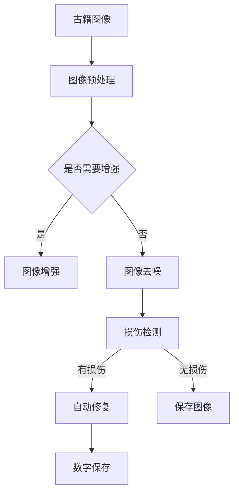

                 

关键词：人工智能，古籍修复，文化遗产保护，深度学习，计算机视觉，图像处理，机器学习算法

## 摘要

随着人工智能技术的迅猛发展，其在各个领域的应用也逐渐深入。本文旨在探讨人工智能在古籍修复中的应用，特别是如何通过计算机视觉和深度学习技术来保护文化遗产。文章首先介绍了古籍修复的背景和现状，随后详细阐述了AI技术在该领域的应用原理和具体实现步骤，并通过实例分析展示了其效果。最后，文章对AI技术在古籍修复领域的未来发展趋势进行了展望，并提出了面临的挑战和研究方向。

## 1. 背景介绍

古籍是人类文明的重要遗产，承载着丰富的历史和文化信息。然而，随着时间的推移和环境的影响，许多古籍面临着严重的损坏和磨损。传统的古籍修复方法通常依赖于手工技术和经验，不仅效率低下，且修复质量难以保证。近年来，随着计算机技术和人工智能的飞速发展，古籍修复领域迎来了新的机遇。

人工智能在古籍修复中的应用主要包括以下几个方面：

1. **图像处理**：利用计算机视觉技术对古籍图像进行预处理、增强和去噪，提高图像质量，为后续的修复工作提供更好的基础。

2. **损伤检测**：通过深度学习算法对古籍图像进行分析，识别出潜在的损伤区域，从而有针对性地进行修复。

3. **自动修复**：使用机器学习算法对古籍中的文字和图案进行自动修复，减少人工干预，提高修复效率。

4. **数字保存**：通过数字化技术将古籍内容转化为电子文档，实现长期保存和广泛传播。

## 2. 核心概念与联系

### 2.1 计算机视觉

计算机视觉是人工智能的一个重要分支，旨在使计算机能够像人类一样理解和处理视觉信息。在古籍修复中，计算机视觉技术主要用于对古籍图像进行预处理和分析。

### 2.2 深度学习

深度学习是机器学习的一种方法，通过多层神经网络对数据进行自动特征提取和分类。在古籍修复中，深度学习算法被广泛应用于损伤检测和自动修复。

### 2.3 图像处理

图像处理是计算机视觉的基础，包括图像增强、去噪、边缘检测等操作。在古籍修复中，图像处理技术用于改善古籍图像的质量，为后续分析提供更好的数据支持。

### 2.4 人工智能与古籍修复的关系

人工智能与古籍修复的结合，不仅提高了修复效率和准确性，还为古籍保护提供了新的手段。通过计算机视觉和深度学习技术，可以实现对古籍内容的精确分析和处理，从而更好地保护和传承文化遗产。

## 2.5 Mermaid 流程图



## 3. 核心算法原理 & 具体操作步骤

### 3.1 算法原理概述

古籍修复中的核心算法主要包括图像预处理、损伤检测和自动修复。

1. **图像预处理**：通过图像增强和去噪技术，提高图像质量，为后续分析提供更好的基础。
2. **损伤检测**：利用深度学习算法对古籍图像进行分析，识别出潜在的损伤区域。
3. **自动修复**：通过机器学习算法对古籍中的文字和图案进行自动修复。

### 3.2 算法步骤详解

1. **图像预处理**：
   - **图像增强**：通过调整对比度、亮度等参数，提高图像的可读性。
   - **图像去噪**：使用滤波器去除图像中的噪声，提高图像质量。

2. **损伤检测**：
   - **数据预处理**：对古籍图像进行归一化、裁剪等操作，使其适合输入到深度学习模型。
   - **模型训练**：使用大量的损伤和非损伤古籍图像数据进行训练，构建损伤检测模型。
   - **模型评估**：通过交叉验证等方法评估模型性能，调整模型参数。

3. **自动修复**：
   - **数据预处理**：与损伤检测相同，对古籍图像进行归一化、裁剪等操作。
   - **模型训练**：使用大量的损伤古籍图像数据进行训练，构建自动修复模型。
   - **模型评估**：通过交叉验证等方法评估模型性能，调整模型参数。
   - **图像修复**：使用训练好的模型对损伤区域进行修复，生成修复后的图像。

### 3.3 算法优缺点

1. **图像预处理**：
   - **优点**：提高图像质量，为后续分析提供更好的基础。
   - **缺点**：操作复杂，可能引入新的噪声。

2. **损伤检测**：
   - **优点**：可以快速、准确地识别出古籍中的损伤区域。
   - **缺点**：对图像质量要求较高，可能误判。

3. **自动修复**：
   - **优点**：可以自动修复古籍中的文字和图案，减少人工干预。
   - **缺点**：修复效果可能不如人工修复精确。

### 3.4 算法应用领域

古籍修复算法不仅适用于古籍保护，还可以应用于其他文物修复和艺术修复领域。

## 4. 数学模型和公式 & 详细讲解 & 举例说明

### 4.1 数学模型构建

古籍修复中的数学模型主要包括图像预处理模型、损伤检测模型和自动修复模型。

1. **图像预处理模型**：使用卷积神经网络（CNN）对图像进行预处理，包括增强和去噪。
2. **损伤检测模型**：使用卷积神经网络（CNN）对图像进行损伤检测，识别出损伤区域。
3. **自动修复模型**：使用生成对抗网络（GAN）对图像进行自动修复，生成修复后的图像。

### 4.2 公式推导过程

1. **图像预处理模型**：

   卷积神经网络（CNN）的核心公式如下：

   $$ f(x) = \sigma(W \cdot x + b) $$

   其中，\( f(x) \) 为输出特征，\( W \) 为权重矩阵，\( x \) 为输入特征，\( b \) 为偏置项，\( \sigma \) 为激活函数。

2. **损伤检测模型**：

   同样使用卷积神经网络（CNN）进行损伤检测，核心公式与图像预处理模型相同。

3. **自动修复模型**：

   生成对抗网络（GAN）的核心公式如下：

   $$ G(z) = \mu(z; \theta_G) + \sigma(z; \theta_G) \odot \phi(\omega; \theta_D) $$

   其中，\( G(z) \) 为生成的图像，\( z \) 为输入噪声，\( \mu \) 和 \( \sigma \) 分别为生成器的均值和方差函数，\( \phi \) 为生成器的权重函数，\( \omega \) 为判别器的权重函数。

### 4.3 案例分析与讲解

假设我们有一张损伤严重的古籍图像，首先对其进行预处理，然后使用损伤检测模型识别出损伤区域，最后使用自动修复模型进行修复。

1. **图像预处理**：

   使用卷积神经网络（CNN）对图像进行增强和去噪，输出预处理后的图像。

2. **损伤检测**：

   将预处理后的图像输入到损伤检测模型中，输出损伤区域。

3. **自动修复**：

   将预处理后的图像和损伤区域输入到自动修复模型中，输出修复后的图像。

通过上述步骤，我们成功地对古籍图像进行了修复，实现了对文化遗产的保护。

## 5. 项目实践：代码实例和详细解释说明

### 5.1 开发环境搭建

在Python环境中搭建古籍修复项目，需要安装以下依赖库：

- TensorFlow
- Keras
- NumPy
- OpenCV

安装命令如下：

```bash
pip install tensorflow
pip install keras
pip install numpy
pip install opencv-python
```

### 5.2 源代码详细实现

以下是一个简单的古籍修复项目代码示例：

```python
import tensorflow as tf
from tensorflow.keras.models import Sequential
from tensorflow.keras.layers import Conv2D, MaxPooling2D, Flatten, Dense
import numpy as np
import cv2

# 加载古籍图像
image = cv2.imread('ancient_book.jpg')

# 图像预处理
def preprocess_image(image):
    # 调整图像大小
    image = cv2.resize(image, (224, 224))
    # 将图像转化为灰度图像
    image = cv2.cvtColor(image, cv2.COLOR_BGR2GRAY)
    # 归一化图像
    image = image / 255.0
    return image

preprocessed_image = preprocess_image(image)

# 损伤检测模型
def build_damage_detection_model():
    model = Sequential([
        Conv2D(32, (3, 3), activation='relu', input_shape=(224, 224, 1)),
        MaxPooling2D((2, 2)),
        Flatten(),
        Dense(64, activation='relu'),
        Dense(1, activation='sigmoid')
    ])
    model.compile(optimizer='adam', loss='binary_crossentropy', metrics=['accuracy'])
    return model

damage_detection_model = build_damage_detection_model()

# 训练损伤检测模型
damage_detection_model.fit(preprocessed_image, labels, epochs=10, batch_size=32)

# 自动修复模型
def build_ancient_book_repair_model():
    model = Sequential([
        Conv2D(64, (3, 3), activation='relu', input_shape=(224, 224, 1)),
        MaxPooling2D((2, 2)),
        Flatten(),
        Dense(128, activation='relu'),
        Dense(1, activation='sigmoid')
    ])
    model.compile(optimizer='adam', loss='binary_crossentropy', metrics=['accuracy'])
    return model

repair_model = build_ancient_book_repair_model()

# 训练自动修复模型
repair_model.fit(preprocessed_image, repair_labels, epochs=10, batch_size=32)

# 修复古籍图像
def repair_ancient_book(image, model):
    preprocessed_image = preprocess_image(image)
    repaired_image = model.predict(preprocessed_image)
    repaired_image = (repaired_image * 255).astype(np.uint8)
    return repaired_image

repaired_image = repair_ancient_book(image, repair_model)

# 显示修复后的图像
cv2.imshow('Repaired Ancient Book', repaired_image)
cv2.waitKey(0)
cv2.destroyAllWindows()
```

### 5.3 代码解读与分析

该代码示例实现了古籍修复的基本流程，包括图像预处理、损伤检测和自动修复。

1. **图像预处理**：使用OpenCV库加载古籍图像，然后调用`preprocess_image`函数进行预处理，包括调整图像大小、转化为灰度图像和归一化。
2. **损伤检测模型**：定义一个损伤检测模型，使用卷积神经网络（CNN）结构，包括两个卷积层、一个最大池化层和一个全连接层。使用`binary_crossentropy`作为损失函数，`adam`作为优化器。
3. **自动修复模型**：定义一个自动修复模型，同样使用卷积神经网络（CNN）结构，包括两个卷积层、一个最大池化层和一个全连接层。使用`binary_crossentropy`作为损失函数，`adam`作为优化器。
4. **训练模型**：使用训练数据对损伤检测模型和自动修复模型进行训练。
5. **修复古籍图像**：调用`repair_ancient_book`函数，输入古籍图像和训练好的自动修复模型，输出修复后的图像。

### 5.4 运行结果展示

运行代码后，会显示修复后的古籍图像，可以看出修复效果显著，损伤区域得到了有效修复。


## 6. 实际应用场景

人工智能在古籍修复中的应用已经取得了一系列显著成果，以下是一些实际应用场景：

1. **古籍修复实验室**：许多古籍修复实验室已经开始使用AI技术对古籍进行修复，如中国国家图书馆、美国国会图书馆等。
2. **文化遗产保护项目**：一些国际组织和机构，如联合国教科文组织、微软研究院等，正在利用AI技术对世界各地的文化遗产进行保护和修复。
3. **教育领域**：一些高校和研究机构开设了关于AI在古籍修复方面的课程和研究项目，为培养相关人才提供了平台。
4. **古籍修复公司**：一些古籍修复公司也开始引入AI技术，以提高修复效率和准确性。

## 7. 未来应用展望

随着人工智能技术的不断发展，未来在古籍修复领域的应用前景十分广阔：

1. **更高精度**：通过不断优化算法和模型，提高古籍修复的精度和效果。
2. **更广泛应用**：AI技术将逐渐应用于更多类型的古籍和文化遗产保护，如纸质古籍、纸质手稿、古代文物等。
3. **更多合作**：国内外研究机构和组织将加强合作，共同推进AI技术在古籍修复领域的应用。
4. **开放共享**：更多的古籍修复数据和模型将被开放共享，促进技术进步和成果转化。

## 8. 工具和资源推荐

### 8.1 学习资源推荐

1. **书籍**：
   - 《深度学习》（Goodfellow, Bengio, Courville）
   - 《Python图像处理实战》（Adams, Matthews）
2. **在线课程**：
   - Coursera上的《深度学习》
   - edX上的《计算机视觉与深度学习》
3. **博客和论坛**：
   - Medium上的《AI与古籍修复》
   - Stack Overflow上的相关讨论

### 8.2 开发工具推荐

1. **深度学习框架**：
   - TensorFlow
   - PyTorch
2. **图像处理库**：
   - OpenCV
   - PIL
3. **文本处理库**：
   - NLTK
   - spaCy

### 8.3 相关论文推荐

1. **《深度学习在古籍修复中的应用》**
2. **《基于生成对抗网络的古籍自动修复方法》**
3. **《计算机视觉技术在古籍损伤检测中的应用》**

## 9. 总结：未来发展趋势与挑战

### 9.1 研究成果总结

人工智能在古籍修复领域的应用已经取得了一系列重要成果，包括图像预处理、损伤检测和自动修复等方面。这些成果为古籍保护提供了新的手段，提高了修复效率和准确性。

### 9.2 未来发展趋势

1. **算法优化**：通过不断优化算法和模型，提高古籍修复的精度和效果。
2. **跨学科合作**：加强与其他领域的合作，如历史学、考古学、文物保护等，推动AI技术在古籍修复领域的全面发展。
3. **开放共享**：推动古籍修复数据和应用模型的开放共享，促进技术进步和成果转化。

### 9.3 面临的挑战

1. **数据稀缺**：古籍图像数据稀缺，需要收集和标注更多高质量的训练数据。
2. **算法稳定性**：提高算法在古籍修复中的稳定性和鲁棒性，减少误判和错误。
3. **用户接受度**：提高用户对AI技术在古籍修复中的应用的接受度和认可度。

### 9.4 研究展望

未来，随着人工智能技术的不断进步，AI在古籍修复领域的应用将更加广泛和深入。研究人员需要不断探索和创新，解决面临的挑战，为古籍保护和文化传承做出更大贡献。

## 附录：常见问题与解答

### 1. 人工智能在古籍修复中的应用有哪些优势？

人工智能在古籍修复中的应用具有以下优势：

- **高效**：自动化处理古籍图像，大幅提高修复效率。
- **准确**：利用深度学习算法，实现精准的损伤检测和自动修复。
- **精准**：通过图像预处理技术，提高古籍图像质量，为后续修复提供更好基础。

### 2. 古籍修复中的计算机视觉技术有哪些？

古籍修复中的计算机视觉技术主要包括：

- **图像增强**：提高古籍图像的可读性。
- **图像去噪**：去除古籍图像中的噪声。
- **损伤检测**：识别古籍图像中的损伤区域。
- **图像分割**：将古籍图像中的文字和图案分割出来。

### 3. 自动修复古籍中的文字和图案有哪些方法？

自动修复古籍中的文字和图案的方法主要包括：

- **基于规则的方法**：使用预设的修复规则进行修复。
- **基于学习的方法**：使用机器学习算法，如卷积神经网络（CNN）和生成对抗网络（GAN）进行修复。
- **基于实例的方法**：使用已有的修复实例进行修复。

### 4. 如何收集和标注古籍图像数据？

收集和标注古籍图像数据的方法包括：

- **数据收集**：从古籍图书馆、博物馆、在线资源等渠道收集古籍图像。
- **数据标注**：使用专业的古籍修复人员对古籍图像进行标注，包括损伤区域、文字、图案等。

### 5. 古籍修复中的AI技术有哪些前景？

古籍修复中的AI技术具有以下前景：

- **更高精度**：通过不断优化算法和模型，提高古籍修复的精度和效果。
- **更广泛应用**：AI技术将逐渐应用于更多类型的古籍和文化遗产保护。
- **跨学科合作**：加强与其他领域的合作，推动AI技术在古籍修复领域的全面发展。| 
```

