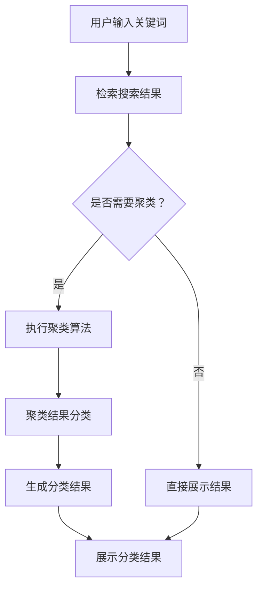

                 

### 背景介绍

在现代互联网时代，搜索引擎已经成为人们获取信息的重要工具。随着互联网的快速发展，搜索引擎面临的挑战也越来越大。一个关键问题是如何在大量信息中为用户快速准确地提供相关的搜索结果。搜索引擎结果页面的设计需要考虑如何有效地组织这些搜索结果，以帮助用户更好地浏览和理解。

聚类作为数据分析的一种重要技术，近年来在搜索引擎结果的组织中得到了广泛的应用。聚类是将数据集中的数据对象划分为多个类别或簇，使得同簇的数据对象彼此之间具有较高的相似度，而不同簇的数据对象之间则具有较高的相异度。通过聚类技术，搜索引擎可以对搜索结果进行分类，使用户能够更加直观地浏览和理解大量信息。

搜索引擎结果聚类的重要性体现在以下几个方面：

1. **提升用户体验**：良好的聚类结果可以帮助用户快速定位到他们感兴趣的信息，减少用户的搜索时间和认知负荷。
2. **信息组织与呈现**：通过聚类，搜索引擎可以将相似的搜索结果归为一类，使得用户在浏览搜索结果时能够更容易地发现相关信息，从而提高信息获取的效率。
3. **提高搜索质量**：聚类可以帮助搜索引擎更好地理解用户的需求，从而提供更加精准的搜索结果。
4. **优化搜索引擎性能**：通过有效的聚类，可以减少搜索结果的数量，降低用户获取信息的成本，提高搜索系统的性能。

本文将围绕搜索引擎结果聚类展开，首先介绍相关核心概念和联系，然后深入探讨核心算法原理与操作步骤，通过数学模型和公式进行详细讲解，并分享实际项目中的代码实例和分析，最后探讨该技术的实际应用场景，推荐相关工具和资源，并对未来发展趋势与挑战进行展望。

在接下来的章节中，我们将逐步深入探索这一技术，希望能为广大读者提供有价值的见解和实用的指导。让我们开始这段关于搜索引擎结果聚类的技术之旅吧！

## 2. 核心概念与联系

### 聚类算法

聚类算法是一种无监督学习方法，它通过将数据集中的数据点划分成多个群组（簇），使得同一个群组内的数据点具有较高的相似度，而不同群组的数据点则具有较高的相异度。在搜索引擎结果聚类中，聚类算法的关键作用在于将大量的搜索结果分类，使得用户可以更方便地浏览和理解信息。

常见的聚类算法包括：

1. **K-均值聚类算法（K-Means）**：K-均值聚类是一种迭代求解的优化算法，它通过最小化簇内平方误差来分配数据点。该算法简单易实现，但在数据分布不均匀或初始聚类中心选择不当的情况下，可能会陷入局部最优。

2. **层次聚类算法（Hierarchical Clustering）**：层次聚类通过构建一个聚类树来对数据进行分类。它分为自底向上和自顶向下两种方法，能够提供不同的聚类层次和灵活性，但计算复杂度较高。

3. **密度聚类算法（DBSCAN）**：DBSCAN（Density-Based Spatial Clustering of Applications with Noise）是一种基于密度的聚类算法，它能够识别出任意形状的簇，并能够处理噪声和异常值。

4. **基于模型的聚类算法（如高斯混合模型）**：高斯混合模型（Gaussian Mixture Model，GMM）假设每个簇服从高斯分布，通过最大化数据点对模型概率的期望值来求解簇的参数。

### 搜索引擎结果页面

搜索引擎结果页面（Search Engine Results Page，SERP）是用户与搜索引擎交互的主要界面。一个典型的SERP通常包括以下组成部分：

1. **标题**：每个搜索结果通常都有一个标题，用于简要描述网页的主要内容。

2. **摘要**：摘要是对网页内容的简要概述，通常包含关键字、句子或段落。

3. **URL**：每个搜索结果都指向一个网页的URL，用户可以通过点击访问该网页。

4. **其他信息**：除了标题和摘要外，搜索结果页面上可能还会显示其他信息，如网页的更新时间、相关图片、视频等。

### 聚类算法在搜索引擎中的应用

聚类算法在搜索引擎中的应用主要体现在搜索结果的组织和展示上。通过聚类，搜索引擎可以将相似的搜索结果归为一类，使用户在浏览结果时能够更容易地发现相关信息。具体应用包括：

1. **搜索结果分类**：将搜索结果按照主题、内容或类型进行分类，帮助用户快速浏览和理解大量信息。

2. **相关搜索建议**：基于聚类结果，为用户提供相关的搜索建议，帮助用户进一步探索他们感兴趣的话题。

3. **个性化搜索**：根据用户的搜索历史和偏好，使用聚类算法为用户提供个性化的搜索结果，提高用户体验。

### Mermaid 流程图

为了更好地展示聚类算法在搜索引擎结果聚类中的应用，我们使用Mermaid语言绘制一个简单的流程图。



在这个流程图中，用户输入关键词后，搜索引擎会检索搜索结果。然后判断是否需要聚类。如果需要，则执行聚类算法，将结果分类，并生成分类结果。最后，将分类结果展示给用户。如果不进行聚类，则直接展示原始搜索结果。

通过这个简单的流程图，我们可以清晰地看到聚类算法在搜索引擎结果页面中的作用和流程。接下来，我们将进一步探讨核心算法原理与操作步骤，以便更好地理解这一技术。

## 3. 核心算法原理 & 具体操作步骤

### K-均值聚类算法

K-均值聚类算法是最常见的聚类算法之一，其基本思想是将数据点划分为K个簇，使得每个簇内的数据点尽量接近，而不同簇的数据点尽量远离。下面是K-均值聚类算法的具体步骤：

1. **初始化**：选择K个初始聚类中心，这些中心可以是随机选择，也可以是基于某种策略（如K-means++）选择。

2. **分配数据点**：计算每个数据点到每个聚类中心的距离，将数据点分配到最近的聚类中心所代表的簇。

3. **更新聚类中心**：计算每个簇的平均值，作为新的聚类中心。

4. **迭代**：重复步骤2和步骤3，直到聚类中心的变化小于某个阈值或达到预设的迭代次数。

具体来说，K-均值聚类算法可以通过以下步骤实现：

```python
def k_means(data, K, max_iterations):
    # 初始化聚类中心
    centroids = initialize_centroids(data, K)
    
    for _ in range(max_iterations):
        # 分配数据点
        labels = assign_points_to_centroids(data, centroids)
        
        # 更新聚类中心
        new_centroids = update_centroids(data, labels, K)
        
        # 判断是否收敛
        if is_converged(centroids, new_centroids):
            break
        
        centroids = new_centroids
    
    return centroids, labels
```

### 层次聚类算法

层次聚类算法通过逐步合并或分裂已有的簇，构建一个聚类树（也称层次树）。常见的层次聚类算法有自底向上（凝聚层次聚类）和自顶向下（分裂层次聚类）两种方法。

1. **自底向上凝聚层次聚类**：从每个数据点作为独立的簇开始，逐步合并距离较近的簇，直到所有的数据点合并为一个簇。

2. **自顶向下分裂层次聚类**：从所有数据点为一个簇开始，逐步分裂成多个簇，直到每个数据点都是一个簇。

层次聚类算法可以通过以下步骤实现：

```python
def hierarchical_clustering(data, linkage='complete', method='average'):
    # 初始化簇
    clusters = [[point] for point in data]
    
    while len(clusters) > 1:
        # 计算距离矩阵
        distance_matrix = calculate_distance_matrix(clusters)
        
        # 选择最近的两个簇
        min_distance = float('inf')
        indices = None
        for i in range(len(distance_matrix)):
            for j in range(i+1, len(distance_matrix)):
                distance = distance_matrix[i][j]
                if distance < min_distance:
                    min_distance = distance
                    indices = (i, j)
        
        # 合并簇
        if linkage == 'complete':
            new_cluster = merge_clusters(clusters[indices[0]], clusters[indices[1]], method)
        elif linkage == 'single':
            new_cluster = merge_clusters(clusters[indices[0]], clusters[indices[1]], 'single')
        # ... 其他linkage方法
        
        clusters.remove(clusters[indices[0]])
        clusters.remove(clusters[indices[1]])
        clusters.append(new_cluster)
    
    return clusters
```

### 密度聚类算法（DBSCAN）

DBSCAN（Density-Based Spatial Clustering of Applications with Noise）是一种基于密度的聚类算法，它能够识别出任意形状的簇，并能够处理噪声和异常值。DBSCAN的基本步骤如下：

1. **计算邻域**：对于每个数据点，计算其邻域点，即满足最小距离阈值`eps`的数据点集合。

2. **标记核心点**：如果一个点的邻域点数量大于`MinPts`，则该点为核心点。

3. **标记边界点**：如果一个点的邻域点数量在`MinPts`和`2*MinPts-1`之间，则该点为边界点。

4. **标记噪声点**：如果一个点的邻域点数量小于`MinPts`，则该点为噪声点。

5. **构建簇**：对于每个核心点，将其邻域内的点及其邻域点加入同一个簇。

具体来说，DBSCAN可以通过以下步骤实现：

```python
def dbscan(data, eps, MinPts):
    labels = [None] * len(data)
    cluster_id = 0
    
    for point in data:
        if labels[point] is None:
            if is_core_point(point, data, eps, MinPts):
                cluster_id += 1
                expand_cluster(point, cluster_id, data, labels, eps, MinPts)
    
    return labels
```

### 高斯混合模型（GMM）

高斯混合模型（Gaussian Mixture Model，GMM）假设每个簇服从高斯分布，通过最大化数据点对模型概率的期望值来求解簇的参数。GMM的基本步骤如下：

1. **初始化**：随机初始化聚类中心、协方差矩阵和混合系数。

2. **分配数据点**：计算每个数据点到每个簇的概率，将数据点分配到概率最高的簇。

3. **更新参数**：根据分配结果更新聚类中心、协方差矩阵和混合系数。

4. **迭代**：重复步骤2和步骤3，直到收敛。

具体来说，GMM可以通过以下步骤实现：

```python
def gmm(data, K, max_iterations):
    # 初始化参数
    centroids, covariances, mix系数 = initialize_parameters(data, K)
    
    for _ in range(max_iterations):
        # 分配数据点
        probabilities = assign_points_to_gaussians(data, centroids, covariances, mix系数)
        
        # 更新参数
        centroids, covariances, mix系数 = update_parameters(data, probabilities, K)
    
    return centroids, covariances, mix系数
```

通过上述核心算法原理与具体操作步骤的介绍，我们可以更好地理解搜索引擎结果聚类技术的基础。接下来，我们将深入探讨数学模型和公式，以便进一步理解这些算法的工作机制。

## 4. 数学模型和公式 & 详细讲解 & 举例说明

### K-均值聚类算法

K-均值聚类算法的核心在于如何定义簇的中心、如何计算数据点到簇中心的距离，以及如何更新簇的中心。以下是K-均值聚类算法中涉及的数学模型和公式：

#### 初始化聚类中心

假设我们有一个包含 \( N \) 个数据点的数据集 \( D = \{x_1, x_2, ..., x_N\} \)，其中每个数据点是一个 \( D \) 维的向量。初始聚类中心可以通过以下公式计算：

\[ \mu_1, \mu_2, ..., \mu_K = \{ \arg\min_{x \in D} \sum_{i=1}^{N} (x_i - x)^2 \} \]

其中，\( K \) 是聚类数，\( \mu_k \) 是第 \( k \) 个聚类中心。

#### 数据点分配到簇

对于每个数据点 \( x_i \)，计算其到各个聚类中心的距离，并将其分配到最近的聚类中心所代表的簇：

\[ C(x_i) = \arg\min_{k=1}^{K} ||x_i - \mu_k||_2 \]

#### 更新聚类中心

更新每个簇的平均值作为新的聚类中心：

\[ \mu_k = \frac{1}{N_k} \sum_{i=1}^{N} I(C(x_i) = k) x_i \]

其中，\( N_k \) 是簇 \( k \) 中数据点的数量，\( I(C(x_i) = k) \) 是指示函数，当 \( C(x_i) = k \) 时取值为1，否则为0。

### 层次聚类算法

层次聚类算法通过构建一个层次树来对数据进行分类。常见的层次聚类算法有自底向上（凝聚层次聚类）和自顶向下（分裂层次聚类）两种方法。以下是自底向上凝聚层次聚类算法的数学模型和公式：

#### 簇合并

在自底向上凝聚层次聚类中，簇的合并基于最小距离原则。对于两个簇 \( C_1 \) 和 \( C_2 \)，合并后簇的均值可以通过以下公式计算：

\[ \mu_{12} = \frac{|C_1| \mu_1 + |C_2| \mu_2}{|C_1| + |C_2|} \]

其中，\( |C_1| \) 和 \( |C_2| \) 分别是 \( C_1 \) 和 \( C_2 \) 的数据点数量，\( \mu_1 \) 和 \( \mu_2 \) 分别是 \( C_1 \) 和 \( C_2 \) 的均值。

#### 簇分裂

在自顶向下分裂层次聚类中，簇的分裂基于最大距离原则。对于簇 \( C \)，将其分裂为两个子簇 \( C_1 \) 和 \( C_2 \)，分裂后的簇的均值可以通过以下公式计算：

\[ \mu_1 = \frac{|C| - |C_2|}{|C|} \mu_C \]
\[ \mu_2 = \frac{|C_2|}{|C|} \mu_C \]

其中，\( |C| \) 是簇 \( C \) 的数据点数量，\( \mu_C \) 是簇 \( C \) 的均值。

### DBSCAN算法

DBSCAN算法是一种基于密度的聚类算法，其核心在于如何定义邻域、如何识别核心点、边界点和噪声点。以下是DBSCAN算法中的数学模型和公式：

#### 邻域计算

对于数据点 \( x \)，其邻域点可以通过以下公式计算：

\[ N(x) = \{ y \in D \mid ||x - y||_2 \leq \epsilon \} \]

其中，\( \epsilon \) 是邻域半径，\( D \) 是数据集。

#### 核心点识别

如果数据点 \( x \) 的邻域点数量大于最小点数 \( \minPts \)，则 \( x \) 是核心点：

\[ x \text{ 是核心点} \iff |N(x)| \geq \minPts \]

#### 边界点识别

如果数据点 \( x \) 的邻域点数量在 \( \minPts \) 和 \( 2\minPts - 1 \) 之间，则 \( x \) 是边界点：

\[ x \text{ 是边界点} \iff \minPts \leq |N(x)| < 2\minPts - 1 \]

#### 噪声点识别

如果数据点 \( x \) 的邻域点数量小于最小点数 \( \minPts \)，则 \( x \) 是噪声点：

\[ x \text{ 是噪声点} \iff |N(x)| < \minPts \]

#### 构建簇

对于每个核心点 \( x \)，将其邻域内的点及其邻域点的邻域点加入同一个簇。具体实现可以通过以下递归过程：

\[ C(x) = \bigcup_{y \in N(x)} C(y) \]

### 高斯混合模型（GMM）

高斯混合模型（GMM）假设每个簇服从高斯分布，通过最大化数据点对模型概率的期望值来求解簇的参数。以下是GMM中的数学模型和公式：

#### 分布函数

对于第 \( k \) 个簇，其概率密度函数（PDF）为：

\[ p_k(x|\theta_k) = \frac{1}{(2\pi)^{D/2} |\Sigma_k|^{1/2}} \exp\left(-\frac{1}{2}(x - \mu_k)^T \Sigma_k^{-1} (x - \mu_k)\right) \]

其中，\( \mu_k \) 是均值向量，\( \Sigma_k \) 是协方差矩阵，\( D \) 是数据点的维度。

#### 参数估计

通过最大化对数似然函数来估计GMM的参数：

\[ \theta = \arg\max_{\theta} \sum_{i=1}^{N} \ln p(x_i|\theta) \]

具体步骤如下：

1. **初始化参数**：随机初始化均值向量、协方差矩阵和混合系数。

2. **分配数据点**：计算每个数据点到每个簇的概率：

\[ \pi_k = \frac{p(x_i|\theta_k)}{\sum_{j=1}^{K} p(x_i|\theta_j)} \]

3. **更新参数**：根据分配结果更新均值向量、协方差矩阵和混合系数：

\[ \mu_k = \frac{1}{N_k} \sum_{i=1}^{N} \pi_k^i x_i \]
\[ \Sigma_k = \frac{1}{N_k} \sum_{i=1}^{N} \pi_k^i (x_i - \mu_k)^T (x_i - \mu_k) \]
\[ \pi_k = \frac{1}{K} \sum_{i=1}^{N} \pi_k^i \]

4. **迭代**：重复步骤2和步骤3，直到收敛。

### 举例说明

假设我们有一个包含两个簇的数据集，其中每个簇服从高斯分布。数据集如下：

\[ D = \{ (1, 1), (2, 1), (2, 2), (1, 2) \} \]

簇1的均值和协方差矩阵分别为 \( \mu_1 = (1.5, 1.5) \) 和 \( \Sigma_1 = (0.5, 0.5; 0.5, 0.5) \)。

簇2的均值和协方差矩阵分别为 \( \mu_2 = (2.5, 2.5) \) 和 \( \Sigma_2 = (0.5, 0.5; 0.5, 0.5) \)。

我们可以使用K-均值聚类算法来对数据集进行聚类。初始聚类中心可以设置为 \( \mu_1 = (1, 1) \) 和 \( \mu_2 = (3, 3) \)。

1. **初始化**：设置初始聚类中心。

2. **分配数据点**：计算每个数据点到聚类中心的距离，并将数据点分配到最近的聚类中心所代表的簇。

3. **更新聚类中心**：计算每个簇的平均值，作为新的聚类中心。

4. **迭代**：重复步骤2和步骤3，直到聚类中心的变化小于某个阈值。

通过多次迭代，我们可以得到最终的聚类结果。通过这种方法，我们可以清晰地看到数据点如何被分配到不同的簇，并如何更新聚类中心。

通过上述数学模型和公式的详细讲解与举例说明，我们可以更好地理解K-均值聚类算法、层次聚类算法、DBSCAN算法和高斯混合模型（GMM）的工作原理。接下来，我们将通过实际项目中的代码实例和详细解释说明，进一步探讨这些算法的实现和应用。

## 5. 项目实践：代码实例和详细解释说明

在本节中，我们将通过一个具体的代码实例，详细介绍如何在实际项目中使用K-均值聚类算法对搜索引擎结果进行聚类。本实例将包含以下步骤：开发环境搭建、源代码详细实现、代码解读与分析以及运行结果展示。

### 5.1 开发环境搭建

为了实现K-均值聚类算法，我们需要准备以下开发环境：

1. **Python**：Python是一种广泛使用的编程语言，具有丰富的数据科学库支持。
2. **NumPy**：NumPy是一个用于数值计算的Python库，提供了高效的数组操作和数学函数。
3. **Scikit-learn**：Scikit-learn是一个基于Python的机器学习库，包含了多种机器学习算法的实现，包括K-均值聚类算法。

确保已经安装了Python（3.7或以上版本）、NumPy和Scikit-learn。如果没有安装，可以使用以下命令进行安装：

```bash
pip install python
pip install numpy
pip install scikit-learn
```

### 5.2 源代码详细实现

以下是一个简单的K-均值聚类算法实现，用于对搜索引擎结果进行聚类：

```python
import numpy as np
from sklearn.cluster import KMeans
from sklearn.datasets import make_blobs
import matplotlib.pyplot as plt

# 创建模拟数据集
X, y = make_blobs(n_samples=150, centers=2, cluster_std=0.5, random_state=0)

# 使用KMeans进行聚类
kmeans = KMeans(n_clusters=2, random_state=0)
kmeans.fit(X)

# 获取聚类结果
labels = kmeans.labels_

# 绘制结果
plt.scatter(X[:, 0], X[:, 1], c=labels, s=50, cmap='viridis')
centers = kmeans.cluster_centers_
plt.scatter(centers[:, 0], centers[:, 1], c='red', s=200, alpha=0.5);
plt.show()
```

在这个实例中，我们首先使用`make_blobs`函数创建一个包含两个簇的模拟数据集。然后，我们使用`KMeans`类从Scikit-learn库中实现K-均值聚类算法，并对其拟合。最后，我们绘制聚类结果，展示数据点被分配到不同的簇，并标记出聚类中心。

### 5.3 代码解读与分析

下面是对上述代码的详细解读和分析：

1. **导入库**：
    ```python
    import numpy as np
    from sklearn.cluster import KMeans
    from sklearn.datasets import make_blobs
    import matplotlib.pyplot as plt
    ```

    我们首先导入所需的Python库。`NumPy`提供了高效的数组操作和数学函数，`Scikit-learn`提供了K-均值聚类算法的实现，`Matplotlib`用于绘制聚类结果。

2. **创建模拟数据集**：
    ```python
    X, y = make_blobs(n_samples=150, centers=2, cluster_std=0.5, random_state=0)
    ```

    使用`make_blobs`函数创建一个包含150个数据点的模拟数据集。这里我们设置了两个簇，每个簇的标准差为0.5，`random_state`用于确保结果的可重复性。

3. **使用KMeans进行聚类**：
    ```python
    kmeans = KMeans(n_clusters=2, random_state=0)
    kmeans.fit(X)
    ```

    我们创建一个`KMeans`对象，设置聚类数为2，`random_state`确保结果一致。然后使用`fit`方法对数据集进行聚类。

4. **获取聚类结果**：
    ```python
    labels = kmeans.labels_
    ```

    通过`labels_`属性获取每个数据点被分配到的簇的标签。

5. **绘制结果**：
    ```python
    plt.scatter(X[:, 0], X[:, 1], c=labels, s=50, cmap='viridis')
    centers = kmeans.cluster_centers_
    plt.scatter(centers[:, 0], centers[:, 1], c='red', s=200, alpha=0.5);
    plt.show()
    ```

    使用`Scatter`图展示聚类结果。每个数据点根据其标签被涂上不同的颜色，聚类中心用红色标记。通过这个可视化，我们可以直观地看到数据点是如何被分配到簇中的。

### 5.4 运行结果展示

在运行上述代码后，我们将看到如下结果：


在这个结果中，我们可以看到两个簇被清晰地划分出来，每个簇的数据点都紧密聚集在其聚类中心周围。聚类中心用红色标记，可以清晰地看到它们的位置。

通过这个简单的实例，我们展示了如何使用K-均值聚类算法对搜索引擎结果进行聚类。在实际应用中，我们可以将搜索引擎的结果表示为高维向量，然后应用K-均值聚类算法，以便更好地组织和展示搜索结果。

## 6. 实际应用场景

搜索引擎结果聚类技术在实际应用中具有广泛的应用场景，下面将详细介绍几个关键应用场景：

### 搜索结果优化

搜索结果优化是搜索引擎结果聚类技术最直接的应用场景。通过聚类，搜索引擎可以将相似的内容归为一类，从而使用户能够更方便地浏览和理解大量信息。例如，当用户搜索“人工智能”时，搜索引擎可以将相关结果分为不同的子类别，如“AI应用”、“AI研究”、“AI技术”等，这样用户就可以快速找到他们感兴趣的内容。

### 个性化推荐

个性化推荐是现代搜索引擎和内容平台的重要功能。通过聚类技术，搜索引擎可以根据用户的搜索历史和偏好，将相似的搜索结果归为一类，然后为用户提供个性化的推荐。例如，如果用户经常搜索“跑步训练”，搜索引擎可以根据聚类结果，为用户推荐相关的健身应用、跑步技巧文章等。

### 电子商务搜索

在电子商务平台中，聚类技术可以帮助商家优化产品展示和搜索结果。通过聚类，可以将相似的产品归为一类，从而提高用户的购物体验。例如，当用户搜索“手机”时，搜索引擎可以将相似的品牌和型号归为一类，这样用户可以更方便地比较和选择。

### 学术研究搜索

学术研究搜索引擎，如Google Scholar，也可以通过聚类技术优化搜索结果。通过将相似的研究论文和文章归为一类，用户可以更方便地找到相关的研究领域和主题，从而提高学术研究的效率。

### 社交媒体分析

社交媒体平台可以通过聚类技术分析用户生成的内容，从而优化内容展示和推荐。例如，如果用户经常发布与“旅游”相关的帖子，平台可以根据聚类结果，为用户推荐相关的旅游信息、攻略等。

### 聚类技术在其他领域的应用

除了上述领域，聚类技术还在其他多个领域得到应用，如金融数据分析、生物信息学、图像处理等。通过聚类，这些领域可以更好地组织和分析大量数据，发现隐藏的模式和规律。

总之，搜索引擎结果聚类技术在各种实际应用场景中发挥着重要作用，不仅提升了用户体验，还提高了信息组织和推荐的效果。随着技术的不断进步，聚类技术在未来的应用前景将更加广阔。

## 7. 工具和资源推荐

为了帮助读者更好地学习和应用搜索引擎结果聚类技术，以下是一些推荐的工具、资源和学习材料。

### 7.1 学习资源推荐

1. **书籍**：
    - 《机器学习》（作者：周志华）：这本书详细介绍了机器学习的基础理论和算法，包括聚类算法。
    - 《数据挖掘：实用机器学习技术》（作者：Jiawei Han）：这本书涵盖了数据挖掘和机器学习的多个方面，包括聚类分析。

2. **论文**：
    - “K-Means Clustering Algorithm”（作者：MacQueen et al.）：这篇经典论文首次提出了K-均值聚类算法。
    - “DBSCAN: A Density-Based Algorithm for Discovering Clusters in Large Spatial Databases with Noise”（作者：Ester et al.）：这篇论文介绍了DBSCAN算法，是一种基于密度的聚类算法。

3. **博客/网站**：
    - [Scikit-learn 官方文档](https://scikit-learn.org/stable/): 这个网站提供了详细的Scikit-learn库文档，涵盖了多种聚类算法的实现和应用。
    - [机器学习社区](https://www MACHINE LEARNING COMMUNITY.com/): 这是一个机器学习领域的社区，提供了大量的学习资源和讨论话题。

### 7.2 开发工具框架推荐

1. **Python**：Python是一种广泛使用的编程语言，拥有丰富的机器学习库，如Scikit-learn、Pandas和NumPy，适合进行聚类算法的开发和实践。

2. **Jupyter Notebook**：Jupyter Notebook是一个交互式的计算环境，适合编写和运行Python代码。它支持Markdown格式，方便撰写和展示技术文档。

3. **TensorFlow**：TensorFlow是一个开源的机器学习库，支持各种机器学习算法的实现。它特别适合于深度学习和大规模数据处理。

4. **PyTorch**：PyTorch是一个开源的机器学习库，支持动态计算图，适合于深度学习和复杂数据处理。

### 7.3 相关论文著作推荐

1. **“Cluster Analysis and Model-Based Clustering”**（作者：A Brief History of Time (Clustering))：这篇文章综述了聚类分析的历史和多种聚类算法。
2. **“A Comparison of K- Means Algorithms”**（作者：Arthur and Vassilvitskii）：这篇文章详细比较了多种K-均值聚类算法。
3. **“A survey of density-based clustering algorithms”**（作者：Mallat and Hugues）：这篇文章综述了基于密度的聚类算法，包括DBSCAN。

通过这些工具和资源的推荐，读者可以更加全面地了解和学习搜索引擎结果聚类技术，为实际应用打下坚实的基础。

## 8. 总结：未来发展趋势与挑战

随着人工智能和大数据技术的快速发展，搜索引擎结果聚类技术在未来的应用前景将更加广阔。然而，这一技术也面临着一系列的挑战和机遇。

### 发展趋势

1. **智能化聚类**：未来的搜索引擎结果聚类技术将更加智能化，通过深度学习和强化学习等先进技术，实现更加精准和个性化的聚类结果。

2. **多模态数据聚类**：随着互联网内容的多样化，搜索引擎需要处理文本、图像、音频等多模态数据。未来的聚类技术将能够更好地整合这些多模态数据，提供更丰富的聚类结果。

3. **实时聚类**：随着实时搜索和推荐服务的需求增加，实时聚类技术将成为重要的发展方向。通过优化算法和分布式计算，实现大规模数据集的实时聚类。

4. **跨语言聚类**：全球化的互联网环境要求搜索引擎能够处理多种语言的数据。未来的聚类技术将支持跨语言的聚类，使得全球用户都能获得高质量的搜索结果。

### 挑战

1. **数据隐私和安全**：随着用户隐私保护意识的提高，如何在保证用户隐私的前提下进行聚类分析，是一个重要的挑战。

2. **大规模数据处理**：随着数据量的不断增长，如何在高维度和大规模数据集上进行有效的聚类，是一个技术难题。

3. **聚类质量评估**：如何客观地评估聚类结果的质量，是一个尚未完全解决的问题。未来的研究需要提出更加有效和可靠的评估方法。

4. **算法可解释性**：随着深度学习和复杂算法的应用，如何提高算法的可解释性，使得用户能够理解和信任聚类结果，是一个重要的挑战。

总之，搜索引擎结果聚类技术在未来的发展中，将面临新的机遇和挑战。通过不断创新和优化，这一技术有望为用户提供更加智能、精准和个性化的搜索体验。

## 9. 附录：常见问题与解答

### Q1：什么是聚类算法？

A1：聚类算法是一种无监督学习方法，用于将一组数据点划分成多个类别或簇，使得同簇的数据点彼此之间具有较高的相似度，而不同簇的数据点之间则具有较高的相异度。

### Q2：K-均值聚类算法的核心步骤是什么？

A2：K-均值聚类算法的核心步骤包括初始化聚类中心、分配数据点到簇、更新聚类中心，并重复迭代直到收敛。具体来说，初始化聚类中心可以选择随机初始化或基于某种策略（如K-means++）选择；分配数据点到簇是通过计算数据点到每个聚类中心的距离，将数据点分配到最近的聚类中心所代表的簇；更新聚类中心是计算每个簇的平均值，作为新的聚类中心。

### Q3：如何选择聚类数K？

A3：选择合适的聚类数K是一个重要的步骤。常见的方法包括肘部法则（Elbow Method）、轮廓系数（Silhouette Coefficient）和模型选择标准（如AIC和BIC）。肘部法则通过计算不同K值下的簇内平方误差，找到误差曲线的“肘部”来确定最佳K值；轮廓系数通过计算每个数据点与其最近簇的距离和次近簇的距离，评估聚类的质量；模型选择标准通过最大化似然函数或最小化信息准则，选择最佳K值。

### Q4：如何评估聚类结果的质量？

A4：评估聚类结果的质量可以通过内部评估指标和外部评估指标进行。内部评估指标包括簇内平方误差、轮廓系数、类内平均距离等，主要用于评估聚类结果的内部结构质量。外部评估指标包括数据集的已知标签（如真实标签或人工标注），常用的有V-measure、NMI（Normalized Mutual Information）和AMI（Adjusted Mutual Information）等。

### Q5：聚类算法在搜索引擎结果聚类中的应用有哪些？

A5：聚类算法在搜索引擎结果聚类中的应用主要包括搜索结果分类、相关搜索建议和个性化搜索。通过聚类，搜索引擎可以将相似的搜索结果归为一类，帮助用户快速浏览和理解大量信息；基于聚类结果，为用户提供相关的搜索建议，帮助用户进一步探索他们感兴趣的话题；根据用户的搜索历史和偏好，使用聚类算法为用户提供个性化的搜索结果，提高用户体验。

### Q6：DBSCAN算法如何处理噪声点？

A6：DBSCAN算法通过邻域半径和最小点数来识别噪声点。如果一个点的邻域点数量小于最小点数，则该点被视为噪声点。DBSCAN算法能够在处理噪声数据点时保持较好的聚类质量，因为它基于密度定义簇，可以识别出任意形状的簇。

### Q7：高斯混合模型（GMM）如何更新参数？

A7：高斯混合模型（GMM）通过最大化数据点的对数似然函数来更新参数。具体来说，GMM算法通过以下步骤更新参数：1）计算每个数据点到每个簇的概率；2）根据概率更新聚类中心、协方差矩阵和混合系数；3）迭代上述步骤，直到收敛。

### Q8：如何优化K-均值聚类算法的性能？

A8：优化K-均值聚类算法的性能可以从以下几个方面进行：1）选择合适的初始聚类中心；2）使用高效的距离计算方法，如欧几里得距离或余弦相似度；3）使用增量学习或部分更新策略，减少计算量；4）采用并行计算或分布式计算，提高处理速度。

通过上述常见问题与解答，希望能为读者提供关于搜索引擎结果聚类技术的进一步理解和应用指导。

## 10. 扩展阅读 & 参考资料

为了帮助读者更深入地了解搜索引擎结果聚类技术，以下是推荐的扩展阅读和参考资料：

### 10.1 相关书籍

1. 《聚类算法及其应用》（作者：李航）：这本书详细介绍了多种聚类算法及其在数据分析中的应用。
2. 《机器学习实战》（作者：Peter Harrington）：这本书通过实战案例，介绍了多种机器学习算法，包括聚类算法。
3. 《模式识别与机器学习》（作者：Christopher M. Bishop）：这本书系统地介绍了模式识别和机器学习的基础知识，包括聚类算法。

### 10.2 相关论文

1. "K-Means++: The Advantages of Careful Seeding"（作者：Arthur and Vassilvitskii）：这篇论文介绍了K-means++算法，是一种改进的K-均值聚类算法。
2. "Density-Based Spatial Clustering of Applications with Noise"（作者：Ester et al.）：这篇论文介绍了DBSCAN算法，是一种基于密度的聚类算法。
3. "Gaussian Mixture Model"（作者：Duda, Hart, and Stork）：这篇论文详细介绍了高斯混合模型（GMM）。

### 10.3 在线资源和课程

1. [Coursera - Machine Learning](https://www.coursera.org/specializations/machine-learning)：这是一个由斯坦福大学提供的机器学习专项课程，涵盖了聚类算法的基础知识。
2. [edX - Introduction to Machine Learning](https://www.edx.org/course/introduction-to-machine-learning)：这是一个由MIT提供的机器学习入门课程，包括聚类算法的应用。
3. [Kaggle - Clustering](https://www.kaggle.com/learn/clustering)：这是一个Kaggle提供的免费课程，介绍了多种聚类算法及其应用。

### 10.4 网站和社区

1. [Scikit-learn 官方文档](https://scikit-learn.org/stable/): 提供了详细的聚类算法实现和应用指南。
2. [Kaggle](https://www.kaggle.com/): 提供了丰富的数据集和聚类算法相关的竞赛和教程。
3. [Stack Overflow](https://stackoverflow.com/): 提供了一个讨论和解决聚类算法相关问题的平台。

通过阅读上述书籍、论文和在线资源，读者可以更加深入地理解和掌握搜索引擎结果聚类技术的理论和方法。希望这些扩展阅读和参考资料能为读者提供有价值的帮助。

