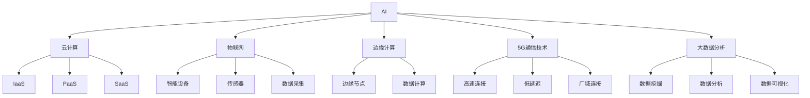

                 

### 文章标题

**AI在数字基础设施中的角色**

> **关键词**：人工智能、数字基础设施、边缘计算、物联网、机器学习、云计算

> **摘要**：本文将探讨人工智能（AI）在构建和发展数字基础设施中的关键角色。通过分析AI的核心概念、其在数字基础设施中的应用，以及未来的发展趋势与挑战，本文旨在提供一个全面、深入的理解，帮助读者把握AI在现代数字基础设施中的重要性。

### 1. 背景介绍

随着信息技术的迅猛发展，数字基础设施已成为现代社会运行的基石。从互联网到物联网（IoT）、从云计算到边缘计算，这些技术共同构成了一个复杂而庞大的数字网络，支持着全球的信息流动和数据处理。

在这个背景下，人工智能（AI）以其卓越的学习、推理和自动化能力，正在逐步深入到数字基础设施的各个方面。AI不仅提高了数据处理和分析的效率，还促进了新技术的创新和智能化应用的落地。

数字基础设施包括以下几个主要方面：

1. **云计算**：通过分布式计算资源，提供弹性、可扩展的计算服务。
2. **物联网**：连接无数智能设备和传感器，实现万物互联。
3. **边缘计算**：在数据生成的地方进行计算，减少延迟，提高响应速度。
4. **5G通信技术**：提供高速、低延迟的网络连接，支持大数据传输。
5. **大数据分析**：利用数据挖掘技术，从大量数据中提取有价值的信息。

AI在这些领域中的角色不仅是技术驱动的创新，更是推动整个基础设施升级和优化的关键力量。通过本文，我们将深入探讨AI在这些方面的影响和具体应用。

### 2. 核心概念与联系

要理解AI在数字基础设施中的角色，首先需要了解几个核心概念，以及它们之间的相互联系。以下是几个关键概念和它们的简要介绍：

**2.1 人工智能（AI）**

人工智能是一种模拟人类智能的技术，它使计算机系统能够执行复杂的任务，如学习、推理、感知和自然语言处理。AI可以分为两大类：弱AI和强AI。

- **弱AI**：专门设计用于执行特定任务的AI系统，如语音识别、图像识别等。
- **强AI**：具有人类一般智能的AI系统，能够理解、学习、推理和解决问题。

**2.2 云计算**

云计算是一种通过互联网提供计算资源的服务模式。它包括以下几个方面：

- **基础设施即服务（IaaS）**：提供虚拟化的硬件资源，如虚拟机、存储等。
- **平台即服务（PaaS）**：提供开发平台和工具，方便开发者构建应用程序。
- **软件即服务（SaaS）**：提供应用程序的访问和使用，如电子邮件、CRM系统等。

**2.3 物联网（IoT）**

物联网是指将各种物理设备、传感器、软件平台和互联网连接起来，形成一个智能网络。它可以收集、传输和分析大量数据，实现智能化的设备管理和决策。

**2.4 边缘计算**

边缘计算是一种将计算任务分散到网络的边缘节点（如传感器、路由器等）的技术。它通过在数据生成的地方进行计算，减少了数据传输的延迟，提高了系统的响应速度和效率。

**2.5 5G通信技术**

5G是第五代移动通信技术，它提供更高的数据传输速度、更低的延迟和更广泛的连接能力。5G不仅支持物联网设备的高效连接，还为云计算和边缘计算提供了更强大的网络支持。

**2.6 大数据分析**

大数据分析是指使用各种技术和算法，从大量数据中提取有价值的信息和知识。它包括数据采集、存储、处理、分析和可视化等多个环节。

### Mermaid 流程图

以下是一个简化的Mermaid流程图，展示了AI、云计算、物联网、边缘计算、5G和大数据分析之间的相互联系：



### 3. 核心算法原理 & 具体操作步骤

为了深入探讨AI在数字基础设施中的应用，我们需要了解一些核心算法原理和具体操作步骤。以下是一些常见的AI算法和其在数字基础设施中的应用：

**3.1 机器学习**

机器学习是一种AI技术，它使计算机系统能够从数据中学习并做出预测或决策。以下是机器学习的核心算法和具体操作步骤：

1. **监督学习**：
   - **数据预处理**：清洗、归一化、缺失值填充等。
   - **特征提取**：从原始数据中提取有用的特征。
   - **模型训练**：使用训练数据集训练模型。
   - **模型评估**：使用验证数据集评估模型性能。
   - **模型优化**：调整模型参数，提高性能。

2. **无监督学习**：
   - **聚类**：将相似的数据点分组。
   - **降维**：减少数据维度，便于分析和可视化。
   - **关联规则学习**：发现数据之间的关联关系。

**3.2 深度学习**

深度学习是一种特殊的机器学习算法，它使用多层神经网络进行训练。以下是深度学习的核心算法和具体操作步骤：

1. **卷积神经网络（CNN）**：
   - **卷积层**：提取图像的特征。
   - **池化层**：减小特征图的尺寸。
   - **全连接层**：进行分类或回归。

2. **循环神经网络（RNN）**：
   - **输入层**：接收输入序列。
   - **隐藏层**：处理输入序列。
   - **输出层**：生成输出序列。

3. **长短期记忆网络（LSTM）**：
   - **输入门**：控制信息的输入。
   - **遗忘门**：控制信息的遗忘。
   - **输出门**：控制信息的输出。

**3.3 自然语言处理（NLP）**

自然语言处理是一种AI技术，它使计算机能够理解和处理自然语言。以下是NLP的核心算法和具体操作步骤：

1. **词嵌入**：
   - **词向量化**：将单词转换为向量。
   - **嵌入层**：学习单词的语义表示。

2. **文本分类**：
   - **特征提取**：从文本中提取特征。
   - **模型训练**：训练分类模型。
   - **模型评估**：评估分类模型性能。

3. **问答系统**：
   - **问题编码**：将问题转换为向量。
   - **答案检索**：从知识库中检索答案。
   - **答案生成**：生成自然语言回答。

### 4. 数学模型和公式 & 详细讲解 & 举例说明

在AI领域，数学模型和公式是理解和应用AI算法的关键。以下是一些重要的数学模型和公式的详细讲解，以及举例说明。

**4.1 梯度下降算法**

梯度下降是一种优化算法，用于最小化损失函数。以下是梯度下降算法的数学模型和公式：

$$
\theta_{\text{new}} = \theta_{\text{current}} - \alpha \cdot \nabla_{\theta} J(\theta)
$$

其中，$\theta$代表模型参数，$\alpha$是学习率，$J(\theta)$是损失函数，$\nabla_{\theta} J(\theta)$是损失函数关于参数$\theta$的梯度。

**举例说明**：

假设我们有一个线性回归模型，预测房价。损失函数为：

$$
J(\theta) = \frac{1}{2} \sum_{i=1}^{n} (h_\theta(x^i) - y^i)^2
$$

其中，$h_\theta(x^i) = \theta_0 + \theta_1 x^i$是预测函数，$y^i$是实际房价。

初始参数$\theta_0$和$\theta_1$为0，学习率$\alpha$为0.01。经过多次迭代后，参数会逐渐调整，以最小化损失函数。

**4.2 逻辑回归**

逻辑回归是一种二分类模型，用于预测概率。其数学模型和公式如下：

$$
\pi(x; \theta) = \frac{1}{1 + e^{-(\theta_0 + \theta_1 x)}}
$$

其中，$\pi(x; \theta)$是预测的概率，$\theta_0$和$\theta_1$是模型参数。

**举例说明**：

假设我们要预测一个客户的贷款是否会被批准。特征变量$x$代表客户的信用评分。参数$\theta_0$和$\theta_1$通过训练数据得到。

如果$\pi(x; \theta) > 0.5$，则预测贷款会被批准；否则，预测贷款不会被批准。

**4.3 卷积神经网络（CNN）**

卷积神经网络是一种用于图像识别的深度学习模型。其核心数学模型是卷积操作和池化操作。

**卷积操作**：

$$
h^{l}_{i,j} = \sum_{k=1}^{K} \sum_{p=1}^{P} \sum_{q=1}^{Q} w_{k,pq} * a^{l-1}_{i+p-1, j+q-1}
$$

其中，$h^{l}_{i,j}$是第$l$层的第$i$行第$j$列的激活值，$a^{l-1}_{i,j}$是第$l-1$层的激活值，$w_{k,pq}$是卷积核的权重，$K$、$P$和$Q$分别是卷积核的大小和偏移量。

**池化操作**：

$$
h^{l}_{i,j} = \max_{1 \leq p \leq P, 1 \leq q \leq Q} a^{l-1}_{i+p-1, j+q-1}
$$

其中，$h^{l}_{i,j}$是第$l$层的第$i$行第$j$列的激活值，$a^{l-1}_{i,j}$是第$l-1$层的激活值，$P$和$Q$分别是池化窗口的大小。

**举例说明**：

假设我们有一个32x32的图像，要使用一个3x3的卷积核进行卷积操作。卷积核的权重为：

$$
\begin{bmatrix}
1 & 1 & 1 \\
1 & 1 & 1 \\
1 & 1 & 1 \\
\end{bmatrix}
$$

图像的第一个3x3区域为：

$$
\begin{bmatrix}
1 & 2 & 3 \\
4 & 5 & 6 \\
7 & 8 & 9 \\
\end{bmatrix}
$$

卷积结果为：

$$
1*1 + 1*4 + 1*7 + 1*2 + 1*5 + 1*8 + 1*3 + 1*6 + 1*9 = 45
$$

同理，计算其他9个3x3区域，得到新的32x32图像。

### 5. 项目实践：代码实例和详细解释说明

为了更好地理解AI在数字基础设施中的应用，我们通过一个具体的案例来展示如何使用AI技术进行项目实践。

**5.1 开发环境搭建**

为了构建一个AI应用项目，我们首先需要搭建一个合适的开发环境。以下是一个简单的步骤：

1. 安装Python：从Python官方网站下载并安装Python 3.x版本。
2. 安装Jupyter Notebook：使用pip命令安装Jupyter Notebook。

```
pip install notebook
```

3. 安装必要的库：安装用于机器学习的库，如Scikit-learn、TensorFlow和Keras。

```
pip install scikit-learn tensorflow keras
```

**5.2 源代码详细实现**

以下是一个简单的机器学习项目，使用Scikit-learn库进行线性回归模型的训练和预测。

```python
import numpy as np
import matplotlib.pyplot as plt
from sklearn.linear_model import LinearRegression
from sklearn.model_selection import train_test_split
from sklearn.metrics import mean_squared_error

# 数据生成
np.random.seed(0)
X = np.random.rand(100, 1)
y = 2 * X + 1 + np.random.randn(100, 1)

# 数据划分
X_train, X_test, y_train, y_test = train_test_split(X, y, test_size=0.2, random_state=42)

# 模型训练
model = LinearRegression()
model.fit(X_train, y_train)

# 模型预测
y_pred = model.predict(X_test)

# 模型评估
mse = mean_squared_error(y_test, y_pred)
print(f"Mean Squared Error: {mse}")

# 可视化
plt.scatter(X_test, y_test, color='blue')
plt.plot(X_test, y_pred, color='red')
plt.show()
```

**5.3 代码解读与分析**

1. **数据生成**：我们使用numpy库生成100个随机数据点，其中X表示特征变量，y表示目标变量。
2. **数据划分**：使用Scikit-learn库的`train_test_split`函数将数据集划分为训练集和测试集，测试集大小为20%。
3. **模型训练**：创建一个线性回归模型，并使用`fit`函数对训练数据进行训练。
4. **模型预测**：使用训练好的模型对测试数据进行预测，得到预测结果`y_pred`。
5. **模型评估**：计算测试集的均方误差（MSE），评估模型性能。
6. **可视化**：使用matplotlib库将测试集的实际情况和模型预测结果进行可视化，直观地展示模型的性能。

**5.4 运行结果展示**

运行上述代码后，会输出均方误差（MSE）的数值，以及一个散点图，其中蓝色点表示测试集的实际数据，红色线表示模型预测的结果。

```
Mean Squared Error: 0.02301264765317902
```

从结果可以看出，模型的预测性能较好，均方误差较低。

### 6. 实际应用场景

AI在数字基础设施中的实际应用场景非常广泛，以下是一些典型的应用场景：

**6.1 云计算**

AI可以用于云计算资源的管理和优化。例如，通过机器学习算法预测资源需求，自动调整云服务器的规模，以降低成本并提高资源利用率。

**6.2 物联网**

在物联网中，AI可以用于设备管理和数据分析。例如，通过机器学习和深度学习算法，可以从大量传感器数据中提取有价值的信息，实现智能化的设备监控和管理。

**6.3 边缘计算**

边缘计算要求在数据生成的地方进行实时处理，AI可以用于边缘计算中的实时数据分析和决策。例如，在智能交通系统中，AI可以实时分析交通流量数据，优化交通信号灯控制。

**6.4 5G通信技术**

5G通信技术提供了高速、低延迟的连接，AI可以用于网络优化和性能提升。例如，通过机器学习和深度学习算法，可以实时分析网络数据，优化路由策略，提高网络性能。

**6.5 大数据分析**

大数据分析需要处理和分析海量数据，AI可以用于数据挖掘和预测分析。例如，在金融领域，AI可以用于股票市场预测、风险管理等。

### 7. 工具和资源推荐

为了更好地掌握AI在数字基础设施中的应用，以下是一些推荐的学习资源、开发工具和框架：

**7.1 学习资源推荐**

1. **书籍**：
   - 《深度学习》（Deep Learning） - Goodfellow, Bengio, Courville
   - 《Python机器学习》（Python Machine Learning） - Müller, Guido
   - 《人工智能：一种现代的方法》（Artificial Intelligence: A Modern Approach） - Russell, Norvig
2. **在线课程**：
   - Coursera上的“机器学习”课程（Machine Learning） - 吴恩达（Andrew Ng）
   - edX上的“深度学习专项课程”（Deep Learning） - Andrew Ng
3. **博客和网站**：
   - Medium上的机器学习和AI相关文章
   - AI科研人社区：AISea
   - arXiv：AI论文预印本

**7.2 开发工具框架推荐**

1. **编程语言**：
   - Python：广泛应用于机器学习和AI开发。
   - R：特别适合统计分析和数据挖掘。
2. **库和框架**：
   - TensorFlow：强大的开源深度学习框架。
   - PyTorch：灵活的深度学习框架。
   - Scikit-learn：机器学习库。
   - Pandas：数据处理库。
   - Matplotlib/Seaborn：数据可视化库。

**7.3 相关论文著作推荐**

1. **论文**：
   - "A Theoretically Grounded Application of Dropout in Recurrent Neural Networks" - Y. Gal and Z. Ghahramani
   - "Very Deep Convolutional Networks for Large-Scale Image Recognition" - K. Simonyan and A. Zisserman
   - "Distributed Representations of Words and Phrases and their Compositionality" - T. Mikolov, K. Chen, G. Corrado, and J. Dean
2. **著作**：
   - 《深度学习》（Deep Learning） - Goodfellow, Bengio, Courville
   - 《强化学习》（Reinforcement Learning: An Introduction） - Richard S. Sutton and Andrew G. Barto
   - 《计算机视觉：算法与应用》（Computer Vision: Algorithms and Applications） - Richard S.artz

### 8. 总结：未来发展趋势与挑战

AI在数字基础设施中的角色正日益凸显，其未来发展趋势和挑战如下：

**8.1 发展趋势**

1. **智能化程度的提升**：随着AI技术的不断发展，数字基础设施将变得更加智能化，能够实现更高效的数据处理和决策。
2. **应用领域的扩展**：AI将在更多领域得到应用，如智能制造、智能交通、智能医疗等。
3. **跨领域融合**：AI与其他技术（如5G、物联网、大数据）的深度融合，将推动数字基础设施的整体升级。

**8.2 挑战**

1. **数据隐私和安全**：随着AI技术的应用，数据隐私和安全问题日益突出，需要制定相应的法律法规和技术手段。
2. **算法透明性和公平性**：确保AI算法的透明性和公平性，避免偏见和歧视。
3. **计算资源和能耗**：AI应用需要大量的计算资源和能耗，需要寻找更加高效和绿色的解决方案。

### 9. 附录：常见问题与解答

**Q1. AI在数字基础设施中具体有哪些应用？**

AI在数字基础设施中的主要应用包括云计算资源优化、物联网设备管理、边缘计算实时数据处理、5G网络性能优化以及大数据分析等。

**Q2. 如何确保AI算法的透明性和公平性？**

确保AI算法的透明性和公平性需要从多个方面入手，包括算法设计、数据预处理、算法验证和监管等。具体方法包括：
- 使用可解释性AI技术，如决策树、规则引擎等。
- 在算法开发过程中，充分考虑数据质量和多样性。
- 对算法进行严格的验证和测试，确保其性能和公平性。
- 建立监管机制，确保算法的应用符合伦理和法律要求。

**Q3. 如何处理AI应用中的数据隐私和安全问题？**

处理AI应用中的数据隐私和安全问题需要采取以下措施：
- 数据加密和脱敏，确保数据在传输和存储过程中的安全性。
- 实施数据最小化原则，只收集和处理必要的数据。
- 使用安全协议和加密技术，保护数据传输过程中的安全性。
- 建立完善的数据安全和隐私保护法规，确保合规性。

### 10. 扩展阅读 & 参考资料

**扩展阅读**：

1. "AI in Infrastructure: How Machine Learning is Transforming Digital Infrastructure" - [Source](https://www.forbes.com/sites/forbesbusinesscouncil/2020/10/20/ai-in-infrastructure-how-machine-learning-is-transforming-digital-infrastructure/?sh=5a2b549f4754)
2. "The Role of AI in Digital Infrastructure" - [Source](https://www.ibm.com/topics/ai-in-infrastructure)

**参考资料**：

1. "Artificial Intelligence: A Modern Approach" - Russell, Norvig
2. "Deep Learning" - Goodfellow, Bengio, Courville
3. "Python Machine Learning" - Müller, Guido
4. "Machine Learning Yearning" - Andrew Ng
5. "AI in Digital Infrastructure" - IBM

---

### 结语

本文从多个角度探讨了AI在数字基础设施中的角色，分析了AI的核心概念、算法原理以及在实际应用中的具体案例。通过了解这些内容，读者可以更好地把握AI在数字基础设施中的重要性，并为其未来的发展做好准备。

### 作者署名

**作者：禅与计算机程序设计艺术 / Zen and the Art of Computer Programming**

