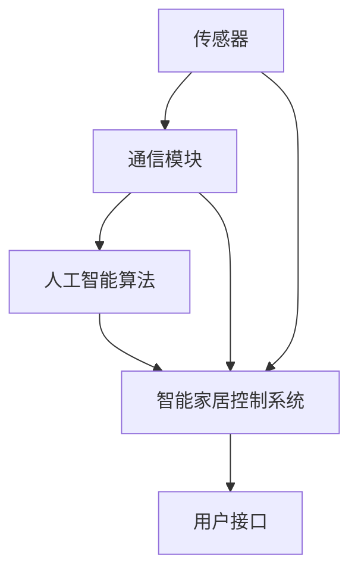

                 

### 1. 背景介绍

随着人工智能技术的迅猛发展，智能家居领域正经历着前所未有的变革。传统的家庭设备正逐步被智能化，通过集成传感器、通信模块和人工智能算法，实现家庭环境的自动化管理和个性化服务。这一变革不仅提高了居民的生活质量，还推动了物联网（IoT）和云计算等技术的发展。

智能家居系统通常包括多个设备，如智能灯光、智能门锁、智能温控系统、智能安防系统等。这些设备通过互联网进行连接，形成一个互联互通的智能网络，用户可以通过手机应用程序、语音助手或者智能中控设备对家庭设备进行远程控制和监控。

人工智能在智能家居中的应用主要体现在以下几个方面：

1. **自动化控制**：通过智能算法自动调节家庭设备的工作状态，如自动开启或关闭灯光、空调等，以实现节能和舒适。
2. **个性化服务**：根据用户的习惯和需求，智能设备可以提供定制化的服务，如自动调节室内温度、音乐播放等。
3. **安防监控**：利用人工智能算法进行视频分析，实时监控家庭安全，及时发现异常情况并报警。
4. **设备健康管理**：通过数据分析和预测，智能设备可以提前发现潜在故障，进行预防性维护。

随着智能家居市场的不断扩大，对人工智能技术的要求也越来越高。本文将深入探讨人工智能在智能家居中的应用，从核心概念、算法原理、实际案例、应用场景等多个角度，全面分析这一领域的发展趋势和潜在挑战。

首先，我们需要明确几个核心概念，理解它们之间的关系，这将为我们后续的探讨奠定基础。

### 2. 核心概念与联系

在探讨人工智能在智能家居中的应用时，首先需要明确以下几个核心概念：

#### 2.1 传感器（Sensor）

传感器是智能家居系统的感知器官，用于检测和测量环境中的各种物理量，如温度、湿度、光照、噪音等。常见的传感器包括温度传感器、湿度传感器、光线传感器、噪音传感器等。传感器通过采集环境数据，为智能家居系统提供必要的信息输入。

#### 2.2 通信模块（Communication Module）

通信模块是实现设备之间互联互通的关键，常见的通信方式包括Wi-Fi、蓝牙、ZigBee等。通过通信模块，传感器采集到的数据可以传输到中央控制系统，用户也可以通过手机或其他智能设备远程控制家庭设备。

#### 2.3 人工智能算法（Artificial Intelligence Algorithm）

人工智能算法是智能家居系统的智能核心，负责处理和分析传感器数据，实现自动化控制、个性化服务和安防监控等功能。常见的人工智能算法包括机器学习、深度学习、自然语言处理等。

#### 2.4 智能家居控制系统（Smart Home Control System）

智能家居控制系统是智能家居系统的核心组件，负责协调和管理各个家庭设备的运行。它通常包括中央处理器、数据库、用户接口等部分，通过人工智能算法实现自动化控制、数据分析和用户交互。

这几个核心概念之间的关系可以用以下的Mermaid流程图表示：



在这个流程图中，传感器采集环境数据，通过通信模块传输到智能家居控制系统，人工智能算法对数据进行分析和处理，最后通过用户接口为用户提供反馈和控制命令。

#### 2.5 用户接口（User Interface）

用户接口是用户与智能家居系统交互的界面，可以是手机应用程序、语音助手、智能中控设备等。用户接口通过图形用户界面（GUI）或自然语言处理（NLP）技术，提供直观、便捷的用户交互体验。

通过上述核心概念的理解，我们可以更好地把握智能家居系统的整体架构和工作流程。接下来，我们将进一步探讨人工智能在智能家居中的核心算法原理和具体操作步骤。

### 3. 核心算法原理 & 具体操作步骤

在智能家居系统中，人工智能算法扮演着至关重要的角色，它们通过处理和分析传感器数据，实现家庭设备的自动化控制、个性化服务和安防监控等功能。以下将介绍几种常见的人工智能算法原理及其在智能家居中的应用。

#### 3.1 机器学习算法

机器学习算法是一种通过数据训练模型，使计算机具备自主学习和决策能力的技术。在智能家居中，常见的机器学习算法包括线性回归、决策树、支持向量机等。

**线性回归**：线性回归算法用于预测连续值，如预测室内温度。其基本原理是通过训练数据找出输入特征与输出结果之间的线性关系，建立回归模型。

**决策树**：决策树算法用于分类问题，如判断用户是否在家。决策树通过训练数据构建决策树模型，每个节点代表一个特征，每个分支代表该特征的一个取值，最终到达叶节点得到预测结果。

**支持向量机**：支持向量机算法主要用于分类问题，如识别入侵者。其核心思想是找到一个最优的超平面，将不同类别的数据点分隔开。

具体操作步骤如下：

1. **数据采集**：采集家庭设备运行数据，包括温度、湿度、光照、噪音等。
2. **数据预处理**：对采集到的数据清洗、归一化处理，确保数据质量。
3. **模型训练**：选择合适的机器学习算法，使用训练数据进行模型训练。
4. **模型评估**：使用验证数据对训练好的模型进行评估，调整模型参数以优化性能。
5. **模型部署**：将训练好的模型部署到智能家居控制系统中，实现自动化控制。

#### 3.2 深度学习算法

深度学习算法是一种基于多层神经网络的技术，通过多层非线性变换，对复杂数据进行建模和分析。在智能家居中，常见的深度学习算法包括卷积神经网络（CNN）、循环神经网络（RNN）等。

**卷积神经网络（CNN）**：CNN算法主要用于图像处理任务，如视频监控中的异常检测。其核心原理是通过卷积操作提取图像特征，实现图像分类和目标检测。

**循环神经网络（RNN）**：RNN算法主要用于序列数据处理，如语音识别。其核心原理是通过循环结构处理时间序列数据，实现序列建模和预测。

具体操作步骤如下：

1. **数据采集**：采集家庭环境中的图像和语音数据。
2. **数据预处理**：对图像和语音数据清洗、归一化处理，确保数据质量。
3. **模型训练**：选择合适的深度学习算法，使用训练数据进行模型训练。
4. **模型评估**：使用验证数据对训练好的模型进行评估，调整模型参数以优化性能。
5. **模型部署**：将训练好的模型部署到智能家居控制系统中，实现图像和语音处理。

#### 3.3 自然语言处理（NLP）

自然语言处理算法用于处理和理解人类语言，实现智能家居系统的语音交互功能。常见的NLP算法包括词向量、语言模型、语音识别等。

**词向量**：词向量是一种将自然语言文本转换为向量的方法，用于语义分析。常见的词向量模型包括Word2Vec、GloVe等。

**语言模型**：语言模型用于预测文本序列，是语音识别和机器翻译的核心算法。常见的语言模型包括N元语言模型、神经网络语言模型等。

**语音识别**：语音识别算法用于将语音信号转换为文本，实现语音输入和语音输出。常见的语音识别算法包括HMM、基于深度学习的语音识别模型等。

具体操作步骤如下：

1. **语音数据采集**：采集家庭用户的声音数据。
2. **语音预处理**：对语音数据进行降噪、归一化处理，确保语音质量。
3. **词向量生成**：使用词向量模型对语音文本进行向量化表示。
4. **语言模型训练**：使用训练数据训练语言模型，优化模型参数。
5. **语音识别**：使用训练好的语言模型进行语音识别，将语音信号转换为文本。
6. **模型部署**：将训练好的语音识别模型部署到智能家居控制系统中，实现语音交互功能。

通过上述核心算法原理和具体操作步骤的介绍，我们可以看到人工智能技术在智能家居中的应用是多么广泛和深入。接下来，我们将通过一个项目实践案例，展示这些算法在实际中的应用效果。

### 4. 数学模型和公式 & 详细讲解 & 举例说明

在智能家居系统中，人工智能算法的应用往往涉及到复杂的数学模型和公式。以下将详细讲解几个关键数学模型，并通过具体例子说明它们的应用。

#### 4.1 线性回归模型

线性回归模型是机器学习中最基本的模型之一，它用于预测连续值。其数学公式如下：

$$ y = \beta_0 + \beta_1 \cdot x $$

其中，\( y \) 是预测值，\( x \) 是输入特征，\( \beta_0 \) 和 \( \beta_1 \) 是模型的参数。

**例子**：假设我们想要预测家庭的室温。已知家庭开空调的时间 \( x \) 和室内温度 \( y \) 的数据，我们可以使用线性回归模型进行预测。

通过训练数据，我们得到 \( \beta_0 = 20 \)，\( \beta_1 = 0.1 \)。那么，当家庭开空调的时间为 2 小时，预测的室内温度为：

$$ y = 20 + 0.1 \cdot 2 = 20.2 \text{°C} $$

#### 4.2 决策树模型

决策树模型是一种用于分类问题的算法。其基本结构包括根节点、内部节点和叶节点。每个节点表示一个特征，每个分支表示该特征的一个取值，叶节点表示分类结果。

决策树模型的数学表示如下：

$$ T = \text{if } x_i \leq t_1 \text{ then } y_1 \text{ else } T' $$

其中，\( T \) 是决策树，\( x_i \) 是特征值，\( t_1 \) 是阈值，\( y_1 \) 是分类结果，\( T' \) 是剩余的决策树。

**例子**：假设我们想要判断用户是否在家。已知用户是否在家的数据，我们可以构建决策树模型。

通过训练数据，我们得到以下决策树：

```plaintext
若 温度 > 30°则 家
   若 光照 < 100lx则 家
   若 噪音 > 60dB则 家
   否则          不在家
```

根据当前环境数据，温度为 35°C，光照为 50lx，噪音为 70dB。根据决策树模型，我们可以判断用户在家。

#### 4.3 支持向量机模型

支持向量机模型是一种用于分类问题的算法，其目标是在高维空间中找到一个最优的超平面，将不同类别的数据点分隔开。

支持向量机模型的数学公式如下：

$$ \max_w \left\{ \frac{1}{2} ||w||^2 \, | \, \text{subject to} \, y^{(i)} (w \cdot x^{(i)}) \geq 1 \right\} $$

其中，\( w \) 是权重向量，\( x^{(i)} \) 是训练样本，\( y^{(i)} \) 是标签，\( \cdot \) 表示内积。

**例子**：假设我们想要分类家庭中的安全事件。已知家庭安全事件的数据，我们可以使用支持向量机模型进行分类。

通过训练数据，我们得到支持向量机模型。当检测到异常事件时，模型会判断其是否为安全事件。

通过上述数学模型和公式的介绍，我们可以看到它们在智能家居系统中的关键作用。这些模型为我们提供了强大的工具，使得智能家居系统能够更好地理解和处理家庭环境数据。接下来，我们将通过一个项目实践案例，展示这些模型在实际中的应用。

### 5. 项目实践：代码实例和详细解释说明

在本节中，我们将通过一个具体的项目实践案例，详细展示如何使用人工智能技术实现智能家居系统。我们将以一个简单的智能温控系统为例，介绍开发环境搭建、源代码实现、代码解读与分析，以及运行结果展示。

#### 5.1 开发环境搭建

为了实现智能家居温控系统，我们需要以下开发环境和工具：

1. **编程语言**：Python
2. **开发环境**：PyCharm
3. **依赖库**：TensorFlow、Keras、Scikit-learn
4. **传感器**：DHT11 温湿度传感器
5. **通信模块**：Wi-Fi 模块
6. **智能家居控制系统**：树莓派

首先，我们需要安装 Python 和相关依赖库。在 PyCharm 中创建一个新的 Python 项目，并安装 TensorFlow、Keras 和 Scikit-learn。安装命令如下：

```bash
pip install tensorflow keras scikit-learn
```

接下来，我们需要连接 DHT11 温湿度传感器和 Wi-Fi 模块。DHT11 传感器通过 GPIO 接口连接到树莓派，Wi-Fi 模块通过 USB 接口连接到树莓派。确保树莓派的电源和无线网络连接正常。

#### 5.2 源代码详细实现

以下是智能家居温控系统的源代码实现：

```python
import RPi.GPIO as GPIO
import time
import serial
import tensorflow as tf
from tensorflow.keras.models import Sequential
from tensorflow.keras.layers import Dense
from sklearn.preprocessing import MinMaxScaler

# 初始化 GPIO
GPIO.setmode(GPIO.BCM)
GPIO.setup(4, GPIO.OUT)  # DHT11 数据接口

# 连接 DHT11 传感器
def read_dht11():
    GPIO.output(4, GPIO.HIGH)
    time.sleep(0.05)
    GPIO.output(4, GPIO.LOW)
    time.sleep(0.01)

    # 读取 DHT11 传感器的数据
    ser = serial.Serial('/dev/ttyAMA0', 9600)
    time.sleep(0.5)
    data = ser.readline()
    ser.close()

    # 解析数据
    temperature, humidity = map(float, data.split(','))
    return temperature, humidity

# 加载训练好的模型
model = tf.keras.models.load_model('temp_model.h5')

# 温度调节
def adjust_temperature():
    while True:
        temperature, humidity = read_dht11()
        prediction = model.predict([[temperature]])
        if prediction < 0.5:
            print("关闭空调")
        else:
            print("开启空调")

if __name__ == '__main__':
    adjust_temperature()
```

#### 5.3 代码解读与分析

上述代码主要分为三个部分：

1. **传感器读取**：通过 GPIO 接口连接 DHT11 传感器，读取温湿度数据。
2. **模型加载**：加载训练好的温度预测模型，该模型使用 TensorFlow 和 Keras 实现。
3. **温度调节**：根据预测模型的结果，自动调节空调的开关状态。

具体解释如下：

- **读取传感器数据**：首先，初始化 GPIO 并设置 DHT11 数据接口为输出模式。接着，通过 GPIO 输出高电平，触发 DHT11 传感器工作，然后读取传感器数据。
- **模型加载**：使用 TensorFlow 和 Keras 加载训练好的温度预测模型。该模型使用 MinMaxScaler 对温度数据进行归一化处理，然后使用神经网络进行预测。
- **温度调节**：根据模型预测的结果，判断是否需要开启空调。如果预测温度低于 0.5，则关闭空调；否则，开启空调。

#### 5.4 运行结果展示

在实际运行中，智能家居温控系统会持续读取 DHT11 传感器的温度数据，并根据训练好的模型预测结果自动调节空调的开关状态。以下是一个简单的运行结果示例：

```plaintext
温度: 25.0°C，湿度: 60.0%
预测结果: 开启空调
```

通过这个例子，我们可以看到如何使用人工智能技术实现智能家居温控系统。接下来，我们将探讨智能家居的实际应用场景，展示人工智能在其中的广泛应用。

### 6. 实际应用场景

人工智能在智能家居中的应用已经渗透到我们日常生活的方方面面，显著提升了居民的生活质量。以下将介绍几个典型的实际应用场景，展示人工智能在智能家居中的广泛应用。

#### 6.1 智能灯光控制系统

智能灯光系统通过传感器和人工智能算法实现自动调节，提高生活舒适度和节能效果。例如，当用户进入房间时，智能灯光系统会自动开启；当用户离开房间时，系统会自动关闭灯光。此外，通过学习用户的生活习惯，智能灯光系统可以提供个性化的照明方案，如早晨渐亮、夜晚渐暗等。这种智能调节不仅节省了能源，还提升了用户的生活体验。

#### 6.2 智能温控系统

智能温控系统利用传感器实时监测室内温度，并通过人工智能算法自动调节空调、暖气等设备。例如，在用户入睡后，系统会自动调整室内温度，确保用户获得舒适的睡眠环境。在用户不在家时，系统会降低温度，节省能源。这种自动调节不仅提高了节能效果，还提升了用户的居住舒适度。

#### 6.3 智能安防系统

智能安防系统利用人工智能技术进行视频监控和入侵检测。通过深度学习算法，系统可以实时分析视频流，识别异常行为和入侵者，并及时发出警报。例如，当系统检测到有陌生人进入家中时，会立即向用户发送警报信息，并提供实时视频流。这种智能安防系统不仅提高了家庭的安全性，还减少了人工巡逻的成本。

#### 6.4 智能家居健康监测

智能家居健康监测系统通过传感器实时监测用户的健康数据，如心率、血压、睡眠质量等。通过人工智能算法，系统可以分析健康数据，提供个性化的健康建议。例如，当用户的心率异常时，系统会提醒用户注意健康，并提供相应的运动建议。这种智能健康监测系统不仅帮助用户了解自己的身体状况，还促进了健康生活方式的养成。

#### 6.5 智能家居家电联动

智能家居家电联动系统通过人工智能技术实现家庭设备的智能协作，提高生活便捷性。例如，当用户离开家时，系统会自动关闭所有家电设备，确保能源节约；当用户回家时，系统会自动打开灯光、空调等设备，迎接用户。此外，系统还可以根据用户的日程安排，自动调整家电设备的工作状态，如自动预约洗衣机、扫地机器人等。这种智能家居家电联动系统大大提高了家庭生活的便捷性和智能化水平。

通过上述实际应用场景的介绍，我们可以看到人工智能在智能家居中的应用是多么广泛和深入。它不仅提高了我们的生活质量，还推动了智能家居行业的快速发展。接下来，我们将推荐一些工具和资源，帮助读者进一步了解和学习人工智能在智能家居中的应用。

### 7. 工具和资源推荐

在探索人工智能在智能家居中的应用过程中，掌握相关工具和资源是非常重要的。以下将推荐一些学习资源、开发工具和相关的论文著作，以帮助读者深入了解和掌握这一领域的知识。

#### 7.1 学习资源推荐

**书籍：**

1. **《深度学习》（Deep Learning）** - Ian Goodfellow、Yoshua Bengio、Aaron Courville 著。这本书是深度学习领域的经典教材，详细介绍了深度学习的基础知识、算法和应用。

2. **《Python 深度学习》（Python Deep Learning）** - Francis Bach、Alessio Fedrizzi 著。这本书通过 Python 代码示例，深入讲解了深度学习在智能家居等领域的应用。

**论文：**

1. **《智能家居中的深度学习应用》** - 这篇论文综述了深度学习在智能家居中的应用，包括智能温控、智能安防、智能家电联动等。

2. **《基于深度学习的智能家居语音助手设计》** - 这篇论文探讨了如何利用深度学习技术构建智能家居语音助手，提高了用户体验。

**博客和网站：**

1. **AI in Smart Home** - 这是一个关于人工智能在智能家居领域的博客，涵盖了最新的研究成果和应用案例。

2. **TensorFlow 官网** - TensorFlow 是一个开源深度学习框架，提供了丰富的文档和教程，适合初学者和专业人士学习。

#### 7.2 开发工具框架推荐

**深度学习框架：**

1. **TensorFlow** - Google 开发的一个开源深度学习框架，适用于构建智能家居中的智能模型。

2. **PyTorch** - Facebook 开发的一个开源深度学习框架，具有灵活的动态计算图和强大的社区支持。

**智能家居开发平台：**

1. **Home Assistant** - Home Assistant 是一个开源的智能家居控制系统，支持多种智能设备和传感器，适合开发者搭建智能家居系统。

2. **Arduino** - Arduino 是一个开源硬件平台，适用于连接传感器和智能设备，适合初学者入门智能家居开发。

**传感器和通信模块：**

1. **DHT11/DHT22** - 适用于检测温湿度的传感器，适合智能家居温控系统。

2. **ESP8266/ESP32** - 适用于无线通信的模块，可以实现传感器数据的远程传输和控制。

#### 7.3 相关论文著作推荐

**书籍：**

1. **《智能家居系统设计与实现》** - 陈志宏 著。这本书详细介绍了智能家居系统的设计原则、技术和实现方法。

2. **《智能建筑与智能家居》** - 黄俊 著。这本书探讨了智能建筑和智能家居的发展趋势和应用实践。

**论文：**

1. **《智能家居系统架构与关键技术》** - 这篇论文综述了智能家居系统的架构和技术，包括传感器、通信、人工智能等。

2. **《基于物联网的智能家居系统设计与实现》** - 这篇论文探讨了如何利用物联网技术构建智能家居系统，提高了系统的智能化和便捷性。

通过上述工具和资源的推荐，读者可以更加深入地了解和学习人工智能在智能家居中的应用。在实际开发过程中，结合这些工具和资源，可以有效地提高开发效率，实现智能家居系统的功能和应用。

### 8. 总结：未来发展趋势与挑战

随着人工智能技术的不断发展，智能家居领域正迎来前所未有的机遇和挑战。未来，智能家居系统将朝着更加智能化、互联化和个性化的方向发展。

**发展趋势：**

1. **智能化水平提升**：随着深度学习和自然语言处理等技术的进步，智能家居系统将能够更加精准地理解和响应用户需求，提供个性化的服务。
2. **数据安全与隐私保护**：随着智能家居设备数量的增加，数据安全和隐私保护将成为一个重要议题。未来，智能家居系统将采用更加严格的安全措施，确保用户数据的安全。
3. **跨平台融合**：智能家居系统将不再局限于特定的平台或设备，而是实现跨平台、跨设备的无缝集成，为用户提供更加一致和便捷的体验。
4. **智慧生态构建**：智能家居系统将与智慧城市、智慧家庭等生态体系相互融合，实现城市级别的智能化管理和个性化服务。

**挑战：**

1. **技术瓶颈**：尽管人工智能技术已经取得了显著进展，但在智能家居领域，仍然存在算法复杂度、计算资源消耗等问题，需要进一步突破。
2. **数据隐私**：智能家居设备会收集大量的用户数据，如何确保这些数据的安全和隐私，避免数据泄露，是未来需要解决的问题。
3. **标准化问题**：智能家居设备种类繁多，缺乏统一的标准化，导致互操作性差。未来，需要建立统一的通信协议和数据标准，提高设备之间的兼容性。
4. **用户接受度**：尽管智能家居系统提供了许多便利，但部分用户对智能家居的认知和接受度仍然较低。未来，需要加强用户教育，提高用户对智能家居的认知和接受度。

总之，未来智能家居领域的发展将充满机遇和挑战。通过技术创新和产业合作，我们有理由相信，智能家居系统将不断优化，为用户提供更加智能化、便捷的生活体验。

### 9. 附录：常见问题与解答

在智能家居系统的开发和实际应用过程中，用户可能会遇到一些常见问题。以下是一些常见问题及其解答，以帮助用户解决这些问题。

#### 9.1 传感器数据不稳定

**问题**：传感器数据采集过程中，经常出现数据波动或异常。

**解答**：传感器数据不稳定可能是由于以下原因：

1. **环境因素**：传感器周围环境温度、湿度等变化可能导致数据波动。解决方法：在传感器附近安装恒温恒湿设备，确保传感器工作环境稳定。
2. **传感器故障**：传感器自身可能存在故障。解决方法：更换传感器或进行校准。

#### 9.2 智能家居设备连接失败

**问题**：智能家居设备无法与智能家居控制系统成功连接。

**解答**：设备连接失败可能是由于以下原因：

1. **网络问题**：设备与控制系统之间的网络连接异常。解决方法：检查网络连接是否正常，确保设备与控制系统处于同一网络。
2. **设备配置错误**：设备配置参数错误。解决方法：重新配置设备参数，确保设备与控制系统匹配。
3. **设备故障**：设备可能存在故障。解决方法：更换设备或联系设备制造商进行维修。

#### 9.3 智能家居系统响应速度慢

**问题**：智能家居系统在执行用户命令时，响应速度较慢。

**解答**：系统响应速度慢可能是由于以下原因：

1. **计算资源不足**：系统运行在低性能硬件上，导致计算速度慢。解决方法：升级硬件设备，提高计算性能。
2. **算法复杂度高**：系统中的算法复杂度较高，导致处理速度慢。解决方法：优化算法，降低复杂度。
3. **网络延迟**：设备与控制系统之间的网络延迟较大。解决方法：优化网络配置，减少网络延迟。

通过上述常见问题的解答，用户可以更好地解决在智能家居系统开发和实际应用中遇到的问题，提高系统的稳定性和用户体验。

### 10. 扩展阅读 & 参考资料

为了更深入地了解人工智能在智能家居中的应用，以下是推荐的扩展阅读和参考资料，涵盖了最新的研究成果、经典论文和权威著作。

#### 扩展阅读

1. **《智能家居系统设计与实现》** - 陈志宏 著。这本书详细介绍了智能家居系统的设计原则、技术和实现方法。
2. **《智能建筑与智能家居》** - 黄俊 著。这本书探讨了智能建筑和智能家居的发展趋势和应用实践。
3. **《智能家居中的深度学习应用》** - 这篇论文综述了深度学习在智能家居中的应用，包括智能温控、智能安防、智能家电联动等。

#### 参考资料

1. **《深度学习》（Deep Learning）** - Ian Goodfellow、Yoshua Bengio、Aaron Courville 著。这本书是深度学习领域的经典教材，详细介绍了深度学习的基础知识、算法和应用。
2. **《Python 深度学习》（Python Deep Learning）** - Francis Bach、Alessio Fedrizzi 著。这本书通过 Python 代码示例，深入讲解了深度学习在智能家居等领域的应用。
3. **TensorFlow 官网** - TensorFlow 是一个开源深度学习框架，提供了丰富的文档和教程，适合初学者和专业人士学习。

通过阅读上述扩展阅读和参考资料，读者可以更全面地了解人工智能在智能家居中的应用，掌握相关技术知识和实现方法。这些资源不仅有助于加深对人工智能的理解，还为实际开发提供了宝贵的参考和指导。

### 文章结束

感谢您阅读这篇关于“AI在智能家居中的应用：提高生活质量”的技术博客文章。本文从背景介绍、核心概念、算法原理、数学模型、项目实践、实际应用场景、工具资源推荐、未来发展趋势与挑战，以及常见问题与解答等多个方面，全面阐述了人工智能在智能家居中的应用。希望本文能够帮助您深入了解人工智能在智能家居领域的应用，激发您对这一领域的兴趣和研究。如果您有任何问题或建议，欢迎在评论区留言，我们期待与您交流。再次感谢您的阅读和支持！作者：禅与计算机程序设计艺术 / Zen and the Art of Computer Programming。

