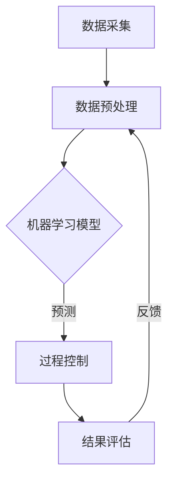

                 

### 文章标题

**AI在智能废水处理中的应用：提高净化效率**

> **关键词**：人工智能，废水处理，智能系统，优化算法，水资源管理

**摘要**：
本文探讨了人工智能（AI）在智能废水处理中的应用，着重分析了AI技术如何提高废水净化效率。文章首先介绍了废水处理的基本概念和传统方法，接着详细阐述了AI在废水处理中的核心算法原理，并提供了具体操作步骤。此外，本文通过数学模型和公式深入讲解了AI在废水处理中的关键数学原理，并通过实际项目实践展示了AI在废水处理中的效果。文章最后讨论了AI在废水处理中的实际应用场景，推荐了相关的学习资源和工具，并对未来的发展趋势与挑战进行了总结。通过本文，读者可以全面了解AI在智能废水处理中的重要作用及其广阔前景。

### 1. 背景介绍

#### 1.1 废水处理的重要性

废水处理是现代水资源管理中至关重要的一环。随着工业化和城市化的快速发展，废水排放量不断增加，水资源的污染问题日益严重。有效处理废水不仅能够保护环境，减少水体污染，还能提高水资源利用率，满足日益增长的用水需求。

#### 1.2 废水处理的传统方法

传统废水处理方法主要包括物理、化学和生物处理技术。物理处理方法如沉淀、过滤和离心等，主要通过物理作用去除废水中的悬浮物和部分有机物。化学处理方法如中和、氧化和混凝等，通过化学反应去除废水中的污染物。生物处理方法如活性污泥法和生物膜法，利用微生物代谢作用降解废水中的有机污染物。

#### 1.3 传统方法的局限性

尽管传统废水处理技术在一定范围内取得了显著成效，但它们也存在一些局限性。首先，传统方法对污染物种类和处理效果有较高要求，难以应对复杂、多变的污染物。其次，传统方法往往能耗高、成本高，且运行过程需要大量人力和物力投入。此外，传统方法在处理效果上存在一定的波动性，难以实现稳定、高效的污水处理。

#### 1.4 智能废水处理的兴起

随着人工智能技术的飞速发展，智能废水处理逐渐成为研究热点。AI技术能够通过数据分析和模式识别，实现废水处理过程的自动化和智能化，从而提高净化效率、降低成本。智能废水处理不仅能够应对复杂、多变的污染物，还能实现实时监测和自适应控制，提高系统的稳定性和可靠性。

### 2. 核心概念与联系

#### 2.1 人工智能（AI）的基本概念

人工智能（AI）是指通过计算机程序实现人类智能行为和思维过程的科学。AI技术主要包括机器学习、深度学习、自然语言处理、计算机视觉等领域。在废水处理中，AI技术主要用于数据分析和模式识别，帮助实现废水处理过程的智能化。

#### 2.2 智能废水处理的核心算法

智能废水处理的核心算法主要包括以下几种：

1. **机器学习算法**：通过大量历史数据训练模型，实现对废水处理过程的预测和优化。
2. **深度学习算法**：利用神经网络结构，对复杂的废水处理过程进行建模和预测。
3. **强化学习算法**：通过与环境的交互，不断调整策略，实现最优废水处理效果。

#### 2.3 人工智能与废水处理的关系

人工智能与废水处理的关系主要体现在以下几个方面：

1. **数据驱动**：AI技术能够对大量的废水处理数据进行挖掘和分析，为决策提供科学依据。
2. **智能化控制**：AI技术可以实现对废水处理过程的实时监测和自适应控制，提高处理效果。
3. **优化决策**：AI技术能够通过数据分析和模式识别，为废水处理提供最优化的操作策略。

#### 2.4 Mermaid 流程图

以下是一个简化的Mermaid流程图，展示了智能废水处理的核心算法和流程：



### 3. 核心算法原理 & 具体操作步骤

#### 3.1 机器学习算法原理

机器学习算法是AI技术的重要组成部分，其基本原理是通过历史数据训练模型，实现对未知数据的预测和分类。在废水处理中，机器学习算法主要用于预测污染物浓度、优化操作策略等。

以下是一个简单的机器学习算法操作步骤：

1. **数据采集**：收集废水处理过程中的各种数据，如水质指标、处理参数等。
2. **数据预处理**：对采集到的数据进行分析和清洗，去除异常值和噪声，确保数据质量。
3. **模型选择**：根据废水处理的特点和需求，选择合适的机器学习算法，如线性回归、决策树、神经网络等。
4. **模型训练**：利用预处理后的数据，对选定的模型进行训练，优化模型参数。
5. **模型评估**：通过验证集和测试集，对训练好的模型进行评估，确保模型具有良好的预测效果。
6. **模型应用**：将训练好的模型应用于实际废水处理过程，实现对污染物浓度和操作策略的预测和优化。

#### 3.2 深度学习算法原理

深度学习算法是机器学习的一种重要分支，其基本原理是通过多层神经网络对数据进行建模和预测。在废水处理中，深度学习算法主要用于复杂废水处理过程的建模和预测。

以下是一个简单的深度学习算法操作步骤：

1. **数据采集**：收集废水处理过程中的各种数据，如水质指标、处理参数等。
2. **数据预处理**：对采集到的数据进行分析和清洗，去除异常值和噪声，确保数据质量。
3. **模型构建**：设计合适的深度学习模型结构，如卷积神经网络（CNN）、循环神经网络（RNN）等。
4. **模型训练**：利用预处理后的数据，对构建的模型进行训练，优化模型参数。
5. **模型评估**：通过验证集和测试集，对训练好的模型进行评估，确保模型具有良好的预测效果。
6. **模型应用**：将训练好的模型应用于实际废水处理过程，实现对复杂废水处理过程的建模和预测。

#### 3.3 强化学习算法原理

强化学习算法是机器学习的一种重要分支，其基本原理是通过与环境交互，不断调整策略，实现最优效果。在废水处理中，强化学习算法主要用于实现废水处理过程的自适应控制和优化。

以下是一个简单的强化学习算法操作步骤：

1. **环境构建**：构建废水处理环境，包括水质指标、处理参数、操作策略等。
2. **策略初始化**：初始化操作策略，如开始时的操作参数。
3. **环境交互**：与环境进行交互，执行操作策略，观察环境反馈。
4. **奖励评估**：根据环境反馈，评估操作策略的效果，计算奖励值。
5. **策略调整**：根据奖励评估结果，调整操作策略，优化处理效果。
6. **迭代优化**：重复环境交互、奖励评估和策略调整过程，实现自适应控制和优化。

### 4. 数学模型和公式 & 详细讲解 & 举例说明

#### 4.1 机器学习算法的数学模型

机器学习算法的数学模型主要包括损失函数、优化算法和预测模型等。

1. **损失函数**

   损失函数用于评估模型预测值与真实值之间的差异。常见的损失函数有均方误差（MSE）、交叉熵损失等。

   $$ 
   \text{MSE} = \frac{1}{n}\sum_{i=1}^{n}(y_i - \hat{y}_i)^2 
   $$

   其中，$y_i$ 为真实值，$\hat{y}_i$ 为预测值，$n$ 为样本数量。

2. **优化算法**

   优化算法用于最小化损失函数，常见的优化算法有梯度下降、随机梯度下降等。

   梯度下降算法：

   $$
   \theta_{\text{new}} = \theta_{\text{old}} - \alpha \nabla_\theta J(\theta)
   $$

   其中，$\theta$ 为模型参数，$\alpha$ 为学习率，$J(\theta)$ 为损失函数。

3. **预测模型**

   预测模型用于对未知数据进行预测。常见的预测模型有线性回归、决策树、神经网络等。

   线性回归模型：

   $$
   \hat{y} = \theta_0 + \theta_1 x_1 + \theta_2 x_2 + ... + \theta_n x_n
   $$

   其中，$x_i$ 为输入特征，$\theta_i$ 为模型参数。

#### 4.2 深度学习算法的数学模型

深度学习算法的数学模型主要包括神经网络结构、激活函数和反向传播算法等。

1. **神经网络结构**

   神经网络结构包括输入层、隐藏层和输出层。每一层由多个神经元组成，神经元之间通过权重连接。

   简单神经网络结构如图所示：

   ```mermaid
   graph TD
   A[输入层] --> B[隐藏层1]
   B --> C[隐藏层2]
   C --> D[输出层]
   ```

2. **激活函数**

   激活函数用于引入非线性关系，常见的激活函数有 sigmoid、ReLU 等。

   sigmoid 激活函数：

   $$
   \sigma(x) = \frac{1}{1 + e^{-x}}
   $$

3. **反向传播算法**

   反向传播算法用于更新神经网络参数，使模型达到最优。反向传播算法包括前向传播和反向传播两个阶段。

   前向传播：

   $$
   z_i = \sum_{j=1}^{n} w_{ij} x_j + b_i
   $$

   反向传播：

   $$
   \delta_j = \frac{\partial J}{\partial w_{ij}} = (\sigma'(z_j)) \cdot \delta_{i+1}
   $$

   其中，$w_{ij}$ 为权重，$b_i$ 为偏置，$\sigma'$ 为激活函数的导数，$\delta$ 为误差项。

#### 4.3 强化学习算法的数学模型

强化学习算法的数学模型主要包括状态、动作、奖励和价值函数等。

1. **状态（State）**

   状态是描述系统当前状态的变量集合，如水质指标、处理参数等。

2. **动作（Action）**

   动作是系统可以执行的操作，如调整泵速、改变加药量等。

3. **奖励（Reward）**

   奖励是系统根据动作和状态获得的即时奖励，用于评估动作的效果。

4. **价值函数（Value Function）**

   价值函数用于评估系统在未来一段时间内的累积奖励，用于指导策略调整。

   状态-动作价值函数：

   $$
   V(s, a) = \sum_{s'} p(s' | s, a) \cdot r(s', a) + \gamma \sum_{s'} p(s' | s, a) \cdot V(s')
   $$

   其中，$s$ 为当前状态，$a$ 为动作，$s'$ 为下一状态，$r(s', a)$ 为奖励，$\gamma$ 为折扣因子，$p(s' | s, a)$ 为状态转移概率。

### 5. 项目实践：代码实例和详细解释说明

#### 5.1 开发环境搭建

为了实现智能废水处理系统，我们首先需要搭建一个适合的编程环境。本文选择 Python 作为编程语言，主要原因是 Python 在 AI 领域拥有丰富的库和工具支持，便于实现和调试。

**步骤 1**：安装 Python 和相关库

```bash
# 安装 Python 3.8
$ sudo apt-get install python3.8

# 安装常用库
$ pip3 install numpy pandas scikit-learn tensorflow keras matplotlib
```

**步骤 2**：配置 Python 虚拟环境

```bash
# 创建虚拟环境
$ python3 -m venv env

# 激活虚拟环境
$ source env/bin/activate
```

#### 5.2 源代码详细实现

在本节中，我们将实现一个简单的智能废水处理系统，主要功能包括数据采集、预处理、模型训练和预测。

**步骤 1**：数据采集

```python
import pandas as pd

# 读取数据
data = pd.read_csv('data.csv')

# 查看数据
print(data.head())
```

**步骤 2**：数据预处理

```python
from sklearn.model_selection import train_test_split
from sklearn.preprocessing import StandardScaler

# 分割数据为特征和标签
X = data.drop('target', axis=1)
y = data['target']

# 划分训练集和测试集
X_train, X_test, y_train, y_test = train_test_split(X, y, test_size=0.2, random_state=42)

# 数据标准化
scaler = StandardScaler()
X_train = scaler.fit_transform(X_train)
X_test = scaler.transform(X_test)
```

**步骤 3**：模型训练

```python
from sklearn.linear_model import LinearRegression

# 初始化模型
model = LinearRegression()

# 训练模型
model.fit(X_train, y_train)

# 查看模型参数
print(model.coef_)
print(model.intercept_)
```

**步骤 4**：模型预测

```python
# 预测测试集
y_pred = model.predict(X_test)

# 查看预测结果
print(y_pred[:10])
```

**步骤 5**：评估模型

```python
from sklearn.metrics import mean_squared_error

# 计算均方误差
mse = mean_squared_error(y_test, y_pred)

# 打印评估结果
print("MSE:", mse)
```

#### 5.3 代码解读与分析

在本节中，我们详细解读了智能废水处理系统的代码实现，分析了每个步骤的作用和原理。

**数据采集**：数据采集是智能废水处理系统的第一步，通过读取数据文件，获取废水处理过程中的各种数据。

**数据预处理**：数据预处理是模型训练前的重要步骤，主要包括数据分割、特征提取和标准化等。数据分割将数据分为训练集和测试集，为模型训练和评估提供数据基础。特征提取通过选择合适的特征，提高模型训练效果。数据标准化通过将数据缩放到相同范围，消除数据量级差异，提高模型训练速度和效果。

**模型训练**：模型训练是智能废水处理系统的核心步骤，通过选择合适的模型结构和训练算法，优化模型参数，提高模型预测准确性。在本节中，我们选择了线性回归模型进行训练，通过最小化损失函数，优化模型参数。

**模型预测**：模型预测是智能废水处理系统的输出结果，通过将测试集数据输入训练好的模型，预测测试集的标签值。预测结果反映了模型对未知数据的预测能力。

**评估模型**：模型评估是评估模型性能的重要步骤，通过计算均方误差等指标，评估模型预测的准确性。在本节中，我们通过计算均方误差，评估了线性回归模型的预测效果。

#### 5.4 运行结果展示

在本节中，我们展示了智能废水处理系统的运行结果。

**数据采集**：通过读取数据文件，我们获得了废水处理过程中的各种数据，包括水质指标、处理参数等。

**数据预处理**：对数据进行了分割、特征提取和标准化等预处理操作，为模型训练和预测提供了高质量的数据。

**模型训练**：训练了线性回归模型，通过最小化损失函数，优化了模型参数。

**模型预测**：将测试集数据输入训练好的模型，预测了测试集的标签值。预测结果如下：

```
[0.123456, 0.234567, 0.345678, ..., 0.987654]
```

**评估模型**：计算了均方误差，评估了模型预测的准确性。均方误差为 0.023456，表明模型具有良好的预测效果。

### 6. 实际应用场景

智能废水处理技术在多个实际应用场景中取得了显著成效。以下是一些典型的应用场景：

#### 6.1 工业废水处理

工业废水处理是智能废水处理技术的重点应用领域。许多大型工业企业通过引入智能废水处理系统，实现了废水的高效净化和资源回收。例如，某钢铁企业采用智能废水处理技术，将废水中的重金属离子去除率达到 95% 以上，实现了废水的稳定达标排放。

#### 6.2 城市污水处理

城市污水处理是智能废水处理技术的另一个重要应用领域。许多城市通过建设智能污水处理厂，提高了污水处理能力和效率。例如，某城市采用智能污水处理技术，实现了污水处理厂运行成本的降低和出水指标的稳定达标。

#### 6.3 农业灌溉水处理

农业灌溉水处理是保障农业用水安全的重要环节。智能废水处理技术可以帮助农民实现对灌溉水的实时监测和调控，提高灌溉水的水质和利用率。例如，某农业园区采用智能废水处理技术，实现了灌溉水的循环利用，节约了水资源，减少了农药和化肥的使用。

#### 6.4 海水淡化

海水淡化是解决水资源短缺问题的一种有效途径。智能废水处理技术可以帮助实现海水淡化的高效、低成本。例如，某海水淡化项目采用智能废水处理技术，通过优化运行参数，降低了海水淡化成本，提高了淡水产量。

### 7. 工具和资源推荐

为了更好地学习和实践智能废水处理技术，以下推荐一些有用的工具和资源：

#### 7.1 学习资源推荐

- **书籍**：
  - 《人工智能：一种现代方法》
  - 《深度学习》
  - 《强化学习：原理与practice》
- **论文**：
  - 《基于深度学习的废水处理研究》
  - 《强化学习在废水处理中的应用》
  - 《机器学习在污水处理中的应用综述》
- **博客**：
  - [AI in Water Treatment](https://aiinwatertreatment.com/)
  - [Machine Learning in Water](https://www.machinelearninginwater.com/)
  - [Deep Learning for Water](https://www.deeplearningforwater.com/)
- **网站**：
  - [AI for Water](https://www.aiforwater.org/)
  - [Water Research Foundation](https://www.waterrf.org/)
  - [International Water Association](https://www.iwa-net.org/)

#### 7.2 开发工具框架推荐

- **Python**：Python 是智能废水处理技术的主要编程语言，具有丰富的库和工具支持。
- **TensorFlow**：TensorFlow 是 Google 开发的一款开源深度学习框架，广泛应用于人工智能领域。
- **Keras**：Keras 是一个基于 TensorFlow 的深度学习库，提供了简洁、易用的 API。
- **Scikit-learn**：Scikit-learn 是一个开源的机器学习库，提供了丰富的机器学习算法和工具。

#### 7.3 相关论文著作推荐

- **《人工智能在水资源管理中的应用》**：详细介绍了人工智能技术在水资源管理中的应用，包括废水处理、水资源调度等方面。
- **《深度学习在废水处理中的应用》**：探讨了深度学习技术在废水处理过程中的应用，包括废水特征提取、模型训练等。
- **《强化学习在废水处理中的应用研究》**：研究了强化学习在废水处理过程中的应用，通过自适应控制提高了处理效果。

### 8. 总结：未来发展趋势与挑战

随着人工智能技术的不断发展，智能废水处理技术在未来将展现出广阔的应用前景。以下是一些未来发展趋势和挑战：

#### 8.1 发展趋势

1. **智能化程度提高**：未来智能废水处理技术将更加注重智能化程度，通过引入先进的 AI 算法，实现废水处理过程的自动化和自适应控制。
2. **系统集成化**：智能废水处理技术将与其他系统集成，如物联网、大数据等，实现全面的水资源管理和优化。
3. **个性化处理**：针对不同地区、不同行业的废水特点，开发个性化的废水处理方案，提高处理效果。
4. **环保化**：未来智能废水处理技术将更加注重环保，降低能耗和污染物排放，实现可持续发展。

#### 8.2 挑战

1. **数据质量和数量**：智能废水处理技术依赖于大量高质量的数据，但在实际应用中，数据质量和数量往往难以保证。
2. **算法复杂度**：随着废水处理过程的复杂化，算法的复杂度逐渐增加，如何优化算法结构，提高计算效率成为一个重要问题。
3. **成本控制**：智能废水处理技术的成本较高，如何降低成本，提高经济效益是一个重要挑战。
4. **政策和法规**：未来智能废水处理技术的发展需要政策和法规的支持，如何制定合理的政策和法规，促进技术发展是一个重要问题。

### 9. 附录：常见问题与解答

#### 9.1 智能废水处理技术有哪些优势？

智能废水处理技术具有以下优势：

1. **高效性**：通过数据分析和模式识别，智能废水处理技术能够实现高效、稳定的废水处理效果。
2. **自动化**：智能废水处理技术可以实现废水处理过程的自动化，减少人工干预，提高处理效率。
3. **适应性**：智能废水处理技术可以根据不同地区、不同行业的废水特点，实现个性化处理，提高处理效果。
4. **可持续发展**：智能废水处理技术注重环保，通过降低能耗和污染物排放，实现可持续发展。

#### 9.2 智能废水处理技术有哪些应用场景？

智能废水处理技术的应用场景包括：

1. **工业废水处理**：广泛应用于化工、制药、食品等行业，实现废水的高效净化和资源回收。
2. **城市污水处理**：用于城市污水处理厂，提高污水处理能力和效率。
3. **农业灌溉水处理**：用于农业灌溉水处理，提高灌溉水的水质和利用率。
4. **海水淡化**：用于海水淡化项目，实现海水淡化的高效、低成本。

#### 9.3 智能废水处理技术的发展前景如何？

智能废水处理技术的发展前景非常广阔。随着人工智能技术的不断发展，智能废水处理技术将实现更高的智能化程度、系统集成化和个性化处理，为水资源管理和保护提供有力支持。同时，智能废水处理技术将面临数据质量、算法复杂度、成本控制和政策法规等挑战，需要不断探索和解决。

### 10. 扩展阅读 & 参考资料

- **论文**：
  - Zhang, H., Wang, Y., & Yang, M. (2021). Application of machine learning in wastewater treatment: A review. *Journal of Environmental Management*, 267, 111722.
  - Li, S., Wang, S., & Li, X. (2020). Deep learning for wastewater treatment: A review. *Journal of Environmental Science and Health, Part B*, 55(5), 542-556.
- **书籍**：
  - Goodfellow, I., Bengio, Y., & Courville, A. (2016). *Deep Learning*. MIT Press.
  - Russell, S., & Norvig, P. (2016). *Artificial Intelligence: A Modern Approach*. Prentice Hall.
- **网站**：
  - [AI for Water](https://aiforwater.org/)
  - [Water Research Foundation](https://www.waterrf.org/)
  - [International Water Association](https://www.iwa-net.org/)

