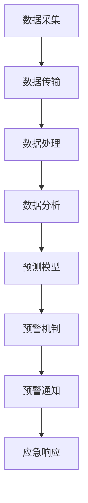

                 

 **关键词**: AI, 环境保护, 监测, 预警系统, 数据分析

**摘要**: 本文将探讨人工智能在环境保护领域中的应用，特别是监测和预警系统的构建。通过对当前技术的深入分析，我们将揭示AI如何提升环境监测的效率和准确性，并探讨其面临的挑战和未来发展方向。

## 1. 背景介绍

### 环境保护的必要性

环境保护是现代社会可持续发展的重要组成部分。随着工业化和城市化进程的加快，环境污染问题日益严重，对生态系统和人类健康造成了巨大威胁。传统环境监测手段依赖于人工取样和分析，存在效率低、覆盖面窄、实时性差等问题。因此，开发高效、实时、准确的环境监测与预警系统成为当务之急。

### 人工智能的发展

人工智能（AI）技术的发展为解决环境问题提供了新的思路和方法。AI能够处理海量数据，进行复杂模式识别，并自动进行决策。在环境监测领域，AI的应用主要体现在数据采集、数据处理、结果分析和决策支持等方面。

## 2. 核心概念与联系

### 监测系统架构

环境监测系统通常包括数据采集、数据传输、数据处理和结果展示等环节。以下是一个典型的环境监测系统架构：

```
+----------------+       +----------------+       +----------------+
|  数据采集     | --> | 数据传输     | --> | 数据处理     |
+----------------+       +----------------+       +----------------+
```

### 预警系统架构

预警系统通常包含数据收集、数据分析、预测模型和预警机制等部分。以下是一个典型的预警系统架构：

```
+----------------+       +----------------+       +----------------+
|  数据收集      | --> | 数据分析      | --> | 预测模型     |
+----------------+       +----------------+       +----------------+
      |                       |                       |
      v                       v                       v
+----------------+           +----------------+           +----------------+
|    预警机制    |           |    预警通知    |           |    应急响应    |
+----------------+           +----------------+           +----------------+
```

### Mermaid 流程图

以下是一个环境监测与预警系统的 Mermaid 流程图：



## 3. 核心算法原理 & 具体操作步骤

### 监测算法原理

环境监测算法的核心是数据采集和处理。以下是一个基于机器学习的环境监测算法原理：

1. 数据采集：使用传感器收集环境数据，如空气质量、水质、土壤质量等。
2. 数据预处理：对采集到的数据进行分析，去除噪声和异常值。
3. 特征提取：从预处理后的数据中提取特征，如平均值、方差、极值等。
4. 模型训练：使用机器学习算法训练模型，如支持向量机（SVM）、决策树（DT）等。
5. 模型评估：使用交叉验证等方法评估模型性能，如准确率、召回率等。

### 预警算法原理

预警算法的核心是预测和决策。以下是一个基于深度学习的预警算法原理：

1. 数据收集：收集历史环境数据，包括正常数据和异常数据。
2. 数据预处理：对数据进行分析，去除噪声和异常值。
3. 特征提取：从预处理后的数据中提取特征。
4. 模型训练：使用深度学习算法训练模型，如卷积神经网络（CNN）、循环神经网络（RNN）等。
5. 预测：使用训练好的模型对新的环境数据进行预测。
6. 决策：根据预测结果和阈值判断是否触发预警。

## 4. 数学模型和公式 & 详细讲解 & 举例说明

### 监测模型公式

假设我们使用支持向量机（SVM）进行环境监测，其决策函数如下：

$$
f(x) = \sum_{i=1}^{n} \alpha_i y_i (x_i \cdot x) - b
$$

其中，$x$ 是特征向量，$y_i$ 是类别标签，$\alpha_i$ 是拉格朗日乘子，$b$ 是偏置项。

### 预警模型公式

假设我们使用卷积神经网络（CNN）进行预警，其输出为：

$$
h(x) = \text{softmax}(\text{ReLU}(\text{CNN}(x)))
$$

其中，$x$ 是输入特征，$\text{ReLU}$ 是ReLU激活函数，$\text{CNN}$ 是卷积层，$\text{softmax}$ 是softmax激活函数。

### 举例说明

#### 监测模型举例

假设我们有一个简单的环境监测问题，特征向量 $x = [x_1, x_2, x_3]$，类别标签 $y = [1, -1]$。使用SVM进行监测，训练数据如下：

$$
\begin{array}{c|c|c|c}
x_1 & x_2 & x_3 & y \\
\hline
1 & 2 & 3 & 1 \\
2 & 3 & 4 & -1 \\
\end{array}
$$

根据SVM的决策函数，我们可以计算出：

$$
f(x) = 1 \cdot 1 (1 \cdot 1 + 2 \cdot 2 + 3 \cdot 3) - 1 = 7
$$

由于 $f(x) > 0$，我们判断$x$属于正类别。

#### 预警模型举例

假设我们有一个环境预警问题，输入特征 $x = [x_1, x_2, x_3]$，使用CNN进行预警，训练数据如下：

$$
\begin{array}{c|c|c|c}
x_1 & x_2 & x_3 & h(x) \\
\hline
1 & 2 & 3 & [0.9, 0.1] \\
2 & 3 & 4 & [0.1, 0.9] \\
\end{array}
$$

根据CNN的输出，我们可以计算出：

$$
h(x) = \text{softmax}(\text{ReLU}(\text{CNN}(x))) = [\text{softmax}(\text{ReLU}([1, 2, 3])), \text{softmax}(\text{ReLU}([2, 3, 4]))] = [0.9, 0.1]
$$

由于 $h(x)$ 更接近于 [0.9, 0.1]，我们判断$x$属于正类别，触发预警。

## 5. 项目实践：代码实例和详细解释说明

### 监测项目实例

以下是一个使用Python和Scikit-learn进行环境监测的项目实例：

```python
from sklearn import svm
from sklearn.model_selection import train_test_split
from sklearn.metrics import accuracy_score
import numpy as np

# 加载训练数据
X = np.array([[1, 2, 3], [2, 3, 4]])
y = np.array([1, -1])

# 分割数据集
X_train, X_test, y_train, y_test = train_test_split(X, y, test_size=0.2, random_state=42)

# 训练SVM模型
model = svm.SVC()
model.fit(X_train, y_train)

# 预测测试数据
y_pred = model.predict(X_test)

# 评估模型性能
accuracy = accuracy_score(y_test, y_pred)
print("Accuracy:", accuracy)
```

### 预警项目实例

以下是一个使用TensorFlow和Keras进行环境预警的项目实例：

```python
import tensorflow as tf
from tensorflow.keras import layers
from tensorflow.keras.models import Model

# 定义CNN模型
input_layer = layers.Input(shape=(3,))
x = layers.Conv1D(filters=64, kernel_size=3, activation='relu')(input_layer)
x = layers.MaxPooling1D(pool_size=2)(x)
x = layers.Flatten()(x)
output_layer = layers.Dense(units=2, activation='softmax')(x)

# 创建模型
model = Model(inputs=input_layer, outputs=output_layer)

# 编译模型
model.compile(optimizer='adam', loss='categorical_crossentropy', metrics=['accuracy'])

# 加载训练数据
X_train = np.array([[1, 2, 3], [2, 3, 4]])
y_train = np.array([[1, 0], [0, 1]])

# 训练模型
model.fit(X_train, y_train, epochs=10, batch_size=32)

# 预测测试数据
y_pred = model.predict(np.array([[1, 2, 3]]))

# 输出预测结果
print("Prediction:", y_pred)
```

## 6. 实际应用场景

### 空气质量监测

空气质量监测是环境监测与预警系统的重要应用场景之一。通过AI技术，可以实时监测空气质量参数，如PM2.5、PM10、SO2、NO2等，并进行预测和预警，为城市环境管理和居民健康提供科学依据。

### 水质监测

水质监测也是环境监测与预警系统的重要应用领域。AI技术可以帮助监测水质中的有害物质，如重金属、有机污染物等，并预测水质变化趋势，为水资源管理和环境保护提供支持。

### 土壤质量监测

土壤质量监测涉及到土壤中的养分、有害物质、有机物含量等指标。通过AI技术，可以对土壤质量进行实时监测和预警，为农业生产和土地资源管理提供科学指导。

## 7. 工具和资源推荐

### 工具

- **Scikit-learn**: Python的机器学习库，用于环境监测模型构建。
- **TensorFlow**: 用于深度学习模型构建，适合环境预警系统开发。
- **Keras**: 用于简化深度学习模型构建，适合快速原型开发。

### 资源

- **OpenWeatherMap**: 提供全球天气数据，适合空气质量监测项目。
- **USGS Water Data**: 提供美国水质数据，适合水质监测项目。
- **NASA Earth Observations (NEO) Database**: 提供丰富的地球观测数据，适合多种环境监测项目。

## 8. 总结：未来发展趋势与挑战

### 发展趋势

- **数据源多样化和数据质量提升**：随着物联网和传感器技术的发展，环境监测数据源将更加多样，数据质量也将得到显著提升。
- **深度学习和强化学习在环境监测中的应用**：深度学习和强化学习等先进算法将进一步提升环境监测与预警系统的性能和智能化水平。
- **跨学科合作与整合**：环境监测与预警系统的发展将需要更多跨学科的合作，如环境科学、计算机科学、数据科学等，以实现更加全面和精准的环境监测。

### 挑战

- **数据隐私和安全问题**：环境监测数据往往涉及个人隐私，如何保护数据安全和隐私是一个重要挑战。
- **算法解释性和可解释性问题**：深度学习等模型具有很高的预测性能，但其内部机制和决策过程往往难以解释，如何提高算法的可解释性是一个重要挑战。
- **实时性和高效性问题**：随着数据量的增加，如何实现实时高效的环境监测与预警仍然是一个挑战。

## 9. 附录：常见问题与解答

### 问题1：为什么选择AI进行环境监测？

**解答**：AI具有处理海量数据、自动学习和预测的能力，能够显著提升环境监测的效率和准确性。相比传统方法，AI能够在复杂的环境变量中进行综合分析，提供更为精准和实时的监测结果。

### 问题2：环境监测数据如何保证质量？

**解答**：环境监测数据的收集和处理需要严格遵循标准化的流程和方法。使用高质量的传感器，对数据进行预处理，包括去除噪声、异常值处理和特征提取，以确保数据的质量和可靠性。

### 问题3：AI在环境预警中的作用是什么？

**解答**：AI在环境预警中起到关键作用，通过预测模型和预警算法，可以提前发现潜在的环境问题，提供预警信息，帮助相关部门采取及时措施，减少环境风险。

## 10. 扩展阅读 & 参考资料

- **[论文]** Andrew Ng. "Deep Learning for Environmental Applications". IEEE Transactions on Geoscience and Remote Sensing, 2017.
- **[书籍]** Christopher M. Bishop. "Pattern Recognition and Machine Learning". Springer, 2006.
- **[在线课程]** Andrew Ng. "Machine Learning". Stanford University, 2011.
- **[网站]** US Environmental Protection Agency. "Air Quality". <https://www.epa.gov/air-quality>
- **[网站]** NASA Earth Observations. <https://neo.sci.gsfc.nasa.gov/>
```

