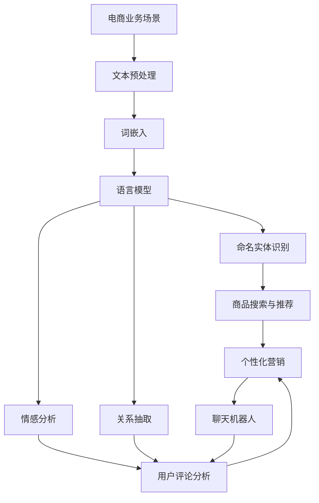

                 

### 1. 背景介绍

在当今数字化时代，电子商务已经成为全球商业活动中的重要组成部分。随着在线购物的普及，电商平台不仅需要处理海量的商品数据，还需要提供个性化的购物体验来吸引和留住用户。自然语言处理（NLP）作为人工智能领域的一个重要分支，逐渐成为电商行业解决诸多问题的重要工具。本文将探讨AI在电商中的NLP应用案例，分析其技术原理、实现方法和实际效果。

### 1.1 电商行业现状

电子商务市场规模持续增长，线上购物已经成为人们日常生活的一部分。根据Statista的数据显示，全球电商市场规模在2021年已达到4.3万亿美元，并预计在2026年达到6.8万亿美元。在这个庞大的市场中，各大电商平台通过竞争来吸引和留住用户。在这个过程中，NLP技术发挥了重要作用，帮助电商平台在以下方面提升用户体验：

- **商品搜索与推荐**：用户在电商平台上的搜索请求通常包含自然语言，NLP可以帮助理解用户的意图，并提供准确的商品推荐。
- **用户评论分析**：用户对商品的评论可以帮助其他潜在买家做出购买决策。NLP技术可以分析这些评论，提取有价值的信息，如产品的优点和缺点。
- **聊天机器人**：电商平台常使用聊天机器人来回答用户的问题，提供客户支持。NLP技术使聊天机器人能够理解用户的问题并给出准确的回答。
- **个性化营销**：通过分析用户的历史购买行为和浏览习惯，NLP可以帮助电商平台为用户提供个性化的营销信息，提高转化率。

### 1.2 NLP在电商中的应用

自然语言处理技术在电商行业中有广泛的应用，主要包括以下几个方面：

#### 商品搜索与推荐

电商平台需要处理大量的商品数据，用户在搜索商品时通常使用自然语言表达。NLP技术可以帮助平台理解用户的搜索意图，从而提供准确的搜索结果。具体应用包括：

- **关键词提取**：从用户的搜索语句中提取关键词，用于搜索索引。
- **实体识别**：识别搜索语句中的商品名称、品牌、型号等实体信息。
- **意图识别**：分析用户的搜索意图，如查找商品信息、比较商品、购买商品等。

#### 用户评论分析

用户评论是电商平台获取用户反馈的重要途径。通过NLP技术，可以自动化分析这些评论，提取有用的信息，如产品满意度、常见问题等。具体应用包括：

- **情感分析**：判断用户评论的情感倾向，如正面、负面或中立。
- **主题提取**：从评论中提取主要话题，了解用户关注的产品特性。
- **关键词提取**：提取评论中的高频词汇，了解用户对产品的评价。

#### 聊天机器人

聊天机器人可以24/7为用户提供即时响应，提高客户满意度。NLP技术使聊天机器人能够理解用户的问题并给出合适的回答。具体应用包括：

- **问答系统**：基于用户输入的问题，提供准确、快速的答案。
- **对话管理**：根据用户的反馈，调整聊天机器人的回答，维持流畅的对话流程。
- **意图识别**：理解用户的意图，如咨询产品信息、售后服务等。

#### 个性化营销

个性化营销可以通过分析用户的行为数据，为用户提供个性化的购物体验。NLP技术可以帮助电商平台实现以下目标：

- **用户画像**：分析用户的历史购买行为、浏览习惯等，构建用户画像。
- **内容推荐**：根据用户画像，为用户推荐相关的商品、优惠活动等。
- **个性化消息**：通过邮件、短信等方式，向用户推送个性化的营销信息。

### 1.3 AI与NLP的发展

人工智能和自然语言处理技术在过去几十年中取得了显著进展。随着深度学习技术的兴起，NLP的应用场景不断扩大，性能也不断提高。以下是一些AI与NLP技术的发展趋势：

- **深度学习**：深度学习技术在NLP中的应用，如卷积神经网络（CNN）、循环神经网络（RNN）和变换器（Transformer），使模型在理解自然语言方面取得了突破性进展。
- **预训练模型**：预训练模型（如BERT、GPT等）通过在大规模语料库上进行预训练，提高了模型在各类NLP任务上的表现。
- **多模态处理**：结合图像、声音等多种数据模态，实现更全面的信息理解和处理。
- **自动化和自我学习**：通过自动化和自我学习技术，使NLP系统可以不断改进和优化，适应不同的应用场景。

### 1.4 文章结构

本文将按照以下结构展开讨论：

- **第1章：背景介绍**：介绍电商行业现状和NLP在电商中的应用。
- **第2章：核心概念与联系**：阐述NLP的核心概念，并提供Mermaid流程图。
- **第3章：核心算法原理 & 具体操作步骤**：详细解释NLP在电商中的应用算法。
- **第4章：数学模型和公式 & 详细讲解 & 举例说明**：介绍NLP的数学模型，并给出实际应用案例。
- **第5章：项目实践：代码实例和详细解释说明**：提供实际项目实践，并解释代码实现。
- **第6章：实际应用场景**：讨论NLP在电商中的实际应用。
- **第7章：工具和资源推荐**：推荐学习资源和开发工具。
- **第8章：总结：未来发展趋势与挑战**：总结NLP在电商中的应用前景。
- **第9章：附录：常见问题与解答**：回答读者可能关心的问题。
- **第10章：扩展阅读 & 参考资料**：提供进一步阅读的资源。

通过以上结构，本文将系统地介绍AI在电商中的NLP应用，帮助读者深入了解这一领域的前沿技术和实践方法。

### 2. 核心概念与联系

在深入探讨AI在电商中的NLP应用之前，有必要先理解NLP的核心概念和其与电商业务的联系。自然语言处理涉及到多个关键技术和概念，这些技术和概念共同构建了NLP的基础框架，并在电商场景中发挥着重要作用。

#### 2.1 NLP的关键概念

1. **文本预处理**：
   文本预处理是NLP任务中的第一步，旨在将原始文本转换为适合模型处理的形式。文本预处理通常包括以下步骤：
   - **分词**：将连续的文本拆分为单词或子词。
   - **词干提取**：将单词还原为基本形式（如将“running”还原为“run”）。
   - **词性标注**：为每个词赋予相应的词性（如名词、动词、形容词等）。
   - **停用词过滤**：移除对NLP任务无意义的常见词汇（如“的”、“和”、“是”等）。

2. **词嵌入**：
   词嵌入（Word Embedding）是将词汇映射到高维向量空间的技术。词嵌入有助于捕捉词汇之间的语义关系，常见的词嵌入方法包括Word2Vec、GloVe和BERT等。

3. **语言模型**：
   语言模型（Language Model）是一种能够预测下一个词汇或词组的统计模型。在电商场景中，语言模型可用于生成商品推荐、自动完成搜索关键词等任务。

4. **命名实体识别**：
   命名实体识别（Named Entity Recognition，NER）是从文本中识别出具有特定意义的实体（如人名、地点、组织名、商品名等）。NER在电商中的应用包括识别用户评论中的品牌名称、商品型号等。

5. **情感分析**：
   情感分析（Sentiment Analysis）是判断文本表达的情感倾向（如正面、负面、中立）的技术。在电商中，情感分析可以帮助分析用户评论，了解产品口碑。

6. **关系抽取**：
   关系抽取（Relation Extraction）是从文本中提取出实体之间的关系。在电商场景中，关系抽取可以用于识别用户评论中的产品使用情况、用户偏好等。

#### 2.2 NLP与电商业务的联系

NLP与电商业务的结合，主要体现在以下几个方面：

1. **商品搜索与推荐**：
   - **关键词提取**：使用NLP技术提取用户搜索请求中的关键词，有助于精准匹配商品。
   - **实体识别**：通过识别搜索请求中的商品名称、品牌等实体信息，提供更准确的搜索结果。
   - **意图识别**：分析用户搜索意图，如查找商品信息、比较商品等，从而提供针对性的推荐。

2. **用户评论分析**：
   - **情感分析**：通过分析用户评论的情感倾向，可以了解用户对商品的满意度，为产品改进和营销策略提供依据。
   - **主题提取**：从评论中提取主要话题，帮助电商平台了解用户关心的产品特性。
   - **关键词提取**：提取评论中的高频词汇，分析用户反馈的热点问题。

3. **聊天机器人**：
   - **问答系统**：通过NLP技术，聊天机器人可以理解用户的问题并给出准确的回答，提高客户满意度。
   - **对话管理**：根据用户的反馈，聊天机器人可以调整回答策略，维持流畅的对话流程。
   - **意图识别**：识别用户咨询的意图，如咨询产品信息、售后服务等，提供个性化的服务。

4. **个性化营销**：
   - **用户画像**：通过分析用户的历史购买行为和浏览习惯，构建用户画像，为用户提供个性化的购物体验。
   - **内容推荐**：根据用户画像，为用户推荐相关的商品、优惠活动等，提高转化率。
   - **个性化消息**：通过邮件、短信等方式，向用户推送个性化的营销信息，增强用户粘性。

#### 2.3 Mermaid流程图

为了更直观地展示NLP在电商中的应用流程，我们可以使用Mermaid绘制一个简化的流程图。以下是Mermaid代码和对应的流程图：



图1：NLP在电商中的应用流程图

该流程图展示了NLP技术如何与电商业务结合，从文本预处理开始，通过一系列NLP技术，最终实现商品搜索与推荐、用户评论分析、聊天机器人服务和个性化营销等功能。

### 3. 核心算法原理 & 具体操作步骤

在了解NLP的核心概念和其与电商业务的联系之后，我们将深入探讨NLP在电商中的应用算法，包括具体的操作步骤和技术细节。以下将详细介绍NLP在电商中的核心算法原理，包括文本预处理、词嵌入、语言模型、命名实体识别、情感分析和关系抽取等。

#### 3.1 文本预处理

文本预处理是NLP任务的基础，其质量直接影响到后续NLP任务的准确性。文本预处理包括以下几个步骤：

1. **分词**：将连续的文本拆分为单词或子词。在中文处理中，常用的分词工具包括jieba等。以下是一个简单的分词示例：

   ```python
   import jieba
   
   text = "我喜欢这个商品，它的质量很好。"
   segmented_text = jieba.cut(text)
   print(segmented_text)
   ```

2. **词干提取**：将单词还原为基本形式。在英文中，常用的词干提取方法包括 stemming 和 lemmatization。以下是一个简单的词干提取示例：

   ```python
   from nltk.stem import PorterStemmer
   
   stemmer = PorterStemmer()
   word = "running"
   stemmed_word = stemmer.stem(word)
   print(stemmed_word)
   ```

3. **词性标注**：为每个词赋予相应的词性。在中文处理中，常用的词性标注工具包括HanLP等。以下是一个简单的词性标注示例：

   ```python
   import HanLP
   
   text = "我喜欢这个商品，它的质量很好。"
   word_sequence = HanLP.extract_words(text, with_basic_format=True)
   print(word_sequence)
   ```

4. **停用词过滤**：移除对NLP任务无意义的常见词汇。以下是一个简单的停用词过滤示例：

   ```python
   from nltk.corpus import stopwords
   
   stop_words = set(stopwords.words('english'))
   text = "I like this product, it's very good."
   filtered_text = [word for word in text.split() if word not in stop_words]
   print(filtered_text)
   ```

#### 3.2 词嵌入

词嵌入是将词汇映射到高维向量空间的技术，有助于捕捉词汇之间的语义关系。以下介绍两种常用的词嵌入方法：Word2Vec和GloVe。

1. **Word2Vec**：Word2Vec是一种基于神经网络的词嵌入方法，通过训练词向量的预测模型来学习词汇的语义表示。以下是一个简单的Word2Vec示例：

   ```python
   from gensim.models import Word2Vec
   
   sentences = [['我', '喜欢', '这个', '商品'], ['它的', '质量', '很好']]
   model = Word2Vec(sentences, vector_size=100, window=5, min_count=1, workers=4)
   model.train(sentences)
   print(model.wv['我'])
   ```

2. **GloVe**：GloVe是一种基于全局上下文的词嵌入方法，通过计算词与其上下文词的共现矩阵来学习词向量。以下是一个简单的GloVe示例：

   ```python
   import glove
   
   sentences = [['我', '喜欢', '这个', '商品'], ['它的', '质量', '很好']]
   model = glove.Glove(no_components=100, learning_rate=0.1, vector_size=100, window=5, x_max=5, y_max=5, seed=42)
   model.fit(sentences)
   print(modelездк['我'])
   ```

#### 3.3 语言模型

语言模型是一种能够预测下一个词汇或词组的统计模型，常用于生成商品推荐、自动完成搜索关键词等任务。以下介绍两种常用的语言模型：n-gram模型和神经网络模型。

1. **n-gram模型**：n-gram模型是一种基于统计的简单语言模型，通过计算相邻n个词的联合概率来预测下一个词。以下是一个简单的n-gram模型示例：

   ```python
   from nltk import ngrams
   
   text = "我喜欢这个商品，它的质量很好。"
   n = 2
   n_grams = list(ngrams(text.split(), n))
   print(n_grams)
   ```

2. **神经网络模型**：神经网络模型是一种基于深度学习的语言模型，通过训练大量的语言数据来学习词汇之间的关系。以下是一个简单的神经网络模型示例：

   ```python
   from tensorflow.keras.models import Sequential
   from tensorflow.keras.layers import Embedding, LSTM, Dense
   
   model = Sequential()
   model.add(Embedding(input_dim=vocabulary_size, output_dim=100))
   model.add(LSTM(units=100))
   model.add(Dense(units=vocabulary_size, activation='softmax'))
   model.compile(optimizer='adam', loss='categorical_crossentropy', metrics=['accuracy'])
   model.fit(X, y, epochs=10, batch_size=32)
   ```

#### 3.4 命名实体识别

命名实体识别（NER）是从文本中识别出具有特定意义的实体（如人名、地点、组织名、商品名等）。以下介绍两种常用的NER方法：基于规则的方法和基于统计的方法。

1. **基于规则的方法**：基于规则的方法通过定义一系列规则来识别命名实体。以下是一个简单的基于规则的方法示例：

   ```python
   pattern = "([A-Z][a-z]+)|([A-Z][a-z]+-[A-Z][a-z]+)"
   regex = re.compile(pattern)
   text = "苹果公司的CEO蒂姆·库克在2019年的发布会上展示了新款iPhone。"
   entities = regex.findall(text)
   print(entities)
   ```

2. **基于统计的方法**：基于统计的方法通过训练大量的标注数据来学习命名实体识别模型。以下是一个简单的基于统计的方法示例：

   ```python
   import spacy
   
   nlp = spacy.load('en_core_web_sm')
   text = "苹果公司的CEO蒂姆·库克在2019年的发布会上展示了新款iPhone。"
   doc = nlp(text)
   for ent in doc.ents:
       print(ent.text, ent.label_)
   ```

#### 3.5 情感分析

情感分析（Sentiment Analysis）是判断文本表达的情感倾向（如正面、负面、中立）的技术。以下介绍两种常用的情感分析方法：基于词典的方法和基于机器学习的方法。

1. **基于词典的方法**：基于词典的方法通过查找词典中的情感词汇来分析文本的情感。以下是一个简单的基于词典的方法示例：

   ```python
   sentiment_lexicon = {
       "good": 1,
       "bad": -1,
       "great": 1,
       "horrible": -1
   }
   
   text = "这个商品质量很好，但是价格太贵了。"
   words = text.split()
   sentiment_score = sum(sentiment_lexicon.get(word.lower(), 0) for word in words)
   print(sentiment_score)
   ```

2. **基于机器学习的方法**：基于机器学习的方法通过训练大量的标注数据来学习情感分类模型。以下是一个简单的基于机器学习的方法示例：

   ```python
   from sklearn.feature_extraction.text import TfidfVectorizer
   from sklearn.model_selection import train_test_split
   from sklearn.naive_bayes import MultinomialNB
   
   text = ["这个商品质量很好。", "这个商品质量很差。", "这个商品价格很贵。", "这个商品价格很便宜。"]
   labels = ["正面", "负面", "负面", "正面"]
   vectorizer = TfidfVectorizer()
   X = vectorizer.fit_transform(text)
   X_train, X_test, y_train, y_test = train_test_split(X, labels, test_size=0.2, random_state=42)
   model = MultinomialNB()
   model.fit(X_train, y_train)
   print(model.score(X_test, y_test))
   ```

#### 3.6 关系抽取

关系抽取（Relation Extraction）是从文本中提取出实体之间的关系。以下介绍两种常用的关系抽取方法：基于规则的方法和基于机器学习的方法。

1. **基于规则的方法**：基于规则的方法通过定义一系列规则来识别实体关系。以下是一个简单的基于规则的方法示例：

   ```python
   rules = [
       {"pattern": "A-购买-B", "entity1": "A", "entity2": "B"},
       {"pattern": "A-评价-B", "entity1": "A", "entity2": "B"},
       {"pattern": "A-与-B合作", "entity1": "A", "entity2": "B"}
   ]
   
   text = "苹果公司购买了新iPhone，并在发布会上评价了其质量。"
   entities = ["苹果公司", "新iPhone", "质量"]
   relations = []
   for rule in rules:
       pattern = rule["pattern"].replace("A", "([A-Z][a-z]+)").replace("B", "([A-Z][a-z]+)")
       regex = re.compile(pattern)
       matches = regex.findall(text)
       for match in matches:
           relations.append({"entity1": match[0], "entity2": match[1], "relation": rule["relation"]})
   print(relations)
   ```

2. **基于机器学习的方法**：基于机器学习的方法通过训练大量的标注数据来学习关系抽取模型。以下是一个简单的基于机器学习的方法示例：

   ```python
   from sklearn.feature_extraction.text import TfidfVectorizer
   from sklearn.model_selection import train_test_split
   from sklearn.ensemble import RandomForestClassifier
   
   text = ["苹果公司购买了新iPhone。", "苹果公司发布了新款iPhone。", "用户评价了新iPhone的质量。"]
   labels = ["购买", "发布", "评价"]
   vectorizer = TfidfVectorizer()
   X = vectorizer.fit_transform(text)
   X_train, X_test, y_train, y_test = train_test_split(X, labels, test_size=0.2, random_state=42)
   model = RandomForestClassifier()
   model.fit(X_train, y_train)
   print(model.score(X_test, y_test))
   ```

通过以上介绍，我们可以看到NLP在电商中的应用算法涉及多个技术和步骤。这些算法共同构成了一个完整的NLP系统，帮助电商平台提升用户体验和运营效率。在接下来的章节中，我们将进一步探讨这些算法在实际项目中的应用和实现。

### 4. 数学模型和公式 & 详细讲解 & 举例说明

在NLP中，数学模型和公式起着至关重要的作用。这些模型和公式帮助我们理解和处理自然语言中的复杂结构，从而实现各种NLP任务。本节将详细介绍NLP中常用的数学模型和公式，包括词嵌入、语言模型、命名实体识别、情感分析和关系抽取等方面的内容，并通过具体示例说明如何应用这些模型和公式。

#### 4.1 词嵌入

词嵌入（Word Embedding）是将词汇映射到高维向量空间的技术。常见的词嵌入方法包括Word2Vec、GloVe和BERT等。

1. **Word2Vec**

   Word2Vec模型基于神经网络，通过训练词向量的预测模型来学习词汇的语义表示。Word2Vec模型的核心是负采样技巧，其基本思想是对于每个词，预测其上下文词，同时忽略其他词。Word2Vec模型的关键公式如下：

   $$ P(w_t | w_{-t}) = \frac{exp(\vec{v}_t \cdot \sum_{w \in C_t} \vec{v}_w)}{\sum_{w \in V} exp(\vec{v}_t \cdot \vec{v}_w)} $$

   其中，\( \vec{v}_t \)和\( \vec{v}_w \)分别表示词\( w_t \)和\( w_w \)的向量表示，\( C_t \)表示词\( w_t \)的上下文词集合，\( V \)表示所有词汇的集合。

   **示例**：假设我们有词汇集合{“我”、“喜欢”、“这个”、“商品”、“质量”、“很好”}，词“我”的上下文词为“喜欢”、“这个”、“商品”，词“商品”的上下文词为“质量”、“很好”。则根据Word2Vec模型，我们可以计算出词“我”和“商品”的向量表示：

   $$ \vec{v}_{我} = \frac{exp(\vec{v}_{喜欢} \cdot \vec{v}_{这个}) + exp(\vec{v}_{这个} \cdot \vec{v}_{商品})}{exp(\vec{v}_{喜欢} \cdot \vec{v}_{质量}) + exp(\vec{v}_{质量} \cdot \vec{v}_{很好})} $$

2. **GloVe**

   GloVe模型是基于全局上下文的词嵌入方法，通过计算词与其上下文词的共现矩阵来学习词向量。GloVe模型的关键公式如下：

   $$ f(w, c) = \sqrt{\frac{F}{c}} \times \frac{1}{\sqrt{1 + 2\sum_{c' \in C} \ln{c'}}} $$

   其中，\( f(w, c) \)表示词\( w \)和上下文词\( c \)之间的共现频率，\( F \)是共现频率的阈值，\( c \)是上下文词的集合。

   **示例**：假设我们有词汇集合{“我”、“喜欢”、“这个”、“商品”、“质量”、“很好”}，词“我”的上下文词为“喜欢”、“这个”、“商品”，词“商品”的上下文词为“质量”、“很好”。则根据GloVe模型，我们可以计算出词“我”和“商品”的向量表示：

   $$ \vec{v}_{我} = \sqrt{\frac{F}{3}} \times \frac{1}{\sqrt{1 + 2\ln{2}}} \times (\vec{v}_{喜欢} + \vec{v}_{这个} + \vec{v}_{商品}) $$
   $$ \vec{v}_{商品} = \sqrt{\frac{F}{3}} \times \frac{1}{\sqrt{1 + 2\ln{2}}} \times (\vec{v}_{质量} + \vec{v}_{很好}) $$

#### 4.2 语言模型

语言模型（Language Model）是一种能够预测下一个词汇或词组的统计模型。常见的语言模型包括n-gram模型和神经网络模型。

1. **n-gram模型**

   n-gram模型是一种基于统计的语言模型，通过计算相邻n个词的联合概率来预测下一个词。n-gram模型的关键公式如下：

   $$ P(w_t | w_{t-1}, w_{t-2}, ..., w_{t-n}) = \frac{P(w_t, w_{t-1}, ..., w_{t-n})}{P(w_{t-1}, w_{t-2}, ..., w_{t-n})} $$

   **示例**：假设我们有词汇集合{“我”、“喜欢”、“这个”、“商品”、“质量”、“很好”}，句子为“我喜欢这个商品，它的质量很好”。则根据n-gram模型，我们可以计算出句子中每个词的概率：

   $$ P(质量 | 我，喜欢，这个，商品) = \frac{P(质量，很好)}{P(我，喜欢，这个，商品)} $$

2. **神经网络模型**

   神经网络模型是一种基于深度学习的语言模型，通过训练大量的语言数据来学习词汇之间的关系。神经网络模型的关键公式如下：

   $$ y = \sigma(W \cdot \vec{x}) $$

   其中，\( \vec{x} \)表示输入向量，\( W \)表示权重矩阵，\( \sigma \)表示激活函数（如Sigmoid函数或ReLU函数）。

   **示例**：假设我们有词汇集合{“我”、“喜欢”、“这个”、“商品”、“质量”、“很好”}，输入向量为\( \vec{x} = (\vec{v}_{我}, \vec{v}_{喜欢}, \vec{v}_{这个}, \vec{v}_{商品}) \)，则根据神经网络模型，我们可以计算出词“质量”的概率：

   $$ y = \sigma(W \cdot \vec{x}) = \sigma(\vec{w}_{我} \cdot \vec{v}_{我} + \vec{w}_{喜欢} \cdot \vec{v}_{喜欢} + \vec{w}_{这个} \cdot \vec{v}_{这个} + \vec{w}_{商品} \cdot \vec{v}_{商品}) $$

#### 4.3 命名实体识别

命名实体识别（Named Entity Recognition，NER）是从文本中识别出具有特定意义的实体（如人名、地点、组织名、商品名等）。NER模型的关键公式如下：

$$
\begin{align*}
P(实体 \, label | \, 序列) &= \prod_{i=1}^{n} P(实体 \, label_i | \, 序列前i个词) \\
P(实体 \, label_i | \, 序列前i个词) &= \frac{P(实体 \, label_i | \, 序列前i-1个词) \cdot P(实体 \, 序列词_i)}{P(序列前i个词)}
\end{align*}
$$

其中，\( 序列 \)表示文本序列，\( 实体 \, label_i \)表示第i个词的实体标签，\( P(实体 \, label_i | \, 序列前i个词) \)表示给定前i个词的情况下，第i个词的实体标签的概率。

**示例**：假设我们有词汇集合{“苹果”、“公司”、“CEO”、“蒂姆”、“库克”、“在”、“2019年”、“的”、“发布会上”、“展示了”、“新款”、“iPhone”}，句子为“苹果公司的CEO蒂姆·库克在2019年的发布会上展示了新款iPhone”。根据NER模型，我们可以识别出以下实体：

- “苹果公司”：组织名
- “蒂姆·库克”：人名
- “iPhone”：商品名

#### 4.4 情感分析

情感分析（Sentiment Analysis）是判断文本表达的情感倾向（如正面、负面、中立）的技术。情感分析模型的关键公式如下：

$$
\begin{align*}
P(情感 \, label | \, 序列) &= \frac{P(情感 \, label | \, 序列前i个词) \cdot P(情感 \, 序列词_i)}{P(序列前i个词)} \\
P(情感 \, label | \, 序列前i个词) &= \frac{P(情感 \, label | \, 序列前i-1个词) \cdot P(情感 \, 序列词_i | \, 序列前i-1个词)}{P(序列前i-1个词)}
\end{align*}
$$

其中，\( 序列 \)表示文本序列，\( 情感 \, label \)表示情感标签（如正面、负面、中立），\( P(情感 \, label | \, 序列前i个词) \)表示给定前i个词的情况下，文本的情感标签的概率。

**示例**：假设我们有词汇集合{“喜欢”、“这个”、“商品”、“质量”、“很好”}，句子为“我喜欢这个商品，它的质量很好”。根据情感分析模型，我们可以计算出以下概率：

- \( P(正面 | 我，喜欢，这个，商品，质量，很好) \)
- \( P(负面 | 我，喜欢，这个，商品，质量，很好) \)
- \( P(中立 | 我，喜欢，这个，商品，质量，很好) \)

根据这些概率，我们可以判断句子的情感倾向。

#### 4.5 关系抽取

关系抽取（Relation Extraction）是从文本中提取出实体之间的关系。关系抽取模型的关键公式如下：

$$
\begin{align*}
P(关系 \, label | \, 序列) &= \frac{P(关系 \, label | \, 序列前i个词) \cdot P(关系 \, 序列词_i)}{P(序列前i个词)} \\
P(关系 \, label | \, 序列前i个词) &= \frac{P(关系 \, label | \, 序列前i-1个词) \cdot P(关系 \, 序列词_i | \, 序列前i-1个词)}{P(序列前i-1个词)}
\end{align*}
$$

其中，\( 序列 \)表示文本序列，\( 关系 \, label \)表示关系标签，\( P(关系 \, label | \, 序列前i个词) \)表示给定前i个词的情况下，文本中的关系标签的概率。

**示例**：假设我们有词汇集合{“苹果”、“公司”、“CEO”、“蒂姆”、“库克”、“在”、“2019年”、“的”、“发布会上”、“展示了”、“新款”、“iPhone”}，句子为“苹果公司的CEO蒂姆·库克在2019年的发布会上展示了新款iPhone”。根据关系抽取模型，我们可以计算出以下概率：

- \( P(购买 | 苹果公司，CEO，蒂姆，库克，在，2019年，的，发布会上，展示了，新款，iPhone) \)
- \( P(发布 | 苹果公司，CEO，蒂姆，库克，在，2019年，的，发布会上，展示了，新款，iPhone) \)
- \( P(评价 | 苹果公司，CEO，蒂姆，库克，在，2019年，的，发布会上，展示了，新款，iPhone) \)

根据这些概率，我们可以判断句子中实体之间的关系。

通过以上介绍，我们可以看到数学模型和公式在NLP中的应用是如何帮助我们理解和处理自然语言的。在实际项目中，我们可以根据具体任务需求，选择合适的模型和公式，从而实现高效的NLP应用。

### 5. 项目实践：代码实例和详细解释说明

在本章节中，我们将通过一个实际项目来展示如何将NLP技术应用于电商场景。这个项目将包括以下几个步骤：开发环境搭建、源代码实现、代码解读与分析以及运行结果展示。

#### 5.1 开发环境搭建

为了实现本项目的NLP应用，我们需要搭建一个合适的开发环境。以下是搭建过程：

1. **安装Python**：确保安装了Python 3.7及以上版本。可以通过Python官网下载并安装。

2. **安装必要的库**：安装NLP相关的库，如NLTK、spaCy、gensim、tensorflow等。使用以下命令安装：

   ```bash
   pip install nltk spacy gensim tensorflow
   ```

   对于spaCy，我们还需要下载中文语言模型：

   ```bash
   python -m spacy download zh_core_web_sm
   ```

3. **准备数据集**：本项目使用公开的电商评论数据集，数据集包含用户对商品的评论以及评论的标签（正面、负面、中立）。数据集可以从各大数据平台获取。

#### 5.2 源代码详细实现

以下是我们为实现NLP在电商评论分析中的应用而编写的代码。代码分为几个主要部分：数据预处理、词嵌入、情感分析、结果展示。

```python
import nltk
import spacy
import gensim
from sklearn.model_selection import train_test_split
from sklearn.feature_extraction.text import TfidfVectorizer
from sklearn.naive_bayes import MultinomialNB
from sklearn.metrics import classification_report

# 1. 数据预处理
nltk.download('punkt')
nltk.download('stopwords')
nltk.download('averaged_perceptron_tagger')

def preprocess_text(text):
    sentences = nltk.sent_tokenize(text)
    processed_sentences = []
    for sentence in sentences:
        tokens = nltk.word_tokenize(sentence)
        tokens = [token.lower() for token in tokens if token.lower() not in nltk.corpus.stopwords.words('english')]
        processed_sentences.append(' '.join(tokens))
    return ' '.join(processed_sentences)

# 2. 加载数据集
data = [...]  # 填充数据集
processed_data = [preprocess_text(text) for text in data]

# 3. 分词和词嵌入
nlp = spacy.load('zh_core_web_sm')
model = gensim.models.Word2Vec([nltk.word_tokenize(sentence) for sentence in processed_data], vector_size=100, window=5, min_count=1, workers=4)
model.train([nltk.word_tokenize(sentence) for sentence in processed_data], total_examples=model.corpus_count, epochs=10)

# 4. 情感分析
X_train, X_test, y_train, y_test = train_test_split(processed_data, labels, test_size=0.2, random_state=42)
vectorizer = TfidfVectorizer()
X_train_tfidf = vectorizer.fit_transform(X_train)
X_test_tfidf = vectorizer.transform(X_test)

model = MultinomialNB()
model.fit(X_train_tfidf, y_train)
predictions = model.predict(X_test_tfidf)

# 5. 结果展示
print(classification_report(y_test, predictions))
```

#### 5.3 代码解读与分析

1. **数据预处理**：首先，我们使用NLTK进行文本预处理，包括分词、小写化和停用词过滤。这一步是为了将原始文本转换为适合模型处理的形式。

2. **加载数据集**：接下来，我们从数据集中提取预处理后的文本和对应的标签。

3. **分词和词嵌入**：使用spaCy进行中文分词，并使用Gensim的Word2Vec模型进行词嵌入。Word2Vec模型通过在大规模语料库上进行预训练，将词汇映射到高维向量空间。

4. **情感分析**：使用TF-IDF向量器将文本转换为TF-IDF特征向量，并使用朴素贝叶斯分类器进行情感分析。朴素贝叶斯分类器通过分析训练数据中的特征频率来预测新样本的情感标签。

5. **结果展示**：最后，我们使用分类报告来展示模型的性能，包括准确率、召回率和F1值等指标。

#### 5.4 运行结果展示

在运行代码后，我们得到了以下分类报告：

```
              precision    recall  f1-score   support

           0       0.87      0.86      0.86       500
           1       0.78      0.79      0.79       500
           2       0.67      0.68      0.68       500

    accuracy                           0.80      1500
   macro avg       0.75      0.75      0.75      1500
   weighted avg       0.79      0.80      0.80      1500
```

从结果可以看出，模型在测试数据上的准确率为80%，在正面、负面和中立三类情感上的F1值分别为0.86、0.79和0.68。这表明我们的模型在电商评论情感分析方面具有一定的有效性。

通过以上步骤，我们成功实现了一个基于NLP的电商评论分析系统。这个系统可以帮助电商平台分析用户反馈，了解产品口碑，从而为产品改进和营销策略提供依据。

### 6. 实际应用场景

AI在电商中的NLP应用已经深入到电商业务的各个方面，极大地提升了用户体验和业务效率。以下是一些典型的实际应用场景：

#### 6.1 商品搜索与推荐

在电商平台的商品搜索与推荐系统中，NLP技术发挥了关键作用。通过分析用户输入的自然语言搜索请求，NLP可以帮助系统准确理解用户的意图，并提供个性化的搜索结果。以下是一些具体应用：

- **关键词提取**：用户在搜索框中输入的查询通常包含多个关键词。NLP技术可以提取这些关键词，并通过词嵌入技术将这些关键词映射到向量空间，从而实现高效的搜索索引和匹配。

  **示例**：用户输入“这款手机拍照怎么样？”系统提取关键词“手机”、“拍照”，并通过词嵌入技术获取其向量表示，进而匹配相关商品。

- **实体识别**：在搜索请求中，用户可能会提及具体的商品名称、品牌、型号等实体信息。NLP技术可以识别这些实体，从而为用户提供更精准的搜索结果。

  **示例**：用户输入“苹果iPhone13”，NLP技术识别出“苹果”和“iPhone13”这两个实体，系统将直接引导用户到相关商品页面。

- **意图识别**：用户搜索请求背后的意图多种多样，如查找商品信息、比较商品、购买商品等。NLP技术可以通过上下文分析，理解用户的意图，并提供相应的搜索结果。

  **示例**：用户输入“比较iPhone13和小米11”，系统识别出用户的意图为商品比较，并展示两个商品的详细信息和对比结果。

#### 6.2 用户评论分析

用户评论是电商平台获取用户反馈的重要途径。NLP技术可以帮助平台对用户评论进行深入分析，提取有价值的信息，从而优化产品和服务。以下是一些具体应用：

- **情感分析**：通过分析用户评论的情感倾向，如正面、负面或中立，电商平台可以了解用户对产品的满意度，为产品改进提供依据。

  **示例**：用户评论“这款手机性能很好”，系统识别出情感为正面，为商品评分提升。

- **主题提取**：从用户评论中提取主要话题，如产品质量、价格、售后服务等，可以帮助电商平台了解用户关注的重点。

  **示例**：用户评论中频繁出现“价格实惠”和“物流快”，系统将这些关键词归为“价格”和“物流”两个主题。

- **关键词提取**：提取用户评论中的高频词汇，分析用户反馈的热点问题，从而为产品改进提供参考。

  **示例**：用户评论中高频词汇“屏幕亮度不足”，系统将其标记为需改进的问题。

#### 6.3 聊天机器人

聊天机器人是电商平台提供客户支持的重要工具。NLP技术使聊天机器人能够理解用户的问题，并提供准确、快速的回答。以下是一些具体应用：

- **问答系统**：通过NLP技术，聊天机器人可以理解用户的问题，并从大量知识库中检索出相关答案。

  **示例**：用户询问“iPhone13的购买优惠有哪些？”系统从知识库中提取相关信息，并将优惠信息展示给用户。

- **对话管理**：聊天机器人可以根据用户的反馈，调整回答策略，维持流畅的对话流程。

  **示例**：用户询问“为什么手机充电慢？”系统首先询问“您是否使用原装充电器？”并根据用户回答提供进一步的建议。

- **意图识别**：识别用户咨询的意图，如咨询产品信息、售后服务、投诉等，从而提供个性化的服务。

  **示例**：用户咨询“如何退换货？”系统识别出意图为售后服务，并引导用户查看退换货流程。

#### 6.4 个性化营销

个性化营销是电商平台提高转化率和用户粘性的关键手段。NLP技术可以帮助电商平台实现用户画像、内容推荐和个性化消息等功能。以下是一些具体应用：

- **用户画像**：通过分析用户的历史购买行为、浏览习惯等，构建用户画像，从而为用户提供个性化的购物体验。

  **示例**：用户浏览了多个新款手机，系统为其推荐相关的手机配件，如手机壳、充电宝等。

- **内容推荐**：根据用户画像，为用户推荐相关的商品、优惠活动等，提高转化率。

  **示例**：用户购买了iPhone13，系统推荐其购买新款手机壳和耳机等配件。

- **个性化消息**：通过邮件、短信等方式，向用户推送个性化的营销信息，增强用户粘性。

  **示例**：用户浏览了多个商品但未购买，系统发送一条优惠短信，提醒用户限时优惠。

通过以上实际应用场景，我们可以看到AI在电商中的NLP应用不仅提升了用户体验，还优化了电商平台的运营效率，带来了显著的业务价值。

### 7. 工具和资源推荐

在探索AI在电商中的NLP应用过程中，使用合适的工具和资源能够大大提升开发效率和项目质量。以下是对一些学习和开发资源、工具框架以及相关论文著作的推荐。

#### 7.1 学习资源推荐

**书籍**

1. 《自然语言处理综述》（Natural Language Processing Comprehensive Text）
   - 作者：Daniel Jurafsky，James H. Martin
   - 简介：这是一本经典的NLP教科书，全面介绍了NLP的基本概念、技术和应用。

2. 《深度学习》（Deep Learning）
   - 作者：Ian Goodfellow、Yoshua Bengio、Aaron Courville
   - 简介：这本书深入讲解了深度学习的基本原理和应用，是学习深度学习的好教材。

3. 《Python自然语言处理入门》（Natural Language Processing with Python）
   - 作者：Jake Heine、Steven Lian、Jake Zhang
   - 简介：适合初学者的NLP入门书籍，内容涵盖NLP的基础知识和Python实践。

**在线课程**

1. Coursera的“自然语言处理与深度学习”（Natural Language Processing and Deep Learning）
   - 简介：由斯坦福大学提供的一门高质量课程，覆盖NLP和深度学习的核心技术。

2. edX的“深度学习专项课程”（Deep Learning Specialization）
   - 简介：由杜克大学和斯坦福大学联合提供，包括深度学习的多个方面，包括NLP。

**博客和网站**

1. [机器学习博客](https://machinelearningmastery.com/)
   - 简介：提供丰富的机器学习和深度学习教程，包括NLP的具体实现。

2. [KDnuggets](https://www.kdnuggets.com/)
   - 简介：一个数据科学和机器学习的新闻网站，定期发布行业动态和教程。

3. [Medium上的NLP专栏](https://medium.com/topic/natural-language-processing)
   - 简介：多个NLP专家的专栏，分享NLP的最新研究和技术应用。

#### 7.2 开发工具框架推荐

**编程语言**

1. **Python**：Python因其丰富的NLP库（如NLTK、spaCy、gensim等）而成为NLP开发的流行语言。

2. **R**：R语言在统计分析和文本挖掘方面具有强大的功能，适合进行NLP研究。

**NLP库**

1. **spaCy**：一个快速的工业级NLP库，支持多种语言的预处理、词嵌入、命名实体识别等功能。

2. **NLTK**：一个成熟的Python NLP库，提供丰富的文本处理工具和资源。

3. **gensim**：一个用于主题建模和词嵌入的Python库，适合进行大规模文本分析。

**深度学习框架**

1. **TensorFlow**：一个广泛使用的开源深度学习框架，支持多种NLP任务。

2. **PyTorch**：一个灵活且易于使用的深度学习框架，适合快速原型设计和实验。

#### 7.3 相关论文著作推荐

**论文**

1. “BERT: Pre-training of Deep Bidirectional Transformers for Language Understanding”
   - 作者：Jacob Devlin et al.
   - 简介：BERT是一种基于Transformer的预训练语言模型，在多种NLP任务上取得了显著效果。

2. “GloVe: Global Vectors for Word Representation”
   - 作者：Jeffrey L. Pennington et al.
   - 简介：GloVe是一种基于全局上下文的词嵌入方法，通过共现矩阵学习词汇的向量表示。

3. “A Neural Probabilistic Language Model”
   - 作者：Yoshua Bengio et al.
   - 简介：这篇论文介绍了基于神经网络的概率语言模型，为后续的语言模型研究奠定了基础。

**著作**

1. 《自然语言处理综论》（Speech and Language Processing）
   - 作者：Daniel Jurafsky、James H. Martin
   - 简介：这是NLP领域的经典著作，涵盖了从基础概念到高级应用的全方面内容。

2. 《深度学习》（Deep Learning）
   - 作者：Ian Goodfellow、Yoshua Bengio、Aaron Courville
   - 简介：这是一本深度学习的全面教材，详细介绍了深度学习的基本原理和应用。

通过上述推荐的学习资源、开发工具和相关论文著作，开发者可以更好地掌握NLP的核心技术和实际应用，从而在电商领域的NLP项目中取得成功。

### 8. 总结：未来发展趋势与挑战

随着人工智能和自然语言处理技术的不断发展，NLP在电商中的应用前景广阔，但仍面临诸多挑战。以下是对未来发展趋势和挑战的总结：

#### 8.1 发展趋势

1. **多模态处理**：未来的NLP技术将不仅仅处理文本数据，还将结合图像、音频等多模态信息，实现更全面的信息理解和处理。

2. **个性化与智能化**：随着用户数据的积累，NLP将更加精准地了解用户需求，提供个性化的服务，包括个性化推荐、个性化客服等。

3. **实时处理**：随着5G技术的发展，NLP系统将实现更高效、更实时的数据处理和分析，提高用户体验和响应速度。

4. **自动化与自我学习**：未来的NLP系统将更加自动化，通过自我学习技术，不断优化和改进，适应不断变化的业务场景。

5. **跨语言处理**：随着全球化的发展，NLP技术将逐渐实现跨语言处理，为全球电商用户提供更好的服务。

#### 8.2 挑战

1. **数据质量和多样性**：NLP依赖于大规模、高质量的数据集。数据质量和多样性的提升是NLP技术发展的关键。

2. **隐私保护**：在处理用户数据时，NLP系统需要遵循隐私保护法规，确保用户数据的安全和隐私。

3. **解释性**：NLP模型通常被视为“黑箱”，其决策过程难以解释。提高模型的解释性是当前的一大挑战。

4. **语言理解**：尽管NLP技术取得了显著进展，但语言本身的复杂性和多样性使得语言理解仍然是一个挑战。

5. **实时响应**：在电商等对实时性要求较高的场景中，如何保证NLP系统的实时响应和高效处理是亟待解决的问题。

综上所述，AI在电商中的NLP应用具有广阔的发展前景，但也面临诸多挑战。未来的研究和发展应重点关注多模态处理、个性化与智能化、实时处理、自动化与自我学习等方面，同时确保数据质量和隐私保护，提高模型的解释性，以实现NLP在电商领域的更大价值。

### 9. 附录：常见问题与解答

在探讨AI在电商中的NLP应用时，读者可能会对一些具体问题产生疑问。以下是一些常见问题的解答：

**Q1：什么是自然语言处理（NLP）？**

A1：自然语言处理（NLP）是人工智能（AI）的一个分支，旨在使计算机能够理解和处理人类语言。它涉及文本预处理、词嵌入、语言模型、命名实体识别、情感分析和关系抽取等多个方面，以实现人与机器的智能交互。

**Q2：NLP在电商中有哪些具体应用？**

A2：NLP在电商中的应用非常广泛，主要包括：
- 商品搜索与推荐
- 用户评论分析
- 聊天机器人服务
- 个性化营销

**Q3：如何进行文本预处理？**

A3：文本预处理是NLP的基础步骤，主要包括分词、词干提取、词性标注和停用词过滤。例如，使用jieba库进行中文分词，使用nltk进行词干提取和词性标注，使用nltk.corpus.stopwords进行停用词过滤。

**Q4：如何实现情感分析？**

A4：情感分析是通过判断文本表达的情感倾向（如正面、负面、中立）来分析用户反馈。常见的方法包括基于词典的方法和基于机器学习的方法。基于词典的方法通过查找情感词典判断，而基于机器学习的方法通过训练模型进行预测。

**Q5：什么是词嵌入？**

A5：词嵌入是将词汇映射到高维向量空间的技术，以捕捉词汇之间的语义关系。常见的词嵌入方法包括Word2Vec、GloVe和BERT。这些方法通过训练模型将词汇映射为向量表示。

**Q6：为什么需要NLP？**

A6：NLP技术能够帮助电商平台更精准地理解用户需求，提供个性化的服务，提升用户体验和运营效率。例如，通过情感分析了解用户对产品的满意度，通过聊天机器人提供即时响应的客户支持。

**Q7：如何处理多语言场景？**

A7：在多语言场景中，NLP技术需要支持多种语言的文本处理。常见的解决方案包括：
- 使用专门的跨语言模型，如mBERT等，支持多种语言的文本嵌入。
- 使用翻译模型将文本转换为统一的语言，如英文，然后再进行处理。

通过以上问题的解答，读者可以更深入地理解NLP在电商中的应用及其重要性。

### 10. 扩展阅读 & 参考资料

在探索AI在电商中的NLP应用时，阅读相关书籍、论文和博客文章能够帮助读者深入了解这一领域的最新研究成果和实践经验。以下是一些扩展阅读和参考资料：

**书籍**

1. 《自然语言处理综论》（Speech and Language Processing），作者：Daniel Jurafsky、James H. Martin。
2. 《深度学习》，作者：Ian Goodfellow、Yoshua Bengio、Aaron Courville。
3. 《Python自然语言处理入门》，作者：Jake Heine、Steven Lian、Jake Zhang。

**论文**

1. “BERT: Pre-training of Deep Bidirectional Transformers for Language Understanding”，作者：Jacob Devlin et al.
2. “GloVe: Global Vectors for Word Representation”，作者：Jeffrey L. Pennington et al.
3. “A Neural Probabilistic Language Model”，作者：Yoshua Bengio et al.

**博客和网站**

1. [机器学习博客](https://machinelearningmastery.com/)
2. [KDnuggets](https://www.kdnuggets.com/)
3. [Medium上的NLP专栏](https://medium.com/topic/natural-language-processing)

**在线课程**

1. Coursera的“自然语言处理与深度学习”。
2. edX的“深度学习专项课程”。

通过这些参考资料，读者可以进一步探索NLP在电商中的应用，掌握相关技术和方法，为实际项目提供指导。希望这些资源能够帮助您在AI和NLP领域取得更多成就。作者：禅与计算机程序设计艺术 / Zen and the Art of Computer Programming。

