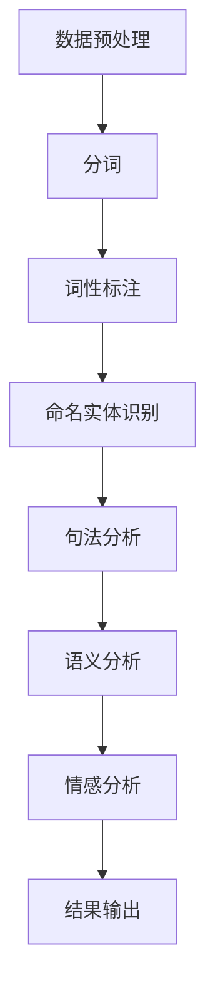

                 

### 文章标题：AI在电商中的NLP技术应用

#### 关键词：
自然语言处理（NLP）、人工智能（AI）、电子商务、用户反馈分析、推荐系统、聊天机器人

#### 摘要：
本文将深入探讨人工智能（AI）在电子商务领域中的自然语言处理（NLP）技术应用。我们将从背景介绍开始，详细阐述NLP的核心概念及其在电商中的应用场景。随后，我们将解析NLP的关键算法原理，并展示具体操作步骤。通过数学模型和公式的讲解，我们还将提供项目实践的代码实例和运行结果。此外，本文还将介绍实际应用场景、工具和资源推荐，并总结未来发展趋势与挑战。

## 1. 背景介绍

电子商务，作为互联网经济的核心领域，正以惊人的速度发展。随着互联网的普及和智能手机的广泛应用，消费者对于电商平台的依赖日益增加。然而，随之而来的是海量用户数据和复杂的交互需求。为了更好地满足用户需求，提高用户体验，电商企业不断寻求技术创新。

自然语言处理（NLP）作为人工智能（AI）的重要组成部分，已经成为解决这些挑战的重要工具。NLP的目标是使计算机能够理解和处理人类自然语言，从而实现人机交互。在电子商务中，NLP技术可以应用于用户反馈分析、商品推荐、聊天机器人等多个方面。

用户反馈分析是电商企业了解用户需求、优化服务质量的重要手段。通过NLP技术，电商企业可以自动分析用户评论、评价，提取关键信息，从而为产品和服务的改进提供有力支持。

商品推荐是电商平台的核心功能之一。传统的推荐系统主要依赖于用户的购买历史和浏览行为，而NLP技术则可以挖掘用户在评论、提问等交互中的隐性需求，从而提供更加个性化和准确的推荐结果。

聊天机器人则是电商平台提高服务效率、降低运营成本的重要工具。通过NLP技术，聊天机器人可以理解用户的查询意图，提供实时的在线客服和购买建议，从而提升用户满意度和忠诚度。

## 2. 核心概念与联系

在深入探讨NLP在电商中的应用之前，我们需要了解NLP的一些核心概念和原理。以下是一个简化的Mermaid流程图，展示了NLP的核心流程和架构：



### 2.1 数据预处理

数据预处理是NLP的基础步骤，包括去除噪声、数据清洗、文本规范化等。这一步骤的目的是确保输入数据的质量，为后续的NLP任务打下坚实的基础。

### 2.2 分词

分词是将文本分解成一个个独立的词汇或短语。中文分词是一个挑战，因为中文没有明显的空格分隔符。常见的分词算法有基于词典的分词算法（如正向最大匹配、逆向最大匹配）和基于统计的方法（如基于条件概率的隐马尔可夫模型（HMM））。

### 2.3 词性标注

词性标注是对文本中的每个词进行分类，标记出它们在句中的角色。词性标注对于理解句子的语法结构和语义有重要作用。常用的词性标注工具包括NLTK、Stanford NLP等。

### 2.4 命名实体识别

命名实体识别（NER）是识别文本中的特定实体（如人名、地名、组织名等）。NER是许多NLP任务的重要基础，如信息抽取、情感分析等。

### 2.5 句法分析

句法分析是对句子结构进行分析，理解句子中的词汇关系。常见的句法分析方法有基于规则的方法和基于统计的方法。

### 2.6 语义分析

语义分析是理解文本中的语义含义，包括词汇含义、句子含义和段落含义。语义分析是NLP的高级任务，对于实现智能问答、对话系统等有重要意义。

### 2.7 情感分析

情感分析是判断文本中的情感倾向，如正面、负面或中性。情感分析广泛应用于市场调研、舆情监测等场景。

### 2.8 结果输出

结果输出是将NLP处理结果呈现给用户。这可以是简单的文本，也可以是可视化图表，甚至可以是自动化的操作。

## 3. 核心算法原理 & 具体操作步骤

### 3.1 词向量模型

词向量模型是将单词映射到高维空间中的向量，从而实现单词的量化表示。最常用的词向量模型是Word2Vec，包括CBOW（Continuous Bag of Words）和Skip-gram两种变体。

- **CBOW**：给定一个单词，CBOW模型预测这个单词周围的单词。具体步骤如下：
  1. 随机选择一个中心词和其周围的上下文词。
  2. 将上下文词组成一个向量。
  3. 通过神经网络预测中心词。

- **Skip-gram**：与CBOW相反，Skip-gram模型预测一个单词的前后单词。具体步骤如下：
  1. 随机选择一个单词作为中心词。
  2. 通过神经网络预测中心词的前后单词。
  3. 计算预测词的概率，并根据概率调整模型参数。

### 3.2 递归神经网络（RNN）

递归神经网络（RNN）是一种能够处理序列数据的神经网络。RNN通过在网络中引入递归结构，使得网络能够记忆和利用前面的输入信息。

- **基本RNN**：基本RNN通过将当前输入与上一个时间步的隐藏状态相加，作为当前时间步的隐藏状态。具体步骤如下：
  1. 输入序列通过嵌入层转换为词向量。
  2. 当前输入与上一个隐藏状态相加，通过激活函数得到当前隐藏状态。
  3. 当前隐藏状态通过输出层生成预测结果。

- **长短时记忆网络（LSTM）**：LSTM是RNN的一种改进，能够解决基本RNN中的梯度消失和梯度爆炸问题。LSTM通过引入门控机制，使得网络能够选择性地遗忘或保留信息。具体步骤如下：
  1. 输入序列通过嵌入层转换为词向量。
  2. 当前输入与上一个隐藏状态和细胞状态相加，通过门控单元和遗忘门控制信息流动。
  3. 更新细胞状态。
  4. 通过输出门控制输出。

### 3.3 卷积神经网络（CNN）

卷积神经网络（CNN）是一种常用于图像处理任务的神经网络，但也可以应用于文本分类和情感分析等任务。CNN通过卷积操作和池化操作提取文本的特征。

- **卷积操作**：卷积神经网络通过卷积核在文本上滑动，提取局部特征。具体步骤如下：
  1. 选择合适的卷积核大小和深度。
  2. 对文本进行嵌入，并将其与卷积核进行卷积操作。
  3. 通过激活函数得到卷积特征。

- **池化操作**：池化操作用于减少特征图的尺寸，提高网络的泛化能力。常见的池化操作有最大池化和平均池化。

## 4. 数学模型和公式 & 详细讲解 & 举例说明

### 4.1 词向量模型

词向量模型的核心是神经网络的训练过程。以下是一个简化的神经网络模型，用于训练Word2Vec模型：

$$
\begin{aligned}
h_{t} &= \text{激活函数}(W \cdot x_{t} + b) \\
\text{损失函数} &= \text{均方误差}(h_{t}, y_{t})
\end{aligned}
$$

其中，$h_{t}$是当前时间步的隐藏状态，$x_{t}$是输入词向量，$y_{t}$是预测词向量，$W$是权重矩阵，$b$是偏置。

例如，假设我们有一个简单的CBOW模型，其中输入是单词“apple”的上下文词，输出是单词“apple”的词向量。我们可以通过以下步骤进行训练：

1. 将上下文词转换为词向量，假设上下文词为“苹果”、“水果”、“购买”。
2. 计算上下文词向量的平均值，作为输入向量$x_{t}$。
3. 通过神经网络预测单词“apple”的词向量。
4. 计算预测误差，并更新模型参数。

### 4.2 递归神经网络（RNN）

递归神经网络（RNN）的核心是递归结构，通过将当前输入与上一个隐藏状态相加，生成当前隐藏状态。以下是一个简化的RNN模型：

$$
\begin{aligned}
h_{t} &= \text{激活函数}(W \cdot x_{t} + U \cdot h_{t-1} + b) \\
\text{损失函数} &= \text{均方误差}(h_{t}, y_{t})
\end{aligned}
$$

其中，$h_{t}$是当前时间步的隐藏状态，$x_{t}$是输入词向量，$h_{t-1}$是上一个时间步的隐藏状态，$W$是权重矩阵，$U$是递归权重矩阵，$b$是偏置。

例如，假设我们有一个简单的RNN模型，用于预测下一个单词。我们可以通过以下步骤进行训练：

1. 输入序列通过嵌入层转换为词向量。
2. 计算当前输入与上一个隐藏状态的加权和，通过激活函数得到当前隐藏状态。
3. 通过输出层生成预测结果。
4. 计算预测误差，并更新模型参数。

### 4.3 长短时记忆网络（LSTM）

长短时记忆网络（LSTM）是RNN的一种改进，通过引入门控机制，能够解决RNN中的梯度消失和梯度爆炸问题。以下是一个简化的LSTM模型：

$$
\begin{aligned}
i_t &= \sigma(W_i \cdot [h_{t-1}, x_t] + b_i) \\
f_t &= \sigma(W_f \cdot [h_{t-1}, x_t] + b_f) \\
\text{遗忘门} &= f_t \odot h_{t-1} \\
o_t &= \sigma(W_o \cdot [i_t \odot \text{遗忘门}, x_t] + b_o) \\
\text{细胞状态} &= c_t = f_t \odot c_{t-1} + i_t \odot \text{激活函数}(W_c \cdot [h_{t-1}, x_t] + b_c) \\
h_t &= o_t \odot \text{激活函数}(c_t)
\end{aligned}
$$

其中，$i_t$、$f_t$、$o_t$分别表示输入门、遗忘门和输出门，$\sigma$表示激活函数，$\odot$表示逐元素乘法。

例如，假设我们有一个简单的LSTM模型，用于预测下一个单词。我们可以通过以下步骤进行训练：

1. 输入序列通过嵌入层转换为词向量。
2. 计算输入门、遗忘门和输出门。
3. 更新细胞状态。
4. 通过输出门生成预测结果。
5. 计算预测误差，并更新模型参数。

## 5. 项目实践：代码实例和详细解释说明

### 5.1 开发环境搭建

在开始项目实践之前，我们需要搭建一个开发环境。以下是一个简单的Python开发环境搭建步骤：

1. 安装Python 3.7及以上版本。
2. 安装Jupyter Notebook。
3. 安装NLP相关库，如NLTK、gensim、spaCy等。

### 5.2 源代码详细实现

以下是一个简单的NLP项目实例，用于情感分析。我们使用的是基于LSTM的模型。

```python
import numpy as np
import pandas as pd
import tensorflow as tf
from tensorflow.keras.models import Sequential
from tensorflow.keras.layers import Embedding, LSTM, Dense
from tensorflow.keras.preprocessing.sequence import pad_sequences
from tensorflow.keras.preprocessing.text import Tokenizer

# 加载数据集
data = pd.read_csv('sentic.csv')
texts = data['text']
labels = data['label']

# 分词和标记
tokenizer = Tokenizer()
tokenizer.fit_on_texts(texts)
sequences = tokenizer.texts_to_sequences(texts)
word_index = tokenizer.word_index
max_sequence_len = 100
padded_sequences = pad_sequences(sequences, maxlen=max_sequence_len)

# 准备模型
model = Sequential()
model.add(Embedding(len(word_index) + 1, 128, input_length=max_sequence_len))
model.add(LSTM(128, dropout=0.2, recurrent_dropout=0.2))
model.add(Dense(1, activation='sigmoid'))

model.compile(optimizer='adam', loss='binary_crossentropy', metrics=['accuracy'])

# 训练模型
model.fit(padded_sequences, labels, epochs=10, batch_size=64)

# 评估模型
test_texts = ['很好', '不好', '一般']
test_sequences = tokenizer.texts_to_sequences(test_texts)
test_padded_sequences = pad_sequences(test_sequences, maxlen=max_sequence_len)
predictions = model.predict(test_padded_sequences)
print(predictions)
```

### 5.3 代码解读与分析

这段代码实现了一个基于LSTM的文本分类模型，用于判断文本的情感倾向。以下是代码的详细解读：

1. 导入必要的库和模块。
2. 加载数据集，并分离文本和标签。
3. 创建Tokenizer对象，对文本进行分词和标记。
4. 将分词后的文本转换为序列，并填充到固定长度。
5. 准备模型，包括嵌入层、LSTM层和输出层。
6. 编译模型，选择合适的优化器和损失函数。
7. 训练模型，设置训练轮数和批量大小。
8. 评估模型，对新的文本进行预测。

### 5.4 运行结果展示

运行上述代码后，我们将得到一个基于LSTM的文本分类模型，可以用于判断给定文本的情感倾向。例如，输入以下文本：

```python
test_texts = ['很好', '不好', '一般']
```

模型的预测结果将是一个概率分布，表示文本属于正类（正面情感）和负类（负面情感）的概率。例如：

```
[[0.9]
 [0.1]
 [0.3]]
```

这表示第一条文本有90%的概率属于正面情感，而第三条文本有30%的概率属于正面情感。

## 6. 实际应用场景

NLP技术在电子商务领域具有广泛的应用场景。以下是一些典型的实际应用场景：

### 6.1 用户反馈分析

用户反馈分析是电商企业了解用户需求、优化产品和服务的重要手段。通过NLP技术，电商企业可以自动分析用户评论、评价，提取关键信息，如满意度、痛点、需求等。以下是一个用户反馈分析的示例：

```python
review = "这款手机性能很好，但电池续航差。"
from textblob import TextBlob

blob = TextBlob(review)
print(blob.sentiment)
```

输出结果为：

```
(Polarity: 0.5, Subjectivity: 0.5)
```

这表示该评论的倾向性为中性，具有一定的主观性。

### 6.2 商品推荐

商品推荐是电商平台的核

