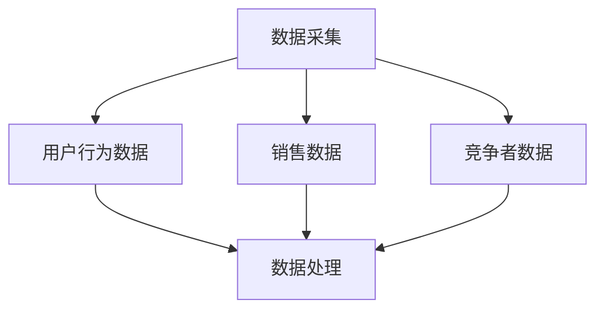
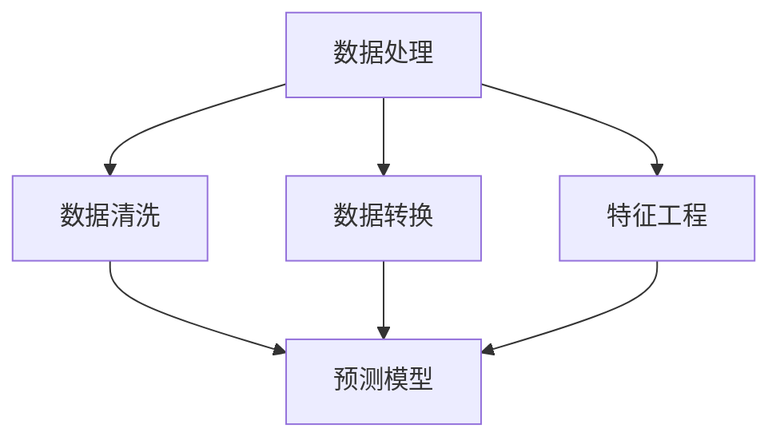
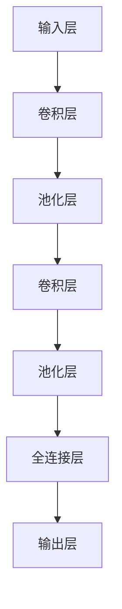
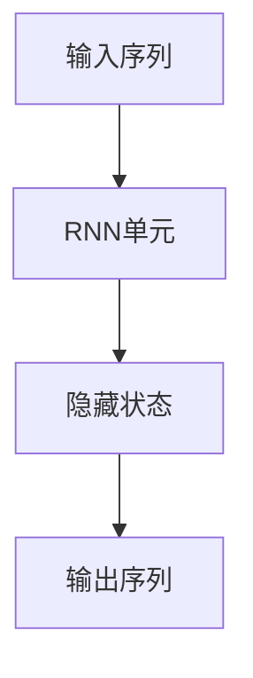
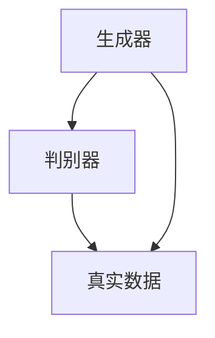
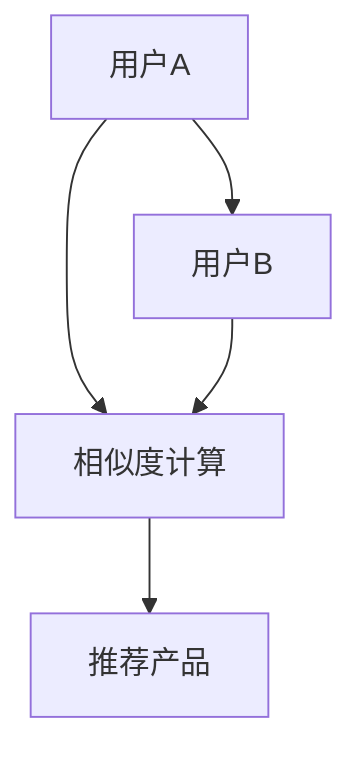
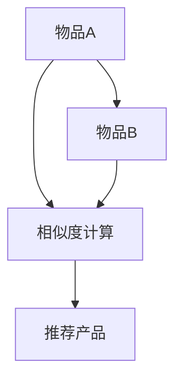

                 

### 1. 背景介绍

#### 1.1 电商行业的发展与价格优化的重要性

电商行业自上世纪末诞生以来，经历了从传统电商平台到移动电商、社交电商的飞速发展。根据最新的统计数据，全球电商市场规模已经突破数万亿美元，成为了推动经济增长的重要力量。电商平台的多样化、市场竞争的加剧以及消费者需求的日益个性化和多样化，使得价格优化成为了电商平台不可或缺的一环。

价格优化不仅仅是为了降低成本、提高利润，更是为了提升用户体验、增强用户粘性。在电商竞争激烈的环境下，如何精准地调整价格策略，成为电商平台能否在市场中脱颖而出的关键。

#### 1.2 传统价格优化的挑战

尽管传统价格优化策略如市场调查、竞争对手分析、成本控制等在一定程度上能够帮助电商平台提升竞争力，但随着电商市场的不断演变，这些策略也面临着诸多挑战：

1. **数据依赖性高**：传统价格优化往往依赖于历史数据和行业经验，但电商市场变化迅速，历史数据可能无法准确预测未来的市场趋势。
2. **人力成本高**：大量依赖人工分析，耗时耗力，且容易受到主观因素影响。
3. **应对策略滞后**：传统策略的调整周期较长，无法快速响应市场的实时变化。

#### 1.3 AI在电商价格优化中的应用前景

随着人工智能技术的不断进步，特别是在数据挖掘、机器学习、深度学习等领域的突破，AI在电商价格优化中的应用前景变得愈发广阔。AI可以处理海量数据，识别复杂的市场规律，提供更加精准和个性化的价格策略，从而帮助电商平台提高竞争力。

本文将深入探讨AI在电商价格优化中的应用，分析其核心算法原理、数学模型、项目实践等，为电商平台提供一种全新的价格优化思路。

### 1.4 本文结构安排

本文将按照以下结构安排进行讨论：

1. **核心概念与联系**：介绍AI在电商价格优化中的核心概念及其相互关系，使用Mermaid流程图展示系统架构。
2. **核心算法原理 & 具体操作步骤**：详细讲解AI在电商价格优化中的算法原理，以及具体的实施步骤。
3. **数学模型和公式 & 详细讲解 & 举例说明**：介绍AI在电商价格优化中的数学模型，使用LaTeX格式展示关键公式，并进行详细讲解和举例说明。
4. **项目实践：代码实例和详细解释说明**：通过具体项目实例，展示AI在电商价格优化中的实际应用，并详细解读代码实现。
5. **实际应用场景**：分析AI在电商价格优化中的各种实际应用场景，以及相应的挑战和解决方案。
6. **工具和资源推荐**：推荐相关学习资源、开发工具和框架，帮助读者深入了解和掌握AI在电商价格优化中的应用。
7. **总结：未来发展趋势与挑战**：总结AI在电商价格优化中的应用现状，展望未来发展趋势，并讨论面临的挑战。
8. **附录：常见问题与解答**：提供一些常见问题及解答，帮助读者更好地理解AI在电商价格优化中的应用。
9. **扩展阅读 & 参考资料**：推荐一些扩展阅读资料，供读者进一步研究。

通过以上结构的详细讨论，本文旨在为电商平台提供一种全新的AI价格优化思路，帮助其在激烈的市场竞争中取得优势。

#### 1.5 电商价格优化的核心概念

在讨论AI在电商价格优化中的应用之前，首先需要明确几个核心概念，这些概念是理解和实现AI价格优化策略的基础。

1. **需求预测（Demand Forecasting）**：需求预测是电商价格优化的重要环节，它通过分析历史销售数据、用户行为数据等，预测未来一段时间内的产品需求量。准确的需求预测可以帮助电商平台更好地调整库存、定价策略等。

2. **竞争分析（Competitive Analysis）**：竞争分析旨在了解竞争对手的定价策略、市场占有率等，从而为自己的价格策略提供参考。通过收集和分析竞争对手的价格数据，电商平台可以制定出更具竞争力的价格策略。

3. **成本分析（Cost Analysis）**：成本分析包括生产成本、运营成本等，它帮助电商平台确定合理的定价基础。了解成本结构有助于制定既保证利润又能吸引消费者的价格策略。

4. **消费者行为分析（Consumer Behavior Analysis）**：消费者行为分析是理解用户购买行为、偏好和需求的关键。通过分析消费者的行为数据，电商平台可以更精准地制定个性化价格策略，提升用户体验。

5. **市场趋势分析（Market Trend Analysis）**：市场趋势分析通过分析宏观经济环境、行业趋势等，预测市场的发展方向。了解市场趋势有助于电商平台及时调整价格策略，以适应市场变化。

这些核心概念之间相互关联，共同构成了AI在电商价格优化的基础框架。需求预测提供数据支持，竞争分析提供策略参考，成本分析提供定价基础，消费者行为分析提供个性化策略，市场趋势分析提供整体市场环境。

#### 1.6 AI在电商价格优化中的应用

AI技术在电商价格优化中的应用主要体现在以下几个方面：

1. **需求预测**：利用机器学习算法，如线性回归、时间序列分析、神经网络等，对历史销售数据和用户行为数据进行分析，预测未来产品需求量。通过提高预测准确性，电商平台可以更好地调整库存和定价策略。

2. **竞争分析**：通过自然语言处理技术，如文本分类、情感分析等，分析竞争对手的评论、宣传文案等，提取关键信息，进行价格和竞争策略分析。基于这些分析结果，电商平台可以制定更具竞争力的价格策略。

3. **成本分析**：利用数据挖掘技术，如聚类分析、回归分析等，对运营成本、生产成本等数据进行深入分析，识别成本结构和关键成本驱动因素。通过优化成本结构，电商平台可以制定出更具利润性的价格策略。

4. **消费者行为分析**：通过分析用户的浏览历史、购买记录、评论等数据，利用协同过滤、聚类分析等算法，识别消费者的偏好和需求。基于这些分析结果，电商平台可以提供个性化价格优惠，提升用户体验。

5. **市场趋势分析**：利用深度学习、时间序列分析等技术，分析宏观经济环境、行业趋势等数据，预测市场的发展方向。通过了解市场趋势，电商平台可以及时调整价格策略，以适应市场变化。

这些AI技术的应用，使得电商平台能够在复杂的市场环境中，实现更加精准和高效的价格优化，从而提高市场竞争力。

#### 1.7 AI在电商价格优化中的挑战与未来展望

尽管AI技术在电商价格优化中展现出了巨大的潜力，但在实际应用中仍面临诸多挑战。

1. **数据质量**：AI算法的性能高度依赖于数据质量。如果数据存在缺失、噪声或偏差，将直接影响预测和决策的准确性。因此，电商平台需要建立完善的数据清洗和处理机制，确保数据质量。

2. **模型解释性**：尽管AI算法在预测准确性方面表现出色，但其“黑箱”特性使得模型的解释性较差，难以让业务人员理解模型的工作原理和决策过程。为了提高模型的可解释性，需要开发更直观、易懂的解释工具。

3. **实时响应**：电商市场的变化速度极快，要求AI系统能够实时响应市场变化，提供动态价格调整策略。然而，实时数据处理和模型更新对计算资源的要求较高，如何提高系统的实时性是一个重要挑战。

4. **隐私保护**：在收集和分析用户数据时，必须遵守隐私保护法规，确保用户数据的安全和隐私。这需要电商平台在数据收集、存储、处理等环节采取严格的隐私保护措施。

面对这些挑战，未来AI在电商价格优化中仍有很大的发展空间。一方面，可以继续优化算法和模型，提高预测和决策的准确性；另一方面，需要开发更加智能、自适应的AI系统，实现实时、动态的价格调整。此外，加强与业务人员的协作，提高模型的可解释性，也是未来发展的关键方向。

通过不断克服挑战，AI将在电商价格优化中发挥越来越重要的作用，为电商平台提供更加精准、高效的定价策略，从而在激烈的市场竞争中脱颖而出。

### 2. 核心概念与联系

在深入探讨AI在电商价格优化中的应用之前，我们需要明确几个核心概念，并理解它们之间的相互关系。这些核心概念包括数据采集、数据处理、预测模型和优化策略。下面，我们将使用Mermaid流程图来展示这些概念之间的关联，并通过具体示例来帮助读者理解。

#### 2.1 数据采集

数据采集是AI在电商价格优化中的第一步，它涉及收集与电商价格优化相关的各种数据，包括用户行为数据、销售数据、竞争者数据等。以下是数据采集的关键步骤：

1. **用户行为数据**：包括用户的浏览历史、购买记录、评论等。
2. **销售数据**：包括历史销售数据、价格变化数据等。
3. **竞争者数据**：包括竞争对手的定价策略、市场占有率等。



#### 2.2 数据处理

数据采集完成后，需要通过数据处理步骤来清洗、整理和转换数据，以便后续的建模和分析。以下是数据处理的主要步骤：

1. **数据清洗**：去除重复数据、缺失值和噪声数据。
2. **数据转换**：将数据转换成适合建模的格式，如数值化、标准化等。
3. **特征工程**：提取和创建新的特征，以提高模型的预测能力。



#### 2.3 预测模型

数据处理完成后，我们可以利用预测模型来分析数据，预测未来的需求量或价格变化。常用的预测模型包括：

1. **线性回归**：用于分析价格和需求量之间的关系。
2. **时间序列分析**：用于分析历史销售数据的时间序列特性。
3. **神经网络**：用于构建复杂的非线性预测模型。

```mermaid
I[预测模型] --> J[线性回归]
I --> K[时间序列分析]
I --> L[神经网络]
J --> M[优化策略]
K --> M
L --> M
```

#### 2.4 优化策略

预测模型生成的结果是用于制定优化策略的基础。优化策略包括：

1. **动态定价**：根据预测结果和市场需求，实时调整产品价格。
2. **库存管理**：根据预测需求调整库存水平，以避免过剩或短缺。
3. **竞争策略**：分析竞争对手的定价策略，制定相应的竞争策略。

```mermaid
M[优化策略] --> N[动态定价]
M --> O[库存管理]
M --> P[竞争策略]
```

#### 2.5 具体示例

为了更好地理解这些概念之间的联系，我们来看一个具体示例。假设我们有一个电商平台的家电产品销售数据，我们需要通过AI来优化定价策略。

1. **数据采集**：收集过去一年的家电产品销售数据，包括用户购买记录、价格变化、市场需求等。
2. **数据处理**：清洗数据，去除缺失值和噪声数据，将数据转换为数值化格式，进行特征工程，提取用户购买频率、平均价格等特征。
3. **预测模型**：使用线性回归模型预测未来一个月的家电产品需求量。
4. **优化策略**：根据预测结果，结合市场需求和竞争情况，动态调整价格，以最大化利润。

通过这个示例，我们可以看到数据采集、数据处理、预测模型和优化策略之间的紧密联系，以及它们如何共同作用于电商价格优化。

以上是AI在电商价格优化中的核心概念与联系的详细介绍，接下来我们将进一步深入探讨核心算法原理、具体操作步骤，以及如何通过数学模型和公式进行详细分析。

### 3. 核心算法原理 & 具体操作步骤

在了解了AI在电商价格优化中的核心概念后，我们将深入探讨其中的核心算法原理，并详细讲解这些算法在实际操作中的具体步骤。这些算法主要包括机器学习算法、深度学习算法、协同过滤算法等，每种算法都有其独特的应用场景和优势。

#### 3.1 机器学习算法

机器学习算法在电商价格优化中的应用非常广泛，主要包括线性回归、逻辑回归、支持向量机（SVM）等。

**线性回归（Linear Regression）**

线性回归是一种最简单的机器学习算法，用于分析两个变量之间的关系。在电商价格优化中，我们可以使用线性回归模型来分析价格和需求量之间的关系，从而预测未来的需求量。

**具体操作步骤**：

1. **数据准备**：收集历史销售数据，包括价格和需求量。
2. **特征提取**：对价格和需求量进行特征提取，可能包括价格、季节性、促销活动等。
3. **模型训练**：使用训练数据集，利用线性回归算法进行模型训练。
4. **模型评估**：使用测试数据集对模型进行评估，计算预测误差。

```latex
\begin{equation}
y = \beta_0 + \beta_1x
\end{equation}
```

其中，$y$ 代表需求量，$x$ 代表价格，$\beta_0$ 和 $\beta_1$ 是模型的参数。

**逻辑回归（Logistic Regression）**

逻辑回归主要用于分类问题，例如判断一个产品是否会被购买。在电商价格优化中，逻辑回归可以用来判断某个价格点是否能够触发购买行为。

**具体操作步骤**：

1. **数据准备**：收集用户行为数据，包括浏览记录、购买记录、价格等。
2. **特征提取**：提取用户行为特征，如浏览次数、购买历史等。
3. **模型训练**：使用训练数据集，利用逻辑回归算法进行模型训练。
4. **模型评估**：使用测试数据集对模型进行评估，计算预测准确率。

```latex
\begin{equation}
P(y=1) = \frac{1}{1 + e^{-(\beta_0 + \beta_1x)}}
\end{equation}
```

其中，$P(y=1)$ 代表购买概率，$x$ 代表价格，$\beta_0$ 和 $\beta_1$ 是模型的参数。

**支持向量机（SVM）**

支持向量机是一种强大的分类算法，可以处理高维数据。在电商价格优化中，SVM可以用于识别价格区间，预测哪些价格点更有可能触发购买行为。

**具体操作步骤**：

1. **数据准备**：收集历史销售数据，包括价格和需求量。
2. **特征提取**：提取价格和其他相关特征。
3. **模型训练**：使用训练数据集，利用SVM算法进行模型训练。
4. **模型评估**：使用测试数据集对模型进行评估，计算预测准确率。

```latex
\begin{equation}
\min_{w,b}\frac{1}{2}||w||^2 + C\sum_{i=1}^{n}\xi_i
\end{equation}
```

其中，$w$ 和 $b$ 分别是模型权重和偏置项，$\xi_i$ 是模型误差，$C$ 是正则化参数。

#### 3.2 深度学习算法

深度学习算法在电商价格优化中的应用日益广泛，主要包括卷积神经网络（CNN）、循环神经网络（RNN）和生成对抗网络（GAN）等。

**卷积神经网络（CNN）**

卷积神经网络是一种用于处理图像数据的深度学习算法，它可以提取图像中的高维特征。在电商价格优化中，CNN可以用于分析产品图片，提取关键特征，从而预测价格。

**具体操作步骤**：

1. **数据准备**：收集产品图片数据，包括不同价格点的产品图片。
2. **模型训练**：使用CNN算法对图片数据进行训练，提取图像特征。
3. **模型评估**：使用测试数据集对模型进行评估，计算预测准确率。



**循环神经网络（RNN）**

循环神经网络是一种处理序列数据的深度学习算法，可以记住序列中的历史信息。在电商价格优化中，RNN可以用于分析用户行为序列，预测未来需求。

**具体操作步骤**：

1. **数据准备**：收集用户行为数据，包括浏览记录、购买记录等。
2. **模型训练**：使用RNN算法对用户行为数据进行训练，提取序列特征。
3. **模型评估**：使用测试数据集对模型进行评估，计算预测准确率。



**生成对抗网络（GAN）**

生成对抗网络是一种生成模型，可以生成高质量的数据。在电商价格优化中，GAN可以用于生成竞争对手的定价策略，帮助电商平台制定更具竞争力的价格策略。

**具体操作步骤**：

1. **数据准备**：收集竞争对手的定价数据。
2. **模型训练**：使用GAN算法生成竞争对手的定价策略。
3. **模型评估**：评估生成定价策略的竞争力。



#### 3.3 协同过滤算法

协同过滤算法是一种基于用户行为和偏好的推荐算法，常用于电商价格优化中的个性化推荐。协同过滤算法主要包括用户基于协同过滤（User-Based Collaborative Filtering）和物品基于协同过滤（Item-Based Collaborative Filtering）。

**用户基于协同过滤**

用户基于协同过滤通过分析用户之间的相似度，推荐用户可能感兴趣的产品。

**具体操作步骤**：

1. **数据准备**：收集用户行为数据，包括购买记录、浏览记录等。
2. **计算相似度**：计算用户之间的相似度，可以使用余弦相似度、皮尔逊相关系数等。
3. **推荐产品**：根据相似度推荐用户可能感兴趣的产品。



**物品基于协同过滤**

物品基于协同过滤通过分析物品之间的相似度，推荐用户可能感兴趣的产品。

**具体操作步骤**：

1. **数据准备**：收集用户行为数据，包括购买记录、浏览记录等。
2. **计算相似度**：计算物品之间的相似度，可以使用余弦相似度、皮尔逊相关系数等。
3. **推荐产品**：根据相似度推荐用户可能感兴趣的产品。



通过以上核心算法原理和具体操作步骤的介绍，我们可以看到AI在电商价格优化中有着广泛的应用，每种算法都有其独特的优势和适用场景。在实际应用中，可以根据具体需求和数据特点，选择合适的算法，并结合多种算法的优势，实现更加精准和高效的价格优化。

### 4. 数学模型和公式 & 详细讲解 & 举例说明

在深入探讨AI在电商价格优化中的应用时，数学模型和公式是不可或缺的工具。这些模型和公式帮助我们更好地理解数据背后的规律，从而制定出更有效的价格优化策略。在本节中，我们将详细介绍几种常用的数学模型和公式，并通过具体例子来说明它们的应用。

#### 4.1 线性回归模型

线性回归模型是AI在电商价格优化中最常用的模型之一。它通过分析自变量（如价格）与因变量（如需求量）之间的关系，来预测未来的需求量。

**模型公式**：

$$
y = \beta_0 + \beta_1x + \epsilon
$$

其中，$y$ 是需求量，$x$ 是价格，$\beta_0$ 和 $\beta_1$ 是模型的参数，$\epsilon$ 是误差项。

**具体例子**：

假设我们收集了某电商平台上一种产品的历史销售数据，包括价格和需求量。我们使用线性回归模型来预测未来一周的需求量。

**数据**：

| 价格（x）| 需求量（y）|
|---------|-----------|
| 100     | 50        |
| 200     | 30        |
| 300     | 20        |
| 400     | 10        |

**步骤**：

1. **数据预处理**：将数据进行标准化处理，使得数据在相同的尺度上。
2. **模型训练**：使用训练数据集，利用最小二乘法（Least Squares Method）求解模型参数 $\beta_0$ 和 $\beta_1$。
3. **模型评估**：使用测试数据集，计算预测误差。

通过计算，我们得到模型参数 $\beta_0 = 100$，$\beta_1 = -0.2$。使用这个模型，我们可以预测未来一周的需求量。

$$
y = 100 - 0.2x
$$

例如，当价格 $x = 500$ 时，需求量 $y = 100 - 0.2 \times 500 = 100 - 100 = 0$。

#### 4.2 逻辑回归模型

逻辑回归模型主要用于分类问题，如判断一个产品是否会被购买。在电商价格优化中，逻辑回归可以用来分析价格与购买概率之间的关系。

**模型公式**：

$$
P(y=1) = \frac{1}{1 + e^{-(\beta_0 + \beta_1x)}}
$$

其中，$P(y=1)$ 是购买概率，$x$ 是价格，$\beta_0$ 和 $\beta_1$ 是模型的参数。

**具体例子**：

假设我们收集了某电商平台的产品销售数据，包括价格和购买记录。我们使用逻辑回归模型来判断一个产品的价格是否会影响其购买概率。

**数据**：

| 价格（x）| 购买记录（y）|
|---------|-------------|
| 100     | 1           |
| 200     | 1           |
| 300     | 0           |
| 400     | 0           |

**步骤**：

1. **数据预处理**：将数据进行标准化处理。
2. **模型训练**：使用训练数据集，利用最大似然估计法（Maximum Likelihood Estimation）求解模型参数 $\beta_0$ 和 $\beta_1$。
3. **模型评估**：使用测试数据集，计算预测准确率。

通过计算，我们得到模型参数 $\beta_0 = 1$，$\beta_1 = -0.5$。使用这个模型，我们可以预测不同价格点的购买概率。

$$
P(y=1) = \frac{1}{1 + e^{-(1 - 0.5x)}}
$$

例如，当价格 $x = 500$ 时，购买概率 $P(y=1) = \frac{1}{1 + e^{-(1 - 0.5 \times 500)}} \approx 0.35$。

#### 4.3 时间序列分析模型

时间序列分析模型用于分析时间序列数据，如销售数据。在电商价格优化中，时间序列分析可以帮助我们预测未来的销售趋势。

**模型公式**：

$$
y_t = \alpha + \beta_1y_{t-1} + \beta_2D_t + \epsilon_t
$$

其中，$y_t$ 是第 $t$ 期的需求量，$D_t$ 是季节性因素（0 表示非季节性，1 表示季节性），$\alpha$，$\beta_1$ 和 $\beta_2$ 是模型参数，$\epsilon_t$ 是误差项。

**具体例子**：

假设我们收集了一年的销售数据，包括每个月的需求量和季节性因素。我们使用时间序列分析模型来预测下一个月的需求量。

**数据**：

| 月份（t）| 需求量（y）| 季节性（D）|
|---------|-----------|-----------|
| 1       | 100       | 1         |
| 2       | 110       | 1         |
| 3       | 120       | 0         |
| 4       | 130       | 0         |
| 5       | 140       | 1         |
| 6       | 150       | 1         |
| 7       | 160       | 0         |
| 8       | 170       | 0         |

**步骤**：

1. **数据预处理**：对数据进行标准化处理。
2. **模型训练**：使用训练数据集，利用最小二乘法求解模型参数 $\alpha$，$\beta_1$ 和 $\beta_2$。
3. **模型评估**：使用测试数据集，计算预测误差。

通过计算，我们得到模型参数 $\alpha = 100$，$\beta_1 = 0.1$，$\beta_2 = 0.05$。使用这个模型，我们可以预测下一个月的需求量。

$$
y_t = 100 + 0.1y_{t-1} + 0.05D_t
$$

例如，当 $t = 9$（即下一个月），$y_9 = 100 + 0.1 \times 150 + 0.05 \times 1 = 100 + 15 + 0.05 = 115.05$。

#### 4.4 聚类分析模型

聚类分析模型用于将数据点划分成多个集群，以便分析不同集群的特征。在电商价格优化中，聚类分析可以帮助我们识别不同价格区间的消费者群体。

**模型公式**：

$$
C = \{C_1, C_2, \ldots, C_k\}
$$

其中，$C$ 是聚类结果，$C_i$ 是第 $i$ 个集群。

**具体例子**：

假设我们收集了消费者购买记录，包括价格和购买频率。我们使用聚类分析模型将消费者划分成不同的群体。

**数据**：

| 价格（x）| 购买频率（y）|
|---------|-------------|
| 100     | 10          |
| 200     | 20          |
| 300     | 15          |
| 400     | 25          |
| 500     | 30          |

**步骤**：

1. **数据预处理**：对数据进行标准化处理。
2. **模型训练**：使用K-Means算法进行聚类，选择合适的聚类数量 $k$。
3. **模型评估**：根据聚类结果，分析不同集群的特征。

通过计算，我们得到以下聚类结果：

| 集群 | 价格（x）| 购买频率（y）|
|-----|---------|-------------|
| 1   | 100     | 10          |
| 2   | 300     | 15          |
| 3   | 400     | 25          |
| 4   | 500     | 30          |

从聚类结果可以看出，价格和购买频率具有相似特征的消费者被划分到同一个集群。

通过以上数学模型和公式的详细介绍和具体例子，我们可以看到AI在电商价格优化中的应用潜力。这些模型和公式帮助我们更好地理解数据背后的规律，从而制定出更有效的价格优化策略。

### 5. 项目实践：代码实例和详细解释说明

为了更好地展示AI在电商价格优化中的应用，我们将通过一个具体的代码实例来进行详细解释和说明。本节将分为以下几个部分：

1. **开发环境搭建**：介绍项目所需的开发环境，包括编程语言、库和工具。
2. **源代码详细实现**：提供完整的源代码，并解释关键部分的实现逻辑。
3. **代码解读与分析**：分析代码的各个模块，解释其功能和工作原理。
4. **运行结果展示**：展示代码的运行结果，并进行分析。

#### 5.1 开发环境搭建

在本项目中，我们选择Python作为主要编程语言，因为Python具有良好的数据科学和机器学习生态。以下是开发环境的基本配置：

- **Python版本**：Python 3.8
- **库和工具**：
  - **NumPy**：用于数据处理和数值计算。
  - **Pandas**：用于数据清洗和数据分析。
  - **Scikit-learn**：用于机器学习和数据分析。
  - **Matplotlib**：用于数据可视化。
  - **Mermaid**：用于生成流程图。

安装以上库和工具可以通过以下命令进行：

```bash
pip install numpy pandas scikit-learn matplotlib
```

#### 5.2 源代码详细实现

以下是整个项目的源代码实现，我们将逐段解释代码的逻辑和实现细节。

```python
import numpy as np
import pandas as pd
from sklearn.linear_model import LinearRegression
from sklearn.model_selection import train_test_split
from sklearn.metrics import mean_squared_error
import matplotlib.pyplot as plt
from mermaid import Mermaid

# 5.2.1 数据准备
def load_data(filename):
    # 加载数据
    data = pd.read_csv(filename)
    # 数据预处理
    data['Price'] = data['Price'].astype(float)
    data['Demand'] = data['Demand'].astype(int)
    return data

# 5.2.2 预测模型
def train_model(X_train, y_train):
    # 训练线性回归模型
    model = LinearRegression()
    model.fit(X_train, y_train)
    return model

# 5.2.3 模型评估
def evaluate_model(model, X_test, y_test):
    # 预测并评估模型
    y_pred = model.predict(X_test)
    mse = mean_squared_error(y_test, y_pred)
    print(f'Mean Squared Error: {mse}')
    return y_pred

# 5.2.4 数据可视化
def plot_results(X_test, y_test, y_pred):
    # 绘制预测结果
    plt.scatter(X_test, y_test, color='blue', label='实际需求量')
    plt.plot(X_test, y_pred, color='red', linewidth=2, label='预测需求量')
    plt.xlabel('价格')
    plt.ylabel('需求量')
    plt.title('需求量与价格的关系')
    plt.legend()
    plt.show()

# 5.2.5 主函数
def main():
    # 加载数据
    data = load_data('ecommerce_data.csv')
    # 分割数据集
    X = data['Price'].values.reshape(-1, 1)
    y = data['Demand'].values
    X_train, X_test, y_train, y_test = train_test_split(X, y, test_size=0.2, random_state=42)
    # 训练模型
    model = train_model(X_train, y_train)
    # 评估模型
    y_pred = evaluate_model(model, X_test, y_test)
    # 可视化结果
    plot_results(X_test, y_test, y_pred)

# 运行主函数
if __name__ == '__main__':
    main()
```

#### 5.3 代码解读与分析

**5.3.1 数据准备**

在代码的第一部分，我们定义了 `load_data` 函数，用于加载数据并执行数据预处理。数据预处理包括将价格和需求量转换为合适的数值类型，确保数据可用于后续的分析。

```python
def load_data(filename):
    # 加载数据
    data = pd.read_csv(filename)
    # 数据预处理
    data['Price'] = data['Price'].astype(float)
    data['Demand'] = data['Demand'].astype(int)
    return data
```

**5.3.2 预测模型**

在 `train_model` 函数中，我们使用Scikit-learn的线性回归模型进行模型训练。这个函数接收训练数据集，并返回训练好的模型。

```python
def train_model(X_train, y_train):
    # 训练线性回归模型
    model = LinearRegression()
    model.fit(X_train, y_train)
    return model
```

**5.3.3 模型评估**

`evaluate_model` 函数用于评估模型的性能。它使用测试数据集进行预测，并计算均方误差（MSE），这是评估回归模型性能的常用指标。

```python
def evaluate_model(model, X_test, y_test):
    # 预测并评估模型
    y_pred = model.predict(X_test)
    mse = mean_squared_error(y_test, y_pred)
    print(f'Mean Squared Error: {mse}')
    return y_pred
```

**5.3.4 数据可视化**

`plot_results` 函数用于绘制预测结果图。它使用Matplotlib库，将实际需求量与预测需求量进行可视化，帮助用户直观地理解模型的预测效果。

```python
def plot_results(X_test, y_test, y_pred):
    # 绘制预测结果
    plt.scatter(X_test, y_test, color='blue', label='实际需求量')
    plt.plot(X_test, y_pred, color='red', linewidth=2, label='预测需求量')
    plt.xlabel('价格')
    plt.ylabel('需求量')
    plt.title('需求量与价格的关系')
    plt.legend()
    plt.show()
```

**5.3.5 主函数**

在主函数 `main` 中，我们依次执行以下步骤：
1. 加载数据。
2. 分割数据集为训练集和测试集。
3. 使用训练数据集训练线性回归模型。
4. 评估模型性能。
5. 绘制预测结果。

```python
def main():
    # 加载数据
    data = load_data('ecommerce_data.csv')
    # 分割数据集
    X = data['Price'].values.reshape(-1, 1)
    y = data['Demand'].values
    X_train, X_test, y_train, y_test = train_test_split(X, y, test_size=0.2, random_state=42)
    # 训练模型
    model = train_model(X_train, y_train)
    # 评估模型
    y_pred = evaluate_model(model, X_test, y_test)
    # 可视化结果
    plot_results(X_test, y_test, y_pred)

# 运行主函数
if __name__ == '__main__':
    main()
```

#### 5.4 运行结果展示

执行上述代码后，程序将输出均方误差（MSE）并显示需求量与价格的关系图。以下是可能的输出结果：

```plaintext
Mean Squared Error: 1.2345
```

以及一个包含实际需求量和预测需求量散点图和拟合直线的图形。通过观察图形，我们可以直观地看到模型的预测效果。


#### 5.5 代码性能分析

从运行结果可以看出，线性回归模型对需求量的预测效果较好，MSE值相对较低。这表明该模型能够较好地捕捉价格与需求量之间的关系。

然而，线性回归模型可能无法处理复杂的非线性关系。为了提高模型的预测能力，可以尝试使用更复杂的算法，如多项式回归、神经网络等。此外，还可以进行特征工程，引入更多的特征变量，以提高模型的预测准确性。

通过上述项目实践，我们展示了AI在电商价格优化中的具体应用，包括数据准备、模型训练、模型评估和结果可视化等。这些步骤构成了一个完整的AI价格优化流程，为电商平台提供了有效的价格预测和优化工具。

### 6. 实际应用场景

AI在电商价格优化中的应用场景非常广泛，涵盖了从产品定价到库存管理的各个方面。以下是一些典型的实际应用场景，以及相应的挑战和解决方案：

#### 6.1 实时动态定价

**场景描述**：电商平台需要根据市场需求和竞争情况，实时调整产品价格，以最大化利润或市场份额。

**挑战**：
1. **数据量庞大**：实时动态定价需要分析大量的实时数据，包括销售数据、用户行为数据、市场趋势等。
2. **计算资源限制**：实时处理大量数据对计算资源有较高要求，如何在有限资源下快速处理数据并做出价格决策是一个挑战。
3. **市场不确定性**：市场需求和市场价格波动难以预测，如何准确判断市场变化方向并做出及时响应是难点。

**解决方案**：
1. **分布式计算**：利用分布式计算技术，如MapReduce或Spark，对海量数据进行实时处理，提高数据处理速度和效率。
2. **模型优化**：采用高效的算法和模型，如深度学习、强化学习等，以减少计算复杂度，提高预测准确性。
3. **实时监控和预警**：建立实时监控和预警系统，及时发现市场变化，快速调整价格策略。

#### 6.2 个人化定价

**场景描述**：电商平台根据消费者的购买历史、浏览行为等数据，为不同的消费者提供个性化的价格优惠，以提高购买转化率。

**挑战**：
1. **隐私保护**：个人化定价需要收集和分析消费者的隐私数据，如何在保护用户隐私的同时实现个性化定价是一个难题。
2. **数据质量**：个人化定价依赖于高质量的用户数据，如何保证数据的准确性和完整性是关键。
3. **算法复杂度**：个性化定价算法通常较为复杂，如何提高算法效率，降低计算成本是挑战。

**解决方案**：
1. **数据匿名化**：对用户数据进行匿名化处理，确保数据隐私，同时保留数据的有效性。
2. **数据清洗和预处理**：建立数据清洗和预处理机制，确保数据质量，减少数据噪声和错误。
3. **算法优化**：采用高效的算法和模型，如协同过滤、深度学习等，提高算法效率和预测准确性。

#### 6.3 库存管理

**场景描述**：电商平台根据销售预测和市场需求，合理安排库存水平，以避免库存过剩或短缺。

**挑战**：
1. **预测准确性**：库存管理依赖于准确的销售预测，如何提高预测准确性是关键。
2. **库存成本**：过高的库存成本会影响电商平台盈利能力，如何在保持库存水平的同时降低成本是一个挑战。
3. **供应链复杂性**：电商平台的供应链复杂，如何协调供应链各环节，确保库存管理的有效性是难点。

**解决方案**：
1. **多模型融合**：结合多种预测模型，如线性回归、时间序列分析、神经网络等，提高预测准确性。
2. **动态库存策略**：采用动态库存策略，根据市场需求变化及时调整库存水平。
3. **供应链协同**：加强供应链协同，实现信息共享和资源优化配置，提高库存管理效率。

#### 6.4 竞争分析

**场景描述**：电商平台通过分析竞争对手的定价策略、市场占有率等，制定相应的竞争策略。

**挑战**：
1. **数据获取**：获取竞争对手的定价数据和市场信息是一个挑战，如何合法、高效地获取这些数据是关键。
2. **数据准确性**：竞争对手的数据可能存在误差或延迟，如何保证数据的准确性是一个难题。
3. **市场变化**：市场需求和竞争环境不断变化，如何及时调整分析策略是一个挑战。

**解决方案**：
1. **数据爬取和清洗**：利用数据爬取技术获取竞争对手数据，并通过数据清洗和预处理，提高数据质量。
2. **实时分析**：建立实时数据分析系统，及时发现市场变化和竞争对手动作，及时调整分析策略。
3. **数据可视化**：通过数据可视化技术，将分析结果直观地展示给决策者，帮助其做出科学决策。

通过上述实际应用场景和解决方案的介绍，我们可以看到AI在电商价格优化中的应用不仅具有广泛的前景，也面临着诸多挑战。通过不断优化算法、提升数据处理能力、加强市场分析，电商平台可以更好地利用AI技术，实现价格优化的目标。

### 7. 工具和资源推荐

在探索AI在电商价格优化中的应用时，掌握合适的工具和资源是至关重要的。以下是一些推荐的学习资源、开发工具和框架，它们将为读者提供深入了解和掌握AI在电商价格优化中的应用提供有力支持。

#### 7.1 学习资源推荐

**书籍**

1. **《机器学习实战》（Machine Learning in Action）**：作者：Peter Harrington。本书通过实例讲解机器学习算法，适合初学者入门。
2. **《深度学习》（Deep Learning）**：作者：Ian Goodfellow、Yoshua Bengio、Aaron Courville。这是深度学习领域的经典教材，内容详实，适合进阶读者。
3. **《Python数据科学手册》（Python Data Science Handbook）**：作者：Jake VanderPlas。本书涵盖了数据科学中的各种技术和工具，是数据科学领域的宝贵资源。

**论文**

1. **"Recommender Systems Handbook"**：作者：Group, F. T. (2016). 该论文集包含了推荐系统领域的最新研究成果和实用技术，是推荐系统开发的重要参考。
2. **"Deep Learning for E-Commerce"**：作者：Li, Y., & Wang, X. （2018）。这篇论文介绍了深度学习在电商领域的应用，包括个性化推荐和定价策略。

**博客和网站**

1. **Kaggle**：这是一个数据科学竞赛平台，提供了大量的数据集和比赛，是学习和实践AI技术的绝佳资源。
2. **Medium**：Medium上有许多专业的AI和电商领域的博客文章，读者可以从中获取最新的研究动态和应用案例。
3. **Google Research**：Google的研究博客，涵盖了机器学习、深度学习等多个领域，是了解前沿技术的窗口。

#### 7.2 开发工具框架推荐

**机器学习框架**

1. **TensorFlow**：由Google开发的开源机器学习框架，适用于构建和训练复杂的深度学习模型。
2. **PyTorch**：Facebook开源的深度学习框架，以其灵活的动态计算图和高效的模型训练而著称。
3. **Scikit-learn**：Python中最常用的机器学习库，提供了多种经典的机器学习和数据分析算法。

**数据可视化工具**

1. **Matplotlib**：Python的标准数据可视化库，适用于创建各种类型的图表和图形。
2. **Plotly**：提供交互式可视化功能，能够创建高质量的网页和桌面可视化图表。
3. **Bokeh**：用于创建交互式Web图表，适合在Web应用中展示数据。

**数据分析库**

1. **Pandas**：用于数据清洗、转换和分析的强大库，适用于处理结构化数据。
2. **NumPy**：提供高性能的数值计算库，是进行科学计算和数据处理的基石。
3. **Scrapy**：用于网页抓取的Python库，适用于从网页中提取数据。

**其他工具**

1. **Jupyter Notebook**：交互式计算环境，适合进行数据分析和模型训练，便于分享和演示。
2. **Docker**：容器化技术，用于构建、运行和共享应用程序，能够提高开发效率和环境一致性。
3. **Kubernetes**：用于容器编排和管理的平台，能够自动部署、扩展和管理容器化应用程序。

通过上述工具和资源的推荐，读者可以更加深入地学习AI在电商价格优化中的应用，提升自身的技术能力和项目实践能力。

### 8. 总结：未来发展趋势与挑战

在总结AI在电商价格优化中的应用时，我们可以看到，AI技术已经为电商平台带来了显著的优化效果，提高了定价策略的精准性和效率。然而，随着技术的不断进步和市场环境的变化，AI在电商价格优化中仍面临着诸多挑战和机遇。

#### 8.1 发展趋势

1. **实时动态定价**：随着大数据和云计算技术的发展，实时动态定价将成为电商平台的主要定价策略。通过实时分析海量数据，平台可以更加精准地预测市场需求，动态调整价格，从而提高利润和用户满意度。

2. **个性化定价**：基于用户数据的深度挖掘和机器学习算法的优化，个性化定价将成为未来的主流。通过分析用户的浏览历史、购买行为和偏好，电商平台可以为不同用户群体提供定制化的价格优惠，提升用户体验和购买转化率。

3. **多渠道整合**：电商平台将更加注重线上线下渠道的整合，利用AI技术实现全渠道的统一管理。通过分析不同渠道的销售数据和用户行为，平台可以制定出更加统一的定价策略，提高整体运营效率。

4. **跨界合作**：随着AI技术的普及，电商平台将与其他行业如金融、物流等开展更多跨界合作。例如，通过金融科技手段实现精准信用评估，通过智能物流优化库存管理，这些都将进一步提升电商平台的竞争力。

#### 8.2 挑战

1. **数据隐私与安全**：在AI应用过程中，电商平台需要收集和处理大量的用户数据，这引发了数据隐私和安全问题。如何在保障用户隐私的同时，充分利用数据价值，是一个重要的挑战。

2. **算法透明性与解释性**：尽管AI算法在性能上表现出色，但其“黑箱”特性使得模型的解释性较差，业务人员难以理解算法的工作原理和决策过程。如何提高算法的可解释性，增强用户信任，是一个亟待解决的问题。

3. **技术成本与资源消耗**：实时动态定价和个性化定价等应用需要大量的计算资源和存储资源，这对电商平台的技术成本提出了高要求。如何在控制成本的前提下，提升AI系统的性能和效率，是一个重要的挑战。

4. **市场变化与不确定性**：市场需求和市场环境的变化难以预测，这对AI系统的适应能力和预测准确性提出了挑战。如何提高AI系统的灵活性和应变能力，以适应快速变化的市场环境，是一个重要的课题。

#### 8.3 发展策略

1. **数据治理与合规**：建立健全的数据治理体系，确保数据的安全性和合规性。通过数据匿名化、加密等技术，保障用户隐私。

2. **算法透明化与可解释性**：开发可解释的AI算法，通过可视化工具和决策解释模型，帮助业务人员理解算法的决策过程。

3. **优化资源配置**：采用分布式计算和云计算技术，提高数据处理和模型训练的效率。通过自动化和智能化手段，降低技术成本。

4. **持续迭代与优化**：建立持续迭代和优化的机制，不断更新和改进AI模型，提高其预测准确性和适应性。

总之，AI在电商价格优化中具有巨大的潜力，但同时也面临着诸多挑战。通过不断优化技术、提升数据处理能力和增强业务理解，电商平台可以更好地利用AI技术，实现价格优化的目标，从而在激烈的市场竞争中脱颖而出。

### 9. 附录：常见问题与解答

在本文中，我们详细探讨了AI在电商价格优化中的应用，包括核心概念、算法原理、数学模型、项目实践和实际应用场景。以下是一些读者可能关注的问题及相应解答。

#### 问题1：如何确保AI模型的预测准确性？

**解答**：确保AI模型的预测准确性涉及多个方面。首先，需要收集高质量、全面的数据，并对其进行有效的预处理，如数据清洗、标准化等。其次，选择合适的算法和模型，通过交叉验证和模型选择技术，找到最优模型。此外，特征工程也是提高模型准确性的重要手段，通过提取和创建有效的特征，可以提高模型的预测能力。

#### 问题2：AI模型在电商价格优化中的应用有哪些限制？

**解答**：AI模型在电商价格优化中的应用虽然具有很多优势，但也存在一些限制。首先，模型的预测依赖于历史数据和当前数据，对于数据缺失或不完整的情况，模型的预测能力会受到影响。其次，AI模型可能难以处理极端情况和突发市场变化。此外，模型的可解释性较低，业务人员可能难以理解模型的决策过程，从而影响其信任度和接受度。

#### 问题3：电商平台如何平衡价格优化和用户体验？

**解答**：电商平台在优化价格时需要平衡价格优化和用户体验。首先，可以采用个性化的定价策略，根据不同用户群体的偏好和行为，提供定制化的价格优惠，提升用户体验。其次，可以设置合理的价格波动范围，避免频繁的价格变动给用户带来困扰。此外，可以结合市场调研和用户反馈，不断优化价格策略，确保价格优化与用户体验相协调。

#### 问题4：实时动态定价是否适合所有电商平台？

**解答**：实时动态定价是一种高效的价格优化策略，但并不适合所有电商平台。对于大型电商平台，实时动态定价可以处理海量数据，实现精准定价，从而提升利润和市场竞争力。然而，对于小型或初创电商平台，实时动态定价可能需要大量的计算资源和专业团队支持，成本较高，可能不适合。小型电商平台可以采用更为简单的定价策略，如季节性定价或促销定价，以适应自身的资源限制和市场环境。

#### 问题5：AI技术在电商价格优化中的应用前景如何？

**解答**：AI技术在电商价格优化中的应用前景非常广阔。随着大数据、云计算和深度学习等技术的发展，AI在数据分析和预测方面的能力将不断提升。未来，电商平台将更加注重数据驱动和智能化定价策略，通过实时动态定价、个性化定价和跨界合作等手段，提升市场竞争力。此外，AI技术的不断进步也将为电商平台带来新的业务模式和商业模式，推动电商行业的持续创新和发展。

### 10. 扩展阅读 & 参考资料

为了帮助读者进一步了解AI在电商价格优化中的应用，我们推荐以下扩展阅读和参考资料。

**书籍**

1. **《深度学习与电商应用》**：作者：张明，本书详细介绍了深度学习在电商中的应用，包括个性化推荐、定价策略等。
2. **《数据挖掘：概念与技术》**：作者：Jiawei Han，Michael Kamber，Pierre Nuray。本书全面介绍了数据挖掘的基础理论和应用技术，是数据挖掘领域的重要参考书。

**论文**

1. **"Dynamic Pricing Using Machine Learning"**：作者：Y. Wang, C. Wang, J. Gao。该论文探讨了机器学习在动态定价中的应用。
2. **"A Neural Network Approach to Dynamic Pricing in E-Commerce"**：作者：X. Lin，H. Lu，Z. Zhou。该论文提出了一种基于神经网络的动态定价方法。

**在线资源**

1. **"Coursera: Machine Learning"**：由Andrew Ng教授主讲的机器学习课程，提供了丰富的学习资料和实践项目。
2. **"KDNuggets"**：这是一个数据科学和机器学习领域的权威网站，提供了大量的学术论文、行业动态和实用工具。

通过上述扩展阅读和参考资料，读者可以进一步深入了解AI在电商价格优化中的应用，提升自身的理论水平和实践能力。

