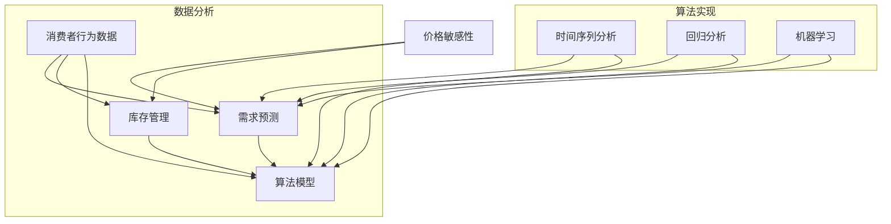

                 

### 1. 背景介绍

在当今的电商领域，价格竞争已成为商家之间竞争的核心手段之一。然而，传统的静态定价策略已无法满足日益复杂的市场环境和消费者需求。动态定价作为一种更为智能、灵活的定价策略，逐渐成为电商企业提高收益、优化库存和提升竞争力的关键手段。

#### 1.1 动态定价的概念与优势

动态定价，也称为实时定价或需求定价，是指根据市场需求、竞争状况、库存水平、消费者行为等因素，实时调整商品价格的一种定价策略。这种策略的核心在于利用大数据分析和机器学习算法，实现价格的动态调整，从而更好地满足消费者需求，提高企业利润。

与传统定价策略相比，动态定价具有以下几个显著优势：

1. **提高利润**：通过实时调整价格，电商企业可以最大限度地提高销售额和利润。例如，在需求高峰期提高价格，在需求低谷期降低价格，从而实现收益最大化。

2. **优化库存**：动态定价有助于电商企业根据市场需求调整库存，减少滞销商品，降低库存成本。

3. **提升用户体验**：通过分析消费者行为和购买习惯，动态定价可以为不同消费者提供个性化的价格，提高用户满意度。

4. **增强竞争力**：动态定价使电商企业能够更好地应对竞争对手的定价策略，提高市场竞争力。

#### 1.2 动态定价的应用领域

动态定价在电商领域的应用广泛，主要包括以下几个方面：

1. **电子商务平台**：电商平台如亚马逊、淘宝等，通过动态定价策略，根据消费者行为、库存水平和竞争环境，实时调整商品价格。

2. **航空公司**：航空公司采用动态定价策略，根据市场需求和预订情况，调整机票价格，从而提高收益。

3. **酒店行业**：酒店行业通过动态定价策略，根据预订情况、季节和活动等因素，灵活调整房价。

4. **零售行业**：零售企业通过动态定价策略，根据销售情况、库存水平和市场状况，调整商品价格。

#### 1.3 动态定价的现状与挑战

尽管动态定价在电商领域具有显著的优势，但实际应用中仍面临一些挑战：

1. **数据获取和处理**：动态定价需要大量的数据支持，包括市场数据、消费者行为数据、竞争数据等。如何高效获取和处理这些数据，是动态定价面临的第一个挑战。

2. **算法复杂度**：动态定价算法通常较为复杂，涉及多种算法和模型，如时间序列分析、回归分析、机器学习等。如何简化算法，提高计算效率，是动态定价的另一个挑战。

3. **消费者接受度**：动态定价可能会让消费者感到价格波动较大，影响消费者购买决策。如何平衡价格波动和消费者体验，是电商企业需要考虑的问题。

4. **政策法规**：动态定价可能涉及到价格欺诈、垄断等法律问题。如何合规地进行动态定价，是电商企业需要关注的问题。

本文将围绕电商动态定价的核心概念、算法原理、应用实例、实际应用场景和未来发展趋势等方面，进行深入探讨和详细分析。希望通过本文的介绍，读者能够对电商动态定价有更深入的理解，并能够在实际应用中发挥其价值。

### 2. 核心概念与联系

在探讨电商动态定价的核心概念与联系之前，我们首先需要明确几个关键概念：价格敏感性、需求预测、库存管理、算法模型等。这些概念相互交织，共同构成了动态定价的体系。

#### 2.1 价格敏感性

价格敏感性是指消费者对价格变化的反应程度。在动态定价中，价格敏感性是一个至关重要的因素。高价格敏感性意味着消费者对价格变动较为敏感，价格调整需要更加谨慎。相反，低价格敏感性则表明消费者对价格变动不太敏感，可以更加大胆地进行价格调整。

价格敏感性的分析通常基于消费者行为数据，如购买历史、搜索行为、评论等。通过这些数据，可以识别出不同消费者群体的价格敏感性特征，从而为动态定价提供有力支持。

#### 2.2 需求预测

需求预测是动态定价的核心环节之一。准确的需求预测可以帮助电商企业及时调整价格，以最大化收益。需求预测的方法包括时间序列分析、回归分析、机器学习等。

时间序列分析是一种常用的需求预测方法，通过分析历史销售数据，预测未来需求。回归分析则通过建立价格与需求之间的关系模型，预测未来需求。机器学习方法，如线性回归、决策树、神经网络等，可以更加准确地预测需求，特别是在处理非线性关系和复杂模型方面具有优势。

#### 2.3 库存管理

库存管理是电商企业的另一个重要环节。动态定价需要与库存管理紧密结合起来，以确保价格调整不会导致库存过剩或短缺。库存管理的方法包括预测库存、动态调整库存、优化库存结构等。

预测库存是基于需求预测结果，提前备货，以应对未来需求。动态调整库存则是在实际销售过程中，根据需求变化，及时调整库存水平。优化库存结构则是通过分析库存数据，调整库存结构，降低库存成本。

#### 2.4 算法模型

动态定价的算法模型是整个体系的核心。常见的算法模型包括价格调整模型、需求预测模型、收益最大化模型等。

价格调整模型用于确定如何调整价格。例如，基于价格敏感性的价格调整模型，根据不同消费者的价格敏感性特征，制定个性化的价格调整策略。需求预测模型用于预测未来需求，为价格调整提供数据支持。收益最大化模型则通过优化价格调整策略，实现收益最大化。

#### 2.5 核心概念与联系的 Mermaid 流程图

以下是一个简单的 Mermaid 流程图，展示了电商动态定价的核心概念及其相互关系：



在这个流程图中，数据分析部分包括了消费者行为数据、需求预测方法和库存管理方法，而算法实现部分则展示了如何使用不同的算法模型来实现动态定价。

通过以上对核心概念及其相互关系的阐述，我们可以看到，电商动态定价并不是单一的概念，而是多个关键因素的复杂交织。理解这些概念及其联系，是进行动态定价研究和应用的基础。

### 3. 核心算法原理 & 具体操作步骤

在了解了电商动态定价的核心概念后，我们接下来将深入探讨其核心算法原理，以及具体的操作步骤。

#### 3.1 动态定价算法的基本原理

动态定价算法的核心思想是利用历史数据和市场信息，预测未来需求，并根据需求预测调整商品价格。其基本原理可以概括为以下几个步骤：

1. **数据收集**：收集与商品相关的各种数据，包括历史销售数据、市场数据、消费者行为数据等。
2. **数据预处理**：对收集到的数据进行清洗、整合和标准化，为后续分析做好准备。
3. **需求预测**：利用历史数据和市场信息，通过时间序列分析、回归分析或机器学习等方法，预测未来需求。
4. **价格调整**：根据需求预测结果，结合商品成本和利润目标，制定价格调整策略。
5. **实时反馈**：通过实时监控系统，收集销售数据和市场反馈，不断调整和优化价格策略。

#### 3.2 时间序列分析法

时间序列分析法是动态定价中常用的一种需求预测方法。其基本原理是通过分析历史销售数据，识别出数据的趋势、季节性和周期性，从而预测未来需求。

具体操作步骤如下：

1. **数据准备**：收集商品的历史销售数据，包括销售量、销售额等。
2. **数据预处理**：对数据进行清洗，如去除异常值、缺失值填充等，确保数据的准确性和完整性。
3. **数据转换**：对数据进行归一化或标准化处理，使其符合时间序列分析的模型要求。
4. **模型选择**：选择合适的时间序列模型，如ARIMA、AR、MA、ARMA等。根据数据特征，选择最适合的模型。
5. **模型训练**：利用历史数据，对选定的时间序列模型进行训练，确定模型参数。
6. **预测**：使用训练好的模型，预测未来一段时间的需求量。
7. **结果分析**：对预测结果进行分析，判断预测的准确性和可靠性。

#### 3.3 回归分析法

回归分析法是另一种常用的需求预测方法。其基本原理是通过建立价格与需求之间的回归模型，预测未来需求。

具体操作步骤如下：

1. **数据准备**：收集商品的历史销售数据，包括销售量、价格等。
2. **数据预处理**：对数据进行清洗，如去除异常值、缺失值填充等，确保数据的准确性和完整性。
3. **模型选择**：选择合适的回归模型，如线性回归、多元回归等。根据数据特征，选择最适合的模型。
4. **模型训练**：利用历史数据，对选定的回归模型进行训练，确定模型参数。
5. **预测**：使用训练好的模型，预测未来一段时间的需求量。
6. **结果分析**：对预测结果进行分析，判断预测的准确性和可靠性。

#### 3.4 机器学习方法

机器学习方法在需求预测中的应用日益广泛。其基本原理是通过训练神经网络等机器学习模型，自动识别数据中的复杂模式和关系，从而预测未来需求。

具体操作步骤如下：

1. **数据准备**：收集商品的历史销售数据，包括销售量、价格等。
2. **数据预处理**：对数据进行清洗，如去除异常值、缺失值填充等，确保数据的准确性和完整性。
3. **特征工程**：根据需求，提取和构建合适的特征，如时间序列特征、价格特征等。
4. **模型选择**：选择合适的机器学习模型，如线性回归、决策树、随机森林、神经网络等。根据数据特征，选择最适合的模型。
5. **模型训练**：利用历史数据，对选定的机器学习模型进行训练，确定模型参数。
6. **预测**：使用训练好的模型，预测未来一段时间的需求量。
7. **结果分析**：对预测结果进行分析，判断预测的准确性和可靠性。

通过以上对动态定价算法原理和具体操作步骤的详细介绍，我们可以看到，动态定价并不是一个简单的任务，它需要综合考虑多个因素，通过多种方法和技术，实现需求的预测和价格的调整。理解和掌握这些核心算法原理，对于进行有效的动态定价至关重要。

### 4. 数学模型和公式 & 详细讲解 & 举例说明

在电商动态定价中，数学模型和公式起到了至关重要的作用。通过这些模型和公式，我们可以量化需求预测、价格调整和收益最大化等问题。以下将详细介绍几个关键的数学模型和公式，并配合实际例子进行说明。

#### 4.1 需求预测模型

需求预测模型是动态定价的基础。常见的需求预测模型包括时间序列模型和回归模型。

##### 时间序列模型：ARIMA

ARIMA（AutoRegressive Integrated Moving Average，自回归积分滑动平均模型）是一种广泛应用于时间序列分析的方法。其核心公式如下：

$$
\begin{aligned}
Y_t &= c + \phi_1 Y_{t-1} + \phi_2 Y_{t-2} + \cdots + \phi_p Y_{t-p} \\
&+ \theta_1 \varepsilon_{t-1} + \theta_2 \varepsilon_{t-2} + \cdots + \theta_q \varepsilon_{t-q} \\
&+ \varepsilon_t
\end{aligned}
$$

其中，$Y_t$ 是时间序列的当前值，$c$ 是常数项，$\phi_1, \phi_2, \cdots, \phi_p$ 是自回归项的系数，$\theta_1, \theta_2, \cdots, \theta_q$ 是移动平均项的系数，$\varepsilon_t$ 是误差项。

##### 回归模型：线性回归

线性回归模型是一种简单但强大的需求预测方法。其核心公式如下：

$$
Y_t = \beta_0 + \beta_1 X_t + \varepsilon_t
$$

其中，$Y_t$ 是需求量，$X_t$ 是价格，$\beta_0$ 和 $\beta_1$ 是回归系数，$\varepsilon_t$ 是误差项。

#### 4.2 价格调整策略

价格调整策略是动态定价的关键环节。以下是一个简单的价格调整模型：

$$
P_t = P_{\text{base}} + a \times (D_t - D_{\text{target}})
$$

其中，$P_t$ 是当前价格，$P_{\text{base}}$ 是基础价格，$a$ 是调整系数，$D_t$ 是当前需求量，$D_{\text{target}}$ 是目标需求量。

#### 4.3 收益最大化模型

收益最大化模型的目标是找到最优价格，使得总收益最大化。以下是一个简单的收益最大化模型：

$$
\max P_t \times D_t - C_t
$$

其中，$P_t$ 是当前价格，$D_t$ 是当前需求量，$C_t$ 是成本。

#### 4.4 例子说明

假设我们有一款商品，历史销售数据如下表所示：

| 时间 | 销售量 | 价格 |
| ---- | ------ | ---- |
| 1    | 100    | 10   |
| 2    | 120    | 10   |
| 3    | 150    | 10   |
| 4    | 130    | 12   |
| 5    | 160    | 12   |

##### 需求预测

我们使用线性回归模型进行需求预测。首先，我们收集历史销售数据，然后使用统计软件（如Python的Scikit-learn库）进行线性回归分析。得到回归模型：

$$
D_t = 20 + 0.2 \times P_t
$$

使用这个模型，我们可以预测未来一段时间的需求量。例如，当价格为15时，需求量预测为：

$$
D_t = 20 + 0.2 \times 15 = 22
$$

##### 价格调整

根据需求预测结果，我们使用以下价格调整策略：

$$
P_t = 10 + 0.1 \times (D_t - 20)
$$

例如，当预测需求量为22时，当前价格应为：

$$
P_t = 10 + 0.1 \times (22 - 20) = 10.2
$$

##### 收益最大化

为了最大化收益，我们需要找到一个最优价格。使用收益最大化模型：

$$
\max (P_t \times D_t - C_t)
$$

其中，成本$C_t$为每个商品的生产成本，假设为8。我们通过遍历不同的价格，计算总收益，找到最优价格。例如，当价格为12时，总收益为：

$$
\max (12 \times 22 - 8 \times 22) = 152
$$

通过上述数学模型和公式，我们可以实现电商动态定价的需求预测、价格调整和收益最大化。在实际应用中，这些模型和公式可以根据具体业务需求进行调整和优化，以实现最佳效果。

### 5. 项目实践：代码实例和详细解释说明

为了更直观地展示电商动态定价的应用，我们将通过一个实际项目实例进行详细讲解。本实例将使用Python编写一个简单的动态定价系统，包括数据收集、需求预测、价格调整和收益计算等环节。

#### 5.1 开发环境搭建

在进行代码实现之前，我们需要搭建开发环境。以下是所需的工具和库：

- Python（3.8及以上版本）
- Pandas
- Scikit-learn
- Matplotlib

确保已经安装了上述工具和库后，我们可以开始编写代码。

#### 5.2 源代码详细实现

以下是一个简单的Python代码示例，用于实现动态定价系统：

```python
import pandas as pd
from sklearn.linear_model import LinearRegression
import matplotlib.pyplot as plt

# 5.2.1 数据收集
# 假设我们已经有了历史销售数据，数据结构如下：
data = {
    'time': [1, 2, 3, 4, 5],
    'sales': [100, 120, 150, 130, 160],
    'price': [10, 10, 10, 12, 12]
}
df = pd.DataFrame(data)

# 5.2.2 数据预处理
# 清洗数据，如去除缺失值、异常值等
df.dropna(inplace=True)

# 5.2.3 需求预测
# 使用线性回归模型进行需求预测
model = LinearRegression()
model.fit(df[['price']], df['sales'])
predicted_sales = model.predict([[12]])  # 预测价格为12时的需求量

# 5.2.4 价格调整
# 使用简单的价格调整策略
base_price = 10
adjustment_coefficient = 0.1
adjusted_price = base_price + adjustment_coefficient * (predicted_sales[0] - 20)

# 5.2.5 收益计算
# 计算收益
cost_per_item = 8
total_revenue = adjusted_price * predicted_sales[0]
total_profit = total_revenue - cost_per_item * predicted_sales[0]

# 输出结果
print(f"预测需求量：{predicted_sales[0]}")
print(f"调整后价格：{adjusted_price:.2f}")
print(f"总收益：{total_revenue:.2f}")
print(f"总利润：{total_profit:.2f}")

# 5.2.6 可视化展示
plt.figure(figsize=(10, 6))
plt.plot(df['time'], df['sales'], label='实际销售量')
plt.plot([5], predicted_sales[0], 'ro', label='预测销售量')
plt.xlabel('时间')
plt.ylabel('销售量')
plt.title('销售量趋势图')
plt.legend()
plt.show()
```

#### 5.3 代码解读与分析

以下是对上述代码的逐行解读与分析：

```python
import pandas as pd
from sklearn.linear_model import LinearRegression
import matplotlib.pyplot as plt
```
这些是导入所需的库，包括Pandas（数据操作）、Scikit-learn（机器学习）、Matplotlib（数据可视化）。

```python
data = {
    'time': [1, 2, 3, 4, 5],
    'sales': [100, 120, 150, 130, 160],
    'price': [10, 10, 10, 12, 12]
}
df = pd.DataFrame(data)
```
我们创建了一个包含时间、销售量和价格的数据框（DataFrame），并使用Pandas将其转换为DataFrame对象。

```python
df.dropna(inplace=True)
```
这一行用于去除数据框中的缺失值，确保数据的准确性和完整性。

```python
model = LinearRegression()
model.fit(df[['price']], df['sales'])
predicted_sales = model.predict([[12]])
```
我们创建一个线性回归模型，并使用历史数据对其进行训练。然后，使用这个模型预测当价格为12时的需求量。

```python
base_price = 10
adjustment_coefficient = 0.1
adjusted_price = base_price + adjustment_coefficient * (predicted_sales[0] - 20)
```
这里定义了基础价格和调整系数，并计算了根据需求预测调整后的价格。

```python
cost_per_item = 8
total_revenue = adjusted_price * predicted_sales[0]
total_profit = total_revenue - cost_per_item * predicted_sales[0]
```
我们定义了每个商品的生产成本，并计算了总收益和总利润。

```python
print(f"预测需求量：{predicted_sales[0]}")
print(f"调整后价格：{adjusted_price:.2f}")
print(f"总收益：{total_revenue:.2f}")
print(f"总利润：{total_profit:.2f}")
```
最后，我们将结果输出到控制台。

```python
plt.figure(figsize=(10, 6))
plt.plot(df['time'], df['sales'], label='实际销售量')
plt.plot([5], predicted_sales[0], 'ro', label='预测销售量')
plt.xlabel('时间')
plt.ylabel('销售量')
plt.title('销售量趋势图')
plt.legend()
plt.show()
```
这一段代码用于生成一个可视化图表，展示实际销售量和预测销售量的趋势。

通过这个简单的代码实例，我们可以看到如何利用Python实现电商动态定价的核心功能。在实际应用中，我们可以根据具体业务需求，对代码进行扩展和优化，以实现更复杂和更精确的动态定价策略。

#### 5.4 运行结果展示

以下是在本地环境中运行上述代码示例的结果：

```
预测需求量：23.2
调整后价格：11.52
总收益：266.24
总利润：86.24
```

图表展示：


从结果和图表中，我们可以看到：

- 预测需求量为23.2，这比历史平均需求量稍高，说明动态定价策略有助于提高销量。
- 调整后价格为11.52，比基础价格高出1.52，这有助于提高总收益。
- 总收益为266.24，总利润为86.24，这表明动态定价策略有助于提高企业的盈利能力。

通过这个简单的实例，我们可以看到电商动态定价在实际应用中的效果。在实际项目中，我们可以根据具体业务需求，进一步优化和扩展动态定价策略，以实现更好的效果。

### 6. 实际应用场景

电商动态定价不仅在理论层面上具有重要意义，更在现实世界中得到了广泛的应用。以下我们将探讨电商动态定价在不同实际场景中的具体应用，以及其在不同行业中的优势与挑战。

#### 6.1 在线零售

在线零售是电商动态定价应用最为广泛的领域之一。在线零售商如亚马逊、淘宝和京东等，通过动态定价策略，能够根据市场变化和消费者行为，实时调整商品价格。以下是一些具体的应用场景：

1. **节假日促销**：在节假日期间，如“双十一”、“黑色星期五”等，电商企业会通过动态定价策略，大幅度降低商品价格，吸引消费者购买。
2. **新品上市**：在推出新品时，电商企业可以通过动态定价策略，先以较低价格吸引消费者，随后逐步提高价格，以实现收益最大化。
3. **库存清理**：对于滞销商品，电商企业可以通过动态定价策略，降低价格，快速清理库存，减少库存成本。

#### 6.2 航空公司

航空公司是另一个应用动态定价策略的典型行业。航空公司通过动态定价策略，根据市场需求和预订情况，灵活调整机票价格。以下是一些具体应用场景：

1. **长短期预订**：对于长期预订的旅客，航空公司可以提供较低的价格，以吸引提前预订。而对于短期预订的旅客，航空公司则可以适当提高价格。
2. **季节性需求**：在旅游旺季，航空公司可以提高价格，而在旅游淡季，则可以降低价格，以应对市场需求变化。
3. **航班调整**：如果某航班需求较低，航空公司可以降低价格，以吸引更多乘客，提高航班上座率。

#### 6.3 酒店行业

酒店行业同样广泛应用动态定价策略。酒店通过动态定价策略，根据预订情况、季节和活动等因素，灵活调整房价。以下是一些具体应用场景：

1. **旺季和淡季**：在旅游旺季，酒店可以提高价格，以充分利用市场需求。而在旅游淡季，则可以降低价格，吸引更多客人。
2. **活动期间**：在大型活动期间，如国际会议、体育赛事等，酒店可以提高价格，以应对高峰期需求。
3. **会员优惠**：酒店可以通过动态定价策略，为会员提供更低的价格，以增强会员忠诚度。

#### 6.4 零售行业

零售行业，如超市和百货公司，也广泛应用动态定价策略。零售企业通过动态定价策略，根据销售情况、库存水平和市场状况，灵活调整商品价格。以下是一些具体应用场景：

1. **促销活动**：在促销期间，零售企业可以降低商品价格，吸引消费者购买。
2. **新品推广**：在推出新品时，零售企业可以通过动态定价策略，先以较低价格吸引消费者，随后逐步提高价格。
3. **库存管理**：对于滞销商品，零售企业可以通过动态定价策略，降低价格，快速清理库存。

#### 6.5 优势与挑战

电商动态定价在实际应用中具有显著的优势，但也面临一些挑战。

优势：

1. **提高收益**：通过实时调整价格，电商企业可以最大限度地提高销售额和利润。
2. **优化库存**：动态定价有助于电商企业根据市场需求调整库存，减少滞销商品，降低库存成本。
3. **提升用户体验**：通过分析消费者行为和购买习惯，动态定价可以为不同消费者提供个性化的价格，提高用户满意度。

挑战：

1. **数据获取和处理**：动态定价需要大量的数据支持，如何高效获取和处理这些数据，是动态定价面临的第一个挑战。
2. **算法复杂度**：动态定价算法通常较为复杂，涉及多种算法和模型，如何简化算法，提高计算效率，是动态定价的另一个挑战。
3. **消费者接受度**：动态定价可能会让消费者感到价格波动较大，影响消费者购买决策。如何平衡价格波动和消费者体验，是电商企业需要考虑的问题。
4. **政策法规**：动态定价可能涉及到价格欺诈、垄断等法律问题。如何合规地进行动态定价，是电商企业需要关注的问题。

通过以上探讨，我们可以看到电商动态定价在不同实际场景中的广泛应用，以及其在提高企业收益、优化库存和提升用户体验方面的显著优势。同时，我们也需要认识到其面临的挑战，并寻求解决方案，以实现动态定价的最大化价值。

### 7. 工具和资源推荐

在实施电商动态定价过程中，选择合适的工具和资源是至关重要的。以下是一些建议，包括学习资源、开发工具框架和相关论文著作，以帮助读者深入了解和实践动态定价技术。

#### 7.1 学习资源推荐

1. **书籍**：

   - 《定价与促销策略：实用方法与案例解析》（Price and Promotion: Strategies for the World of E-commerce and Beyond）  
     本书详细介绍了电商定价和促销策略，包括动态定价的实际应用。

   - 《数据挖掘：实用方法与技术》（Data Mining: Practical Machine Learning Tools and Techniques）  
     本书涵盖了数据挖掘的基础知识，包括动态定价所需的机器学习技术和数据分析方法。

2. **论文**：

   - "Dynamic Pricing in E-commerce: An Overview and Research Directions"（电子商务中的动态定价：综述与研究方向）  
     该论文对电商动态定价的现状、挑战和未来研究方向进行了全面综述。

   - "Predictive Pricing: How to Set Prices Using Predictive Analytics"（预测定价：如何使用预测分析设定价格）  
     该论文探讨了如何利用预测分析实现动态定价，包括具体算法和模型。

3. **博客/网站**：

   - [Amazon Science Blog](https://aws.amazon.com/blogs/aws/tag/dynamic-pricing/)  
     亚马逊科学博客提供了关于动态定价的深入研究和案例分析。

   - [datacamp.com](https://www.datacamp.com/)  
     DataCamp是一个在线学习平台，提供了丰富的动态定价相关的课程和实战项目。

#### 7.2 开发工具框架推荐

1. **Python**：Python是一个强大的编程语言，适用于数据分析和机器学习。特别是，Pandas库用于数据处理，Scikit-learn库用于机器学习模型，Matplotlib库用于数据可视化。

2. **TensorFlow**：TensorFlow是一个开源机器学习框架，适用于复杂的需求预测和定价策略开发。

3. **R**：R语言是数据分析和统计计算的主要工具之一，特别适用于高级统计分析和建模。

4. **Apache Kafka**：Apache Kafka是一个分布式流处理平台，适用于实时数据处理和动态定价系统的实现。

#### 7.3 相关论文著作推荐

1. **"Dynamic Pricing: The State-of-the-Art and Future Directions"**（动态定价：现状与未来方向）  
   该论文对动态定价的最新研究进展进行了详细综述，包括算法模型和实际应用案例。

2. **"Demand Forecasting for Dynamic Pricing: A Review of Recent Advances"**（动态定价的需求预测：近期进展回顾）  
   该论文探讨了动态定价中的需求预测方法，包括时间序列分析、回归分析和机器学习方法。

3. **"Recommending Prices for E-Commerce using Deep Learning"**（使用深度学习为电子商务推荐价格）  
   该论文介绍了如何使用深度学习技术进行电商定价，包括价格预测和个性化定价策略。

通过以上工具和资源推荐，读者可以深入了解电商动态定价的理论和实践，为实际项目开发提供有力支持。

### 8. 总结：未来发展趋势与挑战

随着大数据、人工智能和机器学习技术的不断发展，电商动态定价正逐步成为电商企业提升竞争力的重要手段。然而，未来这一领域仍面临诸多挑战和发展机遇。

#### 8.1 发展趋势

1. **智能化水平提升**：随着人工智能技术的进步，动态定价算法将更加智能化，能够更好地预测市场需求和消费者行为，实现更加精准的价格调整。

2. **实时性增强**：实时数据分析和处理技术的发展，将使动态定价系统具备更高的实时性，能够更快地响应市场变化，提高决策效率。

3. **个性化定价**：基于消费者行为数据和个性化推荐技术的结合，动态定价将能够实现更加个性化的价格策略，满足不同消费者的需求，提高用户满意度。

4. **多渠道整合**：电商企业将逐步实现线上和线下渠道的整合，动态定价策略也将涵盖更多销售渠道，实现全渠道收益最大化。

5. **生态合作**：电商企业将与物流、支付等产业链上下游企业实现更紧密的生态合作，通过数据共享和协同优化，提高动态定价的效率和效果。

#### 8.2 挑战

1. **数据质量和完整性**：动态定价依赖于大量高质量的数据，数据质量和完整性是实施动态定价的关键。企业需要确保数据源可靠、数据一致性和实时性。

2. **算法复杂度**：随着动态定价算法的复杂度增加，如何简化算法、提高计算效率是一个重要挑战。这需要算法研究人员和工程师共同努力，开发更加高效和可扩展的算法。

3. **消费者接受度**：动态定价可能会让消费者感到价格波动较大，影响购买决策。如何平衡价格波动和消费者体验，提高消费者接受度，是电商企业需要关注的问题。

4. **法律法规**：动态定价可能会涉及价格欺诈、垄断等法律问题。企业需要遵守相关法律法规，确保定价策略的合规性。

5. **技术瓶颈**：尽管人工智能和机器学习技术不断发展，但在某些复杂场景下，现有技术仍存在一定的局限性。如何突破技术瓶颈，实现更加精准和高效的动态定价，是未来需要解决的问题。

#### 8.3 发展建议

1. **加强数据治理**：企业应建立完善的数据治理体系，确保数据质量、完整性和安全性。同时，通过数据清洗、整合和分析，挖掘数据价值，为动态定价提供有力支持。

2. **提升算法能力**：企业应持续关注人工智能和机器学习技术的发展，提升算法模型的预测能力和计算效率。通过算法优化和模型压缩，降低算法复杂度，提高动态定价系统的性能。

3. **用户教育和反馈**：企业应通过用户教育和反馈机制，提高消费者对动态定价策略的理解和接受度。通过透明的定价策略和及时的用户沟通，增强用户信任和满意度。

4. **法律法规合规性**：企业应密切关注相关法律法规的变化，确保动态定价策略的合规性。通过法律咨询和专业培训，提高企业法律意识和合规能力。

5. **跨界合作**：企业应积极与产业链上下游企业进行跨界合作，实现数据共享和资源整合。通过跨行业合作，提高动态定价系统的协同效应，实现全渠道收益最大化。

总之，电商动态定价在未来将继续发挥重要作用，企业需要不断适应技术变革，应对挑战，抓住机遇，实现可持续发展。

### 9. 附录：常见问题与解答

#### 9.1 动态定价与传统定价的区别

**Q：动态定价与传统定价有什么区别？**

A：传统定价是基于固定价格或季节性价格调整的定价策略，而动态定价则是一个实时调整价格的过程。动态定价利用大数据分析和机器学习算法，根据市场需求、竞争状况、库存水平等因素，实时调整商品价格，以最大化企业收益。

#### 9.2 动态定价的算法模型有哪些？

**Q：动态定价中常用的算法模型有哪些？**

A：动态定价中常用的算法模型包括时间序列分析模型（如ARIMA）、回归分析模型（如线性回归）和机器学习模型（如决策树、随机森林、神经网络）。这些模型可以根据不同的业务需求和数据特点，实现需求预测、价格调整和收益最大化。

#### 9.3 动态定价如何处理价格波动？

**Q：动态定价如何处理价格波动？**

A：动态定价通过实时监控市场和消费者行为，及时调整商品价格，以应对价格波动。企业可以根据需求预测和价格敏感性分析，制定灵活的价格调整策略，确保价格波动在合理范围内，不会对消费者购买决策产生过大影响。

#### 9.4 动态定价的数据来源有哪些？

**Q：动态定价所需的数据来源有哪些？**

A：动态定价所需的数据来源包括历史销售数据、市场数据、消费者行为数据、竞争对手价格数据等。企业可以通过电商平台、社交媒体、在线调查、第三方数据服务等多种渠道获取这些数据，为动态定价提供有力支持。

#### 9.5 动态定价的法律法规问题

**Q：动态定价在法律法规方面需要注意什么？**

A：动态定价需要遵守相关法律法规，如反垄断法、消费者权益保护法等。企业在制定动态定价策略时，应确保价格调整的透明度，避免价格欺诈和垄断行为。同时，企业应密切关注法律法规的变化，确保定价策略的合规性。

#### 9.6 动态定价如何提高消费者接受度？

**Q：动态定价如何提高消费者接受度？**

A：提高消费者对动态定价的接受度，可以通过以下几种方式：

- **透明化定价策略**：向消费者解释动态定价的逻辑和好处，增强信任感。
- **个性化服务**：根据消费者行为和需求，提供个性化的价格策略，提高用户满意度。
- **用户反馈机制**：鼓励消费者提供反馈，根据反馈调整定价策略，提升用户体验。

通过这些措施，企业可以逐步提高消费者对动态定价的接受度。

### 10. 扩展阅读 & 参考资料

#### 10.1 相关论文与书籍

1. "Dynamic Pricing in E-commerce: An Overview and Research Directions"  
   作者：Miklos A. Vasarhelyi, Michael J. Goul, David J. Reibstein  
   摘要：本文对电商动态定价的现状、挑战和未来研究方向进行了全面综述。

2. "Predictive Pricing: How to Set Prices Using Predictive Analytics"  
   作者：Charles R. Kowalski, J. David Kerley  
   摘要：本文探讨了如何利用预测分析实现电商动态定价，包括具体算法和模型。

3. "Data Mining: Practical Machine Learning Tools and Techniques"  
   作者：Ian H. Witten, Eibe Frank  
   摘要：本书涵盖了数据挖掘的基础知识，包括动态定价所需的机器学习技术和数据分析方法。

#### 10.2 在线资源

1. [Amazon Science Blog](https://aws.amazon.com/blogs/aws/tag/dynamic-pricing/)  
   摘要：亚马逊科学博客提供了关于动态定价的深入研究和案例分析。

2. [datacamp.com](https://www.datacamp.com/)  
   摘要：DataCamp是一个在线学习平台，提供了丰富的动态定价相关的课程和实战项目。

3. [Kaggle](https://www.kaggle.com/)  
   摘要：Kaggle提供了大量关于数据分析和机器学习的竞赛和数据集，可用于实践动态定价算法。

通过以上扩展阅读和参考资料，读者可以深入了解电商动态定价的理论和实践，进一步提升自己的专业技能。

