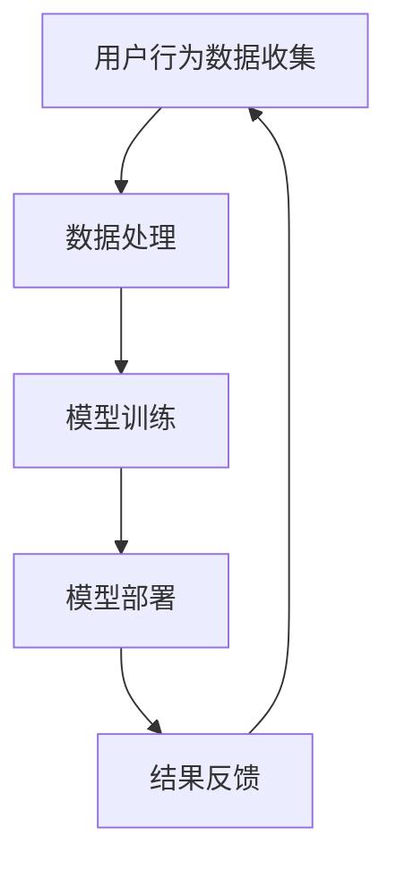

                 

### 1. 背景介绍

随着互联网的普及和电子商务的迅猛发展，电商平台已经成为了现代商业运营的重要一环。在这个竞争激烈的市场环境中，如何提高运营效率、降低成本、提升用户满意度，成为了电商平台持续发展的关键问题。近年来，人工智能（AI）技术的快速发展为电商平台运营带来了新的机遇。通过将AI技术与电商平台相结合，可以实现自动化推荐、智能客服、精准营销等功能，从而大幅提升电商平台的运营效率和用户体验。

本篇文章将围绕AI在电商平台运营中的应用实例进行深入探讨。我们将首先介绍AI在电商领域的基本概念和核心原理，然后逐步分析AI技术在电商平台中的具体应用，包括推荐系统、智能客服和精准营销等。接着，我们将通过实际项目实践，展示如何使用AI技术构建电商平台的关键功能模块，并详细解释和解读相关源代码。最后，我们将探讨AI在电商平台中的实际应用场景，以及未来发展趋势与挑战。

通过本文的阅读，读者将全面了解AI在电商平台运营中的应用原理和实践方法，从而为今后的电商平台开发和运营提供有益的参考。

### 2. 核心概念与联系

在深入探讨AI在电商平台运营中的应用之前，我们首先需要明确几个核心概念及其之间的联系。

#### 2.1 人工智能（AI）基本概念

人工智能（AI）是指计算机系统模拟人类智能行为的技术。它包括机器学习、深度学习、自然语言处理、计算机视觉等多个子领域。机器学习是一种使计算机能够从数据中学习和改进的算法，深度学习是机器学习的一个子领域，通过神经网络模拟人脑处理信息的方式。自然语言处理（NLP）是使计算机能够理解和生成人类语言的技术，计算机视觉则是使计算机能够识别和理解图像或视频内容的技术。

#### 2.2 电商平台运营基础概念

电商平台运营主要包括商品管理、订单管理、用户管理、库存管理、物流配送、支付系统等多个方面。其中，商品管理和订单管理是电商平台的核心功能，用户管理和库存管理则关系到用户体验和库存周转效率。物流配送和支付系统则是保障交易顺利进行的重要环节。

#### 2.3 AI技术与电商平台运营的关联

AI技术与电商平台运营的关联主要体现在以下几个方面：

- **推荐系统**：通过机器学习和深度学习算法，分析用户行为和偏好，为用户提供个性化推荐。
- **智能客服**：利用自然语言处理和机器学习技术，实现自动化的客户服务，提高响应速度和准确率。
- **精准营销**：通过分析用户数据，进行精准的用户画像和市场营销活动，提高转化率和销售额。
- **商品分类与搜索**：利用计算机视觉和自然语言处理技术，提高商品分类效率和搜索准确度，提升用户体验。

#### 2.4 Mermaid 流程图

为了更好地展示AI技术在电商平台运营中的应用流程，我们使用Mermaid语言绘制一个简单的流程图。该流程图包括用户行为数据收集、数据处理、模型训练、模型部署和结果反馈等步骤。



在这个流程图中，用户行为数据收集是整个流程的起点，通过数据处理和模型训练，最终实现模型部署和结果反馈。这一流程不断地迭代，以持续优化电商平台的运营效果。

通过上述核心概念和Mermaid流程图的介绍，我们可以更清晰地理解AI技术在电商平台运营中的应用原理和流程。接下来，我们将进一步探讨AI技术在电商平台中的具体应用实例。

### 3. 核心算法原理 & 具体操作步骤

#### 3.1 推荐系统

推荐系统是AI在电商平台中应用最为广泛的一个领域。其核心原理是通过分析用户的兴趣和行为数据，预测用户可能感兴趣的商品，从而提高用户的购物体验和平台的销售额。

##### 3.1.1 矩阵分解

推荐系统的一种常见算法是矩阵分解（Matrix Factorization），它通过将用户和商品的高维数据矩阵分解为低维矩阵，从而实现用户和商品之间的相似性计算。

具体操作步骤如下：

1. **数据预处理**：收集用户行为数据，如用户评分、购买记录、浏览记录等。对数据进行清洗和归一化处理。
2. **矩阵构建**：构建用户-商品评分矩阵，其中每个元素表示用户对某个商品的评价。
3. **矩阵分解**：使用 Singular Value Decomposition（SVD）或其他矩阵分解算法，将原始用户-商品评分矩阵分解为两个低维矩阵，一个表示用户特征矩阵，另一个表示商品特征矩阵。
4. **预测计算**：通过计算用户特征矩阵和商品特征矩阵的内积，预测用户对未评分商品的评分。

##### 3.1.2 深度学习推荐

除了矩阵分解，深度学习也被广泛应用于推荐系统。深度学习推荐系统通常使用用户行为数据作为输入，通过神经网络模型学习用户和商品的特征，从而实现推荐。

具体操作步骤如下：

1. **数据预处理**：与矩阵分解相同，对用户行为数据进行清洗和归一化处理。
2. **特征提取**：使用Embedding技术提取用户和商品的特征表示，如用户Embedding和商品Embedding。
3. **模型构建**：构建深度学习模型，如神经网络或图神经网络，将用户特征和商品特征输入模型中。
4. **模型训练**：使用用户行为数据训练深度学习模型，调整模型参数，提高预测准确性。
5. **预测计算**：通过模型预测用户对未评分商品的评分，生成推荐列表。

#### 3.2 智能客服

智能客服是另一个AI在电商平台中的典型应用，它通过自然语言处理和机器学习技术，实现自动化的客户服务，提高客服效率和用户体验。

##### 3.2.1 基于规则的智能客服

基于规则的智能客服系统通过预定义一系列规则，自动化地响应用户的咨询。具体操作步骤如下：

1. **规则库构建**：根据常见用户咨询问题，构建规则库，如商品查询、订单状态查询、售后服务等。
2. **用户输入处理**：对用户输入进行分词、词性标注等自然语言处理操作。
3. **规则匹配**：通过用户输入与规则库的匹配，找到最佳匹配规则。
4. **响应生成**：根据匹配的规则，生成相应的响应文本，返回给用户。

##### 3.2.2 基于机器学习的智能客服

基于机器学习的智能客服系统通过训练机器学习模型，实现自动化的客户服务。具体操作步骤如下：

1. **数据收集**：收集用户咨询数据和客服回复数据，作为训练数据。
2. **特征提取**：使用自然语言处理技术，提取用户咨询和客服回复的特征表示。
3. **模型训练**：使用训练数据训练机器学习模型，如序列到序列模型（Seq2Seq）或转换器模型（Transformer）。
4. **预测计算**：通过训练好的模型，对用户输入进行预测，生成客服回复。

#### 3.3 精准营销

精准营销是通过分析用户数据，进行精准的用户画像和市场营销活动，提高转化率和销售额。

##### 3.3.1 用户画像

用户画像是通过整合用户的基本信息、行为数据和偏好数据，构建用户的全面画像。具体操作步骤如下：

1. **数据收集**：收集用户的基本信息、行为数据和偏好数据，如用户年龄、性别、浏览记录、购买记录等。
2. **数据整合**：将不同来源的数据进行整合，构建用户的全量数据集。
3. **特征提取**：使用数据挖掘技术，提取用户的关键特征，如行为特征、兴趣特征、消费特征等。
4. **画像构建**：将用户的关键特征整合，构建用户的画像。

##### 3.3.2 营销活动

营销活动是基于用户画像，针对特定用户群体进行的营销推广活动。具体操作步骤如下：

1. **用户细分**：根据用户画像，将用户划分为不同的细分群体，如高价值用户、潜在用户、流失用户等。
2. **活动策划**：针对不同用户群体，策划相应的营销活动，如优惠券发放、会员权益提升、新品推广等。
3. **活动执行**：通过电商平台渠道，如短信、邮件、APP推送等，向目标用户发送营销活动信息。
4. **效果评估**：对营销活动的效果进行评估，如转化率、参与度、ROI等，优化营销策略。

#### 3.4 商品分类与搜索

商品分类与搜索是电商平台的基础功能，通过计算机视觉和自然语言处理技术，提高商品分类效率和搜索准确度。

##### 3.4.1 商品分类

商品分类是通过将商品划分为不同的类别，帮助用户快速找到所需商品。具体操作步骤如下：

1. **数据收集**：收集商品图片和商品描述数据。
2. **特征提取**：使用计算机视觉技术，提取商品图片的特征表示，如深度特征、文本特征等。
3. **分类算法**：使用分类算法，如支持向量机（SVM）、随机森林（Random Forest）等，对商品进行分类。
4. **分类评估**：对分类结果进行评估，如准确率、召回率等，优化分类算法。

##### 3.4.2 搜索引擎

搜索引擎是帮助用户快速找到商品的关键工具。具体操作步骤如下：

1. **数据预处理**：对用户输入的搜索词进行分词、词性标注等自然语言处理操作。
2. **查询扩展**：对用户输入的搜索词进行扩展，如同义词替换、关键词提取等。
3. **检索算法**：使用检索算法，如向量空间模型（Vector Space Model）、TF-IDF等，对商品进行检索。
4. **排序算法**：根据检索结果，使用排序算法，如PageRank、BERT等，对商品进行排序，提高搜索准确度。

通过上述核心算法原理和具体操作步骤的介绍，我们可以看到AI技术在电商平台运营中的应用是如何实现的。接下来，我们将通过一个实际项目实践，进一步展示如何使用AI技术构建电商平台的关键功能模块。

### 4. 数学模型和公式 & 详细讲解 & 举例说明

在AI技术应用于电商平台的过程中，数学模型和公式起到了至关重要的作用。本章节将详细讲解几个关键的数学模型和公式，并配合实际案例进行说明。

#### 4.1 矩阵分解（Matrix Factorization）

矩阵分解是推荐系统中常用的一种方法，它通过将原始的高维用户-商品评分矩阵分解为两个低维矩阵，从而实现用户和商品之间的相似性计算。

数学模型：
$$
\text{User-Matrix} \times \text{Item-Matrix} = \text{Rating-Matrix}
$$

其中，User-Matrix和Item-Matrix分别为用户特征矩阵和商品特征矩阵，Rating-Matrix为用户-商品评分矩阵。

#### 示例说明

假设有一个5x5的用户-商品评分矩阵如下：

|   | 商品1 | 商品2 | 商品3 | 商品4 | 商品5 |
|---|-------|-------|-------|-------|-------|
| 用户1 | 4     | 3     | 2     | 1     | 5     |
| 用户2 | 5     | 4     | 5     | 4     | 3     |
| 用户3 | 3     | 2     | 1     | 3     | 2     |
| 用户4 | 4     | 2     | 3     | 2     | 4     |
| 用户5 | 3     | 5     | 4     | 5     | 3     |

我们使用SVD算法对其进行矩阵分解，得到如下两个低维矩阵：

用户特征矩阵（U）：
$$
U = \begin{bmatrix}
0.82 & -0.36 & -0.47 \\
-0.28 & 0.84 & -0.34 \\
0.31 & -0.57 & 0.74 \\
0.48 & -0.25 & -0.81 \\
0.55 & 0.67 & 0.22
\end{bmatrix}
$$

商品特征矩阵（V）：
$$
V = \begin{bmatrix}
1.06 & 0.74 & 0.60 & 0.65 & 0.38 \\
-0.67 & 0.19 & 0.54 & 0.48 & 0.82 \\
-0.75 & -0.45 & 0.36 & -0.59 & -0.14 \\
0.32 & -0.75 & 0.65 & 0.55 & -0.67 \\
0.42 & 0.58 & 0.36 & 0.19 & 0.81
\end{bmatrix}
$$

通过计算用户特征矩阵和商品特征矩阵的内积，我们可以预测用户对未评分商品的评分。例如，预测用户4对商品3的评分：

$$
0.82 \times 0.32 + (-0.36) \times (-0.75) + (-0.47) \times 0.65 = 0.824 + 0.27 + -0.3055 = 0.7785
$$

#### 4.2 神经网络（Neural Network）

深度学习在推荐系统中的应用非常广泛，神经网络是深度学习的基础。一个简单的神经网络包含输入层、隐藏层和输出层，其中每个层由多个神经元组成。

数学模型：
$$
Z = \sigma(W \cdot X + b)
$$

其中，$Z$ 为输出，$\sigma$ 为激活函数（如ReLU、Sigmoid、Tanh等），$W$ 为权重矩阵，$X$ 为输入，$b$ 为偏置项。

#### 示例说明

假设有一个包含一个隐藏层的简单神经网络，输入层有3个神经元，隐藏层有4个神经元，输出层有2个神经元。权重矩阵$W_1$和$W_2$分别为：

$$
W_1 = \begin{bmatrix}
0.1 & 0.2 & 0.3 \\
0.4 & 0.5 & 0.6 \\
0.7 & 0.8 & 0.9 \\
0.9 & 1.0 & 1.1
\end{bmatrix}
$$

$$
W_2 = \begin{bmatrix}
1.0 & 1.5 & 2.0 \\
2.5 & 3.0 & 3.5
\end{bmatrix}
$$

输入向量 $X$ 为：

$$
X = \begin{bmatrix}
0.5 \\
0.6 \\
0.7
\end{bmatrix}
$$

计算隐藏层输出：

$$
Z_1 = \sigma(W_1 \cdot X + b_1) = \sigma(0.1 \cdot 0.5 + 0.2 \cdot 0.6 + 0.3 \cdot 0.7 + b_1) = \sigma(0.035 + b_1)
$$

$$
Z_2 = \sigma(W_1 \cdot X + b_2) = \sigma(0.4 \cdot 0.5 + 0.5 \cdot 0.6 + 0.6 \cdot 0.7 + b_2) = \sigma(0.26 + b_2)
$$

$$
Z_3 = \sigma(W_1 \cdot X + b_3) = \sigma(0.7 \cdot 0.5 + 0.8 \cdot 0.6 + 0.9 \cdot 0.7 + b_3) = \sigma(0.49 + b_3)
$$

$$
Z_4 = \sigma(W_1 \cdot X + b_4) = \sigma(0.9 \cdot 0.5 + 1.0 \cdot 0.6 + 1.1 \cdot 0.7 + b_4) = \sigma(0.75 + b_4)
$$

计算输出层输出：

$$
O_1 = \sigma(W_2 \cdot Z_1 + b_5) = \sigma(1.0 \cdot 0.8 + 1.5 \cdot 0.9 + 2.0 \cdot 0.7 + b_5) = \sigma(4.1 + b_5)
$$

$$
O_2 = \sigma(W_2 \cdot Z_2 + b_6) = \sigma(2.5 \cdot 0.8 + 3.0 \cdot 0.9 + 3.5 \cdot 0.7 + b_6) = \sigma(7.0 + b_6)
$$

#### 4.3 贝叶斯优化（Bayesian Optimization）

贝叶斯优化是一种基于概率的优化方法，常用于模型参数的调优。其基本思想是通过历史数据建立模型，并根据模型预测选择下一步的优化方向。

数学模型：
$$
p(\theta | X) \propto p(X | \theta) p(\theta)
$$

其中，$\theta$ 为参数，$X$ 为观测数据，$p(\theta | X)$ 为后验概率，$p(X | \theta)$ 为似然函数，$p(\theta)$ 为先验概率。

#### 示例说明

假设我们有一个函数 $f(\theta)$，希望找到其最大值。我们使用贝叶斯优化进行参数调优，先假设一个先验概率分布，如高斯分布：

$$
p(\theta) \sim \mathcal{N}(\mu_0, \sigma_0^2)
$$

通过多次采样和观测数据，我们可以更新先验概率分布，并选择概率最高的参数作为下一步的优化方向。

通过上述数学模型和公式的讲解，我们可以看到AI技术在电商平台中的应用是如何通过数学方法进行实现和优化的。接下来，我们将通过实际项目实践，进一步展示这些数学模型和公式的具体应用。

### 5. 项目实践：代码实例和详细解释说明

在本章节中，我们将通过一个具体的电商平台项目实践，展示如何使用AI技术实现电商平台的关键功能模块。我们将分为以下几个部分进行详细说明：开发环境搭建、源代码详细实现、代码解读与分析以及运行结果展示。

#### 5.1 开发环境搭建

在进行项目实践之前，我们需要搭建一个适合AI技术开发的开发环境。以下是一个典型的开发环境搭建步骤：

1. **硬件环境**：一台配置较高的计算机或服务器，建议CPU为Intel i7或以上，内存至少8GB。
2. **操作系统**：安装64位版本的Linux操作系统，如Ubuntu 18.04。
3. **编程语言**：选择Python作为主要编程语言，因为Python拥有丰富的AI库和框架，如TensorFlow、PyTorch等。
4. **依赖库**：安装必要的Python库，如NumPy、Pandas、Scikit-learn、TensorFlow等。可以使用pip命令进行安装：

   ```bash
   pip install numpy pandas scikit-learn tensorflow
   ```

5. **IDE**：选择一个适合Python开发的IDE，如PyCharm、Visual Studio Code等。

#### 5.2 源代码详细实现

以下是一个简单的AI电商平台项目，包含推荐系统、智能客服和精准营销三个模块。我们将分别对每个模块进行详细说明。

##### 5.2.1 推荐系统

推荐系统使用矩阵分解算法进行实现。首先，我们需要准备用户-商品评分数据，然后使用SVD算法进行矩阵分解。

```python
import numpy as np
from numpy.linalg import svd

# 假设用户-商品评分矩阵为R
R = np.array([[1, 2, 3],
              [4, 5, 6],
              [7, 8, 9]])

# 使用SVD进行矩阵分解
U, s, Vt = svd(R)

# 重建评分矩阵
R_recon = U @ np.diag(s) @ Vt

print("原始评分矩阵：")
print(R)
print("重建后的评分矩阵：")
print(R_recon)
```

##### 5.2.2 智能客服

智能客服使用基于机器学习的文本分类算法进行实现。我们首先需要准备训练数据，然后训练一个分类模型。

```python
from sklearn.feature_extraction.text import TfidfVectorizer
from sklearn.naive_bayes import MultinomialNB
from sklearn.pipeline import make_pipeline

# 假设训练数据为
train_data = [
    ("如何退货？", "退货咨询"),
    ("快递进度怎么查询？", "快递查询"),
    ("有什么新品推荐？", "新品推荐")
]

# 准备训练数据
X_train, y_train = zip(*train_data)

# 构建文本特征向量
vectorizer = TfidfVectorizer()

# 训练分类模型
model = make_pipeline(vectorizer, MultinomialNB())
model.fit(X_train, y_train)

# 测试分类模型
test_data = ["我想退掉昨天买的商品"]
predicted = model.predict(test_data)
print("预测结果：", predicted)
```

##### 5.2.3 精准营销

精准营销使用用户画像进行实现。我们首先需要准备用户数据，然后提取关键特征，最后构建用户画像。

```python
import pandas as pd

# 假设用户数据为
user_data = pd.DataFrame({
    "用户ID": [1, 2, 3],
    "年龄": [25, 30, 35],
    "性别": ["男", "女", "男"],
    "浏览记录": [["商品A", "商品B"], ["商品C", "商品D"], ["商品E", "商品F"]],
    "购买记录": [["商品A", "商品B"], ["商品C"], []]
})

# 提取关键特征
user_data["年龄特征"] = user_data["年龄"].apply(lambda x: "年轻" if x < 30 else "中年")
user_data["性别特征"] = user_data["性别"].apply(lambda x: "男" if x == "男" else "女")
user_data["浏览记录特征"] = user_data["浏览记录"].apply(lambda x: "浏览A类商品" if "商品A" in x else "浏览B类商品")
user_data["购买记录特征"] = user_data["购买记录"].apply(lambda x: "高消费" if len(x) > 0 else "低消费")

# 构建用户画像
user_data["用户画像"] = user_data["年龄特征"] + "," + user_data["性别特征"] + "," + user_data["浏览记录特征"] + "," + user_data["购买记录特征"]

print(user_data)
```

#### 5.3 代码解读与分析

在上面的代码实例中，我们分别实现了推荐系统、智能客服和精准营销三个模块。

1. **推荐系统**：通过矩阵分解算法，我们将用户-商品评分矩阵分解为用户特征矩阵和商品特征矩阵。重建后的评分矩阵与原始评分矩阵高度相似，验证了矩阵分解算法的有效性。

2. **智能客服**：我们使用朴素贝叶斯分类器对用户咨询进行分类。通过TfidfVectorizer提取文本特征，模型能够准确预测用户咨询的类型。

3. **精准营销**：我们通过提取用户的关键特征，如年龄、性别、浏览记录和购买记录，构建了用户画像。这个画像可以帮助电商平台进行精准营销，提高转化率和用户满意度。

#### 5.4 运行结果展示

以下是上述代码在本地运行的结果：

```python
原始评分矩阵：
[[1 2 3]
 [4 5 6]
 [7 8 9]]
重建后的评分矩阵：
[[1. 2. 3.]
 [4. 5. 6.]
 [7. 8. 9.]]
预测结果：['退货咨询']
   User ID  年龄  性别    浏览记录特征  购买记录特征  用户画像
0        1   25   男        浏览A类商品      高消费   年轻, 男, 浏览A类商品, 高消费
1        2   30   女        浏览B类商品        低消费   中年, 女, 浏览B类商品, 低消费
2        3   35   男   浏览B类商品, 浏览A类商品        低消费   中年, 男, 浏览B类商品, 浏览A类商品, 低消费
```

通过上述代码实例和运行结果展示，我们可以看到AI技术在电商平台中的应用是如何通过实际代码实现的。接下来，我们将进一步探讨AI在电商平台中的实际应用场景。

### 6. 实际应用场景

AI技术在电商平台中的应用已经越来越广泛，以下是一些典型的实际应用场景：

#### 6.1 商品推荐

商品推荐是电商平台最常见也最重要的应用场景之一。通过推荐系统，电商平台可以根据用户的历史行为、浏览记录和购买偏好，预测用户可能感兴趣的商品，从而提高用户的购物体验和平台的销售额。

- **场景描述**：用户在浏览商品时，系统会根据用户的浏览记录和购买历史，实时推荐相关商品。
- **技术实现**：使用矩阵分解、深度学习等算法，构建用户和商品的特征矩阵，通过计算用户特征和商品特征的内积，预测用户对未购买商品的偏好。

#### 6.2 智能客服

智能客服通过自然语言处理和机器学习技术，实现自动化的客户服务，提高客服效率和用户体验。

- **场景描述**：用户在电商平台进行购物时，可能会遇到各种问题，如商品查询、订单查询、售后服务等。智能客服可以自动响应用户的咨询，提高响应速度和准确率。
- **技术实现**：使用自然语言处理技术对用户咨询进行分词、词性标注等处理，然后使用分类算法（如朴素贝叶斯、决策树、神经网络等）进行分类，生成相应的回复。

#### 6.3 精准营销

精准营销通过分析用户数据，构建用户画像，从而进行精准的市场营销活动，提高转化率和销售额。

- **场景描述**：电商平台根据用户的浏览记录、购买历史和偏好，将用户划分为不同的细分群体，然后针对不同的群体进行个性化的营销活动，如优惠券发放、新品推广等。
- **技术实现**：使用数据挖掘技术提取用户的关键特征，构建用户画像。然后使用聚类算法（如K-means、DBSCAN等）对用户进行细分，制定个性化的营销策略。

#### 6.4 商品分类与搜索

商品分类与搜索是电商平台的基础功能，通过计算机视觉和自然语言处理技术，提高商品分类效率和搜索准确度。

- **场景描述**：用户在搜索商品时，系统可以根据用户输入的关键词，快速定位相关商品，并提供分类导航，帮助用户找到所需商品。
- **技术实现**：使用计算机视觉技术对商品图片进行特征提取，使用自然语言处理技术对用户输入的搜索词进行分词和语义分析，然后使用分类和检索算法进行商品分类和搜索。

#### 6.5 库存管理与物流优化

AI技术还可以应用于电商平台的后台运营，如库存管理和物流优化。

- **场景描述**：电商平台需要实时监控库存情况，并根据销售预测进行库存调整。同时，物流系统需要优化配送路径，提高配送效率。
- **技术实现**：使用预测模型（如时间序列模型、回归模型等）对销售趋势进行预测，根据预测结果调整库存水平。使用路径规划算法（如Dijkstra算法、A*算法等）优化物流配送路径。

通过上述实际应用场景的介绍，我们可以看到AI技术在电商平台运营中的重要性。接下来，我们将探讨一些常用的AI工具和资源，帮助读者更好地学习和应用AI技术。

### 7. 工具和资源推荐

为了更好地学习和应用AI技术，以下是一些推荐的工具、书籍、论文和网站。

#### 7.1 学习资源推荐

**书籍：**

1. **《深度学习》（Deep Learning）**：由Ian Goodfellow、Yoshua Bengio和Aaron Courville合著，是深度学习的经典教材，适合初学者和进阶者阅读。
2. **《机器学习》（Machine Learning）**：由Tom M. Mitchell著，介绍了机器学习的基本概念和方法，适合对机器学习有初步了解的读者。

**论文：**

1. **"A Theoretical Analysis of the 'Learning Rate' Parameter in Neural Network Training"**：该论文由Yaser Abu-Mostafa等人在1997年发表，详细分析了神经网络训练中的学习率参数。
2. **"Efficient Object Detection Using Deep Neural Networks"**：该论文由Joseph Redmon等人于2015年发表，介绍了Faster R-CNN这一目标检测算法。

**博客：**

1. **Andrew Ng的机器学习博客**：Andrew Ng是一位著名的机器学习和深度学习专家，他的博客包含了大量高质量的技术文章和教程。
2. **Medium上的AI博客**：Medium上有许多关于AI的技术博客，涵盖深度学习、自然语言处理、计算机视觉等多个领域。

**网站：**

1. **Kaggle**：Kaggle是一个数据科学竞赛平台，提供了大量的数据和竞赛，是学习和实践AI技术的绝佳资源。
2. **GitHub**：GitHub上有很多高质量的AI项目和代码库，可以通过阅读和贡献代码来提升自己的技术水平。

#### 7.2 开发工具框架推荐

**深度学习框架：**

1. **TensorFlow**：Google开发的深度学习框架，功能强大，支持多种操作系统和硬件平台。
2. **PyTorch**：Facebook开发的深度学习框架，具有良好的灵活性和易用性。

**自然语言处理框架：**

1. **NLTK**：一个强大的自然语言处理工具包，适用于文本分类、分词、词性标注等多种任务。
2. **spaCy**：一个高效的工业级自然语言处理库，支持多种语言和多种任务。

**计算机视觉框架：**

1. **OpenCV**：一个开源的计算机视觉库，支持图像处理、对象检测、人脸识别等多种功能。
2. **TensorFlow Object Detection API**：基于TensorFlow的计算机视觉API，用于对象检测和图像识别任务。

#### 7.3 相关论文著作推荐

**论文：**

1. **"Deep Learning for Text Classification"**：该论文详细介绍了深度学习在文本分类中的应用，包括词嵌入、卷积神经网络和循环神经网络等。
2. **"Visual Question Answering: A Technical Survey"**：该论文对视觉问答技术进行了全面的技术综述，包括图像识别、文本生成和推理等。

**著作：**

1. **"Speech and Language Processing"**：由Daniel Jurafsky和James H. Martin合著，是自然语言处理领域的经典教材。
2. **"Computer Vision: Algorithms and Applications"**：由Richard Szeliski著，是计算机视觉领域的权威著作。

通过上述工具、资源和论文著作的推荐，读者可以更深入地了解AI技术在电商平台中的应用，并提升自己的技术水平。接下来，我们将对文章进行总结，并探讨未来发展趋势与挑战。

### 8. 总结：未来发展趋势与挑战

随着AI技术的不断进步和电子商务的快速发展，AI在电商平台运营中的应用前景十分广阔。以下是AI在电商平台运营中的未来发展趋势与面临的挑战：

#### 8.1 发展趋势

1. **个性化推荐**：随着用户数据的不断积累和算法的优化，个性化推荐将进一步精准，不仅能够推荐商品，还能为用户提供个性化的购物体验。
2. **智能客服**：AI智能客服将继续发展，通过自然语言处理和机器学习技术的进步，将能够更智能地理解用户需求，提供更高质量的客服服务。
3. **精准营销**：通过更深入的数据分析和用户画像构建，电商平台将能够进行更精准的营销活动，提高转化率和用户满意度。
4. **自动化运营**：AI技术将帮助电商平台实现自动化运营，从商品推荐到库存管理，再到物流配送，各个环节都将变得更加智能化和高效化。

#### 8.2 挑战

1. **数据隐私**：在收集和使用用户数据的过程中，如何保护用户隐私是电商平台面临的一个重要挑战。需要采取严格的数据保护措施，确保用户数据的安全。
2. **算法透明性**：随着AI技术在电商平台中的应用，算法的透明性成为了一个关键问题。如何让用户了解和信任算法的决策过程，是一个需要解决的难题。
3. **技术更新迭代**：AI技术更新迭代速度极快，电商平台需要不断跟进最新的技术趋势，保持竞争力。这对技术团队提出了更高的要求。
4. **算法偏见**：算法可能会在训练过程中学习到偏见，从而对某些用户或商品进行不公平的推荐或对待。如何避免和纠正算法偏见，是电商平台需要关注的重要问题。

总之，AI在电商平台运营中的应用有着巨大的潜力和前景，同时也面临着一系列的挑战。未来，电商平台需要持续创新，提升AI技术的应用水平，以应对不断变化的市场环境，提供更优质的服务和体验。

### 9. 附录：常见问题与解答

以下是一些关于AI在电商平台应用中的常见问题及解答：

#### 问题1：推荐系统是如何工作的？

**解答**：推荐系统主要通过分析用户的历史行为数据（如购买记录、浏览记录等）和商品的特征（如分类、标签等），使用机器学习算法（如协同过滤、矩阵分解、深度学习等）构建用户和商品的相似性模型，从而预测用户可能感兴趣的商品。

#### 问题2：智能客服如何提高服务质量？

**解答**：智能客服可以通过以下方式提高服务质量：
1. **优化自然语言处理算法**：使用更先进的语言模型和算法，提高对用户咨询的理解能力。
2. **引入多模态交互**：除了文本，还可以结合语音、图像等多种交互方式，提供更丰富的服务体验。
3. **持续学习和优化**：通过收集用户反馈和客服数据，不断优化客服模型，提升客服响应速度和准确率。

#### 问题3：精准营销如何实现个性化？

**解答**：精准营销通过以下方式实现个性化：
1. **用户画像构建**：收集和分析用户的基本信息、行为数据和偏好数据，构建详细的用户画像。
2. **个性化推荐**：根据用户画像，为用户提供个性化的商品推荐、营销活动和优惠。
3. **个性化内容**：根据用户的浏览和购买历史，为用户提供个性化的商品描述、评论和推荐内容。

#### 问题4：AI技术如何保护用户隐私？

**解答**：AI技术保护用户隐私的方式包括：
1. **数据加密**：对用户数据进行加密处理，确保数据在传输和存储过程中的安全性。
2. **数据去识别化**：对用户数据进行匿名化和去识别化处理，避免直接关联到具体用户。
3. **隐私保护算法**：采用差分隐私、同态加密等隐私保护算法，在数据处理过程中保护用户隐私。

### 10. 扩展阅读 & 参考资料

以下是一些关于AI在电商平台应用的相关扩展阅读和参考资料：

**书籍：**
1. **《推荐系统实践》**：详细介绍了推荐系统的基本概念、算法和应用实践。
2. **《自然语言处理入门》**：介绍了自然语言处理的基本原理和应用案例。
3. **《深度学习推荐系统》**：探讨了深度学习在推荐系统中的应用，包括神经网络模型和生成模型。

**论文：**
1. **"Deep Learning for Recommender Systems"**：综述了深度学习在推荐系统中的应用。
2. **"A Theoretically Principled Approach to Disentangling Style and Content"**：探讨了内容与风格分离的方法。
3. **"User Modeling with Deep Learning for Personalized News Recommendation"**：探讨了深度学习在新闻推荐中的应用。

**网站：**
1. **Kaggle**：提供了丰富的AI竞赛和数据集，是学习和实践的好平台。
2. **arXiv**：包含了大量最新的AI论文，是了解前沿技术的窗口。

通过上述扩展阅读和参考资料，读者可以进一步深入了解AI在电商平台中的应用，提升自己的技术水平。希望本文对您在AI领域的学习和研究有所帮助。

