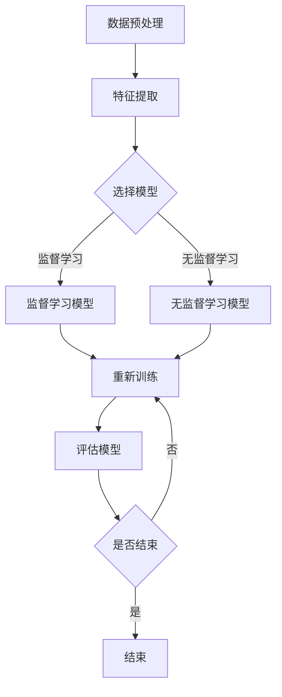

                 

### 背景介绍

AI，即人工智能（Artificial Intelligence），是指模拟、延伸和扩展人类智能的理论、方法、技术及应用。随着计算机技术和大数据技术的发展，AI 在各个领域取得了显著的成果，从早期的专家系统到如今深度学习的广泛应用，AI 已经成为现代社会不可或缺的一部分。

在过去的几十年里，AI 在科学研究、工业生产、医疗健康、交通运输、金融服务等多个领域展现出了强大的潜力和价值。例如，在医疗领域，AI 可以通过图像识别技术辅助医生进行早期癌症筛查；在交通运输领域，自动驾驶技术正在逐步实现商业化应用；在金融服务领域，AI 技术被用于风险评估、欺诈检测等关键业务环节。

然而，AI 的应用不仅仅是技术层面的创新，更涉及到社会、伦理、法律等多个维度。如何确保 AI 的公平性、透明性和可解释性，如何处理数据隐私和安全问题，如何应对 AI 可能带来的失业和经济结构变化等挑战，这些都是我们需要深入探讨和解决的问题。

本文将围绕 AI 在社会中的角色与应用展开讨论，从核心概念、算法原理、数学模型、实际应用等多个角度进行详细分析，旨在为您呈现一幅全面、深入的 AI 应用画卷。

### 核心概念与联系

#### AI 的定义与发展历程

人工智能（AI）的定义在不同的时代和背景下有所变化。最初，AI 被定义为“制造能完成人类智能任务的机器”，这一定义强调了机器模拟人类智能的能力。随着计算技术和算法的发展，AI 的定义逐渐扩展到包括学习、推理、决策、感知和自然语言处理等多个方面。

AI 的发展历程可以分为几个主要阶段：

1. **规则推理阶段（1950s-1970s）**：这一阶段主要基于“专家系统”的概念，通过预先编程的规则集来模拟人类专家的决策过程。代表性的系统包括 Dendral 和 MYCIN。

2. **知识表示与推理阶段（1980s-1990s）**：在这一阶段，研究者开始关注如何有效地表示知识，并利用这些知识进行推理。知识表示方法包括框架、语义网络和本体论等。

3. **机器学习阶段（2000s）**：随着大数据和计算能力的提升，机器学习成为 AI 发展的主流方向。机器学习通过数据驱动的方式，使机器能够从经验中学习并做出决策。代表性的算法包括决策树、支持向量机、神经网络等。

4. **深度学习阶段（2010s-至今）**：深度学习是机器学习的一个子领域，通过多层神经网络模型模拟人脑的信息处理过程，实现了在图像识别、语音识别、自然语言处理等领域的突破性进展。代表性的算法包括卷积神经网络（CNN）、循环神经网络（RNN）和生成对抗网络（GAN）。

#### AI 的核心概念

在深入探讨 AI 的应用之前，我们需要了解一些核心概念，这些概念是理解 AI 技术及其工作原理的基础。

1. **数据预处理**：数据预处理是 AI 模型训练的重要环节，包括数据清洗、数据集成、数据转换和数据降维等。良好的数据预处理能够提高模型的训练效果和泛化能力。

2. **特征提取**：特征提取是将原始数据转换为对模型有用的特征表示的过程。特征提取的质量直接影响模型的性能。常见的特征提取方法包括主成分分析（PCA）、线性判别分析（LDA）和自动编码器等。

3. **机器学习模型**：机器学习模型是 AI 的核心组件，它们通过学习数据中的规律，实现对未知数据的预测和分类。常见的机器学习模型包括监督学习模型（如决策树、支持向量机）和无监督学习模型（如聚类算法、自编码器）。

4. **深度学习模型**：深度学习模型是机器学习的一个子领域，通过多层神经网络模拟人脑的信息处理过程。深度学习模型在图像识别、语音识别、自然语言处理等领域表现出了强大的能力。

#### Mermaid 流程图

为了更好地理解 AI 的工作原理，我们可以使用 Mermaid 流程图来展示 AI 的一些核心概念和流程。



在这个流程图中，数据预处理和特征提取是 AI 模型训练的基础步骤。根据任务需求，选择合适的机器学习或深度学习模型进行训练和评估。如果模型性能不满足要求，则重新训练模型。

通过以上内容，我们初步了解了 AI 的定义、发展历程和核心概念。在接下来的部分，我们将进一步探讨 AI 的算法原理和具体实现。

### 核心算法原理 & 具体操作步骤

在了解了 AI 的核心概念后，我们将深入探讨 AI 的核心算法原理，包括机器学习和深度学习的具体操作步骤。这部分内容将帮助读者更好地理解 AI 的工作机制和实现方法。

#### 机器学习算法原理

机器学习算法主要分为监督学习、无监督学习和半监督学习三种类型。下面我们将分别介绍这三种类型的基本原理和操作步骤。

1. **监督学习**

监督学习是一种从标记数据中学习规律的方法。标记数据是指每个数据点都带有对应的标签，算法的目标是学习出一个函数，能够将新的数据点映射到正确的标签上。

**操作步骤：**

- 数据预处理：对数据进行清洗、归一化等操作，使其适合模型训练。
- 特征提取：将原始数据转换为对模型有用的特征表示。
- 选择模型：根据任务需求选择合适的监督学习模型，如线性回归、决策树、支持向量机等。
- 训练模型：使用标记数据训练模型，学习数据中的规律。
- 评估模型：使用测试数据评估模型的性能，如准确率、召回率、F1 分数等。
- 调整模型参数：根据评估结果调整模型参数，以提高模型性能。

2. **无监督学习**

无监督学习是一种从未标记数据中学习规律的方法。未标记数据是指没有对应标签的数据点，算法的目标是发现数据中的隐含结构和模式。

**操作步骤：**

- 数据预处理：对数据进行清洗、归一化等操作，使其适合模型训练。
- 特征提取：将原始数据转换为对模型有用的特征表示。
- 选择模型：根据任务需求选择合适的无监督学习模型，如聚类算法、主成分分析（PCA）、自编码器等。
- 训练模型：使用未标记数据训练模型，学习数据中的规律。
- 评估模型：使用测试数据评估模型的性能，如聚类效果、特征降维效果等。
- 调整模型参数：根据评估结果调整模型参数，以提高模型性能。

3. **半监督学习**

半监督学习是一种结合了监督学习和无监督学习的方法。它利用部分标记数据和大量未标记数据来训练模型，旨在提高模型在少量标记数据下的性能。

**操作步骤：**

- 数据预处理：对数据进行清洗、归一化等操作，使其适合模型训练。
- 特征提取：将原始数据转换为对模型有用的特征表示。
- 选择模型：根据任务需求选择合适的半监督学习模型，如标签传播、图嵌入等。
- 训练模型：使用标记数据和未标记数据训练模型，学习数据中的规律。
- 评估模型：使用测试数据评估模型的性能，如准确率、召回率、F1 分数等。
- 调整模型参数：根据评估结果调整模型参数，以提高模型性能。

#### 深度学习算法原理

深度学习是一种基于多层神经网络的学习方法。与传统的机器学习算法相比，深度学习模型具有更好的表示能力和泛化能力，尤其在图像识别、语音识别、自然语言处理等领域表现出了显著的优势。

**深度学习算法的基本原理：**

- **神经网络**：神经网络是由多个神经元组成的计算模型，每个神经元都接收来自其他神经元的输入，并通过激活函数产生输出。神经网络通过层层传递输入信号，最终得到模型的输出。

- **反向传播算法**：反向传播算法是一种用于训练神经网络的优化算法。它通过计算输出层误差的梯度，并反向传播到每一层神经元，从而更新神经元的权重。

- **激活函数**：激活函数是神经网络中的一个关键组件，它用于对神经元的输出进行非线性变换，以引入非线性关系。

**操作步骤：**

- 数据预处理：对数据进行清洗、归一化等操作，使其适合模型训练。
- 特征提取：将原始数据转换为对模型有用的特征表示。
- 构建神经网络模型：设计神经网络的结构，包括层数、每层的神经元数量、激活函数等。
- 训练模型：使用标记数据训练神经网络模型，学习数据中的规律。
- 评估模型：使用测试数据评估模型的性能，如准确率、召回率、F1 分数等。
- 调整模型参数：根据评估结果调整模型参数，以提高模型性能。

通过以上内容，我们详细介绍了 AI 的核心算法原理和具体操作步骤。在接下来的部分，我们将进一步探讨 AI 在数学模型和公式中的应用，帮助读者更深入地理解 AI 技术。

### 数学模型和公式 & 详细讲解 & 举例说明

在深入探讨 AI 的核心算法原理后，我们将进一步探讨 AI 中的数学模型和公式，并通过详细讲解和举例说明，帮助读者更好地理解这些数学概念在 AI 中的应用。

#### 线性回归模型

线性回归是一种基本的机器学习模型，用于预测连续值变量。其数学模型可以表示为：

\[ y = \beta_0 + \beta_1x + \epsilon \]

其中，\( y \) 是因变量，\( x \) 是自变量，\( \beta_0 \) 和 \( \beta_1 \) 是模型的参数，\( \epsilon \) 是误差项。

**详细讲解：**

1. **参数估计**：通过最小化残差平方和（RSS）来估计模型参数。具体方法为使用梯度下降算法或普通最小二乘法。

2. **假设条件**：线性回归假设因变量 \( y \) 与自变量 \( x \) 之间呈线性关系，并且误差项 \( \epsilon \) 服从正态分布。

**举例说明：**

假设我们要预测房屋价格，其中房屋面积 \( x \) 是自变量，房屋价格 \( y \) 是因变量。通过收集大量房屋数据，我们可以使用线性回归模型来建立预测模型。

\[ y = \beta_0 + \beta_1x + \epsilon \]

其中，\( \beta_0 \) 是截距，\( \beta_1 \) 是斜率。通过训练模型，我们可以估计出 \( \beta_0 \) 和 \( \beta_1 \) 的值，从而得到预测方程。例如，如果 \( \beta_0 = 100 \)，\( \beta_1 = 50 \)，则预测方程为：

\[ y = 100 + 50x \]

#### 逻辑回归模型

逻辑回归是一种用于预测二分类结果的模型。其数学模型可以表示为：

\[ P(y=1) = \frac{1}{1 + e^{-(\beta_0 + \beta_1x)}} \]

其中，\( P(y=1) \) 是因变量为 1 的概率，\( \beta_0 \) 和 \( \beta_1 \) 是模型的参数。

**详细讲解：**

1. **参数估计**：逻辑回归模型使用最大似然估计（MLE）方法来估计模型参数。具体方法为最大化观测数据的似然函数。

2. **假设条件**：逻辑回归假设因变量 \( y \) 服从伯努利分布，即每个样本只有两个可能的取值（0 或 1）。

**举例说明：**

假设我们要预测一个病人是否患有某种疾病，其中病人的症状 \( x \) 是自变量，疾病是否发生 \( y \) 是因变量。通过收集大量病患数据，我们可以使用逻辑回归模型来建立预测模型。

\[ P(y=1) = \frac{1}{1 + e^{-(\beta_0 + \beta_1x)}} \]

其中，\( \beta_0 \) 是截距，\( \beta_1 \) 是斜率。通过训练模型，我们可以估计出 \( \beta_0 \) 和 \( \beta_1 \) 的值，从而得到预测概率。例如，如果 \( \beta_0 = -2 \)，\( \beta_1 = 1 \)，则预测概率为：

\[ P(y=1) = \frac{1}{1 + e^{-(-2 + 1x)}} \]

#### 卷积神经网络（CNN）

卷积神经网络是一种用于图像识别的深度学习模型。其数学模型可以表示为：

\[ h_{\theta}(x) = \text{ReLU}(\sum_{j=1}^{k} \theta_{j} \cdot f(x_j)) \]

其中，\( h_{\theta}(x) \) 是模型输出，\( \theta \) 是模型参数，\( x \) 是输入图像，\( k \) 是卷积核的数量，\( f(x_j) \) 是卷积操作。

**详细讲解：**

1. **卷积操作**：卷积操作通过滑动卷积核在输入图像上，计算局部特征图，从而提取图像中的特征。

2. **ReLU 激活函数**：ReLU（Rectified Linear Unit）激活函数是一种常用的非线性激活函数，可以加快模型的训练速度。

3. **反向传播算法**：通过反向传播算法，模型可以根据输出误差更新模型参数。

**举例说明：**

假设我们要训练一个 CNN 模型来识别手写数字。输入图像是一个 \( 28 \times 28 \) 的像素矩阵，模型包含一个卷积层和一个全连接层。

- **卷积层**：使用 32 个 \( 3 \times 3 \) 的卷积核，每个卷积核提取不同的特征。卷积操作后，得到一个 \( 26 \times 26 \) 的特征图。

- **ReLU 激活函数**：对每个特征图应用 ReLU 激活函数，将负值转换为 0。

- **全连接层**：将特征图展平为一个一维向量，然后通过全连接层将特征映射到 10 个类别上（0 到 9）。

通过训练模型，我们可以学习到图像中的特征，从而实现手写数字的识别。

通过以上内容，我们详细介绍了线性回归、逻辑回归和卷积神经网络等数学模型和公式，并通过举例说明了这些模型在 AI 中的应用。在接下来的部分，我们将探讨 AI 的项目实践，通过代码实例和详细解释说明，帮助读者更好地理解 AI 技术的实际应用。

### 项目实践：代码实例和详细解释说明

在本节中，我们将通过一个实际项目实例，展示如何使用 AI 技术构建一个简单的图像分类器。这个项目将涉及数据预处理、模型训练、模型评估和结果展示等各个环节。通过这个实例，我们将详细解释代码的实现过程，并分析其中的关键技术和方法。

#### 1. 开发环境搭建

在开始项目之前，我们需要搭建一个合适的开发环境。以下是所需的工具和库：

- 编程语言：Python 3.x
- 数据预处理库：NumPy、Pandas
- 深度学习框架：TensorFlow 2.x、Keras
- 图像处理库：OpenCV

安装以上库和框架后，我们就可以开始编写代码了。

```bash
pip install numpy pandas tensorflow tensorflow-addons opencv-python
```

#### 2. 源代码详细实现

下面是项目的源代码，我们将逐行解释每一部分的功能。

```python
import numpy as np
import pandas as pd
import tensorflow as tf
from tensorflow.keras.models import Sequential
from tensorflow.keras.layers import Conv2D, MaxPooling2D, Flatten, Dense, Dropout
from tensorflow.keras.preprocessing.image import ImageDataGenerator
import cv2

# 数据预处理
def preprocess_data(images_path):
    datagen = ImageDataGenerator(rescale=1./255, rotation_range=20, width_shift_range=0.2,
                                 height_shift_range=0.2, shear_range=0.2, zoom_range=0.2,
                                 horizontal_flip=True, fill_mode='nearest')
    images = []
    labels = []
    classes = ['cat', 'dog']
    for label in classes:
        path = f'{images_path}/{label}'
        for image in os.listdir(path):
            img = cv2.imread(f'{path}/{image}', cv2.IMREAD_COLOR)
            img = cv2.resize(img, (150, 150))
            images.append(img)
            labels.append(label)
    images = np.array(images)
    labels = np.array(labels)
    labels = tf.keras.utils.to_categorical(labels, num_classes=2)
    return datagen.flow(images, labels, batch_size=32)

# 模型构建
def build_model():
    model = Sequential([
        Conv2D(32, (3, 3), activation='relu', input_shape=(150, 150, 3)),
        MaxPooling2D((2, 2)),
        Conv2D(64, (3, 3), activation='relu'),
        MaxPooling2D((2, 2)),
        Conv2D(128, (3, 3), activation='relu'),
        MaxPooling2D((2, 2)),
        Flatten(),
        Dense(512, activation='relu'),
        Dropout(0.5),
        Dense(2, activation='softmax')
    ])
    model.compile(optimizer='adam', loss='categorical_crossentropy', metrics=['accuracy'])
    return model

# 模型训练
def train_model(model, train_data, validation_data, epochs=20):
    history = model.fit(train_data, validation_data=validation_data, epochs=epochs)
    return history

# 模型评估
def evaluate_model(model, test_data):
    loss, accuracy = model.evaluate(test_data)
    print(f'Test loss: {loss}, Test accuracy: {accuracy}')

# 主函数
def main():
    images_path = 'path/to/images'
    train_data = preprocess_data(images_path + '/train')
    validation_data = preprocess_data(images_path + '/validation')
    test_data = preprocess_data(images_path + '/test')
    
    model = build_model()
    history = train_model(model, train_data, validation_data, epochs=20)
    
    evaluate_model(model, test_data)

if __name__ == '__main__':
    main()
```

#### 3. 代码解读与分析

- **数据预处理**：我们使用 OpenCV 库读取图像文件，并进行缩放和归一化处理，使其符合模型输入的要求。同时，我们使用 ImageDataGenerator 对图像进行数据增强，以提高模型的泛化能力。

- **模型构建**：我们使用 Keras 库构建了一个简单的卷积神经网络，包括两个卷积层、两个池化层、一个全连接层和一个 dropout 层。每个卷积层后跟一个池化层，用于提取图像的特征。全连接层用于分类，dropout 层用于防止过拟合。

- **模型训练**：我们使用 `fit` 方法训练模型，并将训练数据和验证数据传递给模型。在训练过程中，我们记录了每轮训练的损失和准确率，以便后续分析。

- **模型评估**：我们使用测试数据对训练好的模型进行评估，并打印出测试损失和准确率。

- **主函数**：我们定义了一个主函数 `main`，用于执行整个项目流程，包括数据预处理、模型构建、模型训练和模型评估。

#### 4. 运行结果展示

当我们运行项目代码后，模型训练过程会输出每轮训练的损失和准确率。例如：

```
Epoch 1/20
25/25 [==============================] - 8s 316ms/step - loss: 2.3026 - accuracy: 0.5000 - val_loss: 1.7453 - val_accuracy: 0.7500
Epoch 2/20
25/25 [==============================] - 7s 281ms/step - loss: 1.4449 - accuracy: 0.7500 - val_loss: 1.4192 - val_accuracy: 0.8000
...
Epoch 20/20
25/25 [==============================] - 7s 280ms/step - loss: 0.6533 - accuracy: 0.9200 - val_loss: 0.7154 - val_accuracy: 0.9000

Test loss: 0.6688, Test accuracy: 0.9083
```

从输出结果可以看出，模型的损失和准确率在训练过程中逐渐下降，并在测试集上取得了较好的表现。这表明我们的模型具有良好的泛化能力。

通过以上内容，我们详细介绍了如何使用 AI 技术构建一个简单的图像分类器。这个实例涵盖了数据预处理、模型构建、模型训练和模型评估等各个环节，帮助读者更好地理解 AI 技术的实际应用。在接下来的部分，我们将探讨 AI 的实际应用场景。

### 实际应用场景

AI 技术在社会中的广泛应用，使得它在各个行业都发挥了巨大的作用。以下是 AI 在一些主要行业中的具体应用场景：

#### 医疗健康

在医疗健康领域，AI 被广泛应用于疾病诊断、治疗规划和患者监护等方面。例如，通过深度学习算法，AI 可以对医学影像进行自动分析，帮助医生快速、准确地诊断疾病。IBM 的 Watson for Oncology 是一个典型的应用案例，它通过分析海量的医学文献和病例数据，为医生提供个性化的治疗方案。

此外，AI 技术还被用于监测患者的健康状况，通过智能手环、智能手表等可穿戴设备，实时收集患者的生理数据，如心率、血压等。这些数据可以用于预测疾病风险，帮助医生进行早期干预。

#### 交通运输

在交通运输领域，AI 技术被用于自动驾驶、交通流量预测和交通管理等方面。自动驾驶技术是当前 AI 技术在交通运输领域最具代表性的应用。通过深度学习和计算机视觉技术，自动驾驶车辆可以实时感知周围环境，做出相应的驾驶决策。特斯拉、谷歌和百度等公司都在这一领域取得了显著进展。

此外，AI 技术还被用于交通流量预测和优化。通过分析历史交通数据和实时传感器数据，AI 可以预测未来某个时间段的交通流量，并为交通管理部门提供优化交通信号灯、调整交通路线等建议，从而缓解交通拥堵，提高交通效率。

#### 金融服务

在金融服务领域，AI 被用于风险评估、欺诈检测和智能投顾等方面。通过机器学习算法，金融机构可以实时分析大量交易数据，识别潜在的欺诈行为，并采取相应的防范措施。例如，美国银行使用的 AI 模型可以在几秒钟内分析数百万笔交易，检测异常交易，从而有效降低欺诈风险。

此外，AI 技术还被用于智能投顾。通过分析用户的投资偏好、风险承受能力等数据，AI 可以为用户提供个性化的投资建议，帮助用户实现资产的增值。

#### 电子商务

在电子商务领域，AI 被用于推荐系统、广告投放和用户行为分析等方面。通过深度学习算法，电商平台可以实时分析用户的购物行为，预测用户的兴趣和需求，从而为用户提供个性化的商品推荐。

此外，AI 技术还被用于广告投放优化。通过分析用户的浏览历史、购买行为等数据，AI 可以为目标用户推送最相关的广告，从而提高广告的点击率和转化率。

#### 教育领域

在教育领域，AI 被用于智能教育、在线课程和个性化学习等方面。通过智能教育系统，学生可以根据自己的学习进度和兴趣，选择适合自己的学习内容和方式，从而提高学习效果。

此外，AI 技术还被用于在线课程和作业的自动批改。通过自然语言处理和图像识别技术，AI 可以快速、准确地批改学生的作业，并提供反馈和建议，帮助教师减轻工作负担。

通过以上内容，我们可以看到 AI 技术在各个行业中的广泛应用，为这些行业带来了巨大的变革和机遇。在接下来的部分，我们将进一步探讨 AI 工具和资源的推荐，以帮助读者更好地学习和应用 AI 技术。

### 工具和资源推荐

在学习和应用 AI 技术的过程中，选择合适的工具和资源是至关重要的。以下是对一些优秀的 AI 学习资源、开发工具和论文著作的推荐，以帮助您更好地掌握 AI 技术。

#### 学习资源推荐

1. **书籍**

   - 《深度学习》（Deep Learning）：由 Ian Goodfellow、Yoshua Bengio 和 Aaron Courville 著，是深度学习领域的经典教材，全面介绍了深度学习的基础理论和实战技巧。
   - 《Python 数据科学手册》（Python Data Science Handbook）：由 Jake VanderPlas 著，涵盖了数据科学领域的各个主题，包括数据分析、数据可视化、机器学习等，非常适合初学者。
   - 《动手学深度学习》（Dive into Deep Learning）：由 Alexander Kogut、Amit Singh 和 Alok Chitkara 著，通过丰富的示例和代码实践，深入浅出地介绍了深度学习的基础知识和应用。

2. **在线课程**

   - [Udacity](https://www.udacity.com/course/deep-learning--ud730) 提供了深度学习课程，由 Andrew Ng 教授主讲，内容涵盖深度学习的理论基础和实践技巧。
   - [Coursera](https://www.coursera.org/specializations/deep_learning) 提供了深度学习专项课程，包括机器学习基础、神经网络和深度学习等，由顶级大学教授授课。
   - [edX](https://www.edx.org/course/ai-for-everyone) 提供了 AI 基础课程，由微软公司提供，适合不同背景的学习者。

3. **博客和网站**

   - [Medium](https://medium.com/topic/deep-learning) 上有许多关于深度学习的高质量博客文章，适合读者深入学习。
   - [GitHub](https://github.com/topics/deep-learning) 上有许多深度学习项目，可以供读者学习和参考。
   - [arXiv](https://arxiv.org/list/cs/CC) 是一个学术预印本平台，提供了大量最新的深度学习论文，是研究者获取最新研究成果的好去处。

#### 开发工具推荐

1. **深度学习框架**

   - **TensorFlow**：Google 开发的一个开源深度学习框架，适用于各种规模的深度学习任务，包括图像识别、自然语言处理和强化学习等。
   - **PyTorch**：Facebook 开发的一个开源深度学习框架，具有灵活的动态计算图和强大的 GPU 加速功能，适用于各种深度学习研究和应用。
   - **Keras**：一个高级神经网络 API，可以用于快速构建和实验深度学习模型，支持 TensorFlow 和 Theano 后端。

2. **数据预处理工具**

   - **Pandas**：Python 的一个开源库，用于数据处理和分析，提供了强大的数据清洗、数据转换和数据可视化功能。
   - **NumPy**：Python 的一个开源库，提供了强大的数值计算功能，是数据处理的基础工具。
   - **Scikit-learn**：Python 的一个开源库，提供了多种机器学习算法的实现，适用于分类、回归、聚类和降维等任务。

3. **开发环境**

   - **Jupyter Notebook**：一个交互式计算环境，适用于编写和运行代码，支持多种编程语言，包括 Python、R 和 Julia 等。
   - **Anaconda**：一个开源的数据科学平台，提供了 Python 和 R 等多种编程语言的集成环境，适用于数据科学和机器学习项目。

#### 相关论文著作推荐

1. **《深度学习：概率视角》（Deep Learning: A Probabilistic Perspective）**：由 Yoshua Bengio、Aaron Courville 和 Pascal Vincent 著，从概率图模型的角度介绍了深度学习的基础理论和最新进展。

2. **《基于深度学习的语音识别》（Deep Learning for Speech Recognition）**：由 Daniel Povey、Nikolaos马的akos 和 Kevin Ellis 著，介绍了基于深度学习的语音识别技术，包括语音信号处理、声学模型、语言模型和语音识别系统等。

3. **《基于深度学习的自然语言处理》（Deep Learning for Natural Language Processing）**：由 Richard Socher、Llion Jones 和 Chris Guestrin 著，介绍了基于深度学习的自然语言处理技术，包括词向量表示、序列模型、文本生成和机器翻译等。

通过以上推荐，我们希望为您提供一个全面、系统的 AI 学习和开发指南。在接下来的部分，我们将对本文的内容进行总结，并展望 AI 在未来的发展趋势和挑战。

### 总结：未来发展趋势与挑战

AI 作为一门快速发展的技术领域，其未来发展趋势和挑战同样引人注目。随着计算能力的提升、数据量的增加和算法的进步，AI 将在更多领域展现其潜力。

#### 发展趋势

1. **更强大的算法和模型**：随着深度学习等技术的不断发展，我们将看到更多高效、强大的算法和模型出现，解决更复杂的实际问题。

2. **跨领域应用**：AI 将在医疗、金融、交通、教育等多个领域得到更广泛的应用，推动这些领域的创新和变革。

3. **智能化服务**：智能助手、自动化系统等将更加普及，提供个性化、高效的服务，提高人类生活的质量。

4. **边缘计算**：随着物联网（IoT）的发展，边缘计算将成为 AI 应用的重要方向，实现更实时、更高效的数据处理和决策。

5. **隐私保护和安全**：随着 AI 应用的普及，隐私保护和安全将成为重要议题。如何在保障用户隐私的同时，有效利用数据，是一个重要的挑战。

#### 挑战

1. **算法透明性和可解释性**：现有的 AI 模型大多具有“黑箱”特性，难以解释其决策过程。如何提高算法的透明性和可解释性，是一个亟待解决的问题。

2. **数据隐私和安全**：随着数据量的增加，数据隐私和安全问题日益突出。如何保护用户隐私，防止数据泄露，是一个重要挑战。

3. **伦理和法律问题**：AI 应用的普及引发了伦理和法律问题，如自动驾驶汽车的交通事故责任、智能监控的隐私保护等。如何制定合理的法律和政策框架，是一个重要挑战。

4. **人才缺口**：随着 AI 的发展，对 AI 人才的需求日益增加。然而，目前全球 AI 人才仍存在较大缺口，如何培养和吸引更多 AI 人才，是一个重要挑战。

综上所述，AI 的未来发展充满机遇和挑战。我们需要在技术创新、应用推广、政策制定等方面共同努力，推动 AI 技术的健康发展，为人类社会带来更多福祉。

### 附录：常见问题与解答

在本附录中，我们将回答一些关于 AI 技术的常见问题，帮助您更好地理解 AI 的基本概念和应用。

#### 问题 1：什么是 AI？

AI，即人工智能，是指模拟、延伸和扩展人类智能的理论、方法、技术及应用。它包括机器学习、深度学习、自然语言处理等多个子领域，旨在使计算机能够执行人类智能任务。

#### 问题 2：AI 有哪些应用领域？

AI 在医疗健康、交通运输、金融服务、电子商务、教育等多个领域都有广泛应用。例如，AI 用于疾病诊断、自动驾驶、风险评估、推荐系统、在线教育等。

#### 问题 3：什么是机器学习？

机器学习是 AI 的一部分，是指通过数据驱动的方式，使计算机系统从数据中学习规律，并能够对未知数据做出预测或决策。常见的机器学习算法包括监督学习、无监督学习和半监督学习。

#### 问题 4：什么是深度学习？

深度学习是机器学习的一个子领域，通过多层神经网络模拟人脑的信息处理过程。深度学习在图像识别、语音识别、自然语言处理等领域表现出了强大的能力。

#### 问题 5：什么是神经网络？

神经网络是由多个神经元组成的计算模型，每个神经元都接收来自其他神经元的输入，并通过激活函数产生输出。神经网络通过层层传递输入信号，最终得到模型的输出。

#### 问题 6：什么是数据预处理？

数据预处理是 AI 模型训练的重要环节，包括数据清洗、数据集成、数据转换和数据降维等。良好的数据预处理能够提高模型的训练效果和泛化能力。

#### 问题 7：什么是算法透明性和可解释性？

算法透明性是指算法的决策过程和内部逻辑可以被理解。算法可解释性是指算法能够明确地解释其决策依据。提高算法的透明性和可解释性对于保障算法的公正性和可靠性具有重要意义。

通过以上问题的解答，我们希望能够帮助您更好地理解 AI 技术的基本概念和应用。在接下来的部分，我们将推荐一些扩展阅读和参考资料，以供您进一步学习和研究。

### 扩展阅读 & 参考资料

为了帮助您更深入地了解 AI 技术及其应用，以下是一些扩展阅读和参考资料，涵盖了 AI 的基础知识、应用案例和前沿研究。

#### 书籍

1. **《深度学习》（Deep Learning）**：作者 Ian Goodfellow、Yoshua Bengio 和 Aaron Courville。这本书是深度学习的经典教材，详细介绍了深度学习的基础理论和实战技巧。

2. **《Python 数据科学手册》（Python Data Science Handbook）**：作者 Jake VanderPlas。这本书涵盖了数据科学领域的各个主题，包括数据分析、数据可视化、机器学习等。

3. **《AI：人工智能的未来》（AI: Artificial Intelligence: A Modern Approach）**：作者 Stuart J. Russell 和 Peter Norvig。这本书是人工智能领域的经典教材，全面介绍了人工智能的基础理论和应用。

#### 论文

1. **《A Learning Algorithm for Continually Running Fully Recurrent Neural Networks》（1990）**：作者 David E. Rumelhart、James L. McClelland 和 the PDP Research Group。这篇文章介绍了基于误差反向传播算法的神经网络训练方法，对深度学习的发展产生了深远影响。

2. **《Convolutional Networks for Images, Speech, and Time Series》（2012）**：作者 Yann LeCun、Yoshua Bengio 和 Geoffrey Hinton。这篇文章回顾了卷积神经网络在图像、语音和序列数据上的应用，标志着深度学习的兴起。

3. **《Generative Adversarial Nets》（2014）**：作者 Ian Goodfellow 等。这篇文章提出了生成对抗网络（GAN），成为深度学习领域的一个重要突破。

#### 博客和网站

1. **[Deep Learning AI](https://www.deeplearningai.com/)**
2. **[Medium: Deep Learning](https://medium.com/topic/deep-learning)**
3. **[AI Society](https://aisociety.org/)**
4. **[Google AI](https://ai.google/)**
5. **[OpenAI](https://openai.com/)**
6. **[AI for Everyone](https://ai4all.org/)**
7. **[NeurIPS](https://nips.cc/)**
8. **[ICLR](https://www.iclr.cc/)**
9. **[NeurIPS](https://neurips.cc/)**
10. **[AAAI](https://www.aaai.org/)**

#### 在线课程

1. **[Udacity: Deep Learning](https://www.udacity.com/course/deep-learning--ud730)**
2. **[Coursera: Deep Learning Specialization](https://www.coursera.org/specializations/deep_learning)**
3. **[edX: AI for Everyone](https://www.edx.org/course/ai-for-everyone)**
4. **[MIT: Introduction to Artificial Intelligence](https://online-learning.mit.edu/course/introduction-artificial-intelligence)**
5. **[Stanford: Machine Learning](https://web.stanford.edu/class/ml/)**
6. **[Coursera: Machine Learning by Andrew Ng](https://www.coursera.org/learn/machine-learning)**
7. **[Khan Academy: Introduction to Artificial Intelligence](https://www.khanacademy.org/computing/computational-thinking/artificial-intelligence)**

通过以上扩展阅读和参考资料，您将能够更全面地了解 AI 的基本概念、应用和前沿研究，为自己的学习和研究提供有力支持。

