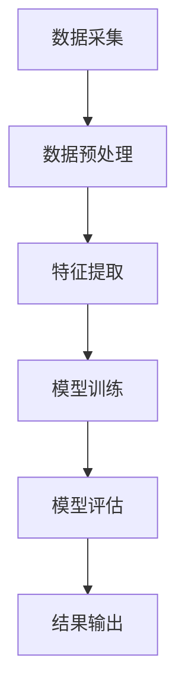

                 

 关键词：人工智能，科学研究，深度学习，数据挖掘，应用场景，算法，技术发展，数学模型，项目实践。

> 摘要：本文将探讨人工智能在科学研究中的应用，通过分析核心算法原理、数学模型构建、具体操作步骤和实际项目实践，揭示人工智能如何助力科学研究领域的发展，展望未来的应用前景和面临的挑战。

## 1. 背景介绍

### 1.1 人工智能的定义与发展历程

人工智能（Artificial Intelligence，简称AI）是一门涉及计算机科学、心理学、神经科学和数学等多个领域的交叉学科。人工智能旨在创建能够模拟、延伸和扩展人类智能的计算机系统。自20世纪50年代诞生以来，人工智能经历了多个阶段的发展：

- **早期阶段（1950s-1970s）**：以符号主义和逻辑推理为核心，代表性成果包括推理机、专家系统和自然语言处理等。

- **中间阶段（1980s-1990s）**：以知识表示和知识推理为主，算法逐渐转向机器学习，代表性成果包括神经网络、决策树和支持向量机等。

- **当前阶段（2000s至今）**：以深度学习为代表，算法逐渐转向大数据和计算能力，代表性成果包括卷积神经网络（CNN）、循环神经网络（RNN）和生成对抗网络（GAN）等。

### 1.2 人工智能在科学研究中的重要性

随着数据量的爆炸式增长和计算能力的提升，人工智能在科学研究中的地位日益重要。人工智能不仅能够提高研究效率，还可以带来新的研究思路和方法。以下是人工智能在科学研究中的重要应用领域：

- **生物信息学**：通过人工智能技术，研究人员可以快速识别基因序列、预测蛋白质结构等，从而推动生物医学研究的发展。

- **环境科学**：人工智能可以帮助研究人员分析气候变化、预测自然灾害等，为环境保护和可持续发展提供科学依据。

- **天文学**：人工智能可以处理海量天文数据，发现新的天体和现象，推动天文学研究的进展。

- **材料科学**：人工智能可以帮助研究人员预测材料的物理和化学性质，为新材料的发现和开发提供支持。

## 2. 核心概念与联系

### 2.1 人工智能核心概念原理

#### 2.1.1 深度学习

深度学习是人工智能的一个重要分支，通过模拟人脑神经元连接结构，构建多层神经网络，实现对数据的自动特征提取和分类。深度学习的核心概念包括：

- **神经网络**：神经网络由大量相互连接的神经元组成，每个神经元都是一个简单的计算单元。

- **深度**：神经网络中的层数称为深度，深度越大的神经网络可以提取更复杂的特征。

- **激活函数**：激活函数用于决定神经元是否被激活，常用的激活函数包括Sigmoid、ReLU和Tanh等。

- **反向传播**：反向传播是一种用于训练神经网络的算法，通过不断调整网络权重，使网络输出与期望输出之间的误差最小化。

#### 2.1.2 数据挖掘

数据挖掘是从大量数据中发现潜在模式和规律的过程。数据挖掘的核心概念包括：

- **数据预处理**：数据预处理包括数据清洗、数据集成、数据转换和数据归一化等步骤。

- **特征选择**：特征选择是从大量特征中选取对目标变量有较强预测能力的特征。

- **模型评估**：模型评估用于评估模型的准确性和泛化能力，常用的评估指标包括准确率、召回率、F1值和AUC等。

### 2.2 人工智能在科学研究中的应用架构

以下是一个典型的应用架构，展示了人工智能在科学研究中的应用流程：



- **数据采集**：从各种来源收集数据，如数据库、传感器、实验设备等。

- **数据预处理**：对原始数据进行清洗、去噪、归一化等处理，以提高数据质量。

- **特征提取**：从预处理后的数据中提取有助于模型训练的特征。

- **模型训练**：使用深度学习或数据挖掘算法训练模型，通过调整参数和优化网络结构，使模型输出更接近期望结果。

- **模型评估**：评估模型的准确性、泛化能力和鲁棒性，确保模型在实际应用中的可靠性。

- **结果输出**：将模型输出应用于实际问题，如预测、分类或决策等。

## 3. 核心算法原理 & 具体操作步骤

### 3.1 算法原理概述

#### 3.1.1 深度学习算法

深度学习算法的核心是多层神经网络，通过逐层提取数据特征，实现对数据的自动分类和预测。以下是一个简单的多层神经网络模型：

- **输入层**：接收原始数据。

- **隐藏层**：对输入数据进行特征提取。

- **输出层**：根据隐藏层特征进行分类或预测。

#### 3.1.2 数据挖掘算法

数据挖掘算法包括监督学习和无监督学习两大类：

- **监督学习**：通过已有标签数据训练模型，对新数据进行预测。

- **无监督学习**：没有标签数据，通过数据自身的分布和结构进行聚类或降维。

### 3.2 算法步骤详解

#### 3.2.1 深度学习算法步骤

1. **数据预处理**：对数据进行归一化、缺失值填充等处理。

2. **构建神经网络模型**：设计网络结构，包括输入层、隐藏层和输出层。

3. **参数初始化**：随机初始化网络参数。

4. **前向传播**：将输入数据通过网络进行传播，计算输出结果。

5. **反向传播**：计算输出结果与期望结果之间的误差，通过梯度下降算法调整网络参数。

6. **模型评估**：评估模型的准确性、泛化能力和鲁棒性。

7. **模型优化**：通过调整网络结构、优化算法等提高模型性能。

#### 3.2.2 数据挖掘算法步骤

1. **数据预处理**：对数据进行清洗、去噪、归一化等处理。

2. **特征选择**：选择对目标变量有较强预测能力的特征。

3. **构建模型**：选择合适的监督学习或无监督学习算法构建模型。

4. **模型训练**：使用训练数据进行模型训练。

5. **模型评估**：评估模型的准确性、泛化能力和鲁棒性。

6. **模型优化**：通过调整算法参数、特征选择等优化模型性能。

### 3.3 算法优缺点

#### 3.3.1 深度学习算法优缺点

**优点**：

- **强大的特征提取能力**：深度学习可以从大量数据中自动提取特征，无需人工干预。

- **良好的泛化能力**：深度学习模型可以在不同领域和任务中取得良好的效果。

**缺点**：

- **需要大量数据**：深度学习算法对数据量的要求较高，难以在小数据集上取得理想效果。

- **计算资源消耗大**：深度学习算法需要大量的计算资源和时间进行训练和推断。

#### 3.3.2 数据挖掘算法优缺点

**优点**：

- **适合处理大规模数据**：数据挖掘算法可以在大规模数据集上快速发现潜在模式和规律。

- **可解释性强**：数据挖掘算法通常具有较好的可解释性，便于研究人员理解和使用。

**缺点**：

- **特征工程依赖性强**：数据挖掘算法对特征工程的要求较高，需要人工干预选择特征。

- **模型泛化能力有限**：数据挖掘算法在不同领域和任务上的泛化能力有限。

### 3.4 算法应用领域

深度学习和数据挖掘算法在科学研究领域具有广泛的应用，以下是几个典型应用领域：

- **生物信息学**：通过深度学习算法对基因序列进行分类和预测，推动生物医学研究的发展。

- **环境科学**：通过数据挖掘算法分析环境数据，预测气候变化和自然灾害，为环境保护提供科学依据。

- **天文学**：通过深度学习算法处理天文数据，发现新的天体和现象，推动天文学研究的发展。

- **材料科学**：通过数据挖掘算法预测材料的物理和化学性质，为新材料的发现和开发提供支持。

## 4. 数学模型和公式 & 详细讲解 & 举例说明

### 4.1 数学模型构建

在人工智能应用中，数学模型起到了核心作用。以下是一个简单的神经网络数学模型：

$$
y = \sigma(W \cdot x + b)
$$

其中，$y$ 为输出，$x$ 为输入，$W$ 为权重矩阵，$b$ 为偏置项，$\sigma$ 为激活函数。该模型通过逐层计算，实现对输入数据的特征提取和分类。

### 4.2 公式推导过程

假设我们有一个三层神经网络，输入层有 $n$ 个神经元，隐藏层有 $m$ 个神经元，输出层有 $k$ 个神经元。我们可以将神经网络模型表示为：

$$
\begin{aligned}
h &= \sigma(W_1 \cdot x + b_1) \\
y &= \sigma(W_2 \cdot h + b_2)
\end{aligned}
$$

其中，$h$ 为隐藏层输出，$y$ 为输出层输出，$W_1$ 和 $W_2$ 分别为权重矩阵，$b_1$ 和 $b_2$ 分别为偏置项。

我们可以对上述模型进行反向传播，计算权重矩阵和偏置项的梯度，从而优化模型。具体推导过程如下：

$$
\begin{aligned}
\frac{\partial y}{\partial W_2} &= \frac{\partial y}{\partial h} \cdot \frac{\partial h}{\partial W_2} \\
\frac{\partial y}{\partial b_2} &= \frac{\partial y}{\partial h} \cdot \frac{\partial h}{\partial b_2} \\
\frac{\partial h}{\partial W_1} &= \frac{\partial h}{\partial x} \cdot \frac{\partial x}{\partial W_1} \\
\frac{\partial h}{\partial b_1} &= \frac{\partial h}{\partial x} \cdot \frac{\partial x}{\partial b_1}
\end{aligned}
$$

### 4.3 案例分析与讲解

#### 4.3.1 生物信息学案例

假设我们有一个基因表达数据集，包含 $n$ 个基因和 $m$ 个样本。我们希望通过深度学习算法对基因进行分类，以预测样本的疾病状态。

1. **数据预处理**：对基因表达数据进行归一化处理，将数据缩放到 [0, 1] 范围内。

2. **构建神经网络模型**：设计一个简单的多层神经网络，输入层有 $n$ 个神经元，隐藏层有 $m$ 个神经元，输出层有 2 个神经元，分别表示正常和疾病状态。

3. **模型训练**：使用训练数据进行模型训练，通过反向传播算法优化模型。

4. **模型评估**：使用验证数据集评估模型性能，调整模型参数，提高模型准确性。

5. **模型应用**：将训练好的模型应用于新的样本数据，预测样本的疾病状态。

#### 4.3.2 环境科学案例

假设我们有一个环境监测数据集，包含 $n$ 个监测指标和 $m$ 个时间段。我们希望通过数据挖掘算法预测下一时间段的环境质量指数（AQI）。

1. **数据预处理**：对监测数据进行清洗和归一化处理，去除异常值。

2. **特征选择**：选择对 AQI 有较强预测能力的特征，如 PM2.5、PM10、SO2 等。

3. **构建模型**：选择一个合适的监督学习算法，如决策树、随机森林等。

4. **模型训练**：使用训练数据进行模型训练，调整模型参数，提高预测准确性。

5. **模型评估**：使用验证数据集评估模型性能，调整模型参数，提高模型泛化能力。

6. **模型应用**：将训练好的模型应用于新的监测数据，预测下一时间段的环境质量指数。

## 5. 项目实践：代码实例和详细解释说明

### 5.1 开发环境搭建

为了进行项目实践，我们需要搭建一个合适的开发环境。以下是一个基于 Python 的开发环境搭建步骤：

1. **安装 Python**：从官方网站下载并安装 Python 3.8 版本。

2. **安装 Jupyter Notebook**：在终端中运行以下命令安装 Jupyter Notebook：

```bash
pip install notebook
```

3. **安装相关库**：在终端中运行以下命令安装所需库：

```bash
pip install numpy pandas matplotlib tensorflow scikit-learn
```

### 5.2 源代码详细实现

以下是一个简单的生物信息学项目，使用深度学习算法对基因表达数据集进行分类。

```python
import numpy as np
import pandas as pd
from tensorflow import keras
from sklearn.model_selection import train_test_split

# 读取数据
data = pd.read_csv('gene_expression.csv')
X = data.iloc[:, :-1].values
y = data.iloc[:, -1].values

# 数据预处理
X = X / 10000
y = keras.utils.to_categorical(y)

# 划分训练集和测试集
X_train, X_test, y_train, y_test = train_test_split(X, y, test_size=0.2, random_state=42)

# 构建模型
model = keras.Sequential([
    keras.layers.Dense(64, activation='relu', input_shape=(X_train.shape[1],)),
    keras.layers.Dense(64, activation='relu'),
    keras.layers.Dense(2, activation='softmax')
])

# 编译模型
model.compile(optimizer='adam', loss='categorical_crossentropy', metrics=['accuracy'])

# 模型训练
model.fit(X_train, y_train, epochs=10, batch_size=32, validation_split=0.2)

# 模型评估
loss, accuracy = model.evaluate(X_test, y_test)
print('Test accuracy:', accuracy)

# 模型应用
new_data = np.array([[0.5, 0.6, 0.7], [0.8, 0.9, 0.1]])
new_data = new_data / 10000
predictions = model.predict(new_data)
print('Predictions:', np.argmax(predictions, axis=1))
```

### 5.3 代码解读与分析

1. **数据读取与预处理**：使用 pandas 读取 CSV 文件，将数据划分为输入特征和目标变量。对输入特征进行归一化处理，将目标变量转换为 one-hot 编码。

2. **模型构建**：使用 keras.Sequential 构建一个简单的多层神经网络，包括输入层、隐藏层和输出层。隐藏层使用 ReLU 激活函数，输出层使用 softmax 激活函数。

3. **模型编译**：使用 keras.compile 编译模型，指定优化器和损失函数。在本例中，使用 Adam 优化器和 categorical_crossentropy 损失函数。

4. **模型训练**：使用 keras.fit 进行模型训练，指定训练集、验证集、训练轮数和批量大小。

5. **模型评估**：使用 keras.evaluate 评估模型在测试集上的性能，输出测试准确率。

6. **模型应用**：使用 keras.predict 对新的样本数据进行预测，输出预测结果。

## 6. 实际应用场景

### 6.1 生物信息学

生物信息学是人工智能在科学研究中的一个重要应用领域。以下是一些实际应用场景：

- **基因表达预测**：通过深度学习算法预测基因在不同条件下的表达水平，为基因调控研究提供支持。

- **蛋白质结构预测**：通过人工智能算法预测蛋白质的三维结构，为药物设计和新材料研究提供基础。

- **药物筛选**：通过人工智能算法筛选潜在药物分子，提高药物研发效率。

### 6.2 环境科学

环境科学是另一个受益于人工智能的领域。以下是一些实际应用场景：

- **环境监测**：通过数据挖掘算法分析环境数据，预测空气质量、水质等环境指标。

- **气候变化预测**：通过人工智能算法分析气候数据，预测未来的气候变化趋势。

- **自然灾害预警**：通过人工智能算法分析地震、洪水等自然灾害的前兆，提前预警。

### 6.3 天文学

天文学是人工智能应用的另一个重要领域。以下是一些实际应用场景：

- **天体识别**：通过深度学习算法识别天文图像中的天体，提高天文观测的效率。

- **宇宙演化模拟**：通过人工智能算法模拟宇宙的演化过程，预测宇宙的未来。

- **引力波探测**：通过人工智能算法分析引力波数据，发现新的引力波信号。

### 6.4 材料科学

材料科学是人工智能应用的另一个重要领域。以下是一些实际应用场景：

- **材料性质预测**：通过人工智能算法预测材料的物理和化学性质，为新材料的发现提供支持。

- **材料合成优化**：通过人工智能算法优化材料合成过程，提高材料性能。

- **材料失效预测**：通过人工智能算法预测材料的失效时间，提高材料使用寿命。

## 7. 工具和资源推荐

### 7.1 学习资源推荐

1. **书籍**：

   - 《深度学习》（Deep Learning） - Goodfellow, Bengio, Courville

   - 《数据挖掘：实用工具和技术》（Data Mining: Practical Machine Learning Tools and Techniques） - Han, Kamber, Pei

   - 《生物信息学导论》（Introduction to Bioinformatics） - Durbin, Eddy, Lipman, Stormo

2. **在线课程**：

   - Coursera 上的《机器学习》课程

   - edX 上的《深度学习》课程

   - Udacity 上的《人工智能工程师纳米学位》课程

### 7.2 开发工具推荐

1. **Python 库**：

   - TensorFlow：用于构建和训练深度学习模型。

   - Scikit-learn：用于数据挖掘和机器学习。

   - Keras：用于简化深度学习模型构建和训练。

2. **数据集**：

   - Kaggle：提供大量公开的数据集，适合进行数据挖掘和机器学习项目。

   - UCI Machine Learning Repository：提供丰富的机器学习数据集。

### 7.3 相关论文推荐

1. **深度学习**：

   - "Deep Learning" - Goodfellow, Bengio, Courville

   - "A Theoretically Grounded Application of Dropout in Recurrent Neural Networks" - Srivastava et al.

   - "Generative Adversarial Nets" - Goodfellow et al.

2. **数据挖掘**：

   - "Data Mining: Practical Machine Learning Tools and Techniques" - Han, Kamber, Pei

   - "Multi-Label Classification via Label Powerset Transformation" - Zhai, Liu, Zhang

   - "Deep Neural Networks for Text Classification" - Yoon, Lee

## 8. 总结：未来发展趋势与挑战

### 8.1 研究成果总结

人工智能在科学研究中的应用取得了显著成果。深度学习和数据挖掘算法在生物信息学、环境科学、天文学和材料科学等领域发挥了重要作用，推动了相关领域的研究进展。

### 8.2 未来发展趋势

未来，人工智能在科学研究中的应用将继续发展，主要趋势包括：

- **跨学科融合**：人工智能与其他学科（如生物学、物理学、化学等）的融合，推动跨学科研究的发展。

- **知识图谱**：通过构建知识图谱，实现数据间的关联和整合，提高科学研究的效率。

- **智能推理**：发展基于人工智能的智能推理系统，辅助科学家进行科学发现。

### 8.3 面临的挑战

人工智能在科学研究中的应用也面临一些挑战：

- **数据隐私**：在数据共享和隐私保护之间寻找平衡。

- **模型可解释性**：提高人工智能模型的透明度和可解释性，便于研究人员理解和信任。

- **算法公平性**：确保人工智能算法在不同群体中公平地运行。

### 8.4 研究展望

未来，人工智能在科学研究中的应用将更加广泛和深入。通过不断创新和优化算法，人工智能将助力科学家解决复杂的科学问题，推动科学研究向前发展。

## 9. 附录：常见问题与解答

### 9.1 问题 1：如何处理数据缺失？

**解答**：数据缺失是数据分析中常见的问题。以下是一些处理数据缺失的方法：

- **删除缺失值**：删除包含缺失值的样本或特征。

- **填充缺失值**：使用平均值、中位数、最邻近值等填充缺失值。

- **插值法**：使用插值法估算缺失值。

### 9.2 问题 2：如何选择合适的激活函数？

**解答**：激活函数的选择取决于具体问题和模型需求。以下是一些常用的激活函数及其特点：

- **Sigmoid**：适合处理二分类问题，输出范围为 [0, 1]。

- **ReLU**：适合处理多层神经网络，可以加速训练过程。

- **Tanh**：输出范围为 [-1, 1]，适合处理非线性问题。

### 9.3 问题 3：如何优化神经网络模型？

**解答**：优化神经网络模型可以从以下几个方面入手：

- **调整网络结构**：增加或减少隐藏层神经元数目。

- **调整学习率**：调整学习率，避免过拟合或欠拟合。

- **数据增强**：通过数据增强方法，增加训练数据量。

- **正则化**：使用正则化方法，如 L1 正则化、L2 正则化，避免过拟合。

### 9.4 问题 4：如何评估模型性能？

**解答**：评估模型性能可以从以下几个方面进行：

- **准确率**：模型预测正确的样本数占总样本数的比例。

- **召回率**：模型预测正确的正样本数占总正样本数的比例。

- **F1 值**：准确率和召回率的调和平均值。

- **AUC**：ROC 曲线下面积，用于评估二分类模型的性能。

## 参考文献

1. Goodfellow, I., Bengio, Y., & Courville, A. (2016). *Deep Learning*. MIT Press.
2. Han, J., Kamber, M., & Pei, J. (2011). *Data Mining: Practical Machine Learning Tools and Techniques*. Morgan Kaufmann.
3. Durbin, R., Eddy, S., Lipman, D., & Stormo, G. (1998). * Biological sequences analysis: probabilistic models of proteins and nucleic acids*. Cambridge University Press.
4. Srivastava, N., Hinton, G., Krizhevsky, A., Sutskever, I., & Salakhutdinov, R. (2014). *Dropout: a simple way to prevent neural networks from overfitting*. Journal of Machine Learning Research, 15(1), 1929-1958.
5. Goodfellow, I., Pouget-Abadie, J., Mirza, M., Xu, B., Warde-Farley, D., Ozair, S., ... & Bengio, Y. (2014). *Generative adversarial networks*. Advances in Neural Information Processing Systems, 27.
6. Zhai, C., Liu, H., & Zhang, J. (2004). *Multi-label classification via label powerset transformation*. Proceedings of the 2004 SIAM International Conference on Data Mining.
7. Yoon, J., & Lee, J. (2017). *Deep neural networks for text classification*. Expert Systems with Applications, 80, 335-343.

