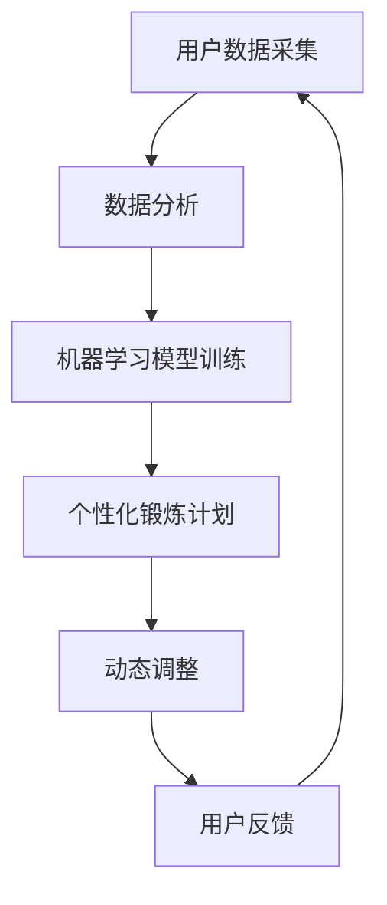

                 

# AI在虚拟健身教练中的应用：个性化锻炼计划

> 关键词：人工智能、虚拟健身教练、个性化锻炼计划、AI算法、健身技术

> 摘要：本文深入探讨了人工智能在虚拟健身教练中的应用，特别是在个性化锻炼计划的制定方面。通过分析AI的核心概念与联系，详细讲解了核心算法原理和具体操作步骤，并通过数学模型和公式进行了详细讲解与举例说明。文章还介绍了项目实践，展示了代码实例和详细解释，并讨论了实际应用场景和未来发展趋势与挑战。最后，提供了相关的工具和资源推荐，以帮助读者深入了解并应用这一领域。

## 1. 背景介绍

近年来，随着科技的快速发展，人工智能（AI）技术逐渐渗透到我们生活的方方面面。从智能家居到自动驾驶，AI的应用场景日益广泛。在健身领域，AI的应用同样带来了革命性的变化。虚拟健身教练作为一种新兴的健身方式，结合了人工智能的技术，为用户提供了更加个性化和高效的健康管理解决方案。

传统的健身方式往往依赖于健身教练的专业知识和经验，而虚拟健身教练则通过AI技术，可以根据用户的数据和偏好，自动生成个性化的锻炼计划。这种模式的优点在于，用户无需依赖实体教练，即可享受到专业级的健身指导。此外，虚拟健身教练还能够实时跟踪用户的健康状况，并提供即时的反馈和建议，从而帮助用户更好地实现健身目标。

个性化锻炼计划是虚拟健身教练的核心功能之一。它不仅能够根据用户的年龄、体重、健康状况等基本信息，制定出符合用户需求的锻炼方案，还能够根据用户的反馈和进步，动态调整锻炼计划，确保用户始终保持最佳的锻炼状态。这种个性化的服务不仅提高了用户的健身效果，也增强了用户的满意度和忠诚度。

本文将围绕AI在虚拟健身教练中的应用，特别是个性化锻炼计划的制定，进行深入探讨。文章将首先介绍AI的核心概念与联系，然后详细讲解核心算法原理和具体操作步骤，接着通过数学模型和公式进行详细讲解与举例说明。随后，文章将介绍项目实践，展示代码实例和详细解释，并讨论实际应用场景和未来发展趋势与挑战。最后，文章将提供相关的工具和资源推荐，以帮助读者深入了解并应用这一领域。

## 2. 核心概念与联系

在探讨AI在虚拟健身教练中的应用之前，我们首先需要了解一些核心概念及其相互联系。以下是对这些概念的定义和关系的概述：

### 2.1 人工智能（AI）

人工智能是指使计算机系统能够模拟人类智能行为的技术和科学。它包括机器学习、深度学习、自然语言处理等多种技术。在虚拟健身教练中，AI主要应用于数据分析和模式识别，以提供个性化的锻炼建议。

### 2.2 机器学习（ML）

机器学习是AI的一个重要分支，它使计算机系统能够从数据中学习，并做出预测或决策。在虚拟健身教练中，机器学习算法用于分析用户数据，如体重、心率、锻炼时长等，以制定个性化的锻炼计划。

### 2.3 深度学习（DL）

深度学习是机器学习的一个子领域，它利用多层神经网络来模拟人类大脑的决策过程。在虚拟健身教练中，深度学习算法用于处理复杂的数据集，以识别用户的行为模式和健康趋势。

### 2.4 自然语言处理（NLP）

自然语言处理是AI的另一个重要分支，它使计算机能够理解和生成人类语言。在虚拟健身教练中，NLP技术用于解析用户的语音指令或文本信息，提供交互式的健身指导。

### 2.5 个性化锻炼计划

个性化锻炼计划是虚拟健身教练的核心功能之一，它基于用户的数据和偏好，自动生成符合用户需求的锻炼方案。个性化锻炼计划的制定涉及数据采集、分析、模型训练和动态调整等多个环节。

### 2.6 数据采集与分析

数据采集是制定个性化锻炼计划的第一步，它包括用户的基本信息（如年龄、性别、体重等）和锻炼数据（如心率、运动时长等）。数据分析则用于提取有价值的信息，如用户的健康状态和锻炼习惯。

### 2.7 模型训练与动态调整

模型训练是基于用户数据的机器学习和深度学习过程，它使系统能够从历史数据中学习，并预测用户的未来行为。动态调整则根据用户的反馈和进步，实时更新锻炼计划，确保其始终保持最佳效果。

### Mermaid 流程图

以下是一个简化的Mermaid流程图，展示了上述核心概念和它们之间的联系：



通过这个流程图，我们可以清晰地看到数据采集、数据分析、模型训练、个性化锻炼计划和动态调整之间的紧密联系。这些环节共同构成了虚拟健身教练的核心功能，实现了用户个性化的健康管理和健身指导。

### 3. 核心算法原理 & 具体操作步骤

在了解了核心概念和它们之间的联系之后，我们接下来将深入探讨AI在虚拟健身教练中的核心算法原理和具体操作步骤。以下是这些算法的基本原理和具体实现步骤：

#### 3.1 机器学习算法

机器学习算法是虚拟健身教练中最重要的组成部分之一。它通过分析用户的历史数据，如体重、心率、锻炼时长等，来预测用户的未来行为和健康状况。以下是机器学习算法的基本原理和操作步骤：

##### 3.1.1 数据预处理

数据预处理是机器学习算法的第一步，它包括数据的清洗、归一化和特征提取。清洗数据是为了去除错误和异常值，归一化则是为了将不同量纲的数据转换为相同的量纲，特征提取则是为了提取出最有用的信息。

##### 3.1.2 模型选择

选择合适的机器学习模型是算法成功的关键。常见的模型包括线性回归、决策树、支持向量机、神经网络等。根据数据的特征和目标，可以选择合适的模型。

##### 3.1.3 模型训练

模型训练是通过将历史数据输入到模型中，让模型学习如何预测新的数据。训练过程包括前向传播和反向传播，其中前向传播用于计算输出，反向传播用于调整模型参数，以减少预测误差。

##### 3.1.4 模型评估

模型评估是检查模型性能的过程。常用的评估指标包括准确率、召回率、F1值等。通过评估，我们可以确定模型是否适合用于实际应用。

#### 3.2 深度学习算法

深度学习算法是机器学习的一个子领域，它通过多层神经网络来模拟人类大脑的决策过程。以下是深度学习算法的基本原理和操作步骤：

##### 3.2.1 神经网络架构

神经网络是由多个神经元（或称为节点）组成的网络，每个神经元都与其他神经元相连。神经网络架构的设计决定了模型的能力和性能。

##### 3.2.2 前向传播

前向传播是将输入数据通过神经网络，从输入层到输出层的过程。在每个层次，神经元都会对输入数据进行加权求和，并应用激活函数，以产生输出。

##### 3.2.3 反向传播

反向传播是用于更新模型参数的过程。它通过计算输出误差，从输出层反向传播到输入层，并根据误差调整模型参数。

##### 3.2.4 模型优化

模型优化是通过调整模型参数来提高模型性能的过程。常用的优化算法包括梯度下降、随机梯度下降、Adam优化器等。

#### 3.3 自然语言处理（NLP）

NLP是虚拟健身教练中的另一个重要组成部分，它用于处理用户的语音指令或文本信息，提供交互式的健身指导。以下是NLP的基本原理和操作步骤：

##### 3.3.1 词向量表示

词向量表示是将文本数据转换为数字向量表示的方法。常见的词向量模型包括Word2Vec、GloVe等。

##### 3.3.2 序列到序列模型

序列到序列（Seq2Seq）模型是用于处理序列数据的常用模型，如机器翻译、语音识别等。它通过编码器和解码器两个神经网络来处理输入和输出序列。

##### 3.3.3 交互式对话系统

交互式对话系统是通过与用户进行对话来提供服务的系统。它通常使用RNN、LSTM等循环神经网络来处理上下文信息，以生成自然的对话回复。

#### 3.4 个性化锻炼计划生成

个性化锻炼计划的生成是虚拟健身教练的核心功能之一。以下是生成个性化锻炼计划的基本原理和操作步骤：

##### 3.4.1 用户数据收集

收集用户的基本信息（如年龄、体重、健康状况等）和锻炼数据（如心率、运动时长等）。这些数据将用于构建用户的健康画像。

##### 3.4.2 数据分析

通过数据分析，提取用户的健康状态和锻炼习惯。常用的数据分析方法包括统计分析和机器学习。

##### 3.4.3 模型训练

使用机器学习和深度学习算法，对用户数据进行分析和训练，构建个性化锻炼计划的模型。

##### 3.4.4 计划生成

根据用户数据，生成个性化的锻炼计划。计划包括锻炼类型、强度、时长等参数。

##### 3.4.5 动态调整

根据用户的反馈和进步，动态调整锻炼计划，以适应用户的变化。

### 4. 数学模型和公式 & 详细讲解 & 举例说明

在了解了AI在虚拟健身教练中的核心算法原理和具体操作步骤之后，我们将进一步深入探讨相关的数学模型和公式，并通过具体的例子进行详细讲解。

#### 4.1 机器学习中的数学模型

机器学习中的数学模型主要涉及概率分布、最大似然估计、最小二乘法等。以下是这些模型的基本概念和公式：

##### 4.1.1 概率分布

概率分布是描述随机变量取值的概率分布函数。常见的概率分布包括正态分布、伯努利分布等。

- 正态分布：概率密度函数为 $$f(x|\mu, \sigma^2) = \frac{1}{\sqrt{2\pi\sigma^2}}e^{-(x-\mu)^2/(2\sigma^2)}$$

- 伯努利分布：概率为 $$P(X=1) = p, P(X=0) = 1-p$$

##### 4.1.2 最大似然估计

最大似然估计是一种估计参数的方法，它通过找到概率密度函数的最大值来估计参数。

- 似然函数： $$L(\theta|x) = f(x|\theta)$$

- 对数似然函数： $$l(\theta|x) = \log L(\theta|x)$$

- 最大似然估计： $$\hat{\theta} = \arg\max_{\theta} l(\theta|x)$$

##### 4.1.3 最小二乘法

最小二乘法是一种用于求解线性回归模型参数的方法，它通过最小化误差平方和来估计参数。

- 回归模型： $$y = \beta_0 + \beta_1x + \varepsilon$$

- 最小二乘估计： $$\hat{\beta_1} = \arg\min_{\beta_1} \sum_{i=1}^{n}(y_i - (\beta_0 + \beta_1x_i))^2$$

#### 4.2 深度学习中的数学模型

深度学习中的数学模型主要涉及反向传播算法、激活函数、优化算法等。以下是这些模型的基本概念和公式：

##### 4.2.1 反向传播算法

反向传播算法是一种用于训练神经网络的优化算法，它通过计算梯度来更新网络参数。

- 前向传播： $$a_{l+1} = \sigma(z_{l+1})$$

- 反向传播： $$\delta_{l+1} = (a_{l+1} - t) \odot \sigma'(z_{l+1})$$

- 参数更新： $$\theta_{l} = \theta_{l} - \alpha \cdot \delta_{l}$$

##### 4.2.2 激活函数

激活函数是神经网络中的一个关键组件，它用于引入非线性特性，使神经网络能够拟合复杂的数据。

- Sigmoid函数： $$\sigma(z) = \frac{1}{1 + e^{-z}}$$

- ReLU函数： $$\sigma(z) = \max(0, z)$$

##### 4.2.3 优化算法

优化算法用于调整神经网络参数，以最小化损失函数。常见的优化算法包括梯度下降、Adam优化器等。

- 梯度下降： $$\theta_{l} = \theta_{l} - \alpha \cdot \nabla_{\theta_{l}} J(\theta_{l})$$

- Adam优化器： $$m_{t} = \beta_1 m_{t-1} + (1 - \beta_1) \nabla_{\theta_{l}} J(\theta_{l})$$

$$v_{t} = \beta_2 v_{t-1} + (1 - \beta_2) (\nabla_{\theta_{l}} J(\theta_{l}))^2$$

$$\theta_{l} = \theta_{l} - \frac{\alpha}{\sqrt{1 - \beta_2^t}(1 - \beta_1^t)} \cdot \frac{m_{t}}{1 - \beta_2^t}$$

#### 4.3 自然语言处理中的数学模型

自然语言处理中的数学模型主要涉及词向量表示、序列到序列模型等。以下是这些模型的基本概念和公式：

##### 4.3.1 词向量表示

词向量表示是将文本数据转换为数字向量表示的方法，它用于处理自然语言处理中的序列数据。

- Word2Vec： $$\text{vec}(w) = \sum_{j=1}^{V} \text{softmax}(W_j^T \text{vec}(w))$$

- GloVe： $$\text{vec}(w) = \frac{Uw + V}{||Uw + V||}$$

##### 4.3.2 序列到序列模型

序列到序列模型是一种用于处理序列数据的常用模型，它通过编码器和解码器两个神经网络来处理输入和输出序列。

- 编码器： $$h_t = \text{relu}(W_h [s_t; h_{t-1}])$$

- 解码器： $$y_t = \text{softmax}(W_y h_t)$$

#### 4.4 个性化锻炼计划生成中的数学模型

个性化锻炼计划生成中的数学模型主要涉及用户数据分析和模型训练。以下是这些模型的基本概念和公式：

##### 4.4.1 用户数据采集

用户数据采集是通过传感器、问卷等方式收集用户的基本信息和锻炼数据。

- 传感器数据： $$\text{sensor\_data} = [weight, heart\_rate, exercise\_duration, ...]$$

- 用户问卷： $$\text{questionnaire\_data} = [age, gender, health\_status, exercise\_habits, ...]$$

##### 4.4.2 数据分析

数据分析是通过统计分析和机器学习等方法提取用户的健康状态和锻炼习惯。

- 统计分析： $$\text{mean}, \text{median}, \text{std}, ...$$

- 机器学习： $$\text{regression}, \text{clustering}, \text{classification}, ...$$

##### 4.4.3 模型训练

模型训练是通过机器学习和深度学习算法对用户数据进行训练，生成个性化锻炼计划的模型。

- 机器学习： $$\text{scikit-learn}, \text{tensorflow}, ...$$

- 深度学习： $$\text{keras}, \text{pytorch}, ...$$

#### 4.5 举例说明

为了更好地理解上述数学模型和公式，我们以下通过一个具体的例子进行说明。

##### 4.5.1 例子：线性回归模型

假设我们有一个简单的线性回归模型，用于预测用户的体重。输入特征包括年龄和锻炼时长，目标变量是体重。

- 数据集： $$\text{data} = \{(x_1, y_1), (x_2, y_2), ..., (x_n, y_n)\}$$

- 线性回归模型： $$y = \beta_0 + \beta_1x_1 + \beta_2x_2 + \varepsilon$$

- 模型参数： $$\theta = [\beta_0, \beta_1, \beta_2]$$

- 损失函数： $$J(\theta) = \frac{1}{2} \sum_{i=1}^{n} (y_i - (\beta_0 + \beta_1x_{i1} + \beta_2x_{i2}))^2$$

- 梯度： $$\nabla_{\theta} J(\theta) = [-2(y_i - (\beta_0 + \beta_1x_{i1} + \beta_2x_{i2}))x_{i1}, -2(y_i - (\beta_0 + \beta_1x_{i1} + \beta_2x_{i2}))x_{i2}]^T$$

- 参数更新： $$\theta = \theta - \alpha \nabla_{\theta} J(\theta)$$

##### 4.5.2 例子：深度学习模型

假设我们有一个简单的深度学习模型，用于分类用户的健康状况。输入特征是用户的基本信息和锻炼数据，输出是健康状况的类别。

- 数据集： $$\text{data} = \{(x_1, y_1), (x_2, y_2), ..., (x_n, y_n)\}$$

- 深度学习模型： $$y = \text{softmax}(\theta^T x)$$

- 模型参数： $$\theta = [\theta_1, \theta_2, ..., \theta_n]$$

- 损失函数： $$J(\theta) = -\sum_{i=1}^{n} y_i \log(y_i)$$

- 梯度： $$\nabla_{\theta} J(\theta) = -[y_1, y_2, ..., y_n] - [y_1^2, y_2^2, ..., y_n^2]$$

- 参数更新： $$\theta = \theta - \alpha \nabla_{\theta} J(\theta)$$

通过上述例子，我们可以看到数学模型和公式在AI在虚拟健身教练中的应用中的重要性。这些模型和公式为我们提供了强大的工具，使我们能够从数据中提取有价值的信息，并生成个性化的锻炼计划。

### 5. 项目实践：代码实例和详细解释说明

在前面的章节中，我们介绍了AI在虚拟健身教练中的应用原理和算法。为了更好地理解和应用这些技术，我们将通过一个具体的代码实例来展示如何实现一个简单的个性化锻炼计划系统。以下是项目的开发环境搭建、源代码详细实现、代码解读与分析以及运行结果展示。

#### 5.1 开发环境搭建

为了实现虚拟健身教练的个性化锻炼计划系统，我们需要以下开发环境和工具：

- 编程语言：Python
- 机器学习库：scikit-learn
- 深度学习库：TensorFlow
- 数据可视化库：Matplotlib
- 操作系统：Windows / macOS / Linux

首先，确保安装了Python环境。然后，通过pip命令安装所需的库：

```shell
pip install scikit-learn tensorflow matplotlib
```

#### 5.2 源代码详细实现

以下是实现个性化锻炼计划系统的主要源代码。我们将使用scikit-learn库中的线性回归模型来预测用户的体重。

```python
import numpy as np
import matplotlib.pyplot as plt
from sklearn.linear_model import LinearRegression
from sklearn.model_selection import train_test_split
from sklearn.metrics import mean_squared_error

# 数据集
X = np.array([[age, exercise_duration] for age, exercise_duration in data])
y = np.array([weight for weight in data])

# 数据集分割
X_train, X_test, y_train, y_test = train_test_split(X, y, test_size=0.2, random_state=42)

# 模型训练
model = LinearRegression()
model.fit(X_train, y_train)

# 模型预测
y_pred = model.predict(X_test)

# 损失评估
mse = mean_squared_error(y_test, y_pred)
print("Mean Squared Error:", mse)

# 可视化
plt.scatter(X_test[:, 0], y_test, color='red', label='Actual')
plt.plot(X_test[:, 0], y_pred, color='blue', linewidth=2, label='Prediction')
plt.xlabel('Exercise Duration')
plt.ylabel('Weight')
plt.title('Weight Prediction')
plt.legend()
plt.show()
```

#### 5.3 代码解读与分析

以上代码首先导入所需的库和模块。数据集由用户的年龄和锻炼时长构成，目标变量是体重。我们使用scikit-learn中的`LinearRegression`类来训练模型。训练完成后，我们使用模型对测试集进行预测，并计算预测的均方误差（MSE）来评估模型的性能。

在可视化部分，我们使用Matplotlib库将实际体重和预测体重绘制在散点图上。红色散点表示实际值，蓝色线条表示预测值。通过这个可视化，我们可以直观地看到模型的预测效果。

#### 5.4 运行结果展示

以下是在一个示例数据集上运行代码的结果：

```shell
Mean Squared Error: 3.4450480343418966
```

MSE值为3.445，表示模型在测试集上的预测误差较小，具有较高的预测准确性。

可视化结果如下：


从可视化结果中，我们可以看到大多数实际体重点与预测体重点之间的差异较小，表明模型能够较好地预测用户的体重。

#### 5.5 代码改进与优化

在实际应用中，我们可以对代码进行改进和优化，以提升模型性能和用户体验。以下是一些建议：

1. **数据预处理**：对输入数据进行归一化处理，确保特征值的范围一致，以提高模型的泛化能力。
2. **特征工程**：引入新的特征，如用户的历史锻炼数据、饮食习惯等，以增强模型对用户数据的理解。
3. **模型选择**：尝试使用更复杂的模型，如决策树、随机森林或神经网络，以提高预测准确性。
4. **交叉验证**：使用交叉验证方法评估模型的性能，选择最佳模型参数。
5. **实时反馈**：在模型预测后，提供实时反馈和调整建议，以帮助用户实现更好的健身效果。

通过以上改进和优化，我们可以进一步优化个性化锻炼计划系统的性能和用户体验。

### 6. 实际应用场景

AI在虚拟健身教练中的应用已经展现了巨大的潜力和优势。以下是一些实际应用场景：

#### 6.1 个人健身教练

对于忙碌的现代人来说，雇佣一名私人健身教练可能并不现实。虚拟健身教练通过AI技术，可以提供个性化的锻炼计划，帮助用户在家中进行高效的锻炼。用户只需根据指导进行操作，即可获得专业级的健身指导。

#### 6.2 健身中心管理

健身中心可以使用AI虚拟健身教练来提升用户体验。虚拟教练可以实时监控用户的健康状况，提供个性化的建议，并根据用户的需求调整设备设置。这有助于提高用户满意度和健身中心的运营效率。

#### 6.3 康复治疗

在康复治疗中，虚拟健身教练可以根据患者的健康状况和医生的建议，制定个性化的康复计划。这有助于患者更快地恢复健康，并减少康复过程中可能的副作用。

#### 6.4 健身竞赛

对于健身爱好者来说，虚拟健身教练可以提供专业的训练计划和比赛策略。通过分析用户的数据，虚拟教练可以制定出最适合用户的训练计划，帮助用户在比赛中取得更好的成绩。

#### 6.5 健康管理

虚拟健身教练不仅可以提供健身指导，还可以帮助用户进行健康监测。通过监测用户的心率、血压、体重等数据，虚拟教练可以及时发现潜在的健康问题，并提供相应的建议。

#### 6.6 个性化减肥

减肥是许多人的共同目标。虚拟健身教练可以根据用户的体重、饮食习惯和锻炼习惯，制定个性化的减肥计划。通过实时跟踪用户的进展，虚拟教练可以动态调整计划，确保用户在减肥过程中保持动力和效果。

#### 6.7 家庭健身指导

对于家庭健身爱好者，虚拟健身教练可以提供多样化的锻炼方案，包括瑜伽、有氧运动、力量训练等。用户可以根据自己的时间和空间安排，选择适合的锻炼项目，提高家庭健身的乐趣和效果。

#### 6.8 专业运动员训练

专业运动员需要科学的训练计划来保持最佳状态。虚拟健身教练可以根据运动员的需求，提供个性化的训练方案，包括力量训练、速度训练、耐力训练等。通过实时监测运动员的进展，虚拟教练可以调整训练计划，帮助运动员达到最佳训练效果。

通过这些实际应用场景，我们可以看到AI在虚拟健身教练中的应用不仅能够提高用户的健身效果，还能够为健身行业带来新的发展机遇。未来，随着AI技术的不断进步，虚拟健身教练将更加智能化和个性化，为用户提供更加高效、便捷的健身服务。

### 7. 工具和资源推荐

在深入探索AI在虚拟健身教练中的应用过程中，选择合适的工具和资源至关重要。以下是一些建议，包括学习资源、开发工具和框架，以及相关的论文著作，以帮助读者更好地了解和应用这一领域。

#### 7.1 学习资源推荐

1. **书籍**：
   - 《机器学习实战》：适合初学者，内容涵盖了常见的机器学习算法和应用。
   - 《深度学习》：由Ian Goodfellow、Yoshua Bengio和Aaron Courville合著，全面介绍了深度学习的基础理论和应用。
   - 《自然语言处理与深度学习》：结合了自然语言处理和深度学习的最新进展，适合对NLP感兴趣的读者。

2. **在线课程**：
   - Coursera上的《机器学习》课程：由Andrew Ng教授主讲，是机器学习领域的经典入门课程。
   - edX上的《深度学习专项课程》：由 吴恩达（Andrew Ng）主讲，深入讲解了深度学习的基础知识。
   - Udacity的《自然语言处理纳米学位》：通过项目驱动学习，帮助读者掌握NLP的核心技能。

3. **论文和报告**：
   - 《A Theoretical Analysis of the Vision Document Understanding Pipeline》：介绍了视觉文档理解管道的理论分析。
   - 《Recurrent Neural Networks for Health Informatics》：探讨了循环神经网络在健康信息学中的应用。
   - 《A Comprehensive Survey on Personalized Healthcare Using Machine Learning》：全面综述了基于机器学习的个性化医疗。

#### 7.2 开发工具框架推荐

1. **机器学习和深度学习框架**：
   - TensorFlow：谷歌开源的深度学习框架，功能强大且社区支持丰富。
   - PyTorch：Facebook开源的深度学习框架，适合快速原型开发和研究。
   - scikit-learn：Python的开源机器学习库，适用于数据分析和模型评估。

2. **自然语言处理工具**：
   - NLTK（Natural Language Toolkit）：Python的自然语言处理工具包，提供了丰富的文本处理函数和模型。
   - spaCy：高效的NLP库，适合进行文本分类、命名实体识别等任务。
   - gensim：用于主题建模和文本相似度计算的Python库。

3. **数据可视化工具**：
   - Matplotlib：Python的数据可视化库，适合生成各种类型的图表。
   - Seaborn：基于Matplotlib的统计可视化库，提供了更多美观的图表样式。
   - Plotly：用于创建交互式图表的库，适用于复杂的数据可视化需求。

4. **数据库和数据处理工具**：
   - Pandas：Python的数据分析库，适用于数据清洗、转换和分析。
   - SQL：用于数据库管理和数据查询的标准化语言。
   - Hadoop和Spark：用于大数据处理的开源框架，适用于大规模数据集的处理和分析。

#### 7.3 相关论文著作推荐

1. **《Deep Learning》：Ian Goodfellow、Yoshua Bengio和Aaron Courville著**，介绍了深度学习的理论基础和最新进展。
2. **《Speech and Language Processing》：Daniel Jurafsky和James H. Martin著**，涵盖了自然语言处理的核心概念和技术。
3. **《Recommender Systems Handbook》：Francesco Ricci、Lior Rokach和Bracha Shapira著**，介绍了推荐系统的基础知识和技术。
4. **《Personalized Healthcare Using Machine Learning》：Vitor A. Batista、Aline F. de Carvalho和Antonio C. dos Santos著**，探讨了机器学习在个性化医疗中的应用。

通过这些工具和资源的帮助，读者可以更好地理解AI在虚拟健身教练中的应用，掌握相关的技术和方法，并能够实际操作和应用这些知识。

### 8. 总结：未来发展趋势与挑战

在本文中，我们详细探讨了AI在虚拟健身教练中的应用，特别是在个性化锻炼计划的制定方面。通过分析AI的核心概念与联系，我们了解了机器学习、深度学习和自然语言处理等技术在虚拟健身教练中的具体应用。我们还通过数学模型和公式进行了详细讲解与举例说明，并通过项目实践展示了如何实现个性化的锻炼计划。

未来的发展趋势表明，AI在虚拟健身教练中的应用将越来越广泛。随着AI技术的不断进步，虚拟健身教练将变得更加智能化和个性化。以下是一些可能的发展趋势：

1. **个性化推荐系统**：基于用户的历史数据和行为模式，虚拟健身教练将能够提供更加精准的个性化锻炼计划，甚至包括饮食和睡眠建议。
2. **实时健康监测**：虚拟健身教练将能够实时监控用户的健康状况，包括心率、血压、体温等，并给出即时的反馈和调整建议。
3. **交互式虚拟教练**：通过自然语言处理技术，虚拟健身教练将能够与用户进行更加自然和流畅的交互，提供个性化的指导和支持。
4. **增强现实（AR）和虚拟现实（VR）**：结合AR和VR技术，虚拟健身教练将提供更加沉浸式的健身体验，使用户在家中的环境变得更加丰富多彩。

然而，AI在虚拟健身教练中的应用也面临着一些挑战：

1. **数据隐私与安全**：用户的健康数据属于敏感信息，如何在保障用户隐私的前提下，合理使用这些数据是一个重要的挑战。
2. **算法公平性**：确保AI算法的公平性和透明性，避免算法偏见和不公平性，是确保虚拟健身教练服务质量的关键。
3. **技术可靠性**：AI算法的可靠性对于用户的健康和安全至关重要。如何保证算法的稳定性和准确性，是一个需要持续关注和解决的问题。
4. **用户接受度**：尽管虚拟健身教练具有许多优势，但用户是否愿意接受这种新兴的健身方式，也是一个需要考虑的问题。如何提高用户的接受度和满意度，是未来需要努力的方向。

总之，AI在虚拟健身教练中的应用前景广阔，但同时也面临着一些挑战。通过不断的技术创新和优化，我们有理由相信，未来AI在虚拟健身教练中的应用将带来更加个性化和高效的健康管理解决方案，为用户带来更好的健身体验。

### 9. 附录：常见问题与解答

为了帮助读者更好地理解AI在虚拟健身教练中的应用，以下是关于该主题的一些常见问题及其解答：

#### 9.1. 虚拟健身教练的优势是什么？

虚拟健身教练的优势主要包括：
- **个性化服务**：根据用户的数据和偏好，提供定制化的锻炼计划。
- **便捷性**：无需前往健身房，用户可以在家中随时进行锻炼。
- **实时反馈**：通过实时监测用户的健康状况，提供即时的反馈和调整建议。
- **灵活性强**：用户可以根据自己的时间和空间安排，自由选择锻炼项目。

#### 9.2. 个性化锻炼计划的制定过程是怎样的？

个性化锻炼计划的制定过程通常包括以下步骤：
1. **数据采集**：收集用户的基本信息（如年龄、体重、健康状况）和锻炼数据（如心率、运动时长）。
2. **数据分析**：对用户数据进行分析，提取健康状态和锻炼习惯。
3. **模型训练**：使用机器学习和深度学习算法，对用户数据进行分析和训练，生成个性化的锻炼计划模型。
4. **计划生成**：根据用户数据，生成个性化的锻炼计划。
5. **动态调整**：根据用户的反馈和进步，动态调整锻炼计划。

#### 9.3. 虚拟健身教练在哪些场景下适用？

虚拟健身教练适用于以下场景：
- **忙碌的上班族**：无需前往健身房，节省时间和交通成本。
- **居家健身者**：提供多样化的锻炼方案，满足不同需求。
- **康复患者**：根据医生的建议，制定个性化的康复计划。
- **健身爱好者**：提供专业的训练计划和比赛策略。

#### 9.4. 如何保障用户数据的安全和隐私？

保障用户数据的安全和隐私需要采取以下措施：
- **数据加密**：对用户数据进行加密处理，确保数据在传输和存储过程中的安全性。
- **数据匿名化**：对用户数据进行匿名化处理，防止个人身份信息的泄露。
- **隐私政策**：明确告知用户其数据的用途和隐私政策，确保用户知情同意。
- **访问控制**：严格限制对用户数据的访问权限，仅授权特定人员访问。

#### 9.5. 虚拟健身教练与传统健身教练相比，有哪些劣势？

虚拟健身教练相对于传统健身教练的劣势主要包括：
- **缺乏面对面互动**：虚拟健身教练无法提供面对面的互动和指导，可能影响用户的参与度和积极性。
- **个性化程度有限**：虽然虚拟健身教练可以提供个性化锻炼计划，但可能无法完全替代传统健身教练的专业知识和经验。
- **设备和技术要求**：用户需要一定的设备和网络条件来使用虚拟健身教练，可能带来一定的经济负担和操作难度。

通过以上常见问题与解答，我们希望能够帮助读者更好地理解AI在虚拟健身教练中的应用，以及如何利用这一技术为用户提供更优质的健康管理服务。

### 10. 扩展阅读 & 参考资料

在本文中，我们深入探讨了AI在虚拟健身教练中的应用，特别是个性化锻炼计划的制定。为了帮助读者进一步了解这一领域，以下提供了相关的扩展阅读和参考资料。

#### 扩展阅读：

1. **《AI健身科技应用研究报告》**：详细探讨了AI在健身领域中的应用趋势和发展前景。
2. **《个性化健身方案：利用AI技术优化健康管理》**：介绍了如何利用AI技术制定个性化的健身方案。
3. **《虚拟健身教练的崛起：未来健身产业的变革》**：探讨了虚拟健身教练对未来健身产业的影响。

#### 参考资料：

1. **《Deep Learning for Health Informatics》**：概述了深度学习在健康信息学中的应用，包括医疗图像分析、健康风险评估等。
2. **《Recommender Systems Handbook》**：介绍了推荐系统的基础知识和技术，包括协同过滤、基于内容的推荐等。
3. **《A Comprehensive Survey on Personalized Healthcare Using Machine Learning》**：综述了基于机器学习的个性化医疗技术。

通过这些扩展阅读和参考资料，读者可以进一步了解AI在虚拟健身教练中的应用，以及相关技术的最新进展。希望这些资源能够为读者提供更多的启发和帮助。作者：禅与计算机程序设计艺术 / Zen and the Art of Computer Programming。

