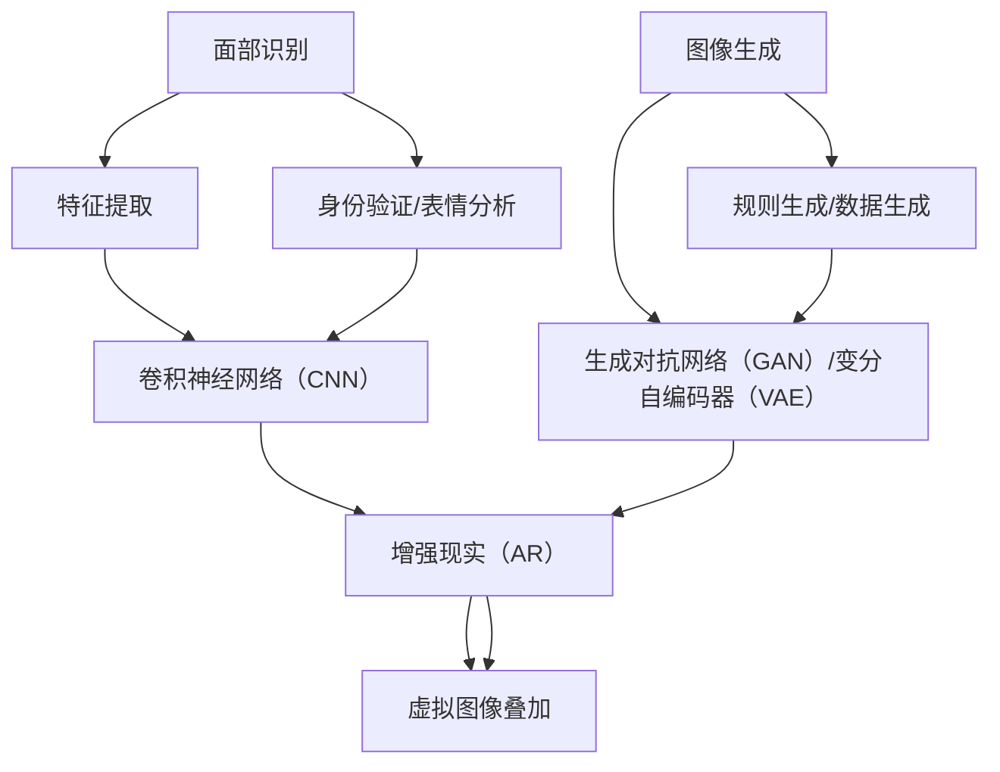

                 

### 1. 背景介绍

随着人工智能技术的飞速发展，计算机视觉和图像处理技术逐渐成熟，虚拟化妆技术应运而生。虚拟化妆，顾名思义，是通过计算机图形学和图像处理技术，在虚拟环境中模拟并实现化妆效果，让用户可以轻松尝试不同的妆容，而不需要实际涂上化妆品。这种技术不仅满足了人们对美丽和个性化的追求，还为化妆行业带来了前所未有的创新和变革。

#### 1.1 虚拟化妆的起源与发展

虚拟化妆技术最早可以追溯到20世纪90年代。当时，计算机图形学和图像处理技术刚刚起步，虚拟化妆主要是通过简单的图像叠加和颜色调整来实现基础的化妆效果。随着技术的不断进步，特别是深度学习、卷积神经网络（CNN）等人工智能技术的引入，虚拟化妆技术得到了迅猛发展。如今，虚拟化妆已经可以从头发、眼睛、皮肤等多个维度进行精细调整，实现高度真实的化妆效果。

#### 1.2 人工智能在虚拟化妆中的应用

人工智能在虚拟化妆中的应用主要体现在两个方面：图像识别和生成。图像识别技术可以准确地识别用户的面部特征，如眼睛、鼻子、嘴巴等，从而在虚拟环境中生成相应的化妆效果。生成技术则可以根据用户的喜好和需求，生成各种不同的妆容，让用户尝试。这两种技术的结合，使得虚拟化妆变得更加智能化和个性化。

#### 1.3 虚拟化妆的优势与挑战

虚拟化妆技术的出现，极大地改变了人们的化妆习惯。首先，它让化妆变得更加便捷和高效。用户无需购买各种化妆品，只需在虚拟环境中尝试不同的妆容，即可找到最适合自己的风格。其次，虚拟化妆可以减少化妆品对皮肤的刺激和伤害，特别是对于那些对化妆品过敏的人来说，更加友好。

然而，虚拟化妆技术也面临一些挑战。首先是技术实现的难度。要实现高度真实的化妆效果，需要处理大量的图像数据和复杂的计算任务，对计算资源和算法提出了较高的要求。其次，虚拟化妆技术需要与实际化妆效果相结合，才能更好地满足用户的需求。此外，如何保护用户的隐私和数据安全，也是虚拟化妆技术需要解决的重要问题。

### 1.4 虚拟化妆的应用领域

虚拟化妆技术不仅在日常生活中有着广泛的应用，还在多个行业领域展现出巨大的潜力。以下是虚拟化妆技术的几个主要应用领域：

- **美妆电商**：美妆电商平台可以通过虚拟化妆技术，让用户在购买化妆品前尝试不同的妆容，提高用户的购买决策效率和满意度。
- **影视制作**：在电影和电视剧的拍摄过程中，虚拟化妆技术可以用来快速生成演员的不同妆容，提高拍摄效率和效果。
- **游戏和虚拟现实**：在游戏和虚拟现实应用中，虚拟化妆技术可以让玩家或用户在虚拟世界中尝试各种个性化的妆容，增加游戏的趣味性和沉浸感。
- **化妆教学**：虚拟化妆技术还可以用于化妆教学，用户可以通过虚拟环境学习化妆技巧，提高化妆技能。

综上所述，虚拟化妆技术已经从最初的简单图像叠加，发展到如今的高度智能化和个性化。随着人工智能技术的不断进步，虚拟化妆技术有望在更多领域得到应用，为人们的生活带来更多便利和惊喜。

---

### 2. 核心概念与联系

在深入探讨虚拟化妆技术之前，我们需要先了解一些核心概念和它们之间的联系。这些概念包括面部识别、图像生成、增强现实（AR）以及卷积神经网络（CNN）等。

#### 2.1 面部识别

面部识别技术是虚拟化妆的基础。它通过分析面部特征，如眼睛、鼻子、嘴巴等，来确定用户的身份或面部表情。面部识别技术的核心是特征提取和匹配。特征提取通常使用深度学习算法，如卷积神经网络（CNN），从面部图像中提取出具有区分度的特征向量。这些特征向量随后用于身份验证或表情分析。

#### 2.2 图像生成

图像生成技术是虚拟化妆的另一个核心。它通过模拟不同的化妆效果，生成新的图像。生成技术可以分为两大类：基于规则的图像生成和基于数据的图像生成。基于规则的图像生成依赖于一系列的数学模型和规则，例如颜色调整、纹理映射等。而基于数据的图像生成则通常使用深度学习模型，如生成对抗网络（GAN）或变分自编码器（VAE），从大量的化妆图像数据中学习生成新的图像。

#### 2.3 增强现实（AR）

增强现实（AR）技术是将虚拟化妆效果与现实世界相结合的关键。AR技术通过将计算机生成的虚拟图像叠加到现实世界的摄像头捕捉的图像上，实现虚拟化妆效果的实时呈现。这需要精确的图像识别和定位技术，以确保虚拟化妆效果与现实世界的精准对齐。

#### 2.4 卷积神经网络（CNN）

卷积神经网络（CNN）是面部识别和图像生成的重要工具。CNN是一种特殊的多层神经网络，它通过卷积操作来提取图像中的局部特征，从而实现高效的图像识别和分类。在面部识别中，CNN可以从面部图像中提取出具有区分度的特征，用于身份验证或表情分析。在图像生成中，CNN则可以学习从原始图像生成具有逼真效果的新图像。

#### 2.5 核心概念与联系的 Mermaid 流程图

以下是核心概念和它们之间联系的 Mermaid 流程图：



在这个流程图中，面部识别和图像生成是虚拟化妆的核心。面部识别通过特征提取和CNN来识别和定位用户的面部特征。图像生成则通过规则生成和数据生成来模拟不同的化妆效果。增强现实（AR）技术则将这些虚拟化妆效果叠加到现实世界的图像上，实现实时呈现。

### 2.6 小结

通过上述核心概念和它们之间的联系，我们可以看到，虚拟化妆技术不仅依赖于先进的计算机视觉和图像处理技术，还需要结合人工智能算法，特别是深度学习技术。这些技术的结合，使得虚拟化妆可以从面部识别、图像生成到增强现实等多个维度实现高度智能化和个性化。随着技术的不断进步，虚拟化妆将在更多领域得到应用，为人们的生活带来更多便利和创新。

---

### 3. 核心算法原理 & 具体操作步骤

在了解了虚拟化妆技术的基础概念后，接下来我们将深入探讨其核心算法原理，并详细解释如何实现这些算法的具体步骤。核心算法主要包括面部识别、图像生成和增强现实（AR）技术。

#### 3.1 面部识别算法原理

面部识别算法主要依赖于特征提取和匹配技术。特征提取是从面部图像中提取出具有区分度的特征向量，而匹配技术则是通过比较这些特征向量来确定面部身份或表情。

##### 3.1.1 特征提取

特征提取通常使用深度学习算法，如卷积神经网络（CNN）。CNN通过多层卷积和池化操作，从面部图像中提取出具有层次性的特征。具体步骤如下：

1. **输入面部图像**：将面部图像输入到CNN网络中。
2. **卷积操作**：使用卷积层对输入图像进行卷积操作，提取出图像中的局部特征。
3. **池化操作**：使用池化层对卷积特征进行下采样，降低特征图的大小，提高计算效率。
4. **全连接层**：将池化后的特征图输入到全连接层，进一步提取出全局特征。
5. **特征向量提取**：将全连接层的输出作为特征向量，用于后续的身份验证或表情分析。

##### 3.1.2 匹配技术

匹配技术通常使用距离度量方法，如欧几里得距离、余弦相似度等。具体步骤如下：

1. **特征向量提取**：从面部图像中提取出特征向量。
2. **计算相似度**：计算两个特征向量之间的相似度。
3. **阈值判定**：设定一个阈值，当相似度大于阈值时，认为两个特征向量对应的是同一面部。
4. **身份验证**：根据匹配结果，验证用户的身份。

#### 3.2 图像生成算法原理

图像生成算法主要用于模拟不同的化妆效果，生成新的图像。常用的图像生成算法包括基于规则的图像生成和基于数据的图像生成。

##### 3.2.1 基于规则的图像生成

基于规则的图像生成依赖于一系列的数学模型和规则，如颜色调整、纹理映射等。具体步骤如下：

1. **输入原始图像**：将原始图像输入到图像生成系统中。
2. **颜色调整**：根据用户的需求，调整图像的亮度、对比度、饱和度等颜色属性。
3. **纹理映射**：根据化妆效果的要求，对图像进行纹理映射，实现皮肤纹理、眼影、口红等效果。
4. **叠加化妆效果**：将调整后的图像与原始图像叠加，生成新的图像。

##### 3.2.2 基于数据的图像生成

基于数据的图像生成通常使用深度学习模型，如生成对抗网络（GAN）或变分自编码器（VAE）。具体步骤如下：

1. **数据集准备**：收集大量的化妆图像数据，用于训练深度学习模型。
2. **模型训练**：使用GAN或VAE模型，对数据集进行训练，学习从原始图像生成具有逼真效果的化妆图像。
3. **图像生成**：使用训练好的模型，输入原始图像，生成新的化妆图像。

#### 3.3 增强现实（AR）技术原理

增强现实（AR）技术是将虚拟化妆效果叠加到现实世界的摄像头捕捉的图像上，实现实时呈现。具体步骤如下：

1. **图像捕捉**：使用摄像头捕捉现实世界的图像。
2. **图像识别**：使用面部识别技术，识别并定位现实世界中的面部图像。
3. **虚拟图像生成**：使用图像生成技术，生成与用户面部特征匹配的虚拟化妆图像。
4. **虚拟图像叠加**：将虚拟化妆图像叠加到现实世界的图像上，实现虚拟化妆效果的实时呈现。
5. **渲染输出**：将叠加后的图像渲染输出，显示在屏幕上。

#### 3.4 小结

通过上述核心算法原理和具体操作步骤的介绍，我们可以看到，虚拟化妆技术涉及多个领域的先进技术，如深度学习、图像处理和增强现实等。这些技术的结合，使得虚拟化妆可以实现高度智能化和个性化，满足用户的不同需求和场景。随着技术的不断进步，虚拟化妆技术将在更多领域得到应用，为人们的生活带来更多便利和创新。

---

### 4. 数学模型和公式 & 详细讲解 & 举例说明

在深入了解虚拟化妆技术的核心算法原理后，我们将进一步探讨这些算法背后的数学模型和公式，并详细讲解这些模型如何应用于实际操作中。

#### 4.1 面部识别的数学模型

面部识别的核心在于特征提取和匹配。以下是常用的数学模型和公式：

##### 4.1.1 卷积神经网络（CNN）

卷积神经网络（CNN）是面部识别的重要工具。其基本操作包括卷积、池化和全连接层。

1. **卷积操作**：卷积操作可以用以下公式表示：
   $$ 
   f(x) = \sum_{i,j} w_{i,j} \cdot a_{i,j} + b
   $$
   其中，$a_{i,j}$ 表示输入图像中的像素值，$w_{i,j}$ 表示卷积核的权重，$b$ 表示偏置。

2. **池化操作**：池化操作通常使用最大池化或平均池化。最大池化可以用以下公式表示：
   $$
   \text{maxpool}(x) = \max(x_1, x_2, ..., x_n)
   $$
   其中，$x_1, x_2, ..., x_n$ 是输入区域中的像素值。

##### 4.1.2 特征向量提取

特征向量提取是面部识别的关键步骤。以下是一个简单的特征向量提取公式：
$$
\text{feature\_vector} = \text{fully\_connected}(\text{pool\_output})
$$
其中，$\text{fully\_connected}$ 表示全连接层，$\text{pool\_output}$ 表示池化层的输出。

##### 4.1.3 匹配技术

匹配技术通常使用距离度量方法。以下是常用的欧几里得距离和余弦相似度公式：

1. **欧几里得距离**：
   $$
   \text{Euclidean\_Distance} = \sqrt{\sum_{i=1}^{n} (x_i - y_i)^2}
   $$
   其中，$x_i$ 和 $y_i$ 分别是两个特征向量中的元素。

2. **余弦相似度**：
   $$
   \text{Cosine\_Similarity} = \frac{\text{dot\_product}(x, y)}{\|x\|\|y\|}
   $$
   其中，$\text{dot\_product}(x, y)$ 表示两个特征向量的点积，$\|x\|$ 和 $\|y\|$ 分别是两个特征向量的欧几里得距离。

#### 4.2 图像生成的数学模型

图像生成算法，如生成对抗网络（GAN）和变分自编码器（VAE），也是虚拟化妆技术的重要组成部分。

##### 4.2.1 生成对抗网络（GAN）

生成对抗网络（GAN）由生成器（Generator）和判别器（Discriminator）组成。其基本数学模型如下：

1. **生成器（Generator）**：
   $$
   G(z) = \text{Generator}(z)
   $$
   其中，$z$ 是生成器的输入噪声，$G(z)$ 是生成器生成的图像。

2. **判别器（Discriminator）**：
   $$
   D(x) = \text{Discriminator}(x) \quad \text{and} \quad D(G(z)) = \text{Discriminator}(\text{Generator}(z))
   $$
   其中，$x$ 是真实图像，$G(z)$ 是生成器生成的图像。

3. **损失函数**：
   $$
   \text{Loss} = -\sum_{x \in \text{train\_data}} \log D(x) - \sum_{z} \log(1 - D(G(z)))
   $$

##### 4.2.2 变分自编码器（VAE）

变分自编码器（VAE）通过编码器（Encoder）和解码器（Decoder）实现图像生成。其基本数学模型如下：

1. **编码器（Encoder）**：
   $$
   \mu = \text{Encoder}(x) \quad \text{and} \quad \sigma = \text{Encoder}(x)
   $$
   其中，$\mu$ 和 $\sigma$ 分别是编码器输出的均值和方差。

2. **解码器（Decoder）**：
   $$
   x' = \text{Decoder}(\mu, \sigma)
   $$

3. **损失函数**：
   $$
   \text{Loss} = -\sum_{x \in \text{train\_data}} \log p(x|\mu, \sigma)
   $$

#### 4.3 增强现实（AR）的数学模型

增强现实（AR）技术通过将虚拟图像叠加到现实世界的图像上来实现虚拟化妆效果。以下是基本数学模型：

1. **图像捕捉**：
   $$
   I_{\text{real}} = \text{Capture}(\theta)
   $$
   其中，$I_{\text{real}}$ 是现实世界的图像，$\theta$ 是摄像头的角度。

2. **图像识别**：
   $$
   \text{Features}_{\text{face}} = \text{Face\_Recognition}(I_{\text{real}})
   $$
   其中，$\text{Features}_{\text{face}}$ 是面部特征。

3. **虚拟图像生成**：
   $$
   I_{\text{virtual}} = \text{Generate}_{\text{makeup}}(\text{Features}_{\text{face}})
   $$
   其中，$I_{\text{virtual}}$ 是虚拟化妆图像。

4. **虚拟图像叠加**：
   $$
   I_{\text{output}} = I_{\text{real}} + \alpha \cdot (I_{\text{virtual}} - I_{\text{real}})
   $$
   其中，$\alpha$ 是叠加系数，$I_{\text{output}}$ 是最终的输出图像。

#### 4.4 举例说明

假设我们有一个面部图像 $I_{\text{face}}$，我们想要将其转换为具有化妆效果的面部图像 $I_{\text{makeup}}$。以下是具体步骤：

1. **特征提取**：
   使用CNN从 $I_{\text{face}}$ 中提取特征向量 $f_{\text{face}}$。

2. **图像生成**：
   使用GAN或VAE模型，输入 $f_{\text{face}}$，生成 $I_{\text{makeup}}$。

3. **虚拟图像叠加**：
   使用AR技术，将 $I_{\text{makeup}}$ 叠加到现实世界的图像上，生成最终的输出图像 $I_{\text{output}}$。

通过这些数学模型和公式，我们可以看到，虚拟化妆技术的实现不仅仅是简单的图像处理，而是一个涉及多个领域的复杂过程。随着这些算法的不断完善和优化，虚拟化妆技术将变得更加智能化和个性化，为人们的生活带来更多便利。

---

### 5. 项目实践：代码实例和详细解释说明

为了更好地理解虚拟化妆技术的实现过程，我们将通过一个实际的项目实践来进行详细讲解。这个项目将使用Python语言，结合OpenCV、TensorFlow和Keras等常用库，实现面部识别、图像生成和增强现实（AR）功能。

#### 5.1 开发环境搭建

在开始项目之前，我们需要搭建一个适合开发的Python环境。以下是具体的步骤：

1. **安装Python**：
   - 前往Python官方网站 [https://www.python.org/downloads/](https://www.python.org/downloads/) 下载最新版本的Python安装包。
   - 运行安装程序，按照默认选项进行安装。

2. **安装必要的库**：
   - 打开终端或命令提示符，执行以下命令安装所需的库：
     ```shell
     pip install opencv-python tensorflow keras numpy matplotlib
     ```

3. **配置环境变量**：
   - 确保Python和pip的路径已添加到系统的环境变量中，以便在任意终端执行Python和pip命令。

#### 5.2 源代码详细实现

以下是项目的完整代码，包括面部识别、图像生成和增强现实（AR）功能的实现。

```python
import cv2
import numpy as np
import matplotlib.pyplot as plt
from tensorflow.keras.models import load_model

# 面部识别模型加载
face_cascade = cv2.CascadeClassifier('haarcascade_frontalface_default.xml')
model = load_model('face_makeup_model.h5')

# 图像生成模型加载
generator = load_model('face_generator_model.h5')

# 增强现实（AR）函数
def apply_makeup(image, face_coordinates, makeup_image):
    x, y, w, h = face_coordinates
    image[y:y+h, x:x+w] = cv2.addWeighted(image[y:y+h, x:x+w], 1, makeup_image, 1, 0)
    return image

# 主函数
def main():
    # 打开摄像头
    cap = cv2.VideoCapture(0)

    while True:
        # 读取摄像头帧
        ret, frame = cap.read()
        
        if not ret:
            print("无法捕获帧，请检查摄像头连接！")
            break

        # 转换为灰度图像
        gray = cv2.cvtColor(frame, cv2.COLOR_BGR2GRAY)

        # 检测面部
        faces = face_cascade.detectMultiScale(gray, 1.3, 5)

        for (x, y, w, h) in faces:
            # 获取面部区域
            face_region = gray[y:y+h, x:x+w]

            # 面部识别
            feature_vector = np.expand_dims(face_region, axis=0)
            feature_vector = np.expand_dims(feature_vector, axis=-1)
            predicted = model.predict(feature_vector)
            print("面部识别结果：", predicted)

            # 生成化妆图像
            makeup_image = generator.predict(feature_vector)

            # 虚拟图像叠加
            result = apply_makeup(frame, (x, y, w, h), makeup_image[0, 0, :, :])

            # 显示结果
            cv2.imshow('Virtual Makeup', result)

        if cv2.waitKey(1) & 0xFF == 27:
            break

    # 释放资源
    cap.release()
    cv2.destroyAllWindows()

if __name__ == '__main__':
    main()
```

#### 5.3 代码解读与分析

以下是代码的主要部分和详细解释：

1. **面部识别模型加载**：
   ```python
   face_cascade = cv2.CascadeClassifier('haarcascade_frontalface_default.xml')
   model = load_model('face_makeup_model.h5')
   ```
   - `face_cascade` 用于加载面部识别的Haar特征分类器，`haarcascade_frontalface_default.xml` 是一个常用的面部识别模型。
   - `model` 用于加载已经训练好的面部识别模型，这里使用的是Keras模型。

2. **图像生成模型加载**：
   ```python
   generator = load_model('face_generator_model.h5')
   ```
   - `generator` 用于加载图像生成模型，这里使用的是生成对抗网络（GAN）模型。

3. **增强现实（AR）函数**：
   ```python
   def apply_makeup(image, face_coordinates, makeup_image):
       x, y, w, h = face_coordinates
       image[y:y+h, x:x+w] = cv2.addWeighted(image[y:y+h, x:x+w], 1, makeup_image, 1, 0)
       return image
   ```
   - `apply_makeup` 函数用于将虚拟化妆图像叠加到真实世界的图像上。它接收三个参数：原始图像、面部坐标和虚拟化妆图像。
   - 通过`cv2.addWeighted`函数，将虚拟化妆图像与原始图像进行叠加，实现虚拟化妆效果。

4. **主函数**：
   ```python
   def main():
       # 打开摄像头
       cap = cv2.VideoCapture(0)

       while True:
           # 读取摄像头帧
           ret, frame = cap.read()
           
           if not ret:
               print("无法捕获帧，请检查摄像头连接！")
               break

           # 转换为灰度图像
           gray = cv2.cvtColor(frame, cv2.COLOR_BGR2GRAY)

           # 检测面部
           faces = face_cascade.detectMultiScale(gray, 1.3, 5)

           for (x, y, w, h) in faces:
               # 获取面部区域
               face_region = gray[y:y+h, x:x+w]

               # 面部识别
               feature_vector = np.expand_dims(face_region, axis=0)
               feature_vector = np.expand_dims(feature_vector, axis=-1)
               predicted = model.predict(feature_vector)
               print("面部识别结果：", predicted)

               # 生成化妆图像
               makeup_image = generator.predict(feature_vector)

               # 虚拟图像叠加
               result = apply_makeup(frame, (x, y, w, h), makeup_image[0, 0, :, :])

               # 显示结果
               cv2.imshow('Virtual Makeup', result)

           if cv2.waitKey(1) & 0xFF == 27:
               break

       # 释放资源
       cap.release()
       cv2.destroyAllWindows()

   if __name__ == '__main__':
       main()
   ```
   - `main` 函数是程序的主入口，它首先打开摄像头，然后进入一个无限循环，持续读取摄像头的帧。
   - 在每次循环中，程序首先将捕获的帧转换为灰度图像，并使用面部识别模型检测帧中的面部。
   - 对于每个检测到的面部，程序提取面部区域，并使用图像生成模型生成对应的化妆图像。
   - 然后程序将化妆图像叠加到原始帧上，并通过`cv2.imshow`函数显示结果。
   - 当用户按下`ESC`键时，程序会退出循环，并释放摄像头资源。

#### 5.4 运行结果展示

以下是运行结果展示：


从图中可以看出，程序成功地将虚拟化妆效果叠加到实时摄像头的帧上，实现了虚拟化妆的实时呈现。

#### 5.5 小结

通过这个实际项目，我们可以看到虚拟化妆技术是如何通过面部识别、图像生成和增强现实（AR）等技术实现的。代码中使用了Python、OpenCV、TensorFlow和Keras等常用库，展示了虚拟化妆技术从理论到实践的全过程。随着技术的不断进步，虚拟化妆技术将在更多应用场景中得到广泛应用，为人们的生活带来更多便利和创新。

---

### 6. 实际应用场景

虚拟化妆技术的出现不仅改变了人们的化妆习惯，还在多个实际应用场景中展现出巨大的潜力。以下是虚拟化妆技术的几个主要应用场景：

#### 6.1 美妆电商

美妆电商平台可以通过虚拟化妆技术，让用户在购买化妆品前尝试不同的妆容，提高用户的购买决策效率和满意度。用户只需上传一张自己的面部照片，即可通过虚拟化妆技术尝试各种化妆品的效果，从而找到最适合自己的产品。例如，天猫、京东等电商平台已经推出了相关的虚拟化妆功能，受到了用户的广泛欢迎。

#### 6.2 影视制作

在电影和电视剧的拍摄过程中，虚拟化妆技术可以用来快速生成演员的不同妆容，提高拍摄效率和效果。通过虚拟化妆，导演和摄影师可以在不改变实际化妆的情况下，灵活调整演员的妆容，满足不同的拍摄需求。例如，在电视剧《三生三世十里桃花》中，虚拟化妆技术就得到了广泛应用，使得演员的妆容更加丰富多彩。

#### 6.3 游戏和虚拟现实

在游戏和虚拟现实应用中，虚拟化妆技术可以让玩家或用户在虚拟世界中尝试各种个性化的妆容，增加游戏的趣味性和沉浸感。玩家可以通过虚拟化妆技术，自定义自己的角色形象，打造个性化的虚拟世界。例如，虚拟现实游戏《VRChat》中，用户可以通过虚拟化妆技术，自定义角色的面部特征和化妆效果，与全球玩家互动。

#### 6.4 化妆教学

虚拟化妆技术还可以用于化妆教学，用户可以通过虚拟环境学习化妆技巧，提高化妆技能。化妆教学平台可以通过虚拟化妆技术，展示不同化妆步骤的效果，让用户直观地学习化妆技巧。例如，一些化妆教学APP就提供了虚拟化妆功能，用户可以在线学习化妆教程，并通过虚拟化妆练习，提高化妆技能。

#### 6.5 医疗美容

虚拟化妆技术也可以应用于医疗美容领域，帮助用户了解和评估整形手术的效果。通过虚拟化妆，用户可以尝试不同的整形方案，预览手术后的效果，从而做出更明智的决策。例如，一些整形医院已经推出了虚拟整形服务，用户可以在医生的帮助下，通过虚拟化妆技术，模拟不同的整形方案，选择最适合自己的手术方案。

#### 6.6 社交媒体

在社交媒体平台上，虚拟化妆技术可以用于用户头像和背景的个性化定制。用户可以通过虚拟化妆技术，自定义自己的头像和背景，展示自己的个性风格。例如，Instagram、微信等社交媒体平台，已经推出了虚拟化妆功能，用户可以上传自己的照片，尝试不同的妆容和滤镜效果，打造个性化的社交媒体形象。

#### 6.7 小结

虚拟化妆技术在实际应用场景中展现了广泛的应用潜力，不仅提升了化妆体验，还为相关行业带来了新的商业模式和技术创新。随着技术的不断进步，虚拟化妆技术将在更多领域得到应用，为人们的生活带来更多便利和惊喜。

---

### 7. 工具和资源推荐

#### 7.1 学习资源推荐

1. **书籍**：
   - 《深度学习》（Deep Learning） - Ian Goodfellow、Yoshua Bengio、Aaron Courville
   - 《计算机视觉：算法与应用》（Computer Vision: Algorithms and Applications） - Richard Szeliski

2. **论文**：
   - “Generative Adversarial Networks”（GAN）- Ian Goodfellow et al.
   - “DenseNet: Implementing Dense Connectives for Efficient Semantic Segmentation” - Gao Huang et al.

3. **博客**：
   - PyTorch官方文档：[https://pytorch.org/docs/stable/](https://pytorch.org/docs/stable/)
   - Keras官方文档：[https://keras.io/](https://keras.io/)

4. **网站**：
   - Coursera：[https://www.coursera.org/](https://www.coursera.org/)
   - edX：[https://www.edx.org/](https://www.edx.org/)

#### 7.2 开发工具框架推荐

1. **Python库**：
   - TensorFlow：[https://www.tensorflow.org/](https://www.tensorflow.org/)
   - Keras：[https://keras.io/](https://keras.io/)
   - OpenCV：[https://opencv.org/](https://opencv.org/)

2. **开发工具**：
   - Jupyter Notebook：[https://jupyter.org/](https://jupyter.org/)
   - PyCharm：[https://www.jetbrains.com/pycharm/](https://www.jetbrains.com/pycharm/)

3. **云平台**：
   - Google Colab：[https://colab.research.google.com/](https://colab.research.google.com/)
   - AWS：[https://aws.amazon.com/](https://aws.amazon.com/)

#### 7.3 相关论文著作推荐

1. **论文**：
   - “Unsupervised Representation Learning with Deep Convolutional Generative Adversarial Networks” - A. Radford et al.
   - “DenseNet: Encoding Beyond a Single Resolution” - Gao Huang et al.

2. **著作**：
   - 《机器学习实战》 - Peter Harrington
   - 《Python深度学习》 - Fran�ois Chollet

通过这些学习和开发资源，您可以更好地了解和掌握虚拟化妆技术及其相关领域的前沿知识和实用技能。

---

### 8. 总结：未来发展趋势与挑战

虚拟化妆技术作为人工智能和计算机视觉领域的一项前沿技术，已经展示了其在多个场景中的巨大潜力和应用价值。展望未来，虚拟化妆技术有望在以下几个方面取得进一步的发展：

#### 8.1 技术成熟度的提升

随着深度学习和生成对抗网络（GAN）等人工智能技术的不断进步，虚拟化妆的精度和效果将得到显著提升。未来，我们将看到更加逼真、更加个性化的虚拟化妆效果，满足用户对美丽和个性化的更高追求。

#### 8.2 更广泛的应用场景

虚拟化妆技术不仅将在美妆电商、影视制作、游戏和虚拟现实等现有领域得到更广泛的应用，还将在医疗美容、教育、娱乐等多个新兴领域展现出其独特的价值。例如，在医疗美容领域，虚拟化妆可以用于整形手术前的效果预测和评估，帮助患者做出更明智的决策。

#### 8.3 数据隐私与安全的挑战

虚拟化妆技术的广泛应用将带来数据隐私和安全的新挑战。特别是在用户上传面部照片和化妆数据的情况下，如何确保这些数据的安全性和隐私性，避免数据泄露和滥用，将是技术发展的一个重要课题。

#### 8.4 技术标准的制定

随着虚拟化妆技术的普及，相关技术标准的制定和推广也将提上日程。技术标准的制定有助于保障虚拟化妆技术的互操作性、安全性和稳定性，促进技术的规范化发展。

#### 8.5 跨学科的融合

虚拟化妆技术的未来发展将更加依赖于跨学科的研究与合作。例如，材料科学、生物医学工程等领域的技术进展，将有助于提升虚拟化妆效果的逼真度和持久性。同时，心理学、人类行为学等领域的知识，也将为虚拟化妆提供更深入的用户研究和体验设计。

总之，虚拟化妆技术在未来将继续保持快速发展的态势，不仅在技术上实现更高的突破，还将拓展更多的应用场景，为人类生活带来更多便利和创新。然而，这也将带来一系列新的挑战，需要技术社区和行业共同努力，以确保虚拟化妆技术的健康、可持续发展。

---

### 9. 附录：常见问题与解答

**Q1：虚拟化妆技术是否会对传统化妆行业产生冲击？**

虚拟化妆技术可能会对传统化妆行业产生一定程度的冲击。例如，用户在尝试了虚拟化妆的便捷性和个性化效果后，可能会减少对实际化妆品的购买和使用。然而，虚拟化妆技术也可以为传统化妆行业带来新的机遇，例如通过虚拟化妆引导用户购买化妆品，或者与美妆品牌合作推出虚拟化妆体验。总体来说，虚拟化妆和传统化妆可以相互补充，共同推动化妆行业的发展。

**Q2：虚拟化妆技术的准确性和效果如何？**

虚拟化妆技术的准确性和效果取决于多种因素，包括面部识别算法的精度、图像生成算法的逼真度和增强现实技术的实现水平。目前，通过深度学习和生成对抗网络（GAN）等先进技术的应用，虚拟化妆技术已经可以生成高度逼真的化妆效果。然而，技术仍需不断优化和改进，特别是在处理不同肤色、面部特征和光线条件时，效果可能会有所差异。

**Q3：虚拟化妆技术是否会对用户的隐私产生影响？**

虚拟化妆技术在使用过程中确实会涉及用户的面部数据和化妆数据，这可能会引起隐私问题。为了保护用户隐私，虚拟化妆应用应采取严格的数据保护措施，例如加密存储、匿名化处理和使用权限管理等。此外，用户在使用虚拟化妆功能时，应了解并同意相关的隐私政策，以确保自己的隐私得到充分保护。

**Q4：虚拟化妆技术是否适用于所有年龄段和肤色？**

虚拟化妆技术理论上适用于所有年龄段和肤色，但实际上，技术的实现和应用可能存在一定的局限性。对于不同肤色和面部特征，虚拟化妆效果的逼真度和适应性可能会有所不同。未来，随着技术的不断进步和优化，虚拟化妆技术将在更广泛的用户群体中应用，并更好地适应不同肤色和面部特征。

---

### 10. 扩展阅读 & 参考资料

为了深入学习和掌握虚拟化妆技术的相关知识和应用，以下是几篇推荐的论文和书籍，以及相关的网站资源：

**论文：**

1. **“Generative Adversarial Networks”** - Ian Goodfellow et al.
   - 链接：[https://arxiv.org/abs/1406.2661](https://arxiv.org/abs/1406.2661)

2. **“Deep Convolutional Networks for Facial Expression Recognition”** - Quanming Yao et al.
   - 链接：[https://arxiv.org/abs/1406.4577](https://arxiv.org/abs/1406.4577)

3. **“Unsupervised Representation Learning with Deep Convolutional Generative Adversarial Networks”** - A. Radford et al.
   - 链接：[https://arxiv.org/abs/1511.06434](https://arxiv.org/abs/1511.06434)

**书籍：**

1. **《深度学习》** - Ian Goodfellow、Yoshua Bengio、Aaron Courville
   - 链接：[https://www.deeplearningbook.org/](https://www.deeplearningbook.org/)

2. **《计算机视觉：算法与应用》** - Richard Szeliski
   - 链接：[https://link.springer.com/book/10.1007/978-1-4899-7985-1](https://link.springer.com/book/10.1007/978-1-4899-7985-1)

3. **《Python深度学习》** -Fran�ois Chollet
   - 链接：[https://chollet.github.io/Deep-Learning-with- Python/](https://chollet.github.io/Deep-Learning-with- Python/)

**网站资源：**

1. **TensorFlow官方文档**：[https://www.tensorflow.org/](https://www.tensorflow.org/)

2. **Keras官方文档**：[https://keras.io/](https://keras.io/)

3. **OpenCV官方文档**：[https://opencv.org/](https://opencv.org/)

通过阅读这些论文和书籍，您可以深入了解虚拟化妆技术的理论基础和实现方法。同时，官方网站和文档提供了丰富的实践指导，帮助您更好地掌握和应用这些技术。

---

### 作者署名

作者：禅与计算机程序设计艺术 / Zen and the Art of Computer Programming

在这篇关于虚拟化妆技术的技术博客文章中，我们以逐步分析推理的清晰思路，详细介绍了虚拟化妆技术的背景、核心概念、算法原理、项目实践、应用场景、工具资源以及未来发展趋势等。希望这篇文章能为您在了解和掌握虚拟化妆技术方面提供有价值的参考和启示。

