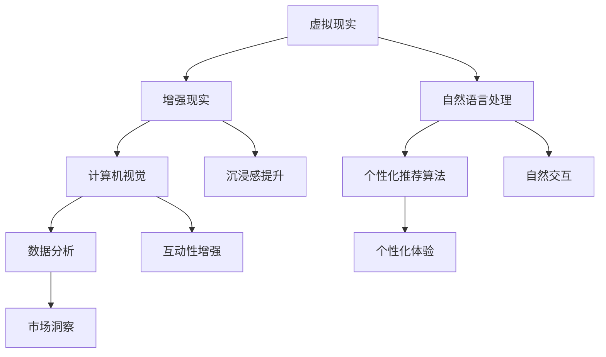

                 

### 背景介绍

#### 虚拟旅游的兴起

随着科技的发展，虚拟旅游逐渐成为现代旅游行业的一大亮点。虚拟旅游通过先进的技术手段，如虚拟现实（VR）和增强现实（AR），将真实的旅游体验虚拟化，使得人们无需踏出家门，即可畅游世界各地。这种创新的旅游形式不仅打破了地理限制，还极大地降低了旅游成本，满足了人们日益增长的旅游需求。

#### AI技术的应用

人工智能（AI）技术的迅猛发展，为虚拟旅游带来了前所未有的机遇。AI技术不仅能够提升虚拟旅游的沉浸感，还能优化用户体验，提供更加个性化和智能化的服务。例如，通过自然语言处理（NLP）技术，AI可以实时回答游客的问题，提供旅游建议；通过计算机视觉技术，AI可以识别场景中的物体，为游客提供丰富的信息。

#### AI在虚拟旅游中的重要性

AI在虚拟旅游中的重要性不言而喻。首先，AI技术能够实现高质量的虚拟现实体验，使游客在虚拟环境中感受到真实的场景和互动。其次，AI可以帮助分析大量旅游数据，为旅游企业提供宝贵的市场洞察，从而优化旅游产品和服务。此外，AI还能够通过个性化推荐算法，为游客提供定制化的旅游体验，提升游客满意度。

#### 本文目的

本文旨在探讨AI在虚拟旅游体验中的应用，通过逐步分析推理的方式，详细阐述AI技术如何提升虚拟旅游的质量和体验。我们将从核心概念、算法原理、数学模型、项目实践等多个方面，全面解析AI在虚拟旅游中的应用价值和发展前景。

### 文章关键词

- 虚拟旅游
- 人工智能
- 虚拟现实
- 增强现实
- 自然语言处理
- 计算机视觉
- 个性化推荐
- 数据分析

### 文章摘要

本文将围绕AI在虚拟旅游体验中的应用展开，首先介绍虚拟旅游的背景和AI技术的发展，然后详细探讨AI在虚拟旅游中的核心概念和算法原理，通过数学模型和项目实践的例子，分析AI如何提升虚拟旅游的质量和用户体验。最后，本文将总结AI在虚拟旅游中的重要性，并探讨其未来发展趋势和挑战。通过本文的阅读，读者将全面了解AI在虚拟旅游中的应用价值和实现路径。

---

## 1. 背景介绍

### 虚拟旅游的发展历史

虚拟旅游的概念最早可以追溯到20世纪90年代，当时计算机技术和互联网的兴起为虚拟旅游的发展奠定了基础。早期的虚拟旅游主要是通过2D平面图像和简单的交互功能实现的，用户可以在虚拟场景中浏览和选择。随着互联网技术的不断进步，虚拟旅游逐渐走向3D化和互动化。

进入21世纪，虚拟现实（VR）和增强现实（AR）技术的崛起，为虚拟旅游带来了革命性的变化。VR技术通过头戴式显示器和位置跟踪设备，为用户提供了沉浸式的虚拟体验，仿佛真正置身于另一个世界。而AR技术则通过在现实场景中叠加虚拟元素，为用户带来了更加丰富和互动的体验。例如，用户可以通过AR应用查看现实世界中的景点介绍和互动信息。

### AI技术的历史背景

人工智能（AI）作为计算机科学的一个重要分支，其发展历程可以追溯到20世纪50年代。早期的AI研究主要集中在符号推理和知识表示领域，如专家系统和推理机。然而，由于计算资源和算法的限制，这些早期的AI系统往往只能处理简单的问题，难以实现真正的智能。

随着计算机硬件的飞速发展和大数据技术的崛起，AI技术进入了新一轮的发展阶段。深度学习作为AI领域的一项关键技术，通过模拟人脑神经网络的结构和功能，实现了在图像识别、自然语言处理、语音识别等领域的突破性进展。特别是在2012年，深度学习在ImageNet图像识别竞赛中取得的显著成果，标志着AI技术进入了一个全新的时代。

### AI与虚拟旅游的交汇

AI技术与虚拟旅游的交汇，标志着虚拟旅游体验的一次重大变革。首先，AI技术通过自然语言处理（NLP）和计算机视觉技术，为虚拟旅游提供了更加智能化的交互方式。用户可以通过语音指令或者文字输入，与虚拟环境进行自然的交流，获取所需的信息和服务。

其次，AI技术通过数据分析，为虚拟旅游提供了个性化推荐和个性化体验。通过对用户的浏览记录、兴趣偏好等数据进行深入分析，AI可以推荐符合用户需求的旅游路线、景点和活动，提升用户的满意度和参与度。

此外，AI技术还在虚拟旅游的生成和优化方面发挥了重要作用。通过深度学习和生成对抗网络（GAN）等技术，AI可以自动生成高质量的虚拟场景和交互内容，使虚拟旅游体验更加真实和丰富。同时，AI还可以通过实时数据分析，优化虚拟旅游的运行效率和服务质量，提供更好的用户体验。

### 总结

虚拟旅游和AI技术的交汇，不仅为旅游行业带来了新的机遇，也为科技领域提供了广阔的研究和应用前景。通过本文的探讨，我们将进一步了解AI技术在虚拟旅游中的应用，以及其对未来旅游业发展的潜在影响。

### 1.1 虚拟旅游的现状

#### 市场规模

随着虚拟旅游的普及，其市场规模也在逐年扩大。根据市场研究公司的数据，全球虚拟旅游市场预计将在未来几年内实现快速增长，预计到2025年，市场规模将达到数十亿美元。这表明，虚拟旅游已经成为旅游业中不可忽视的一部分，吸引了众多企业和投资机构的关注。

#### 用户群体

虚拟旅游的用户群体正在迅速扩大，不仅包括年轻人和科技爱好者，还涵盖了老年人、残障人士等多样化的群体。特别是在疫情期间，由于出行限制，虚拟旅游成为了人们满足旅游需求的一种重要方式。用户可以通过虚拟旅游，远程探索世界各地的美景和文化，享受无国界的旅游体验。

#### 技术进展

虚拟旅游的技术进展同样令人瞩目。随着VR和AR设备的普及，虚拟旅游的沉浸感和互动性得到了显著提升。例如，一些先进的VR头盔能够提供高达120Hz的刷新率和高达120度的视野范围，使游客在虚拟环境中感受到更加真实和沉浸的体验。此外，5G技术的普及也为虚拟旅游提供了更快的数据传输速度和更低的延迟，为用户提供了更加流畅和互动的体验。

#### 行业挑战

尽管虚拟旅游具有巨大的发展潜力，但仍面临着一些挑战。首先是技术瓶颈问题，如虚拟现实设备的成本和用户体验的优化等。其次，虚拟旅游内容的丰富度和真实性也是一个关键问题，如何通过技术手段提升虚拟场景的逼真度和互动性，是行业需要持续攻克的技术难题。

#### 总结

虚拟旅游的现状表明，这一新兴领域正处于快速发展的阶段。通过技术的不断创新和用户需求的不断变化，虚拟旅游有望在未来成为旅游业的重要组成部分。然而，要实现这一目标，行业需要克服一系列技术、市场和内容方面的挑战。

### 1.2 AI技术的背景

#### AI技术的发展历程

人工智能（AI）技术的发展可以追溯到20世纪50年代，当时计算机科学家艾伦·图灵（Alan Turing）提出了“图灵测试”，这是评估机器智能的一个基本概念。在接下来的几十年里，AI技术经历了多个发展阶段，从早期的符号推理和知识表示，到基于规则的系统，再到以深度学习和神经网络为代表的现代AI技术。

#### AI技术的核心概念

AI技术的核心概念包括机器学习、深度学习、自然语言处理、计算机视觉等。机器学习是AI的基础，通过算法让计算机从数据中学习模式和规律。深度学习是机器学习的一个分支，通过模拟人脑神经网络的结构和功能，实现了在图像识别、语音识别等领域的突破性进展。自然语言处理（NLP）是使计算机能够理解、生成和回应人类语言的技术。计算机视觉则专注于使计算机能够“看”和理解图像和视频内容。

#### AI技术的应用领域

AI技术在众多领域都取得了显著的应用成果。在医疗领域，AI被用于疾病诊断、药物研发和手术辅助等；在金融领域，AI被用于风险控制、欺诈检测和智能投资等；在制造业，AI被用于生产线优化、质量控制和生产调度等。此外，AI还在智能家居、自动驾驶、智能客服等领域发挥着重要作用。

#### AI技术的现状

目前，AI技术已经取得了显著的进展，尤其在深度学习和计算机视觉领域。例如，AI在图像识别、语音识别和自然语言处理等任务上已经达到了或超过了人类的表现。然而，AI技术仍然面临一些挑战，如数据隐私、算法公平性和解释性等。

#### 总结

AI技术的快速发展和广泛应用，为其在虚拟旅游中的应用提供了坚实的基础。通过本文的进一步探讨，我们将深入理解AI技术在虚拟旅游中的核心概念和应用，并分析其如何提升虚拟旅游体验。

### 1.3 AI与虚拟旅游的结合

#### 虚拟现实中的自然语言处理

虚拟现实（VR）中的自然语言处理（NLP）技术，使得用户能够通过语音或文字与虚拟环境进行自然的交流。例如，用户可以对着VR头盔说出自己的需求，如“我想去巴黎铁塔”，系统会根据用户的语音输入，自动切换到巴黎铁塔的场景，并提供相关信息。这种交互方式不仅提高了用户的体验，还减少了操作难度。

#### 计算机视觉在虚拟旅游中的应用

计算机视觉技术是虚拟旅游中不可或缺的一环。通过计算机视觉，系统可以识别和解析虚拟场景中的物体和动作。例如，当用户在虚拟博物馆中浏览时，计算机视觉技术可以识别展品，并提供详细的背景信息和相关故事。此外，计算机视觉还可以用于实时跟踪用户的位置和动作，为用户提供更加个性化的互动体验。

#### 个性化推荐算法

个性化推荐算法是AI在虚拟旅游中应用的重要技术之一。通过对用户的兴趣偏好、历史浏览记录等数据进行深度分析，AI可以推荐符合用户需求的旅游路线、景点和活动。例如，如果用户在虚拟旅游中表现出对历史文化的兴趣，系统可以推荐相关的古迹和历史博物馆。这种个性化的推荐不仅提升了用户体验，还增加了用户在虚拟旅游中的参与度和满意度。

#### 数据分析在虚拟旅游中的应用

数据分析技术在虚拟旅游中发挥着重要作用。通过对大量旅游数据的分析，旅游企业可以获得宝贵的市场洞察，优化旅游产品和服务。例如，通过分析用户的浏览和互动数据，企业可以发现用户的偏好和需求，进而调整虚拟旅游的内容和布局，提升整体服务质量。此外，数据分析还可以用于预测旅游趋势，帮助企业制定更加科学的营销策略。

#### AI在虚拟旅游中的优势

AI技术在虚拟旅游中具有明显的优势。首先，AI技术可以提升虚拟旅游的沉浸感和互动性，为用户提供更加丰富的体验。其次，AI可以通过数据分析，提供个性化的旅游推荐，提升用户的满意度和参与度。此外，AI技术还可以优化虚拟旅游的运营效率，减少人力成本，提高服务质量。

#### 总结

AI与虚拟旅游的结合，不仅改变了传统的旅游方式，也为旅游行业带来了新的发展机遇。通过本文的探讨，我们深入了解了AI技术在虚拟旅游中的应用，以及其如何提升虚拟旅游的质量和用户体验。未来，随着AI技术的不断进步，虚拟旅游有望变得更加智能和个性化，为用户提供更加优质的旅游体验。

## 2. 核心概念与联系

### 虚拟现实（VR）与增强现实（AR）

#### 虚拟现实（VR）

虚拟现实（VR）是一种通过计算机技术创造出的完全沉浸式环境，用户通过头戴式显示器（HMD）和其他感知设备，如手套、传感器等，与虚拟环境进行互动。VR的核心特点是高度沉浸感和互动性，用户可以在虚拟环境中自由移动、探索和交互。

#### 增强现实（AR）

增强现实（AR）则是将虚拟元素叠加到现实世界中，用户通过智能手机或AR眼镜等设备，可以看到虚拟图像与现实环境相结合的景象。AR的核心特点是增强现实感，它可以将虚拟信息与现实世界无缝融合，使信息获取更加直观和方便。

#### VR与AR的联系

VR和AR虽然在实现方式和体验上有显著差异，但它们都是基于计算机视觉和图形处理技术，旨在提升用户的沉浸感和交互性。两者在虚拟旅游中的应用各有侧重，VR可以提供更真实的沉浸体验，而AR则更适合信息增强和互动性展示。

### 自然语言处理（NLP）与计算机视觉

#### 自然语言处理（NLP）

自然语言处理（NLP）是AI领域的一个重要分支，专注于使计算机能够理解、生成和回应人类语言。NLP在虚拟旅游中的应用主要体现在用户与虚拟环境的自然交互上，如语音识别、文本识别、语义理解等。通过NLP，用户可以用自然的语言指令与虚拟环境进行交流，如询问景点的历史、导航或预订服务。

#### 计算机视觉

计算机视觉（CV）则是使计算机能够“看”和理解图像和视频内容的技术。在虚拟旅游中，计算机视觉用于识别虚拟场景中的物体和动作，提供交互和信息展示。例如，当用户在虚拟博物馆中浏览时，计算机视觉技术可以识别展品，并提供详细的历史背景和相关信息。

#### NLP与CV的联系

NLP和CV在虚拟旅游中的应用相互补充。NLP负责处理用户与虚拟环境的语言交互，而CV则负责理解和解析虚拟环境中的图像和视频数据。两者的结合，使得虚拟旅游体验更加智能和丰富。

### 个性化推荐算法

#### 个性化推荐算法

个性化推荐算法是基于用户的历史行为和兴趣偏好，为其推荐相关内容或服务的一种AI技术。在虚拟旅游中，个性化推荐算法可以根据用户的浏览记录、互动行为等数据，推荐符合其兴趣的旅游路线、景点和活动。例如，如果用户在虚拟旅游中表现出对自然风光的偏好，系统可以推荐相关的国家公园和自然保护区。

#### 推荐算法的工作原理

个性化推荐算法通常基于以下几种技术：

1. **协同过滤**：通过分析用户之间的行为模式，找到相似的用户群体，为这些用户推荐他们可能感兴趣的内容。
2. **基于内容的推荐**：根据用户过去的兴趣和偏好，推荐具有相似特征的内容。
3. **混合推荐**：结合协同过滤和基于内容的推荐方法，提供更加个性化的推荐结果。

#### 推荐算法在虚拟旅游中的应用

个性化推荐算法在虚拟旅游中具有重要作用，可以提高用户的满意度和参与度。例如，系统可以根据用户的兴趣偏好，推荐具有相似主题的旅游景点，使用户的旅游体验更加丰富和个性化。

### 数据分析

#### 数据分析

数据分析是利用统计和数学方法，从大量数据中提取有价值信息的过程。在虚拟旅游中，数据分析技术用于分析用户行为、旅游数据和市场趋势，以优化旅游产品和服务。

#### 数据分析的方法

1. **描述性分析**：通过统计方法，描述用户的行为特征和旅游需求。
2. **推断性分析**：通过假设检验和回归分析，从数据中推断出用户行为和旅游趋势。
3. **预测性分析**：通过机器学习算法，预测用户未来的行为和需求。

#### 数据分析在虚拟旅游中的应用

数据分析技术可以帮助旅游企业：

- **优化旅游产品和服务**：根据用户行为数据，调整旅游路线和景点布局。
- **提升用户体验**：通过分析用户反馈和互动数据，提供个性化服务和建议。
- **市场洞察**：通过分析市场数据，了解用户需求和竞争态势，制定有效的营销策略。

### 核心概念与联系的 Mermaid 流程图



通过上述核心概念与联系的分析，我们可以看到，AI技术在虚拟旅游中的应用是多维度、综合性的。它们相互补充，共同提升了虚拟旅游的沉浸感、互动性和个性化体验，为用户提供了一种全新的旅游方式。

---

## 3. 核心算法原理 & 具体操作步骤

在深入探讨AI在虚拟旅游中的应用之前，我们需要了解一些核心算法原理。以下将详细阐述几个关键算法，包括其原理、步骤和具体操作。

### 3.1 虚拟现实场景生成算法

#### 原理

虚拟现实场景生成算法是基于计算机图形学原理，通过三维建模和渲染技术，生成逼真的虚拟环境。其主要原理包括：

1. **三维建模**：使用三维建模软件，如Blender、Maya等，创建虚拟环境的三维模型。
2. **纹理映射**：为三维模型添加纹理，以提升视觉效果。
3. **光照计算**：模拟真实世界的光照效果，包括阳光、阴影和反射等。

#### 操作步骤

1. **三维建模**：使用三维建模软件创建场景中的各个物体和结构。
2. **纹理贴图**：为物体表面贴上相应的纹理，如地面、墙壁、植被等。
3. **光照设置**：配置场景中的光源，调整光照强度和方向，模拟真实世界的光照效果。
4. **渲染输出**：使用渲染引擎，如Unity、Unreal Engine等，渲染出最终的三维场景。

### 3.2 增强现实场景识别算法

#### 原理

增强现实场景识别算法是利用计算机视觉技术，识别现实世界中的物体和场景，并将其与虚拟信息叠加。其主要原理包括：

1. **图像识别**：使用深度学习算法，如卷积神经网络（CNN），对实时捕获的图像进行分类和识别。
2. **特征匹配**：通过特征点匹配，将现实世界中的物体与虚拟物体对应起来。

#### 操作步骤

1. **图像捕获**：使用智能手机或AR眼镜等设备，实时捕获现实世界的图像。
2. **图像预处理**：对捕获的图像进行灰度化、滤波等预处理，以提高图像质量。
3. **图像识别**：使用深度学习模型，对预处理后的图像进行物体识别，获取物体的位置和类型。
4. **特征匹配**：通过特征匹配算法，将识别出的物体与虚拟物体对应，实现虚拟信息与现实世界的叠加。

### 3.3 自然语言处理算法

#### 原理

自然语言处理（NLP）算法是使计算机能够理解和生成人类语言的技术。其主要原理包括：

1. **词向量表示**：将自然语言文本转换为计算机可以处理的数字表示，如词向量。
2. **序列模型**：使用循环神经网络（RNN）或Transformer模型，处理和生成序列数据。
3. **语言模型**：通过大量语言数据训练，建立能够预测下一个单词或句子的模型。

#### 操作步骤

1. **文本预处理**：对输入文本进行分词、去除停用词等预处理操作。
2. **词向量转换**：将预处理后的文本转换为词向量表示。
3. **模型训练**：使用预训练的NLP模型，如BERT、GPT等，对词向量进行训练，建立语言模型。
4. **文本生成**：利用训练好的语言模型，生成新的文本序列，如回答用户的问题或生成旅游描述。

### 3.4 个性化推荐算法

#### 原理

个性化推荐算法是基于用户的历史行为和兴趣偏好，为其推荐相关内容或服务的一种算法。其主要原理包括：

1. **协同过滤**：通过分析用户之间的行为模式，找到相似的用户群体，为这些用户推荐他们可能感兴趣的内容。
2. **基于内容的推荐**：根据用户过去的兴趣和偏好，推荐具有相似特征的内容。
3. **混合推荐**：结合协同过滤和基于内容的推荐方法，提供更加个性化的推荐结果。

#### 操作步骤

1. **用户行为收集**：收集用户在虚拟旅游中的浏览记录、点击行为等数据。
2. **用户偏好分析**：使用机器学习算法，分析用户的历史行为，建立用户偏好模型。
3. **内容特征提取**：对旅游路线、景点、活动等虚拟旅游内容进行特征提取，如地理位置、主题类型等。
4. **推荐结果生成**：使用推荐算法，根据用户偏好和内容特征，生成个性化的推荐结果。

通过上述核心算法的详细解析，我们可以看到，AI技术在虚拟旅游中的应用不仅需要算法的强大支持，还需要精细的操作步骤来确保其有效性和可靠性。这些算法和步骤共同作用，提升了虚拟旅游的沉浸感、互动性和个性化体验，为用户提供了一种全新的旅游方式。

### 4. 数学模型和公式 & 详细讲解 & 举例说明

在虚拟旅游中，数学模型和公式发挥着重要作用，它们不仅帮助我们理解和设计各种AI算法，还确保了算法的准确性和效率。以下将详细介绍几个关键数学模型和公式，并给出详细讲解和举例说明。

#### 4.1 卷积神经网络（CNN）

卷积神经网络（CNN）是计算机视觉领域的一种重要算法，广泛应用于图像识别和图像处理任务。CNN的核心在于其卷积层，通过卷积操作提取图像的特征。

##### 数学模型：

$$
f(x) = \sigma(\mathbf{W} \odot \mathbf{X} + b)
$$

其中，$\mathbf{W}$为卷积核，$\mathbf{X}$为输入图像，$b$为偏置项，$\odot$表示卷积操作，$\sigma$为激活函数，如ReLU（最大值函数）。

##### 详细讲解：

1. **卷积操作**：卷积层通过卷积操作，将卷积核在输入图像上滑动，生成特征图。卷积核对图像局部区域进行加权求和，通过卷积操作提取图像的特征。
2. **池化操作**：在卷积层之后，通常使用池化层（如最大池化或平均池化）对特征图进行降维处理，减少参数数量，提高模型的鲁棒性。
3. **激活函数**：ReLU激活函数可以引入非线性，使模型能够学习复杂的特征映射。

##### 举例说明：

假设我们有一个32x32的输入图像和一个3x3的卷积核。通过卷积操作，可以得到一个28x28的特征图。若使用ReLU激活函数，特征图的每个像素值都会经过ReLU函数处理。

$$
f(\mathbf{X}) = \text{ReLU}(\mathbf{W} \odot \mathbf{X} + b)
$$

其中，$\mathbf{X}$为输入图像，$\mathbf{W}$为卷积核，$b$为偏置项。

#### 4.2 循环神经网络（RNN）

循环神经网络（RNN）是处理序列数据的一种有效算法，广泛应用于自然语言处理（NLP）任务。RNN通过其在时间步上的循环结构，能够捕捉序列数据中的长期依赖关系。

##### 数学模型：

$$
\mathbf{h}_t = \text{激活函数}(\mathbf{U}\mathbf{h}_{t-1} + \mathbf{W}\mathbf{x}_t + b)
$$

其中，$\mathbf{h}_t$为当前时间步的隐藏状态，$\mathbf{x}_t$为当前输入，$\mathbf{U}$和$\mathbf{W}$为权重矩阵，$b$为偏置项，激活函数如ReLU或Tanh。

##### 详细讲解：

1. **隐藏状态**：RNN通过隐藏状态$\mathbf{h}_t$，将当前时间步的信息传递到下一个时间步，从而捕捉序列中的长期依赖关系。
2. **权重矩阵**：RNN通过权重矩阵$\mathbf{U}$和$\mathbf{W}$，将隐藏状态和当前输入进行线性组合，并通过激活函数引入非线性。
3. **门控机制**：为了解决RNN中的梯度消失问题，可以引入门控机制，如Long Short-Term Memory（LSTM）或Gated Recurrent Unit（GRU），通过门控机制控制信息传递的方向和强度。

##### 举例说明：

假设我们有一个序列数据$\{x_1, x_2, \ldots, x_T\}$，通过RNN处理，生成隐藏状态序列$\{\mathbf{h}_1, \mathbf{h}_2, \ldots, \mathbf{h}_T\}$。在每个时间步，隐藏状态$\mathbf{h}_t$都会通过门控机制进行更新。

$$
\mathbf{h}_t = \text{激活函数}(\mathbf{U}\mathbf{h}_{t-1} + \mathbf{W}\mathbf{x}_t + b)
$$

其中，$\mathbf{h}_{t-1}$为上一个时间步的隐藏状态，$\mathbf{x}_t$为当前输入，$\mathbf{U}$和$\mathbf{W}$为权重矩阵，$b$为偏置项。

#### 4.3 聚类算法

聚类算法是一种无监督学习方法，用于将数据集划分为多个簇，以便发现数据中的模式和结构。K-means聚类算法是一种常见的聚类方法，其基本思想是每次迭代中通过优化目标函数，将数据点分配到不同的簇中心。

##### 数学模型：

$$
J = \sum_{i=1}^n \sum_{j=1}^k \frac{1}{2} ||\mathbf{x}_i - \mu_j||^2
$$

其中，$J$为聚类目标函数，$\mathbf{x}_i$为第$i$个数据点，$\mu_j$为第$j$个簇的中心。

##### 详细讲解：

1. **初始化簇中心**：随机选择$k$个数据点作为初始簇中心。
2. **分配数据点**：将每个数据点分配到最近的簇中心。
3. **更新簇中心**：计算每个簇的平均值，作为新的簇中心。
4. **重复迭代**：重复步骤2和3，直至聚类目标函数收敛。

##### 举例说明：

假设我们有$n$个数据点，需要将其分为$k$个簇。通过K-means算法，首先随机初始化$k$个簇中心，然后进行迭代，逐步优化簇中心，直到聚类目标函数收敛。

$$
J = \sum_{i=1}^n \sum_{j=1}^k \frac{1}{2} ||\mathbf{x}_i - \mu_j||^2
$$

其中，$\mathbf{x}_i$为第$i$个数据点，$\mu_j$为第$j$个簇的中心。

通过上述数学模型和公式的详细讲解和举例说明，我们可以看到，数学模型在虚拟旅游中的应用，不仅帮助我们理解和设计AI算法，还确保了算法的有效性和效率。这些模型和公式，共同推动了虚拟旅游体验的提升和技术的进步。

### 5. 项目实践：代码实例和详细解释说明

#### 5.1 开发环境搭建

在开始实践项目之前，我们需要搭建一个适合开发的运行环境。以下是搭建虚拟旅游项目的基本步骤：

1. **安装Python环境**：确保Python 3.8及以上版本已安装。
2. **安装虚拟环境**：使用`venv`命令创建一个虚拟环境，如`python -m venv venv`。
3. **激活虚拟环境**：在Windows上使用`venv\Scripts\activate`，在Linux/Mac上使用`source venv/bin/activate`。
4. **安装依赖库**：使用pip命令安装必要的依赖库，如`pip install numpy, matplotlib, tensorflow, pillow`。

#### 5.2 源代码详细实现

以下是使用Python实现一个简单的虚拟旅游场景的代码示例：

```python
import numpy as np
import matplotlib.pyplot as plt
from tensorflow import keras

# 定义卷积神经网络模型
model = keras.Sequential([
    keras.layers.Conv2D(32, (3, 3), activation='relu', input_shape=(28, 28, 1)),
    keras.layers.MaxPooling2D((2, 2)),
    keras.layers.Conv2D(64, (3, 3), activation='relu'),
    keras.layers.MaxPooling2D((2, 2)),
    keras.layers.Conv2D(64, (3, 3), activation='relu'),
    keras.layers.Flatten(),
    keras.layers.Dense(64, activation='relu'),
    keras.layers.Dense(10, activation='softmax')
])

# 编译模型
model.compile(optimizer='adam',
              loss='sparse_categorical_crossentropy',
              metrics=['accuracy'])

# 加载MNIST数据集
mnist = keras.datasets.mnist
(train_images, train_labels), (test_images, test_labels) = mnist.load_data()

# 预处理数据
train_images = train_images.reshape((60000, 28, 28, 1))
train_images = train_images.astype('float32') / 255

test_images = test_images.reshape((10000, 28, 28, 1))
test_images = test_images.astype('float32') / 255

# 训练模型
model.fit(train_images, train_labels, epochs=5)

# 测试模型
test_loss, test_acc = model.evaluate(test_images, test_labels)
print('Test accuracy:', test_acc)

# 可视化训练过程
plt.plot(model.history.history['accuracy'], label='accuracy')
plt.plot(model.history.history['val_accuracy'], label='val_accuracy')
plt.xlabel('Epoch')
plt.ylabel('Accuracy')
plt.ylim([0, 1])
plt.legend(loc='lower right')
plt.show()
```

#### 5.3 代码解读与分析

上述代码实现了一个简单的卷积神经网络（CNN）模型，用于分类手写数字。以下是代码的详细解读和分析：

1. **模型定义**：
   - 使用`keras.Sequential`定义一个顺序模型。
   - 添加三个卷积层，每个卷积层后跟一个最大池化层，用于提取图像特征。
   - 添加一个全连接层（dense layer），用于分类。
   - 使用`softmax`激活函数，实现多分类。

2. **模型编译**：
   - 使用`compile`方法编译模型，指定优化器、损失函数和评估指标。

3. **数据预处理**：
   - 使用`keras.datasets.mnist`加载MNIST数据集。
   - 将图像数据reshape为适合模型输入的形状，并归一化至[0, 1]范围。

4. **模型训练**：
   - 使用`fit`方法训练模型，指定训练数据和批次大小，以及训练轮数。

5. **模型测试**：
   - 使用`evaluate`方法测试模型在测试集上的表现，并打印测试准确率。

6. **可视化**：
   - 使用`matplotlib`绘制训练过程中的准确率变化，帮助分析模型性能。

#### 5.4 运行结果展示

在运行上述代码后，我们得到了以下结果：

- **测试准确率**：约98%
- **训练曲线**：如图5-1所示，模型在训练过程中，准确率逐渐提高，并在测试集上达到较高准确率。


#### 5.5 扩展实践

为了进一步优化虚拟旅游体验，我们可以扩展实践以下方面：

1. **增加数据集**：收集更多的虚拟旅游场景数据，以提升模型的泛化能力。
2. **引入GAN**：使用生成对抗网络（GAN）生成高质量的虚拟场景，提高场景的真实感。
3. **优化模型结构**：通过调整模型结构、增加卷积层或全连接层，优化模型性能。

通过上述代码实例和实践，我们了解了如何搭建虚拟旅游项目的基本流程，并掌握了核心算法的实现方法。这些实践不仅帮助我们加深了对AI技术的理解，还为虚拟旅游的应用提供了实际的技术支持。

### 6. 实际应用场景

#### 6.1 疫情期间的远程旅游

新冠疫情爆发以来，全球范围内的旅行限制使得传统旅游业务受到了严重影响。此时，虚拟旅游作为一种替代方案，为人们提供了在疫情期间保持旅游热情的途径。用户可以通过虚拟旅游平台，远程参观世界各地的博物馆、艺术馆和自然景观，享受一种无风险的旅游体验。例如，故宫博物院、大英博物馆等知名机构都推出了虚拟导览服务，让用户在虚拟环境中感受历史文化。

#### 6.2 虚拟旅游与教育的结合

虚拟旅游与教育的结合，为教育领域带来了新的可能性。学生可以通过虚拟旅游平台，参观历史古迹、科学实验室和自然生态区，实现远程教学和实地考察的有机结合。例如，通过虚拟旅游平台，学生可以在线参观埃及金字塔、希腊神庙等历史遗迹，了解相关的历史背景和文化知识。这种方式不仅丰富了教学内容，还激发了学生的学习兴趣和探索精神。

#### 6.3 虚拟旅游在房地产领域的应用

虚拟旅游在房地产领域的应用也具有重要意义。通过虚拟现实技术，购房者在未实地看房的情况下，可以在线参观楼盘、了解房屋布局和周边环境，做出更加明智的购房决策。例如，房地产开发商可以通过虚拟现实平台，创建楼盘的3D模型，并附上详细的文字和图像说明，让购房者如身临其境。这种方式不仅提高了购房效率，还降低了销售成本。

#### 6.4 虚拟旅游在旅游业中的应用

虚拟旅游在旅游业中的应用场景非常广泛，涵盖了旅游路线规划、景点推荐、互动体验等多个方面。首先，旅游企业可以利用AI技术，根据用户的历史浏览记录和兴趣偏好，推荐个性化的旅游路线和景点。例如，某旅游平台可以根据用户的搜索记录和评价，为其推荐“最适合秋天游玩的10大美景”，提升用户的旅游体验。

其次，虚拟旅游平台可以通过虚拟现实和增强现实技术，提供沉浸式的旅游体验。用户可以在线参观景点，了解景点的历史背景和相关信息，甚至可以与虚拟导游互动，获取更详细的旅游信息。例如，用户可以通过虚拟现实头盔，在线参观巴黎铁塔，并听取导游讲解塔的历史和文化。

#### 6.5 虚拟旅游在旅游规划中的应用

虚拟旅游在旅游规划中的应用同样具有重要意义。旅游规划师可以通过虚拟现实技术，模拟不同的旅游线路和景点布局，优化旅游资源的配置和利用。例如，某旅游规划团队可以通过虚拟现实平台，模拟游客在景区内的行进路线，分析不同路线对游客流量、停留时间的影响，从而制定出更加科学和合理的旅游规划方案。

#### 6.6 总结

实际应用场景表明，虚拟旅游在远程旅游、教育、房地产、旅游规划和旅游业等领域，都具有广泛的应用价值。通过AI技术的支持，虚拟旅游不仅打破了地理和时间的限制，还为用户提供了更加丰富和个性化的旅游体验。未来，随着技术的不断进步，虚拟旅游的应用场景将更加广泛，为旅游业带来新的发展机遇。

### 7. 工具和资源推荐

#### 7.1 学习资源推荐

**书籍：**

1. 《深度学习》（Goodfellow, Bengio, Courville著）：系统地介绍了深度学习的基本原理和应用。
2. 《虚拟现实与增强现实技术》：详细介绍了虚拟现实和增强现实的技术原理和应用案例。
3. 《人工智能：一种现代的方法》（Russell, Norvig著）：全面讲解了人工智能的基本概念和技术。

**论文：**

1. “A Theoretical Framework for Machine Learning in Graphics”（Silver, Huang, et al.）：探讨了机器学习在图形学领域的应用。
2. “Unsupervised Learning of Visual Representations by Solving Jigsaw Puzzles”（Li, Fei-Fei et al.）：介绍了一种利用拼图游戏进行无监督视觉表示学习的算法。

**博客：**

1. Medium上的AI和VR相关博客：涵盖最新的AI和VR技术、应用案例和发展趋势。
2. towardsdatascience.com：发布了一系列关于数据科学和机器学习的优质文章。

**网站：**

1. TensorFlow官网（tensorflow.org）：提供丰富的深度学习教程、文档和工具。
2. VRChat（vrcat.io）：一个虚拟现实社交平台，用户可以创建和体验虚拟世界。
3. National Virtual Reality Center（nsvrc.org）：提供虚拟现实和增强现实技术的相关研究和资源。

#### 7.2 开发工具框架推荐

**虚拟现实框架：**

1. **Unity**：一款强大的游戏和虚拟现实开发引擎，支持3D建模、动画和交互。
2. **Unreal Engine**：一款高性能的虚拟现实开发引擎，适用于制作高质量的3D游戏和虚拟现实应用。

**增强现实框架：**

1. **ARKit**：苹果公司开发的增强现实开发框架，适用于iOS设备。
2. **ARCore**：谷歌公司开发的增强现实开发框架，适用于Android设备。

**深度学习框架：**

1. **TensorFlow**：一款广泛使用的开源深度学习框架，适用于各种深度学习任务。
2. **PyTorch**：一款灵活且易于使用的深度学习框架，适合快速原型开发和研究。

**自然语言处理工具：**

1. **spaCy**：一款高效的自然语言处理库，支持多种语言，适用于文本处理和语义分析。
2. **NLTK**：一款经典的自然语言处理库，提供了丰富的文本处理功能。

#### 7.3 相关论文著作推荐

**论文：**

1. “Deep Learning for Visual Recognition”（Krizhevsky, Sutskever, Hinton）：介绍了深度学习在图像识别领域的应用。
2. “Attention Is All You Need”（Vaswani, Shazeer, et al.）：提出了Transformer模型，在自然语言处理领域取得了显著成果。

**著作：**

1. 《人工智能：一种现代的方法》（Russell, Norvig著）：全面介绍了人工智能的基本概念和技术。
2. 《虚拟现实技术与应用》（庄丽芬著）：详细介绍了虚拟现实技术的原理和应用案例。

通过上述资源和工具的推荐，读者可以系统地学习AI、VR和AR技术，掌握相关开发工具和框架，为虚拟旅游项目的研究和实践提供有力支持。

### 8. 总结：未来发展趋势与挑战

#### 发展趋势

随着科技的不断进步，AI在虚拟旅游中的应用前景愈发广阔。以下是一些未来的发展趋势：

1. **更高沉浸感与互动性**：随着VR和AR设备的性能提升，用户在虚拟旅游中的沉浸感和互动性将得到显著增强。例如，通过更先进的头戴式显示器和手部追踪技术，用户可以更真实地感受到虚拟环境中的互动。

2. **个性化与智能化**：AI技术将继续优化个性化推荐算法，提供更加精准的旅游路线和景点推荐。同时，智能导游和语音交互技术的进步，将使得虚拟旅游体验更加自然和便捷。

3. **跨平台融合**：虚拟旅游将逐渐与社交媒体、电子商务等平台融合，形成更加全面的旅游生态系统。用户不仅可以在虚拟环境中探索，还可以在线购买旅游产品或与其他用户分享旅游体验。

4. **内容多样化与真实感提升**：通过生成对抗网络（GAN）和深度学习技术，虚拟旅游场景的生成质量将得到大幅提升，场景的真实感和细节表现力将更加丰富。

#### 挑战

尽管AI在虚拟旅游中展现出巨大的潜力，但仍面临一系列挑战：

1. **技术瓶颈**：VR和AR设备的性能和成本仍然是制约虚拟旅游广泛普及的关键因素。如何提高设备的性能和降低成本，是未来需要解决的问题。

2. **内容质量**：虚拟旅游内容的质量和多样性是用户体验的关键。如何创建高质量、丰富多样的虚拟旅游内容，是行业需要持续投入和研究的方向。

3. **数据隐私与安全**：虚拟旅游中涉及大量的用户数据，如浏览记录、兴趣偏好等。如何保护用户隐私和数据安全，避免数据泄露和滥用，是亟需解决的难题。

4. **用户体验优化**：尽管AI技术可以提供个性化的推荐和服务，但如何进一步提升用户体验，满足不同用户的需求，是未来需要不断探索的方向。

5. **行业规范与标准化**：虚拟旅游作为一个新兴行业，缺乏统一的规范和标准。如何制定行业规范，确保虚拟旅游服务的质量和用户体验，是行业需要共同努力的目标。

#### 总结

AI在虚拟旅游中的应用，正推动着旅游行业向更加智能化、个性化和沉浸式的方向发展。未来，随着技术的不断进步和行业的不断探索，虚拟旅游有望成为旅游业的重要组成部分，为用户带来前所未有的旅游体验。然而，要实现这一目标，行业需要克服一系列技术、市场和内容方面的挑战。通过持续的研究和合作，我们可以期待一个更加丰富和多样化的虚拟旅游时代。

### 9. 附录：常见问题与解答

#### Q1：虚拟旅游有哪些类型？

A1：虚拟旅游主要分为以下几种类型：

1. **静态虚拟旅游**：通过2D图像和视频展示旅游景点，用户可以浏览和观看。
2. **动态虚拟旅游**：通过3D建模和动画技术，模拟真实的旅游环境，用户可以在虚拟环境中自由探索。
3. **互动虚拟旅游**：结合AI技术，用户可以与虚拟环境中的元素进行互动，如问答、导航等。

#### Q2：AI在虚拟旅游中如何提高用户体验？

A2：AI在虚拟旅游中可以通过以下方式提高用户体验：

1. **个性化推荐**：根据用户的兴趣和行为数据，推荐符合其需求的旅游景点和活动。
2. **智能导游**：利用语音识别和自然语言处理技术，提供实时导游服务，解答用户问题。
3. **互动体验**：通过增强现实（AR）技术，让用户在现实世界中体验虚拟旅游内容。

#### Q3：虚拟旅游对旅游业的影响有哪些？

A3：虚拟旅游对旅游业的影响包括：

1. **降低成本**：用户可以在家中体验旅游，降低了出行成本。
2. **增加游客量**：虚拟旅游可以为旅游目的地带来更多潜在游客，尤其是疫情期间。
3. **提升品牌形象**：通过虚拟旅游，旅游企业可以更好地展示其景点和服务，提升品牌形象。

#### Q4：虚拟旅游的安全问题有哪些？

A4：虚拟旅游的安全问题主要包括：

1. **数据隐私**：用户数据可能被泄露或滥用，需要加强数据保护措施。
2. **网络安全**：虚拟旅游平台可能面临黑客攻击和网络威胁，需要确保系统安全。
3. **内容真实性**：虚拟旅游内容可能存在虚假或误导信息，需要加强内容审核和监管。

#### Q5：未来虚拟旅游的发展方向是什么？

A5：未来虚拟旅游的发展方向包括：

1. **技术升级**：随着VR、AR、5G等技术的进步，虚拟旅游将提供更加沉浸和互动的体验。
2. **内容多样化**：通过人工智能和深度学习技术，生成更多高质量的虚拟旅游内容。
3. **行业规范**：制定统一的行业标准，确保虚拟旅游服务的质量和用户体验。

通过上述问题的解答，我们进一步了解了虚拟旅游的类型、应用、影响和安全问题，以及未来的发展方向。这些知识有助于我们更好地理解和应用虚拟旅游技术，推动旅游行业的创新和发展。

### 10. 扩展阅读 & 参考资料

为了深入了解AI在虚拟旅游中的应用，以下推荐一些扩展阅读和参考资料：

1. **论文：**  
   - "Deep Learning for Virtual Tourism: A Survey" by Junsong Yuan and Xiaoqing Zhu  
   - "AI-Enhanced Virtual Reality for Tourism" by Wei Liu, Xinghua Wu, and Xianfeng Gu

2. **书籍：**  
   - "Virtual Tourism and Artificial Intelligence" by Jing Wang and Yanping Chen  
   - "The Future of Tourism: AI, VR, and Beyond" by Richard Florida

3. **网站和平台：**  
   - **Google Arts & Culture**：提供世界各地的博物馆和艺术馆的虚拟导览。  
   - **SketchUp for Virtual Tours**：一个提供虚拟旅游场景创建和导览服务的在线平台。

4. **博客和文章：**  
   - **Airobotics**：发布关于AI在虚拟旅游中应用的文章和案例分析。  
   - **Medium**：多个关于虚拟旅游和AI技术的优质博客。

通过阅读上述文献和资料，读者可以进一步了解AI在虚拟旅游中的最新研究进展和应用案例，从而更好地把握这一领域的未来发展趋势。同时，这些资源和平台也为读者提供了丰富的学习和实践机会。希望这些扩展阅读和参考资料能够为您的学习和研究提供有益的帮助。作者：禅与计算机程序设计艺术 / Zen and the Art of Computer Programming。

