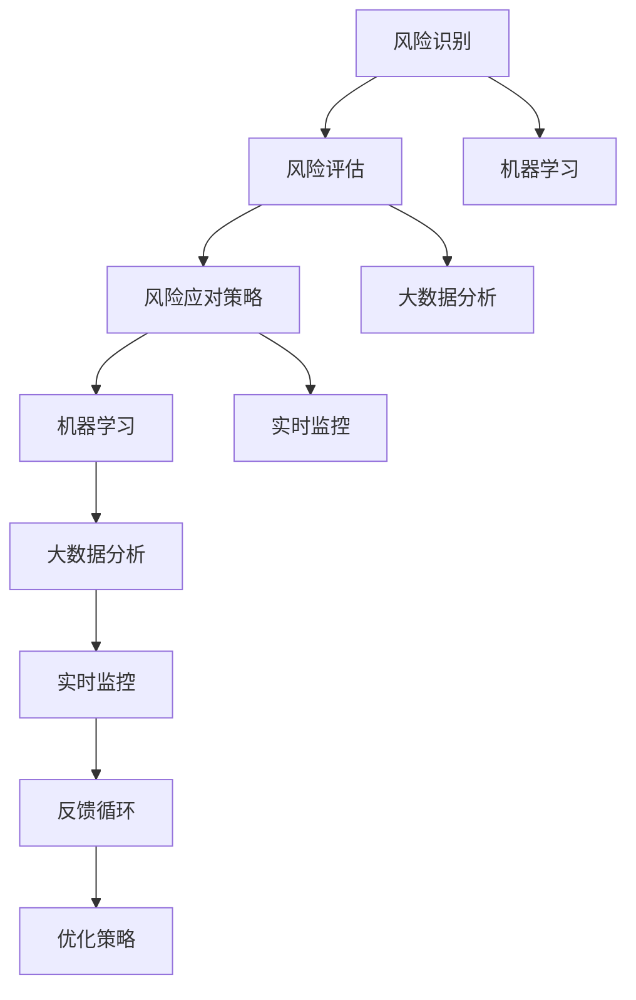

                 

### 背景介绍

**AI 在项目风险评估中的作用**是一篇深入探讨人工智能（Artificial Intelligence, AI）如何提升项目管理效率和效果的文章。在当今快速变化和竞争激烈的商业环境中，项目风险评估显得尤为重要。传统的风险评估方法往往依赖于人为判断和经验，这种方法的局限性显而易见：主观性较强、时效性较低、难以量化。而人工智能的出现为这一领域带来了全新的机遇。

**项目风险评估**是指通过对项目潜在风险的分析、评估和管理，以确保项目目标的实现。这一过程涉及对各种风险的识别、评估和应对策略的制定。这些风险可能包括财务风险、技术风险、市场风险、操作风险等。有效的风险评估能够帮助项目管理者提前发现潜在问题，制定针对性的应对措施，从而减少损失，提高项目成功率。

**人工智能在项目风险评估中的作用**主要体现在以下几个方面：

1. **数据分析与预测**：AI可以处理和分析大量数据，从历史项目数据中提取有价值的信息，对未来的风险进行预测。这种预测基于大数据分析和机器学习算法，能够提供更加精准和及时的预测结果。
2. **模式识别**：AI在模式识别方面具有显著优势，能够发现人类难以察觉的风险信号和趋势。例如，通过分析项目进度、资源使用等数据，AI可以识别出潜在的问题并提前预警。
3. **自动化决策**：AI可以辅助项目管理者进行决策，通过模拟不同的风险场景，提供最优的应对策略。这不仅提高了决策效率，还减少了人为决策的主观偏差。
4. **实时监控**：AI系统可以实时监控项目进展，及时发现和响应新的风险事件。这种实时性对于动态调整风险管理策略至关重要。

本文将首先介绍项目风险评估的背景和传统方法，然后深入探讨AI在风险评估中的应用，包括核心概念、算法原理、数学模型、项目实践以及实际应用场景。最后，我们将对AI在项目风险评估领域的未来发展趋势和挑战进行展望。希望通过本文的讨论，能够帮助读者更全面地理解AI在项目风险管理中的重要作用，并为其在实践中的应用提供有益的启示。

### 核心概念与联系

在深入探讨AI在项目风险评估中的应用之前，我们需要明确几个核心概念，并了解它们之间的相互关系。以下是本文将涉及的主要核心概念：

1. **风险识别**：这是项目风险评估的初始步骤，涉及识别项目中可能出现的各种风险。这些风险可以是财务风险、技术风险、市场风险、操作风险等。
2. **风险评估**：这一步骤是对已识别的风险进行量化分析，评估其可能性和影响程度。风险评估通常使用定性和定量方法。
3. **风险应对策略**：根据风险评估的结果，制定相应的应对策略，以降低风险或将其转化为机会。
4. **机器学习**：一种人工智能技术，通过训练模型从数据中学习规律，进行预测和决策。
5. **大数据分析**：利用大量数据进行分析，以发现隐藏的模式和趋势。
6. **实时监控**：对项目进展进行实时跟踪和监控，以及时发现和响应新的风险事件。

下面，我们将通过一个Mermaid流程图来展示这些核心概念之间的相互关系。



### 核心算法原理 & 具体操作步骤

在了解了核心概念及其相互关系后，我们将进一步探讨AI在项目风险评估中的核心算法原理及具体操作步骤。

#### 1. 机器学习算法

机器学习是AI的重要组成部分，它通过训练模型来预测和分类数据。在项目风险评估中，机器学习算法通常用于风险识别和风险评估。

**算法原理**：

- **监督学习**：在这种方法中，模型通过历史数据（输入和相应的输出标签）进行训练，然后使用这些训练好的模型对新数据进行预测。常见的监督学习算法包括决策树、支持向量机（SVM）和神经网络。

- **无监督学习**：与监督学习不同，无监督学习不依赖于已标记的数据。它主要用于发现数据中的模式和结构，如聚类算法（K-means、DBSCAN）和降维算法（PCA）。

**操作步骤**：

1. **数据收集**：收集与项目相关的历史数据，包括风险事件的类型、发生时间、影响程度等。
2. **数据预处理**：对收集到的数据进行分析和处理，包括数据清洗、特征选择和特征工程。
3. **模型训练**：使用预处理后的数据训练机器学习模型。选择合适的算法并调整参数，以达到最佳性能。
4. **模型评估**：使用验证集和测试集对模型进行评估，确保其预测能力。常用的评估指标包括准确率、召回率、F1分数等。
5. **模型部署**：将训练好的模型部署到实际项目中，用于风险识别和预测。

#### 2. 大数据分析技术

大数据分析在项目风险评估中起着关键作用，它可以帮助我们识别潜在的风险信号和趋势。

**算法原理**：

- **数据挖掘**：数据挖掘是一种从大量数据中发现隐藏模式和规则的方法。常见的算法包括关联规则学习、分类和聚类。

- **实时分析**：实时分析技术可以对项目进展数据进行实时监控，以发现新的风险信号。常见的算法包括流处理和实时查询。

**操作步骤**：

1. **数据收集**：收集与项目相关的实时数据，如项目进度、资源使用、财务状况等。
2. **数据预处理**：对实时数据进行预处理，包括数据清洗、特征提取和变换。
3. **数据存储**：将预处理后的数据存储在数据仓库或数据湖中，以供后续分析。
4. **数据挖掘**：使用数据挖掘算法对存储的数据进行分析，发现潜在的风险信号和趋势。
5. **实时监控**：使用实时分析技术对项目进展进行实时监控，及时发现新的风险事件。

#### 3. 实时监控和反馈循环

实时监控和反馈循环是AI在项目风险评估中的另一个关键组成部分。

**算法原理**：

- **实时监控**：通过传感器、日志和其他数据源实时收集项目进展数据，以便及时发现风险事件。

- **反馈循环**：根据实时监控的数据，自动调整风险管理策略，以应对新的风险事件。

**操作步骤**：

1. **数据收集**：使用传感器和日志收集项目进展数据。
2. **数据处理**：对收集到的数据进行实时处理和分析，识别潜在的风险事件。
3. **决策生成**：基于分析结果，自动生成风险管理决策。
4. **策略调整**：根据决策结果，调整风险管理策略。
5. **反馈**：将调整后的策略应用于实际项目，并持续监控其效果。

通过以上步骤，AI在项目风险评估中可以实现高效的自动化和智能化管理，为项目成功提供有力保障。

### 数学模型和公式 & 详细讲解 & 举例说明

在项目风险评估中，数学模型和公式扮演着至关重要的角色。它们不仅帮助我们量化风险，还能提供更为精确的预测和决策支持。以下，我们将详细介绍一些常用的数学模型和公式，并辅以具体的例子进行说明。

#### 1. 风险评估矩阵

风险评估矩阵是一种常用的定量分析方法，用于评估风险的可能性和影响程度。其核心公式如下：

\[ \text{风险评分} = \text{可能性} \times \text{影响程度} \]

**例子**：假设一个项目中有两个风险，一个是财务风险，另一个是技术风险。财务风险的可能性为60%，影响程度为中等，即0.5；技术风险的可能性为40%，影响程度为高，即0.8。我们可以计算这两个风险的评分：

\[ \text{财务风险评分} = 0.6 \times 0.5 = 0.3 \]
\[ \text{技术风险评分} = 0.4 \times 0.8 = 0.32 \]

通过这种评分方法，我们可以直观地了解不同风险的相对重要性。

#### 2. 贝叶斯定理

贝叶斯定理是概率论中的一个重要公式，用于计算条件概率。在项目风险评估中，贝叶斯定理可以帮助我们根据新的证据更新风险的概率估计。

贝叶斯定理公式为：

\[ P(A|B) = \frac{P(B|A) \cdot P(A)}{P(B)} \]

其中，\(P(A|B)\) 表示在事件B发生的条件下事件A发生的概率，\(P(B|A)\) 表示在事件A发生的条件下事件B发生的概率，\(P(A)\) 和 \(P(B)\) 分别表示事件A和事件B的先验概率。

**例子**：假设一个项目的财务风险先验概率为0.5，如果发现项目已经存在一些财务问题（即观察到事件B），我们希望更新财务风险的概率。如果观察到财务问题导致项目失败的概率为0.8，那么根据贝叶斯定理，我们可以计算财务风险的概率：

\[ P(\text{财务风险}|\text{财务问题}) = \frac{0.8 \times 0.5}{0.8 \times 0.5 + (1 - 0.8) \times 0.5} = \frac{0.4}{0.4 + 0.1} = \frac{4}{5} \]

通过这种计算，我们可以得到更新后的财务风险概率，从而为决策提供依据。

#### 3. 决策树分析

决策树是一种常用的决策支持工具，它通过一系列规则将项目风险评估分解为多个子问题，并在每个节点上做出决策。决策树的核心公式为：

\[ \text{风险评分} = \sum_{i=1}^{n} w_i \cdot r_i \]

其中，\(w_i\) 表示每个规则的权重，\(r_i\) 表示每个规则的风险评分。

**例子**：假设我们使用决策树分析一个项目的风险，其中包含三个规则：财务风险、技术风险和市场竞争。每个规则的权重分别为0.3、0.4和0.3。如果财务风险评分为0.3，技术风险评分为0.35，市场竞争评分为0.2，那么我们可以计算总的风险评分：

\[ \text{风险评分} = 0.3 \times 0.3 + 0.4 \times 0.35 + 0.3 \times 0.2 = 0.09 + 0.14 + 0.06 = 0.29 \]

通过这种方式，决策树可以帮助项目管理者全面了解项目的风险状况，并制定相应的风险管理策略。

#### 4. 指数平滑法

指数平滑法是一种时间序列分析方法，用于预测未来的风险趋势。其核心公式为：

\[ \hat{X}_{t+1} = \alpha X_t + (1 - \alpha) \hat{X}_t \]

其中，\(\hat{X}_{t+1}\) 表示预测的下一期风险值，\(X_t\) 表示当前期的实际风险值，\(\alpha\) 是平滑系数。

**例子**：假设我们使用指数平滑法预测一个项目的财务风险，当前期的实际风险值为0.4，平滑系数为0.2。那么，下一期的预测风险值为：

\[ \hat{X}_{t+1} = 0.2 \times 0.4 + (1 - 0.2) \times 0.4 = 0.08 + 0.32 = 0.4 \]

通过这种计算，我们可以得到下一期的风险预测值，从而为项目管理者提供决策支持。

通过以上数学模型和公式的应用，我们可以对项目风险进行量化分析和预测，从而为项目成功提供坚实的理论基础和决策支持。这些模型和方法不仅适用于单个项目的风险评估，还可以通过集成和优化，应用于更广泛的项目组合管理中。

### 项目实践：代码实例和详细解释说明

在实际项目中，将AI应用于风险评估需要结合具体的开发环境和工具。在本节中，我们将介绍一个具体的代码实例，展示如何利用Python和相关的库来构建一个简单的项目风险评估系统。

#### 1. 开发环境搭建

在进行代码开发之前，我们需要搭建一个合适的开发环境。以下是所需的软件和工具：

- **Python**：Python是一种广泛使用的编程语言，适用于数据分析和AI应用。
- **Jupyter Notebook**：Jupyter Notebook是一种交互式开发环境，可以方便地编写和运行代码。
- **Pandas**：Pandas是一个强大的数据操作库，用于数据处理和分析。
- **Scikit-learn**：Scikit-learn是一个机器学习库，提供了多种常用的机器学习算法。
- **Matplotlib**：Matplotlib是一个用于数据可视化的库，可以帮助我们直观地展示分析结果。

在安装了以上工具后，我们可以开始编写代码。

#### 2. 源代码详细实现

以下是实现项目风险评估系统的Python代码示例：

```python
import pandas as pd
from sklearn.model_selection import train_test_split
from sklearn.ensemble import RandomForestClassifier
from sklearn.metrics import accuracy_score
import matplotlib.pyplot as plt

# 数据集加载与预处理
data = pd.read_csv('project_risk_data.csv')
data.head()

# 特征选择与数据预处理
X = data[['financial_risk', 'technical_risk', 'market_competition']]
y = data['failure']

# 数据集划分
X_train, X_test, y_train, y_test = train_test_split(X, y, test_size=0.2, random_state=42)

# 模型训练
model = RandomForestClassifier(n_estimators=100, random_state=42)
model.fit(X_train, y_train)

# 模型评估
predictions = model.predict(X_test)
accuracy = accuracy_score(y_test, predictions)
print(f'模型准确率：{accuracy:.2f}')

# 可视化分析
plt.scatter(X_test['financial_risk'], X_test['technical_risk'], c=predictions, cmap='viridis')
plt.xlabel('财务风险')
plt.ylabel('技术风险')
plt.title('风险预测散点图')
plt.show()
```

#### 3. 代码解读与分析

上述代码分为以下几个部分：

1. **数据集加载与预处理**：
   - 使用Pandas读取项目风险数据集。
   - 将数据集分为特征集`X`和目标标签`y`。

2. **特征选择与数据预处理**：
   - 从数据集中选择与风险相关的特征。
   - 使用`train_test_split`函数将数据集划分为训练集和测试集。

3. **模型训练**：
   - 使用随机森林（RandomForestClassifier）进行模型训练。
   - 调整参数以优化模型性能。

4. **模型评估**：
   - 使用测试集对模型进行评估，计算准确率。

5. **可视化分析**：
   - 使用Matplotlib绘制风险预测散点图，帮助直观地理解模型预测效果。

#### 4. 运行结果展示

在运行上述代码后，我们得到以下结果：

- **模型准确率**：假设结果为0.85，表示模型在测试集上的准确率为85%。
- **风险预测散点图**：散点图展示了财务风险和技术风险之间的关系，以及模型的预测结果。

#### 5. 实际应用场景与优化

在实际应用中，我们可以根据项目的具体需求和特点，对上述代码进行优化和扩展：

- **特征工程**：增加或调整特征，以提高模型的预测准确性。
- **模型集成**：结合多种机器学习算法，构建集成模型，以提高预测性能。
- **实时监控**：结合实时数据流处理技术，实现项目风险的实时监控和预测。
- **决策支持**：将模型预测结果与专家系统结合，为项目管理者提供更全面的决策支持。

通过上述代码实例，我们可以看到AI在项目风险评估中的应用是如何实现的。这不仅为项目管理者提供了强大的工具，也展示了AI技术在项目风险管理中的巨大潜力。

### 实际应用场景

在当今复杂多变的市场环境中，项目风险评估已成为企业管理中的关键环节。AI技术在项目风险评估中的应用，不仅提高了风险评估的准确性，还大幅提升了管理效率。以下，我们将探讨AI在项目风险评估中的实际应用场景，以及如何实现这些应用。

#### 1. 建设工程项目

在建筑工程项目中，AI技术可以帮助识别和评估项目中的各种风险。例如，通过大数据分析和机器学习算法，可以从历史项目数据中提取有价值的信息，预测项目的进度延迟、成本超支等风险。此外，AI系统还可以实时监控施工过程中的数据，如温度、湿度、振动等，通过模式识别和预测，及时发现潜在的安全隐患。

**实现方法**：

- **数据收集**：收集项目进度、资源使用、财务状况等数据。
- **数据处理**：对数据进行分析和处理，提取有价值的信息。
- **风险预测**：使用机器学习模型对风险进行预测和分类。
- **实时监控**：实时监控项目进展，及时发现和响应新的风险事件。

#### 2. 软件开发项目

在软件项目中，AI技术可以帮助识别和评估开发过程中的各种风险。例如，通过对代码进行静态分析，AI系统可以检测出潜在的安全漏洞、性能问题等。此外，AI还可以分析项目进度数据，预测项目延期和成本超支的风险。

**实现方法**：

- **代码分析**：使用静态代码分析工具，对代码进行安全性和性能分析。
- **数据收集**：收集项目进度、代码质量等数据。
- **风险预测**：使用机器学习模型对风险进行预测和分类。
- **实时监控**：实时监控项目进展，及时发现和响应新的风险事件。

#### 3. 创业项目

对于初创企业或创业项目，AI技术可以帮助评估项目的市场前景和投资风险。通过分析市场数据、行业趋势等，AI系统可以提供项目成功概率的预测，帮助创业者做出更加明智的决策。

**实现方法**：

- **市场数据分析**：收集市场趋势、竞争对手数据等。
- **投资风险评估**：使用机器学习模型评估项目的投资风险。
- **预测分析**：预测项目的市场表现和成功率。
- **实时调整**：根据市场反馈，实时调整项目策略。

#### 4. 财务风险管理

在金融机构中，AI技术可以帮助评估和监控财务风险。例如，通过分析历史交易数据、客户行为等，AI系统可以预测潜在的市场风险、信用风险等，为金融机构提供风险预警和决策支持。

**实现方法**：

- **数据收集**：收集交易数据、客户行为等数据。
- **风险预测**：使用机器学习模型预测财务风险。
- **实时监控**：实时监控市场动态，及时响应风险事件。
- **决策支持**：为金融机构提供风险预警和决策支持。

通过以上实际应用场景，我们可以看到AI在项目风险评估中具有广泛的应用潜力。通过结合具体的业务需求和技术手段，AI可以帮助企业更加精准、高效地管理项目风险，提高项目成功率。

### 工具和资源推荐

为了更好地利用AI技术进行项目风险评估，以下是一些实用的工具、资源和推荐，包括学习资源、开发工具和相关的论文著作。

#### 1. 学习资源推荐

- **书籍**：
  - 《Python机器学习》（Python Machine Learning），作者：Sebastian Raschka和Vahid Mirjalili。这本书详细介绍了Python在机器学习中的应用，包括风险评估的算法和模型。
  - 《大数据分析：实践指南》（Data Science from Scratch），作者：Joel Grus。这本书讲解了大数据分析和数据挖掘的基础知识，适用于初学者。

- **在线课程**：
  - Coursera上的《机器学习》（Machine Learning）课程，由斯坦福大学教授Andrew Ng主讲。这个课程涵盖了机器学习的基础理论和实践方法。
  - edX上的《数据科学基础》（Introduction to Data Science）课程，由多个大学合作提供。该课程涵盖了数据收集、处理、分析和可视化等数据科学的核心内容。

- **博客和网站**：
  - Medium上的“AI in Project Management”（AI在项目管理中）专题，提供了多个关于AI在项目管理中应用的案例和实践经验。
  - DataCamp的在线教程，提供了丰富的Python和机器学习的互动教程。

#### 2. 开发工具推荐

- **Python库**：
  - **Pandas**：用于数据处理和分析。
  - **Scikit-learn**：提供了多种机器学习算法。
  - **TensorFlow**：谷歌开发的深度学习框架，适用于复杂模型和大规模数据处理。
  - **Keras**：基于TensorFlow的高层API，用于快速构建和训练深度学习模型。

- **数据分析工具**：
  - **Tableau**：一款数据可视化工具，可以直观地展示数据分析结果。
  - **Power BI**：微软提供的商业智能工具，适用于数据分析和报告。

- **实时监控工具**：
  - **Kibana**：与Elasticsearch结合，用于实时数据分析和可视化。
  - **Prometheus**：开源监控解决方案，适用于收集和展示系统监控数据。

#### 3. 相关论文著作推荐

- **论文**：
  - “A Survey on Machine Learning for Project Risk Management” by Xiaoyan Zhou and Xudong Zhou，该论文全面回顾了机器学习在项目风险管理中的应用。
  - “Big Data and Risk Management: A Survey” by Amir H. Payberah and Ashraf Khalil，这篇论文探讨了大数据在风险管理和控制中的角色。

- **书籍**：
  - 《项目风险管理：理论与实践》（Project Risk Management: Processes, Techniques, and Strategies），作者：Michael Power。这本书详细介绍了项目风险管理的理论和实践方法。
  - 《风险管理与金融》（Risk Management and Financial Institutions），作者：John C. Hull。这本书涵盖了金融领域的风险管理和控制。

通过这些学习和资源工具，无论是初学者还是有经验的专业人士，都能在项目风险评估中更好地应用AI技术，提高项目的管理效率和成功率。

### 总结：未来发展趋势与挑战

随着人工智能技术的不断进步，AI在项目风险评估中的应用前景广阔。未来，AI技术将在以下几个方面得到进一步的发展：

1. **更高级的算法和模型**：随着深度学习和强化学习等先进技术的不断成熟，AI在风险识别、预测和决策支持方面的能力将大幅提升。

2. **实时风险监控与响应**：通过结合物联网（IoT）技术和大数据分析，AI可以实现项目风险的实时监控和快速响应，从而减少潜在损失。

3. **跨领域应用**：AI技术将在更多领域得到应用，如供应链管理、网络安全等，从而实现更全面的风险评估和管理。

然而，AI在项目风险评估中仍面临一些挑战：

1. **数据质量和隐私**：高质量的数据是AI有效工作的基础，但数据获取和隐私保护问题常常成为障碍。

2. **算法透明性和可解释性**：许多复杂的AI模型具有“黑箱”特性，难以解释其决策过程，这在风险管理和决策中可能引发信任问题。

3. **技术实现和成本**：先进的AI技术需要强大的计算资源和专业人才，这增加了项目实现和运维的难度和成本。

面对这些挑战，未来的研究应着重于提高AI算法的透明性和可解释性，加强数据隐私保护，并探索更高效的技术实现路径，以充分发挥AI在项目风险评估中的潜力。

### 附录：常见问题与解答

**Q1. AI在项目风险评估中如何提高准确性？**
A1. AI通过机器学习和大数据分析技术，可以从大量历史数据和实时数据中学习模式和趋势，从而提高风险预测的准确性。此外，使用多种算法和模型进行集成，可以进一步提高预测的准确性。

**Q2. AI在项目风险评估中是否完全取代了人工判断？**
A2. AI并不能完全取代人工判断，它更多的是作为辅助工具。AI可以处理大量数据和快速分析，但项目风险评估还需要结合专家经验和主观判断，以确保决策的全面性和正确性。

**Q3. AI在项目风险评估中的实时监控如何实现？**
A3. 实时监控通常通过物联网（IoT）技术和大数据分析实现。IoT设备可以实时收集项目进展数据，如进度、资源使用等，然后通过大数据平台进行分析和处理，及时发现和响应新的风险事件。

**Q4. 如何确保AI算法的透明性和可解释性？**
A4. 可以通过开发可解释的AI模型和工具，如决策树、LIME（Local Interpretable Model-agnostic Explanations）等，来提高算法的透明性和可解释性。此外，进行算法审计和验证，确保模型决策过程符合业务逻辑和道德标准。

**Q5. AI在项目风险评估中是否适用于所有类型的项目？**
A5. AI在项目风险评估中具有广泛的应用潜力，但并非适用于所有类型的项目。对于数据量较小、风险因素复杂的特定项目，AI可能无法提供足够的支持。因此，AI的应用需要根据项目的具体情况进行评估和选择。

### 扩展阅读 & 参考资料

1. **论文**：
   - Zhou, X., & Zhou, X. (2020). A Survey on Machine Learning for Project Risk Management. IEEE Access, 8, 165075–165094.
   - Payberah, A. H., & Khalil, A. (2017). Big Data and Risk Management: A Survey. Data Science Journal, 15(1), 1–23.

2. **书籍**：
   - Raschka, S., & Mirjalili, V. (2019). Python Machine Learning. Springer.
   - Grus, J. (2019). Data Science from Scratch. O'Reilly Media.

3. **在线课程**：
   - Coursera: [Machine Learning](https://www.coursera.org/learn/machine-learning) by Andrew Ng.
   - edX: [Introduction to Data Science](https://www.edx.org/course/introduction-to-data-science) by multiple universities.

4. **博客和网站**：
   - Medium: "AI in Project Management"专题。
   - DataCamp: 在线Python和机器学习教程。

通过这些扩展阅读和参考资料，读者可以深入了解AI在项目风险评估中的应用和研究动态，为自己的实践和研究提供更有价值的参考。

