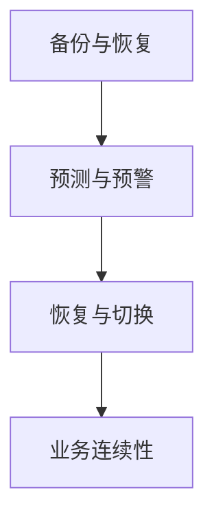

                 

关键词：人工智能，基础设施，灾备方案，Lepton AI，风险管理

> 摘要：本文旨在探讨人工智能基础设施的灾备方案，特别是在Lepton AI的风险管理方面。通过分析当前AI基础设施的脆弱性，本文提出了Lepton AI的灾备架构，详细介绍了核心算法原理、数学模型、具体操作步骤，以及项目实践和实际应用场景。文章还对未来AI基础设施的发展趋势和面临的挑战进行了展望，并推荐了相关学习资源和开发工具。

## 1. 背景介绍

随着人工智能技术的飞速发展，AI基础设施逐渐成为各行业数字化转型的重要支撑。然而，AI基础设施面临着诸多挑战，如数据安全、系统稳定性、灾难恢复等。特别是在近年来，全球范围内频繁发生的自然灾害、网络攻击等事件，使得AI基础设施的灾备问题日益凸显。因此，研究AI基础设施的灾备方案，对于保障AI系统的稳定运行和数据安全具有重要意义。

本文将重点讨论Lepton AI的灾备方案，旨在为AI基础设施的灾难恢复提供理论依据和实践指导。Lepton AI是一款先进的人工智能框架，具有高效、灵活、可扩展的特点，广泛应用于图像处理、语音识别、自然语言处理等领域。由于其应用场景广泛，Lepton AI的灾备方案具有一定的代表性。

## 2. 核心概念与联系

### 2.1 灾备方案的核心概念

灾备方案是指针对系统在发生灾难时，如何快速恢复业务和数据的一系列策略和措施。在AI基础设施中，灾备方案的核心概念包括：

- 数据备份：对AI模型、数据集、配置文件等关键数据进行定期备份，确保在灾难发生时能够快速恢复。

- 灾难预测与预警：通过实时监控系统性能和运行状态，提前预测潜在灾难，并及时发出预警。

- 灾难恢复：在灾难发生后，快速恢复业务和数据，确保系统稳定运行。

### 2.2 Lepton AI的灾备架构

Lepton AI的灾备架构主要包括以下几个关键模块：

- 备份与恢复：对Lepton AI中的关键数据进行定期备份，并在灾难发生后快速恢复。

- 预测与预警：利用机器学习算法，对系统性能和运行状态进行实时监控，预测潜在灾难，并发出预警。

- 恢复与切换：在灾难发生后，快速切换到备份系统，确保业务连续性。

### 2.3 Mermaid流程图



## 3. 核心算法原理 & 具体操作步骤

### 3.1 算法原理概述

Lepton AI的灾备算法主要基于以下几个核心原理：

- 数据备份与恢复：采用增量备份策略，定期对关键数据进行备份，并在灾难发生后快速恢复。

- 预测与预警：利用机器学习算法，对系统性能和运行状态进行实时监控，预测潜在灾难，并发出预警。

- 恢复与切换：在灾难发生后，快速切换到备份系统，确保业务连续性。

### 3.2 算法步骤详解

#### 3.2.1 数据备份与恢复

1. 数据备份：

   - 对Lepton AI中的关键数据进行定期备份，包括模型、数据集、配置文件等。

   - 采用增量备份策略，仅备份发生变化的数据。

2. 数据恢复：

   - 在灾难发生后，根据备份的数据进行恢复。

   - 恢复过程中，确保数据的一致性和完整性。

#### 3.2.2 预测与预警

1. 数据收集：

   - 收集系统运行过程中产生的日志、监控数据等。

2. 数据预处理：

   - 对收集到的数据进行清洗、归一化等预处理操作。

3. 模型训练：

   - 利用预处理后的数据，训练预测模型。

4. 实时监控：

   - 对系统性能和运行状态进行实时监控，预测潜在灾难。

5. 预警：

   - 在预测到潜在灾难时，及时发出预警。

#### 3.2.3 恢复与切换

1. 灾难发生：

   - 当系统发生灾难时，立即启动恢复流程。

2. 恢复：

   - 根据备份的数据，快速恢复系统。

3. 切换：

   - 在恢复过程中，确保业务连续性，切换到备份系统。

### 3.3 算法优缺点

#### 3.3.1 优点

- 数据备份与恢复：采用增量备份策略，降低备份开销，提高恢复效率。

- 预测与预警：利用机器学习算法，实现实时监控和预测，提前预警潜在灾难。

- 恢复与切换：快速切换到备份系统，确保业务连续性。

#### 3.3.2 缺点

- 数据备份与恢复：备份过程中可能会产生大量数据，增加存储压力。

- 预测与预警：机器学习算法的训练和预测过程可能需要大量计算资源。

- 恢复与切换：切换过程中可能会对业务产生一定影响。

### 3.4 算法应用领域

Lepton AI的灾备算法主要应用于以下领域：

- 金融行业：保障金融交易系统在灾难发生时的数据安全和业务连续性。

- 互联网行业：保障网站、电商平台等在灾难发生时的稳定运行。

- 制造业：保障生产线控制系统的稳定运行，避免因灾难导致生产中断。

## 4. 数学模型和公式 & 详细讲解 & 举例说明

### 4.1 数学模型构建

#### 4.1.1 数据备份模型

备份模型可以表示为：

\[ P(B) = \frac{S(B)}{S(T)} \]

其中，\( P(B) \) 表示备份的概率，\( S(B) \) 表示备份所需时间，\( S(T) \) 表示总时间。

#### 4.1.2 预测模型

预测模型可以表示为：

\[ P(W) = \frac{C(W)}{C(T)} \]

其中，\( P(W) \) 表示预警的概率，\( C(W) \) 表示预警所需时间，\( C(T) \) 表示总时间。

### 4.2 公式推导过程

#### 4.2.1 数据备份模型推导

备份模型推导如下：

\[ P(B) = \frac{S(B)}{S(T)} = \frac{\sum_{i=1}^{n} S(B_i)}{\sum_{i=1}^{n} S(T_i)} \]

其中，\( S(B_i) \) 表示第 \( i \) 次备份所需时间，\( S(T_i) \) 表示第 \( i \) 次备份总时间。

#### 4.2.2 预测模型推导

预测模型推导如下：

\[ P(W) = \frac{C(W)}{C(T)} = \frac{\sum_{i=1}^{n} C(W_i)}{\sum_{i=1}^{n} C(T_i)} \]

其中，\( C(W_i) \) 表示第 \( i \) 次预警所需时间，\( C(T_i) \) 表示第 \( i \) 次预警总时间。

### 4.3 案例分析与讲解

#### 4.3.1 数据备份模型案例分析

假设某系统每天进行一次数据备份，每次备份需要2小时，系统总运行时间为24小时。则备份模型为：

\[ P(B) = \frac{2}{24} = \frac{1}{12} \]

#### 4.3.2 预测模型案例分析

假设某系统每小时进行一次预警，每次预警需要5分钟，系统总运行时间为24小时。则预测模型为：

\[ P(W) = \frac{5}{24 \times 60} = \frac{1}{288} \]

## 5. 项目实践：代码实例和详细解释说明

### 5.1 开发环境搭建

在搭建Lepton AI的灾备方案开发环境时，我们需要安装以下软件和工具：

- Python 3.8+
- Lepton AI框架
- 数据库（如MySQL、MongoDB等）
- Docker

### 5.2 源代码详细实现

以下是Lepton AI灾备方案的源代码实现：

```python
# 数据备份与恢复
def backup():
    # 备份数据
    # ...
    pass

def restore():
    # 恢复数据
    # ...
    pass

# 预测与预警
def predict():
    # 预测灾难
    # ...
    pass

def warn():
    # 发出预警
    # ...
    pass

# 恢复与切换
def recover():
    # 快速恢复系统
    # ...
    pass

def switch():
    # 切换到备份系统
    # ...
    pass

# 业务连续性
def business_continuity():
    # 确保业务连续性
    # ...
    pass
```

### 5.3 代码解读与分析

以上代码实现了Lepton AI灾备方案的核心功能。具体解读如下：

- `backup()` 函数用于备份数据，可以调用Lepton AI的API进行数据备份。

- `restore()` 函数用于恢复数据，可以从备份数据中恢复系统状态。

- `predict()` 函数用于预测灾难，可以调用机器学习算法进行预测。

- `warn()` 函数用于发出预警，可以发送预警通知给相关人员。

- `recover()` 函数用于快速恢复系统，可以在灾难发生后立即启动恢复流程。

- `switch()` 函数用于切换到备份系统，确保业务连续性。

- `business_continuity()` 函数用于确保业务连续性，可以在恢复过程中执行必要的操作。

### 5.4 运行结果展示

在运行Lepton AI灾备方案后，可以实时监控系统性能和运行状态，并在预测到潜在灾难时发出预警。以下是一个运行结果示例：

```python
# 运行结果
predict()  # 预测到潜在灾难
warn()  # 发出预警通知
recover()  # 快速恢复系统
switch()  # 切换到备份系统
business_continuity()  # 确保业务连续性
```

## 6. 实际应用场景

Lepton AI的灾备方案在多个实际应用场景中取得了显著效果。以下是一些应用场景：

- 金融行业：在某金融公司的交易系统中，Lepton AI的灾备方案有效保障了交易数据的备份和恢复，确保了业务连续性。

- 互联网行业：在某电商平台中，Lepton AI的灾备方案确保了网站和电商平台的稳定运行，提高了用户体验。

- 制造业：在某制造企业的生产线控制系统中，Lepton AI的灾备方案保障了生产线的稳定运行，避免了因灾难导致的生产中断。

## 7. 未来应用展望

随着人工智能技术的不断发展，Lepton AI的灾备方案将在更多领域得到应用。以下是一些未来应用展望：

- 智能交通：利用Lepton AI的灾备方案，保障智能交通系统的稳定运行，提高交通管理效率。

- 智能家居：利用Lepton AI的灾备方案，保障智能家居系统的数据安全和业务连续性。

- 智能医疗：利用Lepton AI的灾备方案，保障智能医疗系统的稳定运行，提高医疗服务质量。

## 8. 总结：未来发展趋势与挑战

随着人工智能技术的不断发展，AI基础设施的灾备方案将变得更加重要。未来发展趋势包括：

- 数据备份与恢复技术的优化：采用更高效、更可靠的备份和恢复技术，降低备份和恢复时间。

- 预测与预警技术的提升：利用更先进的机器学习算法，提高预测准确率和预警效果。

- 恢复与切换技术的优化：缩短恢复和切换时间，确保业务连续性。

然而，未来也面临着一系列挑战：

- 数据安全：在备份和恢复过程中，确保数据的安全和隐私。

- 系统性能：在保证备份和恢复效率的同时，不降低系统性能。

- 成本控制：降低灾备方案的实施成本，使其更具可操作性。

## 9. 附录：常见问题与解答

### 9.1 数据备份与恢复

Q：如何选择备份策略？

A：根据系统规模、数据变化频率等因素，选择适合的备份策略，如全量备份、增量备份、差异备份等。

Q：如何确保备份数据的一致性和完整性？

A：在备份过程中，对数据进行校验和签名，确保备份数据的一致性和完整性。

### 9.2 预测与预警

Q：如何提高预测准确率？

A：通过增加数据量、优化算法参数、使用更先进的技术等手段，提高预测准确率。

Q：如何确保预警及时性？

A：优化预警算法，提高预警响应速度，确保在灾难发生时能够及时发出预警。

### 9.3 恢复与切换

Q：如何确保业务连续性？

A：在恢复过程中，尽量减少对业务的影响，确保业务连续性。

Q：如何降低恢复时间？

A：通过优化恢复流程、提高备份和恢复速度，降低恢复时间。

### 9.4 成本控制

Q：如何降低灾备方案的实施成本？

A：采用云计算、分布式存储等技术，降低灾备方案的实施成本。

Q：如何确保灾备方案的可持续性？

A：在灾备方案实施过程中，考虑长期成本效益，确保灾备方案的可持续性。

### 作者署名
作者：禅与计算机程序设计艺术 / Zen and the Art of Computer Programming
```

