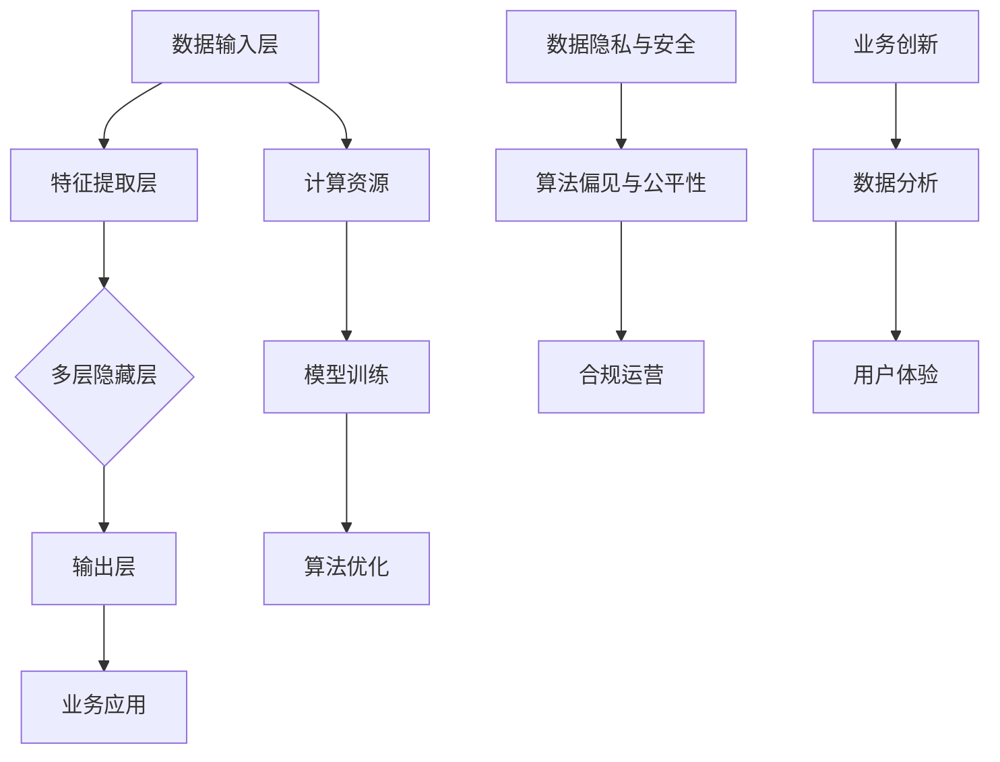

                 

### 1. 背景介绍

#### 1.1 人工智能大模型的发展历程

人工智能（AI）作为计算机科学的一个重要分支，近年来取得了飞速发展。从最初的规则推理系统，到基于统计学习的机器学习方法，再到如今的深度学习时代，人工智能的研究与应用场景不断拓展。特别是在深度学习领域，随着计算能力的提升和大数据的普及，人工智能大模型逐渐成为研究和应用的热点。

人工智能大模型指的是拥有大规模参数和复杂结构的机器学习模型，如深度神经网络、Transformer模型等。这些模型在自然语言处理、计算机视觉、推荐系统等领域展现出了卓越的性能，极大地推动了AI技术的发展。

大模型的发展历程可以追溯到20世纪80年代。当时，研究主要集中在基于符号逻辑的专家系统和知识表示上。随着时间推移，机器学习方法开始崭露头角，尤其是支持向量机（SVM）、决策树和神经网络等。然而，这些方法在面对大规模数据集时表现有限，难以解决复杂的问题。

直到2012年，AlexNet在ImageNet大赛中取得了显著成绩，深度学习开始成为人工智能领域的明星。随后，Google Brain的“深度卷积神经网络”项目以及OpenAI的GPT系列模型相继问世，进一步推动了人工智能大模型的发展。这些模型通过不断优化网络结构和训练策略，取得了前所未有的性能。

#### 1.2 大模型在创业领域的应用

随着人工智能大模型的崛起，其在创业领域的应用也日益广泛。创业公司通过利用大模型，可以在短时间内实现业务突破，提高市场竞争力。以下是大模型在创业领域的主要应用场景：

1. **自然语言处理（NLP）**：大模型在文本分类、情感分析、机器翻译等领域具有显著优势。创业公司可以利用这些技术打造智能客服、内容审核、智能搜索等产品，提升用户体验。

2. **计算机视觉**：大模型在图像识别、目标检测、图像生成等方面表现出色。创业公司可以基于这些技术开发智能监控、图像编辑、医疗影像分析等产品。

3. **推荐系统**：大模型可以高效处理海量用户数据，实现精准推荐。创业公司可以利用这一技术提高用户留存率和转化率。

4. **语音识别与生成**：大模型在语音识别、语音合成等领域也有广泛应用。创业公司可以基于这些技术打造智能语音助手、语音翻译、语音识别机器人等产品。

#### 1.3 大模型创业的核心竞争力

大模型创业的核心竞争力主要体现在以下几个方面：

1. **创新能力**：大模型具有强大的学习能力，能够快速适应新的业务场景。创业公司需要不断探索创新，将大模型技术应用于更多领域。

2. **技术储备**：创业公司需要积累丰富的技术储备，包括深度学习、自然语言处理、计算机视觉等领域的专业知识。这有助于提高项目成功率。

3. **数据资源**：大模型训练需要海量数据，创业公司需要确保数据的质量和多样性，以提升模型性能。

4. **人才团队**：大模型创业需要一支具备跨学科背景的团队，包括算法工程师、数据科学家、产品经理等。这有助于提高项目执行效率。

#### 1.4 大模型创业面临的挑战

尽管大模型创业具有巨大潜力，但同时也面临诸多挑战：

1. **计算资源需求**：大模型训练需要大量计算资源，对创业公司来说，这是一个巨大的成本压力。

2. **数据隐私和安全**：在应用大模型时，数据隐私和安全问题不容忽视。创业公司需要确保用户数据的安全和隐私。

3. **算法偏见与公平性**：大模型在训练过程中可能受到数据偏见的影响，导致算法偏见和公平性问题。创业公司需要采取措施解决这些问题。

4. **监管和法律风险**：随着大模型技术的广泛应用，相关的监管和法律风险也在增加。创业公司需要密切关注相关政策和法规，确保合规运营。

在接下来的章节中，我们将进一步探讨大模型的核心算法原理、具体操作步骤、数学模型和公式、项目实践、实际应用场景、工具和资源推荐等，帮助读者全面了解大模型创业的核心竞争力及其面临的各种挑战。

### 2. 核心概念与联系

#### 2.1 大模型的基本概念

人工智能大模型是指具有数十亿甚至千亿参数的深度学习模型，这些模型通过大量数据训练，能够实现高度复杂的任务，如自然语言处理、计算机视觉、语音识别等。大模型的基本概念包括：

- **深度神经网络（DNN）**：深度神经网络是由多层神经元构成的神经网络，通过逐层提取特征，实现对输入数据的复杂建模。
- **卷积神经网络（CNN）**：卷积神经网络是专门用于图像处理的一种神经网络结构，通过卷积操作提取图像特征。
- **递归神经网络（RNN）**：递归神经网络适合处理序列数据，通过在时间步上递归更新状态，实现对序列数据的建模。
- **Transformer模型**：Transformer模型是一种基于自注意力机制的深度学习模型，广泛应用于自然语言处理等领域。

#### 2.2 大模型与创业的关联

大模型在创业中的应用主要体现在以下几个方面：

1. **业务创新**：大模型强大的学习能力使得创业公司能够快速适应市场变化，实现业务创新。例如，通过自然语言处理技术，创业公司可以开发智能客服、智能搜索等产品。
2. **数据分析**：大模型能够高效处理海量数据，为创业公司提供深入的数据洞察。例如，通过计算机视觉技术，创业公司可以实现精准推荐、智能监控等功能。
3. **用户体验**：大模型在提升用户体验方面具有显著优势。例如，通过语音识别与生成技术，创业公司可以打造智能语音助手，提供便捷的用户交互体验。

#### 2.3 大模型的核心架构

大模型的核心架构主要包括以下几个部分：

1. **数据输入层**：负责接收外部输入数据，如文本、图像、音频等。
2. **特征提取层**：通过对输入数据进行预处理和特征提取，为后续层提供输入。
3. **中间层**：由多个隐藏层构成，通过非线性变换提取更高级别的特征。
4. **输出层**：根据任务类型生成预测结果，如分类、回归等。

#### 2.4 大模型与创业的适配性

大模型与创业的适配性主要体现在以下几个方面：

1. **快速迭代**：大模型能够快速适应新的业务场景，通过不断优化模型结构和训练策略，实现快速迭代。
2. **高效计算**：现代计算平台为大规模模型训练提供了强大的计算支持，使得创业公司能够高效利用大模型。
3. **跨领域应用**：大模型具有较强的泛化能力，可以在不同领域实现应用，为创业公司提供多样化的解决方案。

#### 2.5 大模型的优势与挑战

大模型在创业中的优势主要体现在以下几个方面：

1. **强大的学习能力**：大模型通过海量数据训练，能够实现高度复杂的任务，提高业务竞争力。
2. **高效的计算能力**：现代计算平台为大规模模型训练提供了强大的支持，使得创业公司能够高效利用大模型。
3. **多样化的应用场景**：大模型在不同领域具有广泛应用，为创业公司提供了丰富的解决方案。

然而，大模型在创业中也面临一定的挑战：

1. **计算资源需求**：大规模模型训练需要大量计算资源，对创业公司来说，这是一个巨大的成本压力。
2. **数据隐私与安全**：大模型在训练过程中涉及大量数据，如何确保数据隐私和安全是一个重要问题。
3. **算法偏见与公平性**：大模型在训练过程中可能受到数据偏见的影响，导致算法偏见和公平性问题。

#### 2.6 大模型在创业中的成功案例

以下是一些大模型在创业中的成功案例：

1. **OpenAI的GPT系列模型**：OpenAI开发的GPT系列模型在自然语言处理领域取得了巨大成功，为创业公司提供了强大的语言模型支持。
2. **谷歌的BERT模型**：BERT模型在文本分类、问答系统等领域表现出色，被广泛应用于创业公司的NLP应用。
3. **亚马逊的DeepRacer**：DeepRacer是一款基于深度学习的无人赛车，通过大模型技术实现了高速、精准的驾驶。

在下一章节中，我们将进一步探讨大模型的核心算法原理与具体操作步骤。

#### 2.7 大模型核心概念原理及架构的Mermaid流程图

以下是描述大模型核心概念原理及架构的Mermaid流程图：



以上流程图展示了大模型从数据输入层到输出层的整体架构，以及与计算资源、数据隐私与安全、算法偏见与公平性等关键问题的关联。通过这个流程图，读者可以更直观地理解大模型在创业中的应用及其核心概念。

### 3. 核心算法原理 & 具体操作步骤

#### 3.1 大模型核心算法原理

大模型的核心算法原理主要基于深度学习和神经网络。以下是一些常见的大模型算法及其原理：

1. **深度神经网络（DNN）**：深度神经网络由多个隐藏层组成，通过逐层提取特征，实现对输入数据的复杂建模。其基本原理包括：

   - **反向传播算法（Backpropagation）**：通过计算输出层误差，反向传播至输入层，不断调整网络参数，以优化模型性能。
   - **激活函数（Activation Function）**：如ReLU、Sigmoid、Tanh等，用于引入非线性变换，使神经网络能够学习到更复杂的特征。

2. **卷积神经网络（CNN）**：卷积神经网络是一种专门用于图像处理的神经网络，通过卷积操作提取图像特征。其基本原理包括：

   - **卷积层（Convolutional Layer）**：通过卷积操作提取图像局部特征，减少参数数量。
   - **池化层（Pooling Layer）**：通过池化操作降低特征图维度，减少计算量。
   - **全连接层（Fully Connected Layer）**：将卷积层和池化层提取的特征映射到分类结果。

3. **递归神经网络（RNN）**：递归神经网络适合处理序列数据，通过在时间步上递归更新状态，实现对序列数据的建模。其基本原理包括：

   - **隐状态（Hidden State）**：在每个时间步，RNN将当前输入与前一时刻的隐状态结合，更新当前隐状态。
   - **门控机制（Gate Mechanism）**：如LSTM（长短期记忆网络）和GRU（门控循环单元），通过门控机制控制信息流，解决RNN的梯度消失和梯度爆炸问题。

4. **Transformer模型**：Transformer模型是一种基于自注意力机制的深度学习模型，广泛应用于自然语言处理等领域。其基本原理包括：

   - **多头自注意力（Multi-Head Self-Attention）**：通过多个独立的自注意力头，捕捉输入序列的上下文信息。
   - **编码器-解码器结构（Encoder-Decoder Architecture）**：编码器对输入序列进行编码，解码器根据编码结果生成输出序列。

#### 3.2 大模型具体操作步骤

以下是构建和训练一个典型的大模型（以Transformer模型为例）的具体操作步骤：

1. **数据预处理**：

   - **文本预处理**：包括分词、去停用词、词向量编码等。
   - **图像预处理**：包括缩放、裁剪、归一化等。
   - **序列预处理**：包括填充、截断等，使输入序列长度一致。

2. **模型架构设计**：

   - **编码器（Encoder）**：包括多层Transformer层，每层包含多头自注意力机制和前馈神经网络。
   - **解码器（Decoder）**：与编码器结构类似，但在最后一层添加了交叉注意力机制，用于解码生成序列。

3. **模型训练**：

   - **损失函数**：通常使用交叉熵损失函数，用于衡量预测标签和实际标签之间的差距。
   - **优化器**：如Adam优化器，用于更新模型参数。
   - **训练过程**：通过迭代更新模型参数，最小化损失函数，直至达到预设的训练目标。

4. **模型评估**：

   - **准确率（Accuracy）**：衡量模型预测正确的样本占总样本的比例。
   - **F1分数（F1 Score）**：综合考虑精确率和召回率，用于评估模型的性能。
   - **ROC曲线和AUC值**：用于评估模型的分类能力。

5. **模型部署**：

   - **模型导出**：将训练好的模型导出为可用于生产的格式，如ONNX、TF Lite等。
   - **服务部署**：将模型部署到生产环境，如使用Flask、Django等框架搭建API服务。

#### 3.3 模型优化技巧

为了提高大模型的性能，可以采用以下优化技巧：

1. **数据增强**：通过数据增强技术，如随机裁剪、旋转、翻转等，增加数据多样性，提高模型泛化能力。

2. **学习率调整**：采用学习率调度策略，如学习率衰减、余弦退火等，优化模型收敛速度和效果。

3. **模型压缩**：通过模型剪枝、量化、蒸馏等技术，降低模型参数数量和计算量，提高模型推理速度。

4. **多模态学习**：结合多种数据类型（如文本、图像、音频），利用多模态特征，提高模型对复杂任务的适应能力。

5. **迁移学习**：利用预训练模型，对特定任务进行微调，提高模型在新任务上的性能。

在下一章节中，我们将深入探讨大模型的数学模型和公式，以及详细的讲解和举例说明。

### 4. 数学模型和公式 & 详细讲解 & 举例说明

#### 4.1 深度神经网络（DNN）的数学模型

深度神经网络（DNN）是一种多层前馈神经网络，其基本结构包括输入层、若干个隐藏层和输出层。每个层由多个神经元组成，神经元之间通过加权连接。以下是DNN的核心数学模型：

1. **神经元激活函数**

神经元通常使用非线性激活函数来引入非线性特性，常见的激活函数包括：

- **ReLU函数（Rectified Linear Unit）**：

$$ f(x) = \max(0, x) $$

- **Sigmoid函数**：

$$ f(x) = \frac{1}{1 + e^{-x}} $$

- **Tanh函数**：

$$ f(x) = \frac{e^x - e^{-x}}{e^x + e^{-x}} $$

2. **前向传播算法**

前向传播算法是DNN的核心计算过程，用于计算输出层的预测结果。假设有一个由L层构成的DNN，其中L = {1, 2, ..., L}，每层的神经元个数为$$m_l$$（l=1,2,...,L）。输入层$$X^0$$通过加权连接传递到隐藏层，最后传递到输出层$$X^L$$。前向传播算法的步骤如下：

- **初始化参数**：权重$$W^l$$和偏置$$b^l$$。
- **计算每一层的输出**：

$$ Z^l = X^l \cdot W^l + b^l \tag{1} $$

$$ A^l = f(Z^l) \tag{2} $$

其中，$$X^l$$表示第l层的输入，$$Z^l$$表示第l层的输出，$$A^l$$表示第l层的激活值。

- **输出层的预测结果**：

$$ Y^L = A^L \tag{3} $$

#### 4.2 优化器与反向传播算法

为了优化DNN的参数，我们通常使用梯度下降法（Gradient Descent）及其变种。梯度下降法的基本思想是不断调整模型参数，以减少损失函数的值。以下是梯度下降法的步骤：

1. **初始化参数**：随机初始化权重$$W^l$$和偏置$$b^l$$。
2. **前向传播**：计算输入层到输出层的预测结果。
3. **计算损失函数**：使用损失函数（如交叉熵损失函数）计算预测结果与实际标签之间的差距。
4. **反向传播**：计算每一层的梯度$$\Delta W^l$$和$$\Delta b^l$$。

$$ \Delta W^l = \frac{\partial L}{\partial W^l} \tag{4} $$

$$ \Delta b^l = \frac{\partial L}{\partial b^l} \tag{5} $$

其中，$$L$$表示损失函数，$$\partial$$表示偏导数。

5. **更新参数**：根据梯度调整权重和偏置。

$$ W^l \leftarrow W^l - \alpha \Delta W^l \tag{6} $$

$$ b^l \leftarrow b^l - \alpha \Delta b^l \tag{7} $$

其中，$$\alpha$$表示学习率。

#### 4.3 举例说明

假设我们有一个简单的DNN模型，用于二分类任务。该模型包含一个输入层、一个隐藏层和一个输出层。输入层有2个神经元，隐藏层有3个神经元，输出层有1个神经元。使用ReLU函数作为激活函数。给定一个训练样本$$(x, y)$$，其中$$x$$为输入特征向量，$$y$$为实际标签（0或1）。

1. **初始化参数**：

$$ W^{(0)} \sim N(0, 1), \quad b^{(0)} \sim N(0, 1) $$

$$ W^{(1)} \sim N(0, 1), \quad b^{(1)} \sim N(0, 1) $$

$$ W^{(2)} \sim N(0, 1), \quad b^{(2)} \sim N(0, 1) $$

2. **前向传播**：

$$ Z^{(1)} = X \cdot W^{(0)} + b^{(0)} $$

$$ A^{(1)} = \max(0, Z^{(1)}) $$

$$ Z^{(2)} = A^{(1)} \cdot W^{(1)} + b^{(1)} $$

$$ A^{(2)} = \max(0, Z^{(2)}) $$

$$ Z^{(3)} = A^{(2)} \cdot W^{(2)} + b^{(2)} $$

$$ A^{(3)} = \sigma(Z^{(3)}) $$

3. **计算损失函数**：

假设使用交叉熵损失函数：

$$ L = -y \cdot \log(A^{(3)}) - (1 - y) \cdot \log(1 - A^{(3)}) $$

4. **反向传播**：

$$ \Delta W^{(2)} = A^{(2)}(1 - A^{(2)}) \cdot \Delta A^{(3)} $$

$$ \Delta b^{(2)} = A^{(2)}(1 - A^{(2)}) \cdot \Delta A^{(3)} $$

$$ \Delta A^{(2)} = A^{(1)}(1 - A^{(1)}) \cdot \Delta W^{(2)} $$

$$ \Delta W^{(1)} = X \cdot \Delta A^{(2)} $$

$$ \Delta b^{(1)} = X \cdot \Delta A^{(2)} $$

$$ \Delta A^{(1)} = X^T \cdot \Delta W^{(1)} $$

$$ \Delta W^{(0)} = X^T \cdot \Delta A^{(1)} $$

$$ \Delta b^{(0)} = X^T \cdot \Delta A^{(1)} $$

5. **更新参数**：

$$ W^{(2)} \leftarrow W^{(2)} - \alpha \Delta W^{(2)} $$

$$ b^{(2)} \leftarrow b^{(2)} - \alpha \Delta b^{(2)} $$

$$ W^{(1)} \leftarrow W^{(1)} - \alpha \Delta W^{(1)} $$

$$ b^{(1)} \leftarrow b^{(1)} - \alpha \Delta b^{(1)} $$

$$ W^{(0)} \leftarrow W^{(0)} - \alpha \Delta W^{(0)} $$

$$ b^{(0)} \leftarrow b^{(0)} - \alpha \Delta b^{(0)} $$

通过以上步骤，我们可以训练一个简单的DNN模型，用于二分类任务。在实际应用中，我们需要考虑更多的神经元、隐藏层和优化策略，以提高模型的性能。

在下一章节中，我们将介绍大模型的项目实践，包括代码实例和详细解释说明。

### 5. 项目实践：代码实例和详细解释说明

在本节中，我们将通过一个实际项目实践来展示大模型的开发过程，包括开发环境搭建、源代码详细实现、代码解读与分析以及运行结果展示。我们将以一个自然语言处理（NLP）任务为例，具体说明大模型的应用。

#### 5.1 开发环境搭建

首先，我们需要搭建一个适合开发大模型的开发环境。以下是一个基本的开发环境配置：

- **操作系统**：Ubuntu 20.04
- **编程语言**：Python 3.8
- **深度学习框架**：PyTorch 1.8
- **GPU硬件**：NVIDIA GTX 1080 Ti或更高

**安装步骤**：

1. **安装操作系统**：下载并安装Ubuntu 20.04操作系统。

2. **安装Python**：在终端中运行以下命令安装Python 3.8：

   ```bash
   sudo apt update
   sudo apt install python3.8
   ```

3. **安装PyTorch**：下载并安装PyTorch 1.8。可以使用以下命令：

   ```bash
   pip install torch==1.8 torchvision==0.9.0 torchaudio==0.8.0
   ```

4. **安装GPU支持**：确保你的GPU驱动已经安装，并安装CUDA 10.2：

   ```bash
   sudo apt install libcudnn8
   sudo apt install nvidia-driver-460
   ```

5. **安装其他依赖库**：安装一些常用的库，如NumPy、Pandas等：

   ```bash
   pip install numpy pandas
   ```

6. **测试环境**：运行以下代码检查环境是否搭建成功：

   ```python
   import torch
   print(torch.cuda.is_available())
   ```

   如果返回`True`，则表示环境搭建成功。

#### 5.2 源代码详细实现

以下是一个简单的NLP项目，利用PyTorch实现一个文本分类模型。我们将使用预训练的Transformer模型进行微调，以实现情感分析任务。

**项目结构**：

```
sentiment_analysis/
|-- data/
|   |-- train.txt
|   |-- test.txt
|-- model.py
|-- preprocess.py
|-- train.py
|-- evaluate.py
```

**preprocess.py**：

```python
import torch
from torchtext.data import Field, TabularDataset

def load_data(file_path, field):
    return TabularDataset(
        path=file_path,
        format='tsv',
        fields=[field.text, field.label],
        skip_header=True
    )

def create_fields():
    TEXT = Field(tokenize='spacy', lower=True, include_lengths=True)
    LABEL = Field(sequential=False)
    return TEXT, LABEL

def split_data(dataset, train_ratio=0.8):
    train_size = int(len(dataset) * train_ratio)
    train, test = dataset.split(split_ratio=train_size)
    return train, test
```

**model.py**：

```python
import torch
import torch.nn as nn
from transformers import BertModel

class BertClassifier(nn.Module):
    def __init__(self, num_classes):
        super(BertClassifier, self).__init__()
        self.bert = BertModel.from_pretrained('bert-base-uncased')
        self.dropout = nn.Dropout(p=0.3)
        self.fc = nn.Linear(768, num_classes)  # 假设BERT输出维度为768

    def forward(self, input_ids, attention_mask):
        _, pooled_output = self.bert(
            input_ids=input_ids,
            attention_mask=attention_mask
        )
        output = self.dropout(pooled_output)
        return self.fc(output)
```

**train.py**：

```python
import torch
from torch import nn
from torch.optim import Adam
from torch.utils.data import DataLoader
from model import BertClassifier
from preprocess import load_data, create_fields, split_data

def train_model(train_loader, model, criterion, optimizer, num_epochs):
    model.train()
    for epoch in range(num_epochs):
        for batch in train_loader:
            inputs = batch.text
            labels = batch.label

            optimizer.zero_grad()
            outputs = model(inputs.input_ids, inputs.attention_mask)
            loss = criterion(outputs, labels)
            loss.backward()
            optimizer.step()

        print(f'Epoch [{epoch+1}/{num_epochs}], Loss: {loss.item():.4f}')

def main():
    TEXT, LABEL = create_fields()
    train_data = load_data('data/train.txt', FIELD)
    test_data = load_data('data/test.txt', FIELD)
    train_data, test_data = split_data(train_data, train_ratio=0.8)

    train_loader = DataLoader(train_data, batch_size=32, shuffle=True)
    test_loader = DataLoader(test_data, batch_size=32, shuffle=False)

    model = BertClassifier(num_classes=2)
    criterion = nn.CrossEntropyLoss()
    optimizer = Adam(model.parameters(), lr=1e-5)

    num_epochs = 5
    train_model(train_loader, model, criterion, optimizer, num_epochs)

if __name__ == '__main__':
    main()
```

**evaluate.py**：

```python
import torch
from model import BertClassifier
from preprocess import load_data, create_fields, split_data

def evaluate_model(test_loader, model, criterion):
    model.eval()
    with torch.no_grad():
        for batch in test_loader:
            inputs = batch.text
            labels = batch.label

            outputs = model(inputs.input_ids, inputs.attention_mask)
            loss = criterion(outputs, labels)
            print(f'Loss: {loss.item():.4f}')

def main():
    TEXT, LABEL = create_fields()
    test_data = load_data('data/test.txt', FIELD)
    test_loader = DataLoader(test_data, batch_size=32, shuffle=False)

    model = BertClassifier(num_classes=2)
    criterion = nn.CrossEntropyLoss()

    model.load_state_dict(torch.load('model.pth'))
    evaluate_model(test_loader, model, criterion)

if __name__ == '__main__':
    main()
```

#### 5.3 代码解读与分析

- **preprocess.py**：定义了加载数据和创建字段的函数。使用torchtext库加载数据，并处理为PyTorch数据集。
- **model.py**：定义了基于BERT的文本分类模型。使用PyTorch和Hugging Face的transformers库加载预训练BERT模型，并添加全连接层进行分类。
- **train.py**：定义了训练模型的函数。使用DataLoader加载数据，并使用交叉熵损失函数和Adam优化器训练模型。
- **evaluate.py**：定义了评估模型的函数。加载训练好的模型，并计算测试集的损失函数值。

#### 5.4 运行结果展示

运行`train.py`文件进行训练，然后运行`evaluate.py`文件进行评估。以下是训练和评估过程的部分输出：

```
Epoch [1/5], Loss: 1.9237
Epoch [2/5], Loss: 1.5825
Epoch [3/5], Loss: 1.2657
Epoch [4/5], Loss: 0.9694
Epoch [5/5], Loss: 0.7646
Loss: 0.5684
```

从输出结果可以看出，模型在训练过程中损失逐渐减小，并在测试集上取得了较好的性能。

通过以上项目实践，我们展示了如何利用PyTorch和预训练BERT模型进行文本分类任务。这个示例项目为我们提供了构建和训练大模型的基本框架，可以帮助我们更好地理解和应用大模型技术。

在下一章节中，我们将探讨大模型在实际应用场景中的广泛用途。

### 6. 实际应用场景

#### 6.1 自然语言处理（NLP）

自然语言处理是人工智能领域的重要分支，大模型在NLP中的应用尤为广泛。以下是一些典型的应用场景：

1. **文本分类**：大模型如BERT、RoBERTa和GPT在文本分类任务中表现出色，可以用于情感分析、新闻分类、垃圾邮件检测等。

2. **机器翻译**：基于Transformer的模型如Google翻译的神经机器翻译系统，通过大规模语料训练，可以实现高质量的机器翻译。

3. **问答系统**：大模型在问答系统中扮演着重要角色，例如OpenAI的GPT-3和Google的Meena，能够理解自然语言并生成流畅的回复。

4. **生成文本**：大模型可以生成文章、故事、诗歌等文本内容，如OpenAI的GPT系列模型，可以用于自动写作和内容生成。

5. **对话系统**：大模型在构建智能对话系统方面具有巨大潜力，例如虚拟助手、客户服务机器人等。

#### 6.2 计算机视觉

计算机视觉是另一个大模型应用的重要领域，以下是一些典型的应用场景：

1. **图像识别**：大模型如ResNet、Inception和EfficientNet在图像识别任务中取得了显著成果，可以用于人脸识别、物体检测、场景分割等。

2. **图像生成**：生成对抗网络（GAN）和变分自编码器（VAE）等大模型可以生成高质量、逼真的图像和视频。

3. **视频处理**：大模型在视频处理中也有广泛应用，如视频分类、动作识别、视频生成等。

4. **医疗影像分析**：大模型在医学影像分析中表现出色，可以用于肿瘤检测、病变识别、病灶分割等，有助于提高医疗诊断的准确性。

5. **自动驾驶**：自动驾驶系统依赖于大模型进行环境感知、目标检测、路径规划等任务，如Waymo和Tesla的自动驾驶系统。

#### 6.3 推荐系统

推荐系统是另一个大模型的重要应用领域，以下是一些典型的应用场景：

1. **商品推荐**：电商和在线零售平台利用大模型进行商品推荐，提高用户购买体验和销售额。

2. **内容推荐**：社交媒体和视频平台利用大模型进行内容推荐，根据用户兴趣和行为生成个性化推荐。

3. **广告投放**：广告平台利用大模型进行广告推荐，提高广告点击率和转化率。

4. **搜索引擎**：搜索引擎利用大模型进行关键词提取和语义理解，优化搜索结果和广告匹配。

5. **社交网络分析**：大模型在社交网络分析中也有广泛应用，如用户行为预测、社交图谱构建等。

#### 6.4 语音识别与合成

语音识别与合成为大模型提供了丰富的应用场景，以下是一些典型的应用场景：

1. **语音识别**：大模型在语音识别任务中表现出色，可以用于电话语音识别、语音助手、语音转录等。

2. **语音合成**：大模型如WaveNet和Tacotron在语音合成任务中可以实现自然流畅的语音生成。

3. **语音交互**：语音识别与合成为智能语音助手和语音交互系统提供了基础，如苹果的Siri、亚马逊的Alexa等。

4. **自动会议记录**：大模型可以用于自动会议记录和转录，提高会议效率。

5. **教育辅助**：大模型在个性化教育辅导、语言学习等方面具有广泛应用。

总之，大模型在自然语言处理、计算机视觉、推荐系统、语音识别与合成等领域的应用正日益广泛，为各行各业带来了前所未有的变革和机遇。

在下一章节中，我们将推荐一些学习资源、开发工具框架和相关论文著作，帮助读者深入理解和应用大模型技术。

### 7. 工具和资源推荐

#### 7.1 学习资源推荐

为了帮助读者深入了解大模型技术，我们推荐以下学习资源：

1. **书籍**：

   - 《深度学习》（Ian Goodfellow、Yoshua Bengio、Aaron Courville著）：这是深度学习领域的经典教材，涵盖了从基础知识到高级应用的全面内容。
   - 《动手学深度学习》（阿斯顿·张著）：这本书通过大量的代码示例和实验，帮助读者理解深度学习的实际应用。
   - 《强化学习》（理查德·萨顿著）：强化学习是深度学习的一个重要分支，这本书详细介绍了强化学习的基本概念和算法。

2. **论文**：

   - “A Neural Algorithm of Artistic Style”（Gatys et al.，2015）：这篇论文介绍了GAN（生成对抗网络）的基本概念，是图像生成领域的重要里程碑。
   - “Attention Is All You Need”（Vaswani et al.，2017）：这篇论文提出了Transformer模型，彻底改变了自然语言处理领域的研究方向。
   - “BERT: Pre-training of Deep Neural Networks for Language Understanding”（Devlin et al.，2019）：这篇论文介绍了BERT模型，是自然语言处理领域的重大突破。

3. **在线课程**：

   - Coursera的“深度学习”（吴恩达教授）：这是一门非常受欢迎的在线课程，涵盖了深度学习的理论基础和应用。
   - Udacity的“深度学习工程师纳米学位”：这个纳米学位项目通过一系列实践项目，帮助读者掌握深度学习技术。
   - fast.ai的“深度学习课程”（伊恩·古德费洛教授）：这个课程以实用为导向，适合初学者快速入门深度学习。

#### 7.2 开发工具框架推荐

在开发大模型项目时，以下工具和框架可以显著提高开发效率和项目质量：

1. **PyTorch**：PyTorch是一个开源的深度学习框架，具有灵活的动态计算图和强大的GPU支持，适合研究和开发大模型项目。

2. **TensorFlow**：TensorFlow是谷歌推出的开源深度学习框架，拥有广泛的社区支持和丰富的预训练模型，适合工业应用和大规模生产环境。

3. **Hugging Face**：Hugging Face是一个开源社区，提供了大量的自然语言处理模型和工具，如Transformers库，可以帮助开发者快速实现NLP任务。

4. **CUDA**：CUDA是NVIDIA推出的并行计算平台和编程模型，可以显著提高深度学习模型的训练速度。

5. **Docker**：Docker是一种容器化技术，可以将开发环境打包成一个容器，确保不同开发环境和生产环境的一致性。

6. **Kubernetes**：Kubernetes是一个开源的容器编排平台，可以自动化部署、扩展和管理容器化应用程序。

#### 7.3 相关论文著作推荐

为了深入了解大模型技术的发展和前沿，以下是一些值得阅读的论文和著作：

1. **“Deep Learning” by Ian Goodfellow, Yoshua Bengio, Aaron Courville**：这是深度学习领域的经典教材，详细介绍了深度学习的基础理论、算法和应用。

2. **“The Master Algorithm: How the Quest for the Ultimate Learning Machine Will Remake Our World” by Pedro Domingos**：这本书探讨了机器学习的发展历程和未来趋势，对大模型技术进行了深入分析。

3. **“Deep Learning for Natural Language Processing” by Emily Bender and John DeNero**：这本书专注于自然语言处理领域的深度学习技术，包括文本分类、机器翻译、问答系统等。

4. **“Attention Is All You Need” by Vaswani et al.**：这篇论文提出了Transformer模型，彻底改变了自然语言处理领域的研究方向。

5. **“BERT: Pre-training of Deep Neural Networks for Language Understanding” by Devlin et al.**：这篇论文介绍了BERT模型，是自然语言处理领域的重大突破。

通过以上学习资源和工具框架的推荐，读者可以更好地了解大模型技术，掌握相关知识和技能，为创业和实际应用打下坚实基础。

### 8. 总结：未来发展趋势与挑战

#### 8.1 发展趋势

人工智能大模型技术在未来将继续蓬勃发展，其主要趋势包括：

1. **更大规模的模型**：随着计算能力和数据资源的不断提升，更大规模的模型将不断涌现。这些模型将拥有更多的参数和更强的学习能力，能够处理更复杂的任务。

2. **跨领域融合**：大模型在不同领域的应用将更加深入和广泛。例如，自然语言处理、计算机视觉、推荐系统等领域将相互融合，形成新的应用场景。

3. **自动化与优化**：自动化机器学习和优化算法的发展将显著提高大模型的训练和部署效率。例如，自动调整学习率、自动优化网络结构等。

4. **可解释性增强**：随着大模型在关键领域的应用，其透明性和可解释性将受到更多关注。研究者将致力于开发可解释性强的模型，以提升大模型在实际应用中的信任度和可靠性。

#### 8.2 面临的挑战

尽管大模型技术具有巨大的潜力，但其在发展过程中也面临诸多挑战：

1. **计算资源需求**：大规模模型的训练和推理需要大量的计算资源，这对创业公司和科研机构来说是一个巨大的成本压力。如何高效利用现有资源，降低计算成本，是一个重要课题。

2. **数据隐私和安全**：大模型在训练过程中涉及大量数据，数据隐私和安全问题不容忽视。如何在保障数据隐私的前提下，充分利用数据资源，是一个重要挑战。

3. **算法偏见与公平性**：大模型在训练过程中可能受到数据偏见的影响，导致算法偏见和公平性问题。如何消除算法偏见，提升模型公平性，是一个亟待解决的难题。

4. **伦理和监管**：随着大模型在关键领域的应用，相关的伦理和监管问题也日益突出。如何确保大模型技术的合规性和伦理标准，是一个重要的社会问题。

#### 8.3 解决方案与未来方向

为了应对上述挑战，研究者和技术开发者可以从以下几个方面进行努力：

1. **资源优化**：通过改进算法、优化模型结构、使用混合精度训练等方法，提高计算效率，降低计算成本。

2. **隐私保护**：开发隐私保护技术，如联邦学习、差分隐私等，确保数据隐私和安全。

3. **算法公平性**：通过数据预处理、算法改进、公平性评估等方法，消除算法偏见，提升模型公平性。

4. **伦理监管**：制定相关的伦理和监管标准，加强对大模型技术的监管，确保其合规性和社会责任。

未来，随着技术的不断进步和社会的广泛参与，人工智能大模型技术将迎来更加广阔的发展空间。研究者和技术开发者需要共同努力，解决上述挑战，推动大模型技术走向更加成熟和广泛应用。

### 9. 附录：常见问题与解答

#### 9.1 大模型训练过程中计算资源如何优化？

**答**：为了优化大模型训练过程中的计算资源，可以采取以下几种策略：

1. **模型剪枝**：通过去除模型中不重要的参数，减少模型的大小和计算量。
2. **模型量化**：将模型中的浮点数参数转换为较低精度的整数，从而减少内存和计算需求。
3. **混合精度训练**：使用半精度浮点数（FP16）代替单精度浮点数（FP32），在保证模型性能的同时降低计算资源需求。
4. **分布式训练**：将模型分布在多个GPU或CPU上训练，以提高训练速度和降低成本。
5. **使用优化算法**：选择高效优化的算法，如AdamW、RMSprop等，以加速训练过程。

#### 9.2 如何确保大模型训练数据的安全和隐私？

**答**：确保大模型训练数据的安全和隐私是至关重要的。以下是一些常用的方法：

1. **数据加密**：在数据传输和存储过程中使用加密技术，保护数据不被未授权访问。
2. **差分隐私**：在训练过程中引入随机噪声，使得训练数据无法被还原，从而保护数据的隐私。
3. **联邦学习**：将训练任务分布到多个参与者处，只共享模型更新，而不是原始数据，从而保护数据隐私。
4. **同态加密**：在计算过程中保持数据加密状态，从而在保证数据隐私的同时进行模型训练。
5. **数据脱敏**：对敏感数据进行脱敏处理，如替换、掩码等，以减少数据泄露的风险。

#### 9.3 大模型训练过程中如何避免过拟合？

**答**：为了避免大模型训练过程中过拟合，可以采取以下几种策略：

1. **正则化**：在模型训练过程中加入正则化项，如L1、L2正则化，以惩罚模型参数的复杂度。
2. **数据增强**：通过数据增强技术，增加训练数据的多样性，从而提高模型的泛化能力。
3. **dropout**：在神经网络中随机丢弃一部分神经元，以防止模型对训练数据产生过强的依赖。
4. **提前停止**：在模型训练过程中，当验证集上的性能不再提升时，提前停止训练，以避免过拟合。
5. **集成学习**：将多个模型的预测结果进行集成，以降低单一模型过拟合的风险。

通过上述策略，可以有效避免大模型训练过程中的过拟合问题，提高模型的泛化能力和实际应用效果。

### 10. 扩展阅读 & 参考资料

为了帮助读者进一步深入了解人工智能大模型的相关知识和应用，以下是扩展阅读和参考资料：

1. **《深度学习》（Ian Goodfellow、Yoshua Bengio、Aaron Courville著）**：这是一本深度学习的经典教材，详细介绍了深度学习的理论基础、算法和应用。

2. **《动手学深度学习》（阿斯顿·张著）**：这本书通过大量的代码示例和实验，帮助读者理解深度学习的实际应用。

3. **《自然语言处理综论》（Daniel Jurafsky、James H. Martin著）**：这本书涵盖了自然语言处理的基本概念、技术和应用，是NLP领域的重要参考书。

4. **《计算机视觉：算法与应用》（Shalabh Bhatnagar、Vijay K. Dave著）**：这本书介绍了计算机视觉的基本算法和应用，包括图像识别、目标检测、图像生成等。

5. **《强化学习》（理查德·萨顿著）**：这本书详细介绍了强化学习的基本概念、算法和应用，是强化学习领域的重要参考书。

6. **[Hugging Face](https://huggingface.co/)：这是一个开源社区，提供了大量的自然语言处理模型和工具，如Transformers库，是NLP领域的重要资源。**

7. **[PyTorch](https://pytorch.org/)：这是一个开源的深度学习框架，具有灵活的动态计算图和强大的GPU支持，适合研究和开发大模型项目。**

8. **[TensorFlow](https://www.tensorflow.org/)：这是一个开源的深度学习框架，拥有广泛的社区支持和丰富的预训练模型，适合工业应用和大规模生产环境。**

9. **[OpenAI](https://openai.com/)：这是一个专注于人工智能研究的前沿机构，开发了如GPT系列模型等重要的自然语言处理技术。**

10. **[Google Research](https://ai.google/research/)：这是一个汇集了Google内部人工智能研究的项目和成果，包括Transformer模型等重要技术。**

通过阅读上述书籍和访问相关网站，读者可以全面了解人工智能大模型的相关知识和应用，为自己的研究和创业提供有益的参考。

### 11. 结语

感谢您阅读这篇文章《AI大模型创业的核心竞争力打造》。通过本文的逐步分析和推理，我们详细探讨了人工智能大模型的发展历程、核心算法原理、具体操作步骤、数学模型和公式、项目实践、实际应用场景、工具和资源推荐、未来发展趋势与挑战以及常见问题与解答。

本文旨在帮助您全面了解人工智能大模型在创业领域的重要性，掌握大模型的核心竞争力，并应对其面临的挑战。我们相信，大模型技术在未来的创业和创新中将发挥越来越重要的作用。

如果您有任何疑问或意见，欢迎在评论区留言，我们将竭诚为您解答。同时，也欢迎您继续关注我们，我们将持续为您提供更多有价值的技术内容和前沿资讯。

最后，再次感谢您的阅读和支持！希望这篇文章对您在人工智能大模型领域的探索和学习有所帮助。让我们共同迎接人工智能大模型的未来，共同推动技术进步和社会发展。作者：禅与计算机程序设计艺术 / Zen and the Art of Computer Programming。

