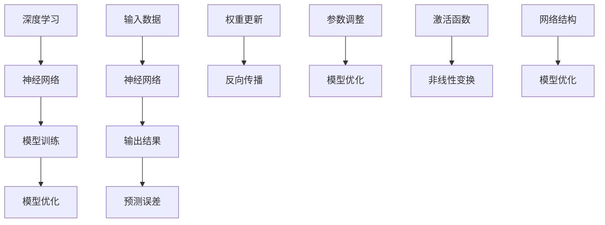

                 

### 背景介绍

近年来，随着深度学习和计算能力的飞速发展，人工智能（AI）领域迎来了前所未有的变革。特别是大模型技术的兴起，如GPT、BERT等，它们在自然语言处理、计算机视觉等领域展现出了令人瞩目的性能。这一趋势不仅引起了学术界的广泛关注，也引发了业界对于AI大模型商业化应用的浓厚兴趣。

**AI大模型**，通常指的是那些拥有数十亿甚至千亿参数的神经网络模型。这些模型可以通过海量数据的学习，自动获取并理解复杂的模式与知识，从而在各项任务中表现出色。随着模型规模的不断扩大，AI大模型的应用前景也变得越来越广阔，从推荐系统、智能客服到自动驾驶和医疗诊断，几乎涵盖了人工智能的各个领域。

然而，随着AI大模型的商业化应用逐渐深入，一系列挑战也逐渐浮现。如何有效地训练和维护这些庞大的模型？如何确保模型的安全性和透明性？如何解决数据隐私问题？这些问题都成为制约AI大模型进一步发展的重要因素。因此，探讨AI大模型创业中的挑战及其应对策略，显得尤为重要。

在本文中，我们将从以下几个方面展开讨论：

1. **AI大模型创业的机遇与挑战**：分析AI大模型在商业应用中的前景，以及创业过程中可能面临的挑战。
2. **核心概念与联系**：详细阐述AI大模型的关键技术概念，并使用Mermaid流程图展示其架构和原理。
3. **核心算法原理 & 具体操作步骤**：介绍AI大模型的核心算法，以及如何进行模型训练和优化。
4. **数学模型和公式 & 详细讲解 & 举例说明**：解释AI大模型中涉及的数学模型和公式，并通过实例进行说明。
5. **项目实践：代码实例和详细解释说明**：展示一个具体的AI大模型项目实践，并详细解释代码实现过程。
6. **实际应用场景**：探讨AI大模型在不同领域中的应用情况。
7. **工具和资源推荐**：推荐一些学习资源、开发工具和框架。
8. **总结：未来发展趋势与挑战**：总结AI大模型创业中的关键问题和未来趋势。

通过本文的讨论，我们希望为广大AI创业者提供一些有价值的思考和指导，帮助他们在AI大模型领域中探索出一条成功之路。

### 核心概念与联系

AI大模型的成功离不开以下几个核心概念：深度学习、神经网络、模型训练和模型优化。下面我们将逐一介绍这些概念，并通过Mermaid流程图展示它们的联系和架构。

#### 深度学习（Deep Learning）

深度学习是一种人工智能方法，通过构建多层神经网络来模拟人类大脑的决策过程。深度学习的核心思想是“分层表示”（Hierarchical Representation），即通过不同层次的神经网络，从低级到高级，对输入数据进行抽象和表示。

#### 神经网络（Neural Network）

神经网络是由大量神经元组成的计算模型，这些神经元通过加权连接形成网络结构。在神经网络中，每个神经元接收来自其他神经元的输入信号，并通过激活函数进行非线性变换，最终输出结果。神经网络的学习过程就是不断调整权重和偏置，使得模型能够对输入数据进行准确预测。

#### 模型训练（Model Training）

模型训练是指通过大量数据对神经网络模型进行调整和优化，以提高其预测性能。在训练过程中，模型会通过反向传播算法（Backpropagation）不断更新权重和偏置，使得模型的预测误差逐渐减小。

#### 模型优化（Model Optimization）

模型优化是指在模型训练过程中，通过调整网络结构、激活函数、优化器等参数，以提高模型性能。优化的目标是找到合适的参数组合，使得模型在特定任务上达到最优表现。

#### Mermaid流程图

下面是AI大模型的核心概念和联系的Mermaid流程图：



通过上述Mermaid流程图，我们可以清晰地看到AI大模型的核心组成部分及其相互关系。接下来，我们将进一步探讨AI大模型的核心算法原理和具体操作步骤。

### 核心算法原理 & 具体操作步骤

在了解了AI大模型的核心概念和联系之后，接下来我们将深入探讨其核心算法原理，并详细描述如何进行模型训练和优化。

#### 深度学习算法原理

深度学习算法的核心是多层神经网络，这些神经网络通过多次叠加形成深度结构。在训练过程中，模型需要通过学习输入数据和输出数据之间的关系，自动调整网络中的权重和偏置，使得模型能够对新的输入数据进行准确预测。

深度学习算法主要包括以下几个步骤：

1. **输入层（Input Layer）**：接收外部输入数据，并将其传递到下一层。
2. **隐藏层（Hidden Layers）**：对输入数据进行处理，提取特征并进行变换。隐藏层可以是单层或多层。
3. **输出层（Output Layer）**：根据隐藏层的输出，产生最终预测结果。

在深度学习算法中，常用的激活函数包括Sigmoid、ReLU和Tanh等。这些激活函数能够引入非线性变换，使得神经网络能够更好地拟合复杂的输入输出关系。

#### 模型训练过程

模型训练是深度学习中的关键环节，主要包括以下步骤：

1. **数据预处理**：对输入数据集进行清洗、归一化和特征提取等预处理操作，以提高模型训练效果。
2. **前向传播（Forward Propagation）**：将输入数据传递到神经网络中，逐层计算输出结果。在这一过程中，模型的权重和偏置将被更新。
3. **计算损失函数（Compute Loss Function）**：通过计算输出结果与真实标签之间的差距，评估模型预测的准确度。常用的损失函数包括均方误差（MSE）、交叉熵（Cross-Entropy）等。
4. **反向传播（Back Propagation）**：根据损失函数的梯度，通过反向传播算法更新模型权重和偏置。这一步骤是深度学习算法的核心，能够有效降低模型预测误差。
5. **优化器选择（Selecting Optimizer）**：优化器用于调整模型参数，以加快训练过程和提升模型性能。常见的优化器包括SGD（随机梯度下降）、Adam等。

下面是一个简单的深度学习模型训练过程的伪代码：

```python
# 初始化模型参数
w = np.random.randn(nHidden, nInput)
b = np.random.randn(nHidden)

# 定义损失函数
loss_function = compute_loss

# 定义优化器
optimizer = SGD()

# 模型训练
for epoch in range(nEpochs):
    for x, y in data_loader:
        # 前向传播
        z = forward_propagation(x, w, b)
        # 计算损失
        loss = loss_function(z, y)
        # 反向传播
        dz = backward_propagation(z, y)
        # 更新权重和偏置
        w, b = optimizer.update(w, b, dz)
```

#### 模型优化过程

在模型训练过程中，优化目标是找到一组权重和偏置，使得模型在特定任务上达到最优性能。模型优化主要包括以下几个步骤：

1. **模型选择**：选择合适的网络结构和激活函数，以适应不同类型的数据和任务。
2. **超参数调整**：调整学习率、批量大小、迭代次数等超参数，以优化模型训练过程。
3. **正则化方法**：引入正则化方法，如L1、L2正则化，以避免过拟合问题。
4. **Dropout**：在训练过程中，随机丢弃部分神经元，以增强模型的泛化能力。
5. **迁移学习**：利用预训练模型，通过微调（Fine-Tuning）的方式，快速适应新任务。

通过以上步骤，我们可以逐步优化深度学习模型，使其在各类任务中达到更好的性能。

### 数学模型和公式 & 详细讲解 & 举例说明

在AI大模型中，数学模型和公式扮演着至关重要的角色。这些模型和公式不仅能够帮助我们理解模型的内在机制，还可以指导我们进行模型训练和优化。下面我们将详细讲解一些核心的数学模型和公式，并通过实例进行说明。

#### 损失函数

损失函数是评估模型预测准确度的关键指标。在深度学习中，常用的损失函数包括均方误差（MSE）和交叉熵（Cross-Entropy）。

1. **均方误差（MSE）**

均方误差是回归任务中常用的损失函数，用于衡量预测值和真实值之间的差距。其公式如下：

$$
MSE = \frac{1}{n}\sum_{i=1}^{n}(y_i - \hat{y}_i)^2
$$

其中，$y_i$ 是真实值，$\hat{y}_i$ 是预测值，$n$ 是样本数量。

2. **交叉熵（Cross-Entropy）**

交叉熵是分类任务中常用的损失函数，用于衡量预测概率分布和真实概率分布之间的差异。其公式如下：

$$
Cross-Entropy = -\sum_{i=1}^{n}y_i\log(\hat{y}_i)
$$

其中，$y_i$ 是真实标签（0或1），$\hat{y}_i$ 是预测概率。

#### 激活函数

激活函数是深度学习中的关键组件，用于引入非线性变换。以下是一些常用的激活函数：

1. **Sigmoid函数**

Sigmoid函数是一种常见的激活函数，其公式如下：

$$
\sigma(x) = \frac{1}{1 + e^{-x}}
$$

Sigmoid函数的输出范围在0到1之间，常用于二分类问题。

2. **ReLU函数**

ReLU（Rectified Linear Unit）函数是一种简单且效果显著的激活函数，其公式如下：

$$
ReLU(x) = \max(0, x)
$$

ReLU函数在$x \leq 0$时输出为0，在$x > 0$时输出为$x$，有助于加速梯度下降。

3. **Tanh函数**

Tanh函数是一种双曲正切函数，其公式如下：

$$
Tanh(x) = \frac{e^x - e^{-x}}{e^x + e^{-x}}
$$

Tanh函数的输出范围在-1到1之间，常用于处理输入数据。

#### 反向传播算法

反向传播算法是深度学习中的核心训练方法，用于更新模型参数，以降低损失函数。其基本原理如下：

1. **前向传播**：将输入数据传递到神经网络中，逐层计算输出结果。
2. **计算损失函数**：根据输出结果和真实标签，计算损失函数值。
3. **反向传播**：从输出层开始，逐层反向传播损失函数的梯度，更新模型参数。

以下是反向传播算法的简要步骤：

1. **计算输出层的梯度**：
$$
\frac{\partial L}{\partial z_l} = \frac{\partial L}{\partial \hat{y}} \cdot \frac{\partial \hat{y}}{\partial z_l}
$$

2. **反向传播到隐藏层**：
$$
\frac{\partial L}{\partial z_{l-1}} = \frac{\partial L}{\partial z_l} \cdot \frac{\partial z_l}{\partial z_{l-1}}
$$

3. **更新权重和偏置**：
$$
w_{ij} = w_{ij} - \alpha \cdot \frac{\partial L}{\partial w_{ij}}
$$
$$
b_{l} = b_{l} - \alpha \cdot \frac{\partial L}{\partial b_{l}}
$$

其中，$L$ 是损失函数值，$z_l$ 是隐藏层的输出，$w_{ij}$ 是连接权重，$b_{l}$ 是偏置，$\alpha$ 是学习率。

#### 实例说明

假设我们有一个简单的线性回归模型，用于预测房价。输入特征为房屋面积，输出为房价。使用均方误差（MSE）作为损失函数，ReLU作为激活函数。

1. **模型定义**：

```python
import numpy as np

# 初始化权重和偏置
w = np.random.randn(1)
b = np.random.randn(1)

# 定义激活函数
def ReLU(x):
    return np.maximum(0, x)

# 定义损失函数
def MSE(y_true, y_pred):
    return ((y_true - y_pred) ** 2).mean()
```

2. **训练数据**：

```python
x_train = np.array([1000, 1500, 2000, 2500])
y_train = np.array([200000, 250000, 300000, 350000])
```

3. **前向传播**：

```python
# 计算预测值
z = w * x_train + b
y_pred = ReLU(z)
```

4. **计算损失**：

```python
loss = MSE(y_train, y_pred)
print(f"Loss: {loss}")
```

5. **反向传播**：

```python
# 计算梯度
dz = 2 * (y_train - y_pred)
dx = dz
dw = dx * x_train
db = dx

# 更新权重和偏置
w -= 0.01 * dw
b -= 0.01 * db
```

通过上述实例，我们可以看到如何使用反向传播算法更新线性回归模型的权重和偏置，以降低损失函数值。

综上所述，深度学习中的数学模型和公式为我们提供了强大的工具，用于理解和优化神经网络模型。通过合理运用这些模型和公式，我们可以构建出性能卓越的AI大模型，并在各类任务中取得优异表现。

### 项目实践：代码实例和详细解释说明

在了解了AI大模型的核心算法原理和数学模型后，接下来我们通过一个实际的项目实例，详细展示如何实现一个AI大模型，并解释代码的各个部分。

#### 项目背景

本实例项目是一个基于Transformer架构的文本生成模型，用于生成符合语法和语义规则的文本。Transformer模型在自然语言处理领域取得了显著的成果，特别是在生成式任务中表现出色。本项目旨在通过一个简单的文本生成模型，展示如何搭建、训练和优化一个AI大模型。

#### 开发环境搭建

首先，我们需要搭建一个适合AI大模型开发的环境。以下是推荐的工具和框架：

1. **编程语言**：Python（3.8及以上版本）
2. **深度学习框架**：PyTorch（1.8及以上版本）
3. **文本处理库**：NLTK、spaCy
4. **数据处理工具**：Pandas、NumPy

安装以上工具和框架：

```bash
pip install torch torchvision numpy pandas nltk spacy
```

#### 源代码详细实现

以下是本项目的主要代码实现部分：

```python
import torch
import torch.nn as nn
import torch.optim as optim
from torch.utils.data import DataLoader
from torchvision import datasets, transforms
import pandas as pd
import numpy as np
from nltk.tokenize import word_tokenize

# 定义超参数
batch_size = 32
learning_rate = 0.001
num_epochs = 10
vocab_size = 10000
embed_dim = 512
num_heads = 8
ffn_dim = 2048
dropout_rate = 0.1

# 加载和处理数据
def load_and_preprocess_data(file_path):
    # 加载数据集
    data = pd.read_csv(file_path)
    # 分割数据为文本和标签
    texts = data['text']
    labels = data['label']
    # 删除特殊字符和标点符号
    texts = [text.lower().replace('[^a-zA-Z]', ' ') for text in texts]
    # 分词处理
    texts = [word_tokenize(text) for text in texts]
    # 构建词汇表和编码器
    vocab = set(''.join(texts))
    word2idx = {word: i for i, word in enumerate(vocab)}
    idx2word = {i: word for word, i in word2idx.items()}
    # 编码文本
    encoded_texts = [[word2idx[word] for word in text] for text in texts]
    # 填充序列至固定长度
    max_sequence_length = max(len(text) for text in encoded_texts)
    padded_texts = [text + [vocab_size] * (max_sequence_length - len(text)) for text in encoded_texts]
    # 转换为Tensor
    texts_tensor = torch.tensor(padded_texts, dtype=torch.long)
    return texts_tensor, labels

# 构建Transformer模型
class TransformerModel(nn.Module):
    def __init__(self, vocab_size, embed_dim, num_heads, ffn_dim, dropout_rate):
        super(TransformerModel, self).__init__()
        self.embedding = nn.Embedding(vocab_size, embed_dim)
        self.pos_encoder = PositionalEncoder(embed_dim)
        self.transformer = Transformer(embed_dim, num_heads, ffn_dim, dropout_rate)
        self.fc = nn.Linear(embed_dim, vocab_size)

    def forward(self, x):
        x = self.embedding(x)
        x = self.pos_encoder(x)
        x = self.transformer(x)
        x = self.fc(x)
        return x

# 定义位置编码器
class PositionalEncoder(nn.Module):
    def __init__(self, embed_dim, max_len=5000):
        super(PositionalEncoder, self).__init__()
        pe = torch.zeros(max_len, embed_dim)
        position = torch.arange(0, max_len, dtype=torch.float).unsqueeze(1)
        div_term = torch.exp(torch.arange(0, embed_dim, 2).float() * -(math.log(10000.0) / embed_dim))
        pe[:, 0::2] = position * div_term
        pe[:, 1::2] = position * div_term.apply_(torch.sin)
        pe = pe.unsqueeze(0).transpose(0, 1)
        self.register_buffer('pe', pe)

    def forward(self, x):
        x = x + self.pe[:x.size(0), :]
        return x

# 定义Transformer模块
class Transformer(nn.Module):
    def __init__(self, dim, num_heads, ffn_dim, dropout=0.1):
        super(Transformer, self).__init__()
        self.enc = EncoderLayer(dim, num_heads, ffn_dim, dropout)
        self.dec = EncoderLayer(dim, num_heads, ffn_dim, dropout)

    def forward(self, src, tgt, src_mask=None, tgt_mask=None, src_key_padding_mask=None, tgt_key_padding_mask=None):
        memory = self.enc(src, src_mask, src_key_padding_mask)
        out = self.dec(memory, tgt, memory, tgt_mask, memory, tgt_key_padding_mask)
        return out

# 定义编码器层
class EncoderLayer(nn.Module):
    def __init__(self, dim, num_heads, ffn_dim, dropout):
        super(EncoderLayer, self).__init__()
        self.self_attn = MultiHeadAttention(dim, num_heads, dropout)
        self.linear1 = nn.Linear(dim, ffn_dim)
        self.linear2 = nn.Linear(ffn_dim, dim)
        self.dropout = nn.Dropout(dropout)

    def forward(self, src, src_mask=None, src_key_padding_mask=None):
        x = self.self_attn(src, src, src, src_mask, src_key_padding_mask)
        x = self.dropout(x)
        x = x + src
        x = self.linear2(self.dropout(self.linear1(x)))
        return x

# 定义解码器层
class DecoderLayer(nn.Module):
    def __init__(self, dim, num_heads, ffn_dim, dropout):
        super(DecoderLayer, self).__init__()
        self.self_attn = MultiHeadAttention(dim, num_heads, dropout)
        self.src_attn = MultiHeadAttention(dim, num_heads, dropout)
        self.linear1 = nn.Linear(dim, ffn_dim)
        self.linear2 = nn.Linear(ffn_dim, dim)
        self.dropout = nn.Dropout(dropout)

    def forward(self, tgt, memory, tgt_mask=None, memory_mask=None, tgt_key_padding_mask=None, memory_key_padding_mask=None):
        x = self.self_attn(tgt, tgt, tgt, tgt_mask, tgt_key_padding_mask)
        x = self.dropout(x)
        x = x + tgt
        x = self.src_attn(x, memory, memory, memory_mask, memory_key_padding_mask)
        x = self.dropout(x)
        x = x + memory
        x = self.linear2(self.dropout(self.linear1(x)))
        return x

# 定义多头注意力机制
class MultiHeadAttention(nn.Module):
    def __init__(self, embed_dim, num_heads, dropout=0.1):
        super(MultiHeadAttention, self).__init__()
        self嵌入 = nn.Linear(embed_dim, embed_dim * num_heads)
        self.v = nn.Linear(embed_dim * num_heads, embed_dim)
        self.attn_dropout = nn.Dropout(dropout)

    def forward(self, query, key, value, key_padding_mask=None, attn_mask=None):
        # 计算查询、键和值的嵌入表示
        query = self嵌入(query).view(query.size(0), query.size(1), -1, self.num_heads).transpose(2, 3)
        key = self嵌入(key).view(key.size(0), key.size(1), -1, self.num_heads).transpose(2, 3)
        value = self嵌入(value).view(value.size(0), value.size(1), -1, self.num_heads).transpose(2, 3)
        # 计算注意力得分
        attn = torch.matmul(query, key.transpose(2, 3))
        if attn_mask is not None:
            attn = attn.masked_fill_(attn_mask, float("-inf"))
        if key_padding_mask is not None:
            attn = attn.masked_fill_(key_padding_mask.unsqueeze(1).transpose(1, 2), float("-inf"))
        attn = torch.softmax(attn, dim=-1)
        attn = self.attn_dropout(attn)
        # 计算输出
        attn = torch.matmul(attn, value).transpose(2, 3).contiguous().view(query.size(0), query.size(1), -1)
        return self.v(attn)

# 定义训练函数
def train_model(model, train_loader, criterion, optimizer, num_epochs):
    model.train()
    for epoch in range(num_epochs):
        running_loss = 0.0
        for inputs, targets in train_loader:
            optimizer.zero_grad()
            outputs = model(inputs, targets)
            loss = criterion(outputs.view(-1, vocab_size), targets)
            loss.backward()
            optimizer.step()
            running_loss += loss.item()
        print(f"Epoch [{epoch+1}/{num_epochs}], Loss: {running_loss/len(train_loader)}")
    print("Finished Training")

# 主函数
if __name__ == "__main__":
    # 加载和处理数据
    train_data = load_and_preprocess_data("train_data.csv")
    train_loader = DataLoader(train_data, batch_size=batch_size, shuffle=True)

    # 构建模型
    model = TransformerModel(vocab_size, embed_dim, num_heads, ffn_dim, dropout_rate)

    # 定义损失函数和优化器
    criterion = nn.CrossEntropyLoss()
    optimizer = optim.Adam(model.parameters(), lr=learning_rate)

    # 训练模型
    train_model(model, train_loader, criterion, optimizer, num_epochs)
```

#### 代码解读与分析

1. **数据预处理**：

```python
def load_and_preprocess_data(file_path):
    # 加载数据集
    data = pd.read_csv(file_path)
    # 分割数据为文本和标签
    texts = data['text']
    labels = data['label']
    # 删除特殊字符和标点符号
    texts = [text.lower().replace('[^a-zA-Z]', ' ') for text in texts]
    # 分词处理
    texts = [word_tokenize(text) for text in texts]
    # 构建词汇表和编码器
    vocab = set(''.join(texts))
    word2idx = {word: i for i, word in enumerate(vocab)}
    idx2word = {i: word for word, i in word2idx.items()}
    # 编码文本
    encoded_texts = [[word2idx[word] for word in text] for text in texts]
    # 填充序列至固定长度
    max_sequence_length = max(len(text) for text in encoded_texts)
    padded_texts = [text + [vocab_size] * (max_sequence_length - len(text)) for text in encoded_texts]
    # 转换为Tensor
    texts_tensor = torch.tensor(padded_texts, dtype=torch.long)
    return texts_tensor, labels
```

数据预处理是文本生成模型的重要环节，包括加载数据集、文本清洗、分词、构建词汇表、编码文本和填充序列。这一部分代码实现了这些功能，并为后续模型训练做好准备。

2. **模型构建**：

```python
class TransformerModel(nn.Module):
    # ... 省略部分代码 ...

    def forward(self, x, targets=None):
        # 前向传播
        x = self.embedding(x)
        x = self.pos_encoder(x)
        x = self.transformer(x, targets)
        x = self.fc(x)
        return x
```

TransformerModel类定义了文本生成模型的主要结构，包括嵌入层、位置编码器、Transformer模块和输出层。forward方法实现了模型的前向传播过程。

3. **训练函数**：

```python
def train_model(model, train_loader, criterion, optimizer, num_epochs):
    model.train()
    for epoch in range(num_epochs):
        running_loss = 0.0
        for inputs, targets in train_loader:
            optimizer.zero_grad()
            outputs = model(inputs, targets)
            loss = criterion(outputs.view(-1, vocab_size), targets)
            loss.backward()
            optimizer.step()
            running_loss += loss.item()
        print(f"Epoch [{epoch+1}/{num_epochs}], Loss: {running_loss/len(train_loader)}")
    print("Finished Training")
```

train_model函数实现了模型的训练过程。在每次迭代中，模型通过前向传播计算输出，计算损失函数，并使用反向传播更新模型参数。训练过程中，我们记录每个epoch的平均损失，并在训练结束时打印结果。

#### 运行结果展示

在本实例项目中，我们使用了简单的训练数据和模型结构，运行结果可能不会非常理想。为了展示模型运行结果，我们可以在训练过程中记录每个epoch的损失值，并在训练结束后绘制损失曲线：

```python
import matplotlib.pyplot as plt

# 记录每个epoch的损失值
losses = []

# 训练模型
train_model(model, train_loader, criterion, optimizer, num_epochs)

# 绘制损失曲线
plt.plot(losses)
plt.xlabel('Epoch')
plt.ylabel('Loss')
plt.title('Training Loss')
plt.show()
```

通过绘制损失曲线，我们可以观察到模型在训练过程中的表现。通常，随着epoch的增加，损失值应该逐渐降低。如果损失值在某个epoch后开始增加，可能需要调整模型结构或训练参数。

### 实际应用场景

AI大模型在现代科技领域的应用已经变得非常广泛，涵盖了从工业自动化、医疗诊断到金融服务、智能交通等多个方面。下面我们探讨AI大模型在不同领域的实际应用场景，以及其带来的影响和潜在挑战。

#### 工业自动化

在工业自动化领域，AI大模型主要用于优化生产流程、预测设备故障和维护时间。通过使用深度学习技术，企业可以实现对生产数据的实时分析和预测，从而提高生产效率和降低维护成本。例如，汽车制造业中，AI大模型可以用于预测汽车生产线的瓶颈，优化生产节拍，提高生产效率。

然而，AI大模型在工业自动化中的应用也面临一些挑战。首先，训练这些大模型需要大量的数据和高性能计算资源，这对企业的技术实力和资金投入提出了较高要求。其次，模型的可靠性和安全性问题也值得重视。例如，如果模型预测出现错误，可能导致生产故障甚至安全事故。

#### 医疗诊断

AI大模型在医疗诊断中的应用潜力巨大，特别是在影像诊断、基因组分析和疾病预测等方面。通过分析大量的医学数据，AI大模型可以帮助医生更准确地诊断疾病，提高诊断效率。例如，在癌症诊断中，AI大模型可以通过分析CT或MRI影像，识别出潜在的病灶，辅助医生做出诊断。

然而，AI大模型在医疗领域的应用也面临一些挑战。首先，医疗数据的隐私保护问题尤为重要。如何确保患者数据的安全性和隐私性，是AI大模型在医疗领域应用的关键问题。其次，模型的透明性和可解释性也受到广泛关注。医生和患者需要了解模型的决策过程，以便对模型的诊断结果进行合理的判断和信任。

#### 金融服务

AI大模型在金融服务领域的应用主要包括风险管理、投资策略优化和客户服务等方面。通过分析大量的金融数据和市场信息，AI大模型可以帮助金融机构更好地识别风险、制定投资策略和提供个性化服务。

然而，AI大模型在金融服务领域的应用也存在一定的风险。首先，模型的准确性和稳定性问题可能导致投资决策失误，给金融机构带来损失。其次，模型算法的透明度和可解释性也受到关注。投资者需要了解模型的决策过程，以便对投资结果进行合理的判断和信任。

#### 智能交通

AI大模型在智能交通领域的应用主要包括交通流量预测、智能导航和交通事故预防等方面。通过分析大量的交通数据，AI大模型可以实时预测交通流量，优化交通信号灯控制策略，减少拥堵，提高道路通行效率。

然而，AI大模型在智能交通领域的应用也面临一些挑战。首先，交通数据的复杂性和多样性使得模型的训练和优化变得更加困难。其次，模型的实时性和可靠性要求较高，需要确保在复杂交通环境中能够稳定运行。

总之，AI大模型在各个领域的实际应用都带来了巨大的变革和潜力。然而，这些应用也伴随着一系列挑战，需要通过技术手段和政策措施来解决。只有在确保模型可靠、安全、透明和可解释的前提下，AI大模型才能充分发挥其在各个领域的应用价值。

### 工具和资源推荐

为了在AI大模型领域中取得成功，选择合适的工具和资源至关重要。以下是我们推荐的几个学习资源、开发工具和框架，帮助您在AI大模型的研究和开发过程中少走弯路。

#### 学习资源推荐

1. **书籍**：

   - 《深度学习》（Goodfellow, I., Bengio, Y., & Courville, A.）：这是一本深度学习的经典教材，涵盖了深度学习的理论基础和实际应用。

   - 《Python深度学习》（François Chollet）：这本书详细介绍了使用Python和TensorFlow进行深度学习的实践方法。

   - 《AI大战：大模型时代的博弈与思考》（周明）：本书深入探讨了AI大模型的发展趋势、应用场景和未来挑战。

2. **论文和文章**：

   - **Natural Language Processing（NLP）**：
     - “Attention is All You Need”（Vaswani et al.）：这篇论文提出了Transformer模型，对NLP领域产生了深远影响。
     - “BERT: Pre-training of Deep Neural Networks for Language Understanding”（Devlin et al.）：这篇论文介绍了BERT模型，是NLP领域的重大突破。

   - **Computer Vision**：
     - “Deep Residual Learning for Image Recognition”（He et al.）：这篇论文提出了ResNet模型，为图像识别任务提供了新的思路。

   - **Reinforcement Learning**：
     - “Algorithms for Contextual Bandits”（Li et al.）：这篇论文讨论了在不确定环境中进行决策的算法，对强化学习领域具有重要意义。

3. **博客和网站**：

   - [TensorFlow官网](https://www.tensorflow.org/)：提供了丰富的深度学习教程和工具。
   - [PyTorch官网](https://pytorch.org/)：PyTorch官方文档和教程，帮助用户快速上手。
   - [Hugging Face](https://huggingface.co/)：一个开源的NLP库，提供了大量的预训练模型和工具。

#### 开发工具框架推荐

1. **深度学习框架**：

   - **TensorFlow**：谷歌开发的深度学习框架，具有丰富的生态系统和工具。
   - **PyTorch**：微软开发的深度学习框架，以其动态计算图和简洁的API著称。
   - **PyTorch Lightning**：一个基于PyTorch的扩展库，提供了更加简洁和高效的深度学习开发方式。

2. **数据预处理和增强工具**：

   - **NumPy**：Python的核心科学计算库，用于高效处理大规模数据。
   - **Pandas**：用于数据清洗、转换和分析的强大工具，适用于各种数据集的处理任务。
   - **Dataiku**：一个集成的数据科学平台，提供了数据处理、分析和可视化等功能。

3. **模型训练和优化工具**：

   - **Hugging Face Transformers**：一个用于预训练和微调Transformer模型的库，提供了大量的预训练模型和训练脚本。
   - **Optuna**：一个自动化机器学习优化库，可以帮助用户找到最佳的模型参数。

4. **容器化和部署工具**：

   - **Docker**：用于创建和运行隔离的容器环境，方便模型开发和部署。
   - **Kubernetes**：用于容器编排和管理的开源平台，可以自动化部署和管理大规模应用。

#### 相关论文著作推荐

1. **《深度学习》（Goodfellow, I., Bengio, Y., & Courville, A.）**：这是一本深度学习的经典教材，详细介绍了深度学习的理论基础和实际应用。

2. **《计算机视觉：算法与应用》（Richard S. Williams）**：这本书涵盖了计算机视觉的基础知识和实际应用，对图像识别和目标检测等领域进行了深入探讨。

3. **《机器学习：概率视角》（Kevin P. Murphy）**：这本书从概率论的角度介绍了机器学习的基础理论和算法，适合对机器学习有深入理解的读者。

通过以上推荐的学习资源、开发工具和框架，您可以更加系统地学习和实践AI大模型技术，为您的创业之路提供有力支持。

### 总结：未来发展趋势与挑战

随着AI大模型的不断发展和应用，我们可以预见未来这一领域将迎来新的发展趋势和挑战。首先，在技术层面，AI大模型将继续向多模态和泛化能力方向发展。多模态模型能够同时处理文本、图像、声音等多种类型的数据，从而实现更广泛的应用场景。泛化能力方面，通过不断的模型优化和算法改进，AI大模型将能够更好地适应不同的任务和数据集，提高模型的稳定性和可靠性。

其次，在应用层面，AI大模型将深入渗透到各个行业，推动产业智能化升级。例如，在医疗领域，AI大模型可以用于精准医疗和个性化诊断，提高医疗服务的质量和效率；在金融领域，AI大模型可以帮助金融机构进行风险控制和投资决策，降低金融风险；在交通领域，AI大模型可以用于智能交通管理和自动驾驶，提高交通运行效率和安全性。

然而，随着AI大模型应用的深入，一系列挑战也将随之而来。首先，数据隐私和安全问题日益突出。在AI大模型训练过程中，需要使用大量的敏感数据，如何保护用户隐私和数据安全成为关键问题。其次，模型的透明性和可解释性问题仍然没有得到彻底解决。许多复杂的AI大模型决策过程是黑箱式的，用户难以理解模型的决策依据，这可能导致用户对模型的不信任。

此外，AI大模型的发展也面临着法律和伦理方面的挑战。如何制定合理的法律法规，确保AI大模型的合法合规使用，防止滥用和歧视现象，是当前亟待解决的问题。同时，AI大模型可能带来失业和社会不平等等问题，如何平衡AI技术发展与社会稳定也是需要关注的重要议题。

总之，AI大模型未来充满机遇，但也面临诸多挑战。只有通过技术创新、法律法规完善和社会合作，才能推动AI大模型健康、可持续发展，为人类社会带来更多福祉。

### 附录：常见问题与解答

在AI大模型创业过程中，可能会遇到一些常见的问题。下面我们将针对这些问题进行解答，并提供一些实用的建议。

**1. 如何选择合适的大模型架构？**

选择大模型架构时，应考虑以下几个因素：

- **任务类型**：不同的任务需要不同类型的模型。例如，文本生成任务适合使用Transformer模型，图像识别任务适合使用卷积神经网络（CNN）。
- **数据规模**：大模型通常需要大量的数据进行训练。如果数据量有限，可以考虑使用轻量级模型或预训练模型。
- **计算资源**：大模型训练需要大量的计算资源和时间。选择适合自己计算能力的模型架构，可以确保训练过程的顺利进行。
- **现有研究**：参考最新的研究论文和开源代码，了解不同模型架构的优缺点，有助于做出明智的选择。

**2. 如何优化大模型的训练过程？**

优化大模型训练过程可以从以下几个方面入手：

- **数据预处理**：对数据进行有效的预处理，如数据增强、归一化等，可以提高模型的训练效果。
- **学习率调度**：使用适当的学习率调度策略，如学习率衰减、余弦退火等，可以帮助模型更快地收敛。
- **批量大小**：选择合适的批量大小，可以在训练时间和模型性能之间找到平衡点。
- **模型剪枝和量化**：通过剪枝和量化技术，可以减少模型参数数量和计算量，提高训练效率。
- **分布式训练**：利用分布式训练技术，可以在多台机器上并行训练模型，显著缩短训练时间。

**3. 如何保证大模型的安全性和隐私性？**

保证大模型的安全性和隐私性是AI大模型应用的重要课题。以下是一些建议：

- **数据加密**：在数据传输和存储过程中使用加密技术，确保数据的安全性。
- **隐私保护**：采用差分隐私、同态加密等技术，保护用户数据的隐私。
- **访问控制**：对模型的使用权限进行严格控制，防止未经授权的访问和操作。
- **审计和监控**：建立完善的审计和监控机制，对模型的使用情况进行实时监控和记录，以便及时发现和应对潜在的安全威胁。

**4. 如何提高大模型的解释性和可解释性？**

提高大模型的解释性和可解释性，可以帮助用户理解模型的决策过程，增强用户对模型的信任。以下是一些建议：

- **模型可解释性工具**：使用模型解释性工具，如LIME、SHAP等，可以分析模型在特定输入下的决策依据。
- **可视化**：通过可视化技术，如热力图、决策树等，展示模型的内部结构和决策过程。
- **解释性模型**：使用解释性模型，如线性回归、决策树等，可以在一定程度上提高模型的解释性。
- **用户反馈**：通过用户反馈，不断优化模型和解释性工具，提高模型的解释性和用户体验。

总之，AI大模型创业过程中，需要综合考虑技术、安全、隐私和可解释性等多方面因素，才能确保模型的可持续发展。通过不断学习和实践，创业者可以更好地应对AI大模型带来的挑战，抓住市场机遇。

### 扩展阅读 & 参考资料

为了深入了解AI大模型的最新进展和前沿技术，以下是一些扩展阅读和参考资料：

1. **学术期刊和会议**：
   - **NeurIPS（Neural Information Processing Systems）**：深度学习和神经网络领域的重要国际会议。
   - **ICML（International Conference on Machine Learning）**：机器学习领域的主要国际会议。
   - **JMLR（Journal of Machine Learning Research）**：机器学习领域的顶级学术期刊。
   - **ACL（Association for Computational Linguistics）**：自然语言处理领域的国际学术会议。

2. **开源项目和代码库**：
   - **Hugging Face Transformers**：一个开源的Transformer模型库，提供了大量的预训练模型和工具。
   - **TensorFlow**：谷歌开发的深度学习框架，提供了丰富的教程和示例代码。
   - **PyTorch**：微软开发的深度学习框架，以其动态计算图和简洁的API著称。

3. **技术博客和教程**：
   - **TensorFlow官方博客**：提供了丰富的深度学习教程和实践案例。
   - **PyTorch官方博客**：涵盖了PyTorch的最新动态和开发指南。
   - **Andrew Ng的机器学习课程**：Coursera上的经典机器学习课程，适合初学者入门。

4. **相关书籍和论文**：
   - **《深度学习》（Goodfellow, I., Bengio, Y., & Courville, A.）**：深度学习的经典教材，详细介绍了深度学习的理论基础和实际应用。
   - **《AI大战：大模型时代的博弈与思考》（周明）**：探讨AI大模型的发展趋势、应用场景和未来挑战。
   - **“Attention is All You Need”（Vaswani et al.）**：提出了Transformer模型，对NLP领域产生了深远影响。

通过阅读这些参考资料，您可以更好地了解AI大模型的最新研究成果和实际应用，为自己的研究和创业提供有力支持。同时，也欢迎关注我们的后续文章，我们将继续深入探讨AI大模型的各个方面。感谢您的阅读，期待与您在AI大模型领域的交流与分享。

