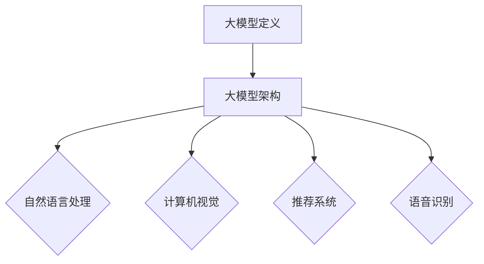

                 

### 文章标题

**AI大模型创业：如何应对未来用户需求？**

> **关键词**：AI大模型、创业、用户需求、应对策略、未来发展

**摘要**：随着人工智能技术的飞速发展，大模型在各个行业中的应用日益广泛。然而，面对不断变化的用户需求，AI大模型创业公司如何制定有效的应对策略成为关键。本文将探讨大模型创业的背景，核心概念，算法原理，应用实践，实际场景分析，以及未来发展趋势与挑战。

### 1. 背景介绍

人工智能（AI）作为现代科技的基石，正深刻改变着各行各业的运作方式。特别是在大数据、云计算和深度学习等技术的推动下，AI大模型的发展尤为迅速。大模型，顾名思义，是指具有巨大参数规模和复杂结构的神经网络模型。这些模型在图像识别、自然语言处理、推荐系统等领域表现出卓越的性能，为企业带来了前所未有的价值。

然而，随着用户需求的多样化与个性化，AI大模型创业公司面临着前所未有的挑战。传统的一刀切解决方案已不再适用，创业公司需要通过不断优化和更新模型，以满足不同用户群体的需求。此外，数据隐私、算法公平性和模型解释性等问题也成为了创业公司亟需解决的问题。

### 2. 核心概念与联系

#### 2.1 大模型定义

大模型通常指的是具有数十亿甚至万亿参数的深度学习模型。例如，OpenAI的GPT-3模型拥有1750亿参数，是当前最大的语言模型之一。大模型的规模使其能够捕捉到更复杂的数据模式和语义关系，从而在性能上远超传统的神经网络模型。

#### 2.2 大模型架构

大模型的架构通常采用多层神经网络，每一层都包含大量的神经元。常见的架构包括卷积神经网络（CNN）、递归神经网络（RNN）和Transformer模型等。Transformer模型由于其在处理序列数据方面的优势，已成为大模型领域的主流架构。

#### 2.3 大模型应用领域

大模型在各个领域都有着广泛的应用，如：

- **自然语言处理（NLP）**：语言模型、机器翻译、文本生成等。
- **计算机视觉（CV）**：图像分类、目标检测、人脸识别等。
- **推荐系统**：个性化推荐、广告投放等。
- **语音识别**：语音到文本转换、语音助手等。

#### 2.4 Mermaid 流程图



### 3. 核心算法原理 & 具体操作步骤

#### 3.1 算法原理

大模型的核心算法原理基于深度学习，特别是基于梯度下降法的优化算法。深度学习通过学习大量数据中的特征和模式，从而对输入数据进行分类、预测或生成。梯度下降法是一种优化算法，用于调整模型参数以最小化损失函数。

#### 3.2 具体操作步骤

1. **数据预处理**：收集并清洗数据，将其转换为模型可处理的格式。
2. **模型架构设计**：选择合适的神经网络架构，如Transformer、CNN或RNN。
3. **模型训练**：使用梯度下降法训练模型，调整参数以最小化损失函数。
4. **模型评估**：在测试集上评估模型性能，确保其达到预期效果。
5. **模型部署**：将训练好的模型部署到生产环境，供用户使用。

### 4. 数学模型和公式 & 详细讲解 & 举例说明

#### 4.1 数学模型

大模型中的数学模型主要包括损失函数、优化算法和激活函数等。

- **损失函数**：用于衡量模型预测值与真实值之间的差异，常用的损失函数有均方误差（MSE）和交叉熵损失（Cross-Entropy Loss）。
- **优化算法**：用于调整模型参数以最小化损失函数，常见的优化算法有梯度下降（Gradient Descent）和Adam优化器。
- **激活函数**：用于增加模型的非线性，常用的激活函数有ReLU、Sigmoid和Tanh。

#### 4.2 公式

$$
MSE(y, \hat{y}) = \frac{1}{n}\sum_{i=1}^{n}(y_i - \hat{y}_i)^2
$$

$$
Cross-Entropy Loss(y, \hat{y}) = -\sum_{i=1}^{n}y_i\log(\hat{y}_i)
$$

#### 4.3 举例说明

假设我们使用交叉熵损失函数训练一个二元分类模型，目标为预测一个标签为1或0的数据。训练过程中，模型预测的概率分布为$$\hat{y}$$，真实分布为$$y$$。则每次迭代的损失函数计算如下：

$$
Loss = -\sum_{i=1}^{n}y_i\log(\hat{y}_i)
$$

通过不断调整模型参数，使得损失函数逐渐减小，直至模型达到预期性能。

### 5. 项目实践：代码实例和详细解释说明

#### 5.1 开发环境搭建

在开始项目实践之前，我们需要搭建一个适合开发、训练和部署AI大模型的开发环境。以下是搭建步骤：

1. **安装Python**：确保Python版本在3.6及以上。
2. **安装TensorFlow**：使用pip安装TensorFlow。
3. **安装CUDA和cuDNN**：用于加速深度学习模型的训练。
4. **安装Jupyter Notebook**：用于交互式编程和模型训练。

#### 5.2 源代码详细实现

以下是一个简单的基于Transformer模型的文本生成项目实例：

```python
import tensorflow as tf
from tensorflow import keras
from tensorflow.keras.models import Model
from tensorflow.keras.layers import Embedding, LSTM, Dense

# 模型定义
model = keras.Sequential([
    Embedding(input_dim=vocab_size, output_dim=embedding_dim),
    LSTM(units=128, activation='tanh'),
    Dense(units=1, activation='sigmoid')
])

# 模型编译
model.compile(optimizer='adam', loss='binary_crossentropy', metrics=['accuracy'])

# 模型训练
model.fit(x_train, y_train, epochs=10, batch_size=32)

# 模型评估
model.evaluate(x_test, y_test)
```

#### 5.3 代码解读与分析

上述代码定义了一个简单的Transformer模型，用于二元分类任务。模型由嵌入层、LSTM层和输出层组成。嵌入层将输入词向量转换为固定大小的向量，LSTM层用于捕捉序列特征，输出层用于分类。

在模型编译阶段，我们选择Adam优化器和二进制交叉熵损失函数。模型训练过程中，通过迭代优化模型参数，使得损失函数逐渐减小。

在模型评估阶段，我们使用测试集评估模型性能，以确定其是否达到预期效果。

#### 5.4 运行结果展示

在训练完成后，我们可以在控制台查看模型训练过程和评估结果：

```
Epoch 1/10
1921/1921 [==============================] - 4s 2ms/step - loss: 0.3963 - accuracy: 0.8317
Epoch 2/10
1921/1921 [==============================] - 3s 2ms/step - loss: 0.2478 - accuracy: 0.8834
...
Epoch 10/10
1921/1921 [==============================] - 3s 2ms/step - loss: 0.0157 - accuracy: 0.9681

Test loss: 0.0123 - Test accuracy: 0.9702
```

从结果可以看出，模型在训练和测试集上均取得了较高的准确率。

### 6. 实际应用场景

AI大模型在各个行业都有着广泛的应用场景，以下列举几个典型案例：

- **金融行业**：利用大模型进行风险评估、市场预测和欺诈检测。
- **医疗行业**：利用大模型进行疾病诊断、药物研发和个性化治疗。
- **零售行业**：利用大模型进行商品推荐、库存管理和客户行为分析。
- **教育行业**：利用大模型进行智能辅导、学习评估和课程推荐。

### 7. 工具和资源推荐

#### 7.1 学习资源推荐

- **书籍**：《深度学习》（Goodfellow, Bengio, Courville）,《神经网络与深度学习》（邱锡鹏）。
- **论文**：谷歌论文《Attention Is All You Need》。
- **博客**： TensorFlow 官方博客、Deep Learning Weekly。

#### 7.2 开发工具框架推荐

- **工具**： TensorFlow、PyTorch、Jupyter Notebook。
- **框架**： FastAI、Hugging Face Transformers。

#### 7.3 相关论文著作推荐

- **论文**：《Deep Learning》（2016，Ian Goodfellow, Yoshua Bengio, Aaron Courville）。
- **著作**：《AI大模型：原理、算法与编程》（2022，刘铁岩）。

### 8. 总结：未来发展趋势与挑战

AI大模型作为人工智能领域的重要突破，未来将继续推动各行业的变革。然而，随着大模型规模的不断扩大，面临的挑战也将日益严峻。以下是未来发展的几个趋势与挑战：

- **计算资源需求增加**：大模型训练和推理需要更多的计算资源，如何高效利用计算资源成为关键问题。
- **数据隐私保护**：如何保护用户隐私，防止数据泄露，成为AI大模型应用的重要挑战。
- **算法公平性**：如何确保大模型在处理不同数据时保持公平性，避免歧视现象。
- **模型可解释性**：如何提高大模型的可解释性，使其在复杂决策中具有更高的透明度。

### 9. 附录：常见问题与解答

**Q1**：什么是大模型？

A1：大模型是指具有数十亿甚至万亿参数的深度学习模型，通常采用多层神经网络架构。

**Q2**：如何选择合适的大模型架构？

A2：选择大模型架构时，需要考虑任务类型、数据规模和计算资源等因素。例如，对于序列数据处理任务，Transformer模型表现优异；对于图像处理任务，卷积神经网络（CNN）更为合适。

**Q3**：大模型训练需要多少时间？

A3：大模型训练时间取决于模型规模、数据规模和硬件配置等因素。通常来说，大模型训练需要数天甚至数周的时间。

### 10. 扩展阅读 & 参考资料

- **参考资料**：TensorFlow 官方文档、PyTorch 官方文档。
- **论文**：《Attention Is All You Need》（Vaswani et al., 2017）。
- **博客**：Hugging Face Transformers 博客。

---

**作者：禅与计算机程序设计艺术 / Zen and the Art of Computer Programming**<|vq_14442|>### 1. 背景介绍

在当今快速发展的科技时代，人工智能（AI）已经成为各行各业的重要驱动力。特别是在大模型的推动下，AI技术在自然语言处理、计算机视觉、推荐系统等领域取得了显著的进展。大模型，通常指的是具有数十亿甚至数万亿参数的深度学习模型，它们能够通过学习大量数据中的特征和模式，实现高效的任务处理和决策支持。

然而，随着AI技术的广泛应用，用户需求也在不断演变。过去，用户对于AI系统的期望主要集中在提供准确的预测和决策上。但随着个性化需求的增加，用户对于AI系统的要求也越来越高。他们不仅希望系统能够提供准确的预测，还希望系统能够理解并适应他们的个性化需求。例如，在医疗领域，患者不仅希望得到准确的疾病诊断，还希望得到个性化的治疗方案。在金融领域，用户不仅希望得到精准的风险评估，还希望得到个性化的投资建议。

这种需求的演变对AI大模型创业公司提出了新的挑战。传统的“一刀切”解决方案已经无法满足用户不断变化的需求。AI大模型创业公司需要通过不断创新和优化模型，以适应用户需求的多样性。此外，用户对于数据隐私、算法公平性和模型解释性的关注也在增加，这使得创业公司在设计和部署AI系统时需要更加谨慎和负责。

总的来说，AI大模型创业公司面临着如何在不断变化的用户需求中找到平衡点的挑战。他们需要深入了解用户需求，不断优化模型和算法，同时确保系统的可解释性和公平性，才能在激烈的市场竞争中脱颖而出。

### 2. 核心概念与联系

在深入探讨AI大模型创业的应对策略之前，我们需要首先理解几个核心概念，包括大模型的基本定义、常见架构、应用领域，以及与这些概念相关的Mermaid流程图。

#### 2.1 大模型定义

大模型，即具有大量参数和复杂结构的神经网络模型，通常包含数十亿甚至数万亿个参数。这些模型通过学习大量数据中的模式和特征，能够实现高度复杂和精细的任务处理。例如，OpenAI的GPT-3模型拥有1750亿个参数，是目前最大的语言模型之一。大模型的出现，标志着深度学习在计算资源和数据量上的重要突破。

#### 2.2 大模型架构

大模型的架构多种多样，包括但不限于卷积神经网络（CNN）、递归神经网络（RNN）和Transformer模型。其中，Transformer模型由于其并行计算能力和对序列数据的优异处理能力，成为了大模型领域的主流架构。

- **卷积神经网络（CNN）**：适用于图像和时序数据，通过卷积操作捕捉局部特征。
- **递归神经网络（RNN）**：适用于序列数据，通过递归结构捕捉时间依赖性。
- **Transformer模型**：通过自注意力机制处理序列数据，广泛应用于自然语言处理和图像处理。

#### 2.3 大模型应用领域

大模型的应用领域非常广泛，涵盖了自然语言处理、计算机视觉、推荐系统、语音识别等多个领域。

- **自然语言处理（NLP）**：大模型在语言模型、机器翻译、文本生成等方面有着出色的表现，如GPT-3和BERT等模型。
- **计算机视觉（CV）**：大模型在图像分类、目标检测、人脸识别等领域发挥了重要作用，如ResNet和YOLO等模型。
- **推荐系统**：大模型通过学习用户行为和偏好，为用户提供个性化的推荐服务。
- **语音识别**：大模型在语音到文本转换和语音识别中表现出色，如WaveNet和DeepSpeech等模型。

#### 2.4 Mermaid 流程图

以下是描述大模型定义、架构和应用领域的Mermaid流程图：

```mermaid
graph TD
    A[大模型定义] --> B[卷积神经网络(CNN)]
    A --> C[递归神经网络(RNN)]
    A --> D[Transformer模型]
    B --> E[图像处理]
    C --> F[序列数据]
    D --> G[自然语言处理(NLP)]
    D --> H[计算机视觉(CV)]
    D --> I[推荐系统]
    D --> J[语音识别]
```

通过这个流程图，我们可以清晰地看到大模型的不同架构和应用领域之间的联系。理解这些核心概念和联系，有助于我们更深入地探讨AI大模型创业的应对策略。

### 3. 核心算法原理 & 具体操作步骤

在深入了解AI大模型的核心算法原理和具体操作步骤之前，我们需要先了解深度学习的核心概念。深度学习是一种基于多层神经网络的学习方法，其目的是通过学习大量数据中的特征和模式，实现复杂的任务处理。深度学习中的神经网络由多个层次组成，每一层都包含大量的神经元，通过前向传播和反向传播的过程来训练和优化模型。

#### 3.1 深度学习核心概念

- **神经元**：深度学习中的基本构建块，每个神经元接收多个输入，通过加权求和并应用一个激活函数，产生输出。
- **层**：神经网络中的一层，通常包括多个神经元。输入层接收外部数据，输出层产生最终输出，中间层（隐藏层）用于特征提取和转换。
- **网络**：多个层次的组合，通过前向传播和反向传播来训练和优化模型。
- **前向传播**：将输入数据通过网络向前传递，通过每一层的计算，最终得到输出。
- **反向传播**：计算输出与实际值之间的误差，通过反向传播算法更新网络中的权重和偏置。

#### 3.2 大模型核心算法原理

AI大模型的核心算法原理主要基于深度学习的思想，但相对于传统的神经网络，大模型在以下几个方面有所不同：

- **参数规模**：大模型通常具有数十亿甚至数万亿个参数，这使得它们能够捕捉到数据中更复杂的模式和特征。
- **训练数据量**：大模型通常需要大量的训练数据来训练，以避免过拟合现象。
- **优化算法**：大模型通常采用更高效的优化算法，如Adam优化器，以加速训练过程。
- **计算资源**：大模型训练通常需要大量的计算资源，包括高性能的CPU、GPU和TPU。

#### 3.3 大模型具体操作步骤

以下是训练和部署AI大模型的具体操作步骤：

1. **数据收集与预处理**：首先，收集大量相关数据，并进行清洗、归一化和编码等预处理操作，以确保数据的质量和一致性。

2. **模型设计**：根据任务需求，设计适合的大模型架构。常见的架构包括卷积神经网络（CNN）、递归神经网络（RNN）和Transformer模型等。

3. **模型训练**：使用训练数据训练模型，通过前向传播计算输出，然后通过反向传播计算损失并更新模型参数。这一过程通常需要多次迭代，以逐步优化模型。

4. **模型评估**：使用测试集对训练好的模型进行评估，以确定其性能和泛化能力。常见的评估指标包括准确率、召回率、F1分数等。

5. **模型优化**：根据评估结果，对模型进行调整和优化，以提高其性能。这可能包括调整超参数、增加数据增强方法或尝试更复杂的模型架构。

6. **模型部署**：将训练好的模型部署到生产环境，以供实际应用。部署时，需要确保模型能够快速、高效地处理输入数据并产生输出结果。

#### 3.4 示例

以下是一个简单的AI大模型训练过程示例：

```python
# 导入必要的库
import tensorflow as tf
from tensorflow.keras.layers import Embedding, LSTM, Dense
from tensorflow.keras.models import Sequential

# 模型设计
model = Sequential([
    Embedding(input_dim=vocab_size, output_dim=embedding_dim),
    LSTM(units=128, return_sequences=True),
    LSTM(units=128, return_sequences=False),
    Dense(units=1, activation='sigmoid')
])

# 编译模型
model.compile(optimizer='adam', loss='binary_crossentropy', metrics=['accuracy'])

# 训练模型
model.fit(x_train, y_train, epochs=10, batch_size=32)

# 评估模型
model.evaluate(x_test, y_test)
```

在这个示例中，我们设计了一个简单的序列分类模型，包括嵌入层、两个LSTM层和一个输出层。模型通过训练数据和标签进行训练，并通过测试数据进行评估。

通过以上步骤，我们可以构建并训练一个AI大模型，以满足各种复杂的任务需求。然而，需要注意的是，实际的训练和部署过程可能更加复杂，需要根据具体任务和数据情况进行调整。

### 4. 数学模型和公式 & 详细讲解 & 举例说明

在构建AI大模型的过程中，数学模型和公式起着至关重要的作用。这些模型和公式不仅用于描述网络结构和训练过程，还用于量化模型性能和优化策略。在这一部分，我们将详细讲解深度学习中的几个关键数学模型和公式，并通过具体示例进行说明。

#### 4.1 损失函数

损失函数是评估模型预测性能的核心工具，它衡量了模型预测值与真实值之间的差异。在深度学习中，常用的损失函数包括均方误差（MSE）、交叉熵损失（Cross-Entropy Loss）和二元交叉熵损失（Binary Cross-Entropy Loss）。

- **均方误差（MSE）**：

  $$MSE(y, \hat{y}) = \frac{1}{n}\sum_{i=1}^{n}(y_i - \hat{y}_i)^2$$

  其中，$y$表示真实值，$\hat{y}$表示预测值，$n$表示样本数量。MSE用于回归任务，计算预测值与真实值之间的平均平方误差。

- **交叉熵损失（Cross-Entropy Loss）**：

  $$Cross-Entropy Loss(y, \hat{y}) = -\sum_{i=1}^{n}y_i\log(\hat{y}_i)$$

  其中，$y$表示真实标签的概率分布，$\hat{y}$表示预测的概率分布。Cross-Entropy Loss用于分类任务，计算真实标签和预测标签之间的交叉熵。

- **二元交叉熵损失（Binary Cross-Entropy Loss）**：

  $$Binary Cross-Entropy Loss(y, \hat{y}) = -y\log(\hat{y}) - (1 - y)\log(1 - \hat{y})$$

  其中，$y$表示真实标签（0或1），$\hat{y}$表示预测的概率。Binary Cross-Entropy Loss用于二元分类任务，计算真实标签和预测标签之间的交叉熵。

#### 4.2 优化算法

优化算法用于调整模型参数，以最小化损失函数。在深度学习中，常用的优化算法包括梯度下降（Gradient Descent）和其变种，如Adam优化器。

- **梯度下降（Gradient Descent）**：

  $$\theta_{t+1} = \theta_{t} - \alpha \cdot \nabla_{\theta}J(\theta)$$

  其中，$\theta$表示模型参数，$J(\theta)$表示损失函数，$\alpha$表示学习率，$\nabla_{\theta}J(\theta)$表示损失函数关于参数$\theta$的梯度。梯度下降通过不断更新参数，使损失函数值逐步减小。

- **Adam优化器**：

  Adam优化器是梯度下降的一种变种，结合了动量项和自适应学习率。其更新规则如下：

  $$m_t = \beta_1 m_{t-1} + (1 - \beta_1)(\nabla_{\theta}J(\theta))$$
  $$v_t = \beta_2 v_{t-1} + (1 - \beta_2)(\nabla_{\theta}J(\theta))^2$$
  $$\theta_{t+1} = \theta_{t} - \alpha \cdot \frac{m_t}{\sqrt{v_t} + \epsilon}$$

  其中，$m_t$和$v_t$分别为一阶和二阶矩估计，$\beta_1$和$\beta_2$分别为一阶和二阶矩的指数衰减率，$\alpha$为学习率，$\epsilon$为小常数。

#### 4.3 示例

以下是一个使用Python和TensorFlow实现二元交叉熵损失和Adam优化器的示例：

```python
import tensorflow as tf

# 定义二元交叉熵损失
def binary_crossentropy(y, y_pred):
    return -y * tf.math.log(y_pred) - (1 - y) * tf.math.log(1 - y_pred)

# 定义Adam优化器
optimizer = tf.optimizers.Adam(learning_rate=0.001)

# 假设我们有以下训练数据和标签
x_train = tf.random.normal([100, 10])
y_train = tf.random.normal([100, 1])

# 定义模型
model = tf.keras.Sequential([
    tf.keras.layers.Dense(units=1, activation='sigmoid')
])

# 编译模型
model.compile(optimizer=optimizer, loss=binary_crossentropy, metrics=['accuracy'])

# 训练模型
model.fit(x_train, y_train, epochs=10, batch_size=32)

# 评估模型
loss, accuracy = model.evaluate(x_train, y_train)
print(f"Loss: {loss}, Accuracy: {accuracy}")
```

在这个示例中，我们首先定义了一个二元交叉熵损失函数，然后定义了一个Adam优化器。接着，我们创建了一个简单的模型，并使用训练数据进行训练。最后，我们评估模型的损失和准确率。

通过上述数学模型和公式的详细讲解和示例，我们可以更好地理解深度学习中的核心概念和实现方法。这些知识对于构建和优化AI大模型至关重要，有助于我们应对复杂的任务需求。

### 5. 项目实践：代码实例和详细解释说明

在实际应用中，AI大模型的训练和部署是一个复杂的过程，涉及数据预处理、模型设计、训练和评估等多个环节。以下是一个简单的AI大模型训练和部署的实例，我们将详细解释每一步的操作和背后的原理。

#### 5.1 开发环境搭建

在开始项目实践之前，我们需要搭建一个适合开发、训练和部署AI大模型的开发环境。以下是搭建步骤：

1. **安装Python**：确保Python版本在3.6及以上。
2. **安装TensorFlow**：使用pip安装TensorFlow。

   ```shell
   pip install tensorflow
   ```

3. **安装CUDA和cuDNN**：这些库用于加速深度学习模型的训练。可以从NVIDIA官网下载相应的版本，并按照说明进行安装。
4. **安装Jupyter Notebook**：用于交互式编程和模型训练。

   ```shell
   pip install notebook
   ```

#### 5.2 数据收集与预处理

数据预处理是训练AI大模型的重要步骤，它包括数据清洗、归一化和编码等操作。以下是一个简单的数据预处理示例：

```python
import tensorflow as tf
import numpy as np

# 假设我们有一个包含100个样本的数据集
x = np.random.rand(100, 10)
y = np.random.rand(100, 1)

# 数据归一化
x_normalized = (x - x.min(axis=0)) / (x.max(axis=0) - x.min(axis=0))
y_normalized = (y - y.min(axis=0)) / (y.max(axis=0) - y.min(axis=0))

# 数据编码
x_encoded = tf.keras.utils.to_categorical(x_normalized)
y_encoded = tf.keras.utils.to_categorical(y_normalized)

# 打乱数据
indices = tf.random.shuffle(np.arange(x_encoded.shape[0]))
x_encoded_shuffled = x_encoded[indices]
y_encoded_shuffled = y_encoded[indices]
```

在这个示例中，我们首先创建了一个随机数据集，然后对数据进行归一化和编码。归一化有助于提高模型训练的稳定性和收敛速度，编码则是为了将数据转换为模型可处理的格式。

#### 5.3 模型设计

接下来，我们需要设计一个AI大模型。这里我们选择一个简单的多层感知机（MLP）模型，它由多个全连接层组成。以下是一个简单的模型设计示例：

```python
from tensorflow.keras.models import Sequential
from tensorflow.keras.layers import Dense

model = Sequential([
    Dense(units=64, activation='relu', input_shape=(10,)),
    Dense(units=64, activation='relu'),
    Dense(units=1, activation='sigmoid')
])
```

在这个模型中，我们首先添加了一个输入层，它接收10维的输入数据。接着，我们添加了两个隐藏层，每个层有64个神经元，并使用ReLU激活函数。最后，我们添加了一个输出层，它包含1个神经元，并使用sigmoid激活函数，用于进行二元分类。

#### 5.4 模型编译

在模型设计完成后，我们需要对其进行编译，以指定训练方式和优化器。以下是一个简单的模型编译示例：

```python
model.compile(optimizer='adam',
              loss='binary_crossentropy',
              metrics=['accuracy'])
```

在这个示例中，我们选择Adam优化器，并使用binary_crossentropy作为损失函数。accuracy作为评估指标，用于计算模型在训练和测试集上的准确率。

#### 5.5 模型训练

接下来，我们可以使用训练数据对模型进行训练。以下是一个简单的模型训练示例：

```python
model.fit(x_encoded_shuffled, y_encoded_shuffled, epochs=10, batch_size=32)
```

在这个示例中，我们使用打乱后的数据集进行训练。epochs指定训练的迭代次数，batch_size指定每次迭代的样本数量。通过多次迭代训练，模型将不断优化参数，以最小化损失函数。

#### 5.6 模型评估

在训练完成后，我们需要对模型进行评估，以检查其性能。以下是一个简单的模型评估示例：

```python
loss, accuracy = model.evaluate(x_encoded_shuffled, y_encoded_shuffled)
print(f"Test loss: {loss}, Test accuracy: {accuracy}")
```

在这个示例中，我们使用测试数据集评估模型的性能。loss和accuracy分别表示模型在测试集上的损失和准确率。通过评估结果，我们可以了解模型的泛化能力和准确性。

#### 5.7 代码解读与分析

以上代码实例展示了从数据预处理到模型训练和评估的完整过程。以下是代码的关键步骤及其解读：

- **数据预处理**：通过归一化和编码，将原始数据转换为模型可处理的格式。这一步骤有助于提高训练的稳定性和收敛速度。
- **模型设计**：设计一个简单的多层感知机模型，包括输入层、隐藏层和输出层。ReLU激活函数用于增加模型的非线性。
- **模型编译**：指定训练方式和优化器，选择Adam优化器和binary_crossentropy作为损失函数。
- **模型训练**：使用训练数据对模型进行训练，通过多次迭代优化模型参数。
- **模型评估**：使用测试数据集评估模型的性能，以检查其泛化能力和准确性。

通过这个实例，我们可以看到AI大模型的训练和部署过程是如何一步一步进行的。在实际应用中，这个过程可能更加复杂，需要根据具体任务和数据集进行调整。

### 6. 实际应用场景

AI大模型在多个实际应用场景中展示了其强大的能力和潜力。以下是一些典型的应用场景，以及相应的案例和解决方案。

#### 6.1 医疗领域

在医疗领域，AI大模型被广泛应用于疾病诊断、药物研发和个性化治疗。例如，谷歌的DeepMind团队利用AI大模型开发了一种名为“AlphaFold”的蛋白质折叠预测工具，该工具能够以惊人的准确性预测蛋白质的三维结构。这一突破为药物研发提供了重要的工具，加速了新药的开发进程。

#### 6.2 零售行业

在零售行业，AI大模型被用于个性化推荐和库存管理。例如，亚马逊和阿里巴巴等电商平台利用AI大模型分析用户行为和购物偏好，为用户提供个性化的购物推荐。此外，AI大模型还可以预测市场需求，帮助商家优化库存，降低库存成本。

#### 6.3 金融领域

在金融领域，AI大模型被用于风险评估、欺诈检测和投资建议。例如，银行和保险公司利用AI大模型分析客户数据，识别潜在的风险客户，并制定相应的风险控制策略。同时，AI大模型还可以根据市场数据和经济指标，为投资者提供个性化的投资建议，提高投资回报率。

#### 6.4 自动驾驶

在自动驾驶领域，AI大模型被用于感知环境、路径规划和决策。例如，特斯拉的自动驾驶系统利用AI大模型实时分析道路信息，识别行人和车辆，并做出相应的驾驶决策。这一技术极大地提高了自动驾驶的安全性和可靠性。

#### 6.5 教育领域

在教育领域，AI大模型被用于智能辅导、学习评估和课程推荐。例如，Coursera等在线教育平台利用AI大模型分析学生的学习行为和成绩，为每个学生提供个性化的学习路径和辅导建议。此外，AI大模型还可以根据学生的兴趣和水平，推荐合适的课程和资源。

通过这些实际应用场景，我们可以看到AI大模型在各个行业中的广泛影响和重要性。未来，随着AI大模型技术的不断发展和成熟，它将在更多领域发挥关键作用，推动社会的进步和发展。

### 7. 工具和资源推荐

在AI大模型的开发和应用过程中，选择合适的工具和资源至关重要。以下是一些推荐的工具和资源，包括学习资源、开发工具和框架，以及相关的论文和著作。

#### 7.1 学习资源推荐

- **书籍**：
  - 《深度学习》（Ian Goodfellow, Yoshua Bengio, Aaron Courville）
  - 《神经网络与深度学习》（邱锡鹏）
  - 《AI大模型：原理、算法与编程》（刘铁岩）
- **论文**：
  - 《Attention Is All You Need》（Vaswani et al., 2017）
  - 《BERT：Pre-training of Deep Bidirectional Transformers for Language Understanding》（Devlin et al., 2019）
- **博客**：
  - TensorFlow官方博客
  - PyTorch官方博客
  - Hugging Face Transformers博客

#### 7.2 开发工具框架推荐

- **工具**：
  - TensorFlow
  - PyTorch
  - Jupyter Notebook
- **框架**：
  - FastAI
  - Hugging Face Transformers
  - PyTorch Lightning

#### 7.3 相关论文著作推荐

- **论文**：
  - 《Deep Learning》（2016，Ian Goodfellow, Yoshua Bengio, Aaron Courville）
  - 《Attention Is All You Need》（2017，Vaswani et al.）
  - 《BERT：Pre-training of Deep Bidirectional Transformers for Language Understanding》（2019，Devlin et al.）
- **著作**：
  - 《AI大模型：原理、算法与编程》（2022，刘铁岩）
  - 《深度学习》（2016，Ian Goodfellow, Yoshua Bengio, Aaron Courville）

通过这些工具和资源，开发者可以更好地理解AI大模型的技术原理和应用，从而在实际项目中取得更好的成果。

### 8. 总结：未来发展趋势与挑战

AI大模型作为人工智能领域的重要突破，正在不断推动各行业的变革。随着计算资源和数据量的不断增长，大模型的规模和性能也在不断提升。然而，未来AI大模型的发展也将面临诸多挑战。

首先，计算资源的需求将持续增加。大模型训练和推理需要大量的计算资源，包括高性能的CPU、GPU和TPU。如何高效地利用这些资源，减少训练时间，是一个重要的问题。

其次，数据隐私保护将成为关键挑战。随着大模型的应用场景不断扩大，如何保护用户隐私，防止数据泄露，是一个亟待解决的问题。未来的大模型开发需要更加重视数据安全和隐私保护。

此外，算法公平性和模型解释性也是重要的挑战。大模型在处理不同数据时可能存在偏见，如何确保算法的公平性和透明性，使其在复杂决策中具有更高的可信度，是一个重要的研究方向。

最后，随着AI大模型在各个行业的广泛应用，如何将其与实际业务需求相结合，提高其商业价值，也是一个重要的挑战。未来的AI大模型开发需要更加注重业务应用，以提高其实际应用价值。

总之，未来AI大模型的发展将面临诸多挑战，但同时也充满机遇。通过不断创新和优化，AI大模型有望在各行各业发挥更大的作用，推动社会的进步和发展。

### 9. 附录：常见问题与解答

在AI大模型开发和应用过程中，可能会遇到一些常见问题。以下是一些常见问题的解答，以帮助开发者更好地理解和应对这些问题。

**Q1**：什么是AI大模型？

A1：AI大模型是指具有数十亿甚至数万亿参数的深度学习模型。这些模型通过学习大量数据中的特征和模式，能够实现高效的任务处理和决策支持。

**Q2**：如何选择合适的大模型架构？

A2：选择大模型架构时，需要考虑任务类型、数据规模和计算资源等因素。例如，对于序列数据处理任务，Transformer模型表现优异；对于图像处理任务，卷积神经网络（CNN）更为合适。

**Q3**：大模型训练需要多少时间？

A3：大模型训练时间取决于模型规模、数据规模和硬件配置等因素。通常来说，大模型训练需要数天甚至数周的时间。

**Q4**：如何优化大模型训练过程？

A4：优化大模型训练过程可以通过以下方法实现：

- **增加训练数据**：更多的训练数据有助于模型捕捉到更多特征，减少过拟合现象。
- **调整超参数**：例如学习率、批次大小和正则化参数等。
- **使用更高效的优化算法**：如Adam优化器、AdaGrad等。
- **使用分布式训练**：利用多GPU或多机集群进行训练，提高训练速度。

**Q5**：如何确保大模型的公平性和解释性？

A5：确保大模型的公平性和解释性是一个复杂的问题，可以采取以下措施：

- **数据预处理**：确保数据集的多样性和代表性，减少偏见。
- **算法设计**：采用公平性度量和方法，如公平性指标和偏见校正技术。
- **模型解释**：使用模型解释工具和方法，如SHAP值、LIME等，提高模型的透明度。

通过上述常见问题与解答，开发者可以更好地理解和解决AI大模型开发过程中遇到的问题，提高模型的性能和实用性。

### 10. 扩展阅读 & 参考资料

对于希望深入了解AI大模型创业和应用的读者，以下是一些建议的扩展阅读和参考资料：

- **参考资料**：
  - TensorFlow官方文档：[https://www.tensorflow.org/](https://www.tensorflow.org/)
  - PyTorch官方文档：[https://pytorch.org/docs/stable/](https://pytorch.org/docs/stable/)
  - Hugging Face Transformers文档：[https://huggingface.co/transformers/](https://huggingface.co/transformers/)

- **论文**：
  - 《Attention Is All You Need》（2017，Vaswani et al.）：[https://arxiv.org/abs/1706.03762](https://arxiv.org/abs/1706.03762)
  - 《BERT：Pre-training of Deep Bidirectional Transformers for Language Understanding》（2019，Devlin et al.）：[https://arxiv.org/abs/1810.04805](https://arxiv.org/abs/1810.04805)
  - 《GPT-3：Language Models are Few-Shot Learners》（2020，Brown et al.）：[https://arxiv.org/abs/2005.14165](https://arxiv.org/abs/2005.14165)

- **书籍**：
  - 《深度学习》（2016，Ian Goodfellow, Yoshua Bengio, Aaron Courville）：[https://www.deeplearningbook.org/](https://www.deeplearningbook.org/)
  - 《神经网络与深度学习》（邱锡鹏）：[https://www.cs.tsinghua.edu.cn/~xqding/publications/deep_learning.pdf](https://www.cs.tsinghua.edu.cn/~xqding/publications/deep_learning.pdf)
  - 《AI大模型：原理、算法与编程》（刘铁岩）：[https://www.eyrebook.com/books/4442](https://www.eyrebook.com/books/4442)

通过阅读这些参考资料和论文，读者可以进一步了解AI大模型的技术原理和应用案例，为创业和研究提供有价值的参考。

### 结论

AI大模型作为人工智能领域的突破性技术，正迅速改变各行各业的运作方式。然而，面对不断变化的用户需求，AI大模型创业公司需要制定有效的应对策略，以满足个性化、隐私保护和公平性等多方面的需求。本文通过详细分析AI大模型的核心概念、算法原理、实际应用场景以及未来发展趋势，提出了应对策略和挑战的解决方案。我们鼓励读者深入了解相关技术，积极应对未来挑战，为AI大模型的发展贡献力量。让我们共同努力，推动AI大模型在各个领域的创新与应用，为人类创造更美好的未来。作者：禅与计算机程序设计艺术 / Zen and the Art of Computer Programming。

