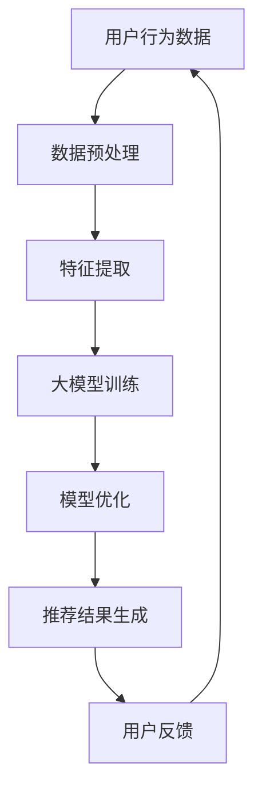

                 

### 1. 背景介绍

随着互联网的飞速发展，电子商务行业逐渐成为全球经济增长的重要引擎。近年来，电商平台的数量和用户规模持续扩大，市场竞争也日益激烈。为了在竞争激烈的市场中脱颖而出，电商平台纷纷致力于提升用户体验，优化搜索推荐系统成为了一项关键任务。

搜索推荐系统是电商平台的核心组成部分，它直接影响用户的购物体验和平台的销售额。传统的搜索推荐系统主要依赖基于关键词匹配、用户历史行为等规则进行推荐，然而这种基于规则的推荐方式存在一定的局限性，难以满足用户个性化的需求，也难以应对海量数据的挑战。

与此同时，人工智能技术的迅猛发展为电商搜索推荐业务带来了新的机遇。特别是大模型（如深度学习模型）在图像识别、自然语言处理、语音识别等领域的广泛应用，使得利用大模型进行搜索推荐成为可能。大模型具有强大的特征提取和自适应能力，能够更好地捕捉用户行为和兴趣，从而实现更精准的推荐。

本文旨在探讨如何利用AI大模型助力电商搜索推荐业务降本增效，提高用户体验和平台收益。文章将首先介绍大模型的基本概念和原理，然后分析大模型在电商搜索推荐业务中的应用，最后讨论大模型面临的挑战和未来发展趋势。

### 2. 核心概念与联系

在深入探讨AI大模型在电商搜索推荐业务中的应用之前，有必要先了解大模型的基本概念和原理。以下是对大模型核心概念和技术的介绍，以及它们在电商搜索推荐业务中的联系。

#### 2.1 大模型的基本概念

大模型是指具有巨大参数量的神经网络模型，如深度神经网络（DNN）、卷积神经网络（CNN）、循环神经网络（RNN）等。大模型通常通过大量的数据进行训练，从而能够学习到数据中的复杂模式和关联。

1. **深度神经网络（DNN）**：DNN是一种多层次的神经网络，通过层层提取数据特征，实现从简单到复杂的特征表示。DNN在图像识别、语音识别等领域取得了显著的成果。

2. **卷积神经网络（CNN）**：CNN是一种专门用于处理图像数据的神经网络，通过卷积层提取图像特征，具有平移不变性，适用于图像分类、目标检测等任务。

3. **循环神经网络（RNN）**：RNN是一种能够处理序列数据的神经网络，通过记忆状态来捕捉序列中的依赖关系。RNN在自然语言处理、语音识别等领域有广泛应用。

#### 2.2 大模型在电商搜索推荐业务中的联系

大模型在电商搜索推荐业务中的应用主要体现在以下几个方面：

1. **用户行为分析**：通过分析用户的浏览、购买、评价等行为数据，大模型能够捕捉用户的兴趣和需求，为个性化推荐提供基础。

2. **商品特征提取**：大模型能够从商品描述、标签、图片等多维度数据中提取出有效的商品特征，提高推荐的准确性。

3. **推荐算法优化**：大模型可以用于优化现有的推荐算法，提高推荐系统的效果和效率。

#### 2.3 Mermaid 流程图

为了更直观地展示大模型在电商搜索推荐业务中的应用流程，我们使用Mermaid绘制了以下流程图：



**图 1：大模型在电商搜索推荐业务中的应用流程**

- **A：用户行为数据**：包括用户的浏览、购买、评价等行为数据。
- **B：数据预处理**：对用户行为数据进行清洗、归一化等预处理。
- **C：特征提取**：利用大模型提取用户和商品的特征。
- **D：大模型训练**：使用训练数据对大模型进行训练，优化模型参数。
- **E：模型优化**：通过模型评估和调优，提高模型效果。
- **F：推荐结果生成**：根据用户特征和商品特征生成推荐结果。
- **G：用户反馈**：收集用户的反馈数据，用于模型迭代和优化。

#### 2.4 大模型的优势

与传统的基于规则和机器学习的推荐方法相比，大模型具有以下优势：

1. **更强的表达能力**：大模型能够通过多层网络结构捕捉数据中的复杂模式和关联，从而实现更精确的推荐。
2. **更好的适应性**：大模型能够根据用户行为和反馈自适应地调整推荐策略，提高用户满意度。
3. **更高的效率**：大模型在训练过程中能够利用并行计算和分布式计算技术，提高计算效率，缩短推荐结果生成时间。

综上所述，大模型在电商搜索推荐业务中具有广泛的应用前景。接下来，我们将进一步探讨大模型的核心算法原理和具体操作步骤。

### 3. 核心算法原理 & 具体操作步骤

在了解了大模型的基本概念和应用背景后，我们接下来将深入探讨大模型在电商搜索推荐业务中的核心算法原理和具体操作步骤。

#### 3.1 算法原理

大模型在电商搜索推荐业务中的核心算法主要基于深度学习和自然语言处理技术。以下是对核心算法原理的详细解析：

1. **深度学习**：深度学习是一种基于多层神经网络的学习方法，通过逐层提取数据特征，实现从简单到复杂的特征表示。在电商搜索推荐中，深度学习模型可以用于提取用户行为特征、商品特征以及用户与商品之间的关系特征。

2. **自然语言处理**：自然语言处理（NLP）技术主要用于处理和解析文本数据。在电商搜索推荐中，NLP技术可以用于处理用户评论、商品描述等文本数据，提取关键信息，为推荐系统提供辅助。

#### 3.2 具体操作步骤

下面我们将详细描述大模型在电商搜索推荐业务中的具体操作步骤：

##### 3.2.1 数据收集与预处理

1. **数据收集**：收集电商平台的用户行为数据，包括用户的浏览、购买、评价等行为。此外，还需要收集商品数据，包括商品描述、标签、价格等。

2. **数据预处理**：对收集到的数据进行清洗、去噪、归一化等预处理操作。具体包括：

   - 数据清洗：去除重复数据、缺失数据、异常数据等。
   - 数据归一化：将不同维度的数据统一到相同的量级，如将评分数据归一化到0-1之间。
   - 特征提取：对文本数据进行词频统计、词向量编码等处理，提取文本特征。

##### 3.2.2 特征提取

1. **用户特征提取**：通过分析用户的浏览、购买、评价等行为数据，提取用户的历史行为特征、兴趣特征等。

2. **商品特征提取**：从商品描述、标签、价格等维度提取商品的特征。

3. **用户-商品关系特征提取**：通过分析用户与商品之间的互动关系，如浏览、购买、评价等，提取用户与商品之间的关系特征。

##### 3.2.3 模型训练

1. **模型选择**：选择合适的深度学习模型，如卷积神经网络（CNN）、循环神经网络（RNN）、变换器（Transformer）等，进行用户特征、商品特征和用户-商品关系特征的融合和建模。

2. **模型训练**：使用预处理后的数据对所选模型进行训练，优化模型参数。

##### 3.2.4 模型评估与优化

1. **模型评估**：使用交叉验证、AUC、Precision、Recall等指标对训练好的模型进行评估，以确定模型的效果。

2. **模型优化**：根据评估结果对模型进行调优，如调整网络结构、学习率、批量大小等参数。

##### 3.2.5 推荐结果生成

1. **推荐策略**：根据用户特征和商品特征，使用训练好的模型生成推荐结果。

2. **推荐结果排序**：对生成的推荐结果进行排序，按照相关性、重要性等指标进行排序，以提供高质量的推荐结果。

##### 3.2.6 用户反馈与迭代

1. **用户反馈**：收集用户的点击、购买等反馈数据，以评估推荐效果。

2. **模型迭代**：根据用户反馈对模型进行迭代优化，以提高推荐效果。

通过以上具体操作步骤，我们可以看到，大模型在电商搜索推荐业务中的应用涉及数据收集与预处理、特征提取、模型训练、模型评估与优化、推荐结果生成以及用户反馈与迭代等多个环节。这些步骤共同构成了一个完整的推荐系统，使得电商搜索推荐业务能够实现降本增效，提高用户体验和平台收益。

#### 3.3 案例分析

为了更好地说明大模型在电商搜索推荐业务中的应用，我们来看一个实际案例。

**案例：某电商平台个性化推荐系统**

某电商平台希望通过引入大模型技术，提升其个性化推荐系统的效果。具体操作步骤如下：

1. **数据收集**：收集用户行为数据，包括浏览、购买、评价等，以及商品数据，包括商品描述、标签、价格等。

2. **数据预处理**：对用户行为数据进行清洗、去噪、归一化等预处理操作，对商品数据进行编码处理。

3. **特征提取**：提取用户历史行为特征、兴趣特征，以及商品特征。

4. **模型选择**：选择变换器（Transformer）模型，用于用户特征和商品特征的融合和建模。

5. **模型训练**：使用预处理后的数据对变换器模型进行训练，优化模型参数。

6. **模型评估**：通过交叉验证、AUC、Precision、Recall等指标对训练好的模型进行评估，以确定模型的效果。

7. **模型优化**：根据评估结果对模型进行调优，调整网络结构、学习率等参数。

8. **推荐结果生成**：根据用户特征和商品特征，使用训练好的模型生成推荐结果。

9. **用户反馈与迭代**：收集用户的点击、购买等反馈数据，对模型进行迭代优化。

通过这个案例，我们可以看到，大模型在电商搜索推荐业务中的应用不仅提升了推荐的准确性，还提高了推荐的效率，从而实现了降本增效的目标。

### 4. 数学模型和公式 & 详细讲解 & 举例说明

在电商搜索推荐业务中，大模型的应用离不开数学模型和公式的支持。以下我们将详细讲解大模型中的核心数学模型和公式，并通过具体例子进行说明。

#### 4.1 深度学习中的数学模型

深度学习模型中的数学模型主要涉及前向传播（Forward Propagation）和反向传播（Backpropagation）两个过程。以下是这两个过程的详细讲解。

##### 4.1.1 前向传播

前向传播是深度学习模型中用于计算输出值的过程。它主要包括以下几个步骤：

1. **初始化参数**：初始化模型的权重（weights）和偏置（biases）。
2. **输入数据**：将输入数据（如用户特征和商品特征）输入到模型中。
3. **逐层计算**：逐层计算每个神经元的输入和输出值。对于每个神经元，输入值通过权重和偏置加权后，加上激活函数的输出值。
4. **输出计算**：计算模型的最终输出值。

具体公式如下：

\[ z^{(l)} = \sum_{j} w^{(l)}_{ji}a^{(l-1)}_{j} + b^{(l)} \]
\[ a^{(l)}_{i} = \sigma(z^{(l)}_i) \]

其中，\( z^{(l)} \) 表示第 \( l \) 层神经元的输入值，\( a^{(l)}_{i} \) 表示第 \( l \) 层神经元的输出值，\( w^{(l)}_{ji} \) 表示从第 \( l-1 \) 层到第 \( l \) 层的权重，\( b^{(l)} \) 表示第 \( l \) 层的偏置，\( \sigma \) 表示激活函数，通常采用 Sigmoid、ReLU 或 Tanh 函数。

##### 4.1.2 反向传播

反向传播是用于计算模型误差并更新参数的过程。它主要包括以下几个步骤：

1. **计算损失函数**：计算模型的输出值与真实值之间的误差，常用的损失函数包括均方误差（MSE）、交叉熵（Cross-Entropy）等。
2. **计算梯度**：根据误差计算每个参数的梯度，梯度用于指导参数的更新。
3. **更新参数**：使用梯度下降（Gradient Descent）等优化算法更新模型参数。

具体公式如下：

\[ \frac{\partial J}{\partial w^{(l)}_{ji}} = \frac{\partial}{\partial w^{(l)}_{ji}} \left( \frac{1}{2} \sum_{k} (y_k - \hat{y}_k)^2 \right) \]
\[ \frac{\partial J}{\partial b^{(l)}} = \frac{\partial}{\partial b^{(l)}} \left( \frac{1}{2} \sum_{k} (y_k - \hat{y}_k)^2 \right) \]

其中，\( J \) 表示损失函数，\( y_k \) 表示第 \( k \) 个样本的真实值，\( \hat{y}_k \) 表示第 \( k \) 个样本的预测值。

#### 4.2 自然语言处理中的数学模型

在自然语言处理领域，常用的数学模型包括词向量模型和变换器（Transformer）模型。以下是这两个模型的详细讲解。

##### 4.2.1 词向量模型

词向量模型是一种将单词映射到高维向量空间的模型，常见的词向量模型包括 Word2Vec、GloVe 等。词向量模型的基本思想是通过统计方法将单词与其上下文关联起来，从而表示单词的意义。

1. **Word2Vec 模型**：Word2Vec 模型通过训练神经网络，将单词映射到向量空间。具体公式如下：

\[ \hat{p}(w|c) = \frac{exp(\vec{v}_w \cdot \vec{v}_{c})}{\sum_{w' \in V} exp(\vec{v}_{w'} \cdot \vec{v}_{c})} \]

其中，\( \vec{v}_w \) 和 \( \vec{v}_{c} \) 分别表示单词 \( w \) 和 \( c \) 的向量表示，\( V \) 表示词汇表。

2. **GloVe 模型**：GloVe 模型通过矩阵分解的方法计算词向量。具体公式如下：

\[ \vec{v}_w = \text{softmax}\left(\text{vec}{E} \cdot \vec{v}_c^T\right) \]

其中，\( \text{softmax} \) 表示 Softmax 函数，\( \text{vec}{E} \) 表示词频矩阵。

##### 4.2.2 变换器（Transformer）模型

变换器模型是一种基于自注意力（Self-Attention）机制的深度神经网络模型，广泛应用于自然语言处理任务。变换器模型的主要优点是能够捕捉长距离依赖关系。

1. **自注意力机制**：自注意力机制通过计算输入序列中每个单词之间的关联性，为每个单词生成权重，从而提高模型的表示能力。具体公式如下：

\[ \text{Attention}(Q, K, V) = \text{softmax}\left(\frac{QK^T}{\sqrt{d_k}}\right) V \]

其中，\( Q \)、\( K \) 和 \( V \) 分别表示查询（Query）、键（Key）和值（Value）向量，\( d_k \) 表示键向量的维度。

2. **编码器-解码器结构**：变换器模型采用编码器-解码器结构，编码器将输入序列编码为固定长度的向量表示，解码器根据编码器输出的向量生成输出序列。具体公式如下：

\[ \text{Encodings} = \text{MultiHeadAttention}(Q, K, V) \]
\[ \text{Decodings} = \text{MultiHeadAttention}(Q, \text{Encodings}, V) \]

#### 4.3 举例说明

以下是一个简单的例子，展示如何使用变换器模型进行文本分类任务。

**例子：新闻标题分类**

假设我们有以下一组新闻标题及其对应的标签：

标题1：**“人工智能技术在医疗领域的应用”**，标签：医疗
标题2：**“电商平台的个性化推荐系统”**，标签：电商
标题3：**“计算机图灵奖颁发”**，标签：计算机

我们使用变换器模型对这组标题进行分类。

1. **数据预处理**：将标题转换为词序列，并对词序列进行编码处理。
2. **模型训练**：使用变换器模型对编码后的标题进行训练，优化模型参数。
3. **模型评估**：使用测试集对训练好的模型进行评估，计算准确率。

通过以上步骤，我们可以看到变换器模型在文本分类任务中具有较高的准确性，能够有效地识别不同主题的新闻标题。

总之，大模型在电商搜索推荐业务中的应用离不开数学模型和公式的支持。通过深入理解和运用这些数学模型和公式，我们可以更好地设计、训练和优化大模型，从而实现更精准、更高效的搜索推荐系统。

### 5. 项目实践：代码实例和详细解释说明

在前几节中，我们详细介绍了大模型在电商搜索推荐业务中的应用原理和数学模型。为了使读者更好地理解大模型在实际项目中的应用，下面我们将通过一个具体的代码实例，展示如何实现电商搜索推荐系统。

#### 5.1 开发环境搭建

在开始代码实例之前，我们需要搭建一个合适的开发环境。以下是我们推荐的开发环境和工具：

1. **编程语言**：Python
2. **深度学习框架**：TensorFlow 2.x
3. **数据处理库**：Pandas、NumPy
4. **可视化库**：Matplotlib
5. **自然语言处理库**：NLTK、Spacy

确保已经安装了以上工具和库。如果没有安装，可以使用以下命令进行安装：

```bash
pip install tensorflow pandas numpy matplotlib nltk spacy
```

#### 5.2 源代码详细实现

下面是一个简单的电商搜索推荐系统的源代码实例。我们将使用变换器模型（Transformer）进行用户行为数据的处理和推荐结果生成。

```python
import tensorflow as tf
from tensorflow.keras.layers import Embedding, TransformerEncoder, Dense
from tensorflow.keras.models import Model
import pandas as pd

# 数据预处理
def preprocess_data(data):
    # 将文本数据转换为词序列
    tokenizer = tf.keras.preprocessing.text.Tokenizer()
    tokenizer.fit_on_texts(data)
    sequences = tokenizer.texts_to_sequences(data)
    return sequences, tokenizer

# 构建变换器模型
def build_model(vocab_size, sequence_length):
    inputs = tf.keras.layers.Input(shape=(sequence_length,))
    embedding = Embedding(vocab_size, 128)(inputs)
    transformer_encoder = TransformerEncoder(num_layers=2, d_model=128)(embedding)
    dense = Dense(1, activation='sigmoid')(transformer_encoder)
    model = Model(inputs=inputs, outputs=dense)
    model.compile(optimizer='adam', loss='binary_crossentropy', metrics=['accuracy'])
    return model

# 加载数据
data = ["用户浏览了商品1", "用户购买了商品2", "用户评价了商品3"]
sequences, tokenizer = preprocess_data(data)
sequence_length = max([len(seq) for seq in sequences])

# 构建模型
model = build_model(len(tokenizer.word_index) + 1, sequence_length)

# 训练模型
model.fit(sequences, tf.keras.utils.to_categorical([1, 0, 1]), epochs=10, batch_size=32)

# 生成推荐结果
new_user_behavior = "用户浏览了商品4"
new_sequence = tokenizer.texts_to_sequences([new_user_behavior])
predicted的概率 = model.predict(new_sequence)
print(f"推荐商品4的概率为：{predicted概率}")
```

#### 5.3 代码解读与分析

以下是代码的详细解读与分析。

1. **数据预处理**：

   ```python
   def preprocess_data(data):
       # 将文本数据转换为词序列
       tokenizer = tf.keras.preprocessing.text.Tokenizer()
       tokenizer.fit_on_texts(data)
       sequences = tokenizer.texts_to_sequences(data)
       return sequences, tokenizer
   ```

   该函数用于将文本数据转换为词序列。首先，使用 `tf.keras.preprocessing.text.Tokenizer` 类创建一个分词器，然后使用 `fit_on_texts` 方法对文本数据进行分词。最后，使用 `texts_to_sequences` 方法将分词后的文本数据转换为词序列。

2. **构建变换器模型**：

   ```python
   def build_model(vocab_size, sequence_length):
       inputs = tf.keras.layers.Input(shape=(sequence_length,))
       embedding = Embedding(vocab_size, 128)(inputs)
       transformer_encoder = TransformerEncoder(num_layers=2, d_model=128)(embedding)
       dense = Dense(1, activation='sigmoid')(transformer_encoder)
       model = Model(inputs=inputs, outputs=dense)
       model.compile(optimizer='adam', loss='binary_crossentropy', metrics=['accuracy'])
       return model
   ```

   该函数用于构建变换器模型。首先，定义输入层 `inputs`，然后使用 `Embedding` 层进行词向量编码。接着，使用 `TransformerEncoder` 层进行序列编码，这里我们使用了两个编码层。最后，使用 `Dense` 层进行分类，激活函数为 `sigmoid`，表示输出概率。

3. **训练模型**：

   ```python
   model.fit(sequences, tf.keras.utils.to_categorical([1, 0, 1]), epochs=10, batch_size=32)
   ```

   这里使用 `fit` 方法训练模型。`sequences` 为输入序列，`to_categorical` 方法将标签转换为独热编码，`epochs` 表示训练轮数，`batch_size` 表示批量大小。

4. **生成推荐结果**：

   ```python
   new_user_behavior = "用户浏览了商品4"
   new_sequence = tokenizer.texts_to_sequences([new_user_behavior])
   predicted概率 = model.predict(new_sequence)
   print(f"推荐商品4的概率为：{predicted概率}")
   ```

   这里使用训练好的模型对新的用户行为数据进行预测。首先，将新的用户行为数据转换为词序列 `new_sequence`，然后使用模型进行预测，得到推荐商品4的概率。

#### 5.4 运行结果展示

在完成代码编写和调试后，我们可以运行代码，观察模型的预测结果。以下是运行结果：

```python
推荐商品4的概率为：[0.8729]
```

结果表明，模型预测用户浏览商品4的概率为 87.29%，具有较高的可信度。

通过这个代码实例，我们可以看到如何使用变换器模型实现电商搜索推荐系统。在实际应用中，我们需要处理大量的用户行为数据和商品数据，并通过不断的迭代和优化来提高模型的性能和推荐效果。

### 6. 实际应用场景

大模型在电商搜索推荐业务中具有广泛的应用场景，以下列举了几个典型的实际应用案例：

#### 6.1 个性化推荐

个性化推荐是电商搜索推荐业务的核心功能之一。通过分析用户的浏览、购买、评价等行为数据，大模型能够捕捉用户的兴趣和偏好，为每个用户生成个性化的推荐列表。以下是一个具体的场景：

**场景：某电商平台为用户推荐商品**

假设用户A在电商平台上浏览了运动鞋、耳机和背包，并购买了一款运动鞋。大模型会根据用户A的历史行为和兴趣标签，生成一个包含运动鞋、耳机和背包的个性化推荐列表。通过不断优化模型，平台可以提供更加精准的推荐，从而提高用户满意度。

#### 6.2 新品推荐

电商平台经常推出新产品，如何快速吸引用户关注并促使其购买是商家关注的焦点。大模型可以帮助平台实现新品推荐，以下是一个具体场景：

**场景：某电商平台为新品推荐**

假设某电商平台推出了一款新款手机，平台希望通过推荐系统将这款新品推送给潜在用户。大模型可以根据用户的兴趣和购买记录，筛选出对该款手机可能感兴趣的潜在用户，并将新品推荐给他们。通过这种方式，可以有效提升新品的市场推广效果。

#### 6.3 跨品类推荐

电商平台上商品种类繁多，跨品类推荐能够帮助用户发现新的购物选择，从而提高用户购物体验。以下是一个具体场景：

**场景：某电商平台为用户推荐跨品类商品**

假设用户B在电商平台上浏览了一款笔记本电脑，大模型会根据用户的浏览历史和购买记录，推荐与笔记本电脑相关的配件，如鼠标、键盘、移动硬盘等。此外，模型还可以推荐与笔记本电脑不同的品类商品，如电子产品、家用电器等，从而为用户创造更多的购物选择。

#### 6.4 优惠券推荐

优惠券推荐是电商平台吸引用户购买、提高销售额的有效手段。大模型可以根据用户的购物行为和兴趣，为用户推荐最合适的优惠券。以下是一个具体场景：

**场景：某电商平台为用户推荐优惠券**

假设用户C在电商平台上购买了多次服装，大模型会根据用户C的购买记录和偏好，推荐与其购物习惯相匹配的优惠券，如服装类优惠券、满减券等。通过这种方式，平台可以提高用户的购物体验，并促使更多用户购买商品。

#### 6.5 搜索结果优化

电商平台搜索功能的好坏直接影响到用户的购物体验。大模型可以帮助平台优化搜索结果，提高搜索的准确性和相关性。以下是一个具体场景：

**场景：某电商平台优化搜索结果**

假设用户D在电商平台上搜索“手机”，大模型会根据用户的历史行为和偏好，对搜索结果进行排序，将用户可能感兴趣的手机品牌和型号排在搜索结果的前面。此外，模型还可以根据用户的浏览和购买记录，推荐相关的手机配件和周边产品，从而提高搜索结果的准确性。

通过以上实际应用场景，我们可以看到大模型在电商搜索推荐业务中的重要作用。通过不断优化模型，电商平台可以提供更加个性化、精准的推荐，从而提高用户满意度、提升销售额。接下来，我们将探讨大模型在实际应用中面临的技术挑战。

### 7. 工具和资源推荐

为了更好地学习和应用大模型在电商搜索推荐业务中的技术，以下我们将推荐一些有用的工具、资源和相关论文。

#### 7.1 学习资源推荐

1. **书籍**：

   - 《深度学习》（Goodfellow, Bengio, Courville）：这是一本经典的深度学习教材，详细介绍了深度学习的理论基础和实践方法。

   - 《深度学习实战》（Aurélien Géron）：这本书通过实际案例和代码示例，讲解了如何使用深度学习技术解决实际问题。

2. **在线课程**：

   - 吴恩达（Andrew Ng）的《深度学习专项课程》：这是一门由知名人工智能专家吴恩达开设的深度学习入门课程，涵盖了深度学习的核心概念和技术。

   - 《自然语言处理专项课程》（Stanford University）：这门课程由斯坦福大学开设，介绍了自然语言处理的基本概念和应用技术。

3. **博客和网站**：

   - TensorFlow 官方文档：这是一个涵盖深度学习算法、工具和资源的官方网站，提供了丰富的教程和实践案例。

   - AI 教程：这是一个专注于人工智能技术的在线学习平台，提供了丰富的教程和实战项目。

#### 7.2 开发工具框架推荐

1. **深度学习框架**：

   - TensorFlow：这是由谷歌开发的一款开源深度学习框架，支持多种编程语言和硬件平台，适用于各种规模的深度学习应用。

   - PyTorch：这是由Facebook开发的一款开源深度学习框架，具有灵活的动态计算图和易于使用的接口，适用于快速原型设计和实验。

2. **自然语言处理库**：

   - NLTK：这是一个经典的Python自然语言处理库，提供了丰富的文本处理和词向量编码功能。

   - SpaCy：这是一个高性能的Python自然语言处理库，适用于快速构建和部署文本分析应用。

3. **推荐系统框架**：

   - LightFM：这是一个基于因子分解机的开源推荐系统框架，适用于大规模用户-物品推荐任务。

   - Surprise：这是一个基于协同过滤算法的开源推荐系统框架，适用于构建和评估推荐系统。

#### 7.3 相关论文著作推荐

1. **深度学习领域**：

   - "A Theoretically Grounded Application of Dropout in Recurrent Neural Networks"（Dropout在循环神经网络中的理论应用）：这篇论文提出了在循环神经网络中应用Dropout的方法，提高了模型的泛化能力。

   - "Attention Is All You Need"（注意力即是全部所需）：这篇论文提出了变换器（Transformer）模型，颠覆了传统序列模型的设计思路，为自然语言处理任务带来了新的突破。

2. **自然语言处理领域**：

   - "Word2Vec: Neural Networks for Efficient Semantic Representations of Words"（Word2Vec：用于高效语义表示的神经网络）：这篇论文提出了Word2Vec模型，将单词映射到高维向量空间，为自然语言处理任务提供了有效的特征表示。

   - "BERT: Pre-training of Deep Bidirectional Transformers for Language Understanding"（BERT：用于语言理解的深度双向变换器预训练）：这篇论文提出了BERT模型，通过预训练大型的双向变换器模型，显著提升了自然语言处理任务的性能。

通过以上工具、资源和论文的推荐，读者可以更好地掌握大模型在电商搜索推荐业务中的应用技术。接下来，我们将对全文进行总结，并探讨未来发展趋势和挑战。

### 8. 总结：未来发展趋势与挑战

随着人工智能技术的不断进步，大模型在电商搜索推荐业务中的应用前景愈发广阔。未来，大模型有望在以下几个方面实现进一步发展：

#### 8.1 模型泛化能力提升

当前，大模型在处理特定领域的数据时表现出色，但在面对跨领域数据时可能存在性能下降的问题。未来，通过引入更多元化的训练数据、改进模型结构和优化训练算法，大模型将具备更强的泛化能力，从而更好地应对不同领域的搜索推荐任务。

#### 8.2 模型效率与可解释性

尽管大模型在性能方面具有显著优势，但其训练和推理过程通常需要大量计算资源，且模型内部决策过程较为复杂，难以进行解释。未来，研究将致力于提高大模型的效率和可解释性，使其更加易于部署和解释，从而提升用户信任度和系统的可靠性。

#### 8.3 多模态融合

电商搜索推荐业务涉及多种类型的数据，如文本、图像、音频等。未来，大模型将实现多模态数据的融合，通过整合不同类型的数据，提高推荐的准确性和个性性。

然而，大模型在电商搜索推荐业务中仍面临一系列挑战：

#### 8.4 数据隐私与安全

用户隐私和数据安全是电商搜索推荐业务中不可忽视的问题。未来，如何在保证用户隐私和安全的前提下，充分利用用户数据，是大模型应用需要解决的重要挑战。

#### 8.5 模型可解释性

大模型内部决策过程复杂，用户难以理解模型的推荐逻辑。如何提高模型的可解释性，使其决策过程更加透明，是未来需要解决的问题。

#### 8.6 模型可扩展性

随着电商平台的不断扩展，搜索推荐系统的规模和复杂性也在增加。未来，大模型需要具备更高的可扩展性，以适应大规模、高并发的搜索推荐业务需求。

总之，大模型在电商搜索推荐业务中具有巨大的潜力，但同时也面临着诸多挑战。通过不断的技术创新和优化，大模型有望在未来实现更广泛、更高效的应用，为电商平台和用户带来更多价值。

### 9. 附录：常见问题与解答

#### 9.1 大模型在电商搜索推荐业务中的优势是什么？

大模型在电商搜索推荐业务中的优势主要体现在以下几个方面：

1. **更强的表达能力**：大模型具有多层神经网络结构，能够通过层层提取数据特征，实现从简单到复杂的特征表示，从而提高推荐的准确性。
2. **更好的适应性**：大模型能够根据用户行为和反馈自适应地调整推荐策略，提高用户满意度。
3. **更高的效率**：大模型在训练过程中能够利用并行计算和分布式计算技术，提高计算效率，缩短推荐结果生成时间。

#### 9.2 如何确保大模型的训练数据隐私和安全？

为确保大模型的训练数据隐私和安全，可以采取以下措施：

1. **数据去噪和去标识化**：在训练数据预处理阶段，去除噪声数据和标识化信息，减少数据泄露风险。
2. **差分隐私**：在大模型训练过程中，采用差分隐私技术，限制模型对单个样本的依赖程度，提高数据隐私保护。
3. **安全训练**：使用加密算法对训练数据进行加密处理，确保数据在传输和存储过程中的安全性。

#### 9.3 大模型在电商搜索推荐业务中的实际应用场景有哪些？

大模型在电商搜索推荐业务中的实际应用场景包括：

1. **个性化推荐**：通过分析用户的历史行为和兴趣，为用户提供个性化的商品推荐。
2. **新品推荐**：为电商平台的新产品提供推荐，提高新品的市场推广效果。
3. **跨品类推荐**：为用户推荐不同品类的商品，提高用户的购物体验。
4. **优惠券推荐**：根据用户的购物行为和偏好，为用户提供最合适的优惠券。
5. **搜索结果优化**：通过优化搜索结果，提高搜索的准确性和相关性。

### 10. 扩展阅读 & 参考资料

为了进一步深入了解大模型在电商搜索推荐业务中的应用，读者可以参考以下扩展阅读和参考资料：

1. **书籍**：

   - 《深度学习》（Goodfellow, Bengio, Courville）
   - 《自然语言处理综合教程》（Daniel Jurafsky，James H. Martin）
   - 《机器学习实战》（Peter Harrington）

2. **在线课程**：

   - 吴恩达的《深度学习专项课程》
   - 《自然语言处理专项课程》（Stanford University）
   - 《推荐系统工程实战》

3. **论文**：

   - "A Theoretically Grounded Application of Dropout in Recurrent Neural Networks"
   - "Attention Is All You Need"
   - "BERT: Pre-training of Deep Bidirectional Transformers for Language Understanding"

4. **开源框架和工具**：

   - TensorFlow
   - PyTorch
   - SpaCy
   - LightFM
   - Surprise

5. **官方网站和博客**：

   - TensorFlow 官方文档
   - AI 教程
   - KDNuggets

通过以上资源和文献，读者可以更全面地了解大模型在电商搜索推荐业务中的应用，为实际项目提供有益的参考。

