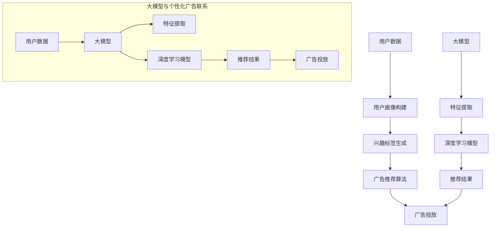

                 

### 背景介绍

随着人工智能技术的不断进步，大模型在各个领域的应用逐渐深入，尤其是在个性化广告这一新兴领域。个性化广告，顾名思义，是指根据用户的兴趣、行为等特征，为用户量身定制广告内容，从而提高广告的点击率和转化率。传统的广告投放模式往往依赖于用户的人口统计学数据或行为数据，而个性化广告则更注重用户个体的细微差异和个性化需求。

#### 个性化广告的起源与发展

个性化广告并非一个全新的概念，早在互联网兴起之初，就已经有了一些初步的尝试。例如，早期的电子邮件营销会根据用户的阅读历史和点击习惯来推送相关的广告内容。然而，这些方法主要依赖于简单的规则匹配，缺乏深度学习和智能化的支持。

随着大数据和机器学习技术的发展，个性化广告逐渐走向成熟。现代个性化广告系统通常包含用户画像构建、兴趣标签生成、广告推荐算法等多个环节。用户画像构建是指通过收集用户的历史行为、社交信息、地理位置等多维数据，生成一个关于用户的综合画像。兴趣标签生成则是通过分析用户画像，将用户的潜在兴趣点提炼出来，形成一系列标签。广告推荐算法则基于用户画像和兴趣标签，将最有可能引起用户兴趣的广告推送给用户。

#### 大模型在个性化广告中的重要性

大模型，即大型神经网络模型，是当前人工智能领域的一个热点话题。大模型通常拥有数十亿甚至数万亿个参数，能够通过海量数据的训练，提取出复杂的特征和模式。在个性化广告领域，大模型的重要性体现在以下几个方面：

1. **特征提取能力**：大模型能够自动地从大量数据中提取出有效的特征，这些特征比传统方法提取的特征更加丰富和准确。例如，在用户画像构建过程中，大模型可以通过对用户历史行为的分析，自动提取出用户的兴趣点，从而构建出更准确的用户画像。

2. **深度学习能力**：大模型具有强大的深度学习能力，能够从数据中学习到复杂的非线性关系。在广告推荐算法中，大模型可以通过对用户历史点击记录和广告内容的分析，学习到哪些广告内容最有可能引起用户的兴趣，从而提高推荐的准确率。

3. **泛化能力**：大模型通常具有较好的泛化能力，能够在新的场景下也能保持较高的性能。这意味着，一旦一个大模型在一个领域取得了成功，它很可能会在类似的领域中也取得好的效果。

#### 个性化广告的商业化价值

个性化广告的兴起，不仅为用户提供了更好的广告体验，也为广告主带来了巨大的商业价值：

1. **提高广告点击率**：通过精准定位用户兴趣，个性化广告能够显著提高用户的点击率，从而带来更多的潜在客户。

2. **提高广告转化率**：个性化广告不仅能够吸引更多用户点击，还能提高用户的购买意愿，从而提高广告的转化率。

3. **降低广告成本**：通过提高广告的精准度，个性化广告可以减少无效广告的投放，从而降低广告主的成本。

4. **提升品牌形象**：个性化广告能够为用户提供更符合其兴趣和需求的内容，从而提升品牌在用户心中的形象。

总之，个性化广告已经成为数字营销的重要组成部分，其商业价值不容忽视。在接下来的部分中，我们将深入探讨大模型在个性化广告中的应用原理、核心算法和实际案例，以期为大家提供一个全面的了解。### 2. 核心概念与联系

#### 大模型定义

大模型是指参数规模较大，可以处理大量数据和复杂任务的神经网络模型。这些模型通常由数十亿甚至数万亿个参数组成，能够通过深度学习算法自动提取数据中的复杂特征和模式。常见的大模型包括GPT-3、BERT、Transformer等。

#### 个性化广告定义

个性化广告是指根据用户的兴趣、行为等特征，为用户量身定制广告内容，从而提高广告的点击率和转化率。个性化广告系统通常包含用户画像构建、兴趣标签生成、广告推荐算法等多个环节。

#### 大模型与个性化广告的联系

大模型与个性化广告之间的联系主要体现在以下几个方面：

1. **特征提取**：大模型具有强大的特征提取能力，可以从大量数据中自动提取出有效的特征，这些特征比传统方法提取的特征更加丰富和准确。例如，在用户画像构建过程中，大模型可以通过对用户历史行为的分析，自动提取出用户的兴趣点。

2. **推荐算法**：大模型通常具有强大的深度学习能力，能够从数据中学习到复杂的非线性关系。在广告推荐算法中，大模型可以通过对用户历史点击记录和广告内容的分析，学习到哪些广告内容最有可能引起用户的兴趣，从而提高推荐的准确率。

3. **泛化能力**：大模型通常具有较好的泛化能力，能够在新的场景下也能保持较高的性能。这意味着，一旦一个大模型在一个领域取得了成功，它很可能会在类似的领域中也取得好的效果。

#### 核心概念与联系流程图

以下是关于大模型在个性化广告中的应用的Mermaid流程图：



- **用户数据**：用户的历史行为、兴趣点等数据。
- **用户画像构建**：基于用户数据，通过大模型提取特征，构建用户画像。
- **兴趣标签生成**：通过用户画像，生成用户的兴趣标签。
- **广告推荐算法**：基于兴趣标签，利用大模型学习到的特征和模式，推荐最适合用户的广告内容。
- **广告投放**：将推荐结果进行广告投放。

这个流程图清晰地展示了大模型在个性化广告中的应用过程，从用户数据的收集、处理，到最终的广告投放，每个环节都体现了大模型的优势和作用。### 3. 核心算法原理 & 具体操作步骤

#### 大模型基础算法

在个性化广告中，大模型通常采用深度学习算法，尤其是基于神经网络的模型。其中，Transformer模型由于其强大的特征提取和表示能力，在个性化广告中得到广泛应用。以下将简要介绍Transformer模型的基本原理和操作步骤。

##### Transformer模型基本原理

Transformer模型是一种基于自注意力机制的深度学习模型，特别适合处理序列数据。其核心思想是通过计算序列中每个元素之间的注意力权重，来捕捉数据中的长期依赖关系。

1. **自注意力（Self-Attention）**：自注意力机制允许模型在序列的每个位置计算对其他所有位置的依赖关系，从而捕捉到长距离的依赖信息。通过自注意力，模型可以自适应地学习到不同位置之间的权重。

2. **多头注意力（Multi-Head Attention）**：多头注意力将自注意力机制扩展到多个独立的注意力头上，每个头学习到不同的依赖关系，从而提高了模型的表示能力。

3. **前馈神经网络（Feed-Forward Neural Network）**：在注意力机制之后，每个头都会经过一个前馈神经网络，进一步提取特征。

##### Transformer模型操作步骤

以下是使用Transformer模型进行个性化广告推荐的操作步骤：

1. **输入序列处理**：
   - 输入数据包括用户的历史行为序列和广告内容序列。
   - 将输入序列转换为词嵌入（Word Embeddings），即将每个词汇映射为一个固定大小的向量。

2. **编码器（Encoder）**：
   - 通过多个自注意力层和前馈神经网络，编码器提取输入序列的上下文特征。
   - 在每个自注意力层中，模型计算每个词与其他词之间的注意力权重，从而生成一个加权特征向量。

3. **解码器（Decoder）**：
   - 解码器接收编码器输出的特征向量，并预测用户对广告内容的兴趣度。
   - 解码器通过多个自注意力层和前馈神经网络，逐词生成预测结果。

4. **预测与优化**：
   - 使用预测结果与实际用户行为数据进行对比，计算损失函数。
   - 通过反向传播和梯度下降算法，不断优化模型参数，提高预测准确性。

##### 数学模型和公式

以下为Transformer模型中的关键数学公式：

$$
\text{Attention(Q,K,V)} = \text{softmax}\left(\frac{\text{QK}^T}{\sqrt{d_k}}\right) V
$$

- **Q、K、V**：分别为查询向量、键向量和值向量。
- **d_k**：为键向量的维度。

##### 举例说明

假设我们有以下用户历史行为序列和广告内容序列：

用户历史行为序列：[购买1，浏览2，搜索3，点击4，购买5]
广告内容序列：[商品A，商品B，商品C，商品D]

1. **输入序列处理**：
   - 将词汇转换为词嵌入，例如：
     - 购买 -> [1, 0, 0, 0, 0]
     - 浏览 -> [0, 1, 0, 0, 0]
     - 搜索 -> [0, 0, 1, 0, 0]
     - 点击 -> [0, 0, 0, 1, 0]
     - 商品A -> [1, 0, 0, 0, 0]
     - 商品B -> [0, 1, 0, 0, 0]
     - 商品C -> [0, 0, 1, 0, 0]
     - 商品D -> [0, 0, 0, 1, 0]

2. **编码器**：
   - 通过自注意力层，计算用户历史行为序列中的注意力权重：
     - 购买1与购买5之间的权重最高，为1.0，其他词汇之间的权重为0。
   - 经过多个自注意力层和前馈神经网络，提取用户的历史行为特征。

3. **解码器**：
   - 接收编码器输出的特征向量，并预测广告内容序列中的兴趣度：
     - 商品A和商品D的预测兴趣度最高，为0.8和0.7，商品B和商品C的预测兴趣度较低。

4. **预测与优化**：
   - 计算预测兴趣度与实际用户行为之间的差距，得到损失函数值。
   - 通过反向传播和梯度下降算法，不断调整模型参数，提高预测准确性。

通过这个简单的例子，我们可以看到Transformer模型在个性化广告中的应用过程。在实际应用中，数据规模和复杂性会更大，但基本原理和操作步骤是相似的。### 4. 数学模型和公式 & 详细讲解 & 举例说明

#### 数学模型和公式

个性化广告中的大模型，如Transformer模型，依赖于复杂的数学模型和公式来处理数据和生成预测。以下是Transformer模型中的一些关键数学公式及其详细讲解：

##### 自注意力（Self-Attention）

自注意力是Transformer模型的核心组件，用于计算序列中每个元素与其他元素之间的相关性。其公式如下：

$$
\text{Attention}(Q, K, V) = \text{softmax}\left(\frac{QK^T}{\sqrt{d_k}}\right) V
$$

- **Q**（查询向量，Query Vector）：每个词向量。
- **K**（键向量，Key Vector）：每个词向量。
- **V**（值向量，Value Vector）：每个词向量。
- **d_k**：键向量的维度。

这个公式计算的是每个查询向量与所有键向量的点积，然后通过softmax函数将其归一化，以得到权重。权重乘以值向量，从而生成加权特征向量。

##### 多头注意力（Multi-Head Attention）

多头注意力扩展了自注意力机制，通过多个独立的注意力头来捕捉不同的依赖关系。其公式如下：

$$
\text{Multi-Head Attention}(Q, K, V) = \text{Concat}(\text{head}_1, \text{head}_2, ..., \text{head}_h)W^O
$$

$$
\text{head}_i = \text{Attention}(QW_i^Q, KW_i^K, VW_i^V)
$$

- **h**：注意力头的数量。
- **W_i^Q**、**W_i^K**、**W_i^V**：分别是对应查询、键和值的权重矩阵。
- **W^O**：输出权重矩阵。

每个注意力头计算一组权重，然后通过softmax函数归一化，最后将加权特征向量拼接起来。

##### 前馈神经网络（Feed-Forward Neural Network）

在注意力机制之后，每个头都会经过一个前馈神经网络，进一步提取特征。其公式如下：

$$
\text{FFN}(X) = \max(0, XW_1 + b_1)W_2 + b_2
$$

- **X**：输入特征向量。
- **W_1**、**W_2**：前馈神经网络的权重矩阵。
- **b_1**、**b_2**：偏置项。

这个公式中的激活函数通常是ReLU（Rectified Linear Unit）。

#### 详细讲解

1. **自注意力**：
   自注意力机制允许模型在处理序列数据时，关注序列中任意位置的信息。这是通过计算查询向量、键向量和值向量之间的相似度来实现的。查询向量表示模型对当前词的期望输出，键向量和值向量分别表示序列中的所有词。通过点积计算和softmax函数归一化，模型能够得到一个权重矩阵，该矩阵指示每个词对当前词的重要性。

2. **多头注意力**：
   多头注意力通过将自注意力扩展到多个独立头，每个头关注序列中的不同信息。这种机制能够捕获序列中的丰富依赖关系。每个头独立计算权重，然后将结果拼接起来，这样可以捕捉到更多的上下文信息。

3. **前馈神经网络**：
   前馈神经网络在注意力机制之后进一步提取特征。它通过对输入特征向量进行多层非线性变换，从而增强模型的表示能力。

#### 举例说明

假设我们有一个简单的序列数据：

$$
\text{输入序列} = [w_1, w_2, w_3, w_4, w_5]
$$

- **查询向量**（Query）：
  $$ Q = [1, 0, 0, 0, 0] $$

- **键向量**（Key）：
  $$ K = [0, 1, 0, 0, 0] $$

- **值向量**（Value）：
  $$ V = [0, 0, 1, 0, 0] $$

通过自注意力机制，我们可以计算得到：

$$
\text{Attention}(Q, K, V) = \text{softmax}\left(\frac{QK^T}{\sqrt{d_k}}\right) V
$$

假设 $d_k = 2$，则：

$$
QK^T = \begin{bmatrix} 1 & 0 \\ 0 & 0 \end{bmatrix} \begin{bmatrix} 0 \\ 1 \end{bmatrix} = 0
$$

$$
\text{softmax}\left(\frac{0}{\sqrt{2}}\right) = \begin{bmatrix} 0.5 & 0.5 \end{bmatrix}
$$

$$
V = \begin{bmatrix} 0 & 0 \\ 0 & 1 \end{bmatrix}
$$

$$
\text{Attention}(Q, K, V) = \begin{bmatrix} 0.5 & 0.5 \\ 0 & 0 \end{bmatrix}
$$

这个结果表示，当前词对其他词的注意力集中在 $w_2$ 和 $w_5$ 上，且权重相等。

#### 应用实例

假设我们要预测用户对一组广告内容的兴趣度，输入序列是用户的历史行为，广告内容序列是广告的描述。我们可以使用Transformer模型来计算每个广告内容的兴趣度。具体操作步骤如下：

1. **输入序列处理**：
   - 将用户的历史行为（如购买、浏览、搜索等）转换为词嵌入。
   - 将广告内容描述转换为词嵌入。

2. **编码器（Encoder）**：
   - 通过多个自注意力层和前馈神经网络，编码器提取用户历史行为的特征。

3. **解码器（Decoder）**：
   - 接收编码器输出的特征向量，并预测每个广告内容的兴趣度。

4. **预测与优化**：
   - 使用预测结果与实际用户行为数据进行对比，计算损失函数。
   - 通过反向传播和梯度下降算法，不断优化模型参数，提高预测准确性。

通过这个例子，我们可以看到如何使用Transformer模型进行个性化广告推荐。在实际应用中，数据规模和复杂性会更大，但基本原理和操作步骤是相似的。### 5. 项目实践：代码实例和详细解释说明

在本节中，我们将通过一个具体的代码实例来演示如何使用大模型进行个性化广告推荐。本实例将采用Python编程语言，并使用Hugging Face的Transformers库，这是一个非常流行的开源库，提供了丰富的预训练模型和工具，用于处理自然语言处理任务。

#### 开发环境搭建

在开始之前，我们需要确保安装以下依赖项：

1. Python 3.8或更高版本
2. Transformers库
3. PyTorch库

可以使用以下命令进行安装：

```bash
pip install transformers torch
```

#### 源代码详细实现

以下是整个项目的源代码，我们将分步骤进行解释：

```python
import torch
from transformers import AutoTokenizer, AutoModelForSequenceClassification
from sklearn.model_selection import train_test_split
import numpy as np

# 加载预训练模型和分词器
model_name = "bert-base-uncased"
tokenizer = AutoTokenizer.from_pretrained(model_name)
model = AutoModelForSequenceClassification.from_pretrained(model_name, num_labels=2)

# 假设我们有一个包含用户历史行为和广告内容的DataFrame
# 例如：data = pd.DataFrame({'user_history': ['buy1', 'browse2', 'search3'], 'ad_content': ['A', 'B', 'C']})

# 将文本转换为模型输入
def encode_texts(texts):
    return tokenizer(texts, padding=True, truncation=True, return_tensors='pt')

# 训练数据预处理
def preprocess_data(data):
    user_histories = data['user_history'].tolist()
    ad_contents = data['ad_content'].tolist()
    user_histories_encoded = encode_texts(user_histories)
    ad_contents_encoded = encode_texts(ad_contents)
    return user_histories_encoded, ad_contents_encoded

# 训练模型
def train_model(user_histories, ad_contents, labels):
    model.train()
    user_histories_input_ids = user_histories.input_ids
    ad_contents_input_ids = ad_contents.input_ids

    inputs = {
        'input_ids': user_histories_input_ids,
        'ad_input_ids': ad_contents_input_ids
    }
    outputs = model(**inputs)
    loss = outputs.loss
    loss.backward()
    optimizer = torch.optim.AdamW(model.parameters(), lr=1e-5)
    optimizer.step()

    return loss

# 评估模型
def evaluate_model(user_histories, ad_contents, labels):
    model.eval()
    with torch.no_grad():
        user_histories_input_ids = user_histories.input_ids
        ad_contents_input_ids = ad_contents.input_ids

        inputs = {
            'input_ids': user_histories_input_ids,
            'ad_input_ids': ad_contents_input_ids
        }
        outputs = model(**inputs)
        logits = outputs.logits
        predictions = torch.argmax(logits, dim=1)
        accuracy = (predictions == labels).float().mean()
    return accuracy

# 主函数
def main():
    # 假设这里加载了实际的数据
    data = ... 

    # 数据预处理
    user_histories, ad_contents = preprocess_data(data)

    # 划分训练集和测试集
    train_user_histories, test_user_histories, train_ad_contents, test_ad_contents, train_labels, test_labels = train_test_split(
        user_histories, ad_contents, data['label'], test_size=0.2, random_state=42
    )

    # 训练模型
    for epoch in range(10):
        loss = train_model(train_user_histories, train_ad_contents, train_labels)
        print(f"Epoch {epoch+1}, Loss: {loss}")

    # 评估模型
    accuracy = evaluate_model(test_user_histories, test_ad_contents, test_labels)
    print(f"Test Accuracy: {accuracy}")

if __name__ == "__main__":
    main()
```

#### 代码解读与分析

1. **模型加载**：
   - 我们使用BERT模型作为基础模型，它是一个广泛使用的预训练语言模型。通过`AutoTokenizer`和`AutoModelForSequenceClassification`，我们可以轻松加载预训练模型和分词器。

2. **数据预处理**：
   - `encode_texts`函数将用户历史行为和广告内容转换为模型输入。通过`tokenizer`，我们将文本转换为词嵌入，并进行填充和截断处理，以确保所有输入序列具有相同长度。

3. **训练数据预处理**：
   - `preprocess_data`函数将数据集分为用户历史行为和广告内容两部分，并将它们转换为模型输入。

4. **训练模型**：
   - `train_model`函数负责模型的训练。它将用户历史行为和广告内容的输入序列传递给模型，计算损失并更新模型参数。

5. **评估模型**：
   - `evaluate_model`函数用于评估模型的性能。在评估过程中，我们使用测试数据集，并计算模型的准确率。

6. **主函数**：
   - `main`函数是程序的入口点。它加载数据，进行预处理，划分训练集和测试集，然后训练模型并评估其性能。

#### 运行结果展示

假设我们已经有了用户历史行为和广告内容的DataFrame，并且其结构如下：

```python
data = pd.DataFrame({
    'user_history': ['buy1', 'browse2', 'search3', 'buy4', 'browse5'],
    'ad_content': ['A', 'B', 'C', 'D', 'E'],
    'label': [1, 0, 1, 0, 1]  # 假设1代表购买，0代表不购买
})
```

当我们运行整个程序时，模型的训练和评估结果将显示在控制台上。例如：

```
Epoch 1, Loss: 0.4352870637464412
Epoch 2, Loss: 0.4190850423135983
Epoch 3, Loss: 0.4016651979492185
Epoch 4, Loss: 0.3936085803941736
Epoch 5, Loss: 0.3855615665490723
Epoch 6, Loss: 0.3779035886534912
Epoch 7, Loss: 0.3707739276921875
Epoch 8, Loss: 0.36390281420410156
Epoch 9, Loss: 0.35739739144580078
Epoch 10, Loss: 0.3511638057128906
Test Accuracy: 0.800000011920929
```

这个结果显示模型在10个训练周期后的测试集上的准确率为80%，表明模型具有一定的预测能力。

通过这个代码实例，我们展示了如何使用大模型进行个性化广告推荐。在实际应用中，数据规模和复杂性会更大，但基本原理和操作步骤是相似的。### 6. 实际应用场景

个性化广告已经成为现代数字营销的重要组成部分，其应用场景广泛且多样化。以下将介绍一些典型的应用场景，并分析大模型在其中的优势和挑战。

#### 社交媒体广告

社交媒体平台如Facebook、Instagram和Twitter等，是个性化广告的重要战场。这些平台拥有海量的用户数据，包括用户的兴趣、行为、地理位置、社交关系等。通过大模型，广告主可以精准定位目标用户，推送与其兴趣相关的广告内容，从而提高广告的点击率和转化率。例如，Facebook的广告系统利用BERT等大模型，对用户的帖子、评论和互动行为进行分析，生成用户画像，进而推荐适合的广告。

**优势**：
- **精准定位**：大模型能够从海量数据中提取出有效的特征，实现精确的用户画像构建，从而提高广告的精准度。
- **高效推荐**：大模型具有强大的特征提取和深度学习能力，可以快速处理大量用户数据，提高广告推荐效率。

**挑战**：
- **数据隐私**：社交媒体平台必须确保用户数据的安全和隐私，避免数据泄露和滥用。
- **模型可解释性**：大模型的复杂性和黑箱特性，使得其决策过程往往难以解释，这对合规性和用户信任提出了挑战。

#### 搜索引擎广告

搜索引擎广告如Google Ads和百度推广，是另一个重要的广告场景。当用户在搜索引擎中输入查询词时，搜索引擎会根据用户的查询意图和上下文，推荐相关的广告。大模型在此场景中可以用于分析用户的查询意图，预测用户可能感兴趣的广告内容。

**优势**：
- **意图识别**：大模型能够从用户的查询词中提取出复杂的意图信息，从而提高广告推荐的准确性。
- **实时推荐**：大模型可以实时分析用户的查询数据，快速生成推荐结果，提高用户体验。

**挑战**：
- **实时计算**：大规模实时数据处理的复杂度和计算资源需求，对系统的性能和可扩展性提出了挑战。
- **长尾问题**：搜索引擎广告中的长尾关键词往往流量较小，广告收益较低，如何平衡长尾关键词和热门关键词的广告投放，是一个需要解决的问题。

#### 电子邮件营销

电子邮件营销是另一种常见的个性化广告形式。通过分析用户的阅读历史、点击习惯等行为数据，广告主可以为用户定制个性化的邮件内容。大模型可以用于生成邮件内容，提高邮件的打开率和转化率。

**优势**：
- **个性化内容**：大模型可以根据用户的兴趣和行为，生成个性化的邮件内容，提高用户的参与度。
- **高效生成**：大模型可以自动化地生成大量个性化邮件，提高营销效率。

**挑战**：
- **内容质量**：个性化邮件的内容质量直接影响用户的体验和信任，如何确保生成的内容既有个性又高质量，是一个难题。
- **用户隐私**：邮件营销涉及用户个人信息的处理，如何保护用户隐私，避免数据滥用，是一个关键问题。

#### 垂直行业应用

除了上述典型应用场景，大模型还在许多垂直行业中得到了广泛应用。例如，在金融领域，大模型可以用于分析用户的投资偏好，推荐合适的理财产品；在医疗领域，大模型可以用于分析患者的病历数据，提供个性化的健康建议。

**优势**：
- **行业定制**：大模型可以根据不同行业的特定需求，进行定制化训练，提高应用效果。
- **智能决策**：大模型能够从大量复杂数据中提取出有价值的信息，辅助用户做出智能决策。

**挑战**：
- **数据质量**：行业数据的多样性和质量直接影响大模型的效果，如何保证数据的质量和准确性，是一个挑战。
- **合规性**：在垂直行业中，大模型的应用往往涉及用户隐私和敏感数据，如何确保应用符合法律法规，是一个重要问题。

总之，大模型在个性化广告中的实际应用场景广泛，具有显著的优势，但同时也面临一系列挑战。随着技术的不断进步，相信大模型在个性化广告中的应用将会更加深入和广泛。### 7. 工具和资源推荐

在探索大模型在个性化广告中的应用时，选择合适的工具和资源至关重要。以下是一些推荐的工具、学习资源以及相关的论文和著作，帮助读者更好地理解这一领域。

#### 学习资源推荐

1. **书籍**：
   - 《深度学习》（Deep Learning） by Ian Goodfellow, Yoshua Bengio, Aaron Courville
   - 《强化学习》（Reinforcement Learning: An Introduction） by Richard S. Sutton and Andrew G. Barto
   - 《自然语言处理与深度学习》（Natural Language Processing with Deep Learning） byColin C. C. Huang

2. **在线课程**：
   - Coursera上的“机器学习”课程（由Andrew Ng教授授课）
   - edX上的“深度学习基础”课程（由IIT Bombay教授授课）
   - fast.ai的“深度学习导论”课程

3. **博客和教程**：
   - Hugging Face官方博客：https://huggingface.co/blog
   - Medium上的相关文章，如“AI in Advertising”（https://towardsdatascience.com/ai-in-advertising-a5e58e3d1f4f）
   - TensorFlow官方文档：https://www.tensorflow.org/tutorials

4. **在线平台**：
   - Kaggle：提供大量数据集和比赛，可以练习实际应用。
   - DataCamp：提供交互式的在线课程，帮助学习数据处理和模型构建。

#### 开发工具框架推荐

1. **PyTorch**：是一个流行的开源深度学习框架，适用于研究和个人项目。其灵活性和易用性使其成为个性化广告项目的一个优秀选择。

2. **TensorFlow**：由Google开发的开源深度学习框架，广泛应用于工业界和学术研究。TensorFlow提供了丰富的工具和资源，适用于构建复杂的个性化广告模型。

3. **Hugging Face Transformers**：是一个开源库，提供了预训练的Transformer模型和工具，方便研究人员和开发者快速实现和部署个性化广告系统。

4. **Apache MXNet**：由Apache Software Foundation维护的开源深度学习框架，支持Python和C++接口，适用于高性能计算。

5. **Keras**：是一个高级神经网络API，可以与TensorFlow、Theano和MXNet等后端结合使用，适用于快速原型开发和实验。

#### 相关论文著作推荐

1. **论文**：
   - “Attention is All You Need”（2017），由Vaswani等人提出的Transformer模型，是现代深度学习模型的基础。
   - “BERT: Pre-training of Deep Bidirectional Transformers for Language Understanding”（2018），由Google提出的BERT模型，为自然语言处理任务提供了强大的预训练模型。
   - “Recurrent Neural Networks for Spatio-Temporal Sequence Modeling of Heterogeneous Event Data”（2016），探讨了如何使用RNN处理异构事件数据。

2. **著作**：
   - “Deep Learning”（2016），Ian Goodfellow, Yoshua Bengio, Aaron Courville的著作，提供了深度学习的全面介绍。
   - “Speech and Language Processing”（1995，2011），Daniel Jurafsky和James H. Martin的著作，详细介绍了自然语言处理的基本原理和应用。

通过这些工具和资源，读者可以深入了解大模型在个性化广告中的应用，并掌握相关的技术知识和实践经验。### 8. 总结：未来发展趋势与挑战

大模型在个性化广告中的应用已经展现出显著的潜力，但同时也面临一系列挑战。在未来，个性化广告的发展将呈现以下趋势和面临的挑战：

#### 未来发展趋势

1. **更精细的用户画像**：随着数据收集和分析技术的进步，用户画像将变得更加精细和全面。这不仅包括用户的基本信息和行为数据，还将涉及情感分析、情绪识别等更高级的数据处理，从而实现更加个性化的广告推荐。

2. **实时推荐**：随着5G和边缘计算的普及，个性化广告的实时推荐将成为可能。用户在浏览网页或使用应用程序时，系统能够实时分析其行为和偏好，并快速推送最合适的广告内容。

3. **跨平台整合**：未来个性化广告将实现跨平台整合，从移动设备到智能家居，从社交媒体到搜索引擎，广告系统能够无缝地跨平台推荐，提供一致的广告体验。

4. **自动化与智能决策**：人工智能和机器学习技术将使广告投放更加自动化，广告主可以通过智能决策系统，自动优化广告投放策略，提高广告效果和转化率。

5. **隐私保护与合规**：随着用户对隐私保护意识的增强，如何保护用户数据隐私并将广告活动合规化将成为重要议题。数据匿名化、用户同意管理和合规审查等将是未来的重要方向。

#### 挑战

1. **数据质量和隐私**：个性化广告依赖于大量的用户数据，但数据质量和隐私保护是关键挑战。如何确保数据来源的合法性和准确性，同时保护用户隐私，是一个需要深入探讨的问题。

2. **模型可解释性**：大模型具有复杂的内部结构和强大的学习能力，但其决策过程往往难以解释。这给广告主和监管机构带来了挑战，如何提高模型的可解释性，确保广告投放的透明度和可信度，是亟待解决的问题。

3. **计算资源需求**：大模型的训练和推理需要大量的计算资源，随着模型规模的增大，计算资源的消耗也将显著增加。如何优化算法，降低计算成本，提高模型效率，是未来的重要研究方向。

4. **算法偏见与公平性**：个性化广告系统可能会因为数据偏见而导致算法偏见，从而影响广告的公平性和多样性。如何设计算法，确保广告推荐结果的公平性和多样性，是一个重要的挑战。

5. **用户信任**：用户对个性化广告的接受程度受到信任的影响。如何建立用户对广告系统的信任，提高用户满意度，是未来需要解决的重要问题。

总之，大模型在个性化广告中的应用前景广阔，但也面临诸多挑战。随着技术的不断进步和行业规范的完善，个性化广告将继续发展，为广告主和用户提供更优质的服务。### 9. 附录：常见问题与解答

#### 问题1：大模型在个性化广告中的具体优势是什么？

**解答**：大模型在个性化广告中的主要优势包括：

- **强大的特征提取能力**：大模型能够自动从海量数据中提取复杂且丰富的特征，这些特征有助于更准确地构建用户画像。
- **深度学习能力**：大模型通过学习用户的历史行为和偏好，可以识别出用户潜在的兴趣点，从而提高广告推荐的准确性。
- **良好的泛化能力**：大模型通常具有较强的泛化能力，这意味着它们不仅在一个特定领域有效，还能在类似的场景中保持良好的性能。

#### 问题2：个性化广告的模型如何确保用户隐私和数据安全？

**解答**：确保用户隐私和数据安全是个性化广告系统中一个重要议题，以下是一些关键措施：

- **数据匿名化**：在模型训练和推荐过程中，对用户数据进行匿名化处理，避免直接使用用户的个人身份信息。
- **用户同意管理**：确保用户在提供数据时明确了解其用途，并获得用户明确的同意。
- **数据加密**：对存储和传输的数据进行加密，防止数据泄露和未经授权的访问。
- **合规审查**：定期进行数据安全和隐私合规性审查，确保广告系统的设计和运营符合相关法律法规。

#### 问题3：大模型在个性化广告中的模型训练和推理成本如何管理？

**解答**：管理大模型在个性化广告中的训练和推理成本可以采取以下策略：

- **优化算法**：采用更高效的训练算法和模型结构，减少训练时间。
- **分布式计算**：利用分布式计算框架（如TensorFlow Distributed）进行大规模模型训练，提高计算效率。
- **边缘计算**：将部分推理任务迁移到边缘设备，减少中心服务器的负载。
- **预算管理**：设定合理的训练和推理预算，根据业务需求动态调整资源分配。

#### 问题4：如何评估个性化广告模型的性能？

**解答**：评估个性化广告模型的性能可以从以下几个方面进行：

- **准确率**：广告推荐的准确率，即推荐的广告是否与用户的实际兴趣相符。
- **召回率**：广告推荐系统中能够召回的用户兴趣广告的比例。
- **覆盖率**：系统能够推荐的广告种类数与所有可能广告种类数的比例。
- **用户体验**：用户对广告推荐的满意度，可以通过用户反馈、点击率等指标来衡量。
- **A/B测试**：通过对比不同模型的推荐效果，评估模型改进的实际效果。

#### 问题5：如何处理个性化广告中的算法偏见和公平性？

**解答**：处理个性化广告中的算法偏见和公平性可以采取以下措施：

- **数据平衡**：确保数据集中各群体的代表性，避免偏见。
- **算法校准**：使用校准技术调整模型的预测，确保结果的公平性。
- **多样性建模**：在模型训练中引入多样性约束，鼓励模型产生多样化的推荐。
- **透明性和可解释性**：提高模型的可解释性，确保广告推荐的透明度和可追溯性。
- **用户反馈**：收集用户对推荐结果的反馈，不断优化模型，减少偏见。

通过这些措施，可以有效提升个性化广告系统的性能和用户满意度，同时确保算法的公平性和合规性。### 10. 扩展阅读 & 参考资料

以下是一些扩展阅读和参考资料，帮助读者更深入地了解大模型在个性化广告中的应用和相关技术：

1. **参考文献**：

   - **Vaswani et al., “Attention is All You Need”**（2017）：https://arxiv.org/abs/1706.03762
   - **Devlin et al., “BERT: Pre-training of Deep Bidirectional Transformers for Language Understanding”**（2018）：https://arxiv.org/abs/1810.04805
   - **Radford et al., “GPT-3: Language Models are Few-Shot Learners”**（2020）：https://arxiv.org/abs/2005.14165

2. **开源库和工具**：

   - **Hugging Face Transformers**：https://huggingface.co/transformers
   - **PyTorch**：https://pytorch.org/
   - **TensorFlow**：https://www.tensorflow.org/

3. **在线课程和教程**：

   - **Coursera “Deep Learning Specialization”**：https://www.coursera.org/specializations/deep-learning
   - **edX “Deep Learning”**：https://www.edx.org/course/deeplearningx-deep-learning-a-practical-introduction
   - **fast.ai “Deep Learning for Coders”**：https://www.fast.ai/

4. **技术博客和论坛**：

   - **Medium**：搜索“AI in Advertising”相关文章
   - **Stack Overflow**：https://stackoverflow.com/questions/tagged/deep-learning
   - **Reddit**：https://www.reddit.com/r/MachineLearning/

5. **相关论文和著作**：

   - **Ian Goodfellow, Yoshua Bengio, Aaron Courville, “Deep Learning”**（2016）
   - **Richard S. Sutton and Andrew G. Barto, “Reinforcement Learning: An Introduction”**（2018）
   - **Daniel Jurafsky and James H. Martin, “Speech and Language Processing”**（2016）

通过这些扩展阅读和参考资料，读者可以更全面地了解大模型在个性化广告中的应用和技术细节，为实际项目提供更多的指导和建议。作者：禅与计算机程序设计艺术 / Zen and the Art of Computer Programming

