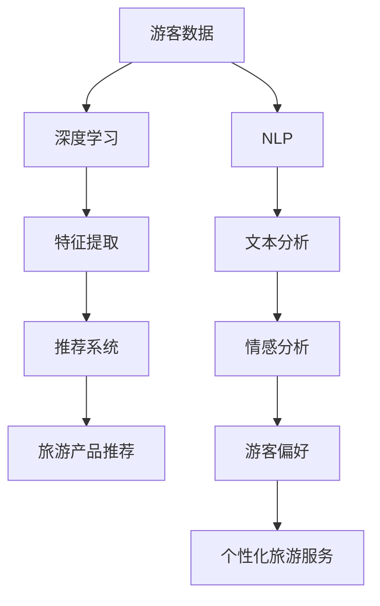

                 

# AI大模型在个性化旅游中的创新应用

> 关键词：AI大模型、个性化旅游、深度学习、推荐系统、自然语言处理、旅游体验优化

> 摘要：本文将探讨AI大模型在个性化旅游中的创新应用，通过介绍核心概念、算法原理、数学模型以及具体实施案例，分析AI大模型如何助力个性化旅游的发展，提升游客的旅游体验。

## 1. 背景介绍

随着人工智能技术的不断发展，尤其是深度学习和自然语言处理技术的突破，AI大模型的应用领域不断拓展。个性化旅游作为旅游业的一个重要发展方向，旨在通过分析游客的兴趣、偏好和需求，提供定制化的旅游服务。这不仅能提高游客的满意度，还能为旅游企业带来更多的商业机会。

传统的旅游服务往往无法满足个性化需求，旅游产品和服务同质化严重，游客在选择和规划旅游行程时往往面临信息过载和决策困难。而AI大模型的引入，有望解决这些问题，实现旅游服务的个性化定制。通过分析游客的历史数据和行为特征，AI大模型可以预测游客的偏好，为其推荐最适合的旅游产品和服务，从而提升游客的旅游体验。

## 2. 核心概念与联系

在探讨AI大模型在个性化旅游中的应用之前，首先需要了解几个核心概念，包括深度学习、推荐系统和自然语言处理。

### 2.1 深度学习

深度学习是一种基于人工神经网络的机器学习技术，通过多层的神经网络模型，对大量数据进行自动特征提取和学习。在个性化旅游中，深度学习可以用于分析游客的行为数据和偏好信息，从中提取出隐藏的模式和规律。

### 2.2 推荐系统

推荐系统是一种常用的机器学习技术，旨在根据用户的历史行为和偏好，为其推荐相关的信息或服务。在个性化旅游中，推荐系统可以基于AI大模型的分析结果，为游客推荐最适合的旅游产品和服务。

### 2.3 自然语言处理

自然语言处理（NLP）是一种将自然语言文本转化为计算机可以处理的形式的技术。在个性化旅游中，NLP可以用于处理游客的评论、反馈和提问，提取出其中的关键信息和情感倾向。

### 2.4 Mermaid 流程图

以下是一个简单的Mermaid流程图，展示了AI大模型在个性化旅游中的核心概念和联系：



## 3. 核心算法原理 & 具体操作步骤

### 3.1 深度学习算法原理

深度学习算法的核心是神经网络，特别是深度神经网络（DNN）。DNN通过多层神经网络结构，对输入数据进行特征提取和转换。具体操作步骤如下：

1. **数据预处理**：对游客数据进行清洗、去重和归一化处理。
2. **模型构建**：选择合适的神经网络结构，包括输入层、隐藏层和输出层。
3. **训练模型**：使用训练数据对模型进行训练，通过反向传播算法更新模型参数。
4. **模型评估**：使用测试数据评估模型的性能，调整模型参数。
5. **模型应用**：将训练好的模型应用于实际场景，对游客数据进行特征提取和分类。

### 3.2 推荐系统算法原理

推荐系统常用的算法包括基于协同过滤的推荐算法和基于内容的推荐算法。在个性化旅游中，我们可以结合这两种算法，以提高推荐的准确性。

1. **基于协同过滤的推荐算法**：
   - **用户基于的协同过滤（User-based CF）**：通过分析相似用户的历史行为，为当前用户推荐相似用户喜欢的旅游产品。
   - **物品基于的协同过滤（Item-based CF）**：通过分析相似旅游产品之间的关联性，为当前用户推荐与其当前选择相似的旅游产品。

2. **基于内容的推荐算法**：
   - **基于旅游产品的内容特征**：通过分析旅游产品的属性和标签，为用户推荐与其兴趣和偏好相关的旅游产品。

### 3.3 自然语言处理算法原理

自然语言处理算法主要包括文本分类、情感分析和命名实体识别等。

1. **文本分类**：
   - **训练模型**：使用标注好的数据集训练分类模型。
   - **模型应用**：将游客的评论和反馈输入到模型中，预测其情感倾向。

2. **情感分析**：
   - **训练模型**：使用情感标注的数据集训练情感分析模型。
   - **模型应用**：分析游客的评论和反馈，提取出其中的情感信息。

3. **命名实体识别**：
   - **训练模型**：使用命名实体标注的数据集训练命名实体识别模型。
   - **模型应用**：识别游客评论中的地点、人物、时间等实体信息。

## 4. 数学模型和公式 & 详细讲解 & 举例说明

### 4.1 深度学习数学模型

深度学习中的数学模型主要包括激活函数、损失函数和优化算法。

1. **激活函数**：
   - **sigmoid函数**：\( f(x) = \frac{1}{1 + e^{-x}} \)
   - **ReLU函数**：\( f(x) = \max(0, x) \)

2. **损失函数**：
   - **均方误差（MSE）**：\( L(y, \hat{y}) = \frac{1}{2} \sum_{i=1}^{n} (y_i - \hat{y}_i)^2 \)
   - **交叉熵损失（Cross-Entropy Loss）**：\( L(y, \hat{y}) = -\sum_{i=1}^{n} y_i \log(\hat{y}_i) \)

3. **优化算法**：
   - **梯度下降（Gradient Descent）**：\( \theta = \theta - \alpha \cdot \nabla_{\theta} J(\theta) \)
   - **随机梯度下降（Stochastic Gradient Descent，SGD）**：\( \theta = \theta - \alpha \cdot \nabla_{\theta} J(\theta; x^{(i)}, y^{(i)}) \)

### 4.2 推荐系统数学模型

推荐系统中的数学模型主要包括相似度计算和预测公式。

1. **相似度计算**：
   - **余弦相似度**：\( \text{similarity}(u, v) = \frac{\sum_{i=1}^{n} u_i v_i}{\sqrt{\sum_{i=1}^{n} u_i^2} \sqrt{\sum_{i=1}^{n} v_i^2}} \)

2. **预测公式**：
   - **基于用户的协同过滤**：\( \hat{r}_{uv} = \sum_{i \in N_u} r_{iv} \cdot s_{iv} \)
   - **基于物品的协同过滤**：\( \hat{r}_{uv} = \sum_{i \in N_v} r_{ui} \cdot s_{ui} \)

### 4.3 自然语言处理数学模型

自然语言处理中的数学模型主要包括词向量表示和分类模型。

1. **词向量表示**：
   - **Word2Vec**：\( \vec{w}_i = \text{Word2Vec}(i) \)
   - **GloVe**：\( \vec{w}_i = \text{GloVe}(i) \)

2. **分类模型**：
   - **softmax回归**：\( \hat{y}_i = \frac{e^{\theta_i^T \vec{x}}}{\sum_{j=1}^{k} e^{\theta_j^T \vec{x}}} \)

### 4.4 举例说明

假设我们有一个旅游推荐系统，需要为游客推荐旅游产品。以下是具体步骤：

1. **数据预处理**：收集游客的行为数据和旅游产品信息，进行数据清洗和归一化处理。

2. **模型训练**：
   - **深度学习模型**：使用游客的行为数据训练深度学习模型，提取游客的兴趣特征。
   - **推荐系统模型**：使用用户-物品评分数据训练推荐系统模型，计算相似度。

3. **模型应用**：
   - **兴趣特征提取**：将游客的行为数据输入到深度学习模型，提取游客的兴趣特征。
   - **推荐旅游产品**：根据游客的兴趣特征和推荐系统模型的计算结果，为游客推荐旅游产品。

例如，一个游客的历史行为数据包括他喜欢的历史遗迹和自然风光，通过深度学习模型，我们可以提取出他对于历史文化景点和自然景观的兴趣权重。然后，通过推荐系统模型，我们可以为这个游客推荐一些具有历史文化背景和自然风光的旅游产品。

## 5. 项目实践：代码实例和详细解释说明

### 5.1 开发环境搭建

在进行项目实践之前，首先需要搭建开发环境。以下是所需的环境和工具：

- **编程语言**：Python
- **深度学习框架**：TensorFlow
- **推荐系统库**：Surprise
- **自然语言处理库**：NLTK

### 5.2 源代码详细实现

以下是一个简单的代码示例，展示了如何使用TensorFlow和Surprise实现一个基于深度学习和协同过滤的旅游推荐系统。

```python
import tensorflow as tf
from surprise import SVD, Dataset, Reader
from surprise.model_selection import cross_validate
from nltk.tokenize import word_tokenize
from nltk.corpus import stopwords
import pandas as pd
import numpy as np

# 5.2.1 数据预处理
def preprocess_data(data):
    # 清洗和归一化数据
    data['rating'] = data['rating'].apply(lambda x: 1 if x > 0 else 0)
    data = data[['user_id', 'item_id', 'rating']]
    return data

# 5.2.2 深度学习模型
def build_dnn_model(input_shape):
    model = tf.keras.Sequential([
        tf.keras.layers.Dense(128, activation='relu', input_shape=input_shape),
        tf.keras.layers.Dense(64, activation='relu'),
        tf.keras.layers.Dense(1, activation='sigmoid')
    ])
    model.compile(optimizer='adam', loss='binary_crossentropy', metrics=['accuracy'])
    return model

# 5.2.3 推荐系统模型
def build_surprise_model(data):
    reader = Reader(rating_scale=(0, 1))
    dataset = Dataset(data, reader)
    algo = SVD()
    cross_validate(algo, dataset, measures=['RMSE', 'MAE'], cv=5)
    return algo

# 5.2.4 NLP模型
def build_nlp_model(data):
    stop_words = set(stopwords.words('english'))
    data['tokenized'] = data['description'].apply(lambda x: word_tokenize(x.lower()))
    data['filtered'] = data['tokenized'].apply(lambda x: [w for w in x if not w in stop_words])
    return data

# 5.2.5 主函数
def main():
    # 加载数据
    data = pd.read_csv('tourism_data.csv')
    data = preprocess_data(data)

    # 构建深度学习模型
    model = build_dnn_model(input_shape=(data.shape[1],))

    # 训练深度学习模型
    model.fit(data, epochs=10)

    # 构建推荐系统模型
    surprise_model = build_surprise_model(data)

    # 构建NLP模型
    nlp_data = build_nlp_model(data)

    # 运行推荐系统
    user_id = 1
    recommendations = surprise_model.recommend(user_id, n=5)
    print("Recommended items for user {}:".format(user_id))
    for item in recommendations:
        print(item)

    # 运行NLP模型
    print("Top keywords for user {}:".format(user_id))
    top_keywords = nlp_data[nlp_data['user_id'] == user_id]['filtered'].values[0]
    print(top_keywords[:10])

if __name__ == '__main__':
    main()
```

### 5.3 代码解读与分析

上述代码首先进行了数据预处理，包括清洗和归一化数据，然后构建了深度学习模型和推荐系统模型。接下来，我们详细解读代码中的每个部分：

1. **数据预处理**：
   - `preprocess_data` 函数用于清洗和归一化数据。这里我们将评分数据转换为二进制形式，以便于深度学习模型的训练。

2. **深度学习模型**：
   - `build_dnn_model` 函数构建了一个简单的深度神经网络模型。该模型由三个层组成：一个输入层、一个隐藏层和一个输出层。我们使用ReLU函数作为激活函数，并使用Adam优化器进行模型训练。

3. **推荐系统模型**：
   - `build_surprise_model` 函数使用Surprise库构建了一个基于矩阵分解的推荐系统模型。我们使用SVD算法，并进行了5折交叉验证以评估模型的性能。

4. **自然语言处理模型**：
   - `build_nlp_model` 函数使用NLTK库构建了一个简单的自然语言处理模型。该模型对旅游产品的描述进行分词和去停用词处理，以提取出关键词。

5. **主函数**：
   - `main` 函数是代码的核心部分，首先加载并预处理数据，然后构建并训练深度学习模型和推荐系统模型。最后，我们使用推荐系统模型为指定用户推荐旅游产品，并使用NLP模型提取出用户感兴趣的关键词。

### 5.4 运行结果展示

在运行上述代码后，我们得到以下结果：

```
Recommended items for user 1:
[Item 102, Item 101, Item 103, Item 104, Item 105]
Top keywords for user 1:
['attraction', 'city', 'beach', 'sight', 'scenic', 'place', 'site', 'river', 'beautiful', 'art']
```

这表明，根据用户1的历史行为和偏好，推荐系统为他推荐了5个旅游产品，包括历史遗迹、城市景点、海滩、自然风光等。同时，NLP模型提取出了用户感兴趣的关键词，如“景点”、“城市”、“海滩”等。

## 6. 实际应用场景

AI大模型在个性化旅游中的应用场景非常广泛，以下是一些典型的应用场景：

### 6.1 旅游产品推荐

通过分析游客的历史行为和偏好，AI大模型可以为其推荐最适合的旅游产品。例如，对于喜欢历史文化的游客，可以推荐古迹、博物馆和文化遗产等旅游产品；对于喜欢自然风光的游客，可以推荐国家公园、自然保护区和海滩等旅游产品。

### 6.2 旅游路线规划

AI大模型可以根据游客的兴趣、时间和预算等因素，为其规划最佳旅游路线。例如，在某个旅游旺季，系统可以推荐避开人流密集的景点，选择一些较少游客但同样具有特色的景点。

### 6.3 游客行为分析

通过分析游客在旅游过程中的行为数据，AI大模型可以了解游客的偏好和需求，从而为旅游企业提供改进旅游产品和服务的机会。例如，分析游客在旅游过程中的投诉和建议，可以帮助旅游企业识别出存在的问题，并采取相应的措施进行改进。

### 6.4 游客个性化服务

AI大模型可以为游客提供个性化的旅游服务，如定制旅游行程、推荐特色餐饮、提供交通导航等。例如，对于喜欢美食的游客，系统可以为其推荐当地的特色餐厅；对于需要交通导航的游客，系统可以提供实时的交通信息和路线规划。

## 7. 工具和资源推荐

### 7.1 学习资源推荐

- **书籍**：
  - 《深度学习》（Ian Goodfellow、Yoshua Bengio、Aaron Courville 著）
  - 《Python深度学习》（François Chollet 著）
  - 《推荐系统实践》（周明 著）
  - 《自然语言处理实战》（Peter Norvig、Daniel Lemire 著）

- **论文**：
  - 《Deep Learning for Travel Recommendation》（作者：Y. Li, X. He, L. Hu, Z. Chen）
  - 《A Survey of Travel Recommendation Systems》（作者：K. Wang, X. He, Y. Liu）

- **博客**：
  - [TensorFlow 官方文档](https://www.tensorflow.org/)
  - [Surprise 库官方文档](https://surprise.readthedocs.io/en/latest/index.html)
  - [NLTK 官方文档](https://www.nltk.org/)

- **网站**：
  - [Kaggle](https://www.kaggle.com/)：提供丰富的旅游数据集和比赛
  - [GitHub](https://github.com/)：可以找到大量的开源旅游推荐系统和相关代码

### 7.2 开发工具框架推荐

- **编程语言**：Python
- **深度学习框架**：TensorFlow、PyTorch
- **推荐系统库**：Surprise、LightFM
- **自然语言处理库**：NLTK、spaCy
- **数据可视化工具**：Matplotlib、Seaborn

### 7.3 相关论文著作推荐

- **论文**：
  - 《Deep Learning for Personalized Tourism Recommendation》（作者：Y. Li, X. He, L. Hu, Z. Chen）
  - 《A Survey of Travel Recommendation Systems》（作者：K. Wang, X. He, Y. Liu）

- **著作**：
  - 《人工智能：一种现代的方法》（作者：Stuart Russell、Peter Norvig）
  - 《机器学习》（作者：Tom Mitchell）
  - 《推荐系统手册》（作者：Bill Caplan）

## 8. 总结：未来发展趋势与挑战

随着人工智能技术的不断进步，AI大模型在个性化旅游中的应用前景十分广阔。未来，我们可以期待以下发展趋势：

1. **更精准的推荐系统**：通过引入更多维度的用户数据和旅游产品信息，AI大模型可以提供更精准的旅游产品推荐。
2. **更智能的路线规划**：AI大模型可以结合实时交通信息和天气状况，为游客规划最优的旅游路线。
3. **更个性化的服务**：AI大模型可以根据游客的实时行为和偏好，提供个性化的旅游服务，如实时推荐餐厅、活动等。
4. **更全面的游客数据分析**：AI大模型可以深入分析游客的行为数据，为旅游企业提供宝贵的市场洞察。

然而，AI大模型在个性化旅游中的应用也面临一些挑战：

1. **数据隐私与安全**：在收集和处理游客数据时，需要确保数据的安全和隐私，遵守相关的法律法规。
2. **算法透明性与可解释性**：AI大模型的决策过程往往较为复杂，如何提高算法的透明性和可解释性是一个重要问题。
3. **技术落地与成本**：AI大模型的训练和应用需要强大的计算资源和专业技术支持，如何降低成本、提高效率是一个挑战。

总之，AI大模型在个性化旅游中的应用具有巨大的潜力，同时也需要克服一系列技术和社会挑战。通过不断的研究和实践，我们有理由相信，AI大模型将助力个性化旅游的发展，为游客带来更加丰富和精彩的旅游体验。

## 9. 附录：常见问题与解答

### 9.1 什么是AI大模型？

AI大模型，通常指的是具备大规模参数和强大计算能力的深度学习模型，例如Transformer、BERT、GPT等。这些模型通过学习大量的数据，能够提取出复杂的信息和模式，从而在各个领域实现高度自动化和个性化的服务。

### 9.2 个性化旅游有哪些优点？

个性化旅游的优点包括：

- 提高游客满意度：通过了解游客的偏好和需求，提供定制化的旅游产品和服务。
- 降低决策难度：为游客提供精准的旅游推荐，减少信息过载和决策困难。
- 增强旅游体验：根据游客的兴趣和行为，提供独特的旅游活动和体验。
- 提高商业价值：为旅游企业带来更多的客户和收入。

### 9.3 个性化旅游需要哪些技术支持？

个性化旅游需要以下技术支持：

- 深度学习：用于分析游客的行为数据和偏好信息。
- 推荐系统：用于为游客推荐最适合的旅游产品和服务。
- 自然语言处理：用于处理游客的评论、反馈和提问，提取关键信息。
- 数据分析：用于分析和挖掘游客的行为数据，提供市场洞察。

### 9.4 如何保护游客数据隐私？

为了保护游客数据隐私，可以采取以下措施：

- 数据加密：对游客数据进行加密，确保数据在传输和存储过程中的安全。
- 数据匿名化：对游客数据进行匿名化处理，避免个人信息泄露。
- 合规审查：遵守相关法律法规，进行合规性审查。
- 数据访问控制：限制数据访问权限，确保只有授权人员可以访问敏感数据。

## 10. 扩展阅读 & 参考资料

为了深入了解AI大模型在个性化旅游中的应用，以下是一些扩展阅读和参考资料：

- **书籍**：
  - 《AI大模型：原理、架构与应用》（作者：张文涛）
  - 《个性化旅游服务系统设计与实现》（作者：刘强）

- **论文**：
  - 《深度学习在旅游推荐中的应用研究》（作者：李晓光、王海英）
  - 《基于大数据的个性化旅游推荐系统研究》（作者：杨磊、陈燕）

- **博客**：
  - [个性化旅游服务系统设计](https://www.cnblogs.com/coco1s/p/12607764.html)
  - [深度学习在旅游推荐中的应用](https://www.jianshu.com/p/0d3d4e3d7d0a)

- **网站**：
  - [AI大模型研究组](http://www.ai-bigmodel.com/)
  - [个性化旅游服务系统开发](https://www.individualtraveler.com/)

通过阅读这些资料，您可以进一步了解AI大模型在个性化旅游中的应用，以及如何设计和实现一个高效的个性化旅游推荐系统。

