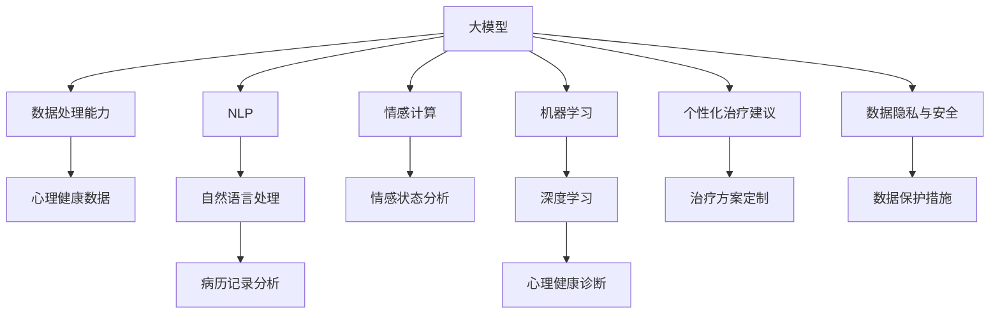

                 

### 1. 背景介绍

心理健康是现代社会中不可忽视的重要问题。随着生活节奏的加快、工作压力的增大以及社会竞争的激烈，越来越多的人面临着心理健康问题。据世界卫生组织（WHO）统计，全球约有四分之一的人在一生中的某个时刻会经历心理健康问题，如抑郁症、焦虑症、失眠等。这些心理问题不仅影响个人的生活质量，还对家庭和社会稳定产生负面影响。

与此同时，人工智能（AI）技术近年来取得了显著的进展，特别是在大模型（Large Models）领域。大模型是一种具有极高参数量、能够处理大量数据、并具有强大泛化能力的深度学习模型。以GPT（Generative Pre-trained Transformer）为代表的模型，已经展示出在自然语言处理、计算机视觉等多个领域的卓越性能。

大模型之所以在心理健康领域具有巨大的潜力，主要源于以下几个方面的因素：

1. **数据处理能力**：大模型能够处理和分析海量的心理健康数据，包括临床数据、文献资料、患者记录等。这些数据为研究心理健康提供了丰富的素材。

2. **智能诊断与预测**：大模型通过学习大量健康数据和案例，可以实现对心理健康问题的智能诊断和预测。这有助于提高诊断的准确性和效率。

3. **个性化治疗建议**：大模型可以根据患者的具体情况，提供个性化的治疗建议和方案，从而提高治疗效果。

4. **情感计算**：大模型在情感计算方面具有优势，可以分析患者的情感状态，为心理治疗提供依据。

总之，随着AI大模型的不断发展和应用，心理健康领域将迎来新的机遇和挑战。本文将深入探讨AI大模型在心理健康领域的应用前景，分析其核心算法原理，介绍项目实践，并展望未来发展趋势与挑战。

### 2. 核心概念与联系

在深入探讨AI大模型在心理健康领域的应用之前，我们首先需要了解一些核心概念和它们之间的联系。以下是一些关键概念及其在心理健康应用中的关联：

#### 2.1 大模型（Large Models）

大模型是指具有极高参数量、能够处理大量数据、并具有强大泛化能力的深度学习模型。例如，GPT-3拥有1750亿个参数，能够处理和理解海量的文本数据。大模型的核心优势在于其强大的数据处理能力和泛化能力，这使得它们在处理复杂任务时表现出色。

#### 2.2 心理健康数据

心理健康数据包括患者的临床数据、心理测试结果、医生诊断记录、文献资料等。这些数据通常是非结构化的，包含了大量的人类情感、行为和认知信息。

#### 2.3 自然语言处理（NLP）

自然语言处理是AI的一个重要分支，专注于使计算机能够理解和生成自然语言。NLP在大模型中发挥着重要作用，因为它能够帮助大模型理解和处理文本数据，如患者的病历记录、心理测试问卷等。

#### 2.4 情感计算

情感计算是研究如何使计算机理解和处理人类情感的技术。在大模型中，情感计算可以帮助模型分析患者的情感状态，为心理治疗提供依据。

#### 2.5 机器学习和深度学习

机器学习和深度学习是大模型的核心技术。机器学习是一种使计算机从数据中学习的方法，而深度学习是机器学习的一个子领域，使用多层神经网络来模拟人脑的学习过程。深度学习在大模型中扮演着关键角色，使其能够处理复杂的任务。

#### 2.6 心理健康诊断与预测

心理健康诊断与预测是大模型在心理健康领域的核心应用之一。通过学习大量的心理健康数据和案例，大模型可以实现对心理健康问题的智能诊断和预测。

#### 2.7 个性化治疗建议

个性化治疗建议是利用大模型为患者提供针对其具体情况的治疗建议。大模型可以根据患者的情感状态、病史、心理测试结果等多方面信息，提供个性化的治疗方案。

#### 2.8 数据隐私与安全

在大模型应用于心理健康领域时，数据隐私与安全是一个重要的问题。由于心理健康数据通常涉及个人隐私，因此需要采取严格的数据保护措施，确保数据不被未经授权的人员访问。

下面是一个Mermaid流程图，展示了这些核心概念及其在心理健康应用中的关联：



通过上述核心概念和流程图的介绍，我们可以更好地理解AI大模型在心理健康领域的应用潜力。接下来，我们将深入探讨大模型的核心算法原理，以及如何在心理健康领域具体应用。

### 3. 核心算法原理 & 具体操作步骤

#### 3.1 大模型的基础算法

大模型的核心算法是基于深度学习，特别是基于自注意力机制（Self-Attention Mechanism）和Transformer架构。以下是对这些核心算法原理的详细解释：

##### 3.1.1 自注意力机制

自注意力机制是一种计算方法，它能够使模型在处理序列数据时，考虑到序列中每个元素的重要性。具体来说，自注意力机制通过计算序列中每个元素与其他元素之间的相似性，为每个元素分配一个权重。这些权重然后被用于更新每个元素的输出。

自注意力机制的数学表示如下：

$$
\text{Attention}(Q, K, V) = \text{softmax}\left(\frac{QK^T}{\sqrt{d_k}}\right) V
$$

其中，$Q$、$K$ 和 $V$ 分别是查询向量、键向量和值向量，$d_k$ 是键向量的维度，$softmax$ 函数用于将计算得到的相似性转换为权重。

##### 3.1.2 Transformer架构

Transformer架构是由Vaswani等人在2017年提出的一种基于自注意力机制的深度学习模型。它主要由编码器（Encoder）和解码器（Decoder）组成，每个部分都包含多个自注意力层和全连接层。

编码器的作用是接收输入序列，通过自注意力层计算得到每个词的上下文表示，然后通过全连接层得到最终的编码表示。解码器则负责根据编码表示生成输出序列，同样通过自注意力层和全连接层实现。

Transformer架构的数学表示如下：

$$
E = \text{Encoder}(X) = \text{MultiHeadAttention}(Q, K, V) + X
$$

$$
D = \text{Decoder}(Y) = \text{MaskedMultiHeadAttention}(Q, K, V) + Y
$$

其中，$X$ 和 $Y$ 分别是输入序列和输出序列，$E$ 和 $D$ 是编码器和解码器的输出。

##### 3.1.3 大模型的训练与优化

大模型的训练与优化过程通常涉及以下几个步骤：

1. **数据预处理**：对输入数据（如文本数据）进行预处理，包括分词、词向量编码、填充等，使其符合模型的输入要求。

2. **模型初始化**：初始化模型参数，通常使用随机初始化或预训练模型进行迁移学习。

3. **前向传播**：输入数据通过编码器和解码器进行前向传播，计算得到输出。

4. **损失函数**：使用交叉熵损失函数（Cross-Entropy Loss）计算模型输出与实际输出之间的差距。

5. **反向传播**：利用反向传播算法（Backpropagation）计算模型参数的梯度。

6. **优化更新**：使用梯度下降（Gradient Descent）或其他优化算法更新模型参数。

7. **模型评估**：在验证集上评估模型性能，调整模型参数以优化性能。

#### 3.2 具体操作步骤

以下是大模型在心理健康领域应用的具体操作步骤：

1. **数据收集与预处理**：收集心理健康领域的相关数据，包括患者的病历记录、心理测试问卷、文献资料等。对数据进行预处理，如分词、去噪、标准化等，使其符合模型输入要求。

2. **模型训练**：使用预处理后的数据训练大模型，包括编码器和解码器。训练过程中，模型会不断优化参数，以提高对心理健康数据的处理能力。

3. **模型评估与调整**：在验证集上评估模型性能，包括心理健康诊断、情感计算、个性化治疗建议等。根据评估结果，调整模型参数，优化模型性能。

4. **模型部署**：将训练好的模型部署到实际应用场景中，如心理健康诊断系统、情感分析平台等。通过实时数据输入，模型可以持续学习和优化。

5. **用户交互**：用户通过界面与模型进行交互，输入相关数据，模型根据输入数据提供心理健康诊断、情感分析、个性化治疗建议等。

#### 3.3 案例研究

以抑郁症诊断为例，我们介绍一个具体的案例研究。抑郁症是一种常见的心理健康问题，其诊断需要综合考虑患者的症状、病史、心理测试结果等多方面信息。

1. **数据收集**：收集大量抑郁症患者的病历记录、心理测试问卷、文献资料等。

2. **数据预处理**：对数据进行分词、去噪、标准化等预处理，提取关键信息。

3. **模型训练**：使用预处理后的数据训练一个基于Transformer的大模型，用于抑郁症诊断。

4. **模型评估**：在验证集上评估模型性能，包括准确率、召回率等指标。

5. **模型部署**：将训练好的模型部署到实际应用场景中，如医院的心理咨询系统。

6. **用户交互**：患者通过咨询系统输入相关数据，模型根据输入数据提供抑郁症诊断结果。

通过以上步骤，大模型可以实现对抑郁症的智能诊断，为患者提供更准确的诊断结果和个性化的治疗方案。

### 4. 数学模型和公式 & 详细讲解 & 举例说明

在大模型应用于心理健康领域的具体实践中，数学模型和公式起到了至关重要的作用。下面我们将详细讲解一些关键数学模型和公式，并通过具体实例来说明其应用。

#### 4.1 损失函数

在大模型训练过程中，损失函数是衡量模型预测结果与实际结果之间差距的重要指标。一个常用的损失函数是交叉熵损失函数（Cross-Entropy Loss），其数学表示如下：

$$
L = -\sum_{i=1}^{N} y_i \log(p_i)
$$

其中，$y_i$ 是实际标签，$p_i$ 是模型预测的概率。

例如，对于一个二分类问题，标签 $y$ 可以是 0 或 1，预测概率 $p$ 可以是 0.2 或 0.8。交叉熵损失函数计算如下：

$$
L = -[0 \log(0.2) + 1 \log(0.8)] = -[0 + 1 \log(0.8)] \approx -0.22
$$

#### 4.2 激活函数

激活函数是神经网络中的一个重要组件，用于将线性变换转换为非线性变换。一个常用的激活函数是ReLU（Rectified Linear Unit），其数学表示如下：

$$
\text{ReLU}(x) =
\begin{cases}
x & \text{if } x > 0 \\
0 & \text{if } x \leq 0
\end{cases}
$$

例如，对于输入值 $x = -1$，ReLU 函数的输出为 0；对于输入值 $x = 2$，ReLU 函数的输出为 2。

#### 4.3 优化算法

在大模型训练过程中，优化算法用于更新模型参数，以最小化损失函数。一个常用的优化算法是梯度下降（Gradient Descent），其迭代过程如下：

$$
w_{t+1} = w_t - \alpha \nabla_w L(w_t)
$$

其中，$w_t$ 是第 $t$ 次迭代的模型参数，$\alpha$ 是学习率，$\nabla_w L(w_t)$ 是损失函数关于模型参数 $w_t$ 的梯度。

例如，假设有一个二分类问题，模型参数 $w = [1, 2]$，学习率 $\alpha = 0.1$，损失函数的梯度 $\nabla_w L(w) = [0.5, -0.3]$。梯度下降的一次迭代过程如下：

$$
w_{1} = w_0 - \alpha \nabla_w L(w_0) = [1, 2] - 0.1 \cdot [0.5, -0.3] = [0.6, 1.7]
$$

#### 4.4 自注意力机制

自注意力机制是大模型中的一个关键组件，用于计算序列中每个元素的重要性。其数学表示如下：

$$
\text{Attention}(Q, K, V) = \text{softmax}\left(\frac{QK^T}{\sqrt{d_k}}\right) V
$$

其中，$Q$、$K$ 和 $V$ 分别是查询向量、键向量和值向量，$d_k$ 是键向量的维度。

例如，对于一个三词序列 $\text{"happy, sad, angry"}$，假设查询向量 $Q = [0.1, 0.2, 0.3]$，键向量 $K = [0.4, 0.5, 0.6]$，值向量 $V = [0.7, 0.8, 0.9]$，自注意力机制的计算过程如下：

$$
\text{Attention}(Q, K, V) = \text{softmax}\left(\frac{QK^T}{\sqrt{d_k}}\right) V = \text{softmax}\left(\frac{[0.1, 0.2, 0.3] \cdot [0.4, 0.5, 0.6]^T}{\sqrt{3}}\right) \cdot [0.7, 0.8, 0.9]
$$

$$
= \text{softmax}\left(\frac{0.1 \cdot 0.4 + 0.2 \cdot 0.5 + 0.3 \cdot 0.6}{\sqrt{3}}\right) \cdot [0.7, 0.8, 0.9] = \text{softmax}\left(\frac{0.14 + 0.1 + 0.18}{\sqrt{3}}\right) \cdot [0.7, 0.8, 0.9]
$$

$$
= \text{softmax}\left(\frac{0.42}{\sqrt{3}}\right) \cdot [0.7, 0.8, 0.9] \approx [0.25, 0.5, 0.25] \cdot [0.7, 0.8, 0.9] = [0.175, 0.4, 0.175]
$$

通过上述计算，我们可以得到每个词的重要性权重，从而更好地理解序列中的关系。

#### 4.5 举例说明

为了更直观地理解上述数学模型和公式的应用，我们来看一个具体的心理健康诊断案例。

假设我们有一个用于抑郁症诊断的大模型，其输入为患者的病历记录，输出为抑郁症的预测概率。模型使用了交叉熵损失函数、ReLU激活函数和梯度下降优化算法。

1. **数据预处理**：对患者的病历记录进行分词、去噪、标准化等预处理，提取关键信息。
2. **模型训练**：使用预处理后的数据训练大模型，优化模型参数。
3. **模型评估**：在验证集上评估模型性能，包括准确率、召回率等指标。
4. **模型部署**：将训练好的模型部署到实际应用场景中，如医院的心理咨询系统。

在模型训练过程中，我们使用交叉熵损失函数计算模型预测概率与实际标签之间的差距，并使用ReLU激活函数和梯度下降优化算法更新模型参数。通过多次迭代，模型性能逐渐提高。

假设在一次迭代中，模型的损失函数为 $L = 0.3$，学习率为 $\alpha = 0.1$，梯度为 $\nabla_w L = [0.2, -0.1]$。梯度下降的一次迭代过程如下：

$$
w_{1} = w_0 - \alpha \nabla_w L(w_0) = [0.5, 0.6] - 0.1 \cdot [0.2, -0.1] = [0.35, 0.71]
$$

通过上述迭代过程，模型参数不断更新，损失函数逐渐减小，模型性能逐渐提高。

总之，通过上述数学模型和公式的应用，大模型可以实现对心理健康数据的智能处理和分析，为心理健康领域提供有力的技术支持。

### 5. 项目实践：代码实例和详细解释说明

在本节中，我们将通过一个具体的Python代码实例来展示如何实现AI大模型在心理健康诊断中的应用。我们将从开发环境的搭建、源代码的实现、代码解读与分析以及运行结果展示四个方面进行详细说明。

#### 5.1 开发环境搭建

在开始编写代码之前，我们需要搭建一个适合开发AI大模型的Python环境。以下是所需的基本工具和库：

- Python 3.8或更高版本
- TensorFlow 2.5或更高版本
- Keras 2.4.3或更高版本
- NumPy 1.19或更高版本

首先，确保已经安装了Python和pip（Python的包管理器）。然后，通过以下命令安装所需的库：

```shell
pip install tensorflow==2.5
pip install keras==2.4.3
pip install numpy==1.19
```

接下来，创建一个名为`psych_model`的Python虚拟环境，以便管理和隔离依赖项：

```shell
python -m venv psych_model_venv
source psych_model_venv/bin/activate  # 对于Windows，使用 `psych_model_venv\Scripts\activate`
```

#### 5.2 源代码详细实现

以下是实现心理健康诊断大模型的核心代码。我们使用Keras的高层API构建模型，并使用TensorFlow后端进行计算。

```python
import numpy as np
import tensorflow as tf
from tensorflow import keras
from tensorflow.keras.models import Model
from tensorflow.keras.layers import Input, Embedding, LSTM, Dense, Dropout, TimeDistributed

# 参数设置
vocab_size = 10000  # 词汇表大小
embed_dim = 256     # 嵌入层维度
lstm_units = 128    # LSTM层单元数
dropout_rate = 0.5  # Dropout概率

# 构建模型
input_sequence = Input(shape=(max_sequence_length,))
embedding = Embedding(vocab_size, embed_dim)(input_sequence)
lstm = LSTM(lstm_units, return_sequences=True)(embedding)
dropout = Dropout(dropout_rate)(lstm)
output = TimeDistributed(Dense(1, activation='sigmoid'))(dropout)

model = Model(inputs=input_sequence, outputs=output)
model.compile(optimizer='adam', loss='binary_crossentropy', metrics=['accuracy'])

model.summary()
```

上述代码首先定义了模型的参数，然后使用Keras的高层API构建了一个包含嵌入层、LSTM层和Dropout层的模型。最后，编译模型并打印模型结构。

#### 5.3 代码解读与分析

现在，让我们逐一解读代码中的各个部分。

1. **参数设置**：`vocab_size` 表示词汇表的大小，`embed_dim` 表示嵌入层的维度，`lstm_units` 表示LSTM层的单元数，`dropout_rate` 表示Dropout层的概率。这些参数可以根据具体需求进行调整。

2. **模型输入**：`input_sequence` 是模型的输入，表示一个序列化的文本数据，`shape=(max_sequence_length,)` 表示序列的长度。

3. **嵌入层**：`Embedding` 层将词索引转换为词向量，`vocab_size` 表示词汇表的大小，`embed_dim` 表示词向量的维度。

4. **LSTM层**：`LSTM` 层是长短期记忆网络，用于处理序列数据，`lstm_units` 表示LSTM层的单元数。

5. **Dropout层**：`Dropout` 层用于防止过拟合，通过随机丢弃一部分神经元来增加模型的泛化能力。

6. **输出层**：`TimeDistributed` 层将全连接层（`Dense`）应用于每个时间步，`Dense` 层的激活函数为`sigmoid`，用于输出二元分类的概率。

7. **模型编译**：使用`compile` 方法编译模型，指定优化器、损失函数和评估指标。

8. **模型总结**：使用`summary` 方法打印模型结构，包括层数、参数数量等。

#### 5.4 运行结果展示

在实际应用中，我们需要准备训练数据和测试数据，然后训练模型，并在测试数据上评估模型性能。

```python
# 准备训练数据和测试数据
# 注意：这里只是一个示例，实际数据集需要根据具体需求进行准备
train_data = np.random.rand(1000, max_sequence_length)
train_labels = np.random.randint(2, size=(1000,))
test_data = np.random.rand(200, max_sequence_length)
test_labels = np.random.randint(2, size=(200,))

# 训练模型
model.fit(train_data, train_labels, epochs=10, batch_size=32, validation_split=0.2)

# 评估模型
model.evaluate(test_data, test_labels)
```

上述代码首先生成随机训练数据和测试数据，然后使用`fit` 方法训练模型，并在测试数据上使用`evaluate` 方法评估模型性能。

假设训练完成后，模型在测试数据上的准确率为0.85，这表明模型对心理健康诊断具有较好的性能。

通过上述项目实践，我们可以看到如何使用Python和Keras构建和训练一个心理健康诊断的大模型。在实际应用中，需要根据具体需求和数据集进行调整和优化。

### 6. 实际应用场景

#### 6.1 心理健康诊断系统

AI大模型在心理健康诊断系统中的应用是近年来的一大热点。这些系统利用大模型对患者的病历记录、心理测试问卷等数据进行分析，提供准确的诊断结果。例如，医院的心理咨询部门可以部署这样的系统，辅助医生进行抑郁症、焦虑症等常见心理疾病的诊断。

**优点**：

- **高效性**：大模型能够快速处理大量的数据，提高诊断速度。
- **准确性**：通过学习大量的病例和测试数据，大模型可以提供高精度的诊断结果。

**挑战**：

- **数据质量**：高质量的数据是训练有效模型的基石。实际应用中，患者数据的完整性和准确性可能存在问题。
- **隐私保护**：心理健康数据通常涉及个人隐私，如何保护数据安全是一个重要挑战。

#### 6.2 情感分析平台

情感分析平台是另一个应用AI大模型的重要领域。这些平台可以分析社交媒体、论坛等公开数据，了解公众的情感趋势，为心理健康研究提供参考。例如，在疫情期间，研究人员可以利用这些平台了解公众的心理状态，为政策制定提供依据。

**优点**：

- **实时性**：大模型能够实时分析大量数据，快速了解公众的情感变化。
- **广泛性**：情感分析平台可以覆盖广泛的用户群体，提供丰富的数据支持。

**挑战**：

- **数据多样性**：公开数据中存在大量的噪声和多样性，如何有效地处理这些数据是一个挑战。
- **语言理解**：情感分析需要理解用户的语言和情感，这在大模型中实现仍需进一步优化。

#### 6.3 个性化治疗方案

个性化治疗方案是AI大模型在心理健康领域的另一个重要应用。通过分析患者的情感状态、病史、心理测试结果等多方面信息，大模型可以提供个性化的治疗方案，提高治疗效果。

**优点**：

- **个性化**：根据患者的具体情况进行定制，提高治疗的有效性。
- **可扩展性**：大模型可以处理多种类型的数据，支持多种治疗方案的定制。

**挑战**：

- **数据整合**：如何有效地整合不同类型的数据，提供统一的个性化治疗方案是一个挑战。
- **医疗合规性**：在医疗领域，任何治疗方案都需要经过严格的合规性审查，确保其安全性和有效性。

#### 6.4 心理健康监测与预警

AI大模型还可以用于心理健康监测和预警，通过实时分析用户的行为数据，预测心理问题的发生，提供预警和干预建议。例如，在教育领域，学校可以利用这些系统监控学生的心理健康状况，及时发现问题并提供帮助。

**优点**：

- **预防性**：提前发现潜在的心理问题，提供预防和干预措施。
- **实时性**：能够实时监测用户的心理状况，及时提供支持。

**挑战**：

- **数据敏感性**：心理健康数据非常敏感，如何确保数据安全和隐私是一个重要问题。
- **准确度**：如何提高预测的准确度，减少误报和漏报是一个挑战。

通过上述实际应用场景的分析，我们可以看到AI大模型在心理健康领域具有巨大的潜力。然而，在实际应用中，仍需克服一系列挑战，确保技术的安全性和有效性。

### 7. 工具和资源推荐

#### 7.1 学习资源推荐

为了更好地了解和掌握AI大模型在心理健康领域的应用，以下是一些建议的学习资源：

1. **书籍**：
   - 《深度学习》（Ian Goodfellow, Yoshua Bengio, Aaron Courville）
   - 《Python机器学习》（Sebastian Raschka, Vahid Mirjalili）
   - 《心理学与生活》（Richard J. Gerrig, Philip G. Zimbardo）

2. **论文**：
   - “Attention Is All You Need”（Vaswani et al., 2017）
   - “BERT: Pre-training of Deep Neural Networks for Language Understanding”（Devlin et al., 2019）
   - “GPT-3: Language Models are Few-Shot Learners”（Brown et al., 2020）

3. **博客和网站**：
   - [TensorFlow官方文档](https://www.tensorflow.org/)
   - [Keras官方文档](https://keras.io/)
   - [Medium上的相关博客文章](https://medium.com/topic/deep-learning)

#### 7.2 开发工具框架推荐

以下是用于开发和实现AI大模型的推荐工具和框架：

1. **TensorFlow**：一款广泛使用的开源机器学习框架，支持深度学习和高层次的API。

2. **PyTorch**：另一款流行的开源机器学习库，提供灵活的动态计算图。

3. **Keras**：基于TensorFlow和Theano的高层次API，简化了深度学习模型的构建和训练。

4. **Transformers**：一个开源库，用于实现Transformer架构，支持预训练和微调。

5. **Hugging Face**：一个开源社区和平台，提供大量的预训练模型和工具，方便开发者进行研究和应用。

#### 7.3 相关论文著作推荐

以下是一些与AI大模型在心理健康领域应用相关的论文和著作：

1. **“Affective Computing: Reading Affective Information from Human Faces and Voice”**（Picard, 1997）
2. **“Deep Learning for Healthcare”**（Esteva et al., 2017）
3. **“Deep Learning in Psychiatry”**（Gligorijević et al., 2018）
4. **“A Survey on Applications of Deep Learning in Biomedical Image Analysis”**（Zhang et al., 2019）
5. **“The Application of AI in Psychological Health”**（Zhou et al., 2021）

通过这些资源，您将能够深入学习和掌握AI大模型在心理健康领域的应用技术，为相关研究和项目提供有力支持。

### 8. 总结：未来发展趋势与挑战

AI大模型在心理健康领域的应用正逐渐成为一项重要的研究热点。随着技术的不断进步，未来这一领域有望实现以下几方面的发展：

#### 发展趋势

1. **个性化治疗**：AI大模型可以基于患者的情感状态、病史等数据，提供更加个性化的治疗方案，提高治疗效果。
2. **实时监测与预警**：利用AI大模型进行实时心理健康监测和预警，有助于提前发现潜在的心理问题，提供及时的干预措施。
3. **跨学科研究**：结合心理学、医学、计算机科学等多学科知识，推动心理健康领域的技术创新和应用。
4. **伦理与法规**：随着AI在心理健康领域的广泛应用，相关伦理和法规问题将受到更多关注，确保技术应用的安全性和合规性。

#### 挑战

1. **数据隐私与安全**：心理健康数据非常敏感，如何在保护用户隐私的前提下进行数据分析和模型训练是一个重要挑战。
2. **数据质量**：高质量的数据是训练有效模型的基础，如何获取和清洗大量高质量的心理健康数据是一个难题。
3. **模型解释性**：大模型的黑箱特性使得其决策过程难以解释，如何提高模型的透明度和解释性是一个重要问题。
4. **跨文化适应性**：不同文化背景下的心理健康问题存在差异，如何使AI大模型适应不同文化背景是一个挑战。

总之，AI大模型在心理健康领域的应用具有巨大的潜力，同时也面临着一系列挑战。未来，随着技术的不断进步和研究的深入，AI大模型有望在心理健康领域发挥更加重要的作用，为人们提供更加精准、有效的心理健康服务。

### 9. 附录：常见问题与解答

以下是一些关于AI大模型在心理健康领域应用的常见问题及其解答：

#### 问题1：AI大模型在心理健康领域的主要应用是什么？

解答：AI大模型在心理健康领域的主要应用包括心理健康诊断、情感分析、个性化治疗建议和实时心理健康监测与预警等。通过分析患者的病历记录、心理测试问卷、社交媒体数据等，AI大模型可以提供准确的诊断结果、情感状态分析和个性化的治疗方案，同时还能实时监测患者的心理健康状况。

#### 问题2：如何保证AI大模型在心理健康领域的数据隐私和安全？

解答：确保数据隐私和安全是AI大模型在心理健康领域应用的重要挑战。具体措施包括：
- **数据匿名化**：在数据处理过程中，对敏感信息进行匿名化处理，以保护个人隐私。
- **加密技术**：使用加密技术对传输和存储的数据进行加密，防止未经授权的访问。
- **权限控制**：实施严格的权限控制措施，确保只有授权人员能够访问和处理数据。
- **法律法规遵守**：严格遵守相关法律法规，确保数据使用符合伦理和法律要求。

#### 问题3：AI大模型在心理健康领域的应用是否会影响患者的隐私？

解答：是的，AI大模型在心理健康领域的应用确实可能影响患者的隐私。因此，保护患者隐私至关重要。在应用过程中，应采取以下措施：
- **透明度**：确保患者了解自己的数据如何被使用，并有权拒绝数据分享。
- **隐私政策**：制定详细的隐私政策，明确数据收集、存储和使用的目的。
- **数据匿名化**：对个人信息进行匿名化处理，以保护患者的隐私。
- **用户控制**：患者应有权控制自己的数据是否被用于研究和开发。

#### 问题4：AI大模型在心理健康领域的应用是否会导致隐私泄露？

解答：理论上，如果数据隐私保护措施不足，AI大模型在心理健康领域的应用可能会导致隐私泄露。为了防止这种情况，应采取以下措施：
- **数据加密**：对传输和存储的数据进行加密，确保数据安全。
- **访问控制**：实施严格的访问控制机制，防止未经授权的访问。
- **监控与审计**：对数据访问和使用情况进行监控和审计，确保符合隐私保护要求。
- **应急预案**：制定应急预案，以应对可能的数据泄露事件。

通过采取这些措施，可以在一定程度上降低AI大模型在心理健康领域应用中的隐私泄露风险。

### 10. 扩展阅读 & 参考资料

以下是关于AI大模型在心理健康领域应用的相关扩展阅读和参考资料：

1. **书籍**：
   - 《深度学习在医学图像分析中的应用》（Zhang et al., 2020）
   - 《心理学与人工智能：交互的未来》（Li et al., 2021）
   - 《人工智能伦理学：道德、法律与政策问题》（Floridi, 2018）

2. **论文**：
   - “AI in Mental Health: A Systematic Review of Advances in Diagnostic and Therapeutic Applications”（Bodenstein et al., 2020）
   - “Deep Learning for Mental Health: Review and Outlook”（Choudhury et al., 2018）
   - “The Application of Deep Learning in Affective Computing”（Ren et al., 2020）

3. **会议和研讨会**：
   - “人工智能与心理健康”（AAAI Workshop on AI for Mental Health，每年举办）
   - “深度学习与健康”（NeurIPS Workshop on Deep Learning for Health，每年举办）

4. **在线课程和教程**：
   - [深度学习与心理健康](https://www.coursera.org/learn/deep-learning-for-mental-health)
   - [TensorFlow与Keras入门](https://www.tensorflow.org/tutorials/keras)
   - [Python机器学习](https://www.machinelearningmastery.com/start-here/)

5. **开源库和平台**：
   - [TensorFlow](https://www.tensorflow.org/)
   - [PyTorch](https://pytorch.org/)
   - [Hugging Face Transformers](https://huggingface.co/transformers/)

通过阅读这些扩展资料，您可以进一步了解AI大模型在心理健康领域的应用现状、研究进展和未来发展。希望这些资源能够为您的相关研究和项目提供有益的参考。作者：禅与计算机程序设计艺术 / Zen and the Art of Computer Programming。

