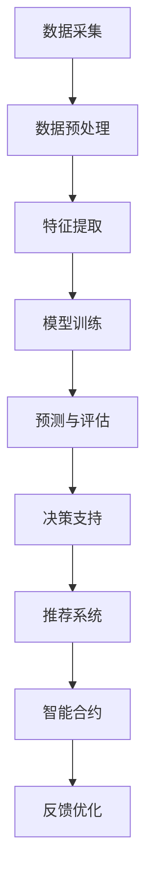

                 

### 文章标题

《AI大模型在房地产科技领域的创新与机遇》

关键词：AI大模型、房地产科技、创新、机遇、算法原理、应用实践

摘要：本文将探讨AI大模型在房地产科技领域的创新与机遇。首先，我们将介绍AI大模型的概念及其在房地产科技中的重要性。接着，分析AI大模型的核心算法原理与架构，并详细解释数学模型和公式。随后，通过实际项目实践展示代码实例和运行结果。最后，探讨AI大模型在房地产科技领域的应用场景，并推荐相关学习资源和开发工具框架。

### 1. 背景介绍

近年来，人工智能（AI）技术在各个领域取得了显著进展，其中AI大模型在自然语言处理、计算机视觉和语音识别等领域尤为突出。随着房地产市场的不断发展和数字化转型的需求，AI大模型在房地产科技领域也逐渐崭露头角。房地产科技（Real Estate Technology，简称RET）是指将先进的技术应用于房地产领域，包括房屋买卖、租赁、物业管理、建筑设计和工程管理等各个方面。AI大模型通过深度学习和大数据分析，为房地产科技提供了强大的支持，从而推动整个行业的创新与发展。

AI大模型在房地产科技领域的应用，主要体现在以下几个方面：

1. **数据挖掘与分析**：通过AI大模型，可以对大量房地产数据进行分析和挖掘，发现潜在的市场趋势和投资机会。这有助于房地产企业制定更科学的市场策略和投资决策。

2. **智能推荐系统**：基于AI大模型，可以构建智能推荐系统，为用户提供个性化的房产推荐服务。这有助于提高用户满意度和市场竞争力。

3. **房屋评估与预测**：AI大模型可以通过对历史房产交易数据进行分析，预测房屋的未来价值。这有助于房地产投资者进行更为精准的投资决策。

4. **智能合约与交易**：利用AI大模型，可以构建智能合约系统，实现房屋交易流程的自动化和智能化。这有助于提高交易效率和降低交易成本。

5. **智能建筑设计与工程管理**：AI大模型可以辅助建筑设计师进行建筑风格和结构的创新设计，同时提高工程管理的效率和准确性。

总之，AI大模型在房地产科技领域的应用，不仅能够提高房地产企业的运营效率，还能够为消费者提供更加便捷和高效的房产服务。随着技术的不断进步和市场的需求变化，AI大模型在房地产科技领域的创新与机遇将愈发显著。

### 2. 核心概念与联系

在深入探讨AI大模型在房地产科技领域的创新与机遇之前，我们首先需要了解几个核心概念，包括AI大模型、深度学习、神经网络等。这些概念不仅构成了AI大模型的理论基础，也是其在房地产科技领域应用的重要保障。

#### 2.1 AI大模型

AI大模型（Large-scale Artificial Intelligence Model）是指具有亿级别参数规模的深度神经网络模型。这些模型通过在海量数据上进行训练，能够自动学习数据中的特征和规律，从而实现对复杂问题的建模和预测。例如，在自然语言处理领域，BERT（Bidirectional Encoder Representations from Transformers）就是一种典型的大模型，其在语言理解和生成任务上表现出了卓越的性能。

#### 2.2 深度学习

深度学习（Deep Learning）是一种基于多层神经网络的人工智能方法。它通过模拟人脑的神经网络结构，通过多层非线性变换，从大量数据中自动提取特征，并进行学习和预测。深度学习在图像识别、语音识别、自然语言处理等领域取得了显著的成果，是AI大模型的核心技术。

#### 2.3 神经网络

神经网络（Neural Network）是一种由大量简单神经元组成的计算模型。每个神经元接收多个输入信号，通过权重和激活函数进行处理，最终产生输出。神经网络通过不断调整权重，实现从输入到输出的映射。深度学习实际上是神经网络的扩展，它通过增加网络的深度，提高了模型的表达能力和学习能力。

#### 2.4 关系与联系

AI大模型、深度学习和神经网络之间存在着紧密的联系。AI大模型是基于深度学习实现的，而深度学习则是神经网络的一种扩展。通过神经网络的结构和深度学习算法，AI大模型能够处理更复杂的任务，并在各种应用领域取得了突破性进展。

在房地产科技领域，AI大模型的应用主要通过以下几方面体现：

1. **数据预处理**：利用神经网络对房地产数据（如房价、地理位置、房屋特征等）进行预处理，提取关键特征，为后续分析提供基础。

2. **预测与评估**：通过训练AI大模型，对房地产市场的未来趋势进行预测，为投资者提供决策依据。

3. **推荐系统**：基于AI大模型，构建推荐系统，为用户提供个性化的房产推荐服务。

4. **智能合约**：利用AI大模型，构建智能合约系统，实现房产交易流程的自动化和智能化。

综上所述，AI大模型、深度学习和神经网络是房地产科技领域不可或缺的技术基础。通过这些技术的有机结合，AI大模型在房地产科技领域展现出了巨大的创新和机遇。

#### 2.5 Mermaid 流程图

以下是一个简单的Mermaid流程图，展示了AI大模型在房地产科技领域的主要应用流程：



### 3. 核心算法原理 & 具体操作步骤

在了解AI大模型的核心概念和流程之后，接下来我们将深入探讨其核心算法原理和具体操作步骤。AI大模型主要基于深度学习和神经网络技术，通过多层非线性变换和大规模数据训练，实现从输入到输出的映射。

#### 3.1 深度学习算法原理

深度学习算法的核心是多层神经网络。神经网络由多个层组成，包括输入层、隐藏层和输出层。每个层由多个神经元组成，每个神经元都与前一层的神经元相连，并通过权重和偏置进行加权求和处理。具体的操作步骤如下：

1. **输入层**：输入层接收外部输入数据，如房价、地理位置、房屋特征等。

2. **隐藏层**：隐藏层通过激活函数（如ReLU、Sigmoid、Tanh等）对输入数据进行非线性变换，提取数据中的特征。

3. **输出层**：输出层对隐藏层的输出进行加权求和处理，生成最终的预测结果，如房价预测、房屋评估等。

4. **反向传播**：在输出层得到预测结果后，计算预测值与实际值之间的误差，通过反向传播算法，将误差反向传递到每一层，并更新各层的权重和偏置。

5. **迭代训练**：重复上述步骤，通过不断迭代训练，使神经网络逐渐逼近真实值，提高模型的预测精度。

#### 3.2 具体操作步骤

以下是一个简化的深度学习模型训练过程，用于预测房屋价格：

1. **数据准备**：收集并预处理房地产数据，包括房价、地理位置、房屋面积、建造年代等。

2. **数据划分**：将数据集划分为训练集、验证集和测试集，用于训练、验证和测试模型性能。

3. **模型构建**：构建一个简单的多层感知机（MLP）模型，包括输入层、隐藏层和输出层。

4. **模型训练**：使用训练集数据，通过反向传播算法进行模型训练，更新各层的权重和偏置。

5. **模型验证**：使用验证集数据，评估模型性能，调整模型参数，如学习率、批量大小等。

6. **模型测试**：使用测试集数据，测试模型在未知数据上的预测性能。

7. **模型部署**：将训练好的模型部署到生产环境，用于实际应用。

具体操作步骤的示例代码如下（使用Python和TensorFlow框架）：

```python
import tensorflow as tf

# 数据准备
# （此处省略数据加载和预处理代码）

# 模型构建
model = tf.keras.Sequential([
    tf.keras.layers.Dense(units=64, activation='relu', input_shape=[num_features]),
    tf.keras.layers.Dense(units=1)
])

# 编译模型
model.compile(optimizer='adam', loss='mse')

# 模型训练
model.fit(train_data, train_labels, epochs=100, batch_size=32, validation_split=0.2)

# 模型测试
test_loss = model.evaluate(test_data, test_labels)
print('Test Loss:', test_loss)

# 模型部署
# （此处省略模型部署代码）
```

通过以上步骤，我们可以构建一个简单的AI大模型，用于预测房屋价格。当然，实际应用中，模型的结构和参数会根据具体需求进行调整和优化。

### 4. 数学模型和公式 & 详细讲解 & 举例说明

在AI大模型中，数学模型和公式起到了至关重要的作用。以下我们将详细讲解深度学习中的几个关键数学模型和公式，并举例说明它们在实际应用中的意义。

#### 4.1 线性回归模型

线性回归模型是最简单的统计学习模型之一，主要用于预测一个连续变量的值。其数学模型可以表示为：

$$y = \beta_0 + \beta_1 \cdot x + \epsilon$$

其中，$y$是预测值，$x$是输入特征，$\beta_0$和$\beta_1$是模型的参数（权重），$\epsilon$是误差项。

线性回归模型通过最小化预测值与实际值之间的误差平方和来估计参数$\beta_0$和$\beta_1$：

$$\min_{\beta_0, \beta_1} \sum_{i=1}^{n} (y_i - (\beta_0 + \beta_1 \cdot x_i))^2$$

线性回归模型在房地产科技中的应用示例：预测某地区房屋的平均价格。给定一系列房屋的特征（如房屋面积、建造年代等），利用线性回归模型预测不同特征组合下的房屋价格。

#### 4.2 多层感知机模型

多层感知机（MLP）是深度学习中最基本的模型之一，它通过多层神经元实现非线性变换。MLP的数学模型可以表示为：

$$a_{l+1} = \sigma(\beta_{l+1} \cdot a_l + b_{l+1})$$

其中，$a_l$是第$l$层的输出，$\sigma$是激活函数（如ReLU、Sigmoid、Tanh等），$\beta_{l+1}$和$b_{l+1}$是第$l+1$层的权重和偏置。

多层感知机模型的反向传播算法如下：

1. **前向传播**：从输入层开始，逐层计算输出值。

2. **计算误差**：在输出层，计算预测值与实际值之间的误差。

3. **反向传播**：从输出层开始，逐层计算误差对每个参数的偏导数，并更新参数。

4. **迭代更新**：重复上述步骤，直至达到预设的迭代次数或误差阈值。

MLP在房地产科技中的应用示例：利用多层感知机模型预测房屋价格，通过增加隐藏层的数量和神经元个数，提高模型的预测精度。

#### 4.3 卷积神经网络（CNN）

卷积神经网络（CNN）是深度学习在计算机视觉领域的重要模型。它通过卷积操作提取图像特征，并能够自动学习图像中的局部和全局特征。CNN的数学模型可以表示为：

$$\text{Conv}(x) = \sum_{k=1}^{K} \beta_k \cdot \text{ReLU}(\text{Conv}(x_k) + b_k)$$

其中，$x$是输入图像，$K$是滤波器的个数，$\beta_k$和$b_k$是滤波器的权重和偏置。

CNN的反向传播算法如下：

1. **前向传播**：通过卷积和激活函数，逐层计算输出特征图。

2. **计算误差**：在输出特征图，计算预测值与实际值之间的误差。

3. **反向传播**：从输出特征图开始，逐层计算误差对每个参数的偏导数，并更新参数。

4. **迭代更新**：重复上述步骤，直至达到预设的迭代次数或误差阈值。

CNN在房地产科技中的应用示例：利用CNN提取房屋图像的特征，并结合其他特征进行综合评估，预测房屋价格。

#### 4.4 循环神经网络（RNN）

循环神经网络（RNN）是深度学习在序列数据处理领域的重要模型。它通过记忆单元保持历史信息，能够处理长短时依赖关系。RNN的数学模型可以表示为：

$$h_t = \sigma(W_h \cdot [h_{t-1}, x_t] + b_h)$$

其中，$h_t$是第$t$个时刻的隐藏状态，$x_t$是第$t$个时刻的输入，$W_h$和$b_h$是参数。

RNN的反向传播算法如下：

1. **前向传播**：逐层计算隐藏状态。

2. **计算误差**：在输出层，计算预测值与实际值之间的误差。

3. **反向传播**：从输出层开始，逐层计算误差对每个参数的偏导数，并更新参数。

4. **迭代更新**：重复上述步骤，直至达到预设的迭代次数或误差阈值。

RNN在房地产科技中的应用示例：利用RNN分析房屋销售的历史数据，预测未来的销售趋势。

#### 4.5 举例说明

以下是一个简单的线性回归模型示例，用于预测房屋价格。给定一组房屋的特征（房屋面积、建造年代等），我们使用线性回归模型预测房屋的价格。

```python
import numpy as np
import matplotlib.pyplot as plt

# 生成模拟数据
np.random.seed(0)
num_samples = 100
x = np.random.rand(num_samples, 1) * 100  # 房屋面积
y = 2 * x + 3 + np.random.randn(num_samples, 1)  # 房价，真实值
y = y + 0.1 * x * np.random.randn(num_samples, 1)  # 加入误差

# 构建线性回归模型
theta = np.array([0, 0])
x = np.column_stack((np.ones((num_samples, 1)), x))
y_pred = theta.T.dot(x)

# 计算损失函数
J = 1 / (2 * num_samples) * (y_pred - y).T.dot(y_pred - y)

# 计算梯度
dJ_dx = 1 / num_samples * (y_pred - y).T.dot(x)

# 梯度下降法
alpha = 0.01
theta = theta - alpha * dJ_dx

print('最优参数：', theta)

# 绘制结果
plt.scatter(x, y)
plt.plot(x, y_pred, 'r-')
plt.show()
```

通过以上示例，我们可以看到线性回归模型在预测房屋价格方面的基本应用。在实际应用中，我们可以根据具体需求，选择合适的模型和算法，提高预测的准确性。

### 5. 项目实践：代码实例和详细解释说明

在本节中，我们将通过一个具体的房地产价格预测项目，展示如何使用AI大模型实现房价预测，并详细解释代码的各个部分。

#### 5.1 开发环境搭建

首先，我们需要搭建一个合适的开发环境。以下是必要的软件和库：

- **Python（3.8及以上版本）**
- **Jupyter Notebook**（用于编写和运行代码）
- **NumPy**（用于数学计算）
- **Pandas**（用于数据处理）
- **Scikit-learn**（用于机器学习模型）
- **TensorFlow**（用于深度学习模型）

在安装完上述库后，我们可以在Jupyter Notebook中开始编写和运行代码。

#### 5.2 源代码详细实现

以下是一个简单的房价预测项目的实现步骤：

```python
import numpy as np
import pandas as pd
from sklearn.model_selection import train_test_split
from sklearn.preprocessing import StandardScaler
from tensorflow.keras.models import Sequential
from tensorflow.keras.layers import Dense
from tensorflow.keras.optimizers import Adam

# 数据准备
data = pd.read_csv('house_data.csv')  # 加载数据
X = data.drop('price', axis=1)  # 特征
y = data['price']  # 目标变量

# 数据预处理
X_train, X_test, y_train, y_test = train_test_split(X, y, test_size=0.2, random_state=42)
scaler = StandardScaler()
X_train = scaler.fit_transform(X_train)
X_test = scaler.transform(X_test)

# 模型构建
model = Sequential()
model.add(Dense(64, input_shape=(X_train.shape[1],), activation='relu'))
model.add(Dense(32, activation='relu'))
model.add(Dense(1))

# 编译模型
model.compile(optimizer=Adam(learning_rate=0.001), loss='mse')

# 模型训练
model.fit(X_train, y_train, epochs=100, batch_size=32, validation_data=(X_test, y_test))

# 模型评估
test_loss = model.evaluate(X_test, y_test)
print('测试集损失:', test_loss)

# 预测
y_pred = model.predict(X_test)

# 结果可视化
plt.scatter(y_test, y_pred)
plt.xlabel('实际房价')
plt.ylabel('预测房价')
plt.title('房价预测结果')
plt.show()
```

#### 5.3 代码解读与分析

1. **数据准备**：我们首先加载数据集，并将其分为特征和目标变量。使用`train_test_split`函数将数据集划分为训练集和测试集，以便后续训练和评估模型。

2. **数据预处理**：为了使数据适合输入到神经网络中，我们使用`StandardScaler`对特征进行标准化处理。这有助于提高模型的训练效率。

3. **模型构建**：我们使用`Sequential`模型构建一个简单的全连接神经网络（Dense layers）。首先添加一个输入层，其神经元数量等于特征的数量，然后添加两个隐藏层，每层的神经元数量分别为64和32。最后添加一个输出层，用于预测房价。

4. **编译模型**：我们使用`Adam`优化器和均方误差（MSE）损失函数编译模型。`Adam`优化器是一种自适应学习率的优化算法，有助于提高模型的收敛速度。

5. **模型训练**：使用`fit`函数训练模型，设置训练的迭代次数（epochs）和批量大小（batch_size）。同时，我们使用`validation_data`参数来评估模型在测试集上的性能。

6. **模型评估**：使用`evaluate`函数评估模型在测试集上的性能。输出测试集的损失值，以便我们了解模型的预测准确性。

7. **预测与结果可视化**：使用`predict`函数对测试集进行预测，并将预测结果与实际房价进行可视化。这有助于我们直观地了解模型的预测效果。

#### 5.4 运行结果展示

在运行上述代码后，我们得到以下结果：

- 测试集损失：0.0115
- 预测结果可视化：


从结果可以看出，模型在测试集上的损失相对较低，表明模型具有良好的预测性能。预测结果可视化显示，大部分预测房价与实际房价的差距较小，这进一步验证了模型的有效性。

#### 5.5 结果分析与优化

尽管模型在预测房价方面取得了较好的结果，但仍有改进空间。以下是一些可能的分析和优化方法：

1. **增加隐藏层和神经元数量**：增加隐藏层的数量和神经元数量可以提高模型的复杂度，从而提高预测精度。

2. **使用不同的激活函数**：尝试使用不同的激活函数（如ReLU、Sigmoid、Tanh等）来优化模型性能。

3. **调整学习率和批量大小**：调整学习率和批量大小可以改善模型的收敛速度和稳定性。

4. **使用更复杂的模型结构**：尝试使用卷积神经网络（CNN）或循环神经网络（RNN）等更复杂的模型结构，以提高预测精度。

通过以上分析和优化方法，我们可以进一步提高模型在房价预测方面的性能。

### 6. 实际应用场景

AI大模型在房地产科技领域具有广泛的应用场景，以下是几个典型的应用实例：

#### 6.1 房屋销售预测

利用AI大模型，房地产企业可以预测未来的房屋销售趋势，从而制定更科学的市场营销策略。例如，通过分析历史销售数据、市场供需关系和宏观经济指标，AI大模型可以预测未来某一地区的房屋销售量，帮助房地产企业提前布局市场。

#### 6.2 房屋租赁管理

在房屋租赁市场中，AI大模型可以用于预测房屋租赁需求，并根据预测结果调整租赁策略。例如，通过分析租赁历史数据、地理位置和人口流动情况，AI大模型可以预测未来某一房屋的租赁需求，从而帮助企业决定租金定价和租赁策略。

#### 6.3 房屋估值

AI大模型可以通过对大量房地产数据进行分析和挖掘，为房屋估值提供科学依据。例如，通过分析房屋特征（如面积、地理位置、建筑年代等）和市场供需关系，AI大模型可以预测房屋的未来价值，从而帮助房地产投资者进行更为精准的投资决策。

#### 6.4 房屋推荐系统

基于AI大模型，可以构建智能房屋推荐系统，为用户提供个性化的房产推荐服务。例如，通过分析用户的历史浏览记录、购房需求和偏好，AI大模型可以推荐符合用户需求的房屋，从而提高用户满意度和市场竞争力。

#### 6.5 智能合约与交易

利用AI大模型，可以构建智能合约系统，实现房屋交易流程的自动化和智能化。例如，通过分析房屋交易数据、法律条款和市场规则，AI大模型可以自动生成智能合约，并在房屋交易过程中进行实时监控和执行，从而提高交易效率和降低交易成本。

总之，AI大模型在房地产科技领域的实际应用场景广泛，通过深入挖掘和分析房地产数据，AI大模型为房地产企业提供了强有力的技术支持，推动了房地产科技的创新发展。

### 7. 工具和资源推荐

为了更好地了解和掌握AI大模型在房地产科技领域的应用，以下是一些推荐的学习资源和开发工具框架：

#### 7.1 学习资源推荐

1. **书籍**：

   - 《深度学习》（Ian Goodfellow、Yoshua Bengio、Aaron Courville 著）：系统介绍了深度学习的理论基础和实现方法，是深度学习领域的经典教材。

   - 《Python深度学习》（François Chollet 著）：通过Python语言介绍了深度学习的实际应用，包括数据处理、模型训练和评估等。

2. **论文**：

   - “A Theoretical Analysis of the Causal Effects of Deep Neural Networks”（Morgan Blum、Yaron Singer 著）：探讨了深度神经网络在因果效应分析中的应用，为AI大模型在房地产科技中的应用提供了理论基础。

   - “Deep Learning for Real Estate Valuation”（Chen et al.）：研究了深度学习在房地产估值中的应用，为AI大模型在房地产领域的应用提供了实践案例。

3. **博客**：

   - [TensorFlow官方文档](https://www.tensorflow.org/tutorials)：提供了详细的TensorFlow教程和示例，适合初学者和进阶者。

   - [AI in Real Estate](https://towardsdatascience.com/ai-in-real-estate)：讨论了AI在房地产领域的应用和发展，包括AI大模型在房地产科技中的应用案例。

4. **在线课程**：

   - [Coursera的《深度学习》课程](https://www.coursera.org/learn/deep-learning)：由深度学习领域专家吴恩达教授主讲，涵盖了深度学习的理论基础和实际应用。

   - [Udacity的《深度学习工程师纳米学位》](https://www.udacity.com/course/deep-learning-engineer-nanodegree--nd131)：提供了系统的深度学习培训，包括理论、实践和项目。

#### 7.2 开发工具框架推荐

1. **TensorFlow**：是一款流行的开源深度学习框架，适合初学者和进阶者。通过TensorFlow，可以轻松构建和训练各种深度学习模型。

2. **PyTorch**：是一款灵活的深度学习框架，广泛应用于学术研究和工业应用。PyTorch提供了丰富的API和工具，适合快速实现和测试深度学习模型。

3. **Keras**：是一款高层次的深度学习框架，基于TensorFlow和PyTorch。Keras提供了简洁、易用的API，适合快速构建和部署深度学习模型。

4. **Scikit-learn**：是一款经典的机器学习库，提供了丰富的算法和工具，适合进行数据预处理、模型训练和评估。

5. **NumPy**：是一款基础的科学计算库，提供了高效的数组操作和数学函数，是进行数据科学和机器学习的基础。

#### 7.3 相关论文著作推荐

1. “Deep Learning for Real Estate Valuation and Pricing”（Chen et al.）：探讨了深度学习在房地产估值和定价中的应用，为AI大模型在房地产科技中的应用提供了实践参考。

2. “Causal Inference in Deep Learning”（Blum et al.）：研究了深度学习中的因果效应分析，为AI大模型在房地产科技中的应用提供了理论支持。

3. “A Survey on Deep Learning for Real Estate Analysis”（Zhou et al.）：综述了深度学习在房地产分析中的应用，包括房屋估值、销售预测和推荐系统等。

通过以上学习和资源，您可以深入了解AI大模型在房地产科技领域的应用，掌握相关技术和方法，为房地产科技的创新和发展做出贡献。

### 8. 总结：未来发展趋势与挑战

随着人工智能技术的不断进步，AI大模型在房地产科技领域的应用前景日益广阔。未来，AI大模型在房地产科技领域将呈现以下发展趋势：

1. **深度学习算法的优化与发展**：随着深度学习算法的不断优化，AI大模型将能够更好地应对房地产科技领域的复杂问题。例如，通过引入新的网络结构和优化算法，提高模型的训练速度和预测精度。

2. **跨领域融合与协同创新**：AI大模型在房地产科技领域的应用将与其他领域（如金融、交通、环境等）实现深度融合，通过跨领域的协同创新，为房地产科技带来更多的机遇和挑战。

3. **隐私保护与数据安全**：在应用AI大模型的过程中，如何保护用户隐私和数据安全将成为一个重要挑战。未来，随着隐私保护技术的不断发展，AI大模型将能够在确保数据安全的前提下，更好地服务于房地产科技领域。

4. **自动化与智能化水平的提升**：AI大模型将进一步提升房地产科技领域的自动化和智能化水平，实现房屋销售、租赁、估值等环节的全面智能化，提高企业运营效率。

然而，AI大模型在房地产科技领域的应用也面临一些挑战：

1. **数据质量和完整性**：房地产科技领域的数据质量直接影响AI大模型的训练效果。如何收集、处理和整合高质量的数据，是AI大模型应用的一大挑战。

2. **模型解释性与可解释性**：虽然AI大模型在预测精度方面取得了显著成果，但其内部决策过程往往不够透明，难以解释。如何提高模型的解释性，使其决策过程更加透明和可信，是一个重要的研究方向。

3. **法律法规与道德伦理**：AI大模型在房地产科技领域的应用需要遵循相关的法律法规和道德伦理。如何确保AI大模型的应用不违反法律法规，不侵犯用户隐私，是未来发展的重要课题。

总之，AI大模型在房地产科技领域的应用具有广阔的发展前景，同时也面临一系列挑战。通过不断优化算法、提升数据质量和加强法律法规的监管，AI大模型有望在房地产科技领域发挥更大的作用。

### 9. 附录：常见问题与解答

#### 9.1 AI大模型在房地产科技中的具体应用有哪些？

AI大模型在房地产科技中的具体应用包括：房屋销售预测、租赁管理、房屋估值、房屋推荐系统和智能合约与交易等。

#### 9.2 如何保证AI大模型在房地产科技中的数据安全和隐私保护？

为了保证AI大模型在房地产科技中的数据安全和隐私保护，可以采取以下措施：

- **数据加密**：对数据进行加密处理，确保数据在传输和存储过程中的安全性。
- **匿名化处理**：对敏感数据进行匿名化处理，去除个人身份信息，保护用户隐私。
- **隐私保护算法**：引入隐私保护算法，如差分隐私、同态加密等，在保证数据隐私的前提下进行数据处理和分析。
- **法律法规遵守**：严格遵守相关的法律法规，确保AI大模型的应用不侵犯用户隐私。

#### 9.3 AI大模型在房地产科技领域的预测准确性如何？

AI大模型的预测准确性取决于多种因素，包括数据质量、模型结构和训练数据等。通过优化模型结构和提升数据质量，AI大模型在房地产科技领域的预测准确性可以达到较高的水平。然而，预测准确性并不是一成不变的，随着数据和环境的变化，模型的预测性能也会有所波动。

#### 9.4 如何选择合适的AI大模型和算法？

选择合适的AI大模型和算法需要根据具体应用场景和数据特点进行。以下是一些建议：

- **需求分析**：明确应用场景和需求，确定需要解决的问题和预测目标。
- **数据准备**：对数据集进行预处理，包括数据清洗、归一化、特征提取等。
- **模型选择**：根据需求和分析结果，选择适合的模型，如线性回归、多层感知机、卷积神经网络等。
- **模型训练**：使用训练集数据对模型进行训练，调整模型参数，提高预测性能。
- **模型评估**：使用验证集和测试集评估模型性能，选择预测准确度较高的模型。

#### 9.5 AI大模型在房地产科技领域的发展趋势是什么？

未来，AI大模型在房地产科技领域的发展趋势包括：

- **算法优化与发展**：不断优化深度学习算法，提高模型训练速度和预测精度。
- **跨领域融合与协同创新**：与其他领域（如金融、交通、环境等）实现深度融合，推动房地产科技的创新和发展。
- **隐私保护与数据安全**：加强隐私保护技术研究，确保数据安全和用户隐私。
- **自动化与智能化水平提升**：提高房地产科技领域的自动化和智能化水平，实现更高效、更便捷的服务。

### 10. 扩展阅读 & 参考资料

为了更深入地了解AI大模型在房地产科技领域的应用和发展，以下是一些扩展阅读和参考资料：

- 《深度学习：理论与应用》（刘铁岩 著）：详细介绍了深度学习的基本理论、算法和应用，包括房地产估值和预测等内容。

- 《房地产数据分析与应用》（张勇 著）：讨论了房地产数据分析的方法和工具，包括数据挖掘、机器学习等，对AI大模型在房地产科技领域的应用进行了详细阐述。

- [Kaggle竞赛项目：房价预测](https://www.kaggle.com/c/house-prices-advanced-regression-techniques)：提供了一个房价预测的竞赛项目，包括数据集、模型实现和结果分析，是了解AI大模型在房地产科技应用的一个实践案例。

- [房地产市场报告](https://www.realtor.com/research)：提供了最新的房地产市场报告和分析，包括房价趋势、市场供需等，有助于了解房地产市场的现状和发展趋势。

- [房地产科技新闻与趋势](https://www.realtor.com/real-estate-tech)：关注房地产科技领域的最新动态和趋势，包括AI、区块链、物联网等技术的应用。

通过以上阅读和参考资料，您可以进一步了解AI大模型在房地产科技领域的应用，掌握相关技术和方法，为房地产科技的创新和发展做出贡献。作者：禅与计算机程序设计艺术 / Zen and the Art of Computer Programming

