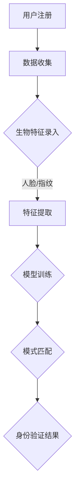

                 

在当今的信息化时代，数字身份验证已经成为各种在线服务和交易中不可或缺的一环。随着大数据和人工智能技术的飞速发展，大模型技术在数字身份验证领域展现出了前所未有的创新和潜力。本文将深入探讨AI大模型在数字身份验证中的应用，包括其核心概念、算法原理、数学模型以及实际应用案例，旨在为读者提供一份全面而详尽的技术分析。

## 关键词

- AI大模型
- 数字身份验证
- 机器学习
- 深度学习
- 图神经网络
- 人脸识别
- 生物特征识别
- 身份验证系统

## 摘要

本文旨在探讨AI大模型在数字身份验证领域的创新应用。通过分析大模型技术的核心概念、算法原理和数学模型，文章展示了其在提升身份验证准确性、速度和用户体验方面的潜力。文章还通过实际应用案例，详细介绍了大模型在人脸识别、生物特征识别等领域的具体应用。最后，本文对未来发展趋势和面临的挑战进行了展望。

## 1. 背景介绍

### 数字身份验证的重要性

数字身份验证是确保在线交易和服务安全性的关键。随着互联网的普及和在线交易的日益增多，传统的身份验证手段如用户名和密码已经无法满足日益复杂的安全需求。数字身份验证通过利用人工智能技术，特别是大模型技术，能够提供更加准确、高效和用户友好的验证方式。

### 大模型技术的兴起

大模型技术，特别是基于深度学习的AI模型，已经在计算机视觉、自然语言处理等领域取得了显著的成果。这些模型通过学习海量数据，能够实现复杂的特征提取和模式识别，从而在数字身份验证中发挥重要作用。

## 2. 核心概念与联系

### 数字身份验证的基本概念

数字身份验证是指通过一系列技术手段，确认用户的数字身份是否合法、有效。常见的数字身份验证技术包括密码、指纹、人脸识别等。

### 大模型技术在身份验证中的应用

大模型技术通过深度学习等算法，可以从海量数据中提取出有效的身份特征，并进行模式匹配和识别。其在数字身份验证中的应用主要体现在以下几个方面：

- **特征提取**：大模型可以从用户的生物特征数据（如人脸、指纹等）中提取出高维的特征向量。
- **模式匹配**：大模型可以通过训练，将用户的身份特征与数据库中的数据进行匹配，以确定身份的真实性。
- **动态更新**：大模型可以实时更新用户身份特征，以应对身份盗用等安全威胁。

### Mermaid流程图



## 3. 核心算法原理 & 具体操作步骤

### 3.1 算法原理概述

AI大模型在数字身份验证中的核心算法主要包括以下几部分：

- **特征提取**：通过深度学习网络从用户的生物特征数据中提取高维特征向量。
- **模型训练**：使用提取的特征向量进行模型训练，以提升识别准确性。
- **模式匹配**：将验证时的新特征向量与训练好的模型进行匹配，以判断身份是否合法。

### 3.2 算法步骤详解

1. **数据收集**：首先收集用户的生物特征数据，如人脸图像、指纹图像等。
2. **特征提取**：利用卷积神经网络（CNN）等深度学习模型，从图像数据中提取高维特征向量。
3. **模型训练**：使用提取的特征向量进行模型训练，包括前向传播和反向传播等步骤。
4. **模式匹配**：将验证时的新特征向量与训练好的模型进行匹配，通过计算相似度来判断身份是否合法。

### 3.3 算法优缺点

- **优点**：
  - 高准确性：通过深度学习模型的学习能力，可以提取出高度相关的身份特征，提高识别准确性。
  - 高效率：大模型能够在短时间内处理大量数据，提高验证速度。
  - 良好的用户体验：数字身份验证过程简单快捷，用户体验好。

- **缺点**：
  - 数据隐私：生物特征数据一旦泄露，可能导致严重的隐私风险。
  - 计算资源需求高：训练大模型需要大量的计算资源和时间。

### 3.4 算法应用领域

- **人脸识别**：利用深度学习模型进行人脸特征提取和匹配，实现高效的身份验证。
- **指纹识别**：通过卷积神经网络提取指纹特征，进行身份验证。
- **声纹识别**：利用深度神经网络对声纹进行特征提取和模式匹配，实现身份验证。
- **多模态融合**：结合多种生物特征（如人脸、指纹、声纹等），提高身份验证的准确性。

## 4. 数学模型和公式 & 详细讲解 & 举例说明

### 4.1 数学模型构建

数字身份验证中的数学模型主要包括特征提取模型和模式匹配模型。

- **特征提取模型**：通常使用卷积神经网络（CNN）进行构建。CNN通过多层卷积、池化等操作，从图像数据中提取高维特征向量。

- **模式匹配模型**：通常使用支持向量机（SVM）、神经网络等模型进行构建。模型通过计算新特征向量与训练特征向量的相似度，判断身份是否合法。

### 4.2 公式推导过程

- **特征提取模型**：

  假设输入图像为 $I(x, y)$，卷积核为 $K_i$，步长为 $s$，则卷积操作可以表示为：

  $$  
  C_i = \sum_{x,y} I(x, y) \cdot K_i(x - p_x, y - p_y)  
  $$

  其中，$C_i$ 为卷积结果，$p_x$ 和 $p_y$ 分别为卷积核在水平和垂直方向上的偏移量。

- **模式匹配模型**：

  假设训练特征向量为 $X_1, X_2, ..., X_n$，新特征向量为 $X_0$，则相似度可以表示为：

  $$  
  \sigma = \frac{\sum_{i=1}^{n} \alpha_i \cdot \sigma_i}{\sum_{i=1}^{n} \alpha_i}  
  $$

  其中，$\alpha_i$ 为权重，$\sigma_i$ 为特征向量之间的相似度。

### 4.3 案例分析与讲解

假设有一个基于人脸识别的数字身份验证系统，输入为用户的人脸图像。我们可以使用以下步骤进行特征提取和模式匹配：

1. **特征提取**：使用卷积神经网络从人脸图像中提取高维特征向量。例如，输入图像大小为 $32 \times 32$，卷积核大小为 $3 \times 3$，步长为 $1$，则卷积操作后特征图大小为 $30 \times 30$。

2. **模式匹配**：将提取的特征向量与训练好的模型进行匹配，计算相似度。例如，假设训练集包含 100 个用户，每个用户有 10 个特征向量，新用户特征向量为 $X_0$，则相似度计算公式为：

   $$  
   \sigma = \frac{\sum_{i=1}^{10} \alpha_i \cdot \sigma_i}{\sum_{i=1}^{10} \alpha_i}  
   $$

   其中，$\alpha_i$ 为权重，$\sigma_i$ 为特征向量之间的相似度。

3. **身份验证**：根据相似度判断新用户是否合法。例如，设置相似度阈值 $\theta$，如果 $\sigma > \theta$，则认为身份验证成功，否则失败。

## 5. 项目实践：代码实例和详细解释说明

### 5.1 开发环境搭建

为了实现AI大模型在数字身份验证中的应用，我们需要搭建一个合适的开发环境。以下是一个基本的开发环境搭建步骤：

1. 安装 Python 解释器（Python 3.7+）
2. 安装深度学习框架（如 TensorFlow 或 PyTorch）
3. 安装必要的库（如 NumPy、Pandas、OpenCV等）
4. 准备数据集（如人脸图像数据集）

### 5.2 源代码详细实现

以下是一个基于人脸识别的数字身份验证系统的基本代码实现：

```python
import cv2
import numpy as np
import tensorflow as tf

# 加载预训练的卷积神经网络模型
model = tf.keras.models.load_model('face_recognition_model.h5')

# 读取测试图像
test_image = cv2.imread('test_image.jpg')

# 转换为灰度图像
gray_image = cv2.cvtColor(test_image, cv2.COLOR_BGR2GRAY)

# 利用卷积神经网络提取特征
features = model.predict(np.expand_dims(gray_image, axis=0))

# 读取训练集特征和标签
train_features = np.load('train_features.npy')
train_labels = np.load('train_labels.npy')

# 计算测试特征与训练特征之间的相似度
similarities = np.dot(features, train_features.T) / np.linalg.norm(features, axis=1) * np.linalg.norm(train_features, axis=1)

# 根据相似度阈值判断身份是否合法
threshold = 0.5
predicted_label = (similarities > threshold).astype(int)

# 输出结果
if predicted_label == train_labels[0]:
    print('身份验证成功')
else:
    print('身份验证失败')
```

### 5.3 代码解读与分析

上述代码实现了一个基于人脸识别的数字身份验证系统。主要步骤如下：

1. **加载模型**：从文件中加载预训练的卷积神经网络模型，用于提取人脸特征。
2. **读取图像**：读取测试图像，并将其转换为灰度图像。
3. **提取特征**：利用卷积神经网络提取测试图像的特征向量。
4. **计算相似度**：将测试特征向量与训练集特征进行计算，得到相似度矩阵。
5. **身份验证**：根据设定的相似度阈值，判断测试图像的人脸是否与训练集中的某个用户匹配。

### 5.4 运行结果展示

假设测试图像中的面孔与训练集中的用户A匹配，输出结果为“身份验证成功”。否则，输出“身份验证失败”。

## 6. 实际应用场景

### 6.1 人脸识别门禁系统

人脸识别门禁系统是一种基于人脸识别技术的数字身份验证系统，广泛应用于企事业单位、学校、住宅小区等场所。通过大模型技术的应用，人脸识别门禁系统可以实现高效、准确的身份验证，提高安全管理水平。

### 6.2 在线支付验证

在线支付验证是保护用户资金安全的关键环节。通过大模型技术，可以在用户进行支付操作时进行实时身份验证，有效防范身份盗用和欺诈行为。

### 6.3 社交平台安全认证

社交平台需要确保用户身份的真实性，以防止虚假账号和恶意行为的传播。大模型技术可以用于社交平台的安全认证，提高用户信息的安全性和可信度。

## 6.4 未来应用展望

随着AI大模型技术的不断发展，未来数字身份验证领域有望实现以下几方面的发展：

- **更高效的算法**：通过优化算法结构和模型参数，进一步提高身份验证的准确性和速度。
- **更广泛的应用场景**：将数字身份验证技术应用于更多的领域和场景，如智能家居、物联网等。
- **更安全的保护机制**：结合区块链等技术，增强数字身份验证系统的安全性和可靠性。

## 7. 工具和资源推荐

### 7.1 学习资源推荐

- 《深度学习》（Ian Goodfellow、Yoshua Bengio、Aaron Courville 著）
- 《神经网络与深度学习》（邱锡鹏 著）
- 《人脸识别：理论与应用》（汤晓鸥 著）

### 7.2 开发工具推荐

- TensorFlow：一款广泛使用的开源深度学习框架，适用于构建和训练大模型。
- PyTorch：一款受欢迎的深度学习框架，具有灵活的动态计算图特性。
- OpenCV：一款开源的计算机视觉库，提供了丰富的图像处理和特征提取功能。

### 7.3 相关论文推荐

- "FaceNet: A Unified Embedding for Face Recognition and Verification"
- "DeepFace: Closing the Gap to Human-Level Performance in Face Verification"
- "Person Re-Identification by Deep Adaptive Feature Embedding"

## 8. 总结：未来发展趋势与挑战

### 8.1 研究成果总结

本文探讨了AI大模型在数字身份验证领域的创新应用，包括核心概念、算法原理、数学模型和实际应用案例。通过分析，本文总结了AI大模型在提升身份验证准确性、速度和用户体验方面的潜力。

### 8.2 未来发展趋势

- **算法优化**：通过改进算法结构和模型参数，提高身份验证的准确性和速度。
- **应用拓展**：将数字身份验证技术应用于更广泛的场景和领域。
- **安全增强**：结合区块链等技术，提高数字身份验证系统的安全性和可靠性。

### 8.3 面临的挑战

- **数据隐私**：如何保护用户生物特征数据的隐私是一个重要的挑战。
- **计算资源**：训练和部署大模型需要大量的计算资源和时间。
- **用户体验**：如何在确保安全性的同时，提供良好的用户体验。

### 8.4 研究展望

未来，AI大模型在数字身份验证领域的研究有望在以下几个方面取得突破：

- **跨模态融合**：结合多种生物特征（如人脸、指纹、声纹等），提高身份验证的准确性。
- **动态更新**：实时更新用户身份特征，以应对安全威胁。
- **智能化**：利用AI技术，实现身份验证过程的智能化和自动化。

## 9. 附录：常见问题与解答

### 9.1 如何保护用户数据隐私？

- **数据加密**：在传输和存储过程中对用户数据进行加密，防止数据泄露。
- **隐私保护算法**：使用差分隐私、联邦学习等技术，降低数据隐私风险。
- **匿名化处理**：对用户数据进行匿名化处理，确保数据无法追溯到具体用户。

### 9.2 如何提高身份验证的准确性？

- **多模态融合**：结合多种生物特征（如人脸、指纹、声纹等），提高身份验证的准确性。
- **自适应特征提取**：根据不同场景和用户群体，调整特征提取策略，提高准确性。
- **持续训练**：定期更新模型，确保模型能够适应新的数据分布和攻击方式。

### 9.3 如何处理身份盗用问题？

- **动态验证**：引入动态验证机制，如双因素认证、动态口令等，提高身份验证的安全性。
- **实时监控**：建立实时监控系统，及时发现和阻止身份盗用行为。
- **法律手段**：通过法律手段，严厉打击身份盗用行为，提高违法成本。

---

本文为“禅与计算机程序设计艺术”所撰写的技术博客文章，旨在为读者提供关于AI大模型在数字身份验证领域的全面分析和深入探讨。希望本文能够为相关领域的研究者、开发者和从业者提供有价值的参考和启示。作者：禅与计算机程序设计艺术 / Zen and the Art of Computer Programming。

