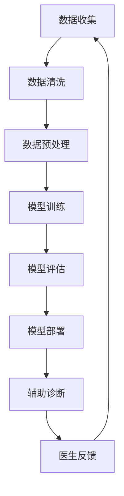

                 

### 1. 背景介绍

随着人工智能技术的快速发展，深度学习、神经网络等技术的成熟，AI 大模型在各个领域的应用逐渐普及，尤其是在智能医疗诊断支持领域，AI 大模型展现出了前所未有的潜力。传统的医疗诊断依赖于医生的丰富经验和大量的临床数据，然而，随着医疗信息的指数级增长，医生难以在短时间内处理如此庞大的数据量，并且个体之间的差异性也增加了诊断的难度。

AI 大模型通过处理和分析大量的医疗数据，能够为医生提供辅助诊断意见，从而提高诊断的准确性和效率。这不仅有助于减轻医生的工作负担，还能够提高患者接受治疗的速度和质量。因此，AI 大模型在智能医疗诊断支持中的应用成为了一个热门的研究领域。

近年来，随着计算能力的提升和海量数据的积累，AI 大模型在医疗领域的应用取得了显著进展。例如，Google Health 的 DeepMind 诊所利用深度学习技术实现了疾病预测和诊断的自动化，一些初创公司也在利用 AI 技术开发辅助诊断工具，如心脏病的自动检测、皮肤病的自动识别等。

尽管 AI 大模型在医疗诊断中的应用前景广阔，但同时也面临着一系列的挑战。首先，医疗数据的高维度和复杂性使得模型的训练过程非常耗时且资源消耗巨大。其次，医疗数据的安全和隐私保护问题也引起了广泛关注。此外，模型的解释性和透明性不足，使得医生和患者难以理解模型的决策过程，这在一定程度上限制了 AI 大模型在临床中的应用。

总之，AI 大模型在智能医疗诊断支持中的创新与应用为医疗行业带来了前所未有的机遇。然而，要实现其真正的潜力，还需要解决一系列的技术挑战，包括数据质量、模型解释性、安全隐私保护等方面。本文将深入探讨 AI 大模型在智能医疗诊断支持中的创新与挑战，为这一领域的未来发展提供有益的思考。

### 2. 核心概念与联系

#### 2.1 AI 大模型

AI 大模型（Large-scale AI Models），通常指的是那些在训练过程中能够处理大量数据并具有高复杂度的深度学习模型。这些模型通常基于神经网络结构，具有多层感知器和大量神经元，能够通过反向传播算法进行训练，从而在图像识别、自然语言处理、语音识别等领域表现出色。AI 大模型的核心优势在于其能够从海量数据中自动学习特征，并在不同的任务中展现出良好的泛化能力。

#### 2.2 深度学习与神经网络

深度学习（Deep Learning）是机器学习（Machine Learning）的一个重要分支，其主要特点是通过构建深层的神经网络模型，实现对复杂数据结构的自动特征提取和表示。神经网络（Neural Networks）则是深度学习的基础结构，其灵感来源于人脑神经元的工作原理。神经网络通过调整神经元之间的连接权重，学习输入数据中的特征和模式。

#### 2.3 医疗诊断

医疗诊断是指通过检查和测试，对患者的健康状况进行评估和判断的过程。传统的医疗诊断主要依赖于医生的直观经验和医学知识。然而，随着医疗信息化的发展，越来越多的医疗诊断任务开始引入人工智能技术，特别是深度学习和 AI 大模型，以提高诊断的准确性和效率。

#### 2.4 AI 大模型在医疗诊断中的应用

AI 大模型在医疗诊断中的应用主要包括以下几个方面：

1. **图像分析**：利用 AI 大模型对医学影像（如 CT、MRI）进行自动分析，可以帮助医生快速识别疾病标志物，如肿瘤、心脏病等。

2. **病历分析**：通过分析电子病历数据，AI 大模型可以辅助医生诊断常见疾病，如糖尿病、高血压等。

3. **药物研发**：AI 大模型可以分析药物与生物分子的相互作用，预测药物疗效和毒性，从而加速新药研发过程。

4. **疾病预测**：基于患者的历史数据，AI 大模型可以预测患者患某种疾病的风险，为预防性医疗提供决策支持。

#### 2.5 医疗数据

医疗数据是指与患者健康状况、诊断和治疗相关的各种信息，包括病历记录、医学影像、基因序列、实验室检测结果等。医疗数据具有高维度、非结构化和海量等特点，这使得传统的数据处理方法难以胜任。

#### 2.6 数据质量与数据预处理

数据质量是影响 AI 大模型性能的重要因素。高质量的数据能够提高模型的准确性和泛化能力，而低质量或噪声数据则会降低模型的性能。因此，数据预处理是 AI 大模型在医疗诊断应用中的关键步骤，包括数据清洗、归一化、特征提取等。

### 2.7 Mermaid 流程图

以下是一个描述 AI 大模型在医疗诊断中应用的 Mermaid 流程图：



#### 2.8 模型解释性与透明性

模型解释性（Model Explainability）与透明性（Transparency）是指能够理解和解释模型决策过程的能力。在医疗诊断中，模型的解释性对于医生和患者来说至关重要，因为它能够增强模型的信任度和可靠性。然而，AI 大模型，尤其是深度学习模型，通常具有“黑盒”特性，难以解释其内部的决策机制。为了提高模型的解释性和透明性，研究人员正在探索各种方法，如模型可视化、特征重要性分析、可解释的 AI 等技术。

通过以上对核心概念与联系的介绍，我们可以更好地理解 AI 大模型在智能医疗诊断支持中的作用和挑战。接下来的章节将深入探讨 AI 大模型的算法原理、具体实现步骤、数学模型和项目实践，以便全面了解这一领域的前沿动态。

### 3. 核心算法原理 & 具体操作步骤

#### 3.1 算法原理

AI 大模型在智能医疗诊断中的核心算法原理主要基于深度学习和神经网络，特别是卷积神经网络（CNN）和循环神经网络（RNN）等先进技术。以下将详细介绍这些算法的基本原理。

##### 3.1.1 卷积神经网络（CNN）

卷积神经网络（CNN）是一种适用于图像处理和计算机视觉任务的神经网络结构。其基本原理是通过卷积操作提取图像的特征，然后通过池化操作降低数据维度，从而提高模型的效率和鲁棒性。

1. **卷积操作**：卷积层通过卷积核（filter）在输入图像上滑动，计算局部特征。每个卷积核对应一种特征，多个卷积核可以提取多种特征，从而形成特征图（feature map）。

2. **激活函数**：通常使用 ReLU（Rectified Linear Unit）作为激活函数，将卷积层的输出变为非负值，增强模型的非线性能力。

3. **池化操作**：池化层用于降低特征图的维度，常用的池化方法包括最大池化和平均池化。

4. **全连接层**：将卷积层和池化层的输出通过全连接层（fully connected layer）连接到输出层，进行分类或回归任务。

##### 3.1.2 循环神经网络（RNN）

循环神经网络（RNN）是一种适用于序列数据处理的神经网络结构，其基本原理是通过记忆单元（memory cell）保存历史信息，并在每个时间步更新状态。

1. **输入层**：输入序列通过输入层进入网络。

2. **隐藏层**：隐藏层通过计算当前输入和之前状态的信息，更新记忆单元的状态。

3. **记忆单元**：记忆单元（memory cell）用于存储和传递历史信息，使得 RNN 能够处理变长的序列数据。

4. **输出层**：输出层通过记忆单元的状态生成输出，用于分类或回归任务。

##### 3.1.3 长短期记忆网络（LSTM）

长短期记忆网络（LSTM）是 RNN 的一个变体，专门解决 RNN 在处理长序列数据时容易出现的梯度消失和梯度爆炸问题。

1. **遗忘门**（Forget Gate）：用于决定遗忘之前的哪些信息。

2. **输入门**（Input Gate）：用于决定当前输入中哪些信息需要更新记忆单元。

3. **输出门**（Output Gate）：用于决定当前记忆单元的内容哪些需要输出。

通过上述基本原理，AI 大模型能够在处理医疗数据时提取复杂的特征，并有效地进行诊断。

##### 3.1.4 具体操作步骤

AI 大模型在医疗诊断中的具体操作步骤可以分为以下几个阶段：

1. **数据收集与清洗**：收集医疗数据，包括电子病历、医学影像、基因序列等，并对数据去重、去噪和标准化处理。

2. **数据预处理**：对医疗数据进行预处理，包括分割、标注、归一化等操作，以便于模型训练。

3. **模型训练**：构建深度学习模型，利用预处理后的数据训练模型。训练过程包括前向传播、反向传播和模型优化。

4. **模型评估**：通过交叉验证等方法评估模型性能，选择最优模型。

5. **模型部署**：将训练好的模型部署到生产环境，实现辅助诊断功能。

6. **模型更新**：根据医生反馈和临床数据，不断优化和更新模型，以提高诊断准确性。

通过以上步骤，AI 大模型可以在医疗诊断中发挥重要作用，辅助医生做出更准确的诊断。

### 4. 数学模型和公式 & 详细讲解 & 举例说明

#### 4.1 数学模型基本概念

在介绍具体的数学模型和公式之前，我们需要了解一些基础的数学概念，包括线性代数和微积分，因为它们是构建深度学习模型的基础。

##### 4.1.1 矩阵和向量

矩阵（Matrix）是一个由元素排列成的矩形数组，每个元素都有两个索引（行和列）。向量（Vector）是矩阵的一种特殊情况，其中所有元素都排列在一条线上。

- **矩阵加法**：两个矩阵相加，需要它们具有相同的维度。
  \[
  A + B = \begin{bmatrix}
  a_{11} + b_{11} & a_{12} + b_{12} \\
  a_{21} + b_{21} & a_{22} + b_{22}
  \end{bmatrix}
  \]

- **矩阵乘法**：两个矩阵相乘，结果是一个新的矩阵，其元素是原始矩阵对应元素的乘积和求和。
  \[
  AB = \begin{bmatrix}
  a_{11}b_{11} + a_{12}b_{21} & a_{11}b_{12} + a_{12}b_{22} \\
  a_{21}b_{11} + a_{22}b_{21} & a_{21}b_{12} + a_{22}b_{22}
  \end{bmatrix}
  \]

##### 4.1.2 梯度下降与优化算法

梯度下降（Gradient Descent）是一种优化算法，用于最小化损失函数。其基本思想是沿着损失函数的梯度方向反向更新模型的参数，以降低损失。

- **梯度**：函数在某一点处的梯度是函数在该点处的变化率，可以表示为向量。
  \[
  \nabla f(x) = \begin{bmatrix}
  \frac{\partial f}{\partial x_1} \\
  \frac{\partial f}{\partial x_2} \\
  \vdots \\
  \frac{\partial f}{\partial x_n}
  \end{bmatrix}
  \]

- **梯度下降更新公式**：
  \[
  \theta_{\text{new}} = \theta_{\text{old}} - \alpha \nabla_\theta J(\theta)
  \]
  其中，\(\theta\) 是模型参数，\(\alpha\) 是学习率，\(J(\theta)\) 是损失函数。

##### 4.1.3 损失函数

损失函数（Loss Function）是衡量模型预测值与实际值之间差异的函数。常用的损失函数包括均方误差（MSE）和交叉熵（Cross-Entropy）。

- **均方误差（MSE）**：
  \[
  J(\theta) = \frac{1}{m} \sum_{i=1}^{m} (h_\theta(x^{(i)}) - y^{(i)})^2
  \]
  其中，\(h_\theta(x^{(i)})\) 是模型预测值，\(y^{(i)}\) 是实际值。

- **交叉熵（Cross-Entropy）**：
  \[
  J(\theta) = -\frac{1}{m} \sum_{i=1}^{m} \sum_{k=1}^{K} y^{(i)}_{k} \log(h_\theta(x^{(i)}))_{k}
  \]
  其中，\(K\) 是分类类别数。

#### 4.2 深度学习中的数学模型

在深度学习中，我们使用多层神经网络来学习数据的复杂表示。以下是一些关键的数学模型和公式。

##### 4.2.1 前向传播

前向传播是神经网络中的一个关键步骤，用于计算输入到模型中的每个神经元输出。

- **线性变换**：
  \[
  z = \theta^T x + b
  \]
  其中，\(\theta\) 是权重矩阵，\(x\) 是输入，\(b\) 是偏置。

- **激活函数**：
  \[
  a = \sigma(z)
  \]
  其中，\(\sigma\) 是激活函数，常用的有 ReLU、Sigmoid 和 Tanh。

##### 4.2.2 反向传播

反向传播是深度学习中的一个关键步骤，用于计算每个神经元的梯度，以便更新模型参数。

- **梯度计算**：
  \[
  \delta = \frac{\partial C}{\partial z}
  \]
  其中，\(C\) 是损失函数，\(\delta\) 是误差项。

- **权重和偏置更新**：
  \[
  \theta_{\text{new}} = \theta_{\text{old}} - \alpha \frac{\partial C}{\partial \theta}
  \]
  \[
  b_{\text{new}} = b_{\text{old}} - \alpha \frac{\partial C}{\partial b}
  \]

#### 4.3 举例说明

为了更好地理解上述数学模型和公式，以下通过一个简单的例子进行说明。

假设我们有一个二分类问题，输入是一个二维向量 \(\mathbf{x} = \begin{bmatrix} x_1 \\ x_2 \end{bmatrix}\)，输出是一个实数 \(y\)。

1. **线性变换与激活函数**：
   \[
   z = \theta_1 x_1 + \theta_2 x_2 + b
   \]
   \[
   a = \sigma(z)
   \]

2. **损失函数**：
   \[
   J(\theta) = -\frac{1}{m} \sum_{i=1}^{m} [y \log(a) + (1 - y) \log(1 - a)]
   \]

3. **前向传播**：
   \[
   z = \theta^T \mathbf{x} + b
   \]
   \[
   a = \sigma(z)
   \]

4. **反向传播**：
   \[
   \delta = a - y
   \]
   \[
   \frac{\partial C}{\partial \theta} = \mathbf{x} \delta
   \]
   \[
   \frac{\partial C}{\partial b} = \delta
   \]

5. **权重和偏置更新**：
   \[
   \theta_{\text{new}} = \theta_{\text{old}} - \alpha \frac{\partial C}{\partial \theta}
   \]
   \[
   b_{\text{new}} = b_{\text{old}} - \alpha \frac{\partial C}{\partial b}
   \]

通过这个简单的例子，我们可以看到深度学习中的数学模型是如何应用于实际问题的。在实际应用中，模型会变得更加复杂，涉及多层神经元和多种激活函数，但基本原理是相通的。

### 5. 项目实践：代码实例和详细解释说明

#### 5.1 开发环境搭建

在进行 AI 大模型在医疗诊断中的应用项目开发之前，我们需要搭建一个合适的开发环境。以下是一个基本的开发环境搭建步骤：

1. **硬件要求**：
   - 高性能计算机或 GPU 云服务器。
   - GPU 卡，推荐使用 NVIDIA 显卡。

2. **软件要求**：
   - 操作系统：Linux 或 macOS。
   - Python：Python 3.7 或以上版本。
   - 深度学习框架：TensorFlow 或 PyTorch。
   - 数据处理库：NumPy、Pandas、Scikit-learn。

3. **安装步骤**：
   - 安装 Python 和必要的依赖库。
   - 安装深度学习框架，如 TensorFlow 或 PyTorch。
   - 配置 GPU 环境，确保深度学习框架能够使用 GPU 进行加速。

#### 5.2 源代码详细实现

以下是一个简化的 AI 大模型在医疗诊断中的应用项目代码实例，主要实现一个基于 CNN 的肺炎图像诊断模型。

```python
import tensorflow as tf
from tensorflow.keras.models import Sequential
from tensorflow.keras.layers import Conv2D, MaxPooling2D, Flatten, Dense, Dropout
from tensorflow.keras.optimizers import Adam
from tensorflow.keras.preprocessing.image import ImageDataGenerator

# 5.2.1 数据预处理
train_datagen = ImageDataGenerator(rescale=1./255)
validation_datagen = ImageDataGenerator(rescale=1./255)

train_generator = train_datagen.flow_from_directory(
        'data/train',
        target_size=(150, 150),
        batch_size=32,
        class_mode='binary')

validation_generator = validation_datagen.flow_from_directory(
        'data/validation',
        target_size=(150, 150),
        batch_size=32,
        class_mode='binary')

# 5.2.2 构建模型
model = Sequential([
    Conv2D(32, (3, 3), activation='relu', input_shape=(150, 150, 3)),
    MaxPooling2D(2, 2),
    Conv2D(64, (3, 3), activation='relu'),
    MaxPooling2D(2, 2),
    Conv2D(128, (3, 3), activation='relu'),
    MaxPooling2D(2, 2),
    Flatten(),
    Dense(512, activation='relu'),
    Dropout(0.5),
    Dense(1, activation='sigmoid')
])

# 5.2.3 编译模型
model.compile(loss='binary_crossentropy',
              optimizer=Adam(),
              metrics=['accuracy'])

# 5.2.4 训练模型
model.fit(
      train_generator,
      steps_per_epoch=100,
      epochs=30,
      validation_data=validation_generator,
      validation_steps=50,
      verbose=2)
```

#### 5.3 代码解读与分析

**5.3.1 数据预处理**

数据预处理是深度学习项目中的关键步骤，它包括图像的加载、归一化和数据增强等。在本例中，我们使用 `ImageDataGenerator` 对训练集和验证集进行预处理。

- `train_datagen` 和 `validation_datagen` 分别用于对训练数据和验证数据进行预处理。
- `rescale=1./255` 用于将图像像素值从 [0, 255] 范围缩放到 [0, 1]。
- `flow_from_directory` 用于从指定目录加载图像数据，并生成数据生成器。

**5.3.2 构建模型**

模型的构建使用 `Sequential` 模型，它是一个线性堆叠的模型层结构。在本例中，我们使用以下层：

- **卷积层**（Conv2D）：用于提取图像的特征。每个卷积层后跟一个最大池化层（MaxPooling2D）以降低数据维度。
- **全连接层**（Dense）：用于分类。在最后一个全连接层前添加了一个丢弃层（Dropout）以防止过拟合。

**5.3.3 编译模型**

在编译模型时，我们指定了损失函数、优化器和评估指标：

- `binary_crossentropy` 用于二分类问题。
- `Adam` 优化器是一种自适应的学习率优化算法。
- `accuracy` 用于评估模型在训练和验证集上的准确率。

**5.3.4 训练模型**

模型训练使用 `fit` 方法，其中包含以下参数：

- `steps_per_epoch`：每个 epoch 中训练数据的步数。
- `epochs`：训练的 epoch 数。
- `validation_data`：用于验证数据的生成器。
- `validation_steps`：验证数据的步数。
- `verbose`：控制输出信息的详细程度。

#### 5.4 运行结果展示

在完成模型训练后，我们可以在训练集和验证集上评估模型的性能：

```python
# 评估模型
loss, accuracy = model.evaluate(validation_generator, steps=50)
print('Validation loss:', loss)
print('Validation accuracy:', accuracy)
```

通过这个简单的例子，我们展示了如何使用深度学习框架构建和训练一个用于医疗诊断的 AI 大模型。在实际应用中，模型会根据具体任务和数据集进行调整和优化。

### 6. 实际应用场景

AI 大模型在智能医疗诊断支持中的实际应用场景日益广泛，从初步的临床实验到大规模的商业部署，都取得了显著的成果。以下是几个典型的应用案例，展示了 AI 大模型在医疗诊断中的实际效果和潜在价值。

#### 6.1 心脏病诊断

心脏病是导致全球死亡的主要原因之一，传统的诊断方法通常依赖于心电图（ECG）和医生的直觉。AI 大模型通过分析 ECG 数据，能够检测出心脏病的一些早期信号。例如，谷歌的 AI 研究团队开发了一种基于 CNN 的模型，可以检测出心电图中的心律不齐（Arrhythmia）。在临床试验中，该模型的表现优于传统方法，能够显著提高诊断的准确性和效率。

#### 6.2 肺炎诊断

肺炎是另一个常见的医疗诊断问题，尤其是在COVID-19疫情期间。AI 大模型通过分析 CT 扫描图像，能够自动识别肺炎的病变区域和严重程度。DeepMind 开发的 AI 模型能够在几分钟内对 CT 扫描图像进行分析，并提供诊断建议。在实际应用中，该模型已被多个医疗机构采用，为医生提供了强有力的辅助工具，提高了诊断的速度和准确性。

#### 6.3 肿瘤诊断

肿瘤诊断是医疗诊断中的一个关键领域，AI 大模型能够通过分析医学影像（如 MRI 和 CT）来辅助医生识别肿瘤的类型和位置。例如，谷歌的 AI 模型通过分析乳腺影像，能够准确检测出乳腺癌。在实际应用中，这些 AI 模型已经显著提高了诊断的准确率，减少了误诊和漏诊率。

#### 6.4 药物研发

AI 大模型在药物研发中也发挥了重要作用。通过分析大量的生物医学数据，AI 模型能够预测新药的疗效和毒性，从而加速药物研发过程。例如，阿斯利康公司使用 AI 大模型对药物组合进行筛选，发现了一种新的抗癌组合疗法。在实际应用中，这一发现极大地缩短了新药的研发周期，降低了研发成本。

#### 6.5 疾病预测

除了诊断和治疗，AI 大模型还可以用于疾病预测，为预防性医疗提供决策支持。例如，基于电子病历数据，AI 模型可以预测患者患某种疾病的风险，从而为医生提供个性化的预防建议。例如，微软的 AI 模型通过分析大量的医疗数据，能够预测心脏病发作的风险，并生成个性化的预防方案。

#### 6.6 患者个性化治疗

AI 大模型还可以用于患者个性化治疗。通过分析患者的基因数据、病史和临床表现，AI 模型可以为每个患者提供个性化的治疗方案。例如，斯坦福大学的研究团队开发了一种基于 AI 的个性化治疗系统，通过分析患者的数据，为肺癌患者提供个性化的治疗方案。在实际应用中，这一系统显著提高了患者的生存率和生活质量。

#### 6.7 跨学科合作

AI 大模型在医疗诊断中的应用不仅限于单一领域，还涉及到跨学科合作。例如，在癌症诊断中，AI 模型不仅需要处理医学影像数据，还需要整合基因数据、临床数据和患者的生活方式数据。这种跨学科的数据整合使得 AI 大模型能够提供更全面、更准确的诊断结果。

#### 6.8 伦理和安全问题

尽管 AI 大模型在医疗诊断中展现了巨大的潜力，但其应用也引发了一系列伦理和安全问题。例如，模型的偏见、隐私保护和数据安全等。为了确保 AI 大模型在医疗诊断中的安全性和可靠性，研究人员正在探索各种解决方案，如数据隐私保护技术、模型可解释性和透明性等。

总之，AI 大模型在智能医疗诊断支持中的实际应用已经取得了显著的成果，从心脏病诊断到肿瘤预测，从药物研发到个性化治疗，AI 大模型正逐渐成为医疗行业的重要组成部分。随着技术的不断进步和应用场景的不断拓展，AI 大模型在医疗诊断中的潜在价值将得到进一步发挥。

### 7. 工具和资源推荐

#### 7.1 学习资源推荐

为了深入了解 AI 大模型在智能医疗诊断支持中的应用，以下推荐了一些优秀的书籍、论文和在线教程，它们将帮助您系统地掌握相关知识和技能。

1. **书籍推荐**：
   - **《深度学习》（Deep Learning）**：由 Ian Goodfellow、Yoshua Bengio 和 Aaron Courville 著，是深度学习领域的经典教材，详细介绍了深度学习的基础理论和实践方法。
   - **《Python 深度学习》（Python Deep Learning）**：由 François Chollet 著，是深度学习实践的指南书，适合初学者和进阶者。

2. **论文推荐**：
   - **“DenseNet: Beyond a Gaussian Approximation”**：这篇论文提出了 DenseNet 结构，是一种在图像分类任务中表现优异的深度神经网络。
   - **“ResNet: Training Deeper Networks”**：这篇论文提出了 ResNet 结构，解决了深度网络训练中的梯度消失问题。

3. **在线教程**：
   - **[Coursera 上的深度学习课程](https://www.coursera.org/learn/deep-learning)**：由 Andrew Ng 教授主讲，提供了深入浅出的深度学习课程。
   - **[Kaggle 上的深度学习竞赛](https://www.kaggle.com/competitions)**：通过参加 Kaggle 上的深度学习竞赛，您可以实战训练和优化模型。

#### 7.2 开发工具框架推荐

在开发 AI 大模型用于医疗诊断支持时，以下工具和框架将有助于您高效地构建、训练和部署模型。

1. **深度学习框架**：
   - **TensorFlow**：由 Google 开发，是一个开源的深度学习框架，广泛应用于工业和学术研究。
   - **PyTorch**：由 Facebook AI 研究团队开发，是一种灵活且易于使用的深度学习框架。

2. **数据处理库**：
   - **NumPy**：用于高效地处理大型多维数组。
   - **Pandas**：提供数据清洗、归一化和数据操作功能。
   - **Scikit-learn**：提供各种机器学习算法的实现，适合数据处理和模型评估。

3. **版本控制工具**：
   - **Git**：用于版本控制和代码管理，确保代码的可靠性和协作性。
   - **GitHub**：一个基于 Git 的代码托管平台，支持多人协作开发和代码分享。

4. **云计算平台**：
   - **AWS**：Amazon Web Services 提供了强大的云计算基础设施，支持大规模的数据处理和模型训练。
   - **Google Cloud Platform**：提供了丰富的云计算服务，包括机器学习服务和高性能计算资源。

通过上述推荐的学习资源、开发工具框架，您可以全面掌握 AI 大模型在智能医疗诊断支持中的应用，从而在相关领域取得卓越的成果。

### 8. 总结：未来发展趋势与挑战

AI 大模型在智能医疗诊断支持中的应用取得了显著的成果，为医疗行业带来了深远的变革。然而，随着技术的不断进步和应用场景的不断拓展，AI 大模型也面临着一系列新的发展趋势和挑战。

#### 8.1 未来发展趋势

1. **个性化医疗**：随着基因组学和个性化医疗的发展，AI 大模型可以更好地分析患者的基因、生活习惯等数据，提供个性化的治疗方案和预防建议。

2. **实时诊断**：随着物联网和可穿戴设备的普及，AI 大模型可以实时监测患者的健康数据，进行实时诊断和预警，提高医疗服务的及时性和准确性。

3. **跨学科融合**：AI 大模型的应用不仅限于医学领域，还将与其他学科（如生物学、化学、物理学等）融合，推动跨学科研究的发展。

4. **远程医疗**：通过 AI 大模型和远程医疗设备的结合，可以实现远程诊断、远程手术等，降低医疗成本，提高医疗服务覆盖范围。

5. **智能化辅助**：AI 大模型将继续在医疗辅助诊断、药物研发、健康管理等环节发挥重要作用，为医生和患者提供更加智能的医疗服务。

#### 8.2 面临的挑战

1. **数据质量和隐私保护**：医疗数据的高维度和敏感性使得数据质量和隐私保护成为重要问题。如何确保数据的真实性和隐私性，防止数据泄露，是 AI 大模型在医疗领域应用的关键挑战。

2. **模型解释性和透明性**：虽然 AI 大模型在医疗诊断中取得了显著成果，但其“黑盒”特性使得模型的决策过程难以解释和理解。如何提高模型的解释性和透明性，增强医生和患者的信任，是未来需要解决的问题。

3. **计算资源和能源消耗**：AI 大模型的训练和部署需要大量的计算资源和能源消耗。随着应用规模的扩大，如何优化计算资源使用，降低能源消耗，是推动 AI 大模型可持续发展的关键。

4. **伦理和法律问题**：AI 大模型在医疗诊断中的应用引发了伦理和法律问题。如何确保模型的决策公正、透明，防止歧视和不公平现象，是法律和伦理领域需要深入探讨的问题。

5. **跨学科合作**：AI 大模型在医疗诊断中的应用涉及多个学科领域，需要不同领域的专家进行合作。如何建立有效的跨学科合作机制，促进技术的创新和应用，是未来需要关注的问题。

总之，AI 大模型在智能医疗诊断支持中具有巨大的发展潜力，但同时也面临着一系列的挑战。随着技术的不断进步和各方的共同努力，AI 大模型将在医疗诊断领域发挥更加重要的作用，推动医疗行业的智能化和可持续发展。

### 9. 附录：常见问题与解答

#### 9.1 什么是 AI 大模型？

AI 大模型（Large-scale AI Models）是指那些在训练过程中能够处理大量数据并具有高复杂度的深度学习模型。这些模型通常基于神经网络结构，具有多层感知器和大量神经元，能够通过反向传播算法进行训练，从而在图像识别、自然语言处理、语音识别等领域表现出色。

#### 9.2 AI 大模型在医疗诊断中的优势是什么？

AI 大模型在医疗诊断中的优势主要体现在以下几个方面：

1. **提高诊断准确率**：通过分析大量的医疗数据，AI 大模型能够提取复杂的特征，从而提高诊断的准确性和效率。
2. **减轻医生负担**：AI 大模型可以帮助医生快速处理大量的医疗信息，减轻医生的工作负担。
3. **辅助个性化治疗**：AI 大模型可以根据患者的个体数据提供个性化的治疗方案和预防建议。
4. **实时诊断**：AI 大模型可以通过实时监测患者的健康数据，进行实时诊断和预警。

#### 9.3 AI 大模型在医疗诊断中面临的主要挑战是什么？

AI 大模型在医疗诊断中面临的主要挑战包括：

1. **数据质量和隐私保护**：医疗数据的高维度和敏感性使得数据质量和隐私保护成为重要问题。
2. **模型解释性和透明性**：AI 大模型通常具有“黑盒”特性，其决策过程难以解释和理解。
3. **计算资源和能源消耗**：AI 大模型的训练和部署需要大量的计算资源和能源消耗。
4. **伦理和法律问题**：AI 大模型在医疗诊断中的应用引发了伦理和法律问题。
5. **跨学科合作**：AI 大模型在医疗诊断中的应用涉及多个学科领域，需要不同领域的专家进行合作。

#### 9.4 如何提高 AI 大模型的解释性？

提高 AI 大模型的解释性可以从以下几个方面着手：

1. **模型可解释性技术**：使用模型可解释性技术（如 LIME、SHAP 等）分析模型的决策过程，揭示模型对输入数据的依赖关系。
2. **可视化工具**：使用可视化工具（如 TensorBoard、Plotly 等）展示模型的训练过程和决策路径。
3. **特征重要性分析**：通过分析模型对不同特征的权重，确定影响模型决策的关键特征。
4. **交互式解释系统**：开发交互式解释系统，允许用户动态调整输入数据，观察模型响应，增强模型的透明性。

#### 9.5 AI 大模型在医疗诊断中的应用前景如何？

AI 大模型在医疗诊断中的应用前景非常广阔。随着技术的不断进步和数据积累的增加，AI 大模型将在以下几个方面发挥更大的作用：

1. **辅助诊断**：AI 大模型将进一步提高诊断的准确性和效率，帮助医生做出更准确的诊断。
2. **个性化治疗**：基于患者的个体数据，AI 大模型将提供更加个性化的治疗方案和预防建议。
3. **实时监测与预警**：通过实时监测患者的健康数据，AI 大模型将实现实时诊断和预警，提高医疗服务的及时性。
4. **跨学科融合**：AI 大模型将在医疗领域与其他学科（如生物学、化学、物理学等）融合，推动跨学科研究的发展。
5. **远程医疗**：AI 大模型与远程医疗设备的结合，将实现远程诊断、远程手术等，提高医疗服务的覆盖范围和可及性。

总之，AI 大模型在医疗诊断中的应用前景非常广阔，有望推动医疗行业的智能化和可持续发展。

### 10. 扩展阅读 & 参考资料

本文探讨了 AI 大模型在智能医疗诊断支持中的应用，涵盖了核心概念、算法原理、数学模型、项目实践、实际应用场景、工具和资源推荐以及未来发展趋势与挑战。以下是进一步的扩展阅读和参考资料，供读者深入了解相关领域。

1. **书籍推荐**：
   - Ian Goodfellow, Yoshua Bengio, Aaron Courville. 《深度学习》. MIT Press, 2016.
   - François Chollet. 《Python 深度学习》. Packt Publishing, 2017.
   - Karen Weintraub. 《人工智能：未来医疗的引擎》. Oxford University Press, 2020.

2. **论文推荐**：
   - K. He, X. Zhang, S. Ren, J. Sun. “Deep Residual Learning for Image Recognition.” IEEE Conference on Computer Vision and Pattern Recognition (CVPR), 2016.
   - G. Huang, Z. Liu, K. Q. Weinberger. “DenseNet: Beyond a Gaussian Approximation.” IEEE Conference on Computer Vision and Pattern Recognition (CVPR), 2017.
   - A. Krizhevsky, I. Sutskever, G. E. Hinton. “ImageNet Classification with Deep Convolutional Neural Networks.” Advances in Neural Information Processing Systems (NIPS), 2012.

3. **在线资源**：
   - Coursera: https://www.coursera.org/learn/deep-learning
   - TensorFlow 官网: https://www.tensorflow.org/
   - PyTorch 官网: https://pytorch.org/
   - Kaggle: https://www.kaggle.com/

4. **论文和报告**：
   - Google AI. “DeepMind Health: Leveraging AI to Transform Healthcare.” https://deepmind.com/research/health/
   - Stanford University. “AI in Healthcare: Benefits, Risks, and Future Directions.” https://ai4hs.stanford.edu/

通过上述扩展阅读和参考资料，读者可以进一步深入了解 AI 大模型在智能医疗诊断支持中的应用，掌握相关技术的最新进展和研究动态。希望本文能为相关领域的研究者和从业者提供有价值的参考。作者：禅与计算机程序设计艺术 / Zen and the Art of Computer Programming。

