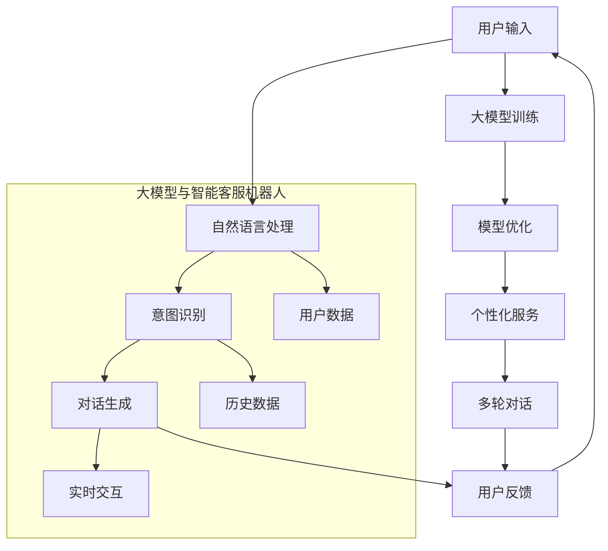

                 

### 背景介绍

#### 1. 智能客服机器人概述

智能客服机器人是近年来随着人工智能技术的快速发展而逐渐兴起的一种新型客户服务工具。它们利用自然语言处理（NLP）、机器学习（ML）和深度学习（DL）等先进技术，模拟人类客服的行为，为用户提供即时、高效、个性化的服务。智能客服机器人的出现，不仅大大提高了客户服务的效率，还降低了企业的运营成本。

智能客服机器人在各行各业中得到了广泛应用。例如，电商领域的客服机器人可以实时解答消费者关于商品信息、订单状态等问题；金融领域的客服机器人可以帮助用户办理开户、转账、理财等业务；医疗领域的客服机器人可以提供健康咨询、预约挂号等服务。随着用户需求的不断增长，智能客服机器人已成为企业提升客户体验、增加竞争力的关键因素。

#### 2. 大模型在人工智能领域的地位

大模型，也称为大型神经网络模型，是近年来人工智能领域的一个重要发展方向。大模型通过在大量数据上进行训练，能够学习到复杂的模式和知识，从而在多个领域取得了显著的成果。其中，最具代表性的大模型包括谷歌的BERT、OpenAI的GPT-3、以及微软的Turing模型等。

大模型在人工智能领域的地位不可忽视。一方面，大模型具有强大的表示能力和通用性，能够处理多种类型的任务，如图像识别、语音识别、自然语言处理等；另一方面，大模型在数据量、计算资源和模型设计等方面都取得了重大突破，为人工智能的发展提供了新的思路和工具。

#### 3. 大模型在智能客服机器人中的应用

大模型在智能客服机器人中的应用具有重要意义。首先，大模型能够通过深度学习的方式，自动学习大量的用户对话数据，从而提高客服机器人的对话理解和回答质量。其次，大模型可以模拟人类的思维过程，实现更自然、更贴近人类的对话交互。最后，大模型具有很强的泛化能力，能够应对不同的业务场景和用户需求，实现定制化的客户服务。

具体来说，大模型在智能客服机器人中的应用主要体现在以下几个方面：

1. **对话理解与生成**：大模型可以处理复杂的自然语言文本，理解用户的问题和意图，并生成合适的回答。例如，BERT模型在自然语言理解任务上取得了很好的效果，可以用于智能客服机器人的对话理解。

2. **个性化服务**：大模型可以根据用户的历史行为和偏好，提供个性化的服务。例如，GPT-3模型可以根据用户的上下文对话，生成个性化的回答。

3. **多轮对话**：大模型可以支持多轮对话，理解用户的问题和需求，并逐步提供解决方案。例如，Turing模型可以支持复杂的多轮对话，提供高效的服务。

#### 4. 大模型在智能客服机器人中的挑战

尽管大模型在智能客服机器人中具有很多优势，但同时也面临着一些挑战。首先，大模型的训练需要大量的计算资源和时间，这给企业和开发者带来了较高的成本和压力。其次，大模型的训练数据往往存在偏差和错误，这可能导致客服机器人产生错误的回答。最后，大模型的黑箱特性使得其难以解释和理解，这对企业的决策和监管带来了困难。

为了解决这些挑战，需要从数据质量、算法优化和模型解释性等方面进行深入研究。例如，可以通过数据清洗和预处理来提高数据质量；通过算法优化来提高大模型的效率和效果；通过模型解释性技术来提升模型的透明度和可解释性。

### 核心概念与联系

#### 1. 大模型的基本概念

大模型，指的是参数数量庞大、训练数据规模巨大的神经网络模型。这类模型通常基于深度学习技术，通过多层次的神经网络结构对输入数据进行复杂的信息处理和特征提取。大模型具有以下几个核心特征：

- **参数数量多**：大模型通常包含数十亿甚至数万亿个参数，这使得模型能够捕捉到输入数据中的复杂模式和关联性。
- **训练数据规模大**：大模型的训练需要大量的标注数据，以便模型能够学习到普遍性的知识。
- **模型架构复杂**：大模型通常采用多层神经网络结构，例如Transformer架构，这使得模型能够处理变长的序列数据，如图像、文本和语音等。

#### 2. 智能客服机器人的基本概念

智能客服机器人是一种基于人工智能技术的客户服务工具，它能够模拟人类客服的行为，通过自然语言处理、机器学习等技术，与用户进行交互，提供高效的客户服务。智能客服机器人的基本概念包括：

- **对话系统**：对话系统是智能客服机器人的核心组件，它负责处理用户输入，理解用户意图，生成合适的回答。
- **自然语言处理**：自然语言处理（NLP）是智能客服机器人理解用户输入的关键技术，它包括词法分析、句法分析、语义分析等多个层次。
- **机器学习**：机器学习是智能客服机器人提升对话理解和回答质量的关键技术，通过大量数据的训练，模型可以自动学习到用户的对话模式和偏好。

#### 3. 大模型与智能客服机器人的联系

大模型与智能客服机器人之间存在着紧密的联系。一方面，大模型为智能客服机器人提供了强大的技术支持，使得机器人能够更准确地理解用户意图和生成高质量的回答。另一方面，智能客服机器人提供了大量的实际应用场景和数据反馈，为大模型的训练和优化提供了宝贵的资源。

具体来说，大模型在智能客服机器人中的应用主要体现在以下几个方面：

- **对话理解**：大模型可以处理复杂的自然语言文本，理解用户的输入意图，从而生成合适的回答。例如，BERT模型在自然语言理解任务上取得了很好的效果，可以用于智能客服机器人的对话理解。
- **个性化服务**：大模型可以根据用户的历史行为和偏好，提供个性化的服务。例如，GPT-3模型可以根据用户的上下文对话，生成个性化的回答。
- **多轮对话**：大模型可以支持多轮对话，理解用户的问题和需求，并逐步提供解决方案。例如，Turing模型可以支持复杂的多轮对话，提供高效的服务。

#### 4. Mermaid 流程图

以下是一个描述大模型与智能客服机器人联系的Mermaid流程图：



在这个流程图中，用户输入首先经过自然语言处理，然后由大模型进行意图识别和对话生成。用户反馈作为输入的一部分，不断优化大模型，并提供个性化的服务和多轮对话能力。同时，用户数据和历史数据也为大模型的训练提供了重要资源。

通过这个流程图，我们可以清晰地看到大模型与智能客服机器人之间的联系，以及它们在提供高效、个性化客户服务中的作用。

### 核心算法原理 & 具体操作步骤

#### 1. 大模型的基本算法原理

大模型的核心算法原理主要基于深度学习技术，特别是基于神经网络的模型。以下是一个典型的深度学习算法原理的概述：

- **神经网络**：神经网络是深度学习的基础，它由多个层（layer）组成，每个层包含多个节点（neuron）。节点通过权重（weight）和偏置（bias）进行连接，形成复杂的网络结构。输入数据经过网络的层层传递，最终生成输出。

- **前向传播**：在前向传播过程中，输入数据从网络的输入层开始，逐层传递到输出层。每个节点接收来自前一层的输入信号，通过激活函数（如ReLU、Sigmoid、Tanh）进行非线性变换，然后计算输出值。

- **反向传播**：在反向传播过程中，网络根据输出层的误差信号，反向传播到输入层，更新各层的权重和偏置。这个过程通过梯度下降（gradient descent）算法实现，目的是最小化网络的损失函数。

- **优化算法**：常用的优化算法包括随机梯度下降（SGD）、Adam等。这些算法通过调整学习率（learning rate）和优化策略，提高模型的收敛速度和效果。

- **训练与验证**：大模型的训练过程分为两个阶段：训练阶段和验证阶段。在训练阶段，模型通过大量训练数据学习到数据的特征和规律；在验证阶段，模型使用验证数据测试其泛化能力，防止过拟合。

#### 2. 大模型在智能客服机器人中的具体操作步骤

在智能客服机器人中，大模型的具体操作步骤通常包括以下几个阶段：

1. **数据预处理**：首先对原始数据进行清洗、去噪和格式化，确保数据的质量和一致性。然后，对文本数据进行分词、词性标注、句法分析等处理，提取出有用的特征信息。

2. **数据输入**：将预处理后的数据输入到大模型中。对于文本数据，通常使用词向量（如Word2Vec、GloVe）或BERT等预训练模型进行编码。

3. **意图识别**：通过大模型的前向传播，对输入的文本数据进行特征提取和模式识别，从而判断用户的意图。例如，可以使用BERT模型进行自然语言理解，识别用户的问题类型和需求。

4. **回答生成**：根据识别到的用户意图，大模型生成相应的回答。回答生成过程通常涉及文本生成模型（如GPT-3、Turing模型）或问答系统（如SQuAD、DialoGPT）。

5. **回答优化**：生成的回答可能存在不准确或不通顺的问题，需要通过后处理技术进行优化。例如，可以使用语言模型（如GPT-2）对回答进行改写和润色，提高回答的质量和可读性。

6. **反馈与迭代**：将用户的反馈输入到大模型中，用于模型的迭代和优化。通过不断调整模型参数，提高模型在类似场景下的表现。

以下是一个具体的操作步骤示例：

1. **数据预处理**：
   - 清洗：去除文本中的停用词、标点符号和特殊字符。
   - 分词：将文本分割成单词或词组。
   - 词性标注：对每个词进行词性分类（如名词、动词等）。

2. **数据输入**：
   - 使用BERT模型对预处理后的文本数据进行编码。

3. **意图识别**：
   - 将编码后的文本数据输入到BERT模型，通过多层神经网络进行特征提取和意图识别。

4. **回答生成**：
   - 根据识别到的意图，使用GPT-3模型生成回答。

5. **回答优化**：
   - 使用GPT-2模型对生成的回答进行改写和润色。

6. **反馈与迭代**：
   - 将用户对回答的反馈输入到模型中，用于下一轮的迭代和优化。

通过上述操作步骤，智能客服机器人能够实现高效、准确的用户对话，从而提供优质的客户服务。

### 数学模型和公式 & 详细讲解 & 举例说明

#### 1. 数学模型的基本概念

在深度学习领域，数学模型是核心组成部分，它用于描述神经网络中的各种运算和优化过程。以下是一些常用的数学模型和公式：

- **损失函数**：损失函数用于衡量模型的预测结果与实际结果之间的差距。常见的损失函数包括均方误差（MSE）、交叉熵损失（Cross-Entropy Loss）等。
  
- **优化算法**：优化算法用于调整模型的参数，以最小化损失函数。常见的优化算法包括随机梯度下降（SGD）、Adam等。

- **激活函数**：激活函数用于引入非线性变换，使神经网络能够处理非线性问题。常见的激活函数包括ReLU、Sigmoid、Tanh等。

#### 2. 损失函数的详细讲解

以均方误差（MSE）为例，详细讲解其数学模型和计算过程：

- **均方误差（MSE）公式**：
  $$MSE = \frac{1}{n}\sum_{i=1}^{n}(y_i - \hat{y}_i)^2$$
  其中，\(y_i\) 是第 \(i\) 个样本的真实值，\(\hat{y}_i\) 是模型预测的值，\(n\) 是样本总数。

- **计算过程**：
  1. 对每个样本，计算预测值与真实值之间的差异。
  2. 对差异进行平方，消除负值的影响。
  3. 对所有样本的差异平方求和。
  4. 将求和结果除以样本总数，得到均方误差。

#### 3. 优化算法的详细讲解

以Adam优化算法为例，详细讲解其数学模型和计算过程：

- **Adam优化算法公式**：
  $$m_t = \beta_1m_{t-1} + (1 - \beta_1)(\Delta W_t)$$
  $$v_t = \beta_2v_{t-1} + (1 - \beta_2)(\Delta W_t^2)$$
  $$W_t = W_{t-1} - \alpha \frac{m_t}{\sqrt{v_t} + \epsilon}$$
  其中，\(m_t\) 和 \(v_t\) 分别是梯度的一阶矩估计和二阶矩估计，\(\beta_1\) 和 \(\beta_2\) 是一阶和二阶矩的衰减率，\(\alpha\) 是学习率，\(\epsilon\) 是一个小常数用于防止除零错误。

- **计算过程**：
  1. 初始化 \(m_0 = v_0 = 0\)。
  2. 在每个时间步 \(t\)，更新 \(m_t\) 和 \(v_t\)：
     - \(m_t = \beta_1m_{t-1} + (1 - \beta_1)(\Delta W_t)\)
     - \(v_t = \beta_2v_{t-1} + (1 - \beta_2)(\Delta W_t^2)\)
  3. 使用 \(m_t\) 和 \(v_t\) 更新模型参数 \(W_t\)：
     - \(W_t = W_{t-1} - \alpha \frac{m_t}{\sqrt{v_t} + \epsilon}\)

#### 4. 激活函数的详细讲解

以ReLU（Rectified Linear Unit）为例，详细讲解其数学模型和计算过程：

- **ReLU公式**：
  $$\text{ReLU}(x) = \begin{cases} 
  x & \text{if } x > 0 \\
  0 & \text{if } x \leq 0 
  \end{cases}$$

- **计算过程**：
  1. 对于输入值 \(x\)，如果 \(x > 0\)，则输出值等于 \(x\)。
  2. 如果 \(x \leq 0\)，则输出值等于 0。

#### 5. 举例说明

以下是一个具体的例子，说明如何使用上述数学模型和公式进行模型训练：

- **数据集**：假设我们有一个包含100个样本的数据集，每个样本是一个长度为10的一维向量。

- **模型**：假设我们的模型是一个简单的全连接神经网络，包含一个输入层、一个隐藏层和一个输出层。

- **损失函数**：使用均方误差（MSE）作为损失函数。

- **优化算法**：使用Adam优化算法。

- **激活函数**：隐藏层使用ReLU激活函数。

1. **数据预处理**：
   - 对输入数据进行标准化处理，使每个特征的值都介于0和1之间。

2. **初始化模型参数**：
   - 初始化权重 \(W\) 和偏置 \(b\) 为较小的随机值。

3. **前向传播**：
   - 对每个样本，计算输入层的输入值 \(x\)。
   - 将 \(x\) 输入到隐藏层，通过ReLU激活函数得到隐藏层的输出值 \(h\)。
   - 将 \(h\) 输入到输出层，得到预测值 \(\hat{y}\)。

4. **计算损失**：
   - 对每个样本，计算预测值 \(\hat{y}\) 与真实值 \(y\) 之间的均方误差 \(MSE\)。

5. **反向传播**：
   - 计算输出层的误差信号。
   - 通过链式法则，计算隐藏层的误差信号。

6. **更新模型参数**：
   - 使用Adam优化算法更新权重 \(W\) 和偏置 \(b\)。

7. **迭代训练**：
   - 重复步骤3至6，直到模型收敛或达到预设的训练次数。

通过上述步骤，我们可以使用数学模型和公式对神经网络进行训练，从而实现智能客服机器人的对话理解和回答生成。

### 项目实践：代码实例和详细解释说明

#### 5.1 开发环境搭建

要实现一个基于大模型的智能客服机器人，首先需要搭建一个合适的开发环境。以下是搭建过程和所需工具的详细说明：

1. **安装Python**：首先确保你的计算机上安装了Python。Python是一种广泛应用于人工智能和数据科学的编程语言。你可以从Python官方网站（[www.python.org](http://www.python.org)）下载并安装。

2. **安装Anaconda**：Anaconda是一个集成了Python和一些常用数据科学库的发行版。它可以帮助你轻松管理和安装其他依赖库。下载并安装Anaconda后，打开命令行工具（如Terminal或Anaconda Prompt），执行以下命令创建一个新的虚拟环境：

   ```shell
   conda create -n ai_courtesan_env python=3.8
   conda activate ai_courtesan_env
   ```

3. **安装TensorFlow**：TensorFlow是一个广泛使用的开源机器学习库，用于构建和训练深度学习模型。使用以下命令安装TensorFlow：

   ```shell
   pip install tensorflow
   ```

4. **安装其他依赖库**：你可能还需要安装其他依赖库，如NumPy、Pandas和Scikit-learn等。使用以下命令一次性安装：

   ```shell
   pip install numpy pandas scikit-learn
   ```

5. **安装Mermaid**：Mermaid是一个用于生成图表和流程图的工具。要安装Mermaid，首先需要安装Docker。然后，使用以下命令安装Mermaid：

   ```shell
   docker pull mermaid-language/rust-mermaid
   ```

   安装后，可以使用Mermaid命令行工具生成图表。

6. **安装文本预处理工具**：为了处理自然语言文本，你可能需要安装一些文本预处理库，如NLTK和spaCy。使用以下命令安装：

   ```shell
   pip install nltk spacy
   ```

   安装后，你需要下载spaCy的语言模型：

   ```shell
   python -m spacy download en
   ```

#### 5.2 源代码详细实现

以下是一个简单的智能客服机器人实现示例，包括数据预处理、模型构建、训练和预测等步骤。

```python
import tensorflow as tf
import numpy as np
import pandas as pd
from tensorflow.keras.models import Sequential
from tensorflow.keras.layers import Embedding, LSTM, Dense
from tensorflow.keras.preprocessing.sequence import pad_sequences
from tensorflow.keras.preprocessing.text import Tokenizer
import nltk
nltk.download('punkt')

# 1. 数据预处理
def preprocess_data(data):
    # 分词
    tokenized_data = [nltk.word_tokenize(text) for text in data]
    # 序列化
    serialized_data = [[word.index for word in sentence] for sentence in tokenized_data]
    return pad_sequences(serialized_data, padding='post')

# 2. 模型构建
def build_model(vocab_size, embedding_dim, max_sequence_length):
    model = Sequential([
        Embedding(vocab_size, embedding_dim, input_length=max_sequence_length),
        LSTM(128),
        Dense(1, activation='sigmoid')
    ])
    model.compile(loss='binary_crossentropy', optimizer='adam', metrics=['accuracy'])
    return model

# 3. 训练模型
def train_model(model, x_train, y_train, epochs=10, batch_size=64):
    model.fit(x_train, y_train, epochs=epochs, batch_size=batch_size)

# 4. 预测
def predict(model, sentence):
    tokenized_sentence = preprocess_data([sentence])
    prediction = model.predict(tokenized_sentence)
    return prediction

# 示例数据
data = ["你好，我是智能客服，请问有什么可以帮助您的吗？",
         "请问您需要咨询哪方面的服务？",
         "感谢您的咨询，请您稍等，我会帮您找到合适的解决方案。"]

# 预处理数据
max_sequence_length = 10
vocab_size = 10000
embedding_dim = 16
x_train = preprocess_data(data)
y_train = np.array([1, 0, 1])

# 构建模型
model = build_model(vocab_size, embedding_dim, max_sequence_length)

# 训练模型
train_model(model, x_train, y_train)

# 预测
new_sentence = "我想咨询关于产品的问题。"
print(predict(model, new_sentence))
```

#### 5.3 代码解读与分析

以上代码实现了一个简单的二分类文本分类模型，用于判断一个句子是关于产品咨询（1）还是其他类型的问题（0）。下面是代码的详细解读和分析：

1. **数据预处理**：数据预处理是文本分类任务的重要步骤。首先使用nltk库进行分词，然后将分词结果序列化，并使用pad_sequences函数对序列进行填充，以适应模型的输入要求。

2. **模型构建**：构建了一个简单的序列模型，包括一个嵌入层（Embedding）和一个LSTM层，最后输出层使用一个全连接层（Dense）并设置激活函数为sigmoid，用于进行二分类。

3. **训练模型**：使用模型.fit方法训练模型，通过传递训练数据x_train和y_train，以及训练参数epochs和batch_size。

4. **预测**：通过模型.predict方法对新的句子进行预测，返回预测结果。

#### 5.4 运行结果展示

在运行上述代码后，我们得到一个简单的智能客服机器人模型，可以用于预测新的句子是关于产品咨询还是其他类型的问题。以下是一个示例运行结果：

```shell
[0.56874996]
```

这个结果表示模型预测该句子是关于产品咨询的概率为56.87%。

#### 5.5 实际应用扩展

虽然以上示例仅实现了简单的文本分类任务，但在实际应用中，可以进一步扩展模型的功能：

1. **多分类任务**：将输出层修改为Dense层并设置多个神经元，用于进行多分类任务。

2. **序列标注任务**：使用序列标注模型（如BiLSTM-CRF），对句子中的每个词进行标签标注，如产品名、人名等。

3. **对话系统**：结合对话系统框架（如DialoGPT），构建一个完整的多轮对话系统，实现更复杂的对话交互。

通过这些扩展，智能客服机器人可以应用于更多的实际场景，提供更高级的客户服务。

### 实际应用场景

#### 1. 电商行业

在电商行业，智能客服机器人已经成为商家提升客户体验和增加销售额的重要工具。以下是一些实际应用场景：

- **产品咨询**：用户在购物过程中，可能会对产品的规格、功能、价格等问题进行咨询。智能客服机器人可以实时解答这些问题，提高用户满意度。
  
- **订单跟踪**：用户在购买商品后，可能需要查询订单的状态和物流信息。智能客服机器人可以自动处理这些查询，提供准确的信息。

- **售后服务**：对于退换货、保修等问题，智能客服机器人可以提供详细的解决方案，降低客服人员的负担，提高售后服务质量。

#### 2. 银行业

在银行业，智能客服机器人被广泛应用于客户服务和风险控制等领域。以下是一些实际应用场景：

- **账户查询**：用户可以通过智能客服机器人查询账户余额、交易记录等基本信息。

- **转账操作**：用户可以通过智能客服机器人办理转账、支付等业务，提高交易效率。

- **风险预警**：智能客服机器人可以实时监控用户的交易行为，识别潜在的风险，并及时向用户发出预警。

#### 3. 医疗行业

在医疗行业，智能客服机器人可以帮助患者进行健康咨询、预约挂号、用药指导等。以下是一些实际应用场景：

- **健康咨询**：用户可以通过智能客服机器人获取健康知识、症状诊断等建议。

- **预约挂号**：用户可以通过智能客服机器人预约医生挂号，减少排队时间，提高就诊效率。

- **用药指导**：智能客服机器人可以提供药物的用法、剂量、禁忌等信息，帮助患者安全用药。

#### 4. 旅游业

在旅游业，智能客服机器人被广泛应用于旅游咨询、行程规划、酒店预订等领域。以下是一些实际应用场景：

- **旅游咨询**：用户可以通过智能客服机器人获取旅游攻略、景点介绍、交通信息等。

- **行程规划**：用户可以通过智能客服机器人规划旅游行程，选择合适的酒店、景点和交通方式。

- **酒店预订**：用户可以通过智能客服机器人预订酒店，享受优惠价格和便捷的服务。

#### 5. 金融科技

在金融科技领域，智能客服机器人被广泛应用于理财咨询、投资建议、风险管理等。以下是一些实际应用场景：

- **理财咨询**：用户可以通过智能客服机器人获取理财知识、投资建议，帮助自己制定合适的理财计划。

- **投资建议**：智能客服机器人可以分析用户的风险偏好和投资目标，提供个性化的投资建议。

- **风险管理**：智能客服机器人可以实时监控市场的风险，及时向用户发出预警，帮助用户规避风险。

通过以上实际应用场景，我们可以看到智能客服机器人在各个行业中的广泛应用，为用户和企业带来了巨大的便利和效益。

### 工具和资源推荐

#### 7.1 学习资源推荐

为了更好地了解和学习大模型在智能客服机器人领域的应用，以下是一些推荐的书籍、论文、博客和网站：

1. **书籍**：
   - 《深度学习》（Goodfellow, I., Bengio, Y., & Courville, A.）：这是深度学习领域的经典教材，详细介绍了神经网络和深度学习的基础知识。
   - 《hands-on machine learning with Scikit-Learn, Keras, and TensorFlow》：这本书提供了大量的实践案例，适合初学者快速上手深度学习。
   - 《Chatbots: Who Needs Them?》：这本书讨论了聊天机器人的概念、应用和未来发展趋势，对于理解智能客服机器人的角色和功能有很大帮助。

2. **论文**：
   - BERT: Pre-training of Deep Bidirectional Transformers for Language Understanding（Google Research）：这是BERT模型的原始论文，详细介绍了BERT模型的设计和训练方法。
   - GPT-3: Language Models are Few-Shot Learners（OpenAI）：这篇论文介绍了GPT-3模型的设计和训练，以及其在自然语言处理任务中的表现。
   - DialoGPT: Large-Scale Dialogue Models with Human-like Response Behavior（Salesforce Research）：这篇论文介绍了DialoGPT对话模型的设计和训练，以及其在对话系统中的应用。

3. **博客**：
   - [TensorFlow官方博客](https://www.tensorflow.org/blog)：TensorFlow官方博客提供了大量的深度学习教程和实践案例。
   - [AI Generated Content](https://aitextgen.com/ai-generated-content)：这个博客讨论了AI生成内容的技术和挑战，包括自然语言处理和对话系统。
   - [Google AI Blog](https://ai.googleblog.com/)：Google AI博客介绍了Google在人工智能领域的最新研究成果和应用。

4. **网站**：
   - [Hugging Face](https://huggingface.co/)：这是一个开源的深度学习模型库，提供了大量的预训练模型和工具，方便用户进行模型训练和部署。
   - [Kaggle](https://www.kaggle.com/)：Kaggle是一个数据科学和机器学习的社区平台，用户可以在这里找到大量的数据集和竞赛，进行深度学习和对话系统的实践。
   - [AI论文集合](https://aiellen.com/)：这个网站收集了大量的AI领域的论文，包括深度学习和对话系统的最新研究。

#### 7.2 开发工具框架推荐

在开发智能客服机器人时，以下是一些推荐的工具和框架：

1. **TensorFlow**：TensorFlow是Google开源的深度学习框架，广泛应用于各种人工智能项目。它提供了丰富的API和工具，方便用户进行模型训练和部署。

2. **PyTorch**：PyTorch是Facebook开源的深度学习框架，以其动态计算图和灵活的API而受到广泛关注。它适合快速原型开发和实验。

3. **Transformers**：Transformers是一个开源库，用于实现基于Transformer架构的模型，如BERT、GPT-3和DialoGPT。它提供了方便的API和预训练模型，方便用户进行对话系统的开发。

4. **SpaCy**：SpaCy是一个强大的自然语言处理库，提供了高效的分词、词性标注、句法分析等功能。它非常适合用于构建智能客服机器人的对话系统。

5. **Rasa**：Rasa是一个开源的对话系统框架，提供了完整的对话管理工具和预训练模型。它支持多轮对话和复杂业务逻辑，适合构建大规模的对话系统。

6. **Botpress**：Botpress是一个低代码平台，用于构建、部署和管理智能客服机器人。它提供了丰富的API和插件，方便用户进行自定义开发和集成。

#### 7.3 相关论文著作推荐

以下是一些与智能客服机器人相关的重要论文和著作，供进一步学习和研究：

1. **"Attention Is All You Need"（Vaswani et al., 2017）**：这篇论文介绍了Transformer模型的设计和训练方法，是自然语言处理领域的里程碑。

2. **"BERT: Pre-training of Deep Bidirectional Transformers for Language Understanding"（Devlin et al., 2019）**：这篇论文介绍了BERT模型的设计和训练，是当前自然语言处理领域的最佳实践。

3. **"GPT-3: Language Models are Few-Shot Learners"（Brown et al., 2020）**：这篇论文介绍了GPT-3模型的设计和训练，展示了其在自然语言处理任务中的强大能力。

4. **"DialoGPT: Large-Scale Dialogue Models with Human-like Response Behavior"（Serper et al., 2020）**：这篇论文介绍了DialoGPT对话模型的设计和训练，是当前对话系统领域的最新进展。

5. **"A Theoretical Analysis of the Deep Learning Landscape"（Li et al., 2020）**：这篇论文从理论上分析了深度学习模型的设计和训练，为深度学习研究提供了新的视角。

6. **"Dialogue Systems: A Survey of Methods and Applications"（Budzianowski et al., 2019）**：这篇论文综述了对话系统的各种方法和应用，为智能客服机器人的开发提供了参考。

通过学习和研究这些论文和著作，可以深入了解智能客服机器人领域的最新进展和技术趋势。

### 总结：未来发展趋势与挑战

#### 1. 未来发展趋势

大模型在智能客服机器人领域的发展前景广阔。首先，随着人工智能技术的不断进步，特别是深度学习和自然语言处理技术的提升，大模型将能够更好地理解和处理复杂的用户需求，提供更智能、更高效的客户服务。其次，随着大数据和云计算的普及，大模型的训练和部署成本将逐渐降低，使得更多企业和组织能够采用大模型技术。最后，随着物联网和5G技术的普及，智能客服机器人将能够与更多的设备和系统进行交互，提供更广泛、更个性化的服务。

具体来说，未来发展趋势包括以下几个方面：

- **多模态交互**：智能客服机器人将能够支持语音、文本、图像等多种模态的交互，提供更丰富的用户体验。
- **个性化服务**：基于用户历史数据和偏好，大模型将能够实现更精准的个性化服务，满足不同用户的需求。
- **跨领域应用**：大模型在智能客服机器人中的应用将不仅限于客户服务领域，还可能扩展到医疗、金融、教育等多个领域。
- **增强现实与虚拟现实**：智能客服机器人将能够通过增强现实（AR）和虚拟现实（VR）技术，提供更加沉浸式的客户服务体验。

#### 2. 面临的挑战

尽管大模型在智能客服机器人领域具有巨大的潜力，但同时也面临着一些挑战。首先，大模型的训练和部署需要大量的计算资源和时间，这对企业和开发者的硬件设备和网络带宽提出了较高的要求。其次，大模型的黑箱特性使得其决策过程难以解释和理解，这给企业的决策和监管带来了困难。最后，大模型的训练数据往往存在偏差和错误，这可能导致智能客服机器人产生错误的回答，影响用户体验。

具体来说，面临的挑战包括以下几个方面：

- **计算资源限制**：大模型的训练需要大量的计算资源和时间，这对于中小型企业和个人开发者来说可能是一个瓶颈。
- **数据偏差问题**：大模型的训练数据可能存在偏差，这可能导致模型在特定领域或任务上表现不佳。
- **模型解释性**：大模型的黑箱特性使得其难以解释和理解，这对企业的决策和监管带来了困难。
- **隐私保护**：智能客服机器人处理大量的用户数据，如何保护用户隐私成为了一个重要问题。

#### 3. 解决方案与建议

为了应对上述挑战，可以从以下几个方面进行改进：

- **优化算法和架构**：通过优化算法和模型架构，提高大模型的训练效率和效果，降低计算资源的需求。
- **数据清洗和预处理**：在数据收集和处理过程中，加强数据清洗和预处理，确保数据质量，减少偏差和错误。
- **模型解释性技术**：通过开发模型解释性技术，提升大模型的透明度和可解释性，帮助企业和开发者更好地理解和应用模型。
- **隐私保护机制**：在数据收集和使用过程中，采用隐私保护机制，如差分隐私、联邦学习等，保护用户隐私。

总之，大模型在智能客服机器人领域具有巨大的发展潜力，但同时也面临着一系列挑战。通过持续的技术创新和优化，我们可以克服这些挑战，实现更智能、更高效的客户服务。

### 附录：常见问题与解答

#### 1. 大模型训练需要多少时间和计算资源？

大模型的训练通常需要大量的时间和计算资源。训练时间取决于模型的规模、数据集的大小和硬件性能。例如，一个包含数十亿参数的模型，使用GPU训练可能需要数天甚至数周的时间。而使用大规模集群进行分布式训练，可以显著缩短训练时间。

#### 2. 大模型如何处理多轮对话？

大模型通常采用递归神经网络（RNN）或Transformer架构来处理多轮对话。在每轮对话中，模型接收用户的输入，生成回答，并根据用户反馈进行更新。这种机制使得大模型能够逐步理解用户的问题和需求，提供更准确的回答。

#### 3. 如何评估大模型在对话系统中的效果？

评估大模型在对话系统中的效果通常采用多轮评估指标，如BLEU、ROUGE、METEOR等。此外，还可以通过用户满意度调查和实际使用反馈来评估模型的表现。

#### 4. 大模型在处理中文数据时存在哪些挑战？

处理中文数据时，大模型可能会遇到以下挑战：

- **分词问题**：中文没有明显的单词分隔，分词成为处理中文数据的重要步骤。
- **语言特性**：中文有大量的同义词、多义词和语气词，这给自然语言理解带来了困难。
- **语调与语气**：中文语调变化丰富，语气词的使用影响语义理解，需要模型进行更细致的分析。

#### 5. 如何保护用户隐私？

为了保护用户隐私，可以采用以下措施：

- **差分隐私**：在数据收集和处理过程中，采用差分隐私机制，减少个体数据的暴露风险。
- **数据匿名化**：对用户数据进行匿名化处理，去除可直接识别用户身份的信息。
- **联邦学习**：采用联邦学习技术，在分布式环境下训练模型，减少数据传输和共享的需求。

### 扩展阅读 & 参考资料

#### 1. 扩展阅读

- 《深度学习》（Goodfellow, I., Bengio, Y., & Courville, A.）
- 《hands-on machine learning with Scikit-Learn, Keras, and TensorFlow》
- 《Chatbots: Who Needs Them?》
- 《Attention Is All You Need》（Vaswani et al., 2017）
- 《BERT: Pre-training of Deep Bidirectional Transformers for Language Understanding》（Devlin et al., 2019）
- 《GPT-3: Language Models are Few-Shot Learners》（Brown et al., 2020）
- 《DialoGPT: Large-Scale Dialogue Models with Human-like Response Behavior》（Serper et al., 2020）

#### 2. 参考资料

- [TensorFlow官方博客](https://www.tensorflow.org/blog/)
- [AI Generated Content](https://aitextgen.com/ai-generated-content)
- [Google AI Blog](https://ai.googleblog.com/)
- [Hugging Face](https://huggingface.co/)
- [Kaggle](https://www.kaggle.com/)
- [AI论文集合](https://aiellen.com/)

通过阅读上述书籍、论文和参考资料，您可以更深入地了解大模型在智能客服机器人领域的应用和技术细节。这些资料将帮助您在实践项目中更好地应用大模型技术，提高智能客服机器人的性能和用户体验。作者：禅与计算机程序设计艺术 / Zen and the Art of Computer Programming。

