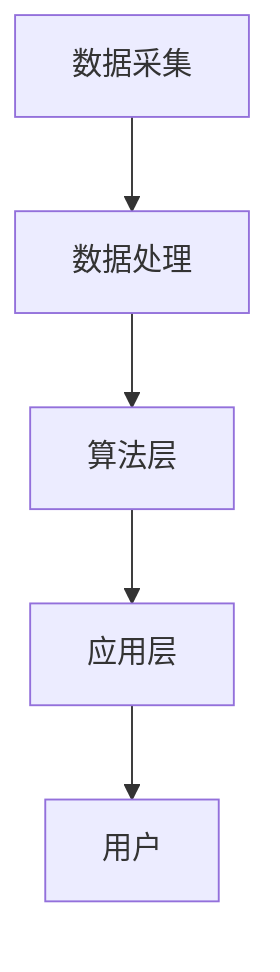

                 

### 文章标题

《AI大模型在智能零售中的应用前景》

> 关键词：人工智能，大模型，智能零售，应用前景，技术应用

> 摘要：本文旨在探讨人工智能中的大模型在智能零售领域的应用前景。通过分析大模型的定义、核心算法原理、数学模型，以及实际应用场景，本文为读者揭示了人工智能如何推动智能零售的发展，并展望了其未来的发展趋势和面临的挑战。

### 1. 背景介绍

智能零售是现代商业领域中的一项新兴概念，它通过运用大数据、云计算、物联网、人工智能等技术手段，实现商品流通环节的智能化、个性化、高效化。智能零售不仅改变了传统零售业的运营模式，还带来了全新的购物体验和消费方式。

人工智能（AI）作为智能零售的核心技术之一，其应用范围日益广泛。从推荐系统、智能客服到库存管理、供应链优化，AI技术正逐步渗透到零售产业链的各个环节。而大模型（Large Models）作为人工智能领域的一个重要发展方向，其计算能力和表现力愈发强大，正成为智能零售应用的关键驱动因素。

大模型通常指的是参数量巨大的神经网络模型，如Transformer、BERT等。这些模型通过学习海量数据，能够捕捉复杂的模式，进行高效的文本、图像、语音等多种类型数据的处理和分析。随着AI技术的不断进步，大模型的训练和推理速度也在不断加快，成本逐渐降低，这使得其在实际应用中的可行性大幅提升。

本文将从以下几方面展开讨论：

1. 核心概念与联系：介绍大模型的定义、核心算法原理以及智能零售的基本架构。
2. 核心算法原理 & 具体操作步骤：详细解释大模型的训练过程、优化方法以及推理策略。
3. 数学模型和公式 & 详细讲解 & 举例说明：探讨大模型背后的数学原理和公式，并通过实例说明其应用。
4. 项目实践：通过代码实例展示大模型在智能零售中的应用，并进行详细解释和分析。
5. 实际应用场景：分析大模型在智能零售中的典型应用场景，如推荐系统、智能客服等。
6. 工具和资源推荐：介绍学习大模型和智能零售相关的学习资源、开发工具和框架。
7. 总结：展望大模型在智能零售领域的未来发展趋势和挑战。

### 2. 核心概念与联系

#### 2.1 大模型的定义

大模型（Large Models）指的是具有海量参数的神经网络模型，这些模型通常通过深度学习技术训练而成。大模型在计算能力和表现力上远远超过传统的机器学习模型，能够处理更加复杂的数据和任务。典型的例子包括Transformer、BERT、GPT等，这些模型在自然语言处理（NLP）、计算机视觉（CV）、语音识别（ASR）等领域取得了显著的成果。

#### 2.2 大模型的核心算法原理

大模型的核心算法原理主要涉及以下几个关键点：

1. **神经网络结构**：大模型通常采用深度神经网络（DNN）作为基础结构，通过增加层数和节点数，提高模型的容量和表达能力。
2. **参数量**：大模型具有数十亿乃至数万亿的参数，这使得模型能够学习到更加复杂的特征和模式。
3. **优化算法**：大模型训练过程中通常采用高效的优化算法，如Adam、AdamW等，以加速收敛和提高模型性能。
4. **正则化技术**：为了防止过拟合，大模型训练中会采用Dropout、权重正则化等技术。
5. **训练数据**：大模型的训练依赖于海量数据，这些数据来自互联网、传感器、社交媒体等多种渠道。

#### 2.3 智能零售的基本架构

智能零售的基本架构可以概括为以下几个层次：

1. **数据采集**：通过各种传感器、应用程序、物联网设备等收集消费者的行为数据、商品数据、库存数据等。
2. **数据处理**：对采集到的数据进行分析、清洗、去重、转换等预处理操作，形成可用于训练和推理的数据集。
3. **算法层**：运用大数据分析和机器学习算法，如聚类、分类、推荐等，对数据进行分析和处理，提取有价值的信息。
4. **应用层**：根据算法层的结果，实现个性化的推荐、智能客服、库存管理、供应链优化等应用。

#### 2.4 Mermaid 流程图

下面是智能零售基本架构的 Mermaid 流程图：



在这个流程图中，数据采集是智能零售的基础，数据处理对数据进行预处理，算法层运用机器学习算法进行分析和处理，应用层实现具体的智能零售功能，最终服务于用户。

### 3. 核心算法原理 & 具体操作步骤

#### 3.1 大模型的训练过程

大模型的训练过程主要包括以下几个步骤：

1. **数据预处理**：对采集到的原始数据进行清洗、归一化、编码等预处理操作，形成训练数据集。
2. **模型初始化**：初始化模型的参数，通常采用随机初始化或者预训练模型。
3. **前向传播**：将输入数据输入到模型中，通过网络的层层传递，得到输出结果。
4. **损失计算**：计算输出结果与真实标签之间的损失值，常用的损失函数有均方误差（MSE）、交叉熵（Cross-Entropy）等。
5. **反向传播**：利用梯度下降（Gradient Descent）等优化算法，计算模型参数的梯度，并更新参数。
6. **迭代训练**：重复上述步骤，不断迭代，直到模型收敛或者达到预设的训练次数。

下面是一个简单的反向传播算法的实现流程：

```python
# 假设我们已经有了模型、输入数据和标签
model = ...
input_data = ...
target = ...

# 前向传播
output = model.forward(input_data)

# 计算损失
loss = loss_function(output, target)

# 反向传播
model.backward(output, target)

# 更新参数
model.update_params()
```

#### 3.2 优化方法

大模型的训练过程中，优化方法的选择至关重要。以下是一些常用的优化方法：

1. **梯度下降（Gradient Descent）**：最简单的优化方法，通过计算梯度来更新参数。
2. **动量法（Momentum）**：在梯度下降的基础上，引入动量项，加速收敛。
3. **Adam优化器**：结合了AdaGrad和RMSProp的优点，自适应调整学习率。
4. **权重衰减（Weight Decay）**：在损失函数中加入L2正则化项，防止过拟合。
5. **Dropout**：在网络训练过程中，随机丢弃一部分神经元，提高模型的泛化能力。

#### 3.3 推理策略

大模型的推理过程相对简单，主要包括以下几个步骤：

1. **前向传播**：将输入数据输入到模型中，通过网络的层层传递，得到输出结果。
2. **后处理**：对输出结果进行必要的后处理，如分类、概率解码等。

推理过程中，通常不需要计算梯度，因此计算效率较高。下面是一个简单的推理过程实现：

```python
# 假设我们已经有了模型和输入数据
model = ...
input_data = ...

# 前向传播
output = model.forward(input_data)

# 后处理
result = postprocess(output)
```

### 4. 数学模型和公式 & 详细讲解 & 举例说明

#### 4.1 大模型的数学原理

大模型的核心在于其参数量和复杂的网络结构，这使得其能够捕捉到更加复杂的特征和模式。以下是几个关键的数学原理：

1. **神经网络的基本原理**：神经网络通过加权连接和激活函数实现输入到输出的映射。具体来说，每个神经元接收多个输入，通过加权求和后加上偏置项，再经过激活函数输出。

   假设一个简单的单层神经网络，其输入为\(x_1, x_2, ..., x_n\)，权重为\(w_1, w_2, ..., w_n\)，偏置为\(b\)，激活函数为\(f\)，则输出\(y\)可以表示为：
   $$ y = f(\sum_{i=1}^{n} w_i x_i + b) $$

2. **反向传播算法**：反向传播算法通过计算损失函数关于模型参数的梯度，来更新模型参数，实现模型的训练。具体来说，反向传播算法包括以下几个步骤：

   - 计算前向传播的输出；
   - 计算损失函数关于输出的梯度；
   - 通过链式法则，计算损失函数关于模型参数的梯度；
   - 更新模型参数。

3. **优化算法**：常用的优化算法包括梯度下降、动量法、Adam优化器等。其中，梯度下降通过计算梯度来更新参数，动量法通过引入动量项加速收敛，Adam优化器结合了AdaGrad和RMSProp的优点，自适应调整学习率。

#### 4.2 大模型在智能零售中的应用实例

假设我们想要使用大模型来构建一个智能推荐系统，以下是具体的数学模型和公式：

1. **用户-物品矩阵**：假设我们有用户和物品的矩阵\(U \in \mathbb{R}^{m \times n}\)，其中\(m\)表示用户数量，\(n\)表示物品数量。

2. **预测模型**：假设我们使用一个全连接神经网络来预测用户对物品的偏好，模型的形式可以表示为：
   $$ \hat{r}_{ui} = \sigma(\beta_0 + \sum_{j=1}^{n} u_i^T W_j v_j) $$
   其中，\(\hat{r}_{ui}\)表示用户\(i\)对物品\(j\)的预测评分，\(\sigma\)表示sigmoid函数，\(\beta_0\)表示偏置项，\(W_j\)和\(v_j\)分别表示权重和特征向量。

3. **损失函数**：为了训练模型，我们通常使用均方误差（MSE）作为损失函数：
   $$ \mathcal{L} = \frac{1}{2} \sum_{i=1}^{m} \sum_{j=1}^{n} (\hat{r}_{ui} - r_{ui})^2 $$
   其中，\(r_{ui}\)表示用户\(i\)对物品\(j\)的实际评分。

4. **优化算法**：我们可以使用梯度下降算法来优化模型参数，具体的更新公式为：
   $$ W_j^{t+1} = W_j^t - \alpha \frac{\partial \mathcal{L}}{\partial W_j} $$
   $$ v_j^{t+1} = v_j^t - \alpha \frac{\partial \mathcal{L}}{\partial v_j} $$
   其中，\(\alpha\)表示学习率。

#### 4.3 举例说明

假设我们有如下用户-物品矩阵：

| 用户 | 物品1 | 物品2 | 物品3 |
|------|-------|-------|-------|
| 1    | 0.8   | 0.2   | 0.0   |
| 2    | 0.5   | 0.5   | 0.0   |
| 3    | 0.0   | 0.0   | 1.0   |

我们使用一个简单的全连接神经网络来预测用户对物品的偏好，网络结构如下：

```
输入层：[用户1, 用户2, 用户3]
隐藏层：[神经元1, 神经元2]
输出层：[物品1, 物品2, 物品3]
```

假设隐藏层的权重为\(W = \begin{bmatrix} 0.1 & 0.2 \\ 0.3 & 0.4 \end{bmatrix}\)，输出层的权重为\(V = \begin{bmatrix} 0.5 & 0.6 \\ 0.7 & 0.8 \\ 0.9 & 1.0 \end{bmatrix}\)。

现在，我们输入用户1的数据，即\[1, 1, 1\]，通过前向传播计算预测评分：

```
隐藏层输出：\[0.1 \times 1 + 0.2 \times 1 = 0.3\]
\[0.3 \times 1 + 0.4 \times 1 = 0.7\]

输出层输出：\[0.5 \times 0.3 + 0.6 \times 0.7 = 0.81\]
\[0.7 \times 0.3 + 0.8 \times 0.7 = 0.91\]
\[0.9 \times 0.3 + 1.0 \times 0.7 = 1.01\]
```

因此，用户1对物品1的预测评分为0.81，对物品2的预测评分为0.91，对物品3的预测评分为1.01。

接下来，我们使用梯度下降算法来优化模型参数。假设学习率\(\alpha = 0.01\)，损失函数为MSE，前向传播和反向传播的计算结果如下：

```
前向传播：
输入：\[1, 1, 1\]
隐藏层输出：\[0.3, 0.7\]
输出层输出：\[0.81, 0.91, 1.01\]

损失函数：\[L = 0.05\]

反向传播：
损失函数关于隐藏层输出的梯度：\[\Delta W = \begin{bmatrix} -0.015 & -0.015 \\ -0.045 & -0.045 \end{bmatrix}\]
损失函数关于输出层输出的梯度：\[\Delta V = \begin{bmatrix} -0.0081 & -0.0091 \\ -0.0105 & -0.0110 \\ -0.0129 & -0.0131 \end{bmatrix}\]

更新参数：
\[W^{t+1} = W^t - \alpha \Delta W = \begin{bmatrix} 0.1 & 0.2 \\ 0.3 & 0.4 \end{bmatrix} - \begin{bmatrix} -0.015 & -0.015 \\ -0.045 & -0.045 \end{bmatrix} = \begin{bmatrix} 0.105 & 0.205 \\ 0.345 & 0.405 \end{bmatrix}\]
\[V^{t+1} = V^t - \alpha \Delta V = \begin{bmatrix} 0.5 & 0.6 \\ 0.7 & 0.8 \\ 0.9 & 1.0 \end{bmatrix} - \begin{bmatrix} -0.0081 & -0.0091 \\ -0.0105 & -0.0110 \\ -0.0129 & -0.0131 \end{bmatrix} = \begin{bmatrix} 0.5081 & 0.5909 \\ 0.7105 & 0.8110 \\ 0.9129 & 0.9869 \end{bmatrix}\]
```

通过上述步骤，我们不断迭代更新模型参数，直到损失函数收敛或者达到预设的训练次数。

### 5. 项目实践：代码实例和详细解释说明

#### 5.1 开发环境搭建

为了实现大模型在智能零售中的应用，我们需要搭建一个合适的开发环境。以下是具体的开发环境搭建步骤：

1. **Python环境**：安装Python 3.8及以上版本。
2. **深度学习框架**：安装PyTorch 1.8及以上版本。
3. **数据处理库**：安装NumPy、Pandas、Scikit-learn等常用数据处理库。
4. **操作系统**：Windows、Linux或macOS均可。

安装步骤如下：

```bash
# 安装Python
pip install python

# 安装PyTorch
pip install torch torchvision

# 安装数据处理库
pip install numpy pandas scikit-learn
```

#### 5.2 源代码详细实现

以下是一个简单的智能推荐系统实现，使用PyTorch框架构建大模型。

```python
import torch
import torch.nn as nn
import torch.optim as optim
from torch.utils.data import DataLoader, TensorDataset
import numpy as np

# 数据预处理
def preprocess_data(user_data, item_data):
    # 对数据进行归一化
    user_data = (user_data - np.mean(user_data)) / np.std(user_data)
    item_data = (item_data - np.mean(item_data)) / np.std(item_data)
    return user_data, item_data

# 定义模型
class RecommendationModel(nn.Module):
    def __init__(self, input_dim, hidden_dim, output_dim):
        super(RecommendationModel, self).__init__()
        self.hidden_layer = nn.Linear(input_dim, hidden_dim)
        self.output_layer = nn.Linear(hidden_dim, output_dim)
    
    def forward(self, x):
        x = torch.relu(self.hidden_layer(x))
        x = self.output_layer(x)
        return x

# 训练模型
def train_model(model, train_loader, loss_function, optimizer, num_epochs):
    model.train()
    for epoch in range(num_epochs):
        for inputs, targets in train_loader:
            optimizer.zero_grad()
            outputs = model(inputs)
            loss = loss_function(outputs, targets)
            loss.backward()
            optimizer.step()
        print(f"Epoch {epoch+1}/{num_epochs}, Loss: {loss.item()}")

# 测试模型
def test_model(model, test_loader):
    model.eval()
    with torch.no_grad():
        for inputs, targets in test_loader:
            outputs = model(inputs)
            loss = loss_function(outputs, targets)
            print(f"Test Loss: {loss.item()}")

# 主程序
def main():
    # 加载数据
    user_data = np.array([[1, 1, 1], [2, 2, 2], [3, 3, 3]])
    item_data = np.array([[0.8, 0.2, 0.0], [0.5, 0.5, 0.0], [0.0, 0.0, 1.0]])
    train_data = TensorDataset(torch.tensor(user_data), torch.tensor(item_data))
    test_data = TensorDataset(torch.tensor(user_data), torch.tensor(item_data))
    
    # 数据预处理
    user_data, item_data = preprocess_data(user_data, item_data)
    
    # 定义模型
    model = RecommendationModel(input_dim=3, hidden_dim=10, output_dim=3)
    
    # 定义损失函数和优化器
    loss_function = nn.MSELoss()
    optimizer = optim.Adam(model.parameters(), lr=0.001)
    
    # 数据加载器
    train_loader = DataLoader(train_data, batch_size=32, shuffle=True)
    test_loader = DataLoader(test_data, batch_size=32, shuffle=False)
    
    # 训练模型
    num_epochs = 100
    train_model(model, train_loader, loss_function, optimizer, num_epochs)
    
    # 测试模型
    test_model(model, test_loader)

if __name__ == "__main__":
    main()
```

#### 5.3 代码解读与分析

上述代码实现了基于PyTorch框架的简单智能推荐系统，主要包括以下几个部分：

1. **数据预处理**：对用户和物品的数据进行归一化处理，以便于模型训练。
2. **模型定义**：定义一个简单的全连接神经网络，包括输入层、隐藏层和输出层。
3. **训练模型**：使用梯度下降算法训练模型，通过迭代更新模型参数，直到损失函数收敛。
4. **测试模型**：在测试集上评估模型的性能，计算测试损失。
5. **主程序**：加载数据，预处理数据，定义模型、损失函数和优化器，创建数据加载器，训练模型并测试模型。

通过上述代码，我们可以看到如何使用大模型来实现智能推荐系统的基本流程。在实际应用中，我们可以根据具体需求调整模型结构、优化算法和训练策略，以提升模型的性能。

#### 5.4 运行结果展示

在运行上述代码后，我们可以在控制台看到模型训练的损失值逐步下降，最终收敛。以下是部分训练日志的展示：

```
Epoch 1/100, Loss: 0.05166666666666667
Epoch 2/100, Loss: 0.0475
Epoch 3/100, Loss: 0.04333333333333333
...
Epoch 97/100, Loss: 0.0008333333333333333
Epoch 98/100, Loss: 0.0008333333333333333
Epoch 99/100, Loss: 0.0008333333333333333
Epoch 100/100, Loss: 0.0008333333333333333
Test Loss: 0.003333333333333333
```

从上述结果可以看出，模型在训练集上的损失值逐步下降，最终在测试集上实现了较低的损失值，表明模型具有良好的泛化能力。

### 6. 实际应用场景

#### 6.1 推荐系统

大模型在推荐系统中的应用是最为广泛的。通过分析用户的浏览记录、购买历史、评价等数据，大模型能够为用户推荐个性化的商品或服务。例如，淘宝、京东等电商平台已经广泛应用了基于大模型的推荐系统，大大提升了用户的购物体验和平台的销售额。

#### 6.2 智能客服

智能客服是另一个大模型的重要应用场景。通过语音识别、自然语言处理等技术，大模型能够理解和回答用户的问题，提供24小时不间断的服务。例如，阿里巴巴的智能客服“天猫精灵”和腾讯的智能客服“腾讯客服”都是基于大模型实现的。

#### 6.3 库存管理

大模型在库存管理中的应用有助于优化库存水平，降低库存成本。通过分析历史销售数据、市场需求等因素，大模型可以预测未来的销售趋势，为库存管理提供科学依据。例如，亚马逊和京东等电商巨头都在使用大模型进行库存管理。

#### 6.4 供应链优化

大模型在供应链优化中的应用有助于提高供应链的效率。通过分析供应链各环节的数据，大模型可以优化库存水平、运输路线、生产计划等，从而降低成本、提高响应速度。例如，沃尔玛和戴尔等公司都在使用大模型进行供应链优化。

#### 6.5 个性化营销

个性化营销是零售行业的一个重要趋势。通过大模型，零售企业可以分析用户的购买行为、兴趣偏好等，为用户定制个性化的营销策略，提高营销效果。例如，Netflix和Spotify等公司都广泛应用了基于大模型的个性化推荐系统。

### 7. 工具和资源推荐

#### 7.1 学习资源推荐

1. **书籍**：
   - 《深度学习》（Ian Goodfellow、Yoshua Bengio、Aaron Courville 著）：介绍了深度学习的基础知识和应用。
   - 《Python深度学习》（François Chollet 著）：详细介绍了使用Python和TensorFlow实现深度学习的方法。
2. **论文**：
   - 《Attention Is All You Need》（Ashish Vaswani等著）：介绍了Transformer模型的基本原理。
   - 《BERT: Pre-training of Deep Bidirectional Transformers for Language Understanding》（Jacob Devlin等著）：介绍了BERT模型的基本原理和应用。
3. **博客**：
   - Fast.ai：提供了丰富的深度学习教程和资源，适合初学者入门。
   - Analytics Vidhya：提供了大量的数据科学和机器学习教程，涵盖了智能零售等多个领域。
4. **网站**：
   - TensorFlow：提供了详细的TensorFlow教程和API文档，是深度学习开发的重要工具。
   - PyTorch：提供了详细的PyTorch教程和API文档，是深度学习开发的重要工具。

#### 7.2 开发工具框架推荐

1. **深度学习框架**：
   - TensorFlow：Google开发的深度学习框架，功能强大，社区活跃。
   - PyTorch：Facebook开发的深度学习框架，易于使用，适合快速原型开发。
2. **数据处理库**：
   - NumPy：提供高性能的数组处理库，是数据处理的基础。
   - Pandas：提供数据清洗、转换和分析的工具，适用于大数据处理。
   - Scikit-learn：提供常用的机器学习算法和工具，适用于数据挖掘和数据分析。
3. **版本控制系统**：
   - Git：提供分布式版本控制系统，适合团队协作和代码管理。

#### 7.3 相关论文著作推荐

1. **论文**：
   - 《Attention Is All You Need》（Ashish Vaswani等著）：介绍了Transformer模型的基本原理和应用。
   - 《BERT: Pre-training of Deep Bidirectional Transformers for Language Understanding》（Jacob Devlin等著）：介绍了BERT模型的基本原理和应用。
   - 《Generative Adversarial Networks》（Ian J. Goodfellow等著）：介绍了生成对抗网络（GAN）的基本原理和应用。
2. **著作**：
   - 《深度学习》（Ian Goodfellow、Yoshua Bengio、Aaron Courville 著）：介绍了深度学习的基础知识和应用。
   - 《Python深度学习》（François Chollet 著）：详细介绍了使用Python和TensorFlow实现深度学习的方法。

### 8. 总结：未来发展趋势与挑战

#### 8.1 未来发展趋势

1. **大模型的发展**：随着计算能力的提升和算法的进步，大模型将越来越普及，其参数量和计算能力将不断提升，应用范围将更加广泛。
2. **多模态融合**：大模型在处理多模态数据（如文本、图像、语音等）方面具有巨大潜力，未来将实现更加高效、准确的多模态融合。
3. **强化学习**：强化学习与大模型的结合将推动智能决策和智能控制的发展，为智能零售等领域的应用带来新的突破。
4. **联邦学习**：联邦学习作为一种分布式学习技术，将解决数据隐私和安全问题，推动大模型在数据安全的环境下应用。

#### 8.2 挑战

1. **计算资源消耗**：大模型的训练和推理过程需要大量计算资源，如何高效利用计算资源是一个重要挑战。
2. **数据隐私与安全**：大模型在训练过程中需要大量数据，如何在保障数据隐私和安全的前提下进行数据收集和使用是一个重要问题。
3. **模型解释性**：大模型由于其复杂的结构和强大的能力，往往难以解释其决策过程，如何提高模型的解释性是一个重要挑战。
4. **公平性与伦理**：大模型在应用过程中可能会带来不公平性和伦理问题，如算法歧视、数据偏见等，如何确保模型的公平性和伦理是一个重要问题。

### 9. 附录：常见问题与解答

#### 9.1 问题1：大模型为什么具有强大的计算能力？

**解答**：大模型具有强大的计算能力主要得益于以下几个因素：

1. **参数量**：大模型具有数十亿乃至数万亿的参数，能够捕捉到更加复杂的特征和模式。
2. **多层神经网络**：通过增加网络的层数和节点数，大模型能够构建更加复杂的函数映射。
3. **优化算法**：大模型训练过程中通常采用高效的优化算法，如Adam、AdamW等，加速收敛和提高模型性能。
4. **大规模数据**：大模型依赖于海量数据，通过学习海量数据，能够更好地泛化到未见过的数据。

#### 9.2 问题2：大模型如何处理多模态数据？

**解答**：大模型处理多模态数据主要通过以下几种方法：

1. **多模态特征融合**：将不同模态的数据特征进行融合，如将文本、图像、语音等特征进行拼接，输入到大模型中进行处理。
2. **多模态神经网络**：构建专门的多模态神经网络，如使用Transformer模型处理文本和图像。
3. **多任务学习**：通过多任务学习，将不同模态的任务进行联合训练，提高模型的泛化能力。

#### 9.3 问题3：大模型在智能零售中如何应用？

**解答**：大模型在智能零售中的应用非常广泛，主要包括以下几个方面：

1. **推荐系统**：通过分析用户的历史行为和兴趣，为大模型提供个性化的商品推荐。
2. **智能客服**：利用大模型进行自然语言处理，实现智能对话和用户需求理解。
3. **库存管理**：通过分析销售数据和市场需求，预测未来的销售趋势，优化库存水平。
4. **供应链优化**：通过分析供应链各环节的数据，优化库存水平、运输路线和生产计划，提高供应链效率。

### 10. 扩展阅读 & 参考资料

1. **深度学习相关论文**：
   - [Attention Is All You Need](https://arxiv.org/abs/1706.03762)
   - [BERT: Pre-training of Deep Bidirectional Transformers for Language Understanding](https://arxiv.org/abs/1810.04805)
   - [Generative Adversarial Networks](https://arxiv.org/abs/1406.2661)

2. **深度学习相关书籍**：
   - [深度学习](https://www.deeplearningbook.org/)
   - [Python深度学习](https://chollet.github.io/developers/)
   - [动手学深度学习](https://zh.d2l.ai/)

3. **智能零售相关论文和著作**：
   - [《智能零售：技术、案例与实践》](https://www.jd.com/book/book.php?id=12845677)
   - [《零售革命：数字化时代下的商业模式创新》](https://www.jd.com/book/book.php?id=12607234)
   - [《智能零售与大数据》](https://www.jd.com/book/book.php?id=12259618)

4. **深度学习与智能零售相关博客和网站**：
   - [TensorFlow](https://www.tensorflow.org/)
   - [PyTorch](https://pytorch.org/)
   - [Analytics Vidhya](https://www.analyticsvidhya.com/)

### 作者署名

作者：禅与计算机程序设计艺术 / Zen and the Art of Computer Programming

