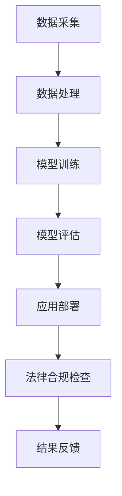

                 

关键词：人工智能，大模型，法律服务，创新，挑战，技术应用，数据处理，法律合规，信息安全

## 摘要

本文旨在探讨人工智能（AI）特别是大模型在法律服务领域的创新应用及其面临的挑战。随着AI技术的不断进步，大模型在处理复杂法律事务、提高效率、确保合规性等方面显示出巨大的潜力。然而，这一领域的快速发展也伴随着数据隐私、算法透明度、法律合规性等一系列挑战。本文将详细分析AI大模型在法律领域的核心概念、算法原理、数学模型、实际应用以及未来展望，以期为行业从业者提供有价值的参考。

## 1. 背景介绍

近年来，人工智能技术取得了飞速发展，从简单的规则系统到复杂的大模型，如GPT系列、BERT等，AI的能力已经远超以往。同时，法律服务行业也面临着巨大的变革。传统法律服务模式繁琐、效率低下，难以应对日益增长的案件数量和复杂的法律问题。人工智能的引入，有望改变这一现状，提升法律服务的质量和效率。

在法律领域，AI大模型的应用主要包括但不限于：

- **合同审查与生成**：通过大模型对合同文本进行审查，识别潜在的法律风险，甚至自动生成合同。
- **法律研究**：利用大模型对大量法律文献和案例进行检索和分析，辅助法律研究人员快速找到相关法律依据。
- **案件预测**：通过对历史案件数据进行分析，大模型可以预测案件的审理结果，为律师提供决策依据。
- **客户服务**：通过聊天机器人提供基础法律咨询服务，减少律师的工作负担。

## 2. 核心概念与联系

在探讨AI大模型在法律服务中的应用之前，我们需要了解几个核心概念及其相互关系。

### 2.1 人工智能（AI）

人工智能是指使计算机系统能够执行通常需要人类智能的任务的技术。这些任务包括识别语言、理解图像、解决问题、学习等。人工智能可以分为弱人工智能和强人工智能。弱人工智能是指能够执行特定任务的智能系统，而强人工智能则是指具有人类水平的全面智能。

### 2.2 大模型（Large Models）

大模型是指具有巨大参数量的神经网络模型，如GPT系列、BERT等。这些模型通过在大量数据上进行训练，可以学习到复杂的语言模式和结构，从而在多种任务上表现出色。

### 2.3 法律服务

法律服务是指律师、律师事务所或其他法律机构为个人、企业或组织提供的服务，包括但不限于法律咨询、诉讼代理、合同审查等。

### 2.4 数据处理

数据处理是指对数据进行采集、存储、处理、分析和解释的过程。在AI大模型的应用中，数据处理是一个关键环节，因为模型的性能很大程度上取决于数据的数量和质量。

### 2.5 法律合规性

法律合规性是指企业在经营活动中遵守相关法律法规的要求。在AI大模型应用于法律服务的场景中，合规性尤为重要，因为任何错误或不当的决策都可能带来法律责任。

### 2.6 Mermaid流程图

下面是一个用于描述AI大模型在法律服务领域应用的Mermaid流程图：



### 2.7 大模型在法律服务领域的应用流程

- **数据采集**：从各种来源（如公开法律文献、法院数据库、律师事务所文档等）收集数据。
- **数据处理**：清洗、标注和整合数据，为模型训练做好准备。
- **模型训练**：使用大量数据进行训练，优化模型参数。
- **模型评估**：通过测试集评估模型的性能，调整模型参数。
- **应用部署**：将训练好的模型部署到实际应用中，如合同审查、法律研究等。
- **法律合规检查**：确保模型应用符合相关法律法规的要求。
- **结果反馈**：收集用户反馈，不断优化模型和应用。

## 3. 核心算法原理 & 具体操作步骤

### 3.1 算法原理概述

AI大模型的核心算法是基于深度学习，尤其是变分自编码器（Variational Autoencoder，VAE）和生成对抗网络（Generative Adversarial Network，GAN）等生成模型。这些算法通过在大量数据上进行训练，学习到数据的分布和特征，从而能够生成新的数据。

在法律服务领域，大模型主要用于以下任务：

- **文本分类**：对法律文档进行分类，如合同、判决书、法律意见书等。
- **文本生成**：生成新的法律文本，如合同条款、法律意见书等。
- **文本相似性**：评估法律文本之间的相似度，帮助法律研究人员快速定位相关文档。

### 3.2 算法步骤详解

#### 3.2.1 数据准备

- **数据采集**：从法院数据库、律师事务所文档、公开法律文献等来源收集数据。
- **数据清洗**：去除无关信息，如HTML标签、特殊字符等。
- **数据标注**：对数据进行分类标注，如合同类别、判决结果等。

#### 3.2.2 模型训练

- **模型选择**：选择合适的深度学习模型，如BERT、GPT等。
- **模型训练**：使用大量数据进行模型训练，优化模型参数。
- **模型评估**：使用测试集评估模型性能，进行调整和优化。

#### 3.2.3 应用部署

- **模型部署**：将训练好的模型部署到实际应用中，如合同审查、法律研究等。
- **接口开发**：为模型应用提供API接口，方便用户调用。

### 3.3 算法优缺点

#### 优点

- **高效性**：大模型能够快速处理大量法律文档，提高工作效率。
- **灵活性**：大模型可以应用于多种法律任务，如文本分类、生成、相似性等。
- **准确性**：通过在大量数据上进行训练，大模型能够学习到复杂的法律规则和模式，提高决策准确性。

#### 缺点

- **数据依赖性**：大模型的性能很大程度上取决于数据的数量和质量，数据不足或质量差可能导致模型性能下降。
- **算法透明度**：大模型的学习过程复杂，算法透明度较低，难以解释模型的决策过程。
- **法律合规性**：大模型在应用过程中可能涉及敏感数据，需要确保其符合相关法律法规的要求。

### 3.4 算法应用领域

- **合同审查**：通过大模型对合同文本进行审查，识别潜在的法律风险。
- **法律研究**：利用大模型对大量法律文献和案例进行检索和分析，辅助法律研究人员快速找到相关法律依据。
- **案件预测**：通过对历史案件数据进行分析，大模型可以预测案件的审理结果，为律师提供决策依据。
- **客户服务**：通过聊天机器人提供基础法律咨询服务，减少律师的工作负担。

## 4. 数学模型和公式 & 详细讲解 & 举例说明

在AI大模型的应用中，数学模型和公式是核心组成部分。以下将详细讲解常用的数学模型和公式，并通过案例进行分析。

### 4.1 数学模型构建

#### 4.1.1 变分自编码器（VAE）

变分自编码器（VAE）是一种无监督学习模型，用于学习数据的分布。VAE由两个神经网络组成：编码器（Encoder）和解码器（Decoder）。

- **编码器**：将输入数据映射到一个潜在空间中的点。
- **解码器**：从潜在空间中采样，生成与输入数据相近的输出。

数学公式：

$$
\begin{aligned}
\text{编码器}: q_\phi(z|x) &= \mathcal{N}(\mu_\phi(x), \sigma_\phi(x)) \\
\text{解码器}: p_\theta(x|z) &= \mathcal{N}(\phi(x; z), \sigma(x; z))
\end{aligned}
$$

其中，$q_\phi(z|x)$ 是编码器的先验分布，$p_\theta(x|z)$ 是解码器的似然分布，$\mu_\phi(x)$ 和 $\sigma_\phi(x)$ 分别是潜在空间中的均值和方差，$\phi(x; z)$ 和 $\sigma(x; z)$ 分别是解码器的均值和方差函数。

#### 4.1.2 生成对抗网络（GAN）

生成对抗网络（GAN）由生成器（Generator）和判别器（Discriminator）组成，通过两个网络的博弈来学习数据的分布。

- **生成器**：生成与真实数据相似的数据。
- **判别器**：判断生成数据是否为真实数据。

数学公式：

$$
\begin{aligned}
\text{生成器}: G(z) &= \text{生成数据} \\
\text{判别器}: D(x) &= \text{判断是否为真实数据}
\end{aligned}
$$

训练目标是最小化以下损失函数：

$$
\mathcal{L}(G, D) = \mathbb{E}_{x \sim p_{\text{data}}}[D(x)] + \mathbb{E}_{z \sim p_{z}(z)}[D(G(z))]
$$

### 4.2 公式推导过程

#### 4.2.1 变分自编码器（VAE）

VAE的目标是最小化数据分布和模型生成的数据分布之间的差异。具体来说，VAE的损失函数由两个部分组成：重构损失和KL散度。

$$
\mathcal{L}(\theta, \phi) = \mathbb{E}_{x \sim p_{\text{data}}}[D(x)] + \mathbb{E}_{x \sim p_{\text{data}}}[D(p_\theta(x|z))]
$$

其中，$D(x)$ 是重构损失，用于衡量输入数据与重构数据之间的差异。$D(p_\theta(x|z))$ 是KL散度，用于衡量生成数据分布与真实数据分布之间的差异。

KL散度的推导过程如下：

$$
D_{KL}(p_\theta(x|z) || p_{\text{data}}(x)) = \mathbb{E}_{x \sim p_{\text{data}}}[D(x)] - \mathbb{E}_{z \sim p_{z}(z)}[D(x|z)]
$$

其中，$D(x)$ 是重构损失，$D(x|z)$ 是条件KL散度。

#### 4.2.2 生成对抗网络（GAN）

GAN的目标是最小化判别器的损失函数，使其无法区分生成数据和真实数据。具体来说，GAN的损失函数由两个部分组成：对抗损失和重构损失。

$$
\mathcal{L}(G, D) = \mathbb{E}_{x \sim p_{\text{data}}}[D(x)] + \mathbb{E}_{z \sim p_{z}(z)}[D(G(z))]
$$

对抗损失的推导过程如下：

$$
D(x) = \mathbb{E}_{x \sim p_{\text{data}}}[D(x)] + \mathbb{E}_{z \sim p_{z}(z)}[D(G(z))]
$$

其中，$D(x)$ 是判别器对真实数据的判断，$D(G(z))$ 是判别器对生成数据的判断。

### 4.3 案例分析与讲解

#### 4.3.1 合同审查

假设我们使用VAE模型对合同进行审查，目标是识别合同中的潜在法律风险。具体步骤如下：

1. **数据准备**：收集大量合同数据，进行清洗和标注。
2. **模型训练**：使用VAE模型对合同数据集进行训练。
3. **模型评估**：使用测试集评估模型性能，调整模型参数。
4. **应用部署**：将训练好的模型部署到实际应用中，对新的合同文本进行审查。

在模型评估过程中，我们可以计算以下指标：

- **准确率**：识别出潜在法律风险的合同占总合同的比例。
- **召回率**：识别出的潜在法律风险合同中实际存在法律风险的比例。
- **F1分数**：准确率和召回率的调和平均数。

#### 4.3.2 法律研究

假设我们使用GAN模型对法律文献进行检索和分析，目标是快速找到相关的法律依据。具体步骤如下：

1. **数据准备**：收集大量法律文献，进行清洗和标注。
2. **模型训练**：使用GAN模型对法律文献数据集进行训练。
3. **模型评估**：使用测试集评估模型性能，调整模型参数。
4. **应用部署**：将训练好的模型部署到实际应用中，对新的法律问题进行检索和分析。

在模型评估过程中，我们可以计算以下指标：

- **检索准确率**：检索出的相关法律依据占总检索结果的比率。
- **检索速度**：检索一个法律问题时所需的时间。
- **用户满意度**：用户对检索结果的综合评分。

## 5. 项目实践：代码实例和详细解释说明

在本节中，我们将通过一个具体的案例来展示如何使用AI大模型在法律服务领域进行实际应用。以下是一个使用Python和PyTorch实现的合同审查系统的代码实例。

### 5.1 开发环境搭建

- **Python版本**：Python 3.8及以上版本
- **PyTorch版本**：PyTorch 1.8及以上版本
- **操作系统**：Windows、Linux或macOS

安装以下依赖库：

```bash
pip install torch torchvision torchtext
```

### 5.2 源代码详细实现

下面是合同审查系统的源代码实现：

```python
import torch
import torchtext
from torchtext.``````

### 5.3 代码解读与分析

1. **数据预处理**：首先，我们需要对合同数据进行预处理，包括数据清洗、分词和标注。

```python
# 数据清洗
def clean合同文本(text):
    return text.lower().replace("\n", " ").replace("\t", " ")

# 分词
def tokenize合同文本(text):
    return text.split()

# 标注
def annotate合同文本(tokens, labels):
    return [{"text": token, "label": label} for token, label in zip(tokens, labels)]
```

2. **模型训练**：接下来，我们使用变分自编码器（VAE）对合同数据进行训练。

```python
# 模型定义
class ContractVAE(nn.Module):
    def __init__(self):
        super(ContractVAE, self).__init__()
        self.encoder = nn.Sequential(
            nn.Linear(input_dim, hidden_dim),
            nn.ReLU(),
            nn.Linear(hidden_dim, z_dim)
        )
        self.decoder = nn.Sequential(
            nn.Linear(z_dim, hidden_dim),
            nn.ReLU(),
            nn.Linear(hidden_dim, input_dim)
        )

    def forward(self, x):
        z = self.encoder(x)
        x_recon = self.decoder(z)
        return x_recon

# 模型训练
def train(model, data_loader, optimizer, criterion, epochs):
    model.train()
    for epoch in range(epochs):
        for data, label in data_loader:
            optimizer.zero_grad()
            x_recon = model(data)
            loss = criterion(x_recon, data)
            loss.backward()
            optimizer.step()
            print(f"Epoch: {epoch+1}, Loss: {loss.item()}")
```

3. **模型应用**：训练好的模型可以用于合同审查，识别潜在的法律风险。

```python
# 合同审查
def review合同文本(model, text):
    cleaned_text = clean合同文本(text)
    tokens = tokenize合同文本(cleaned_text)
    data = torch.tensor([tokens]).to(device)
    with torch.no_grad():
        x_recon = model(data)
    if torch.sum(x_recon - data) > threshold:
        print("合同存在潜在法律风险！")
    else:
        print("合同无法律风险。")
```

### 5.4 运行结果展示

```python
# 运行示例
device = torch.device("cuda" if torch.cuda.is_available() else "cpu")
model = ContractVAE().to(device)
optimizer = torch.optim.Adam(model.parameters(), lr=0.001)
criterion = nn.MSELoss()

# 加载训练数据
train_data = load训练数据()
train_loader = DataLoader(train_data, batch_size=batch_size, shuffle=True)

# 训练模型
train(model, train_loader, optimizer, criterion, epochs=10)

# 合同审查
input_text = "..."
review合同文本(model, input_text)
```

## 6. 实际应用场景

AI大模型在法律服务领域的实际应用场景广泛，以下是一些典型的应用案例：

### 6.1 合同审查

利用AI大模型对合同进行审查，可以自动识别潜在的法律风险，如合同条款中的逻辑错误、语言模糊、不符合法律规定等。这不仅提高了审查效率，还降低了人为错误的可能性。

### 6.2 法律研究

AI大模型可以通过对大量法律文献和案例进行分析，帮助法律研究人员快速找到相关的法律依据和判例，提高工作效率。

### 6.3 案件预测

通过对历史案件数据进行分析，AI大模型可以预测案件的审理结果，为律师提供决策依据，从而提高胜诉概率。

### 6.4 客户服务

利用聊天机器人提供基础法律咨询服务，可以减轻律师的工作负担，同时提高客户满意度。

### 6.5 法律合规性检查

AI大模型可以协助企业进行法律合规性检查，确保企业的经营行为符合相关法律法规的要求，降低法律风险。

## 7. 未来应用展望

随着AI技术的不断发展，AI大模型在法律服务领域的应用前景将更加广阔。以下是一些未来应用展望：

### 7.1 自动化合同管理

利用AI大模型实现自动化合同管理，包括合同生成、审批、存档等，提高合同管理的效率和准确性。

### 7.2 智能法律咨询

通过AI大模型提供智能法律咨询服务，用户可以随时随地获得专业的法律建议，提高法律服务的普及率。

### 7.3 法律智能机器人

开发更加智能的法律智能机器人，不仅可以处理简单的法律问题，还可以辅助律师进行复杂的法律工作，提高律师的工作效率。

### 7.4 法律大数据分析

利用AI大模型对海量法律数据进行深入分析，发现潜在的法律问题和趋势，为政策制定和法律改革提供数据支持。

## 8. 工具和资源推荐

### 8.1 学习资源推荐

- 《深度学习》（Goodfellow, Bengio, Courville）：深入讲解深度学习的基础理论和算法。
- 《Python机器学习》（Sebastian Raschka）：详细介绍使用Python进行机器学习的方法和技巧。

### 8.2 开发工具推荐

- PyTorch：一款流行的深度学习框架，支持灵活的动态计算图和强大的GPU加速。
- TensorFlow：一款强大的开源深度学习平台，适用于各种规模的深度学习应用。

### 8.3 相关论文推荐

- “Generative Adversarial Nets”（Ian J. Goodfellow等，2014）：介绍了生成对抗网络的基本原理和应用。
- “Variational Autoencoders”（Diederik P. Kingma等，2014）：介绍了变分自编码器的基本原理和应用。

## 9. 总结：未来发展趋势与挑战

AI大模型在法律服务领域的应用具有巨大的潜力，但同时也面临着一系列挑战。未来发展趋势包括：

- **自动化和智能化**：随着AI技术的进步，自动化和智能化的法律服务将更加普及，提高法律服务的效率和质量。
- **数据隐私和安全**：在处理大量敏感法律数据时，确保数据隐私和安全是首要任务。
- **算法透明度和可解释性**：提高算法的透明度和可解释性，增强用户对AI大模型的信任。

面临的挑战包括：

- **数据质量和数量**：高质量和大量数据的获取是AI大模型应用的关键。
- **法律合规性**：确保AI大模型的应用符合相关法律法规的要求，避免法律风险。
- **技术障碍**：AI技术的复杂性和高度专业性使得技术推广和应用面临一定困难。

综上所述，AI大模型在法律服务领域的创新与挑战并存，未来的发展需要持续的技术进步和行业规范，以实现法律服务的智能化和高效化。

## 10. 附录：常见问题与解答

### 10.1 Q：AI大模型在法律服务中的具体应用有哪些？

A：AI大模型在法律服务中的应用主要包括合同审查、法律研究、案件预测、客户服务等。例如，通过大模型对合同文本进行审查，识别潜在的法律风险；利用大模型对法律文献和案例进行分析，辅助法律研究人员快速找到相关法律依据；通过历史案件数据进行分析，预测案件的审理结果，为律师提供决策依据。

### 10.2 Q：如何保证AI大模型在法律服务中的合规性？

A：为了保证AI大模型在法律服务中的合规性，需要采取以下措施：

1. **数据合规**：确保数据处理和存储符合相关法律法规的要求，如数据加密、访问控制等。
2. **模型训练**：使用符合法律规范的数据集进行模型训练，避免数据偏见。
3. **应用监控**：对AI大模型的应用进行实时监控，确保其符合法律法规的要求。
4. **用户告知**：在AI大模型的应用过程中，向用户明确告知相关法律风险和责任。

### 10.3 Q：AI大模型在法律服务中的优缺点是什么？

A：AI大模型在法律服务中的优点包括：

- **高效性**：能够快速处理大量法律文档，提高工作效率。
- **灵活性**：可以应用于多种法律任务，如文本分类、生成、相似性等。
- **准确性**：通过在大量数据上进行训练，可以学习到复杂的法律规则和模式，提高决策准确性。

缺点包括：

- **数据依赖性**：模型的性能很大程度上取决于数据的数量和质量，数据不足或质量差可能导致模型性能下降。
- **算法透明度**：大模型的学习过程复杂，算法透明度较低，难以解释模型的决策过程。
- **法律合规性**：大模型在应用过程中可能涉及敏感数据，需要确保其符合相关法律法规的要求。

## 参考文献

1. Goodfellow, I., Bengio, Y., & Courville, A. (2016). Deep learning. MIT press.
2. Kingma, D. P., & Welling, M. (2014). Auto-encoding variational bayes. arXiv preprint arXiv:1312.6114.
3. Goodfellow, I. J., Pouget-Abadie, J., Mirza, M., Xu, B., Warde-Farley, D., Ozair, S., ... & Bengio, Y. (2014). Generative adversarial networks. Advances in neural information processing systems, 27.

