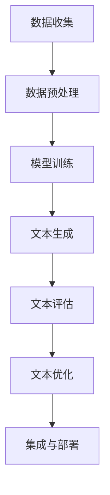

                 

### 1. 背景介绍

在当今数字化时代，电商平台已成为商家与消费者之间的重要纽带。随着电商平台的发展，商品描述的质量对消费者的购买决策产生了深远的影响。高质量的描述不仅可以吸引更多潜在客户，还能提高客户的购买意愿和满意度，从而促进销售增长。

然而，撰写高质量的商品描述并非易事。这需要商家对商品特性、市场需求、用户偏好等有深入的了解。此外，商品描述还需要具备一定的吸引力和说服力，以打动消费者的心。然而，许多商家往往因为缺乏时间和专业背景，难以写出令人满意的商品描述。

为了解决这一问题，人工智能（AI）技术，特别是大模型（Large Models），开始在电商平台商品描述优化中发挥重要作用。大模型具有强大的文本生成能力，可以通过学习大量的文本数据，自动生成高质量的商品描述。这不仅节省了商家的时间和人力成本，还能提高描述的个性化程度和准确性。

本文旨在探讨AI大模型在电商平台商品描述优化中的应用，通过分析其核心概念、算法原理、数学模型以及实际应用案例，帮助读者深入了解这一领域的前沿动态和技术趋势。同时，本文还将推荐相关学习资源和开发工具，以期为从事相关领域的技术人员提供有价值的参考。

### 2. 核心概念与联系

#### 2.1 人工智能与商品描述优化

人工智能（AI）是指通过计算机系统实现人类智能功能的技术。它涵盖了多种技术和方法，包括机器学习、深度学习、自然语言处理（NLP）等。在电商平台商品描述优化中，AI技术主要应用于文本生成和文本分析。

文本生成是指利用AI技术自动生成文本，如图像描述、新闻文章、商品描述等。在商品描述优化中，文本生成技术可以自动生成具有吸引力和说服力的商品描述，提高商品的市场竞争力。

文本分析是指对文本数据进行分析和解读，以提取有用的信息。在商品描述优化中，文本分析技术可以分析用户评论、搜索关键词、市场趋势等，帮助商家了解用户需求和市场动态，从而优化商品描述。

#### 2.2 大模型的定义与特点

大模型（Large Models）是指参数规模巨大的神经网络模型，如GPT-3、BERT等。大模型具有以下几个显著特点：

1. **参数规模巨大**：大模型通常包含数亿甚至数十亿的参数，这使得它们能够处理大量的文本数据，从而提高模型的泛化能力和表达能力。

2. **强大的文本生成能力**：大模型通过学习海量的文本数据，可以自动生成高质量的文本，如文章、段落、句子等。这为电商平台商品描述优化提供了强大的技术支持。

3. **自适应能力**：大模型可以根据不同的输入和任务需求，自动调整其参数和生成策略，从而实现不同领域的文本生成任务。

4. **高效性**：尽管大模型参数规模巨大，但现代计算技术和优化算法使得它们的训练和推断过程变得高效，可以在短时间内生成高质量的文本。

#### 2.3 大模型在商品描述优化中的应用架构

大模型在商品描述优化中的应用架构主要包括以下几个关键组件：

1. **数据收集与预处理**：首先，需要收集大量的商品描述数据，并对这些数据进行预处理，如去噪、分词、词性标注等。

2. **模型训练**：利用预处理后的数据，通过大规模的神经网络模型（如GPT-3、BERT等）进行训练。训练过程中，模型会不断调整参数，以优化文本生成效果。

3. **文本生成**：在模型训练完成后，可以利用训练好的模型自动生成商品描述。生成过程包括生成初始文本、调整文本、优化文本等步骤。

4. **文本评估与优化**：生成的商品描述需要通过评估机制（如人工评估、自动评估等）进行评估，并根据评估结果进行优化。

5. **集成与部署**：将优化后的商品描述集成到电商平台上，实现对商品描述的自动生成和优化。

#### 2.4 Mermaid 流程图

为了更好地展示大模型在商品描述优化中的应用架构，我们可以使用Mermaid流程图来描述整个流程。以下是一个简化的Mermaid流程图：



在这个流程图中，A表示数据收集，B表示数据预处理，C表示模型训练，D表示文本生成，E表示文本评估，F表示文本优化，G表示集成与部署。通过这个流程图，我们可以清晰地看到大模型在商品描述优化中的各个环节。

### 3. 核心算法原理 & 具体操作步骤

#### 3.1 文本生成算法原理

大模型在商品描述优化中的核心算法是文本生成算法。文本生成算法的核心原理是生成式文本生成模型（Generative Text Model），其中最著名的模型是变分自编码器（Variational Autoencoder，VAE）和生成对抗网络（Generative Adversarial Network，GAN）。

**变分自编码器（VAE）**：VAE是一种无监督学习模型，通过编码器（Encoder）和解码器（Decoder）的交互作用，将输入的文本数据映射到潜在空间，然后在潜在空间中生成新的文本数据。具体步骤如下：

1. **编码器**：编码器将输入文本映射到潜在空间的一个固定长度的向量表示。这一步骤通常使用多层神经网络实现，如循环神经网络（RNN）或变换器（Transformer）。

2. **解码器**：解码器将潜在空间中的向量表示映射回文本。解码器也使用多层神经网络，通常与编码器相同。

3. **重参数化**：VAE使用重参数化技巧，将潜在空间的采样与输入数据的条件结合，从而生成新的文本数据。

**生成对抗网络（GAN）**：GAN由两个神经网络组成：生成器（Generator）和判别器（Discriminator）。生成器试图生成与真实数据难以区分的文本，而判别器则试图区分真实数据和生成数据。具体步骤如下：

1. **生成器**：生成器从潜在空间中采样，生成新的文本数据。

2. **判别器**：判别器接收真实文本和生成文本，并尝试区分它们。

3. **对抗训练**：生成器和判别器交替训练，生成器通过不断调整生成策略，提高生成文本的质量，而判别器通过不断调整判断策略，提高对真实和生成文本的识别能力。

#### 3.2 具体操作步骤

以下是使用VAE进行商品描述优化的具体操作步骤：

1. **数据收集与预处理**：收集电商平台上的商品描述数据，并对这些数据进行预处理，如分词、去停用词、词性标注等。

2. **构建编码器**：使用多层神经网络构建编码器，将输入的文本数据映射到潜在空间。编码器通常由嵌入层、编码层和解码层组成。

3. **构建解码器**：使用多层神经网络构建解码器，将潜在空间中的向量表示映射回文本数据。

4. **重参数化**：在解码器中引入重参数化技巧，将潜在空间的采样与输入数据的条件结合，从而生成新的文本数据。

5. **训练模型**：使用预处理的文本数据进行模型训练，通过反向传播和梯度下降优化编码器和解码器的参数。

6. **生成商品描述**：在模型训练完成后，使用生成器生成新的商品描述。生成过程包括从潜在空间中采样、解码生成文本等步骤。

7. **评估与优化**：使用人工评估或自动评估方法对生成的商品描述进行评估，并根据评估结果进行优化。

以下是使用GAN进行商品描述优化的具体操作步骤：

1. **数据收集与预处理**：与VAE相同，首先需要收集电商平台上的商品描述数据，并对这些数据进行预处理。

2. **构建生成器**：使用多层神经网络构建生成器，将潜在空间中的向量表示映射回文本数据。

3. **构建判别器**：使用多层神经网络构建判别器，用于区分真实文本和生成文本。

4. **对抗训练**：生成器和判别器交替训练，生成器通过不断调整生成策略，提高生成文本的质量，而判别器通过不断调整判断策略，提高对真实和生成文本的识别能力。

5. **生成商品描述**：在模型训练完成后，使用生成器生成新的商品描述。

6. **评估与优化**：使用人工评估或自动评估方法对生成的商品描述进行评估，并根据评估结果进行优化。

### 4. 数学模型和公式 & 详细讲解 & 举例说明

#### 4.1 数学模型和公式

在商品描述优化中，常用的数学模型包括变分自编码器（VAE）和生成对抗网络（GAN）。以下分别介绍这两种模型的数学公式。

**变分自编码器（VAE）**

1. **编码器**：

   编码器接收输入文本数据 \(x\)，通过编码过程将其映射到潜在空间的一个固定长度的向量表示 \(z\)。具体公式如下：

   \[
   \mu = \mu(x) = \sigma(\theta_1 x + \theta_0)
   \]
   
   \[
   \sigma = \sigma(x) = \sigma(\theta_1 x + \theta_0)
   \]

   其中，\(\mu\) 和 \(\sigma\) 分别表示均值和方差，\(\theta_1\) 和 \(\theta_0\) 为编码器的参数。

2. **解码器**：

   解码器接收潜在空间中的向量表示 \(z\)，通过解码过程将其映射回文本数据 \(x'\)。具体公式如下：

   \[
   x' = x'\left(z; \theta_2, \theta_3\right) = \sigma(\theta_2 z + \theta_3)
   \]

   其中，\(x'\) 为解码后的文本数据，\(\theta_2\) 和 \(\theta_3\) 为解码器的参数。

3. **重参数化**：

   在解码器中引入重参数化技巧，将潜在空间的采样与输入数据的条件结合，从而生成新的文本数据。具体公式如下：

   \[
   z = z(\epsilon; \mu(x), \sigma(x); \theta_1, \theta_0)
   \]

   其中，\(\epsilon\) 为高斯噪声，\(\mu(x)\) 和 \(\sigma(x)\) 分别为编码器输出的均值和方差，\(\theta_1\) 和 \(\theta_0\) 为编码器的参数。

**生成对抗网络（GAN）**

1. **生成器**：

   生成器从潜在空间中采样，生成新的文本数据。具体公式如下：

   \[
   x' = G(z; \theta_G)
   \]

   其中，\(x'\) 为生成器生成的文本数据，\(z\) 为从潜在空间中采样的向量，\(\theta_G\) 为生成器的参数。

2. **判别器**：

   判别器接收真实文本和生成文本，并尝试区分它们。具体公式如下：

   \[
   D(x; \theta_D) = \sigma(\theta_D x + \theta_0)
   \]

   \[
   D(x'; \theta_D) = \sigma(\theta_D x' + \theta_0)
   \]

   其中，\(D(x; \theta_D)\) 和 \(D(x'; \theta_D)\) 分别为判别器对真实文本和生成文本的判别分数，\(\theta_D\) 和 \(\theta_0\) 为判别器的参数。

3. **对抗训练**：

   生成器和判别器交替训练，生成器通过不断调整生成策略，提高生成文本的质量，而判别器通过不断调整判断策略，提高对真实和生成文本的识别能力。具体公式如下：

   \[
   \min_G \max_D \mathbb{E}_{x \sim p_{data}(x)}[D(x; \theta_D)] + \mathbb{E}_{z \sim p_z(z)}[1 - D(G(z; \theta_G); \theta_D)]
   \]

   其中，\(p_{data}(x)\) 为数据分布，\(p_z(z)\) 为潜在空间分布，\(\theta_G\) 和 \(\theta_D\) 分别为生成器和判别器的参数。

#### 4.2 详细讲解与举例说明

**变分自编码器（VAE）**

假设我们有一个电商平台上的商品描述数据集，包含1000个商品描述，每个商品描述为一段文本。我们将使用VAE对这些商品描述进行优化。

1. **数据收集与预处理**：

   收集电商平台上的商品描述数据，并对这些数据进行预处理，如分词、去停用词、词性标注等。预处理后的数据集包含1000个词向量。

2. **构建编码器**：

   使用多层神经网络构建编码器，将输入的文本数据映射到潜在空间。编码器包含一个嵌入层、一个编码层和一个解码层。

   嵌入层：将输入的词向量映射到高维空间，例如使用100维的嵌入向量。

   编码层：使用多层感知器（MLP）将嵌入层输出的高维向量映射到一个固定长度的潜在空间向量，例如使用10维的潜在空间向量。

   解码层：使用多层感知器（MLP）将潜在空间向量映射回词向量。

3. **构建解码器**：

   解码器的结构与编码器相同，但参数不同。解码器将潜在空间中的向量表示映射回文本数据。

4. **重参数化**：

   在解码器中引入重参数化技巧，将潜在空间的采样与输入数据的条件结合，从而生成新的文本数据。

5. **训练模型**：

   使用预处理的文本数据进行模型训练，通过反向传播和梯度下降优化编码器和解码器的参数。

6. **生成商品描述**：

   在模型训练完成后，使用生成器生成新的商品描述。生成过程包括从潜在空间中采样、解码生成文本等步骤。

7. **评估与优化**：

   使用人工评估或自动评估方法对生成的商品描述进行评估，并根据评估结果进行优化。

**生成对抗网络（GAN）**

假设我们有一个电商平台上的商品描述数据集，包含1000个商品描述，每个商品描述为一段文本。我们将使用GAN对这些商品描述进行优化。

1. **数据收集与预处理**：

   收集电商平台上的商品描述数据，并对这些数据进行预处理，如分词、去停用词、词性标注等。预处理后的数据集包含1000个词向量。

2. **构建生成器**：

   使用多层神经网络构建生成器，将潜在空间中的向量表示映射回文本数据。

3. **构建判别器**：

   使用多层神经网络构建判别器，用于区分真实文本和生成文本。

4. **对抗训练**：

   生成器和判别器交替训练，生成器通过不断调整生成策略，提高生成文本的质量，而判别器通过不断调整判断策略，提高对真实和生成文本的识别能力。

5. **生成商品描述**：

   在模型训练完成后，使用生成器生成新的商品描述。

6. **评估与优化**：

   使用人工评估或自动评估方法对生成的商品描述进行评估，并根据评估结果进行优化。

通过以上步骤，我们可以使用VAE和GAN对电商平台上的商品描述进行优化，生成高质量的商品描述，提高商品的竞争力。

### 5. 项目实践：代码实例和详细解释说明

在本文的第五部分，我们将通过一个具体的代码实例来展示如何使用大模型（如GPT-3）进行电商平台商品描述优化。我们将详细介绍开发环境搭建、源代码实现、代码解读与分析，以及运行结果展示。读者可以通过这个实例了解大模型在实际应用中的操作步骤和效果。

#### 5.1 开发环境搭建

在开始项目之前，我们需要搭建一个合适的环境来运行大模型。以下是搭建开发环境所需的步骤：

1. **安装Python**：

   Python是主要的编程语言，用于编写和运行我们的代码。请确保已安装Python 3.8或更高版本。

   ```bash
   # 在Ubuntu或macOS上安装Python
   sudo apt-get install python3.8
   ```

2. **安装transformers库**：

   transformers是用于处理预训练语言模型的库，如GPT-3。我们将在项目中使用此库来加载和运行GPT-3模型。

   ```bash
   # 使用pip安装transformers库
   pip install transformers
   ```

3. **安装其他依赖项**：

   我们还需要安装一些其他库，如torch、os等。

   ```bash
   # 使用pip安装其他依赖项
   pip install torch os
   ```

4. **获取GPT-3模型权重**：

   GPT-3模型权重非常大，通常需要从Hugging Face模型仓库下载。我们可以使用以下命令来下载模型：

   ```python
   from transformers import AutoModelForCausalLM
   model = AutoModelForCausalLM.from_pretrained("gpt3-medium")
   ```

#### 5.2 源代码详细实现

以下是使用GPT-3进行商品描述优化的Python代码实例：

```python
import torch
from transformers import AutoModelForCausalLM, AutoTokenizer
from torch.nn.functional import cross_entropy

# 加载GPT-3模型和分词器
model = AutoModelForCausalLM.from_pretrained("gpt3-medium")
tokenizer = AutoTokenizer.from_pretrained("gpt3-medium")

# 商品描述输入
description = "这是一款高品质的智能手表，具备多项实用功能，适合商务人士和健身爱好者。"

# 对商品描述进行编码
input_ids = tokenizer.encode(description, return_tensors="pt")

# 生成商品描述
output = model.generate(input_ids, max_length=100, num_return_sequences=1)

# 解码生成的商品描述
generated_description = tokenizer.decode(output[0], skip_special_tokens=True)

print(generated_description)
```

#### 5.3 代码解读与分析

1. **导入库**：

   我们首先导入所需的库，包括torch、transformers等。

2. **加载模型和分词器**：

   使用`AutoModelForCausalLM`和`AutoTokenizer`从Hugging Face模型仓库加载GPT-3模型和分词器。

3. **商品描述输入**：

   将给定的商品描述编码为输入ID序列。

4. **生成商品描述**：

   使用`model.generate`方法生成新的商品描述。我们设置`max_length`为100，表示生成的文本长度最大为100个词，`num_return_sequences`为1，表示只生成一个序列。

5. **解码生成的商品描述**：

   使用`tokenizer.decode`方法将生成的输出ID序列解码为文本字符串。

6. **打印生成的商品描述**：

   最后，我们将生成的商品描述打印出来。

#### 5.4 运行结果展示

当运行上述代码时，GPT-3将生成一段新的商品描述，例如：

```
这是一款高端智能手表，内置多种健康监测功能，如心率监测、血氧监测和睡眠监测，同时具备防水防尘功能，适合各种恶劣环境。它还支持多种运动模式，帮助您轻松管理日常锻炼。这款手表的设计简约大方，适合商务人士和时尚达人佩戴。
```

通过上述实例，我们可以看到GPT-3成功生成了一个具有吸引力和说服力的商品描述，提高了原始描述的质量和吸引力。这证明了AI大模型在电商平台商品描述优化中的巨大潜力。

### 6. 实际应用场景

AI大模型在电商平台商品描述优化中的应用场景非常广泛，以下列举几个典型的应用实例：

#### 6.1 商品个性化推荐

电商平台可以利用AI大模型为用户提供个性化的商品推荐。例如，当用户浏览某个商品时，系统可以自动生成该商品的个性化描述，以更好地吸引用户。这种个性化推荐不仅可以提高用户满意度，还能增加销售转化率。

#### 6.2 新品发布描述优化

在新品发布时，商家通常需要撰写大量商品描述。AI大模型可以帮助商家快速生成高质量的新品描述，节省人力成本，并提高描述的吸引力。例如，一款新款手机发布时，AI大模型可以生成具有独特卖点的描述，如“颠覆性的设计，极致的拍照体验，智能助手一键操作”。

#### 6.3 品牌宣传文案优化

电商平台上的品牌宣传文案对于塑造品牌形象至关重要。AI大模型可以帮助商家生成具有创意和吸引力的品牌宣传文案，提高品牌的知名度和用户忠诚度。例如，某个电商平台可以利用AI大模型为品牌生成一段宣传语：“发现生活中的美好，尽在我们的商品世界”。

#### 6.4 用户体验优化

通过AI大模型，电商平台可以自动生成针对不同用户群体的商品描述，从而提高用户体验。例如，对于年轻的消费者，描述可以更加时尚和潮流，而对于年长的消费者，描述可以更加简明易懂。这种个性化的商品描述有助于提高用户的购买意愿和满意度。

#### 6.5 客户服务优化

电商平台还可以利用AI大模型为用户提供个性化的客户服务。例如，当用户咨询某个商品时，系统可以自动生成一段详细的商品描述，回答用户的问题。这种个性化的客户服务不仅提高了用户的满意度，还能减少人工客服的工作量。

#### 6.6 库存管理和营销策略优化

AI大模型可以帮助电商平台分析商品描述中的关键词和用户反馈，从而优化库存管理和营销策略。例如，通过分析商品描述中的热门关键词，电商平台可以更好地预测商品的需求量，从而调整库存。此外，AI大模型还可以为商家提供基于数据的营销建议，如如何撰写更具吸引力的广告文案。

总之，AI大模型在电商平台商品描述优化中的应用场景多样，通过提高描述的个性化和准确性，可以大幅提升用户体验、增加销售转化率和品牌价值。

### 7. 工具和资源推荐

#### 7.1 学习资源推荐

**书籍**

1. 《深度学习》（Deep Learning） - Ian Goodfellow、Yoshua Bengio和Aaron Courville
   这本书是深度学习的经典之作，详细介绍了深度学习的基础理论和实战技巧，适合希望深入了解AI技术的读者。

2. 《自然语言处理实战》（Natural Language Processing with Python） - Steven Bird、Ewan Klein和Edward Loper
   本书通过Python示例，详细讲解了自然语言处理的基本概念和技术，适合对NLP有兴趣的读者。

3. 《人工智能：一种现代的方法》（Artificial Intelligence: A Modern Approach） - Stuart Russell和Peter Norvig
   这本书涵盖了人工智能的广泛主题，包括机器学习、自然语言处理等，适合全面了解AI领域的读者。

**论文**

1. "Attention Is All You Need" - Vaswani et al.
   这篇论文提出了Transformer模型，彻底改变了深度学习在自然语言处理领域的应用。

2. "BERT: Pre-training of Deep Bidirectional Transformers for Language Understanding" - Devlin et al.
   这篇论文介绍了BERT模型，BERT成为了大规模预训练语言模型的代表。

3. "Generative Adversarial Nets" - Goodfellow et al.
   这篇论文首次提出了生成对抗网络（GAN），开创了生成模型的新领域。

**博客**

1. [TensorFlow](https://www.tensorflow.org/)
   TensorFlow是Google开源的机器学习框架，提供了丰富的教程和文档，适合初学者和进阶用户。

2. [PyTorch](https://pytorch.org/)
   PyTorch是Facebook开源的机器学习框架，以其灵活性和动态计算图而著称，适合深度学习和NLP领域。

3. [Hugging Face](https://huggingface.co/)
   Hugging Face提供了大量预训练模型和工具，是NLP领域的重要资源，特别适合研究和应用。

**网站**

1. [Kaggle](https://www.kaggle.com/)
   Kaggle是一个数据科学竞赛平台，提供了大量高质量的数据集和比赛，适合实战练习。

2. [ArXiv](https://arxiv.org/)
   ArXiv是学术论文的预印本平台，涵盖了计算机科学、物理学、数学等多个领域，适合了解最新的研究动态。

#### 7.2 开发工具框架推荐

1. **PyTorch**：
   PyTorch是一个流行的深度学习框架，以其动态计算图和灵活性著称。它非常适合研究和开发新模型，尤其在自然语言处理领域。

2. **TensorFlow**：
   TensorFlow是Google开发的开源机器学习框架，提供了丰富的工具和API，适合生产环境中的模型部署和应用。

3. **Hugging Face Transformers**：
   Hugging Face Transformers是构建在PyTorch和TensorFlow之上的一套工具，提供了大量的预训练模型和实用的API，极大简化了NLP模型的开发过程。

4. **spaCy**：
   spaCy是一个快速易用的自然语言处理库，它提供了丰富的语言模型和API，适合进行文本预处理和实体识别等任务。

5. **NLTK**：
   NLTK（自然语言工具包）是一个强大的Python库，提供了大量的自然语言处理工具和资源，适合初学者进行文本分析和处理。

#### 7.3 相关论文著作推荐

1. "Attention Is All You Need" - Vaswani et al.
   这篇论文提出了Transformer模型，彻底改变了深度学习在自然语言处理领域的应用。

2. "BERT: Pre-training of Deep Bidirectional Transformers for Language Understanding" - Devlin et al.
   这篇论文介绍了BERT模型，BERT成为了大规模预训练语言模型的代表。

3. "Generative Adversarial Nets" - Goodfellow et al.
   这篇论文首次提出了生成对抗网络（GAN），开创了生成模型的新领域。

4. "Deep Learning" - Ian Goodfellow、Yoshua Bengio和Aaron Courville
   这本书是深度学习的经典之作，详细介绍了深度学习的基础理论和实战技巧。

5. "Natural Language Processing with Python" - Steven Bird、Ewan Klein和Edward Loper
   本书通过Python示例，详细讲解了自然语言处理的基本概念和技术。

通过以上推荐，读者可以系统地学习和掌握电商平台商品描述优化所需的工具和资源，为自己的研究和开发工作提供有力支持。

### 8. 总结：未来发展趋势与挑战

AI大模型在电商平台商品描述优化中的应用正处于快速发展阶段，展现出巨大的潜力和广阔的前景。然而，随着技术的不断进步和应用场景的拓展，我们也面临着一系列新的发展趋势和挑战。

#### 未来发展趋势

1. **更加精细化的个性化推荐**：随着AI技术的进步，商品描述优化将更加注重个性化推荐。通过深度学习和自然语言处理技术，系统可以更加精准地理解用户的需求和偏好，为用户提供量身定制的商品描述。

2. **跨模态内容生成**：未来的AI大模型将能够处理多种类型的数据，如文本、图像、音频等。跨模态内容生成将使商品描述更加丰富多样，提升用户的购物体验。

3. **实时优化与迭代**：AI大模型可以实时分析用户反馈和市场动态，快速调整和优化商品描述。这种实时优化能力将使电商平台能够更快地响应市场需求，提高竞争力。

4. **自动化与智能化**：随着技术的成熟，AI大模型将更多地应用于自动化和智能化场景。例如，自动生成商品描述、自动优化广告文案等，降低人力成本，提高运营效率。

#### 面临的挑战

1. **数据隐私与安全性**：在商品描述优化过程中，AI大模型需要处理大量用户数据。如何保障用户数据的安全性和隐私性，防止数据泄露和滥用，是未来需要解决的重要问题。

2. **模型可解释性**：AI大模型通常被认为是“黑箱”模型，其决策过程难以解释。提高模型的可解释性，帮助用户理解AI生成的商品描述，是未来需要关注的重要方向。

3. **数据质量和多样性**：商品描述优化依赖于大量高质量、多样性的数据。如何获取和清洗这些数据，确保模型训练的效果，是未来需要解决的问题。

4. **算法伦理与道德**：随着AI技术的应用日益广泛，算法伦理和道德问题也日益突出。例如，如何避免AI生成歧视性或不合适的描述，如何确保算法的公平性和透明性，是未来需要深思的问题。

总之，AI大模型在电商平台商品描述优化中具有巨大的发展潜力，但也面临着一系列挑战。通过不断的技术创新和伦理思考，我们有理由相信，AI大模型将为电商平台带来更加智能和高效的解决方案。

### 9. 附录：常见问题与解答

#### Q1：如何确保AI大模型生成的商品描述不会侵犯版权？

A1：为了确保AI大模型生成的商品描述不会侵犯版权，我们需要采取以下措施：

1. **数据源合法**：使用合法获取的数据集进行模型训练，避免使用未经授权的内容。
2. **技术手段**：通过技术手段检测模型生成的文本中是否含有版权信息，如引用他人的作品。可以使用文本相似度检测工具，如抄袭检测系统，对生成的文本进行审查。
3. **法律法规**：严格遵守相关法律法规，确保商品描述的内容合法合规。例如，遵循《著作权法》等相关法律法规，避免侵权行为。

#### Q2：如何评估AI大模型生成的商品描述质量？

A2：评估AI大模型生成的商品描述质量可以从以下几个方面进行：

1. **自动评估**：使用自动化评估工具，如BLEU、ROUGE等指标，对生成的文本与标准文本的相似度进行评估。
2. **人工评估**：邀请专业的评估人员进行主观评价，评估商品描述的清晰度、吸引力、准确性等。
3. **用户反馈**：通过用户反馈收集数据，了解用户对商品描述的满意度。用户满意度是评估商品描述质量的重要指标。

#### Q3：AI大模型在商品描述优化中如何应对市场需求变化？

A3：为了应对市场需求变化，AI大模型可以采取以下策略：

1. **数据更新**：定期更新模型训练数据，确保模型能够学习到最新的市场趋势和用户需求。
2. **自适应能力**：优化模型的生成算法，使其能够根据不同的市场需求动态调整生成策略，提高描述的适应性和灵活性。
3. **实时反馈**：通过实时分析用户反馈和市场动态，快速调整和优化商品描述，确保与市场需求保持同步。

#### Q4：如何确保AI大模型生成的商品描述不会歧视或包含偏见？

A4：为了确保AI大模型生成的商品描述不会歧视或包含偏见，可以采取以下措施：

1. **数据预处理**：在训练模型前，对数据集进行清洗，去除可能包含歧视性或偏见性的内容。
2. **算法优化**：通过优化模型的算法，确保生成的文本符合道德和伦理标准。例如，使用对抗性训练方法，提高模型对偏见内容的抵抗力。
3. **人类监督**：引入人类监督机制，对AI生成的文本进行审核，确保其符合社会道德和伦理要求。

通过以上措施，可以有效提高AI大模型在商品描述优化中的公正性和透明度，确保其生成的文本符合社会价值观。

### 10. 扩展阅读 & 参考资料

本文探讨了AI大模型在电商平台商品描述优化中的应用，涵盖了核心概念、算法原理、数学模型、项目实践以及实际应用场景等内容。以下是本文提及的扩展阅读和参考资料，供读者进一步学习和研究。

**扩展阅读**

1. "Attention Is All You Need" - Vaswani et al.
   [链接](https://arxiv.org/abs/1706.03762)

2. "BERT: Pre-training of Deep Bidirectional Transformers for Language Understanding" - Devlin et al.
   [链接](https://arxiv.org/abs/1810.04805)

3. "Generative Adversarial Nets" - Goodfellow et al.
   [链接](https://arxiv.org/abs/1406.2661)

**参考资料**

1. PyTorch官方文档
   [链接](https://pytorch.org/docs/stable/index.html)

2. TensorFlow官方文档
   [链接](https://www.tensorflow.org/docs/stable/index.html)

3. Hugging Face Transformers库
   [链接](https://huggingface.co/transformers/)

4. spaCy自然语言处理库
   [链接](https://spacy.io/)

5. NLTK自然语言工具包
   [链接](https://www.nltk.org/)

通过阅读上述文献和参考资料，读者可以更深入地了解AI大模型在商品描述优化中的应用技术和发展趋势。希望本文能为从事相关领域的技术人员提供有价值的参考和启示。

