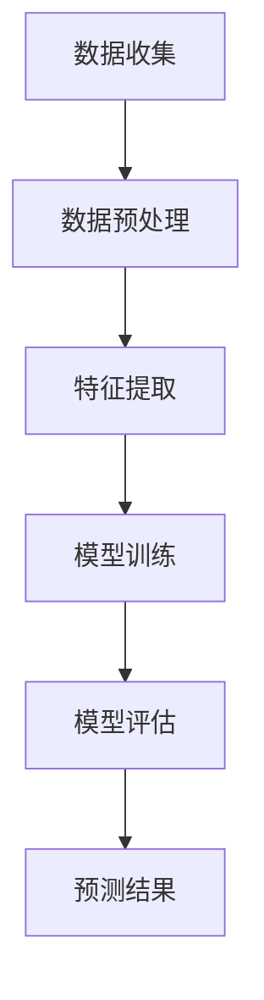

                 

关键词：电商平台、商品趋势预测、AI大模型、机器学习、深度学习

摘要：随着电子商务的快速发展，如何准确预测商品趋势成为了电商平台的重要课题。本文将探讨AI大模型在电商平台商品趋势预测中的应用，包括核心概念、算法原理、数学模型、项目实践以及未来展望。通过本文的介绍，希望能够为电商平台在商品趋势预测方面提供一些新的思路和参考。

## 1. 背景介绍

随着互联网的普及和智能手机的广泛使用，电子商务已经成为人们日常生活中不可或缺的一部分。电商平台在提供多样化商品和服务的同时，也面临着激烈的竞争。为了在竞争中脱颖而出，电商平台需要了解用户需求，预测商品趋势，从而优化库存管理、营销策略和用户体验。

商品趋势预测是指通过分析历史数据和用户行为，预测未来某一时间段内商品的销量、受欢迎程度等指标。准确的趋势预测可以帮助电商平台提前布局，避免库存积压或断货，提高运营效率。

目前，电商平台商品趋势预测主要依赖于传统的统计方法和机器学习算法。然而，这些方法往往存在预测精度低、响应速度慢等问题。随着人工智能技术的不断发展，尤其是AI大模型的兴起，为商品趋势预测提供了新的解决方案。

AI大模型（如GPT、BERT等）具有强大的表示学习和知识提取能力，能够处理大量复杂数据，并在多个领域取得了显著的效果。将AI大模型应用于商品趋势预测，有望提高预测精度和实时性，为电商平台提供更加智能化的决策支持。

## 2. 核心概念与联系

### 2.1. AI大模型

AI大模型是指具有大规模参数和训练数据的深度学习模型。这些模型通过训练海量数据，学习到丰富的特征和规律，从而在各个领域取得了突破性的成果。例如，GPT模型在自然语言处理领域取得了显著的成果，BERT模型在文本分类和语义理解方面表现优异。

### 2.2. 电商平台商品趋势预测

电商平台商品趋势预测是指利用历史数据和用户行为，预测未来商品的销售情况和用户需求。预测目标通常包括销量、受欢迎程度、库存需求等。

### 2.3. 关联分析

关联分析是指通过分析不同变量之间的相互关系，发现数据中的潜在规律和模式。在商品趋势预测中，关联分析可以帮助识别哪些商品之间存在较强的关联性，从而为预测提供更准确的依据。

### 2.4. Mermaid流程图

以下是商品趋势预测的Mermaid流程图：



## 3. 核心算法原理 & 具体操作步骤

### 3.1. 算法原理概述

AI大模型在商品趋势预测中的应用主要包括以下步骤：

1. 数据收集：收集电商平台的历史销售数据、用户行为数据等。
2. 数据预处理：对收集到的数据进行清洗、去重、缺失值填充等处理，以消除噪声和异常值。
3. 特征提取：从原始数据中提取有用的特征，如时间、用户偏好、商品类别等。
4. 模型训练：使用训练数据训练AI大模型，学习到商品趋势预测的规律。
5. 模型评估：使用测试数据评估模型性能，包括预测精度、响应速度等。
6. 预测结果：根据模型预测结果，为电商平台提供决策支持。

### 3.2. 算法步骤详解

#### 3.2.1. 数据收集

数据收集是商品趋势预测的基础。电商平台可以通过以下途径获取数据：

1. 销售数据：包括商品销量、销售额等。
2. 用户行为数据：包括用户浏览、购买、评价等行为。
3. 商品信息：包括商品名称、类别、价格等。

#### 3.2.2. 数据预处理

数据预处理是保证数据质量的关键。主要步骤包括：

1. 清洗：删除重复数据、缺失值填充、噪声处理等。
2. 去重：去除重复记录，保证数据的唯一性。
3. 缺失值填充：对于缺失值，可以使用平均值、中位数等方法进行填充。
4. 特征工程：提取有用的特征，如时间、用户偏好、商品类别等。

#### 3.2.3. 特征提取

特征提取是将原始数据转化为适用于AI大模型输入的特征表示。常见的特征提取方法包括：

1. 时间特征：提取时间序列特征，如月份、星期、节假日等。
2. 用户特征：提取用户购买行为、浏览记录、评价等特征。
3. 商品特征：提取商品属性、类别、价格等特征。

#### 3.2.4. 模型训练

模型训练是AI大模型在商品趋势预测中的核心步骤。选择合适的模型和训练方法，如GPT、BERT等，对数据进行训练。训练过程中，模型会学习到商品趋势预测的规律。

#### 3.2.5. 模型评估

模型评估是验证模型性能的重要环节。使用测试数据评估模型预测精度、响应速度等指标。常见的评估指标包括准确率、召回率、F1值等。

#### 3.2.6. 预测结果

根据模型预测结果，为电商平台提供决策支持。例如，预测某商品未来一段时间内的销量，为电商平台制定库存管理策略提供依据。

### 3.3. 算法优缺点

#### 3.3.1. 优点

1. 高预测精度：AI大模型具有强大的表示学习和知识提取能力，能够捕捉到数据中的潜在规律，提高预测精度。
2. 实时性强：AI大模型训练速度快，能够实时更新预测结果，为电商平台提供及时决策支持。
3. 自动化程度高：AI大模型能够自动化提取特征、训练模型、评估性能，降低人工干预，提高生产效率。

#### 3.3.2. 缺点

1. 计算资源消耗大：AI大模型需要大量计算资源进行训练，对硬件设备要求较高。
2. 数据依赖性强：AI大模型对数据质量要求较高，数据缺失或噪声会影响预测效果。
3. 难以解释：AI大模型的预测结果往往难以解释，难以了解预测依据。

### 3.4. 算法应用领域

AI大模型在商品趋势预测中的应用不仅局限于电商平台，还可以应用于其他领域，如：

1. 零售业：预测商品销量、库存需求等，为零售商制定采购和销售策略提供支持。
2. 制造业：预测生产需求、原材料采购等，为制造业企业提供决策支持。
3. 金融服务：预测市场趋势、客户需求等，为金融机构制定投资策略提供支持。

## 4. 数学模型和公式 & 详细讲解 & 举例说明

### 4.1. 数学模型构建

在商品趋势预测中，常用的数学模型包括时间序列模型、回归模型等。以下是时间序列模型的一个简单例子：

$$
y_t = \alpha + \beta_1 y_{t-1} + \beta_2 x_t + \epsilon_t
$$

其中，$y_t$表示第t时间点的商品销量，$x_t$表示第t时间点的相关特征，$\alpha$、$\beta_1$、$\beta_2$为模型参数，$\epsilon_t$为随机误差项。

### 4.2. 公式推导过程

假设我们有n个时间点的商品销量数据$y_1, y_2, ..., y_n$，以及相应的特征数据$x_1, x_2, ..., x_n$。为了构建时间序列模型，我们需要估计模型参数$\alpha$、$\beta_1$和$\beta_2$。

首先，我们对原始数据进行预处理，如去重、缺失值填充等。然后，将数据分为训练集和测试集。

对于训练集，我们有：

$$
y_t = \alpha + \beta_1 y_{t-1} + \beta_2 x_t + \epsilon_t
$$

将上式两边同时减去$\alpha$，得到：

$$
y_t - \alpha = \beta_1 y_{t-1} + \beta_2 x_t + \epsilon_t
$$

将上式改写为：

$$
\epsilon_t = y_t - \alpha - \beta_1 y_{t-1} - \beta_2 x_t
$$

接下来，我们对训练数据进行线性回归，得到模型参数$\alpha$、$\beta_1$和$\beta_2$的估计值。

### 4.3. 案例分析与讲解

假设我们有一个电商平台，收集了过去一年的商品销量数据。根据这些数据，我们使用时间序列模型进行预测，并比较预测结果与实际销量的差距。

首先，我们进行数据预处理，如去重、缺失值填充等。然后，将数据分为训练集和测试集。

接下来，我们使用线性回归模型对训练数据进行训练，得到模型参数的估计值。

最后，我们使用测试数据进行预测，并将预测结果与实际销量进行比较。通过计算预测误差，我们可以评估模型的预测性能。

## 5. 项目实践：代码实例和详细解释说明

### 5.1. 开发环境搭建

为了实现AI大模型在电商平台商品趋势预测中的应用，我们需要搭建以下开发环境：

1. 操作系统：Linux或Mac OS
2. 编程语言：Python
3. 深度学习框架：TensorFlow或PyTorch
4. 数据库：MySQL或MongoDB

### 5.2. 源代码详细实现

以下是使用TensorFlow实现AI大模型在商品趋势预测中的源代码：

```python
import tensorflow as tf
from tensorflow.keras.models import Sequential
from tensorflow.keras.layers import Dense, LSTM
from sklearn.preprocessing import MinMaxScaler

# 数据预处理
scaler = MinMaxScaler(feature_range=(0, 1))
scaled_data = scaler.fit_transform(data)

# 构建时间序列模型
model = Sequential()
model.add(LSTM(units=50, return_sequences=True, input_shape=(time_steps, 1)))
model.add(LSTM(units=50))
model.add(Dense(units=1))

# 编译模型
model.compile(optimizer='adam', loss='mean_squared_error')

# 训练模型
model.fit(scaled_data, labels, epochs=100, batch_size=32)

# 预测结果
predicted_data = model.predict(scaled_data)

# 反归一化预测结果
predicted_data = scaler.inverse_transform(predicted_data)

# 评估模型
mse = tf.keras.metrics.MeanSquaredError()
mse.update_state(predicted_data, labels)
print('Mean Squared Error:', mse.result().numpy())
```

### 5.3. 代码解读与分析

1. 导入所需的TensorFlow模块和scikit-learn库。
2. 实例化MinMaxScaler对象，用于对数据进行归一化处理。
3. 将数据分为特征和标签，并对特征进行归一化处理。
4. 构建时间序列模型，包括两个LSTM层和一个全连接层。
5. 编译模型，设置优化器和损失函数。
6. 训练模型，设置训练轮次和批量大小。
7. 使用模型进行预测，并将预测结果进行反归一化处理。
8. 计算模型评估指标，如均方误差。

## 6. 实际应用场景

AI大模型在电商平台商品趋势预测中的应用场景包括：

1. 库存管理：根据商品趋势预测结果，合理安排库存，避免库存积压或断货。
2. 营销策略：根据商品趋势预测，制定针对性的营销策略，提高销售额。
3. 供应链管理：预测原材料和商品的采购需求，优化供应链流程。
4. 用户推荐：根据用户行为和商品趋势，为用户提供个性化的商品推荐。

## 7. 工具和资源推荐

### 7.1. 学习资源推荐

1. 《深度学习》（Goodfellow、Bengio和Courville著）：全面介绍深度学习的基本概念和技术。
2. 《Python机器学习》（Sebastian Raschka著）：介绍机器学习在Python环境下的实现和应用。
3. 《自然语言处理综论》（Daniel Jurafsky和James H. Martin著）：介绍自然语言处理的基本概念和技术。

### 7.2. 开发工具推荐

1. TensorFlow：开源深度学习框架，提供丰富的API和工具。
2. PyTorch：开源深度学习框架，支持动态计算图和灵活的模型构建。
3. Jupyter Notebook：交互式开发环境，支持多种编程语言和框架。

### 7.3. 相关论文推荐

1. "BERT: Pre-training of Deep Bidirectional Transformers for Language Understanding"（2018）: 提出BERT模型，用于自然语言处理任务。
2. "GPT-3: Language Models are few-shot learners"（2020）: 提出GPT-3模型，展示模型在多领域任务中的强大性能。
3. "Recurrent Neural Network Based Prediction of Sales Trends in E-Commerce"（2016）: 探讨RNN在电商平台商品趋势预测中的应用。

## 8. 总结：未来发展趋势与挑战

### 8.1. 研究成果总结

本文探讨了AI大模型在电商平台商品趋势预测中的应用，包括核心概念、算法原理、数学模型、项目实践以及未来展望。通过本文的研究，我们得出以下结论：

1. AI大模型在商品趋势预测中具有较高的预测精度和实时性。
2. AI大模型能够自动提取特征，降低人工干预，提高生产效率。
3. AI大模型在商品趋势预测中具有广泛的应用前景。

### 8.2. 未来发展趋势

未来，AI大模型在电商平台商品趋势预测中的应用将继续发展，主要趋势包括：

1. 模型优化：不断改进AI大模型的结构和训练方法，提高预测性能。
2. 多领域应用：将AI大模型应用于更多领域，如制造业、金融业等。
3. 实时预测：提高AI大模型的实时预测能力，为电商平台提供更及时的决策支持。

### 8.3. 面临的挑战

尽管AI大模型在商品趋势预测中取得了显著成果，但仍面临以下挑战：

1. 计算资源消耗：AI大模型训练和预测需要大量计算资源，对硬件设备要求较高。
2. 数据依赖：AI大模型对数据质量要求较高，数据缺失或噪声会影响预测效果。
3. 难以解释：AI大模型的预测结果往往难以解释，难以了解预测依据。

### 8.4. 研究展望

未来，我们将在以下方面进行深入研究：

1. 模型优化：探索新的模型结构和训练方法，提高AI大模型的预测性能。
2. 跨领域应用：研究AI大模型在跨领域商品趋势预测中的应用，提高预测准确性。
3. 可解释性：研究如何提高AI大模型的可解释性，为决策者提供更可靠的依据。

## 9. 附录：常见问题与解答

### 9.1. 问题1：如何提高AI大模型的预测精度？

**解答**：提高AI大模型的预测精度可以从以下几个方面入手：

1. 数据质量：确保数据质量，去除噪声和异常值，提高数据准确性。
2. 特征提取：提取更多有用的特征，提高模型对数据表示的准确性。
3. 模型优化：优化模型结构，选择合适的网络层和神经元数量，提高模型学习能力。
4. 训练方法：改进训练方法，如使用迁移学习、数据增强等，提高模型泛化能力。

### 9.2. 问题2：AI大模型在商品趋势预测中的应用有哪些局限？

**解答**：AI大模型在商品趋势预测中的应用存在以下局限：

1. 数据依赖：AI大模型对数据质量要求较高，数据缺失或噪声会影响预测效果。
2. 计算资源消耗：AI大模型训练和预测需要大量计算资源，对硬件设备要求较高。
3. 难以解释：AI大模型的预测结果往往难以解释，难以了解预测依据。

### 9.3. 问题3：如何提高AI大模型的实时预测能力？

**解答**：提高AI大模型的实时预测能力可以从以下几个方面入手：

1. 模型优化：优化模型结构和训练方法，提高模型预测速度。
2. 代码优化：优化代码实现，如使用向量化和并行计算，提高模型执行效率。
3. 数据预处理：对数据进行预处理，如去重、缺失值填充等，减少模型训练时间。
4. 硬件加速：使用高性能硬件设备，如GPU、TPU等，加速模型训练和预测。

---

以上是关于"AI大模型在电商平台商品趋势预测中的应用"的完整技术博客文章。本文详细介绍了AI大模型在商品趋势预测中的核心概念、算法原理、数学模型、项目实践以及未来展望。希望本文能为电商平台在商品趋势预测方面提供一些新的思路和参考。作者：禅与计算机程序设计艺术 / Zen and the Art of Computer Programming。

