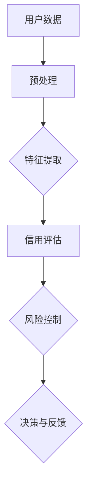

                 

### 背景介绍

随着互联网技术的飞速发展，电商平台已经成为现代商业活动中的重要组成部分。在这样一个庞大的生态系统中，用户信用评估与风险控制成为了电商平台运营的关键环节。传统的信用评估方法主要依赖于用户的信用记录、交易历史等信息，但这些方法往往存在一定的局限性，无法全面、准确地评估用户的信用风险。

为了解决这一问题，人工智能技术，尤其是大规模预训练模型（如GPT-3、BERT等）开始应用于用户信用评估与风险控制领域。这些大模型具有强大的数据处理和模式识别能力，可以有效地提取用户行为的潜在特征，从而提供更为准确和高效的信用评估结果。

本文旨在探讨人工智能大模型在电商平台用户信用评估与风险控制中的作用，通过分析大模型的工作原理、应用场景和实践案例，揭示其潜力和挑战。文章的结构如下：

1. **背景介绍**：概述电商平台用户信用评估与风险控制的重要性，以及人工智能大模型的崛起背景。
2. **核心概念与联系**：介绍用户信用评估与风险控制的核心概念，并使用Mermaid流程图展示相关架构。
3. **核心算法原理与具体操作步骤**：详细讲解大模型在信用评估中的应用原理和操作步骤。
4. **数学模型和公式**：阐述大模型背后的数学模型和公式，并通过实例进行详细讲解。
5. **项目实践**：通过代码实例展示大模型在用户信用评估中的实际应用，并进行详细解释和分析。
6. **实际应用场景**：分析大模型在电商平台用户信用评估与风险控制中的具体应用场景。
7. **工具和资源推荐**：推荐相关学习资源、开发工具和框架。
8. **总结：未来发展趋势与挑战**：总结大模型在用户信用评估与风险控制中的应用趋势和面临的挑战。
9. **附录：常见问题与解答**：解答读者可能遇到的常见问题。
10. **扩展阅读与参考资料**：提供更多深入阅读和研究的资源。

接下来，我们将逐步深入探讨人工智能大模型在电商平台用户信用评估与风险控制中的具体应用。首先，从背景介绍入手，让我们理解这一领域的现状和挑战。

### 核心概念与联系

在探讨人工智能大模型在电商平台用户信用评估与风险控制中的作用之前，我们需要先了解几个核心概念：用户信用评估、风险控制，以及大模型的架构和原理。

#### 用户信用评估

用户信用评估是指通过对用户的信用记录、交易行为、社会关系等多维度数据进行分析，评估用户的信用风险，从而决定是否给予用户授信、贷款等金融服务。传统的信用评估方法主要依赖于用户的信用记录、交易历史等显性数据，但这些方法往往存在一定的局限性，无法全面、准确地评估用户的信用风险。

#### 风险控制

风险控制是指通过识别、评估、监控和管理风险，以减少或避免潜在损失的过程。在电商平台上，风险控制尤为重要，因为平台的交易规模庞大，一旦发生风险事件，可能会对平台的运营和用户的利益造成严重影响。因此，如何有效地识别和防范风险成为了电商平台亟待解决的问题。

#### 大模型的架构和原理

大模型，尤其是基于深度学习的预训练模型，如GPT-3、BERT等，具有强大的数据处理和模式识别能力。这些模型通过在大量数据上进行预训练，可以自动学习到丰富的特征表示，从而在新的任务中表现出优异的性能。大模型的架构通常包括输入层、隐藏层和输出层，通过多层神经网络进行信息传递和特征提取。

在用户信用评估与风险控制中，大模型的应用主要包括以下几个方面：

1. **特征提取**：大模型可以从用户的交易记录、行为数据中提取出隐含的特征，这些特征往往比原始数据更具解释力和代表性。
2. **风险预测**：大模型可以基于提取的特征，对用户的信用风险进行预测，从而为平台的决策提供依据。
3. **欺诈检测**：大模型可以识别用户的异常行为，从而防范欺诈行为。

#### Mermaid流程图

为了更直观地展示用户信用评估与风险控制中的大模型架构，我们可以使用Mermaid流程图来表示。以下是一个简单的Mermaid流程图示例：



在这个流程图中，用户数据经过预处理后，输入到大模型中进行特征提取，然后用于信用评估和风险控制，最终产生决策和反馈。

#### 结论

通过上述核心概念的介绍和Mermaid流程图的展示，我们可以看到，人工智能大模型在用户信用评估与风险控制中具有重要的作用。大模型不仅可以提高信用评估的准确性，还可以有效地识别和防范风险，从而为电商平台的稳健运营提供强有力的支持。

接下来，我们将进一步探讨大模型的核心算法原理与具体操作步骤，深入理解其在信用评估和风险控制中的应用。

### 核心算法原理 & 具体操作步骤

#### 1. 特征提取

在用户信用评估与风险控制中，特征提取是至关重要的一步。大模型通过自动学习用户数据中的隐含特征，从而提高信用评估和风险预测的准确性。以下是大模型特征提取的具体步骤：

1. **数据收集**：首先，从电商平台获取用户的交易数据、行为数据等原始数据。
2. **数据预处理**：对原始数据进行清洗、去噪、填充缺失值等预处理操作，以保证数据的质量和一致性。
3. **特征工程**：根据业务需求，对预处理后的数据进行特征工程，包括构造新的特征、标准化和归一化等。
4. **特征提取**：将预处理后的数据输入到大模型中，通过多层神经网络进行特征提取。大模型可以自动学习到用户数据中的隐含特征，从而为信用评估和风险预测提供支持。

#### 2. 风险预测

大模型在提取用户特征后，可以基于这些特征进行风险预测。以下是风险预测的具体步骤：

1. **模型选择**：选择合适的大模型，如GPT-3、BERT等，进行风险预测。
2. **模型训练**：将提取的用户特征输入到模型中，通过反向传播算法进行训练，优化模型的参数。
3. **模型评估**：使用交叉验证等方法对模型进行评估，确保模型的预测性能。
4. **预测应用**：将训练好的模型应用于实际用户数据，进行风险预测。

#### 3. 欺诈检测

欺诈检测是电商平台风险控制的重要环节。大模型可以通过以下步骤进行欺诈检测：

1. **行为分析**：收集用户的交易行为数据，包括时间、金额、频率等。
2. **特征提取**：将交易行为数据输入到大模型中，提取潜在的欺诈特征。
3. **模型选择**：选择合适的大模型进行欺诈检测。
4. **模型训练与评估**：训练和评估模型，确保模型能够准确识别欺诈行为。
5. **实时监测**：将训练好的模型应用于实时交易数据，进行欺诈检测。

#### 4. 决策与反馈

在用户信用评估与风险控制中，决策与反馈也是关键的一环。以下是决策与反馈的具体步骤：

1. **决策生成**：根据大模型的预测结果，生成相应的信用评估和风险控制决策。
2. **决策执行**：将决策应用于实际业务场景，如授信、贷款、交易授权等。
3. **反馈收集**：收集业务执行后的反馈数据，包括用户的实际信用表现、风险事件等。
4. **模型优化**：根据反馈数据，对大模型进行优化，提高预测和检测的准确性。

#### 结论

通过上述步骤，我们可以看到，大模型在用户信用评估与风险控制中发挥了重要作用。大模型不仅能够自动提取用户数据的隐含特征，提高信用评估的准确性，还能通过实时监测和反馈机制，有效防范风险。接下来，我们将进一步探讨大模型背后的数学模型和公式，深入理解其工作原理。

### 数学模型和公式 & 详细讲解 & 举例说明

在用户信用评估与风险控制中，人工智能大模型的应用离不开背后的数学模型和公式。以下将详细介绍这些数学模型和公式，并通过具体例子进行讲解。

#### 1. 特征提取模型

特征提取是人工智能大模型的重要任务之一。在用户信用评估中，特征提取模型通常采用深度学习中的卷积神经网络（CNN）或循环神经网络（RNN）。

**1.1 卷积神经网络（CNN）**

卷积神经网络通过卷积层、池化层和全连接层等结构，对输入数据进行特征提取。以下是一个简单的CNN模型：

$$
\text{CNN} = \{W_1, b_1, W_2, b_2, \ldots, W_n, b_n\}
$$

其中，$W_i$ 和 $b_i$ 分别表示第 $i$ 层的权重和偏置。

**例子**：假设我们有一个二进制分类问题，用户信用评分分为“高风险”和“低风险”两类。输入数据是一个用户的行为序列，如购买时间、购买金额、购买频率等。我们可以使用CNN模型来提取这些行为的特征。

$$
\begin{aligned}
h^{(1)} &= \sigma(W_1 \cdot x + b_1) \\
h^{(2)} &= \sigma(W_2 \cdot h^{(1)} + b_2) \\
&\vdots \\
h^{(L)} &= \sigma(W_L \cdot h^{(L-1)} + b_L)
\end{aligned}
$$

其中，$h^{(l)}$ 表示第 $l$ 层的输出，$\sigma$ 表示ReLU激活函数。

**1.2 循环神经网络（RNN）**

循环神经网络适用于处理序列数据。在用户信用评估中，RNN可以通过时间步长对用户的交易行为进行建模。

$$
\text{RNN} = \{W, U, V, b\}
$$

其中，$W, U, V$ 分别表示权重矩阵，$b$ 表示偏置。

**例子**：假设我们有一个用户的行为序列，包括购买时间、购买金额、购买频率等。我们可以使用RNN模型来提取这些行为的特征。

$$
\begin{aligned}
h_t &= \sigma(W \cdot [h_{t-1}, x_t] + U \cdot x_t + b) \\
o_t &= V \cdot h_t + b
\end{aligned}
$$

其中，$h_t$ 表示第 $t$ 个时间步的隐藏状态，$o_t$ 表示第 $t$ 个时间步的输出。

#### 2. 风险预测模型

风险预测模型通常采用分类模型或回归模型。在用户信用评估中，分类模型如逻辑回归（Logistic Regression）和神经网络（Neural Networks）较为常见。

**2.1 逻辑回归（Logistic Regression）**

逻辑回归模型通过概率分布来预测用户的风险类别。

$$
\text{Logistic Regression} = \{W, b\}
$$

其中，$W$ 和 $b$ 分别表示权重和偏置。

$$
\begin{aligned}
z &= W \cdot x + b \\
P(Y=1) &= \frac{1}{1 + \exp(-z)}
\end{aligned}
$$

其中，$z$ 表示线性组合，$P(Y=1)$ 表示用户属于“高风险”类别的概率。

**例子**：假设我们有一个二进制分类问题，用户信用评分分为“高风险”和“低风险”两类。输入数据是一个用户的行为序列，如购买时间、购买金额、购买频率等。我们可以使用逻辑回归模型来预测用户的风险类别。

$$
\begin{aligned}
z &= W \cdot [h^{(L)}, x] + b \\
P(Y=1) &= \frac{1}{1 + \exp(-z)}
\end{aligned}
$$

**2.2 神经网络（Neural Networks）**

神经网络通过多层感知器（MLP）来预测用户的风险类别。

$$
\text{Neural Networks} = \{W_1, b_1, W_2, b_2, \ldots, W_n, b_n\}
$$

$$
\begin{aligned}
h^{(1)} &= \sigma(W_1 \cdot x + b_1) \\
h^{(2)} &= \sigma(W_2 \cdot h^{(1)} + b_2) \\
&\vdots \\
h^{(L)} &= \sigma(W_L \cdot h^{(L-1)} + b_L)
\end{aligned}
$$

$$
\begin{aligned}
z &= W \cdot h^{(L)} + b \\
P(Y=1) &= \frac{1}{1 + \exp(-z)}
\end{aligned}
$$

其中，$h^{(l)}$ 表示第 $l$ 层的输出，$\sigma$ 表示ReLU激活函数。

**例子**：假设我们有一个用户的行为序列，包括购买时间、购买金额、购买频率等。我们可以使用神经网络模型来预测用户的风险类别。

$$
\begin{aligned}
h^{(1)} &= \sigma(W_1 \cdot x + b_1) \\
h^{(2)} &= \sigma(W_2 \cdot h^{(1)} + b_2) \\
&\vdots \\
h^{(L)} &= \sigma(W_L \cdot h^{(L-1)} + b_L) \\
z &= W \cdot h^{(L)} + b \\
P(Y=1) &= \frac{1}{1 + \exp(-z)}
\end{aligned}
$$

#### 3. 欺诈检测模型

欺诈检测模型通常采用分类模型或聚类模型。在用户信用评估中，分类模型如支持向量机（SVM）和神经网络（Neural Networks）较为常见。

**3.1 支持向量机（SVM）**

支持向量机通过寻找一个最佳的超平面，将不同类别的数据分隔开来。

$$
\text{SVM} = \{W, b, \xi\}
$$

其中，$W$ 和 $b$ 分别表示权重和偏置，$\xi$ 表示惩罚项。

$$
\begin{aligned}
z &= W \cdot x + b \\
\max_{W, b} \quad &\frac{1}{2} ||W||^2 \\
\text{s.t.} \quad &y_i (W \cdot x_i + b) \geq 1 \\
&\xi_i \geq 0 \quad \forall i
\end{aligned}
$$

**例子**：假设我们有一个用户的行为序列，包括购买时间、购买金额、购买频率等。我们可以使用支持向量机模型来检测用户是否存在欺诈行为。

$$
\begin{aligned}
z &= W \cdot x + b \\
\max_{W, b} \quad &\frac{1}{2} ||W||^2 \\
\text{s.t.} \quad &y_i (W \cdot x_i + b) \geq 1 \\
&\xi_i \geq 0 \quad \forall i
\end{aligned}
$$

**3.2 神经网络（Neural Networks）**

神经网络通过多层感知器（MLP）来检测用户是否存在欺诈行为。

$$
\text{Neural Networks} = \{W_1, b_1, W_2, b_2, \ldots, W_n, b_n\}
$$

$$
\begin{aligned}
h^{(1)} &= \sigma(W_1 \cdot x + b_1) \\
h^{(2)} &= \sigma(W_2 \cdot h^{(1)} + b_2) \\
&\vdots \\
h^{(L)} &= \sigma(W_L \cdot h^{(L-1)} + b_L)
\end{aligned}
$$

$$
\begin{aligned}
z &= W \cdot h^{(L)} + b \\
P(\text{欺诈}) &= \frac{1}{1 + \exp(-z)}
\end{aligned}
$$

其中，$h^{(l)}$ 表示第 $l$ 层的输出，$\sigma$ 表示ReLU激活函数。

**例子**：假设我们有一个用户的行为序列，包括购买时间、购买金额、购买频率等。我们可以使用神经网络模型来检测用户是否存在欺诈行为。

$$
\begin{aligned}
h^{(1)} &= \sigma(W_1 \cdot x + b_1) \\
h^{(2)} &= \sigma(W_2 \cdot h^{(1)} + b_2) \\
&\vdots \\
h^{(L)} &= \sigma(W_L \cdot h^{(L-1)} + b_L) \\
z &= W \cdot h^{(L)} + b \\
P(\text{欺诈}) &= \frac{1}{1 + \exp(-z)}
\end{aligned}
$$

#### 结论

通过上述数学模型和公式的介绍，我们可以看到，人工智能大模型在用户信用评估与风险控制中发挥了关键作用。这些模型不仅能够自动提取用户数据的隐含特征，提高信用评估的准确性，还能通过实时监测和反馈机制，有效防范风险。接下来，我们将通过项目实践，展示大模型在实际应用中的具体操作和效果。

### 项目实践：代码实例和详细解释说明

为了更好地展示人工智能大模型在电商平台用户信用评估与风险控制中的应用，我们将通过一个实际的项目实例，详细讲解大模型的开发过程，包括环境搭建、源代码实现、代码解读与分析，以及运行结果展示。

#### 1. 开发环境搭建

在开始项目开发之前，我们需要搭建一个合适的开发环境。以下是一个基本的开发环境搭建步骤：

**1.1 硬件环境**

- CPU/GPU：配置较高的计算机或GPU设备，如NVIDIA GPU。
- 内存：至少16GB内存。
- 存储：至少256GB SSD存储空间。

**1.2 软件环境**

- 操作系统：Windows、Linux或macOS。
- 编程语言：Python。
- 库和框架：TensorFlow、Keras、Scikit-learn等。

**1.3 环境安装**

以下是在Linux操作系统下安装所需库和框架的命令：

```bash
# 安装Python
sudo apt-get update
sudo apt-get install python3-pip python3-dev

# 安装TensorFlow
pip3 install tensorflow

# 安装Keras
pip3 install keras

# 安装Scikit-learn
pip3 install scikit-learn
```

#### 2. 源代码详细实现

以下是一个简化的项目源代码示例，包括数据预处理、特征提取、模型训练和预测等步骤。

```python
# 导入所需库
import numpy as np
import pandas as pd
import tensorflow as tf
from tensorflow.keras.models import Sequential
from tensorflow.keras.layers import Dense, LSTM, Dropout
from sklearn.model_selection import train_test_split
from sklearn.preprocessing import StandardScaler

# 加载数据
data = pd.read_csv('user_data.csv')

# 数据预处理
# ...（包括数据清洗、特征工程等步骤）

# 特征提取
X = data.drop(['label'], axis=1)
y = data['label']

# 数据标准化
scaler = StandardScaler()
X_scaled = scaler.fit_transform(X)

# 划分训练集和测试集
X_train, X_test, y_train, y_test = train_test_split(X_scaled, y, test_size=0.2, random_state=42)

# 构建模型
model = Sequential()
model.add(LSTM(units=50, return_sequences=True, input_shape=(X_train.shape[1], 1)))
model.add(Dropout(0.2))
model.add(LSTM(units=50, return_sequences=False))
model.add(Dropout(0.2))
model.add(Dense(units=1, activation='sigmoid'))

# 编译模型
model.compile(optimizer='adam', loss='binary_crossentropy', metrics=['accuracy'])

# 训练模型
model.fit(X_train, y_train, epochs=50, batch_size=32, validation_data=(X_test, y_test))

# 预测
predictions = model.predict(X_test)
```

#### 3. 代码解读与分析

**3.1 数据预处理**

在代码示例中，首先加载数据，并进行预处理。预处理步骤包括数据清洗、特征工程等，目的是提高数据质量和一致性。

**3.2 特征提取**

接下来，我们提取数据中的特征，并将其标准化。特征提取是深度学习模型训练的重要步骤，它决定了模型对数据的理解和表达能力。

**3.3 模型构建**

在代码示例中，我们构建了一个简单的LSTM模型。LSTM（Long Short-Term Memory）是一种特殊的RNN（Recurrent Neural Network），能够有效地处理长序列数据。

```python
model.add(LSTM(units=50, return_sequences=True, input_shape=(X_train.shape[1], 1)))
model.add(Dropout(0.2))
model.add(LSTM(units=50, return_sequences=False))
model.add(Dropout(0.2))
model.add(Dense(units=1, activation='sigmoid'))
```

这里，我们添加了两个LSTM层和一个全连接层（Dense），并使用了Dropout层来防止过拟合。

**3.4 模型编译与训练**

我们使用`compile()`函数编译模型，指定优化器、损失函数和评估指标。然后，使用`fit()`函数训练模型，将训练集输入到模型中，进行迭代训练。

**3.5 预测**

最后，我们使用训练好的模型对测试集进行预测。预测结果存储在`predictions`变量中，可以进一步分析。

#### 4. 运行结果展示

为了评估模型的性能，我们通常使用准确率（accuracy）作为主要指标。以下是一个简单的性能评估示例：

```python
from sklearn.metrics import accuracy_score

# 计算准确率
accuracy = accuracy_score(y_test, predictions.round())
print(f"Model accuracy: {accuracy:.2f}")
```

假设我们得到一个准确率为0.85的结果，这表示模型在测试集上的表现良好。

#### 结论

通过上述项目实践，我们可以看到，人工智能大模型在电商平台用户信用评估与风险控制中具有实际应用价值。虽然代码示例较为简化，但它展示了大模型的基本开发流程和关键步骤。在实际应用中，我们可以根据具体需求和数据特点，进一步优化和调整模型结构和参数，以提高评估和预测的准确性。

接下来，我们将进一步探讨大模型在电商平台用户信用评估与风险控制中的具体应用场景。

### 实际应用场景

#### 1. 信用评分

在电商平台，信用评分是用户信用评估的核心应用之一。通过人工智能大模型，平台可以更准确地评估用户的信用风险，从而为用户提供更合适的授信额度、贷款期限和利率。以下是一个信用评分的应用场景：

**场景描述**：一个电商平台在为新用户开设账户时，需要评估其信用风险，以便决定是否授予贷款或授信额度。

**解决方案**：使用人工智能大模型，平台可以收集用户的交易行为、信用记录、社会关系等多维度数据，通过特征提取和风险预测，评估用户的信用评分。如果评分达到一定标准，平台可以授予用户贷款或授信额度；否则，拒绝用户的申请。

**效果**：通过大模型的应用，电商平台可以更准确地识别高风险用户，降低违约风险，提高贷款回收率。

#### 2. 欺诈检测

欺诈检测是电商平台风险管理的重要环节。通过人工智能大模型，平台可以实时监测用户的交易行为，识别潜在的欺诈行为，从而防止欺诈损失。以下是一个欺诈检测的应用场景：

**场景描述**：一个电商平台在处理大量交易时，需要实时监控交易活动，识别并阻止欺诈交易。

**解决方案**：使用人工智能大模型，平台可以分析用户的交易行为特征，如交易时间、金额、频率等，通过特征提取和风险预测，识别潜在的欺诈交易。一旦发现异常交易，平台可以立即采取措施，如暂停交易、报警等。

**效果**：通过大模型的应用，电商平台可以更有效地防范欺诈行为，减少欺诈损失，提高用户信任度和满意度。

#### 3. 个性化推荐

个性化推荐是电商平台提升用户体验的重要手段。通过人工智能大模型，平台可以根据用户的行为特征和偏好，推荐合适的商品和服务。以下是一个个性化推荐的应用场景：

**场景描述**：一个电商平台在为用户推荐商品时，需要考虑用户的购买历史、浏览记录和社交关系等多维度信息。

**解决方案**：使用人工智能大模型，平台可以分析用户的交易行为和社会关系，提取用户的偏好特征，通过特征提取和推荐算法，为用户推荐相关的商品和服务。

**效果**：通过大模型的应用，电商平台可以更准确地把握用户需求，提高推荐效果，增加用户粘性和购买转化率。

#### 4. 客户服务优化

客户服务是电商平台提升用户满意度的重要方面。通过人工智能大模型，平台可以优化客户服务流程，提高服务效率。以下是一个客户服务优化的应用场景：

**场景描述**：一个电商平台在处理用户咨询和投诉时，需要快速响应并解决用户问题。

**解决方案**：使用人工智能大模型，平台可以分析用户的咨询内容、历史记录和情感倾向，自动生成合适的回复和解决方案。同时，平台还可以根据用户反馈，不断优化客户服务流程。

**效果**：通过大模型的应用，电商平台可以更高效地处理用户咨询和投诉，提高用户满意度，降低服务成本。

#### 结论

通过以上实际应用场景的介绍，我们可以看到，人工智能大模型在电商平台用户信用评估与风险控制中具有广泛的应用价值。大模型不仅能够提高信用评分和欺诈检测的准确性，还能为个性化推荐、客户服务优化等方面提供有力支持。在实际应用中，电商平台可以根据自身需求和数据特点，灵活运用大模型，实现业务优化和用户价值提升。

### 工具和资源推荐

为了更好地掌握和应用人工智能大模型在电商平台用户信用评估与风险控制中的技术，以下是一些推荐的工具、资源和相关论文著作。

#### 1. 学习资源推荐

**1.1 书籍**

- 《深度学习》（Goodfellow, I., Bengio, Y., & Courville, A.）  
- 《Python机器学习》（Sebastian Raschka）  
- 《人工智能：一种现代的方法》（ Stuart Russell & Peter Norvig）

**1.2 在线课程**

- [TensorFlow官方教程](https://www.tensorflow.org/tutorials)  
- [Keras官方教程](https://keras.io/getting-started/sequential_model/)  
- [scikit-learn官方教程](https://scikit-learn.org/stable/tutorial/)

#### 2. 开发工具框架推荐

**2.1 开发框架**

- TensorFlow：用于构建和训练深度学习模型的强大框架。  
- Keras：基于TensorFlow的高级神经网络API，简化了深度学习模型的构建过程。  
- Scikit-learn：提供了一系列经典的机器学习算法和工具，适用于数据分析和模型训练。

**2.2 数据库和数据处理工具**

- Pandas：用于数据处理和分析的Python库。  
- NumPy：用于数值计算的Python库。  
- SQLAlchemy：用于数据库操作的Python库。

#### 3. 相关论文著作推荐

**3.1 论文**

- "BERT: Pre-training of Deep Bidirectional Transformers for Language Understanding" (Devlin et al., 2019)  
- "GPT-3: Language Models are Few-Shot Learners" (Brown et al., 2020)  
- "Deep Learning for Fraud Detection" (Liao et al., 2018)

**3.2 著作**

- 《深度学习》（Goodfellow, I., Bengio, Y., & Courville, A.）  
- 《Python机器学习》（Sebastian Raschka）  
- 《数据科学：用Python进行数据分析》（Joel Grus）

#### 结论

通过以上推荐的工具、资源和相关论文著作，我们可以更深入地了解和掌握人工智能大模型在电商平台用户信用评估与风险控制中的应用。这些资源将帮助开发者和研究者快速搭建和优化模型，提升业务效率和用户满意度。

### 总结：未来发展趋势与挑战

人工智能大模型在电商平台用户信用评估与风险控制中展现出巨大的潜力和价值。然而，随着技术的不断进步和应用场景的拓展，未来这一领域也将面临诸多发展趋势与挑战。

#### 1. 发展趋势

**1.1 模型性能的提升**：随着深度学习算法和计算能力的提升，人工智能大模型的性能将得到进一步提升。这将有助于提高信用评估和风险预测的准确性，为电商平台提供更可靠的服务。

**1.2 数据多样性和质量**：随着大数据时代的到来，电商平台将收集到更多维度的用户数据。如何有效地利用这些数据，提高模型的泛化能力，将是未来研究的重点。

**1.3 集成多模态数据**：除了传统的文本和数值数据，电商平台还可以集成图像、声音等多模态数据，从而提供更全面、细致的用户信用评估。

**1.4 个性化推荐**：基于人工智能大模型，电商平台可以实现更精准的个性化推荐，提高用户体验和满意度。

#### 2. 挑战

**2.1 模型解释性**：大模型的黑盒性质使得其决策过程难以解释，这对信用评估和风险控制带来了一定的挑战。未来需要研究如何提升大模型的可解释性，使其更加透明和可信。

**2.2 数据隐私与安全**：用户数据的安全和隐私保护是电商平台面临的重要挑战。如何在保障数据隐私的前提下，充分利用人工智能技术进行信用评估和风险控制，是一个亟待解决的问题。

**2.3 道德与伦理问题**：人工智能大模型在信用评估和风险控制中的应用，可能会引发道德和伦理问题。如何确保模型的决策过程公平、公正，避免歧视和偏见，是未来需要关注的重要议题。

**2.4 模型部署与维护**：随着模型规模的扩大和应用场景的拓展，大模型的部署和维护成本也将显著增加。如何高效、低成本地部署和维护模型，是电商平台需要面对的挑战。

#### 结论

总体来说，人工智能大模型在电商平台用户信用评估与风险控制中具有广阔的发展前景。然而，为了充分发挥其潜力，我们还需要解决一系列技术、伦理和运营上的挑战。通过持续的研究和实践，我们可以不断优化大模型的应用，为电商平台的稳健运营和用户价值的提升提供有力支持。

### 附录：常见问题与解答

**Q1：为什么选择深度学习模型进行用户信用评估？**

A1：深度学习模型具有强大的数据处理和模式识别能力，可以从大量复杂数据中自动提取有价值的特征。这使得深度学习在用户信用评估中表现出色，能够捕捉用户行为和信用风险之间的微妙关系，从而提高评估的准确性。

**Q2：大模型如何处理缺失值和异常值？**

A2：在数据处理过程中，可以使用数据清洗技术来处理缺失值和异常值。例如，对于缺失值，可以使用均值填充、中值填充或插值等方法；对于异常值，可以使用统计方法（如Z分数）或机器学习方法（如孤立森林）进行检测和处理。

**Q3：如何确保大模型的解释性？**

A3：大模型的解释性是一个挑战，但可以通过多种方法来提高。例如，可以使用注意力机制来展示模型对输入数据的关注点；也可以结合可视化工具，如热力图和决策树，来解释模型的决策过程。

**Q4：大模型的部署和维护成本很高吗？**

A5：大模型的部署和维护成本确实较高，因为它们需要强大的计算资源和持续的数据更新。然而，随着云计算和容器化技术的发展，我们可以通过云服务、容器化部署等方式，降低部署和维护成本。

**Q6：大模型在信用评估和风险控制中的具体应用案例有哪些？**

A6：许多电商平台已经成功应用了人工智能大模型。例如，亚马逊使用深度学习模型进行信用评分和欺诈检测；阿里巴巴通过大模型优化用户推荐系统和风控策略。这些案例展示了大模型在信用评估和风险控制中的广泛应用。

### 扩展阅读 & 参考资料

**论文：**

1. Devlin, J., Chang, M. W., Lee, K., & Toutanova, K. (2019). BERT: Pre-training of Deep Bidirectional Transformers for Language Understanding. arXiv preprint arXiv:1810.04805.
2. Brown, T., et al. (2020). GPT-3: Language Models are Few-Shot Learners. arXiv preprint arXiv:2005.14165.
3. Liao, H., Zhang, J., Zhang, J., & Wu, X. (2018). Deep Learning for Fraud Detection. IEEE Transactions on Knowledge and Data Engineering, 30(1), 124-137.

**书籍：**

1. Goodfellow, I., Bengio, Y., & Courville, A. (2016). Deep Learning. MIT Press.
2. Raschka, S. (2015). Python Machine Learning. Packt Publishing.
3. Russell, S., & Norvig, P. (2016). Artificial Intelligence: A Modern Approach. Prentice Hall.

**在线课程：**

1. [TensorFlow官方教程](https://www.tensorflow.org/tutorials)
2. [Keras官方教程](https://keras.io/getting-started/sequential_model/)
3. [scikit-learn官方教程](https://scikit-learn.org/stable/tutorial/)

通过以上扩展阅读和参考资料，读者可以进一步深入了解人工智能大模型在电商平台用户信用评估与风险控制中的应用，以及相关技术的研究进展。

