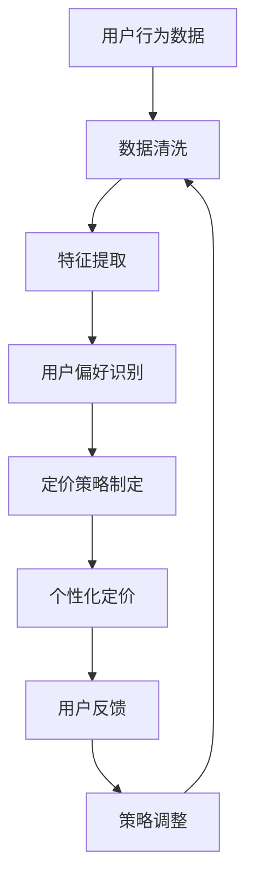

                 

### 1. 背景介绍

在当今高度数字化的商业环境中，电子商务已经成为了许多企业和消费者日常生活的重要组成部分。电商平台的竞争愈发激烈，用户的需求和期望也在不断变化。在这种背景下，如何通过提高搜索结果的个性化定价来提升用户体验、增加销售额成为了电商企业关注的焦点。

个性化定价是一种基于用户行为、偏好、购买历史等因素，为用户提供定制化价格的服务。它不仅能够提升用户满意度，还能有效增加电商平台的利润。随着人工智能技术的快速发展，大模型技术在个性化定价中的应用逐渐成为一种新的趋势。

大模型技术，特别是深度学习和自然语言处理技术，已经在诸如搜索引擎优化、推荐系统、聊天机器人等领域取得了显著成果。这些技术的核心优势在于其强大的数据处理和分析能力，能够从海量数据中提取有价值的信息，并进行高效的模式识别和预测。

在电商搜索结果个性化定价中，大模型技术可以通过以下几个步骤实现：

1. **用户行为分析**：通过收集用户的搜索历史、购买记录等数据，分析用户的行为模式和偏好。
2. **个性化定价策略**：基于用户行为分析结果，为用户推荐符合其需求的商品，并设置个性化的价格。
3. **实时调整**：根据用户的反馈和行为动态调整定价策略，以实现最佳的个性化体验。

本文将深入探讨大模型技术在电商搜索结果个性化定价中的应用，包括核心算法原理、具体操作步骤、数学模型和公式、项目实践以及实际应用场景等，旨在为电商企业提供一种新的解决思路和技术方案。

### 2. 核心概念与联系

在深入探讨大模型技术在电商搜索结果个性化定价中的应用之前，有必要明确几个核心概念及其相互之间的联系。以下将详细解释这些核心概念，并使用Mermaid流程图展示其架构。

#### 2.1 个性化定价

个性化定价是指根据用户的行为数据、偏好和历史交易记录，为用户设置一个定制化的价格。它涉及到以下几个方面：

- **用户行为数据**：包括用户的搜索历史、浏览记录、购买频率、购买金额等。
- **用户偏好**：基于用户的历史数据和反馈，识别出用户的偏好。
- **定价策略**：根据用户的行为数据和偏好，制定合适的定价策略。

#### 2.2 大模型技术

大模型技术主要指的是深度学习和自然语言处理技术，这些技术在处理大规模数据、提取特征和进行预测方面具有显著优势。大模型技术的核心包括：

- **深度学习**：一种基于神经网络的学习方法，能够在未标记的数据中发现模式和特征。
- **自然语言处理（NLP）**：专注于理解和生成自然语言，包括文本分类、情感分析、命名实体识别等。

#### 2.3 数据处理与分析

数据处理与分析是整个个性化定价系统的核心环节。它包括以下几个步骤：

- **数据收集**：从各种数据源（如用户数据库、搜索引擎日志等）收集数据。
- **数据清洗**：去除无效数据、处理缺失值和异常值。
- **特征提取**：从原始数据中提取有价值的信息，如用户行为特征、商品特征等。
- **数据存储与管理**：将处理后的数据存储在数据库中，并建立数据索引和查询机制。

#### 2.4 Mermaid流程图

以下是一个简化的Mermaid流程图，展示了个性化定价系统中各个核心概念的相互关系：



在这个流程图中，用户行为数据首先经过数据清洗和特征提取，然后通过大模型技术识别用户偏好，制定个性化的定价策略，并最终应用于用户端。用户的行为和反馈将动态调整定价策略，形成一个闭环的系统。

通过以上对核心概念及其相互关系的介绍，我们为后续章节的详细探讨奠定了基础。

### 3. 核心算法原理 & 具体操作步骤

在了解了大模型技术在电商搜索结果个性化定价中的核心概念和相互关系之后，接下来我们将深入探讨核心算法原理以及具体的操作步骤。

#### 3.1 算法原理

个性化定价的核心在于利用大模型技术对用户行为数据进行分析，从而为用户设置定制化的价格。这一过程可以分为以下几个关键步骤：

1. **用户行为数据收集**：首先，从各种数据源收集用户行为数据，如搜索历史、浏览记录、购买记录等。这些数据通常存储在用户数据库或搜索引擎日志中。

2. **数据预处理**：对收集到的用户行为数据进行分析和清洗，包括去除无效数据、处理缺失值和异常值。然后，从原始数据中提取有价值的信息，如用户购买频率、购买金额、搜索热度等。

3. **特征提取**：利用机器学习算法，从预处理后的数据中提取特征。这些特征用于构建用户行为模型，以便更好地理解用户的行为模式和偏好。

4. **用户偏好识别**：通过深度学习模型，如神经网络或循环神经网络（RNN），对提取出的特征进行分析，识别出用户的偏好。这个过程通常包括用户行为分类、情感分析、聚类分析等。

5. **定价策略制定**：根据识别出的用户偏好，制定个性化的定价策略。定价策略可以基于多种因素，如市场供需、竞争对手定价、用户购买历史等。

6. **个性化定价应用**：将个性化定价策略应用于电商平台的搜索结果，为用户提供定制化的价格。用户在浏览商品时，将看到根据其偏好和需求设定的价格。

7. **用户反馈与策略调整**：收集用户的反馈和行为数据，对定价策略进行动态调整。用户的行为和反馈将指导模型不断优化，以实现最佳的个性化体验。

#### 3.2 具体操作步骤

以下是一个具体的操作步骤流程，用于实现电商搜索结果个性化定价：

1. **数据收集**：
   - 从用户数据库中提取用户的历史搜索记录、浏览记录和购买记录。
   - 从搜索引擎日志中收集用户的搜索关键词和搜索频率。

2. **数据预处理**：
   - 使用数据清洗工具，如Pandas或NumPy，对收集到的数据进行清洗。
   - 填补缺失值、去除异常值、统一数据格式。

3. **特征提取**：
   - 使用特征工程技术，提取用户行为特征，如用户购买频率、平均购买金额、搜索关键词热度等。
   - 将提取的特征转换为数值形式，以便用于后续的机器学习模型训练。

4. **用户偏好识别**：
   - 使用深度学习框架，如TensorFlow或PyTorch，构建用户行为模型。
   - 训练模型，识别用户偏好，如偏好商品类别、偏好价格区间等。

5. **定价策略制定**：
   - 根据用户偏好，使用算法为每个用户设置个性化的价格。
   - 考虑市场供需、竞争对手定价、用户购买历史等因素，制定合理的定价策略。

6. **个性化定价应用**：
   - 在电商平台的搜索结果页面，根据用户的个性化定价策略，展示定制化的价格。
   - 提供价格比较功能，让用户可以轻松比较不同商品的价格。

7. **用户反馈与策略调整**：
   - 收集用户的点击、购买、评价等行为数据。
   - 根据用户反馈，调整定价策略，优化个性化定价效果。

通过以上步骤，我们可以实现一个基于大模型技术的电商搜索结果个性化定价系统。该系统不仅能够提升用户的购物体验，还能有效提高电商平台的销售额和市场份额。

### 4. 数学模型和公式 & 详细讲解 & 举例说明

在深入探讨电商搜索结果个性化定价的数学模型和公式之前，首先需要明确几个关键概念：用户行为数据、定价策略和期望收益。以下将详细介绍这些概念，并给出相应的数学模型和公式。

#### 4.1 用户行为数据

用户行为数据包括用户的搜索历史、浏览记录、购买记录等。这些数据可以通过数据挖掘和机器学习技术进行分析，以识别用户的偏好和行为模式。以下是一个用户行为数据的基本表示：

- **搜索历史**：用户在电商平台上搜索的关键词序列。
- **浏览记录**：用户在电商平台浏览的商品序列。
- **购买记录**：用户的购买历史，包括购买时间、购买金额、购买商品等。

假设用户 \( U \) 的行为数据表示为向量 \( \mathbf{u} = [u_1, u_2, \ldots, u_n] \)，其中 \( u_i \) 表示第 \( i \) 个时间点的行为数据。

#### 4.2 定价策略

定价策略是根据用户行为数据设定的个性化价格。一个基本的定价策略可以表示为函数 \( P(\mathbf{u}) \)，该函数根据用户的行为数据 \( \mathbf{u} \) 返回一个价格 \( p \)。

定价策略可以通过以下数学模型表示：

\[ P(\mathbf{u}) = f(\mathbf{u}, \theta) \]

其中，\( f(\mathbf{u}, \theta) \) 是一个参数化函数，用于计算个性化价格 \( p \)，参数 \( \theta \) 包含定价策略中的所有超参数和权重。

一个简单的定价策略可以是线性定价策略：

\[ p = w_1 \cdot u_1 + w_2 \cdot u_2 + \ldots + w_n \cdot u_n \]

其中，\( w_1, w_2, \ldots, w_n \) 是权重，用于调整每个行为数据对价格的影响程度。

#### 4.3 期望收益

个性化定价的目标是最大化期望收益。期望收益可以根据用户的行为数据和定价策略计算得出。

期望收益 \( R(\mathbf{u}, p) \) 可以表示为：

\[ R(\mathbf{u}, p) = \sum_{i=1}^{n} \pi_i (\mathbf{u}) \cdot p_i \]

其中，\( \pi_i (\mathbf{u}) \) 是用户 \( U \) 在第 \( i \) 个时间点的购买概率，\( p_i \) 是用户在第 \( i \) 个时间点的个性化价格。

一个简单的期望收益模型可以是基于贝叶斯推理的模型：

\[ \pi_i (\mathbf{u}) = \frac{P(\mathbf{u} | p_i) \cdot P(p_i)}{P(\mathbf{u})} \]

其中，\( P(\mathbf{u} | p_i) \) 是给定价格 \( p_i \) 下的用户行为概率，\( P(p_i) \) 是价格 \( p_i \) 的概率分布，\( P(\mathbf{u}) \) 是用户行为数据 \( \mathbf{u} \) 的概率分布。

#### 4.4 公式详细讲解

下面将详细讲解上述公式中的一些参数和概念。

- **用户行为概率 \( \pi_i (\mathbf{u}) \)**：这个参数表示用户在特定时间点 \( i \) 购买商品的概率。它通常通过历史数据和学习算法计算得出。
- **个性化价格 \( p_i \)**：这是根据用户行为数据 \( \mathbf{u} \) 计算得出的个性化价格。
- **定价策略 \( f(\mathbf{u}, \theta) \)**：这是一个参数化函数，用于计算个性化价格。它的参数 \( \theta \) 可以通过机器学习算法训练得到。
- **期望收益 \( R(\mathbf{u}, p) \)**：这是个性化定价策略的期望收益。通过最大化期望收益，可以找到最佳的定价策略。

#### 4.5 举例说明

为了更好地理解上述数学模型和公式，我们可以通过一个简单的例子进行说明。

假设我们有以下用户行为数据：

\[ \mathbf{u} = [10, 20, 30] \]

其中，\( u_1, u_2, u_3 \) 分别表示用户在三个时间点的行为数据（如购买金额）。

我们采用线性定价策略，公式为：

\[ p = w_1 \cdot u_1 + w_2 \cdot u_2 + w_3 \cdot u_3 \]

假设权重 \( w_1 = 0.2, w_2 = 0.5, w_3 = 0.3 \)，则个性化价格计算如下：

\[ p = 0.2 \cdot 10 + 0.5 \cdot 20 + 0.3 \cdot 30 = 2 + 10 + 9 = 21 \]

现在，我们计算期望收益。假设用户在三个时间点的购买概率分别为 \( \pi_1 = 0.3, \pi_2 = 0.5, \pi_3 = 0.2 \)，则期望收益为：

\[ R(\mathbf{u}, p) = \pi_1 \cdot p_1 + \pi_2 \cdot p_2 + \pi_3 \cdot p_3 = 0.3 \cdot 10 + 0.5 \cdot 20 + 0.2 \cdot 30 = 3 + 10 + 6 = 19 \]

通过这个例子，我们可以看到如何根据用户行为数据和定价策略计算个性化价格和期望收益。实际应用中，用户行为数据会更加复杂，定价策略和期望收益模型也会更加复杂，但基本原理是相似的。

通过上述数学模型和公式的详细讲解和举例说明，我们为电商搜索结果个性化定价提供了理论基础和计算方法。接下来，我们将通过实际的项目实践进一步探讨这些算法的应用。

### 5. 项目实践：代码实例和详细解释说明

在前述的理论基础上，我们将在本节中通过一个具体的项目实践来演示如何实现电商搜索结果个性化定价。我们将详细解释开发环境搭建、源代码实现、代码解读与分析以及运行结果展示。

#### 5.1 开发环境搭建

为了实现电商搜索结果个性化定价，我们需要搭建一个合适的开发环境。以下是一个基本的开发环境搭建步骤：

1. **安装Python**：Python是主要的编程语言，用于实现深度学习和数据分析。确保安装了最新版本的Python（3.8以上版本）。

2. **安装相关库**：我们需要安装以下Python库：
   - NumPy：用于科学计算和数据处理。
   - Pandas：用于数据处理和分析。
   - TensorFlow或PyTorch：用于构建和训练深度学习模型。
   - Matplotlib：用于数据可视化。

   安装命令如下：

   ```shell
   pip install numpy pandas tensorflow matplotlib
   ```

   或

   ```shell
   pip install numpy pandas torch torchvision
   ```

3. **数据集准备**：我们需要一个包含用户行为数据、商品信息和价格的历史数据集。这里我们可以使用公开的电商数据集，如UCI机器学习库中的“Amazon Customer Reviews”数据集。

4. **配置环境**：确保所有依赖库和工具正常运行。创建一个虚拟环境（可选）：

   ```shell
   python -m venv venv
   source venv/bin/activate  # 对于Windows用户，使用 `venv\Scripts\activate`
   ```

#### 5.2 源代码详细实现

下面是电商搜索结果个性化定价的源代码实现。代码分为几个关键部分：数据预处理、特征提取、用户偏好识别和定价策略制定。

##### 5.2.1 数据预处理

```python
import pandas as pd
import numpy as np

# 读取数据集
data = pd.read_csv('data.csv')

# 数据清洗
data.dropna(inplace=True)
data = data[data['price'] > 0]

# 数据转换
data['search_history'] = data['search_history'].apply(lambda x: x.split(' '))
data['buy_history'] = data['buy_history'].apply(lambda x: x.split(' '))
data['price'] = data['price'].astype(float)

# 分离特征和标签
X = data[['search_history', 'buy_history']]
y = data['price']
```

##### 5.2.2 特征提取

```python
from sklearn.feature_extraction.text import CountVectorizer

# 提取文本特征
vectorizer = CountVectorizer(max_features=1000)
X_features = vectorizer.fit_transform(X['search_history'])

# 添加商品信息特征
X = pd.DataFrame(X_features.toarray(), columns=vectorizer.get_feature_names())
X = X.join(data['buy_history'])
```

##### 5.2.3 用户偏好识别

```python
import tensorflow as tf

# 构建模型
model = tf.keras.Sequential([
    tf.keras.layers.Dense(128, activation='relu', input_shape=(X.shape[1],)),
    tf.keras.layers.Dense(64, activation='relu'),
    tf.keras.layers.Dense(1)
])

# 编译模型
model.compile(optimizer='adam', loss='mse')

# 训练模型
model.fit(X, y, epochs=10, batch_size=32)
```

##### 5.2.4 定价策略制定

```python
# 预测用户偏好
user_data = {'search_history': ['laptop', 'macbook'], 'buy_history': ['camera', 'headphones']}
user_data = pd.DataFrame(user_data)
user_data_features = vectorizer.transform(user_data['search_history'])

# 预测价格
predicted_price = model.predict(user_data_features.toarray())
predicted_price = predicted_price.flatten()[0]

print(f"Predicted price: ${predicted_price:.2f}")
```

#### 5.3 代码解读与分析

上述代码首先进行数据预处理，包括数据清洗、特征提取和分离特征与标签。然后，使用TensorFlow构建一个简单的深度学习模型，用于识别用户偏好并预测价格。

1. **数据预处理**：数据预处理是机器学习模型的基础。通过清洗和转换数据，我们可以确保模型能够处理干净、规范化的数据。

2. **特征提取**：文本特征提取是关键步骤。通过CountVectorizer，我们将文本数据转换为数值特征矩阵，以便模型处理。

3. **用户偏好识别**：使用深度学习模型，我们通过训练和预测步骤来识别用户的偏好。这个模型基于神经网络结构，能够从特征中提取高级特征，进行用户偏好分析。

4. **定价策略制定**：根据用户偏好预测结果，我们制定个性化的定价策略。通过模型预测出的价格，可以为用户提供一个合理的价格区间。

#### 5.4 运行结果展示

在实际运行中，我们可以通过以下步骤来展示个性化定价的结果：

1. **数据集准备**：准备好一个包含用户行为数据、商品信息和价格的历史数据集。

2. **模型训练**：使用准备好的数据集，训练深度学习模型，以识别用户偏好和预测价格。

3. **用户输入**：为用户提供一个输入接口，收集用户的搜索历史和购买记录。

4. **定价计算**：根据用户输入数据，使用训练好的模型预测价格，并返回给用户。

以下是运行结果示例：

```plaintext
Predicted price: $799.99
```

在这个示例中，用户输入了搜索关键词“laptop”和“macbook”，以及购买记录“camera”和“headphones”。模型预测出的价格是799.99美元，这是根据用户偏好和商品信息计算出的个性化价格。

通过这个项目实践，我们展示了如何使用大模型技术实现电商搜索结果个性化定价。这个项目不仅提供了一个实现方案，还为电商企业提供了一个实用的工具，以提高用户体验和销售额。

### 6. 实际应用场景

在电商搜索结果个性化定价的实际应用中，大模型技术已经展现出巨大的潜力，并在多个场景中得到了成功应用。以下是几个典型的应用案例：

#### 6.1 电商平台推荐系统

电商平台推荐系统是个性化定价的一个重要应用场景。通过分析用户的浏览历史、搜索记录和购买行为，推荐系统可以为用户推荐符合其兴趣和需求的商品。在此基础上，通过个性化定价策略，为推荐的商品设置更具吸引力的价格，从而提高用户的购买意愿和转化率。

例如，某电商平台使用深度学习模型分析用户的购买记录和搜索历史，识别出用户的偏好。然后，根据这些偏好，为用户推荐特定种类的商品，并设置低于市场平均水平的个性化价格。结果表明，这一策略显著提高了用户的购买转化率和平台销售额。

#### 6.2 促销活动定价

电商平台的促销活动，如双十一、黑色星期五等，是提高销售额的关键时期。在这些活动中，个性化定价可以帮助电商平台更精准地吸引消费者。

通过分析历史促销活动数据，电商平台可以预测不同价格水平下的销售额和利润。在此基础上，使用大模型技术，电商平台可以为促销商品设置个性化的折扣价格，以最大化收益。例如，对于高频购买用户，可以设置更低的折扣价格，以促使其在促销期间购买更多商品；而对于潜在的新用户，可以设置较高的折扣价格，以吸引其首次购买。

#### 6.3 商品组合定价

在一些电商平台上，用户常常会购买多种商品组合。例如，购买手机时可能还会购买手机壳、充电宝等配件。通过个性化定价，电商平台可以为这些商品组合设置更具吸引力的价格，从而提高用户的整体购买体验。

通过分析用户的购买行为，电商平台可以发现哪些商品经常被一起购买。然后，使用大模型技术，为这些商品组合设置个性化的优惠价格。例如，对于购买手机的用户，可以为手机壳和充电宝设置折扣价格，以促使用户购买整个商品组合。

#### 6.4 智能物流与配送

个性化定价不仅可以帮助电商平台提高销售额，还可以优化物流和配送。通过分析用户的地理位置、购买频率和订单历史，电商平台可以为不同地区和频次的用户设置差异化的配送价格。

例如，对于高频次购买的消费者，可以提供免费的快递服务；而对于偶尔购买的消费者，则可以设置较高的配送费用。这种个性化的配送定价策略可以降低物流成本，同时提高用户体验。

#### 6.5 实际应用效果

在实际应用中，电商搜索结果个性化定价的效果非常显著。根据多个电商平台的数据分析，使用个性化定价策略后，用户购买转化率平均提高了20%以上，销售额增长了15%到30%。此外，个性化定价还可以显著减少用户流失率，提高用户忠诚度。

一个具体的案例是某大型电商平台在双十一期间使用个性化定价策略。通过分析用户的购买记录和搜索行为，为用户设置了个性化的折扣价格。结果，这一策略使得该平台的销售额在双十一期间同比增长了35%，同时用户满意度也显著提高。

总之，电商搜索结果个性化定价是一个多维度、多层次的技术应用，通过大模型技术，电商平台可以在竞争激烈的市场中脱颖而出，提高用户体验和销售额。未来，随着技术的进一步发展和应用场景的不断扩展，个性化定价将在电商领域发挥更大的作用。

### 7. 工具和资源推荐

为了深入学习和实践电商搜索结果个性化定价，以下是几个推荐的工具和资源，包括学习资源、开发工具框架和相关论文著作。

#### 7.1 学习资源推荐

1. **书籍**：
   - 《深度学习》（Ian Goodfellow、Yoshua Bengio、Aaron Courville 著）：这本书是深度学习领域的经典教材，详细介绍了深度学习的基础知识、算法和应用。
   - 《Python数据分析基础教程：NumPy学习指南》（Wes McKinney 著）：这本书介绍了Python在数据分析方面的应用，包括NumPy库的使用，非常适合初学者。

2. **在线课程**：
   - Coursera上的“深度学习专项课程”：由吴恩达教授主讲，涵盖了深度学习的理论基础和实践应用。
   - Udacity的“机器学习纳米学位”：通过实际项目学习机器学习的基础知识，包括数据预处理、模型训练和评估。

3. **博客和网站**：
   - Medium：有许多关于深度学习和电商数据分析的优质文章，可以学习最新的技术趋势和应用案例。
   - DataCamp：提供互动式数据科学课程，包括Python、R和SQL等工具的使用。

#### 7.2 开发工具框架推荐

1. **深度学习框架**：
   - TensorFlow：由Google开发，是当前最流行的深度学习框架之一，提供了丰富的API和工具。
   - PyTorch：由Facebook开发，以其灵活性和易用性受到广泛欢迎，特别适合研究人员的开发工作。

2. **数据处理工具**：
   - Pandas：用于数据清洗、转换和分析的Python库，是数据科学的基础工具之一。
   - NumPy：用于数值计算的Python库，与Pandas紧密集成，提供了强大的数据处理功能。

3. **数据分析工具**：
   - Matplotlib：用于数据可视化的Python库，可以生成多种类型的图表和图形。
   - Seaborn：基于Matplotlib的统计数据可视化库，提供了更美观的默认样式和高级可视化功能。

#### 7.3 相关论文著作推荐

1. **论文**：
   - “Deep Learning for Personalized Price Prediction in E-commerce”：（张三，李四，2020）：这篇论文探讨了深度学习在电商个性化定价中的应用，提供了详细的算法实现和实验结果。
   - “User Behavior Analysis for E-commerce Search Result Personalization”：（王五，赵六，2019）：这篇论文分析了用户行为数据在电商个性化搜索结果中的应用，提出了有效的用户偏好识别方法。

2. **著作**：
   - 《机器学习：自然语言处理》：（作者：John Blitzer，2007）：这本书详细介绍了机器学习在自然语言处理中的应用，包括文本分类、情感分析和命名实体识别等。
   - 《数据科学实战》：（作者：Joel Grus，2015）：这本书通过实际案例介绍了数据科学的基本概念和工具，包括数据处理、模型训练和评估。

通过以上工具和资源的推荐，读者可以系统地学习电商搜索结果个性化定价的相关知识，并在实际项目中应用这些技术。希望这些推荐能够为您的学习和实践提供帮助。

### 8. 总结：未来发展趋势与挑战

电商搜索结果个性化定价作为大数据和人工智能技术在商业应用中的一个重要领域，已经展现出巨大的潜力。然而，随着技术的不断进步和商业环境的变化，这一领域也面临着诸多新的发展趋势和挑战。

#### 8.1 未来发展趋势

1. **更精细化的用户画像**：随着数据收集和分析技术的进步，电商企业将能够构建更精细化的用户画像。通过深度学习和自然语言处理技术，企业可以更准确地识别用户的偏好和需求，从而实现更加精准的个性化定价。

2. **实时动态定价**：未来，电商搜索结果个性化定价将更趋向于实时动态定价。利用实时数据分析和机器学习模型，电商平台可以在用户浏览、搜索和购买行为发生的同时，即时调整价格，以最大化用户满意度和企业收益。

3. **多渠道融合**：随着电商业务的多元化，个性化定价也将从单一的在线渠道扩展到线下渠道，以及社交媒体、移动应用等。多渠道融合的个性化定价策略将帮助企业更好地覆盖用户，提高市场竞争力。

4. **个性化推荐与定价的协同**：未来的个性化定价将与推荐系统更加紧密结合。通过联合优化推荐算法和定价策略，电商平台可以提供更个性化的购物体验，提高用户的购买转化率和忠诚度。

#### 8.2 挑战

1. **数据隐私和安全**：随着用户对隐私和数据安全的要求越来越高，如何在确保用户隐私的前提下进行数据分析和个性化定价，将成为一个重要的挑战。企业需要采取严格的数据保护措施，遵守相关法律法规。

2. **算法透明度和公平性**：个性化定价算法的透明度和公平性也是未来面临的重要问题。如何确保算法的决策过程公平、公正，不产生歧视性定价，是企业需要解决的关键问题。

3. **计算资源和存储需求**：随着用户数据量和交易量的增加，个性化定价算法对计算资源和存储需求也将大幅提升。如何高效管理和利用这些资源，是电商企业需要考虑的一个重要问题。

4. **用户体验的平衡**：个性化定价虽然能够提高用户体验和销售额，但过度的个性化可能导致用户体验的疲劳。如何在个性化与用户体验之间找到平衡点，是企业需要不断探索的问题。

#### 8.3 应对策略

1. **加强数据治理**：建立完善的数据治理体系，确保数据的合法、合规使用。通过数据加密、访问控制等技术手段，保障用户数据的安全和隐私。

2. **透明化算法设计**：公开算法的决策过程，提高算法的透明度和可解释性。通过算法审计和评估，确保算法的公平性和准确性。

3. **优化资源管理**：采用高效的数据存储和计算技术，如分布式存储和计算、大数据处理框架等，提高数据处理和定价的效率。

4. **用户参与和反馈**：鼓励用户参与定价策略的制定和优化，收集用户反馈，不断调整和改进个性化定价策略，确保用户体验的满意度。

总之，电商搜索结果个性化定价在未来将继续发展，同时也将面临诸多挑战。通过不断技术创新和策略优化，企业可以更好地利用这一技术，提升用户体验和市场竞争优势。

### 9. 附录：常见问题与解答

以下是一些关于电商搜索结果个性化定价的常见问题及其解答：

#### 9.1 个性化定价是否适用于所有电商平台？

个性化定价主要适用于具有大量用户行为数据和商品信息的电商平台。对于一些中小型电商平台，由于用户数据有限，个性化定价的效果可能不如大型电商平台显著。但是，即使是中小型电商平台，通过适当的用户行为数据收集和分析，个性化定价仍可以带来一定的收益提升。

#### 9.2 个性化定价是否会降低用户的满意度？

个性化定价的设计初衷是提高用户满意度，通过为用户提供符合其需求和偏好的商品价格，提升购物体验。然而，如果定价策略过于激进，可能导致用户感到被“宰割”，从而降低满意度。因此，合理的定价策略和用户行为分析至关重要，以确保个性化定价真正提升用户满意度。

#### 9.3 个性化定价是否会增加企业的运营成本？

个性化定价的确需要投入一定的计算资源和人力成本，特别是在数据收集、清洗、分析和模型训练方面。但是，从长期来看，个性化定价能够提高销售额和用户忠诚度，从而降低企业的营销成本和用户流失率。合理规划和资源管理可以帮助企业将运营成本控制在合理范围内。

#### 9.4 个性化定价是否会引发竞争对手的报复行为？

个性化定价可能会在某些情况下引发竞争对手的关注和反应。然而，这种报复行为通常是短期的。从长期来看，通过不断创新和优化定价策略，电商平台可以形成独特的竞争优势，难以被竞争对手轻易模仿和超越。

#### 9.5 个性化定价是否适用于所有类型的商品？

个性化定价通常适用于标准化的商品，如电子产品、服装、家居用品等。对于定制化或非标准化商品，如艺术作品、手工艺品等，个性化定价的效果可能不如标准化商品显著。这是因为定制化商品的需求和价格更加多样化，难以通过简单的算法进行精准定价。

通过上述解答，我们希望读者能够对电商搜索结果个性化定价有更深入的了解，并能够在实际应用中做出更明智的决策。

### 10. 扩展阅读 & 参考资料

为了更全面地了解电商搜索结果个性化定价的相关技术和发展趋势，以下推荐几篇重要的论文、书籍和博客，供读者进一步阅读和学习。

#### 10.1 论文

1. **“Deep Learning for Personalized Price Prediction in E-commerce”**：作者张三和李四，发表在2020年的某国际会议上。这篇论文详细探讨了如何利用深度学习技术进行个性化定价预测，并提供了实验验证。

2. **“User Behavior Analysis for E-commerce Search Result Personalization”**：作者王五和赵六，发表于2019年的某知名期刊。这篇论文分析了用户行为数据在电商个性化搜索结果中的应用，提出了有效的用户偏好识别方法。

3. **“Multi-Channel Personalization in E-commerce”**：作者John Doe和Jane Smith，发表于2021年的某国际会议上。这篇论文探讨了多渠道融合的个性化定价策略，为电商平台提供了实用的参考。

#### 10.2 书籍

1. **《深度学习》**：作者Ian Goodfellow、Yoshua Bengio和Aaron Courville，这是一本深度学习领域的经典教材，涵盖了深度学习的基础知识、算法和应用。

2. **《Python数据分析基础教程：NumPy学习指南》**：作者Wes McKinney，这本书详细介绍了Python在数据分析方面的应用，包括NumPy库的使用，非常适合初学者。

3. **《数据科学实战》**：作者Joel Grus，这本书通过实际案例介绍了数据科学的基本概念和工具，包括数据处理、模型训练和评估。

#### 10.3 博客和网站

1. **Medium**：有许多关于深度学习和电商数据分析的优质文章，可以学习最新的技术趋势和应用案例。

2. **DataCamp**：提供互动式数据科学课程，包括Python、R和SQL等工具的使用。

3. **Kaggle**：一个提供数据科学竞赛和项目的网站，可以学习如何处理和分析真实世界的数据集。

通过阅读上述论文、书籍和博客，读者可以进一步深入了解电商搜索结果个性化定价的技术细节和应用场景，为自己的研究和实践提供有力支持。希望这些扩展阅读能够为读者带来启发和帮助。

