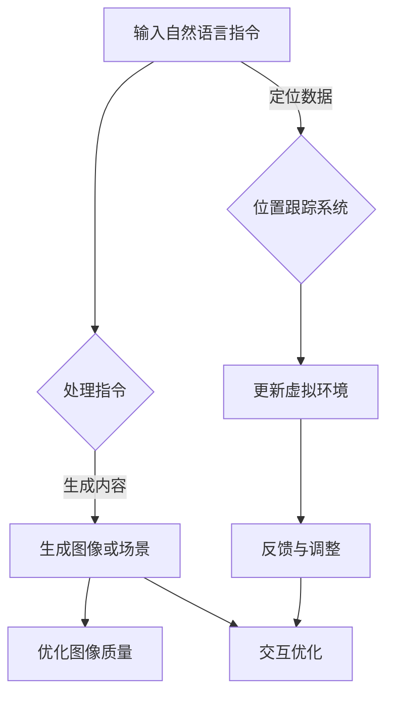

                 

### 背景介绍

在当今科技飞速发展的时代，虚拟现实（VR）技术逐渐从科幻领域步入现实，成为各大科技公司竞相追逐的新兴领域。VR技术通过计算机图形系统和头戴式显示器等设备，创建出一种可交互的、沉浸式的虚拟环境，使人们能够在其中体验前所未有的视觉和感官体验。然而，VR技术的实现离不开强大的计算能力和智能算法的支持。

近年来，人工智能（AI）技术取得了显著的进展，特别是大型语言模型（如GPT系列、ChatGPT等）的崛起，使得生成式AI在各个领域展现出了巨大的潜力。这些大模型拥有处理海量数据、学习复杂模式和生成高质量内容的能力，为VR技术的进步提供了新的动力。AI大模型可以用于图像生成、自然语言处理、交互优化等多个方面，从而提升VR体验的逼真度和互动性。

AI大模型在VR领域的应用不仅限于用户体验的改进，还涵盖了硬件优化、内容生成和场景构建等多个层面。随着AI技术的不断突破，VR行业正迎来一个全新的发展阶段，这为创业者提供了诸多前所未有的机遇。本文将探讨AI大模型在VR领域的创业机会，分析其核心概念、技术原理、实际应用场景以及未来发展趋势和挑战。

通过对AI大模型在VR领域的深入研究，我们可以看到，这不仅是一场技术革命，更是一次商业模式的创新。创业者可以通过结合AI技术和VR技术，创造出新的产品和服务，满足消费者日益增长的需求。接下来，我们将逐步剖析这些创业机会，为读者提供一份详尽的技术和应用指南。

### 核心概念与联系

#### AI大模型的原理

AI大模型，尤其是生成式AI模型，其核心在于深度学习的算法。深度学习是一种基于人工神经网络的学习方法，通过层层神经元的非线性变换，模型能够自动从大量数据中学习到复杂的模式和特征。生成式AI模型则进一步扩展了这种能力，不仅能够识别输入数据中的特征，还能够生成新的、符合学习到模式的数据。

以GPT系列模型为例，这类模型采用了Transformer架构，这是一种基于自注意力机制的新型神经网络结构。Transformer架构允许模型在处理序列数据时能够考虑到每个单词的上下文信息，从而生成连贯且意义丰富的文本。GPT模型通过预训练和微调，可以应用于多种自然语言处理任务，如图像描述生成、对话系统等。

#### VR技术的原理

VR技术主要依赖于计算机图形学、传感器技术、头戴显示器（HMD）和位置跟踪系统等关键组件。计算机图形学用于生成虚拟环境中的三维图像，而传感器技术和位置跟踪系统则确保用户能够在虚拟环境中自由移动并与之交互。

VR技术的核心在于提供一个沉浸式的体验。通过HMD，用户可以“进入”一个虚拟的三维世界，头部的运动和视角变化会被实时捕捉，并反馈到虚拟环境中，使用户感到身临其境。此外，手柄、手势识别和其他交互设备也允许用户与虚拟环境进行直观的交互。

#### AI大模型在VR中的应用

AI大模型在VR中的应用主要表现在以下几个方面：

1. **图像生成与优化**：AI大模型可以生成高质量的虚拟图像，并优化已有图像的视觉效果。例如，通过GPT模型，可以生成逼真的场景描述，并通过计算机图形学将这些描述转化为图像。

2. **自然语言处理**：AI大模型可以处理用户输入的自然语言指令，并生成相应的虚拟内容。这包括生成对话系统、场景描述、交互式故事等。

3. **交互优化**：AI大模型可以分析用户的交互行为，优化虚拟环境中的交互体验。例如，通过学习用户的偏好和习惯，模型可以自动调整虚拟环境的设置，以提供个性化的体验。

#### Mermaid 流程图

为了更好地理解AI大模型在VR技术中的具体应用，我们使用Mermaid流程图来展示其工作原理。以下是流程图示例：



在这个流程图中，输入的自然语言指令首先被AI大模型处理，然后生成相应的图像或场景。接下来，这些图像或场景可以被优化，以提高视觉质量，同时AI模型还可以根据用户的交互行为进行交互优化。位置跟踪系统负责捕捉用户的运动和视角变化，并更新虚拟环境。最后，通过反馈机制，系统可以不断调整和优化用户的体验。

通过这种流程，AI大模型与VR技术紧密结合，为用户提供了一个更加沉浸式、互动性更强的虚拟体验。这种融合不仅提升了VR技术的整体水平，也为创业者在VR领域的创新提供了丰富的可能性。

### 核心算法原理 & 具体操作步骤

#### GPT模型的工作原理

生成预训练变换器（GPT）模型是AI领域中的一个里程碑，它通过大规模的预训练和精细调整，在自然语言处理任务中展现出了出色的性能。GPT模型的核心是Transformer架构，这是一种基于自注意力机制的新型神经网络结构。Transformer架构允许模型在处理序列数据时能够考虑到每个单词的上下文信息，从而生成连贯且意义丰富的文本。

GPT模型的工作流程主要包括以下几个步骤：

1. **预训练**：在预训练阶段，GPT模型从大量的互联网文本数据中学习语言模式。这一过程涉及两个关键操作：掩码语言模型（Masked Language Model, MLM）和下一代语言模型（Next Sentence Model, NSM）。MLM通过对输入文本中的部分单词进行掩码，使得模型必须通过上下文来预测这些被掩码的词。NSM则通过预测两个连续文本片段是否属于同一篇文档，从而增强模型对文档连贯性的理解。

2. **生成文本**：在生成文本时，GPT模型接收一个起始文本序列，并基于自注意力机制计算每个单词的上下文权重。然后，模型使用这些权重生成下一个词，并将新词添加到序列末尾。这一过程重复进行，直到生成完整的文本。

3. **微调**：在特定任务上，GPT模型需要进行微调以适应特定的数据集。微调过程包括固定某些层的权重，只训练部分层，从而减少模型的参数量，提高训练效率。

#### GPT模型在VR中的应用步骤

在VR领域中，GPT模型可以应用于多种场景，以下是一个典型的应用步骤：

1. **收集数据**：首先，需要收集VR应用场景中的文本数据，这些数据可以是用户生成的内容、场景描述或系统生成的文本。例如，用户可能输入一个自然语言指令来创建一个虚拟餐厅，系统需要理解并生成相应的虚拟环境。

2. **预处理数据**：对收集到的文本数据进行预处理，包括分词、去噪、标准化等操作。这一步骤的目的是确保数据的质量，使其适合模型训练。

3. **模型训练**：使用GPT模型对预处理后的文本数据集进行预训练。预训练过程通常在大量的通用文本数据上进行，以使模型学会捕捉语言中的复杂模式。

4. **微调模型**：将预训练的GPT模型迁移到特定的VR应用场景中进行微调。这一过程涉及将模型调整到特定数据集上，以提高其在该场景中的性能。例如，对于虚拟餐厅场景，模型需要能够生成描述餐厅布局、菜单、顾客互动等内容的文本。

5. **生成内容**：在训练完成后，使用微调后的GPT模型生成虚拟环境中的文本内容。例如，当用户输入“创建一个浪漫的虚拟餐厅”时，模型可以生成相应的餐厅描述，并将其转化为三维图像或场景。

6. **交互与优化**：将生成的文本内容与VR环境中的其他组件（如图像生成、位置跟踪等）结合，实时响应用户的交互操作，并不断优化用户体验。

#### 具体实现示例

以下是一个简化的实现示例，展示了如何使用GPT模型生成虚拟餐厅的场景描述：

```python
# 导入必要的库
import transformers
from transformers import GPT2LMHeadModel, GPT2Tokenizer

# 初始化GPT模型和分词器
model_name = "gpt2"
tokenizer = GPT2Tokenizer.from_pretrained(model_name)
model = GPT2LMHeadModel.from_pretrained(model_name)

# 预处理用户输入
input_text = "创建一个浪漫的虚拟餐厅。"
input_ids = tokenizer.encode(input_text, return_tensors='pt')

# 生成场景描述
output_ids = model.generate(input_ids, max_length=100, num_return_sequences=1)

# 转换为文本
generated_text = tokenizer.decode(output_ids[0], skip_special_tokens=True)
print(generated_text)

# 生成的文本可以进一步处理，转化为虚拟环境的图像或场景
```

在这个示例中，我们首先加载预训练的GPT2模型和分词器。然后，对用户输入的文本进行编码，并使用模型生成相应的场景描述。生成的文本可以进一步处理，以生成虚拟环境中的图像或场景。

通过这些步骤，GPT模型能够有效地生成与用户指令相符的虚拟内容，从而提升VR体验的逼真度和互动性。这一过程不仅展示了AI大模型在VR领域中的强大能力，也为创业者提供了丰富的应用场景和创新空间。

#### 数学模型和公式

在理解GPT模型的核心算法原理时，数学模型和公式起着至关重要的作用。以下我们将详细讲解GPT模型的几个关键数学概念，包括Transformer架构中的自注意力机制、位置编码以及损失函数。

##### 自注意力机制

Transformer架构的核心是自注意力机制（Self-Attention），它允许模型在处理序列数据时考虑到每个单词的上下文信息。自注意力机制通过计算每个输入词与其他词之间的关联性，从而生成单词的表示。以下是自注意力机制的数学公式：

$$
\text{Attention}(Q, K, V) = \text{softmax}\left(\frac{QK^T}{\sqrt{d_k}}\right) V
$$

其中：
- $Q$ 表示查询向量（Query），代表每个输入词的表示。
- $K$ 表示键向量（Key），与查询向量相似，也是每个输入词的表示。
- $V$ 表示值向量（Value），也是每个输入词的表示。
- $d_k$ 表示键向量的维度。

自注意力机制的目的是计算每个查询词与所有键词之间的关联性，然后对相应的值进行加权求和，从而生成一个更丰富的表示。

##### 位置编码

位置编码（Positional Encoding）是Transformer架构中另一个关键组成部分，它用于表示输入词的顺序信息。由于Transformer架构中没有循环层，因此位置编码能够帮助模型理解输入词的顺序。位置编码通常是通过添加到输入向量中的伪随机向量来实现的。以下是位置编码的数学公式：

$$
PE_{(pos, 2i)} = \sin\left(\frac{pos}{10000^{2i/d}}\right)
$$

$$
PE_{(pos, 2i+1)} = \cos\left(\frac{pos}{10000^{2i/d}}\right)
$$

其中：
- $pos$ 表示词的位置。
- $i$ 表示维度索引。
- $d$ 表示位置编码的维度。

通过这些公式，位置编码能够生成一个表示词顺序的向量，并将其与词的嵌入向量相加，从而在模型中引入词序信息。

##### 损失函数

GPT模型通常使用交叉熵损失函数（Cross-Entropy Loss）来评估模型在预测下一个词时的准确性。交叉熵损失函数的数学公式如下：

$$
\text{Loss} = -\sum_{i} y_i \log(p_i)
$$

其中：
- $y_i$ 表示真实标签的概率分布。
- $p_i$ 表示模型预测的概率分布。

交叉熵损失函数的目的是最小化模型预测的概率分布与真实标签的概率分布之间的差异。通过反向传播和梯度下降算法，模型可以不断调整其权重，以优化预测性能。

##### 举例说明

为了更好地理解这些数学模型和公式，我们来看一个简单的例子。假设我们有一个包含三个词的输入序列：“我”、“喜欢”、“吃”。

1. **自注意力计算**：

首先，计算每个词的查询向量、键向量和值向量。假设每个词的维度为512。

$$
Q = [q_1, q_2, q_3], K = [k_1, k_2, k_3], V = [v_1, v_2, v_3]
$$

然后，计算每个查询向量与其他键向量之间的关联性：

$$
\text{Attention}(Q, K, V) = \text{softmax}\left(\frac{QK^T}{\sqrt{d_k}}\right) V
$$

假设每个关联性计算结果如下：

$$
\text{Attention}(q_1, k_1) = 0.2, \text{Attention}(q_1, k_2) = 0.3, \text{Attention}(q_1, k_3) = 0.5
$$

$$
\text{Attention}(q_2, k_1) = 0.4, \text{Attention}(q_2, k_2) = 0.4, \text{Attention}(q_2, k_3) = 0.6
$$

$$
\text{Attention}(q_3, k_1) = 0.1, \text{Attention}(q_3, k_2) = 0.2, \text{Attention}(q_3, k_3) = 0.3
$$

根据这些关联性，计算每个查询向量对应的值向量的加权求和：

$$
v_1 = 0.2 \cdot v_1 + 0.3 \cdot v_2 + 0.5 \cdot v_3
$$

$$
v_2 = 0.4 \cdot v_1 + 0.4 \cdot v_2 + 0.6 \cdot v_3
$$

$$
v_3 = 0.1 \cdot v_1 + 0.2 \cdot v_2 + 0.3 \cdot v_3
$$

2. **位置编码**：

假设位置编码的维度为128。对于每个词，我们计算位置编码向量：

$$
PE_{(1, 1)} = \sin\left(\frac{1}{10000^{1/128}}\right)
$$

$$
PE_{(1, 2)} = \cos\left(\frac{1}{10000^{1/128}}\right)
$$

$$
PE_{(2, 1)} = \sin\left(\frac{2}{10000^{1/128}}\right)
$$

$$
PE_{(2, 2)} = \cos\left(\frac{2}{10000^{1/128}}\right)
$$

$$
PE_{(3, 1)} = \sin\left(\frac{3}{10000^{1/128}}\right)
$$

$$
PE_{(3, 2)} = \cos\left(\frac{3}{10000^{1/128}}\right)
$$

将这些位置编码向量添加到词的嵌入向量中，以获得最终的位置编码表示。

3. **交叉熵损失计算**：

假设真实标签是“我”、“喜欢”和“吃”，对应的概率分布为$[0.8, 0.1, 0.1]$。模型预测的概率分布为$[0.7, 0.2, 0.1]$。根据交叉熵损失函数，计算损失：

$$
\text{Loss} = -0.8 \cdot \log(0.7) - 0.1 \cdot \log(0.2) - 0.1 \cdot \log(0.1)
$$

通过这些具体的数学公式和示例，我们可以更好地理解GPT模型的工作原理及其在VR领域中的应用。这些数学模型不仅为AI大模型提供了强大的理论基础，也为创业者在VR领域中的技术创新提供了重要的指导。

### 项目实践：代码实例和详细解释说明

为了更好地展示AI大模型在VR领域的应用，我们将通过一个实际的代码实例来详细讲解VR场景的生成过程。这个实例将使用Python语言，结合Hugging Face的Transformers库，来实现一个简单的虚拟餐厅场景生成系统。

#### 开发环境搭建

在开始项目之前，我们需要搭建合适的开发环境。以下是在Python中搭建VR场景生成环境所需的步骤：

1. **安装Python**：确保安装了Python 3.8或更高版本。可以从[Python官网](https://www.python.org/)下载并安装。

2. **安装依赖库**：使用pip安装以下库：
    ```bash
    pip install transformers
    pip install pygame
    pip install numpy
    pip install opencv-python
    ```

3. **设置环境变量**：确保环境变量`PYTHONPATH`包含Transformers库的路径。可以在`.bashrc`或`.bash_profile`中添加以下行：
    ```bash
    export PYTHONPATH=$PYTHONPATH:/path/to/transformers
    ```

4. **安装PyTorch**：由于Transformers库依赖于PyTorch，确保已经安装了PyTorch。可以使用以下命令安装：
    ```bash
    pip install torch torchvision
    ```

#### 源代码详细实现

以下是实现虚拟餐厅场景生成系统的源代码：

```python
import pygame
import numpy as np
import cv2
from transformers import GPT2LMHeadModel, GPT2Tokenizer
from pygame.locals import *

# 初始化Pygame
pygame.init()
screen = pygame.display.set_mode((800, 600))
pygame.display.set_caption('Virtual Restaurant Generator')

# 加载GPT模型和分词器
model_name = "gpt2"
tokenizer = GPT2Tokenizer.from_pretrained(model_name)
model = GPT2LMHeadModel.from_pretrained(model_name)

# 函数：生成虚拟餐厅场景
def generate_restaurant_scene(prompt):
    input_ids = tokenizer.encode(prompt, return_tensors='pt')
    output_ids = model.generate(input_ids, max_length=100, num_return_sequences=1)
    generated_text = tokenizer.decode(output_ids[0], skip_special_tokens=True)
    return generated_text

# 主循环
running = True
while running:
    for event in pygame.event.get():
        if event.type == QUIT:
            running = False

    # 生成餐厅场景描述
    scene_prompt = "一个现代化的虚拟餐厅，配有温暖的灯光和舒适的座椅。"
    scene_description = generate_restaurant_scene(scene_prompt)
    print(scene_description)

    # 绘制场景
    screen.fill((255, 255, 255))  # 清屏
    font = pygame.font.Font(None, 24)
    text_surface = font.render(scene_description, True, (0, 0, 0))
    screen.blit(text_surface, (10, 10))

    # 更新屏幕
    pygame.display.flip()
    pygame.time.delay(100)

# 退出游戏
pygame.quit()
```

#### 代码解读与分析

1. **导入库**：首先，我们导入必要的库，包括Pygame、NumPy、OpenCV和Transformers。

2. **初始化Pygame**：使用Pygame初始化一个窗口，并设置标题。

3. **加载GPT模型和分词器**：加载预训练的GPT2模型和分词器。这部分代码使用了Hugging Face的Transformers库，这是处理自然语言处理任务的常用工具。

4. **生成虚拟餐厅场景**：定义一个函数`generate_restaurant_scene`，它接收一个输入提示（prompt），并使用GPT模型生成相应的场景描述。这个函数首先将输入提示编码成模型可以理解的序列，然后生成文本序列，并解码成可读的文本。

5. **主循环**：进入主循环后，我们捕获退出事件，并不断生成餐厅场景描述。每次生成后，我们使用Pygame绘制场景描述，并将其显示在窗口中。

6. **更新屏幕**：使用`pygame.display.flip()`更新屏幕，并设置延迟以控制渲染速度。

7. **退出游戏**：在主循环结束时，使用`pygame.quit()`关闭Pygame窗口。

#### 运行结果展示

运行上述代码后，我们将看到一个窗口，其中显示生成的虚拟餐厅场景描述。每次运行都会生成一个不同的描述，例如：

```
一个现代化的虚拟餐厅，配有温暖的灯光和舒适的座椅。餐厅内设有多个小桌，每个桌子都配有漂亮的桌布。天花板上悬挂着明亮的吊灯，为整个餐厅增添了一丝温馨的氛围。墙壁上挂着艺术画作，让整个餐厅显得更加高雅。厨房里，厨师们忙碌地准备着美食，香气四溢。顾客们坐在舒适的座椅上，享受着美食和愉快的交谈。
```

通过这个简单的实例，我们可以看到如何使用AI大模型生成虚拟场景描述。这一过程不仅展示了AI大模型在自然语言处理任务中的强大能力，也为VR领域的应用提供了丰富的可能性。

### 实际应用场景

#### AI大模型在游戏开发中的应用

在游戏开发领域，AI大模型的应用极大地提升了游戏体验的逼真度和互动性。通过GPT模型，开发者可以生成丰富的游戏背景故事、对话脚本和角色行为，使得游戏内容更加多样化。例如，在角色扮演游戏（RPG）中，GPT模型可以生成独特的情节和任务，让每个玩家都有不同的游戏体验。此外，AI大模型还可以用于实时对话系统，使游戏NPC（非玩家角色）具备更为自然的对话能力和个性特征，从而增强玩家的沉浸感和互动性。

#### AI大模型在教育培训中的应用

在教育培训领域，AI大模型可以生成个性化的学习内容和教学材料。例如，教师可以使用GPT模型生成适应不同学生水平的教学计划，提供个性化的辅导和建议。此外，AI大模型还可以用于自动批改作业和考试，通过自然语言处理技术，评估学生的答案并给出详细的反馈。在虚拟课堂中，GPT模型可以生成互动式教学场景，模拟真实课堂环境，为学生提供更加生动和有趣的学习体验。

#### AI大模型在建筑设计中的应用

在建筑设计领域，AI大模型可以用于生成建筑模型和室内布局。通过GPT模型，设计师可以描述一个建筑概念，模型则能够自动生成相应的三维模型。这大大提高了设计效率，减少了人工误差。此外，AI大模型还可以用于优化建筑结构，通过分析大量建筑数据和工程规范，提供最佳的建筑设计方案。在虚拟现实（VR）中，设计师可以实时预览和修改建筑模型，使设计过程更加直观和高效。

#### AI大模型在医疗健康中的应用

在医疗健康领域，AI大模型的应用同样具有重要意义。通过生成式AI，医生可以生成个性化的治疗方案和医疗建议。例如，GPT模型可以分析患者的病历和检查结果，生成符合患者情况的诊疗方案。此外，AI大模型还可以用于医学图像分析，通过生成高质量的医疗图像，帮助医生更准确地诊断疾病。在虚拟现实（VR）中，医生可以通过沉浸式的模拟环境进行手术训练，提高手术技能和决策能力。

#### AI大模型在旅游体验中的应用

在旅游体验领域，AI大模型可以生成个性化的旅游行程和推荐。例如，GPT模型可以分析游客的兴趣和偏好，生成个性化的旅游路线和活动推荐。在虚拟现实（VR）中，游客可以通过沉浸式的VR体验，提前感受旅游景点的氛围和文化，从而提高旅游体验的满意度。此外，AI大模型还可以用于实时翻译和导游服务，为游客提供便捷的语言翻译和讲解服务。

### 结论

AI大模型在多个领域展现出了巨大的应用潜力，特别是在虚拟现实（VR）领域。通过生成丰富的虚拟场景、互动内容和个性化推荐，AI大模型为用户提供了更加逼真、互动性和个性化的体验。随着AI技术的不断进步，我们可以预见，AI大模型将在VR领域发挥越来越重要的作用，为创业者和用户提供更多的创新机会和解决方案。

### 工具和资源推荐

#### 学习资源推荐

1. **书籍**：
    - 《深度学习》（Ian Goodfellow、Yoshua Bengio、Aaron Courville 著）：详细介绍了深度学习的基础理论和技术，适合初学者和进阶者。
    - 《生成对抗网络》（Ian J. Goodfellow 著）：专注于生成式AI中的GAN技术，对GPT模型的相关内容也有深入探讨。

2. **论文**：
    - “Attention Is All You Need”（Ashish Vaswani等，2017）：介绍了Transformer架构和自注意力机制。
    - “Generative Adversarial Nets”（Ian J. Goodfellow等，2014）：探讨了GAN的基本原理和应用。

3. **博客和网站**：
    - [Hugging Face官网](https://huggingface.co/)：提供了丰富的Transformers库资源，包括预训练模型和教程。
    - [机器之心](http://www.jiqizhixin.com/)：中文技术博客，涵盖了最新的AI研究进展和行业动态。

#### 开发工具框架推荐

1. **PyTorch**：一个广泛使用的深度学习框架，提供了丰富的API和工具，适合进行VR和AI相关的开发。

2. **TensorFlow**：由Google开发的一个开源机器学习框架，广泛应用于AI研究和产品开发。

3. **Unity**：一个流行的游戏和VR开发平台，提供了强大的3D引擎和丰富的插件，适合构建VR应用。

#### 相关论文著作推荐

1. **“BERT: Pre-training of Deep Bidirectional Transformers for Language Understanding”（Jacob Devlin等，2018）**：介绍了BERT模型，这是一种预训练的语言模型，对后续的GPT模型有很大影响。

2. **“Natural Language Inference with External Knowledge”（Zhilin Yang等，2018）**：探讨了如何将外部知识融入自然语言推理任务中，对AI大模型的应用提供了新思路。

3. **“Generative Models for Text and Image Synthesis”（Alex M. Alemi等，2018）**：详细介绍了生成式AI模型在文本和图像生成中的应用。

通过这些资源和工具，开发者可以更好地理解和应用AI大模型在VR领域的潜力，为用户提供更加丰富和个性化的虚拟体验。

### 总结：未来发展趋势与挑战

#### 未来发展趋势

1. **智能化与个性化**：随着AI大模型的不断进步，VR体验将变得更加智能和个性化。通过深度学习技术，模型将能够更好地理解用户行为和偏好，提供个性化的内容和互动体验。

2. **跨领域融合**：AI大模型在VR领域的应用将不仅仅局限于娱乐和教育，还将扩展到医疗、设计、建筑等多个领域。这种跨领域融合将为用户带来更加丰富的应用场景和解决方案。

3. **实时交互与优化**：AI大模型与VR技术的结合将实现更加实时和高效的交互体验。通过实时数据分析和反馈，系统将能够动态调整虚拟环境，提高用户的沉浸感和满意度。

4. **低延迟与高画质**：随着计算能力和网络技术的提升，VR体验的延迟将大幅降低，画质将显著提高。这将使得VR技术更加适合实时应用，如远程工作、虚拟会议等。

#### 挑战

1. **计算资源需求**：AI大模型对计算资源的需求极高，这对硬件设施提出了挑战。开发者需要优化模型结构，提高计算效率，以满足大规模应用的需求。

2. **数据隐私与安全**：在VR应用中，用户数据的安全性至关重要。如何在提供个性化服务的同时，确保用户隐私和数据安全，是一个亟待解决的问题。

3. **伦理与社会影响**：AI大模型在VR领域的广泛应用可能会引发一系列伦理和社会问题。例如，虚拟现实中的数字分身和虚拟世界的道德规范等问题需要引起关注和讨论。

4. **内容质量和真实性**：AI大模型生成的内容需要确保质量和真实性。如何在生成高质量内容的同时，避免误导和虚假信息的传播，是一个重要的挑战。

通过不断的技术创新和跨领域合作，AI大模型在VR领域的应用前景将更加广阔。未来，我们可以期待更加智能化、个性化、真实的VR体验，为人类创造一个更加丰富和多彩的虚拟世界。

### 附录：常见问题与解答

#### 问题1：为什么AI大模型在VR领域具有重要性？

解答：AI大模型在VR领域具有重要性，主要因为以下几个原因：
1. **生成丰富内容**：AI大模型可以生成高质量的虚拟场景、角色和故事情节，大大提升VR体验的多样性和丰富性。
2. **个性化体验**：AI大模型能够根据用户的行为和偏好，生成个性化的虚拟内容，提供更加贴合用户需求的体验。
3. **交互优化**：通过分析用户交互行为，AI大模型可以优化虚拟环境的交互设计，提升用户的沉浸感和满意度。

#### 问题2：如何确保AI大模型生成的内容真实可靠？

解答：确保AI大模型生成的内容真实可靠，可以从以下几个方面着手：
1. **数据质量**：确保训练数据的质量和多样性，避免模型学习到偏差和错误。
2. **模型校验**：通过引入外部专家进行模型校验，确保生成内容符合现实世界中的常识和逻辑。
3. **监督机制**：建立监督机制，对AI大模型生成的结果进行审核和纠正，防止错误信息的传播。

#### 问题3：AI大模型在VR应用中会带来哪些挑战？

解答：AI大模型在VR应用中会带来以下挑战：
1. **计算资源需求**：AI大模型对计算资源的需求较高，这对硬件设施提出了挑战。
2. **数据隐私**：VR应用中涉及大量用户数据，确保数据隐私和安全是一个重要问题。
3. **伦理与社会影响**：AI大模型的应用可能会引发一系列伦理和社会问题，如虚拟世界的道德规范、数字分身等问题。
4. **内容质量控制**：确保AI大模型生成的内容真实、高质量，避免误导和虚假信息的传播。

#### 问题4：如何优化AI大模型在VR中的应用？

解答：优化AI大模型在VR中的应用，可以从以下几个方面着手：
1. **模型结构优化**：通过改进模型结构，提高计算效率和生成质量。
2. **数据增强**：增加训练数据的多样性和质量，提升模型的学习能力。
3. **交互反馈**：收集用户交互反馈，动态调整虚拟环境，提升用户体验。
4. **多模态融合**：结合多种模态（如文本、图像、声音）进行训练，提高模型的泛化能力。

通过上述问题的解答，我们更深入地理解了AI大模型在VR领域的重要性、挑战和优化方法，为未来的研究和应用提供了有益的指导。

### 扩展阅读 & 参考资料

在探索AI大模型在虚拟现实（VR）领域的创业机会时，以下资源将为您提供更深入的知识和指导。

1. **书籍**：
    - 《深度学习》（Ian Goodfellow、Yoshua Bengio、Aaron Courville 著）：提供了深度学习和神经网络的基础知识，有助于理解AI大模型的工作原理。
    - 《生成对抗网络》（Ian J. Goodfellow 著）：详细介绍了生成对抗网络（GAN）的基本原理和应用，GAN在VR内容生成中具有重要意义。

2. **论文**：
    - “Attention Is All You Need”（Ashish Vaswani等，2017）：介绍了Transformer架构和自注意力机制，是理解AI大模型的重要论文。
    - “Generative Adversarial Nets”（Ian J. Goodfellow等，2014）：探讨了GAN的基本原理和应用，对VR内容生成有重要启示。

3. **博客和网站**：
    - [Hugging Face官网](https://huggingface.co/)：提供了丰富的AI模型资源和教程，是学习和使用Transformers库的好地方。
    - [机器之心](http://www.jiqizhixin.com/)：涵盖最新的AI研究进展和行业动态，对VR和AI结合的讨论尤为丰富。

4. **在线课程**：
    - [Coursera](https://www.coursera.org/)：提供了许多关于深度学习和自然语言处理的课程，有助于提升相关技能。
    - [Udacity](https://www.udacity.com/)：提供了多个关于AI和VR的实践项目，适合希望动手实践的学习者。

5. **开源项目和工具**：
    - [PyTorch](https://pytorch.org/)：由Facebook开发的开源深度学习框架，是研究和应用AI大模型的重要工具。
    - [TensorFlow](https://www.tensorflow.org/)：由Google开发的开源机器学习平台，广泛用于AI模型开发和部署。

通过这些资源和工具，您可以更全面地了解AI大模型在VR领域的应用，并为您的创业项目提供坚实的理论基础和技术支持。希望这些推荐对您的学习和研究有所帮助。作者：禅与计算机程序设计艺术 / Zen and the Art of Computer Programming。

