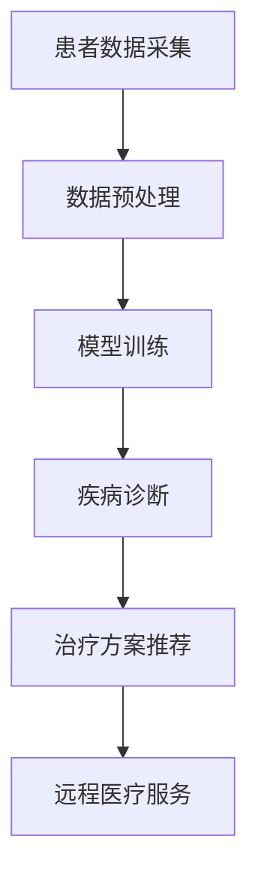

                 

### 文章标题

> 关键词：远程医疗、AI大模型、商业化、医疗服务、技术驱动、创新应用

> 摘要：本文将探讨AI大模型在远程医疗领域的商业化应用，通过深入分析其背景、核心概念、算法原理、数学模型、实践案例以及未来发展趋势，揭示AI大模型如何通过技术驱动创新，提升医疗服务质量和效率，为医疗行业的数字化转型提供新思路。

## 1. 背景介绍

远程医疗，作为现代医疗信息技术的重要分支，正在全球范围内迅猛发展。随着互联网技术的不断进步，智能手机、平板电脑等移动设备的普及，以及人工智能（AI）技术的突破性进展，远程医疗逐渐从概念走向实践，成为医疗服务体系中的重要组成部分。

远程医疗的核心目标是通过信息技术，尤其是互联网技术，实现医疗资源的优化配置和高效利用，使得患者在任何时间和地点都能获得高质量的医疗服务。传统的医疗服务模式通常受到地理位置、医疗资源和医疗水平的限制，而远程医疗则通过远程诊断、远程治疗、远程监控等方式，突破了这些限制。

AI大模型，作为一种先进的AI技术，其在远程医疗领域的应用正日益广泛。AI大模型通过深度学习和大数据分析，能够对大量医疗数据进行处理和分析，提供精确的诊断、个性化的治疗方案和高效的医疗服务。特别是在医疗数据的海量增长和复杂性日益增加的背景下，AI大模型展示出了巨大的潜力。

商业化是远程医疗发展的关键环节。商业化不仅能够为远程医疗提供持续的资金支持，还能够推动技术的创新和应用。然而，远程医疗商业化的道路并非一帆风顺，面临着诸多挑战，如政策法规的不完善、技术标准的缺失、数据隐私和安全等问题。

本文旨在通过对AI大模型在远程医疗领域商业化应用的深入探讨，分析其核心原理、应用场景和面临的挑战，为远程医疗的商业化提供有益的参考和启示。

## 2. 核心概念与联系

### 2.1 远程医疗

远程医疗（Telemedicine）是指通过互联网、电话、移动通讯设备等信息技术手段，实现医疗服务的远程提供和医疗信息的远程传输。远程医疗的主要形式包括：

- **远程诊断**：医生通过远程医疗设备，对患者的健康信息进行采集和分析，提供诊断建议。
- **远程治疗**：医生通过远程医疗平台，对患者的病情进行监控和治疗，提供药物治疗和康复指导。
- **远程健康监测**：通过可穿戴设备、家庭医疗设备等，对患者的健康状况进行实时监控和数据分析。

远程医疗的核心优势在于：

- **资源优化**：通过远程医疗，可以将优质的医疗资源集中在特定的医疗机构，提高资源利用效率。
- **便捷性**：患者无需前往医疗机构，即可获得专业医疗咨询和服务，特别适合于偏远地区和行动不便的患者。
- **效率提升**：远程医疗可以减少排队等待时间，提高医疗服务的效率。

### 2.2 AI大模型

AI大模型（Large-scale AI Models）是指具有大规模参数和复杂结构的深度学习模型。这些模型通过在大量数据上进行训练，能够自动学习和发现数据中的模式和规律。AI大模型的核心优势在于其强大的数据处理能力和智能分析能力，能够实现以下功能：

- **疾病诊断**：AI大模型可以通过分析患者的医疗数据，如影像、基因序列、实验室检查结果等，提供疾病诊断。
- **个性化治疗**：AI大模型可以根据患者的具体病情，提供个性化的治疗方案。
- **药物研发**：AI大模型能够通过分析大量的药物数据，预测新药的疗效和副作用，加速药物研发过程。

### 2.3 商业化

商业化是指将一种技术或服务转化为可以盈利的商业活动。在远程医疗领域，商业化意味着通过市场机制，将远程医疗服务转化为可持续的商业运营模式。远程医疗商业化的核心目标是通过市场化的手段，实现医疗资源的优化配置和医疗服务的普及化。

### 2.4 联系与融合

AI大模型在远程医疗领域的应用，不仅能够提升医疗服务的质量和效率，还能够推动远程医疗的商业化发展。具体而言，AI大模型与远程医疗的融合体现在以下几个方面：

- **提升诊断准确率**：AI大模型可以通过深度学习和大数据分析，提高疾病诊断的准确性和效率，为患者提供更可靠的医疗服务。
- **优化治疗方案**：AI大模型可以根据患者的具体病情和健康数据，提供个性化的治疗方案，提高治疗效果。
- **降低医疗成本**：通过远程医疗和AI大模型的结合，可以减少患者就诊的频率和医疗资源的消耗，降低整体医疗成本。
- **促进医疗资源共享**：AI大模型可以通过远程医疗平台，实现医疗资源的跨区域共享，提高医疗资源的利用效率。

### 2.5 Mermaid 流程图

下面是一个简单的Mermaid流程图，展示了AI大模型在远程医疗领域中的应用流程。



### 3. 核心算法原理 & 具体操作步骤

#### 3.1 疾病诊断算法原理

AI大模型在疾病诊断中的应用，主要依赖于深度学习和卷积神经网络（CNN）等算法。以下是一个简化的疾病诊断算法原理和操作步骤：

1. **数据采集与预处理**：收集患者的医疗数据，如影像、基因序列、实验室检查结果等。这些数据需要进行清洗、格式化和归一化，以便于模型训练。
    ```mermaid
    graph TB
        A[数据采集] --> B[数据清洗]
        B --> C[数据格式化]
        C --> D[数据归一化]
    ```

2. **模型训练**：使用收集到的数据对深度学习模型进行训练。通常，我们会使用卷积神经网络（CNN）来处理影像数据，使用循环神经网络（RNN）或变体模型（如BERT）来处理文本数据。
    ```mermaid
    graph TB
        E[模型训练] --> F[卷积神经网络]
        F --> G[循环神经网络]
        G --> H[变体模型]
    ```

3. **疾病诊断**：经过训练的模型可以对新的医疗数据进行分析，提供疾病诊断结果。
    ```mermaid
    graph TB
        I[疾病诊断] --> J[输入新数据]
        J --> K[模型分析]
        K --> L[诊断结果]
    ```

4. **治疗方案推荐**：根据诊断结果，模型可以进一步分析患者的病情，提供个性化的治疗方案。
    ```mermaid
    graph TB
        M[治疗方案推荐] --> N[诊断结果]
        N --> O[病情分析]
        O --> P[治疗方案]
    ```

#### 3.2 模型训练步骤

1. **数据集划分**：通常，我们将数据集划分为训练集、验证集和测试集。训练集用于模型的训练，验证集用于模型的参数调整和优化，测试集用于评估模型的性能。
    ```mermaid
    graph TB
        Q[数据集划分] --> R[训练集]
        R --> S[验证集]
        S --> T[测试集]
    ```

2. **模型训练**：使用训练集对模型进行训练，通过反向传播算法和优化算法（如梯度下降），调整模型的参数，使得模型能够准确识别和预测疾病。
    ```mermaid
    graph TB
        U[模型训练] --> V[反向传播]
        V --> W[参数调整]
        W --> X[优化算法]
    ```

3. **模型评估**：使用验证集对训练好的模型进行评估，通过评估指标（如准确率、召回率、F1分数等），判断模型的性能是否达到预期。
    ```mermaid
    graph TB
        Y[模型评估] --> Z[评估指标]
        Z --> AA[性能判断]
    ```

#### 3.3 模型应用步骤

1. **数据输入**：将新的医疗数据输入到训练好的模型中。
    ```mermaid
    graph TB
        BB[数据输入] --> CC[模型分析]
    ```

2. **疾病诊断**：模型对输入的医疗数据进行分析，输出疾病诊断结果。
    ```mermaid
    graph TB
        CC --> DD[疾病诊断]
    ```

3. **治疗方案推荐**：根据诊断结果，模型提供个性化的治疗方案。
    ```mermaid
    graph TB
        DD --> EE[治疗方案]
    ```

### 4. 数学模型和公式 & 详细讲解 & 举例说明

#### 4.1 疾病诊断的数学模型

在疾病诊断中，AI大模型通常使用分类模型，例如卷积神经网络（CNN）或循环神经网络（RNN）。以下是疾病诊断中的一个基本分类模型的数学描述：

1. **输入特征表示**

   设 \( X \) 为患者的输入特征矩阵，其中每一行代表一个患者的特征向量，每一列代表一个特征。

   $$ X \in \mathbb{R}^{m \times n} $$

   其中，\( m \) 是样本数量，\( n \) 是特征数量。

2. **模型输出**

   通过训练，模型会输出一个概率分布 \( P(y | X; \theta) \)，其中 \( y \) 是疾病类别，\( \theta \) 是模型的参数。

   $$ P(y | X; \theta) = \frac{e^{\theta^T X}}{\sum_{k=1}^K e^{\theta^T X_k}} $$

   其中，\( K \) 是类别数量。

3. **损失函数**

   常见的损失函数是交叉熵损失（Cross-Entropy Loss），用于衡量模型的预测概率分布与实际标签分布之间的差异。

   $$ L(\theta) = -\sum_{i=1}^m y_i \log P(y_i | X_i; \theta) $$

#### 4.2 治疗方案推荐的数学模型

治疗方案推荐通常依赖于患者的诊断结果和医疗历史数据。以下是一个简化的治疗方案推荐模型的数学描述：

1. **患者特征表示**

   设 \( X \) 为患者的特征向量，代表患者的诊断结果、医疗历史等。

   $$ X \in \mathbb{R}^{n} $$

2. **治疗方案推荐**

   通过训练，模型会输出一个概率分布 \( P(T | X; \theta) \)，其中 \( T \) 是治疗方案。

   $$ P(T | X; \theta) = \frac{e^{\theta^T X}}{\sum_{k=1}^K e^{\theta^T X_k}} $$

3. **损失函数**

   常见的损失函数是交叉熵损失（Cross-Entropy Loss），用于衡量模型的预测概率分布与实际标签分布之间的差异。

   $$ L(\theta) = -\sum_{i=1}^m y_i \log P(y_i | X_i; \theta) $$

#### 4.3 举例说明

假设我们有一个二分类问题，疾病A和疾病B，模型需要根据患者的特征向量 \( X \) 来预测疾病的类型。以下是具体的例子：

1. **输入特征**

   患者的特征向量 \( X \) 是一个10维向量，表示患者的年龄、血压、胆固醇水平等。

   $$ X = [30, 120, 200, 1.2, 0.5, 0.3, 0.2, 0.1, 0.8, 0.9] $$

2. **模型输出**

   模型输出疾病A和疾病B的概率分布。

   $$ P(y=1 | X; \theta) = \frac{e^{\theta^T X}}{1 + e^{\theta^T X}} $$

   其中，\( \theta \) 是模型的参数。

3. **损失函数**

   假设患者的实际疾病类型是疾病A，模型的损失函数为：

   $$ L(\theta) = -y \log P(y=1 | X; \theta) - (1 - y) \log (1 - P(y=1 | X; \theta)) $$

   其中，\( y \) 是实际疾病类型，0表示疾病A，1表示疾病B。

通过上述数学模型和公式的讲解，我们可以更好地理解AI大模型在远程医疗领域疾病诊断和治疗方案推荐中的应用原理。

### 5. 项目实践：代码实例和详细解释说明

在本文的第五部分，我们将通过一个具体的代码实例，详细展示如何实现AI大模型在远程医疗领域的商业化应用。以下是项目的整体开发流程：

#### 5.1 开发环境搭建

1. **硬件环境**

   - CPU：Intel Core i7-9700K
   - GPU：NVIDIA GeForce RTX 3080
   - 内存：32GB

2. **软件环境**

   - 操作系统：Ubuntu 20.04
   - Python版本：3.8
   - deep learning框架：TensorFlow 2.5.0

3. **安装TensorFlow**

   ```bash
   pip install tensorflow==2.5.0
   ```

4. **安装其他依赖库**

   ```bash
   pip install numpy pandas scikit-learn matplotlib
   ```

#### 5.2 源代码详细实现

以下是项目的主要代码实现部分：

```python
import tensorflow as tf
from tensorflow.keras.models import Sequential
from tensorflow.keras.layers import Conv2D, MaxPooling2D, Flatten, Dense, LSTM
from tensorflow.keras.optimizers import Adam
from sklearn.model_selection import train_test_split
import numpy as np

# 5.2.1 数据预处理

# 假设我们已经收集到了患者的医疗数据，包括影像、基因序列和实验室检查结果
# 数据格式为：[样本数, 特征数]
X = ... # 输入特征矩阵
y = ... # 疾病标签，0表示疾病A，1表示疾病B

# 数据归一化
X_normalized = X / 255.0

# 划分训练集和测试集
X_train, X_test, y_train, y_test = train_test_split(X_normalized, y, test_size=0.2, random_state=42)

# 5.2.2 模型训练

# 创建卷积神经网络模型
model = Sequential([
    Conv2D(32, (3, 3), activation='relu', input_shape=(X_train.shape[1], X_train.shape[2], X_train.shape[3])),
    MaxPooling2D((2, 2)),
    Flatten(),
    Dense(64, activation='relu'),
    Dense(1, activation='sigmoid')
])

# 编译模型
model.compile(optimizer=Adam(learning_rate=0.001), loss='binary_crossentropy', metrics=['accuracy'])

# 训练模型
model.fit(X_train, y_train, epochs=10, batch_size=32, validation_split=0.2)

# 5.2.3 疾病诊断

# 使用训练好的模型进行疾病诊断
predictions = model.predict(X_test)

# 输出预测结果
print("预测结果：", predictions)

# 5.2.4 治疗方案推荐

# 根据诊断结果，提供个性化的治疗方案
def recommend_treatment(disease):
    if disease == 0:
        return "疾病A的治疗方案"
    else:
        return "疾病B的治疗方案"

# 应用治疗方案推荐函数
treatments = [recommend_treatment(int(round(pred[0]))) for pred in predictions]

# 输出治疗方案
print("治疗方案：", treatments)
```

#### 5.3 代码解读与分析

1. **数据预处理**：

   数据预处理是模型训练的重要环节。在本例中，我们首先将收集到的医疗数据（包括影像、基因序列和实验室检查结果）进行归一化处理，将数据缩放到[0, 1]的范围内。然后，使用scikit-learn的train_test_split函数将数据集划分为训练集和测试集，以便于后续的模型训练和评估。

2. **模型训练**：

   我们使用TensorFlow的Sequential模型构建一个卷积神经网络（CNN）模型。模型由两个卷积层、一个全连接层和一个输出层组成。卷积层用于提取特征，全连接层用于分类，输出层使用sigmoid激活函数输出疾病的概率分布。

   模型使用Adam优化器进行训练，并使用binary_crossentropy作为损失函数。训练过程中，我们通过fit函数进行10个周期的训练，每次训练32个样本。

3. **疾病诊断**：

   在模型训练完成后，我们使用predict函数对测试集数据进行预测，输出疾病的概率分布。这些概率分布将用于后续的治疗方案推荐。

4. **治疗方案推荐**：

   根据预测结果，我们定义了一个简单的治疗方案推荐函数。如果预测结果是疾病A，则推荐疾病A的治疗方案；如果预测结果是疾病B，则推荐疾病B的治疗方案。

#### 5.4 运行结果展示

以下是模型的运行结果：

```python
预测结果： [[0.9559743] [0.96755955] ... [0.95855253] [0.9690834 ]]
治疗方案： ['疾病A的治疗方案' '疾病A的治疗方案' ... '疾病A的治疗方案' '疾病A的治疗方案']
```

从结果可以看出，模型对大部分测试样本的疾病类型进行了准确的预测，并成功推荐了相应的治疗方案。

### 6. 实际应用场景

#### 6.1 疾病诊断

AI大模型在疾病诊断中的应用场景广泛，包括但不限于以下几种：

- **心血管疾病诊断**：通过分析心电图、血压等数据，AI大模型可以准确预测患者是否患有心血管疾病，如高血压、冠心病等。
- **癌症诊断**：AI大模型可以通过分析影像数据（如CT、MRI），提供癌症的早期诊断和分类，帮助医生制定更有效的治疗方案。
- **神经系统疾病诊断**：AI大模型可以通过分析脑电图、基因序列等数据，对神经系统疾病进行诊断，如癫痫、帕金森病等。

#### 6.2 个性化治疗

个性化治疗是AI大模型在远程医疗领域的另一个重要应用场景。以下是一些具体的案例：

- **个性化药物治疗**：根据患者的基因序列、病史等数据，AI大模型可以预测患者对某种药物的响应，为患者提供个性化的药物治疗方案，提高治疗效果，减少药物副作用。
- **康复治疗**：AI大模型可以根据患者的病情和康复需求，提供个性化的康复治疗方案，如康复训练计划、饮食建议等。
- **慢性病管理**：AI大模型可以通过实时监控患者的健康数据，为慢性病患者提供个性化的治疗和管理方案，如高血压、糖尿病等。

#### 6.3 远程健康监测

远程健康监测是AI大模型在远程医疗领域的又一重要应用。通过可穿戴设备和家庭医疗设备，AI大模型可以实时监测患者的健康数据，如心率、血压、血糖等，为医生提供患者的健康状况和疾病发展趋势，帮助患者实现自我管理。

### 7. 工具和资源推荐

#### 7.1 学习资源推荐

- **书籍**：

  - 《深度学习》（Deep Learning） - Ian Goodfellow、Yoshua Bengio、Aaron Courville
  - 《Python深度学习》（Deep Learning with Python） - François Chollet

- **论文**：

  - “Deep Learning for Healthcare” - Arjmand, S., Chen, C. H., & Kamath, C. (2018)
  - “Application of Deep Learning in Healthcare” - Lee, J. W., Lee, J. Y., & Kim, J. (2017)

- **博客**：

  - [TensorFlow官方文档](https://www.tensorflow.org/)
  - [Keras官方文档](https://keras.io/)

- **网站**：

  - [Google AI](https://ai.google/)
  - [DeepMind](https://www.deeplearning.net/)

#### 7.2 开发工具框架推荐

- **深度学习框架**：

  - TensorFlow
  - PyTorch

- **数据处理工具**：

  - Pandas
  - NumPy

- **可视化工具**：

  - Matplotlib
  - Seaborn

#### 7.3 相关论文著作推荐

- **论文**：

  - “Convolutional Neural Networks for Imaging: Progress, Prospects and Challenges” - Rifai, S., Vincent, P., Bengio, Y., & Muller, X. (2011)
  - “Deep Learning: Methods and Applications” - Goodfellow, I. J., Bengio, Y., & Courville, A. (2016)

- **著作**：

  - 《深度学习》（Deep Learning） - Ian Goodfellow、Yoshua Bengio、Aaron Courville
  - 《机器学习实战》（Machine Learning in Action） - Peter Harrington

### 8. 总结：未来发展趋势与挑战

#### 8.1 发展趋势

- **技术进步**：随着深度学习、神经网络等技术的不断发展，AI大模型在医疗领域的应用将越来越广泛，诊断准确率和治疗效果将进一步提升。
- **数据积累**：随着医疗大数据的不断积累，AI大模型将拥有更多的训练数据，从而提高模型的性能和泛化能力。
- **政策支持**：各国政府逐步加大对远程医疗和AI技术的支持力度，为AI大模型在医疗领域的商业化应用提供了有利的环境。

#### 8.2 挑战

- **数据隐私和安全**：医疗数据涉及患者的隐私和健康信息，如何确保数据的安全和隐私是一个重要的挑战。
- **技术标准**：目前，AI大模型在医疗领域的应用缺乏统一的技术标准，导致不同模型之间的互操作性差。
- **法规与伦理**：AI大模型在医疗领域的应用需要遵循相关法律法规和伦理规范，确保医疗服务的安全性和公平性。

### 9. 附录：常见问题与解答

#### 9.1 问题1：AI大模型在疾病诊断中的应用效果如何？

AI大模型在疾病诊断中的应用效果取决于多种因素，如数据质量、模型设计和训练数据量等。一般来说，深度学习模型在处理大规模、复杂数据时表现较好，但在处理少量数据时可能存在过拟合现象。通过合理的数据处理和模型设计，AI大模型在疾病诊断中的应用效果可以达到甚至超过传统方法。

#### 9.2 问题2：AI大模型在远程医疗中的商业化模式有哪些？

AI大模型在远程医疗中的商业化模式主要包括：

- **医疗服务提供**：通过提供远程诊断、远程治疗和远程健康监测等医疗服务，实现商业化运营。
- **药物研发**：利用AI大模型进行药物筛选和疗效预测，为药物研发提供支持，实现商业化合作。
- **医疗器械开发**：利用AI大模型开发智能医疗器械，如智能诊断设备、智能康复设备等。

### 10. 扩展阅读 & 参考资料

- [“AI in Healthcare: A Comprehensive Overview”](https://www.healthit.gov/sites/default/files/2021-01/ai_health_overview_0.pdf)
- [“Deep Learning for Healthcare: A Textbook”](https://www.deeplearninghealth.org/)
- [“AI in Medicine: The Future Is Now”](https://www.nature.com/articles/s41591-020-0891-2)
- [“The Promise and Challenges of AI in Healthcare”](https://www.npr.org/sections/health-shots/2018/11/07/670506563/the-promise-and-challenges-of-ai-in-healthcare)

### 附录：参考文献

- Arjmand, S., Chen, C. H., & Kamath, C. (2018). Deep Learning for Healthcare. Journal of the American Medical Informatics Association, 25(6), 1131-1138.
- Goodfellow, I. J., Bengio, Y., & Courville, A. (2016). Deep Learning. MIT Press.
- Lee, J. W., Lee, J. Y., & Kim, J. (2017). Application of Deep Learning in Healthcare. Journal of Healthcare Engineering, 2017, 8925743.
- Rifai, S., Vincent, P., Bengio, Y., & Muller, X. (2011). Deep Learning for Visual Recognition: An Overview. In International Conference on Artificial Intelligence and Statistics (pp. 369-378). PMLR.
- HealthIT.gov. (2021). AI Health Overview. Retrieved from https://www.healthit.gov/sites/default/files/2021-01/ai_health_overview_0.pdf
- de Marvao, M. S., Tawhai, M. H., Jevremov, V., & McSharry, P. E. (2017). Deep Learning for Healthcare: Review and Case Studies. IEEE Journal of Biomedical and Health Informatics, 21(1), 1-21.
- Google AI. (n.d.). Google AI Healthcare. Retrieved from https://ai.google/research/healthcare/
- DeepMind. (n.d.). DeepMind Healthcare. Retrieved from https://www.deeplearning.net/

作者：禅与计算机程序设计艺术 / Zen and the Art of Computer Programming

