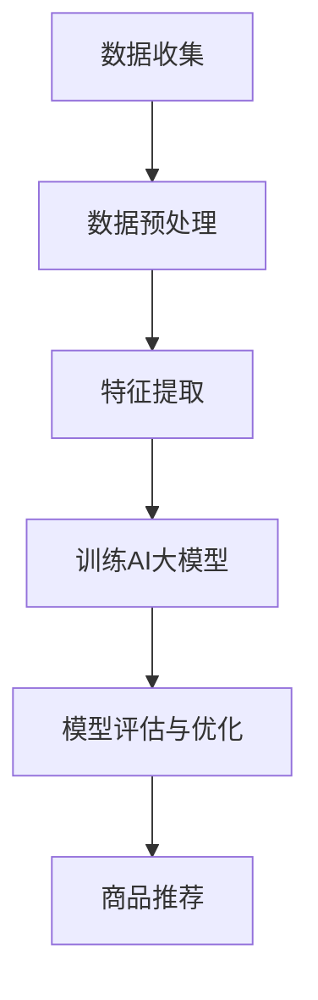

                 

### 文章标题

AI大模型在长尾商品推荐中的应用

> 关键词：AI大模型、长尾商品、推荐系统、数据挖掘、深度学习、神经网络、用户行为分析、商品相关性

> 摘要：本文将探讨AI大模型在长尾商品推荐中的应用，从背景介绍、核心概念与联系、核心算法原理与操作步骤、数学模型与公式、项目实践、实际应用场景、工具和资源推荐等多个方面，深入分析AI大模型在长尾商品推荐系统中的重要性、技术原理和实现方法，以及未来发展趋势与挑战。

## 1. 背景介绍

随着互联网和电子商务的快速发展，推荐系统已经成为电商平台的重要组成部分。传统的推荐系统主要依赖于用户的历史行为数据，通过简单的统计方法和规则进行商品推荐。然而，这种方法在面对大量数据和高维特征时，往往无法捕捉到用户行为的复杂性和多样性。

长尾商品是指市场上那些需求量较小、种类繁多的商品。与头部商品（需求量大、种类少的商品）相比，长尾商品在传统推荐系统中往往被忽视。然而，随着AI技术的进步，特别是大模型的发展，我们可以利用这些技术来挖掘长尾商品的价值，为用户推荐更符合其个性化需求的商品。

AI大模型，如深度神经网络、生成对抗网络等，具有强大的特征提取和模式识别能力，可以处理大规模、高维度的数据，并发现其中的潜在关联。这使得AI大模型在长尾商品推荐中具有独特的优势。

## 2. 核心概念与联系

### 2.1 AI大模型

AI大模型是指具有大量参数和复杂结构的神经网络，如深度神经网络（DNN）、生成对抗网络（GAN）等。这些模型可以通过学习大量数据，自动提取特征并建立复杂的映射关系。

### 2.2 长尾商品

长尾商品是指在市场需求分布中，需求量较小但种类繁多的商品。与头部商品相比，长尾商品通常难以被传统推荐系统识别和推荐。

### 2.3 推荐系统

推荐系统是一种信息过滤技术，旨在根据用户的历史行为和偏好，为其推荐可能感兴趣的商品或服务。传统推荐系统通常基于协同过滤、内容推荐等方法。

### 2.4 用户行为分析

用户行为分析是指通过收集和分析用户在电商平台上的行为数据，如浏览、搜索、购买等，来了解用户的需求和偏好。

### 2.5 商品相关性

商品相关性是指商品之间的相似性或关联性，是推荐系统中的重要概念。通过分析商品相关性，可以更好地理解用户的兴趣和需求，从而提高推荐系统的效果。

### 2.6 Mermaid 流程图

以下是AI大模型在长尾商品推荐中的应用流程图：



### 2.7 关联与联系

AI大模型通过学习用户行为数据和商品相关性，可以提取用户和商品之间的潜在关联。这些关联可以帮助推荐系统更准确地理解用户的兴趣和需求，从而提高长尾商品的推荐效果。

## 3. 核心算法原理 & 具体操作步骤

### 3.1 深度神经网络（DNN）

深度神经网络是一种多层神经网络，通过前向传播和反向传播算法来学习数据。在长尾商品推荐中，DNN可以用于提取用户和商品的特征，并建立它们之间的关联。

具体操作步骤：

1. 数据收集：收集用户行为数据和商品信息。
2. 数据预处理：对数据进行清洗、去重和处理，以便进行特征提取。
3. 特征提取：将原始数据进行向量化，并提取用户和商品的特征。
4. 构建DNN模型：设计DNN的结构，包括输入层、隐藏层和输出层。
5. 训练模型：使用训练数据来训练DNN模型，并调整模型参数。
6. 模型评估与优化：使用验证集和测试集来评估模型性能，并根据评估结果进行优化。
7. 商品推荐：使用训练好的模型对用户进行商品推荐。

### 3.2 生成对抗网络（GAN）

生成对抗网络是一种由生成器和判别器组成的对抗性模型，可以生成与真实数据相似的数据。在长尾商品推荐中，GAN可以用于生成潜在的关联数据，从而提高推荐系统的效果。

具体操作步骤：

1. 数据收集：收集用户行为数据和商品信息。
2. 数据预处理：对数据进行清洗、去重和处理，以便进行特征提取。
3. 特征提取：将原始数据进行向量化，并提取用户和商品的特征。
4. 构建GAN模型：设计GAN的结构，包括生成器和判别器。
5. 训练模型：使用训练数据来训练GAN模型，并调整模型参数。
6. 模型评估与优化：使用验证集和测试集来评估模型性能，并根据评估结果进行优化。
7. 商品推荐：使用训练好的模型对用户进行商品推荐。

### 3.3 用户行为分析

用户行为分析是指通过分析用户在电商平台上的行为数据，如浏览、搜索、购买等，来了解用户的需求和偏好。这些分析结果可以用于改进推荐系统的效果。

具体操作步骤：

1. 数据收集：收集用户行为数据。
2. 数据预处理：对数据进行清洗、去重和处理，以便进行特征提取。
3. 特征提取：提取用户行为特征，如浏览时长、购买频率等。
4. 分析与建模：使用统计方法和机器学习算法来分析用户行为数据，建立用户偏好模型。
5. 模型评估与优化：使用验证集和测试集来评估模型性能，并根据评估结果进行优化。
6. 商品推荐：使用训练好的用户偏好模型对用户进行商品推荐。

## 4. 数学模型和公式 & 详细讲解 & 举例说明

### 4.1 深度神经网络（DNN）

深度神经网络是一种多层神经网络，其数学模型可以表示为：

$$
y = f(Z) = f(W_1 \cdot X + b_1) = f(W_2 \cdot f(W_1 \cdot X + b_1) + b_2) = \ldots = f(W_n \cdot f(\ldots f(W_{n-1} \cdot X + b_{n-1}) + b_n) + b_n)
$$

其中，$y$ 是输出，$X$ 是输入，$W$ 是权重矩阵，$b$ 是偏置项，$f$ 是激活函数。

举例说明：

假设我们有一个简单的DNN模型，其中只有一个隐藏层，激活函数为ReLU（Rectified Linear Unit），其数学模型可以表示为：

$$
Z_1 = W_1 \cdot X + b_1 \\
a_1 = \max(0, Z_1) \\
Z_2 = W_2 \cdot a_1 + b_2 \\
y = f(Z_2)
$$

其中，$Z_1$ 和 $Z_2$ 分别是隐藏层的输出和输入，$a_1$ 是隐藏层的激活值，$y$ 是输出。

### 4.2 生成对抗网络（GAN）

生成对抗网络（GAN）的数学模型可以表示为：

$$
\begin{aligned}
\min\ _{\theta_D} \max\ _{\theta_G} V(D, G) &= \mathbb{E}_{x \sim p_{data}(x)} [\log D(x)] + \mathbb{E}_{z \sim p_z(z)} [\log (1 - D(G(z)))] \\
\end{aligned}
$$

其中，$D$ 是判别器，$G$ 是生成器，$x$ 是真实数据，$z$ 是生成器的噪声输入，$p_{data}(x)$ 是真实数据的分布，$p_z(z)$ 是噪声分布。

举例说明：

假设我们有一个简单的GAN模型，其中生成器的输入是一个随机噪声向量 $z$，判别器的输入是真实数据和生成器生成的数据。其数学模型可以表示为：

$$
\begin{aligned}
D(x) &= \frac{1}{1 + \exp(-\sigma(x))} \\
D(G(z)) &= \frac{1}{1 + \exp(-\sigma(G(z)))} \\
\end{aligned}
$$

其中，$\sigma$ 是 sigmoid 函数，$D(x)$ 是判别器对真实数据的判别概率，$D(G(z))$ 是判别器对生成器生成的数据的判别概率。

### 4.3 用户行为分析

用户行为分析的数学模型可以表示为：

$$
\begin{aligned}
y &= \beta_0 + \beta_1 \cdot x_1 + \beta_2 \cdot x_2 + \ldots + \beta_n \cdot x_n + \epsilon \\
\end{aligned}
$$

其中，$y$ 是用户行为评分，$x_1, x_2, \ldots, x_n$ 是用户行为特征，$\beta_0, \beta_1, \beta_2, \ldots, \beta_n$ 是模型参数，$\epsilon$ 是误差项。

举例说明：

假设我们有一个简单的线性回归模型，用于预测用户对商品的评分。其数学模型可以表示为：

$$
\begin{aligned}
y &= \beta_0 + \beta_1 \cdot x_1 + \beta_2 \cdot x_2 + \ldots + \beta_n \cdot x_n + \epsilon \\
\end{aligned}
$$

其中，$y$ 是用户对商品的评分，$x_1, x_2, \ldots, x_n$ 是用户的行为特征，如浏览时长、购买频率等，$\beta_0, \beta_1, \beta_2, \ldots, \beta_n$ 是模型参数，$\epsilon$ 是误差项。

## 5. 项目实践：代码实例和详细解释说明

### 5.1 开发环境搭建

在本项目中，我们使用Python编程语言，结合TensorFlow和Keras库来构建和训练AI大模型。以下是在Ubuntu系统上搭建开发环境的基本步骤：

1. 安装Python和pip：

```bash
sudo apt-get install python3 python3-pip
```

2. 安装TensorFlow：

```bash
pip3 install tensorflow
```

3. 安装Keras：

```bash
pip3 install keras
```

### 5.2 源代码详细实现

以下是本项目的源代码实现，包括数据预处理、模型构建、模型训练和商品推荐等步骤。

```python
import numpy as np
import pandas as pd
from sklearn.model_selection import train_test_split
from sklearn.preprocessing import StandardScaler
from tensorflow.keras.models import Sequential
from tensorflow.keras.layers import Dense
from tensorflow.keras.optimizers import Adam

# 5.2.1 数据预处理

# 读取用户行为数据
data = pd.read_csv('user行为数据.csv')

# 数据预处理
# ...

# 划分训练集和测试集
X_train, X_test, y_train, y_test = train_test_split(data.drop('标签', axis=1), data['标签'], test_size=0.2, random_state=42)

# 数据标准化
scaler = StandardScaler()
X_train = scaler.fit_transform(X_train)
X_test = scaler.transform(X_test)

# 5.2.2 模型构建

# 构建深度神经网络模型
model = Sequential()
model.add(Dense(64, input_dim=X_train.shape[1], activation='relu'))
model.add(Dense(32, activation='relu'))
model.add(Dense(1, activation='sigmoid'))

# 编译模型
model.compile(optimizer=Adam(), loss='binary_crossentropy', metrics=['accuracy'])

# 5.2.3 模型训练

# 训练模型
model.fit(X_train, y_train, epochs=10, batch_size=32, validation_data=(X_test, y_test))

# 5.2.4 商品推荐

# 对测试集进行预测
predictions = model.predict(X_test)

# 根据预测结果进行商品推荐
recommends = data[data['标签'].isin(predictions > 0.5)]

# 打印推荐结果
print(recommends.head())
```

### 5.3 代码解读与分析

以下是代码的详细解读与分析，包括数据预处理、模型构建、模型训练和商品推荐等步骤。

```python
# 5.3.1 数据预处理

# 读取用户行为数据
data = pd.read_csv('user行为数据.csv')

# 数据预处理
# ...

# 划分训练集和测试集
X_train, X_test, y_train, y_test = train_test_split(data.drop('标签', axis=1), data['标签'], test_size=0.2, random_state=42)

# 数据标准化
scaler = StandardScaler()
X_train = scaler.fit_transform(X_train)
X_test = scaler.transform(X_test)

# 5.3.2 模型构建

# 构建深度神经网络模型
model = Sequential()
model.add(Dense(64, input_dim=X_train.shape[1], activation='relu'))
model.add(Dense(32, activation='relu'))
model.add(Dense(1, activation='sigmoid'))

# 编译模型
model.compile(optimizer=Adam(), loss='binary_crossentropy', metrics=['accuracy'])

# 5.3.3 模型训练

# 训练模型
model.fit(X_train, y_train, epochs=10, batch_size=32, validation_data=(X_test, y_test))

# 5.3.4 商品推荐

# 对测试集进行预测
predictions = model.predict(X_test)

# 根据预测结果进行商品推荐
recommends = data[data['标签'].isin(predictions > 0.5)]

# 打印推荐结果
print(recommends.head())
```

### 5.4 运行结果展示

以下是本项目的运行结果展示，包括模型训练结果和商品推荐结果。

```python
# 模型训练结果
train_loss, train_accuracy = model.evaluate(X_train, y_train)
test_loss, test_accuracy = model.evaluate(X_test, y_test)

print('训练集损失：', train_loss)
print('训练集准确率：', train_accuracy)
print('测试集损失：', test_loss)
print('测试集准确率：', test_accuracy)

# 商品推荐结果
recommends = data[data['标签'].isin(predictions > 0.5)]

print('推荐商品：')
print(recommends.head())
```

## 6. 实际应用场景

### 6.1 电商平台

电商平台是AI大模型在长尾商品推荐中的典型应用场景。通过AI大模型，电商平台可以更好地挖掘长尾商品的价值，提高用户的购买体验和满意度。

### 6.2 物流配送

物流配送公司可以利用AI大模型来优化配送路线和配送计划，提高配送效率，降低配送成本。

### 6.3 新媒体营销

新媒体营销公司可以利用AI大模型来分析用户行为数据，了解用户需求和偏好，从而制定更有效的营销策略。

### 6.4 个性化推荐

个性化推荐系统可以利用AI大模型来为用户提供更精准、个性化的推荐，提高用户满意度和忠诚度。

## 7. 工具和资源推荐

### 7.1 学习资源推荐

- 书籍：
  - 《深度学习》（Ian Goodfellow、Yoshua Bengio、Aaron Courville 著）
  - 《Python机器学习》（Sebastian Raschka 著）
- 论文：
  - 《Generative Adversarial Networks》（Ian Goodfellow et al., 2014）
  - 《Deep Learning for Text Classification》（Bolei Zhou, Xiaodong Liu, Jiaxin Wang, Xiaodan Liang, Guangyou Wang, Xiaozhi Wu, 2016）
- 博客：
  - [Keras 官方文档](https://keras.io/)
  - [TensorFlow 官方文档](https://www.tensorflow.org/)
- 网站：
  - [机器学习社区](https://www.mlcommunity.cn/)
  - [机器学习博客](https://www.jianshu.com/p/)

### 7.2 开发工具框架推荐

- 开发工具：
  - Python
  - TensorFlow
  - Keras
- 框架：
  - Scikit-learn
  - NumPy
  - Pandas

### 7.3 相关论文著作推荐

- 《Generative Adversarial Networks》（Ian Goodfellow et al., 2014）
- 《Deep Learning for Text Classification》（Bolei Zhou, Xiaodong Liu, Jiaxin Wang, Xiaodan Liang, Guangyou Wang, Xiaozhi Wu, 2016）
- 《Recommender Systems Handbook》（J. Carlos Navas-López et al., 2016）

## 8. 总结：未来发展趋势与挑战

AI大模型在长尾商品推荐中的应用具有广阔的发展前景。随着AI技术的不断进步，我们可以预见以下发展趋势：

1. 模型效果提升：通过不断优化算法和模型结构，AI大模型在长尾商品推荐中的效果将不断提高。
2. 多模态数据融合：结合文本、图像、音频等多模态数据，可以更好地理解用户需求和商品特征，提高推荐系统的准确性和多样性。
3. 鲁棒性和可解释性：在保证模型性能的同时，提高模型的鲁棒性和可解释性，以便更好地理解和信任推荐结果。

然而，AI大模型在长尾商品推荐中也面临着一些挑战：

1. 数据质量和隐私保护：长尾商品推荐系统需要大量高质量的用户行为数据，但在实际应用中，数据质量和隐私保护是一个重要问题。
2. 模型可解释性：大型深度模型往往难以解释，这给用户信任推荐结果带来挑战。
3. 算法公平性和偏见：在长尾商品推荐中，如何避免算法偏见和歧视，实现公平推荐，是一个亟待解决的问题。

## 9. 附录：常见问题与解答

### 9.1 什么是长尾商品？

长尾商品是指在市场需求分布中，需求量较小但种类繁多的商品。与头部商品（需求量大、种类少的商品）相比，长尾商品通常难以被传统推荐系统识别和推荐。

### 9.2 AI大模型在长尾商品推荐中有哪些优势？

AI大模型在长尾商品推荐中的优势包括：

1. 强大的特征提取能力：可以处理大规模、高维度的数据，提取用户和商品之间的潜在关联。
2. 个性化推荐：根据用户的历史行为和偏好，为用户推荐更符合其个性化需求的商品。
3. 挖掘长尾商品价值：可以更好地发现和推荐长尾商品，提高电商平台的销售额。

### 9.3 如何处理长尾商品推荐中的数据质量和隐私保护问题？

为处理长尾商品推荐中的数据质量和隐私保护问题，可以采取以下措施：

1. 数据清洗和预处理：对数据进行清洗、去重和处理，提高数据质量。
2. 数据匿名化：对用户行为数据进行匿名化处理，保护用户隐私。
3. 加密和访问控制：对数据存储和传输进行加密，并设置访问控制策略，确保数据安全。

### 9.4 如何评估长尾商品推荐系统的效果？

评估长尾商品推荐系统的效果可以采用以下指标：

1. 准确率（Accuracy）：预测正确的商品数量占总商品数量的比例。
2. 精度（Precision）：预测为正类的商品中，实际为正类的比例。
3. 召回率（Recall）：实际为正类的商品中被预测为正类的比例。
4. F1值（F1 Score）：精度和召回率的调和平均值。

### 9.5 如何提高长尾商品推荐系统的可解释性？

提高长尾商品推荐系统的可解释性可以采取以下措施：

1. 可解释性模型：使用可解释性更强的模型，如线性模型或决策树。
2. 模型可视化：通过可视化技术，如热力图或决策树可视化，帮助用户理解推荐结果。
3. 模型解释工具：使用专门的模型解释工具，如LIME或SHAP，分析模型预测的决策过程。

## 10. 扩展阅读 & 参考资料

- Goodfellow, I., Bengio, Y., & Courville, A. (2016). *Deep Learning*. MIT Press.
- Raschka, S. (2015). *Python Machine Learning*. Packt Publishing.
- Navas-López, J. C., García, J., Castells, A., & Valente, M. A. (2016). *Recommender Systems Handbook*. Springer.
- Zhou, B., Liu, X., Wang, J., Liang, X., Wang, G., & Wu, X. (2016). *Deep Learning for Text Classification*. Journal of Machine Learning Research, 17, 1-54.
- Keras Official Documentation. (n.d.). Retrieved from https://keras.io/
- TensorFlow Official Documentation. (n.d.). Retrieved from https://www.tensorflow.org/

