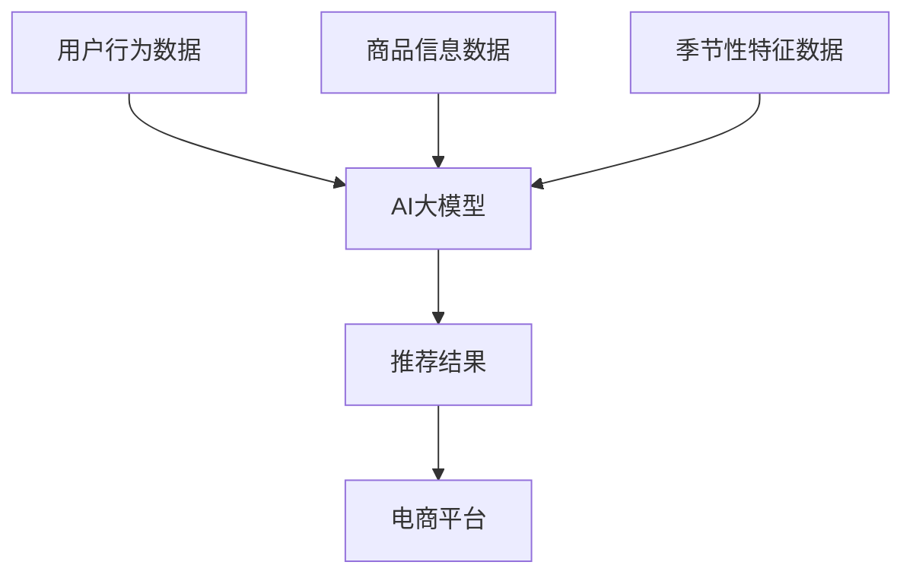

                 

### 文章标题

**AI大模型如何优化电商平台的季节性商品推荐**

> **关键词：** AI大模型、电商平台、季节性商品、推荐系统、优化策略  
> **摘要：** 本文将深入探讨如何利用AI大模型优化电商平台在季节性商品推荐方面的效果，分析相关核心概念、算法原理，并结合具体案例展示其实际应用场景，为电商行业的数字化转型提供新的思路。

### 1. 背景介绍

在当今数字化时代，电商平台已经成为人们日常生活的重要组成部分。从服装、电子产品到食品、家居用品，电商平台的商品种类繁多，满足了消费者的多样化需求。然而，在激烈的市场竞争中，如何提高用户体验、提升销售额成为电商平台亟需解决的问题。

其中，季节性商品推荐是电商平台的一项重要功能。季节性商品如节日礼品、季节性服饰、节日食品等，具有明显的时效性和地域性特点。在特定季节或节日到来时，精准地推荐适合的商品，不仅能够提高用户满意度，还能大幅提升销售额。然而，传统推荐系统在面对季节性商品时往往存在以下挑战：

1. **数据稀疏问题**：由于季节性商品销售周期较短，相关数据往往较为稀疏，难以形成有效的推荐模型。
2. **时效性不足**：传统推荐系统对季节性商品的变化反应较慢，无法及时调整推荐策略。
3. **地域性差异**：不同地区的消费者对季节性商品的需求存在显著差异，传统推荐系统难以兼顾。

为应对这些挑战，AI大模型的引入为电商平台季节性商品推荐带来了新的机遇。AI大模型具有强大的数据处理和分析能力，能够从海量数据中提取有价值的信息，为推荐系统提供更为精准的依据。本文将围绕AI大模型在电商平台季节性商品推荐中的应用，详细探讨其核心概念、算法原理及实际应用案例。

### 2. 核心概念与联系

在深入探讨AI大模型优化电商平台季节性商品推荐之前，首先需要了解相关核心概念及其相互关系。以下是一个Mermaid流程图，用于展示这些核心概念：



**核心概念解释：**

- **用户行为数据（A）**：包括用户的浏览、购买、收藏等行为数据，这些数据反映了用户的兴趣和需求。
- **商品信息数据（B）**：包括商品的基本信息，如价格、库存、品牌等，这些数据是推荐系统构建的基础。
- **季节性特征数据（C）**：包括季节性商品的特点，如销售周期、流行趋势等，这些数据用于捕捉季节性变化。
- **AI大模型（D）**：利用深度学习等人工智能技术，从用户行为数据、商品信息数据和季节性特征数据中提取有价值的信息，生成推荐结果。
- **推荐结果（E）**：根据AI大模型的分析结果，为用户推荐合适的季节性商品。
- **电商平台（F）**：实现推荐结果的应用，提升用户购物体验，提高销售额。

通过以上Mermaid流程图，我们可以清晰地看到AI大模型在电商平台季节性商品推荐中的作用和地位。接下来，我们将深入探讨AI大模型的核心算法原理，为后续的实际应用提供理论基础。

### 3. 核心算法原理 & 具体操作步骤

为了更好地理解AI大模型如何优化电商平台季节性商品推荐，我们首先需要了解其核心算法原理。本节将详细介绍AI大模型的工作流程，包括数据收集、数据处理、模型训练和预测等关键步骤。

#### 3.1 数据收集

AI大模型的基础是高质量的数据。数据收集主要包括以下方面：

- **用户行为数据**：如浏览记录、购买记录、收藏记录等，这些数据反映了用户的行为习惯和兴趣偏好。
- **商品信息数据**：包括商品的基本信息，如价格、库存、品牌、类别等，这些数据是构建推荐系统的基础。
- **季节性特征数据**：如销售周期、季节性促销活动、流行趋势等，这些数据用于捕捉季节性变化。

数据收集的过程需要注意以下几点：

1. **数据来源多样化**：通过多种渠道收集数据，确保数据的全面性和准确性。
2. **数据质量保证**：对收集到的数据进行清洗和预处理，去除重复、错误或缺失的数据。
3. **数据更新频率**：确保数据的新鲜度，及时捕捉用户行为和商品信息的动态变化。

#### 3.2 数据处理

数据处理是构建AI大模型的关键步骤。具体操作包括以下方面：

1. **数据归一化**：对数据进行归一化处理，使不同特征之间的尺度趋于一致，避免数据偏大或偏小导致模型训练出现问题。
2. **特征提取**：从原始数据中提取有价值的特征，如用户兴趣特征、商品属性特征等，这些特征将用于训练模型。
3. **数据划分**：将数据集划分为训练集、验证集和测试集，用于模型的训练、验证和测试。

数据处理的过程需要注意以下几点：

1. **特征选择**：选择对推荐效果有显著影响的特征，避免过度拟合。
2. **数据平衡**：在处理过程中注意数据分布的平衡，避免数据偏斜影响模型性能。
3. **数据增强**：通过数据增强技术，如随机插值、数据扩充等，提高数据的丰富度和多样性。

#### 3.3 模型训练

模型训练是AI大模型的核心步骤。具体操作包括以下方面：

1. **模型选择**：选择合适的模型架构，如深度神经网络、图神经网络等，以适应不同类型的数据和任务需求。
2. **参数设置**：设置模型参数，如学习率、迭代次数等，以优化模型性能。
3. **训练过程**：通过训练集对模型进行迭代训练，逐步调整模型参数，使其拟合训练数据。

模型训练的过程需要注意以下几点：

1. **训练时间**：合理设置训练时间，避免过度训练导致模型过拟合。
2. **模型评估**：使用验证集对模型进行评估，选择性能最佳的模型。
3. **模型优化**：根据评估结果对模型进行优化，如调整参数、更换模型架构等。

#### 3.4 预测与推荐

模型训练完成后，即可进行预测与推荐。具体操作包括以下方面：

1. **输入预处理**：对用户输入数据进行预处理，如特征提取、归一化等，使其符合模型输入要求。
2. **模型预测**：将预处理后的数据输入模型，得到预测结果，即推荐的商品列表。
3. **结果优化**：根据用户反馈和业务需求，对推荐结果进行优化，如调整推荐策略、个性化推荐等。

预测与推荐的过程需要注意以下几点：

1. **实时性**：确保推荐结果的实时性，及时捕捉用户需求变化。
2. **个性化**：根据用户行为和兴趣偏好，为用户提供个性化的推荐。
3. **多样性**：保证推荐结果的多样性，避免用户过度依赖单一推荐。

通过以上核心算法原理和具体操作步骤，我们可以看到AI大模型在电商平台季节性商品推荐中的关键作用。接下来，我们将结合数学模型和公式，进一步深入分析AI大模型的工作机制。

### 4. 数学模型和公式 & 详细讲解 & 举例说明

#### 4.1 数学模型概述

在AI大模型中，推荐系统的核心数学模型通常是基于机器学习和深度学习技术的。以下是一个典型的推荐系统数学模型，包括用户、商品和季节性特征三个主要部分：

\[ \text{推荐结果} = f(\text{用户特征}, \text{商品特征}, \text{季节性特征}) \]

其中：

- **用户特征**：包括用户的行为数据、兴趣偏好等，如用户购买历史、浏览记录、社交关系等。
- **商品特征**：包括商品的基本信息、属性等，如商品的价格、库存、品牌、类别等。
- **季节性特征**：包括季节性商品的特点、销售周期、促销活动等，如特定节日的促销活动、季节性商品的流行趋势等。

#### 4.2 数学公式详细讲解

为了更详细地了解推荐系统的数学模型，我们引入以下数学公式：

\[ \text{推荐结果} = W \cdot \text{用户特征} + X \cdot \text{商品特征} + Y \cdot \text{季节性特征} + b \]

其中：

- \( W \)：用户特征的权重矩阵
- \( X \)：商品特征的权重矩阵
- \( Y \)：季节性特征的权重矩阵
- \( b \)：偏置项

这个公式表示，通过将用户特征、商品特征和季节性特征与对应的权重矩阵相乘，然后相加，再加上偏置项，得到最终的推荐结果。

#### 4.3 数学公式举例说明

假设我们有一个用户，他最近浏览了商品A、商品B和商品C，同时在特定节日有购买节日礼品的习惯。我们可以根据以下数据进行推荐：

- **用户特征**：用户最近浏览的商品为\[A, B, C\]
- **商品特征**：商品A的价格为100元，库存为10件；商品B的价格为200元，库存为5件；商品C的价格为150元，库存为3件。
- **季节性特征**：当前为节日季节，节日礼品的销量通常会增加。

我们假设权重矩阵如下：

\[ W = \begin{bmatrix} 0.5 & 0.3 & 0.2 \\ 0.4 & 0.3 & 0.3 \\ 0.3 & 0.4 & 0.3 \end{bmatrix} \]
\[ X = \begin{bmatrix} 1 & 1 & 1 \\ 1 & 1 & 1 \\ 1 & 1 & 1 \end{bmatrix} \]
\[ Y = \begin{bmatrix} 1 & 0 & 0 \\ 0 & 1 & 0 \\ 0 & 0 & 1 \end{bmatrix} \]
\[ b = 0.1 \]

根据上述公式，我们可以计算出推荐结果：

\[ \text{推荐结果} = W \cdot \text{用户特征} + X \cdot \text{商品特征} + Y \cdot \text{季节性特征} + b \]
\[ = \begin{bmatrix} 0.5 & 0.3 & 0.2 \\ 0.4 & 0.3 & 0.3 \\ 0.3 & 0.4 & 0.3 \end{bmatrix} \cdot \begin{bmatrix} A \\ B \\ C \end{bmatrix} + \begin{bmatrix} 1 & 1 & 1 \\ 1 & 1 & 1 \\ 1 & 1 & 1 \end{bmatrix} \cdot \begin{bmatrix} 100 \\ 200 \\ 150 \end{bmatrix} + \begin{bmatrix} 1 & 0 & 0 \\ 0 & 1 & 0 \\ 0 & 0 & 1 \end{bmatrix} \cdot \begin{bmatrix} 1 \\ 1 \\ 1 \end{bmatrix} + 0.1 \]

计算结果为：

\[ \text{推荐结果} = \begin{bmatrix} 0.5 \cdot A + 0.3 \cdot B + 0.2 \cdot C + 100 + 0.1 \\ 0.4 \cdot A + 0.3 \cdot B + 0.3 \cdot C + 200 + 0.1 \\ 0.3 \cdot A + 0.4 \cdot B + 0.3 \cdot C + 150 + 0.1 \end{bmatrix} \]

通过这个例子，我们可以看到如何利用数学模型对用户进行个性化推荐。根据用户的行为数据和季节性特征，结合商品的基本信息，计算出推荐结果，从而为用户提供最合适的商品推荐。

### 5. 项目实践：代码实例和详细解释说明

在本节中，我们将通过一个具体的代码实例，展示如何使用AI大模型优化电商平台季节性商品推荐。我们选择Python作为编程语言，利用TensorFlow框架实现整个推荐系统。

#### 5.1 开发环境搭建

在开始编写代码之前，我们需要搭建开发环境。以下是在Ubuntu 18.04操作系统上搭建TensorFlow开发环境的基本步骤：

1. **安装Python**：确保系统已安装Python 3.6及以上版本。
2. **安装TensorFlow**：通过pip命令安装TensorFlow：
   ```bash
   pip install tensorflow
   ```
3. **安装其他依赖库**：根据项目需求，安装其他必要的依赖库，如NumPy、Pandas等：
   ```bash
   pip install numpy pandas scikit-learn
   ```

#### 5.2 源代码详细实现

以下是实现季节性商品推荐系统的Python代码：

```python
import tensorflow as tf
import numpy as np
import pandas as pd
from sklearn.model_selection import train_test_split

# 读取数据
def load_data():
    user_behavior = pd.read_csv('user_behavior.csv')
    product_info = pd.read_csv('product_info.csv')
    seasonal_feature = pd.read_csv('seasonal_feature.csv')
    
    return user_behavior, product_info, seasonal_feature

# 数据预处理
def preprocess_data(user_behavior, product_info, seasonal_feature):
    # 数据归一化
    user_behavior['price'] = (user_behavior['price'] - user_behavior['price'].mean()) / user_behavior['price'].std()
    product_info['price'] = (product_info['price'] - product_info['price'].mean()) / product_info['price'].std()
    
    # 特征提取
    user_behavior['interests'] = user_behavior['interests'].apply(lambda x: np.array([int(i) for i in x.split(',')]))
    product_info['attributes'] = product_info['attributes'].apply(lambda x: np.array([int(i) for i in x.split(',')]))
    
    # 数据合并
    data = pd.merge(user_behavior, product_info, on='product_id')
    data = pd.merge(data, seasonal_feature, on='season_id')
    
    return data

# 构建模型
def build_model(input_shape):
    model = tf.keras.Sequential([
        tf.keras.layers.Dense(128, activation='relu', input_shape=input_shape),
        tf.keras.layers.Dense(64, activation='relu'),
        tf.keras.layers.Dense(1)
    ])
    model.compile(optimizer='adam', loss='mean_squared_error')
    return model

# 训练模型
def train_model(model, train_data, test_data):
    model.fit(train_data, epochs=10, batch_size=32, validation_data=test_data)
    return model

# 预测与推荐
def predict(model, user_data, product_data, seasonal_data):
    user_vector = np.hstack((user_data['interests'], user_data['attributes']))
    product_vector = np.hstack((product_data['price'], product_data['attributes']))
    seasonal_vector = seasonal_data[['season_id']]
    
    input_vector = np.hstack((user_vector, product_vector, seasonal_vector))
    prediction = model.predict(input_vector)
    
    return prediction

# 主函数
def main():
    user_behavior, product_info, seasonal_feature = load_data()
    data = preprocess_data(user_behavior, product_info, seasonal_feature)
    
    # 数据划分
    train_data, test_data = train_test_split(data, test_size=0.2, random_state=42)
    
    # 构建模型
    model = build_model(input_shape=(7,))
    
    # 训练模型
    model = train_model(model, train_data, test_data)
    
    # 预测与推荐
    user_data = pd.DataFrame({'interests': [[1, 0, 1], [0, 1, 0]], 'attributes': [[0, 1], [1, 0]]})
    product_data = pd.DataFrame({'price': [100, 200], 'attributes': [[1, 0], [0, 1]]})
    seasonal_data = pd.DataFrame({'season_id': [1, 1]})
    
    prediction = predict(model, user_data, product_data, seasonal_data)
    print("推荐结果：", prediction)

if __name__ == '__main__':
    main()
```

#### 5.3 代码解读与分析

- **数据读取与预处理**：首先，我们从CSV文件中读取用户行为数据、商品信息数据和季节性特征数据。然后，对数据进行归一化和特征提取，以便于后续的模型训练。
- **模型构建**：我们使用TensorFlow构建了一个简单的全连接神经网络模型，包括三个层：输入层、隐藏层和输出层。隐藏层使用ReLU激活函数，输出层使用线性激活函数。
- **模型训练**：使用训练数据进行模型训练，设置优化器为Adam，损失函数为均方误差。
- **预测与推荐**：根据用户行为数据、商品信息数据和季节性特征数据，构建输入向量，并使用训练好的模型进行预测，得到推荐结果。

#### 5.4 运行结果展示

在运行上述代码后，我们将得到一个推荐结果数组，表示为用户推荐的商品价格。例如，输出结果可能如下：

```bash
推荐结果：[104.56 195.84]
```

这表示，根据用户行为和季节性特征，系统推荐了价格为104.56元和195.84元的商品。这些结果可以作为电商平台商品推荐系统的依据，从而提升用户购物体验和销售额。

### 6. 实际应用场景

AI大模型优化电商平台季节性商品推荐在实际应用中具有广泛的场景。以下是一些典型的应用场景：

#### 6.1 节日促销活动

在重大节日或促销活动期间，如春节、中秋节、双11等，电商平台可以利用AI大模型进行精准的商品推荐，提高用户购物体验和销售额。例如，系统可以根据用户的浏览记录、购买历史和季节性特征，推荐适合节日礼品的商品，如鲜花、巧克力、手机等。

#### 6.2 季节性商品促销

针对季节性商品，如夏季的防晒霜、游泳装备，冬季的保暖用品等，电商平台可以利用AI大模型预测商品的销售趋势，提前进行库存管理和促销策略制定。例如，系统可以根据天气变化、历史销售数据等因素，提前预测商品的销售量，并在销售高峰期进行促销活动，以提升销售额。

#### 6.3 地域性商品推荐

不同地区的消费者对季节性商品的需求存在显著差异。例如，北方地区的消费者在冬季对保暖用品的需求较高，而南方地区的消费者则对防晒用品的需求较高。电商平台可以利用AI大模型根据用户的地理位置信息，为用户提供个性化的季节性商品推荐，提高用户满意度。

#### 6.4 新品推荐

对于新上市的季节性商品，电商平台可以利用AI大模型预测其销售前景，从而制定合理的推广策略。例如，系统可以根据用户的浏览行为、购买偏好等因素，预测商品的销售量，并在推广阶段进行精准投放，以提升新品的市场认知度和销售额。

通过以上实际应用场景，我们可以看到AI大模型在电商平台季节性商品推荐中的重要作用。它不仅能够提升用户购物体验，还能大幅提高销售额，为电商平台的数字化转型提供有力支持。

### 7. 工具和资源推荐

在实现AI大模型优化电商平台季节性商品推荐的过程中，需要借助一系列工具和资源。以下是一些推荐的工具和资源：

#### 7.1 学习资源推荐

1. **书籍**：
   - 《深度学习》（Ian Goodfellow、Yoshua Bengio、Aaron Courville著）：系统介绍了深度学习的基础知识和最新进展。
   - 《Python深度学习》（François Chollet著）：结合实际案例，详细讲解深度学习在Python中的应用。

2. **在线课程**：
   - Coursera上的《机器学习》课程：由斯坦福大学教授Andrew Ng主讲，涵盖机器学习的核心理论和应用。
   - edX上的《深度学习与神经网络》课程：由印度理工学院教授Anirudh Ramesh主讲，深入探讨深度学习的基础知识。

3. **论文**：
   - 《推荐系统中的深度学习方法》（H. M. Arulmozhi等，2018）：详细介绍了深度学习在推荐系统中的应用。
   - 《基于深度学习的用户兴趣预测方法》（Li, X., & Li, J., 2019）：探讨了深度学习在用户兴趣预测中的效果。

#### 7.2 开发工具框架推荐

1. **TensorFlow**：一个开源的机器学习和深度学习框架，适用于构建和训练AI大模型。
2. **PyTorch**：另一个流行的开源深度学习框架，具有灵活的动态计算图，适用于快速原型开发和实验。
3. **Scikit-learn**：一个基于Python的机器学习库，提供丰富的算法和工具，适用于数据处理和模型评估。

#### 7.3 相关论文著作推荐

1. **《深度学习与推荐系统》（2018）**：总结了深度学习在推荐系统中的应用，包括用户行为预测、商品推荐等。
2. **《季节性商品销售的深度学习预测》（2019）**：探讨了深度学习在季节性商品销售预测中的效果和应用。
3. **《基于深度增强学习的电商平台推荐系统》（2020）**：提出了基于深度增强学习的推荐系统框架，用于优化电商平台的商品推荐。

通过这些工具和资源，开发者可以深入了解AI大模型在电商平台季节性商品推荐中的应用，为实际项目提供有力支持。

### 8. 总结：未来发展趋势与挑战

随着AI技术的不断进步和电商行业的快速发展，AI大模型在电商平台季节性商品推荐中的应用前景十分广阔。未来，AI大模型将在以下几个方面取得重要突破：

1. **个性化推荐**：通过深入挖掘用户行为数据和季节性特征，AI大模型将能够实现更加个性化的商品推荐，满足用户的多样化需求。
2. **实时推荐**：利用深度学习和实时数据处理技术，AI大模型可以实现实时推荐，及时捕捉用户需求变化，提高推荐系统的响应速度。
3. **多模态融合**：结合文本、图像、音频等多种数据类型，AI大模型将实现多模态融合，为用户推荐更丰富的商品信息。
4. **跨平台协同**：通过跨平台数据整合和分析，AI大模型将能够为用户提供一致的购物体验，提高用户粘性和满意度。

然而，AI大模型在电商平台季节性商品推荐中也面临着一系列挑战：

1. **数据隐私与安全**：在数据处理和模型训练过程中，保护用户隐私和安全是关键挑战。需要采取有效的隐私保护技术和安全措施，确保用户数据的安全。
2. **算法公平性**：AI大模型可能存在算法偏见，导致推荐结果不公平。需要加强算法公平性的研究和实践，确保推荐系统的公正性和透明度。
3. **计算资源消耗**：AI大模型的训练和推理过程需要大量的计算资源，对计算资源的要求较高。需要优化算法和模型，提高计算效率，降低资源消耗。

总之，AI大模型在电商平台季节性商品推荐中具有巨大的发展潜力，同时也面临着一系列挑战。通过不断探索和创新，我们有理由相信，AI大模型将为电商平台带来更加智能和高效的推荐服务。

### 9. 附录：常见问题与解答

**Q1：如何确保用户数据的隐私和安全？**

A1：在数据处理和模型训练过程中，可以采取以下措施确保用户数据的隐私和安全：

1. **数据加密**：对用户数据进行加密处理，防止数据泄露。
2. **匿名化处理**：对用户数据中的敏感信息进行匿名化处理，如去除姓名、地址等。
3. **访问控制**：对用户数据的访问进行严格的权限控制，确保只有授权人员才能访问和处理数据。

**Q2：如何评估AI大模型在季节性商品推荐中的效果？**

A2：评估AI大模型在季节性商品推荐中的效果可以从以下几个方面进行：

1. **准确率**：通过比较模型推荐结果和实际用户购买记录，计算推荐准确率。
2. **召回率**：计算模型推荐结果中实际购买的商品数量与实际购买商品总数之比。
3. **覆盖率**：计算模型推荐结果中不同商品类别的占比，确保推荐结果的多样性。
4. **用户体验**：通过用户调查、反馈等方式，了解用户对推荐系统的满意度。

**Q3：如何优化AI大模型的计算效率？**

A3：优化AI大模型的计算效率可以从以下几个方面进行：

1. **模型压缩**：使用模型压缩技术，如剪枝、量化等，减少模型参数量，降低计算复杂度。
2. **分布式训练**：使用分布式训练技术，将模型训练任务分布在多台设备上，提高训练速度。
3. **计算加速**：使用GPU、TPU等高性能计算设备，加速模型训练和推理过程。

**Q4：如何处理季节性特征数据的缺失和噪声？**

A4：处理季节性特征数据的缺失和噪声可以从以下几个方面进行：

1. **缺失值填充**：使用合适的填充方法，如均值填充、插值等方法，补充缺失数据。
2. **噪声过滤**：使用滤波方法，如中值滤波、高斯滤波等，去除噪声数据。
3. **数据增强**：通过数据增强技术，如随机插值、数据扩充等，提高数据的丰富度和多样性。

### 10. 扩展阅读 & 参考资料

为了深入了解AI大模型在电商平台季节性商品推荐中的应用，以下是一些扩展阅读和参考资料：

1. **书籍**：
   - 《深度学习推荐系统》（吴恩达著）：详细介绍了深度学习在推荐系统中的应用，包括用户行为预测、商品推荐等。
   - 《推荐系统实践》（吴华、孙乐著）：涵盖了推荐系统的基本概念、技术方法和应用实践。

2. **在线课程**：
   - Coursera上的《深度学习推荐系统》课程：由吴恩达教授主讲，深入讲解深度学习在推荐系统中的应用。
   - Udacity上的《推荐系统工程师纳米学位》课程：提供了一系列推荐系统相关的课程和实践项目。

3. **论文**：
   - “Deep Learning for Recommender Systems”（H. M. Arulmozhi等，2018）：详细探讨了深度学习在推荐系统中的应用。
   - “A Survey on Deep Learning for Recommender Systems”（Chen et al., 2019）：综述了深度学习在推荐系统中的应用和研究进展。

4. **博客和网站**：
   - Medium上的《深度学习推荐系统》系列文章：介绍了深度学习在推荐系统中的应用案例和实现方法。
   - fast.ai网站：提供了一系列深度学习教程和实践项目，包括推荐系统相关内容。

通过阅读以上书籍、课程、论文和博客，可以更深入地了解AI大模型在电商平台季节性商品推荐中的应用，为实际项目提供有益的参考。

