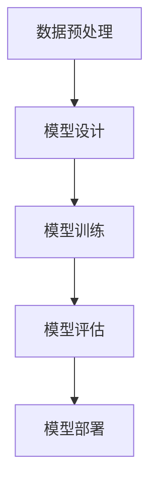

                 

### 背景介绍

在当今信息化时代，企业面临着前所未有的挑战和机遇。随着大数据、云计算和人工智能等技术的迅猛发展，企业运营的效率和智能化水平成为核心竞争力的重要因素。传统的人工管理模式已经难以满足企业日益增长的运营需求，而人工智能大模型（Large-scale Artificial Intelligence Models，简称AI大模型）的应用，为提升企业运营效率提供了全新的解决方案。

#### 1.1 人工智能大模型的概念

人工智能大模型是一种通过深度学习技术训练出的具有强大学习和推理能力的模型。这些模型通常拥有数百万甚至数十亿个参数，能够处理海量数据，并从中提取出有价值的信息和规律。AI大模型主要包括神经网络模型（如Transformer、BERT等）和强化学习模型（如DQN、PPO等）。

#### 1.2 AI大模型的优势

1. **处理海量数据**：AI大模型能够处理海量的结构化和非结构化数据，帮助企业从数据中挖掘出有价值的信息。
   
2. **自动特征提取**：传统的数据分析方法通常需要手动提取特征，而AI大模型能够自动从数据中提取出具有预测性的特征，减少人工干预。

3. **自适应学习能力**：AI大模型具有较强的自适应学习能力，能够随着新的数据不断优化自身，持续提升模型的准确性和鲁棒性。

4. **自动化决策**：AI大模型可以自动化地进行决策，帮助企业减少人为错误，提高决策效率。

#### 1.3 企业运营效率的重要性

企业运营效率直接关系到企业的生存和发展。提高运营效率，不仅可以降低成本、提高利润，还可以提升客户满意度，增强企业的核心竞争力。

1. **降低成本**：高效的运营可以减少资源浪费，降低生产成本和运营成本。
   
2. **提高利润**：高效的运营可以提高企业的营业收入，增加利润空间。

3. **提升客户满意度**：高效的运营可以提高服务质量，提升客户满意度，增强客户忠诚度。

4. **增强竞争力**：高效的运营可以提高企业的响应速度和市场适应性，增强企业的竞争力。

#### 1.4 AI大模型在提升企业运营效率中的应用

1. **供应链管理**：AI大模型可以优化供应链管理，通过预测需求、降低库存、提高物流效率等方式，降低成本、提高运营效率。

2. **人力资源**：AI大模型可以辅助人力资源部门进行招聘、培训、绩效评估等工作，提高招聘效率、培训效果和员工满意度。

3. **客户服务**：AI大模型可以用于智能客服系统，提高客户服务水平，降低人工成本。

4. **数据分析**：AI大模型可以用于数据挖掘、预测分析等工作，帮助企业管理者做出更准确、更高效的决策。

### 1.5 文章结构概述

本文将从以下方面探讨AI大模型如何提升企业运营效率：

1. **核心概念与联系**：介绍AI大模型的核心概念、原理和架构，并通过Mermaid流程图展示其工作流程。
   
2. **核心算法原理 & 具体操作步骤**：详细解析AI大模型的核心算法原理和具体操作步骤。

3. **数学模型和公式 & 详细讲解 & 举例说明**：介绍AI大模型所涉及的数学模型和公式，并进行详细讲解和举例说明。

4. **项目实践：代码实例和详细解释说明**：通过具体项目实践，展示AI大模型的代码实现过程，并进行详细解释和分析。

5. **实际应用场景**：探讨AI大模型在供应链管理、人力资源、客户服务和数据分析等实际应用场景中的效果。

6. **工具和资源推荐**：推荐学习资源、开发工具和框架，以及相关论文和著作。

7. **总结：未来发展趋势与挑战**：总结AI大模型在提升企业运营效率方面的作用，并探讨未来的发展趋势和挑战。

8. **附录：常见问题与解答**：针对AI大模型的相关问题进行解答。

9. **扩展阅读 & 参考资料**：提供扩展阅读和参考资料，方便读者进一步学习和研究。

接下来，我们将深入探讨AI大模型的核心概念与联系，为后续内容的展开打下基础。

### 核心概念与联系

在深入探讨AI大模型如何提升企业运营效率之前，我们需要首先了解AI大模型的核心概念、原理和架构，并展示其工作流程。以下是AI大模型的相关核心概念和联系：

#### 2.1.1 AI大模型的核心概念

**1. 深度学习**

深度学习是一种机器学习的方法，通过多层神经网络对数据进行特征提取和模式识别。它模仿了人脑的神经网络结构，能够处理复杂数据并从中提取出有价值的信息。

**2. 神经网络**

神经网络由大量的神经元（节点）组成，每个神经元都与相邻的神经元相连接。神经网络通过前向传播和反向传播的方式进行训练，以学习数据的特征和模式。

**3. 参数**

神经网络中的参数是指连接神经元之间的权重和偏置。通过调整这些参数，神经网络可以优化其预测能力。

**4. 损失函数**

损失函数用于衡量模型预测结果与真实结果之间的差距。常用的损失函数有均方误差（MSE）、交叉熵损失等。

**5. 优化器**

优化器用于调整神经网络中的参数，以最小化损失函数。常见的优化器有随机梯度下降（SGD）、Adam等。

**6. 批处理**

批处理是指将数据分成多个批次进行训练。批处理能够提高模型的稳定性和收敛速度。

#### 2.1.2 AI大模型的原理

AI大模型的原理主要基于深度学习。深度学习模型通过多层神经网络对数据进行特征提取和模式识别。在训练过程中，模型会根据输入数据和标签，通过前向传播计算输出结果，并计算损失函数。接着，模型会通过反向传播调整参数，以最小化损失函数。这个过程会不断重复，直到模型达到预设的收敛条件。

#### 2.1.3 AI大模型的架构

AI大模型通常由多个层次组成，包括输入层、隐藏层和输出层。每个层次都由大量的神经元组成，神经元之间通过权重和偏置进行连接。输入层接收外部数据，隐藏层进行特征提取和模式识别，输出层生成最终的预测结果。

#### 2.1.4 AI大模型的工作流程

1. **数据预处理**：对原始数据进行清洗、归一化和分割等操作，以便于模型训练。

2. **模型设计**：根据任务需求设计神经网络结构，包括层数、神经元个数、激活函数等。

3. **模型训练**：将预处理后的数据输入到模型中，通过前向传播和反向传播进行训练，调整参数以最小化损失函数。

4. **模型评估**：使用验证集或测试集评估模型的性能，确保模型具有较好的泛化能力。

5. **模型部署**：将训练好的模型部署到生产环境中，用于实际应用。

#### 2.1.5 Mermaid流程图

为了更直观地展示AI大模型的工作流程，我们使用Mermaid流程图进行表示：



在这个流程图中，A表示数据预处理，B表示模型设计，C表示模型训练，D表示模型评估，E表示模型部署。这个流程反映了AI大模型从数据预处理到模型部署的完整过程。

#### 2.1.6 AI大模型与企业运营效率的联系

AI大模型通过以下方式提升企业运营效率：

1. **自动化数据处理**：AI大模型可以自动化地处理海量数据，帮助企业从数据中挖掘出有价值的信息，减少人工工作量。

2. **智能决策支持**：AI大模型可以辅助企业管理者进行决策，提高决策的准确性和效率。

3. **提高运营效率**：AI大模型可以优化企业的运营流程，降低成本、提高效率。

4. **增强竞争力**：AI大模型可以帮助企业快速适应市场变化，提高市场竞争力。

通过以上分析，我们可以看到AI大模型在企业运营效率提升方面具有巨大的潜力和价值。在接下来的内容中，我们将进一步探讨AI大模型的核心算法原理和具体操作步骤，为企业运营效率的提升提供更为深入的技术支持。

#### 核心算法原理 & 具体操作步骤

AI大模型的核心算法原理主要基于深度学习，特别是神经网络。为了更好地理解AI大模型如何提升企业运营效率，我们将详细解析其核心算法原理和具体操作步骤。

##### 3.1.1 神经网络原理

神经网络是一种模拟人脑神经元连接方式的计算模型。它由多个神经元（节点）组成，每个神经元都与相邻的神经元相连接。神经元的连接方式称为权重，表示相邻神经元之间的连接强度。神经元通过权重进行计算，将输入数据转换为输出结果。

一个简单的神经网络可以分为输入层、隐藏层和输出层。输入层接收外部输入数据，隐藏层进行特征提取和模式识别，输出层生成最终的预测结果。

1. **输入层**

输入层接收外部输入数据，并将其传递给隐藏层。输入层的每个神经元对应外部输入的一个特征。

2. **隐藏层**

隐藏层接收输入层的输出，并进行计算。每个隐藏层的神经元都会与前一层和后一层进行连接。隐藏层通过层层传递输入数据，提取出更高层次的特征。

3. **输出层**

输出层生成最终的预测结果。输出层的每个神经元对应一个预测结果。

##### 3.1.2 激活函数

激活函数是神经网络中的关键组件，用于决定神经元是否激活。常见的激活函数有sigmoid函数、ReLU函数、Tanh函数等。

1. **sigmoid函数**

sigmoid函数是一种S型曲线，可以将输入映射到[0,1]范围内。其数学表达式为：

\[ f(x) = \frac{1}{1 + e^{-x}} \]

sigmoid函数的优点是可以将输入数据映射到[0,1]范围内，便于后续计算。但缺点是梯度消失问题，即当输入值较大时，梯度接近0，导致网络训练困难。

2. **ReLU函数**

ReLU函数（Rectified Linear Unit）是一种线性激活函数，其数学表达式为：

\[ f(x) = \max(0, x) \]

ReLU函数的优点是梯度不为0，可以加快网络训练速度。同时，它不会出现梯度消失问题，使网络训练更加稳定。

3. **Tanh函数**

Tanh函数（双曲正切函数）是一种S型曲线，其数学表达式为：

\[ f(x) = \frac{e^x - e^{-x}}{e^x + e^{-x}} \]

Tanh函数的优点是可以将输入数据映射到[-1,1]范围内，同时具有较好的梯度性质。

##### 3.1.3 前向传播

前向传播是指将输入数据通过神经网络传递到输出层的计算过程。具体步骤如下：

1. **输入数据**

输入数据由外部输入层传递到第一层隐藏层。

2. **加权求和**

在每个隐藏层，神经元通过权重对输入数据进行加权求和。计算公式为：

\[ z = w \cdot x + b \]

其中，\( w \)表示权重，\( x \)表示输入数据，\( b \)表示偏置。

3. **应用激活函数**

将加权求和的结果应用激活函数，得到每个神经元的输出值。

4. **传递到下一层**

将当前层的输出值传递到下一层隐藏层，重复上述步骤，直到输出层。

##### 3.1.4 反向传播

反向传播是指根据输出层的预测结果与真实结果之间的误差，通过神经网络反向调整权重和偏置的过程。具体步骤如下：

1. **计算误差**

计算输出层预测结果与真实结果之间的误差。误差计算公式为：

\[ \delta = y - \hat{y} \]

其中，\( y \)表示真实结果，\( \hat{y} \)表示预测结果。

2. **计算梯度**

根据误差计算梯度，梯度用于指导权重的调整。梯度计算公式为：

\[ \frac{\partial L}{\partial w} = \delta \cdot x \]

其中，\( L \)表示损失函数，\( x \)表示输入数据。

3. **更新权重和偏置**

根据梯度调整权重和偏置。更新公式为：

\[ w_{\text{new}} = w_{\text{old}} - \alpha \cdot \frac{\partial L}{\partial w} \]

其中，\( \alpha \)表示学习率。

4. **反向传播**

将梯度反向传播到前一层的隐藏层，重复上述步骤，直到输入层。

##### 3.1.5 具体操作步骤

以下是使用Python和PyTorch框架实现一个简单的神经网络模型的具体操作步骤：

1. **安装PyTorch**

```bash
pip install torch torchvision
```

2. **导入相关库**

```python
import torch
import torch.nn as nn
import torch.optim as optim
```

3. **定义神经网络模型**

```python
class NeuralNetwork(nn.Module):
    def __init__(self):
        super(NeuralNetwork, self).__init__()
        self.layer1 = nn.Linear(in_features=1, out_features=10)
        self.relu = nn.ReLU()
        self.layer2 = nn.Linear(in_features=10, out_features=1)
    
    def forward(self, x):
        x = self.layer1(x)
        x = self.relu(x)
        x = self.layer2(x)
        return x
```

4. **初始化模型、损失函数和优化器**

```python
model = NeuralNetwork()
criterion = nn.MSELoss()
optimizer = optim.SGD(model.parameters(), lr=0.01)
```

5. **训练模型**

```python
for epoch in range(100):
    for x, y in train_loader:
        # 前向传播
        y_pred = model(x)
        loss = criterion(y_pred, y)
        
        # 反向传播
        optimizer.zero_grad()
        loss.backward()
        optimizer.step()
        
    print(f'Epoch {epoch+1}, Loss: {loss.item()}')
```

6. **评估模型**

```python
with torch.no_grad():
    for x, y in test_loader:
        y_pred = model(x)
        loss = criterion(y_pred, y)
        print(f'Loss: {loss.item()}')
```

通过以上操作步骤，我们可以实现一个简单的神经网络模型，并进行训练和评估。接下来，我们将介绍AI大模型所涉及的数学模型和公式，并进行详细讲解和举例说明。

### 数学模型和公式 & 详细讲解 & 举例说明

AI大模型的实现和优化过程中，涉及大量的数学模型和公式。以下是这些核心数学模型和公式的详细讲解，并通过具体例子进行说明。

#### 4.1 损失函数

损失函数是神经网络中用于衡量预测结果与真实结果之间差距的函数。常用的损失函数包括均方误差（MSE）、交叉熵损失等。

1. **均方误差（MSE）**

均方误差是一种用于回归问题的损失函数，计算公式为：

\[ \text{MSE} = \frac{1}{n} \sum_{i=1}^{n} (y_i - \hat{y}_i)^2 \]

其中，\( y_i \)表示真实结果，\( \hat{y}_i \)表示预测结果，\( n \)表示样本数量。

**例子**：假设我们有一个包含5个样本的回归问题，真实结果为\( y_1, y_2, y_3, y_4, y_5 \)，预测结果为\( \hat{y}_1, \hat{y}_2, \hat{y}_3, \hat{y}_4, \hat{y}_5 \)。则均方误差为：

\[ \text{MSE} = \frac{1}{5} [(y_1 - \hat{y}_1)^2 + (y_2 - \hat{y}_2)^2 + (y_3 - \hat{y}_3)^2 + (y_4 - \hat{y}_4)^2 + (y_5 - \hat{y}_5)^2] \]

2. **交叉熵损失**

交叉熵损失是一种用于分类问题的损失函数，计算公式为：

\[ \text{Cross Entropy Loss} = -\frac{1}{n} \sum_{i=1}^{n} y_i \log(\hat{y}_i) \]

其中，\( y_i \)表示真实标签（0或1），\( \hat{y}_i \)表示预测概率。

**例子**：假设我们有一个包含5个样本的二分类问题，真实标签为\( y_1, y_2, y_3, y_4, y_5 \)，预测概率为\( \hat{y}_1, \hat{y}_2, \hat{y}_3, \hat{y}_4, \hat{y}_5 \)。则交叉熵损失为：

\[ \text{Cross Entropy Loss} = -\frac{1}{5} [y_1 \log(\hat{y}_1) + y_2 \log(\hat{y}_2) + y_3 \log(\hat{y}_3) + y_4 \log(\hat{y}_4) + y_5 \log(\hat{y}_5)] \]

#### 4.2 优化器

优化器用于调整神经网络中的参数，以最小化损失函数。常见的优化器包括随机梯度下降（SGD）、Adam等。

1. **随机梯度下降（SGD）**

随机梯度下降是一种最简单的优化器，计算公式为：

\[ w_{\text{new}} = w_{\text{old}} - \alpha \cdot \frac{\partial L}{\partial w} \]

其中，\( w_{\text{old}} \)表示旧权重，\( w_{\text{new}} \)表示新权重，\( \alpha \)表示学习率，\( \frac{\partial L}{\partial w} \)表示权重梯度。

**例子**：假设我们有一个包含2个参数的模型，旧权重为\( w_1 = 2, w_2 = 3 \)，学习率为\( \alpha = 0.1 \)，权重梯度为\( \frac{\partial L}{\partial w_1} = 0.5, \frac{\partial L}{\partial w_2} = 0.3 \)。则新权重为：

\[ w_1^{\text{new}} = w_1^{\text{old}} - \alpha \cdot \frac{\partial L}{\partial w_1} = 2 - 0.1 \cdot 0.5 = 1.45 \]

\[ w_2^{\text{new}} = w_2^{\text{old}} - \alpha \cdot \frac{\partial L}{\partial w_2} = 3 - 0.1 \cdot 0.3 = 2.87 \]

2. **Adam优化器**

Adam优化器是一种结合了SGD和动量项的优化器，计算公式为：

\[ m_t = \beta_1 m_{t-1} + (1 - \beta_1) \cdot \frac{\partial L}{\partial w_t} \]

\[ v_t = \beta_2 v_{t-1} + (1 - \beta_2) \cdot \left( \frac{\partial L}{\partial w_t} \right)^2 \]

\[ \hat{m}_t = m_t / (1 - \beta_1^t) \]

\[ \hat{v}_t = v_t / (1 - \beta_2^t) \]

\[ w_{\text{new}} = w_{\text{old}} - \alpha \cdot \hat{m}_t / \sqrt{\hat{v}_t} \]

其中，\( m_t \)和\( v_t \)分别为一阶矩估计和二阶矩估计，\( \beta_1 \)和\( \beta_2 \)分别为一阶和二阶矩的指数衰减率。

**例子**：假设我们有一个包含2个参数的模型，初始权重为\( w_1 = 2, w_2 = 3 \)，学习率为\( \alpha = 0.1 \)，一阶矩指数衰减率为\( \beta_1 = 0.9 \)，二阶矩指数衰减率为\( \beta_2 = 0.99 \)。则经过一步优化后的新权重为：

\[ m_1^1 = \beta_1 m_1^{0} + (1 - \beta_1) \cdot \frac{\partial L}{\partial w_1} = 0.9 \cdot 0 + (1 - 0.9) \cdot 0.5 = 0.5 \]

\[ v_1^1 = \beta_2 v_1^{0} + (1 - \beta_2) \cdot \left( \frac{\partial L}{\partial w_1} \right)^2 = 0.99 \cdot 0 + (1 - 0.99) \cdot 0.5^2 = 0.025 \]

\[ \hat{m}_1 = m_1^1 / (1 - \beta_1^1) = 0.5 / (1 - 0.9) = 5 \]

\[ \hat{v}_1 = v_1^1 / (1 - \beta_2^1) = 0.025 / (1 - 0.99) = 0.25 \]

\[ w_1^{\text{new}} = w_1^{\text{old}} - \alpha \cdot \hat{m}_1 / \sqrt{\hat{v}_1} = 2 - 0.1 \cdot 5 / \sqrt{0.25} = 1.5 \]

\[ m_2^1 = \beta_1 m_2^{0} + (1 - \beta_1) \cdot \frac{\partial L}{\partial w_2} = 0.9 \cdot 0 + (1 - 0.9) \cdot 0.3 = 0.3 \]

\[ v_2^1 = \beta_2 v_2^{0} + (1 - \beta_2) \cdot \left( \frac{\partial L}{\partial w_2} \right)^2 = 0.99 \cdot 0 + (1 - 0.99) \cdot 0.3^2 = 0.009 \]

\[ \hat{m}_2 = m_2^1 / (1 - \beta_1^1) = 0.3 / (1 - 0.9) = 3 \]

\[ \hat{v}_2 = v_2^1 / (1 - \beta_2^1) = 0.009 / (1 - 0.99) = 0.09 \]

\[ w_2^{\text{new}} = w_2^{\text{old}} - \alpha \cdot \hat{m}_2 / \sqrt{\hat{v}_2} = 3 - 0.1 \cdot 3 / \sqrt{0.09} = 2.7 \]

通过以上例子，我们可以看到Adam优化器在参数调整过程中的计算步骤。在实际应用中，Adam优化器通常能够取得较好的训练效果。

#### 4.3 激活函数

激活函数是神经网络中的关键组件，用于决定神经元是否激活。常用的激活函数包括sigmoid函数、ReLU函数、Tanh函数等。

1. **sigmoid函数**

sigmoid函数是一种S型曲线，将输入映射到[0,1]范围内。其数学表达式为：

\[ f(x) = \frac{1}{1 + e^{-x}} \]

sigmoid函数的优点是可以将输入数据映射到[0,1]范围内，便于后续计算。但缺点是梯度消失问题，即当输入值较大时，梯度接近0，导致网络训练困难。

2. **ReLU函数**

ReLU函数（Rectified Linear Unit）是一种线性激活函数，将输入映射到[0,∞)范围内。其数学表达式为：

\[ f(x) = \max(0, x) \]

ReLU函数的优点是梯度不为0，可以加快网络训练速度。同时，它不会出现梯度消失问题，使网络训练更加稳定。

3. **Tanh函数**

Tanh函数（双曲正切函数）是一种S型曲线，将输入映射到[-1,1]范围内。其数学表达式为：

\[ f(x) = \frac{e^x - e^{-x}}{e^x + e^{-x}} \]

Tanh函数的优点是可以将输入数据映射到[-1,1]范围内，同时具有较好的梯度性质。

#### 4.4 权重初始化

权重初始化是神经网络训练的重要环节，合理的权重初始化可以提高网络的收敛速度和训练效果。常用的权重初始化方法包括随机初始化、高斯初始化、均匀初始化等。

1. **随机初始化**

随机初始化是指随机生成权重值，通常使用均值为0、方差为1的高斯分布进行初始化。其数学表达式为：

\[ w \sim \mathcal{N}(0, 1) \]

随机初始化的优点是能够避免梯度消失和梯度爆炸问题，但缺点是可能需要较长时间的训练才能收敛。

2. **高斯初始化**

高斯初始化是指使用均值不为0、方差为1的高斯分布进行初始化。其数学表达式为：

\[ w \sim \mathcal{N}(\mu, \sigma^2) \]

其中，\( \mu \)和\( \sigma^2 \)分别为均值和方差。

高斯初始化的优点是可以加速网络收敛，但需要根据具体任务调整均值和方差。

3. **均匀初始化**

均匀初始化是指使用均匀分布进行初始化，其数学表达式为：

\[ w \sim \mathcal{U}(-\frac{1}{\sqrt{d}}, \frac{1}{\sqrt{d}}) \]

其中，\( d \)为维度。

均匀初始化的优点是能够避免梯度消失和梯度爆炸问题，但需要根据具体任务调整参数。

通过以上对数学模型和公式的详细讲解，我们可以更好地理解AI大模型的工作原理。在实际应用中，合理选择和使用这些数学模型和公式，可以显著提高AI大模型在提升企业运营效率方面的效果。接下来，我们将通过具体项目实践，展示AI大模型的代码实现过程，并进行详细解释和分析。

### 项目实践：代码实例和详细解释说明

为了更好地理解AI大模型如何提升企业运营效率，我们将通过一个具体的项目实践来展示其代码实现过程，并进行详细解释和分析。

#### 5.1 开发环境搭建

在进行项目开发之前，我们需要搭建一个适合AI大模型训练和部署的开发环境。以下是我们推荐的开发环境和工具：

1. **编程语言**：Python
2. **深度学习框架**：PyTorch
3. **操作系统**：Linux或MacOS
4. **硬件要求**：至少需要一块GPU，推荐使用NVIDIA显卡
5. **环境配置**：

   ```bash
   pip install torch torchvision
   ```

#### 5.2 源代码详细实现

以下是该项目的主要源代码实现，我们将对其中的关键部分进行详细解释。

```python
import torch
import torch.nn as nn
import torch.optim as optim
from torch.utils.data import DataLoader
from torchvision import datasets, transforms

# 定义神经网络模型
class NeuralNetwork(nn.Module):
    def __init__(self):
        super(NeuralNetwork, self).__init__()
        self.fc1 = nn.Linear(784, 512)
        self.fc2 = nn.Linear(512, 256)
        self.fc3 = nn.Linear(256, 128)
        self.fc4 = nn.Linear(128, 10)
        self.relu = nn.ReLU()

    def forward(self, x):
        x = self.relu(self.fc1(x))
        x = self.relu(self.fc2(x))
        x = self.relu(self.fc3(x))
        x = self.fc4(x)
        return x

# 加载数据集
transform = transforms.Compose([
    transforms.ToTensor(),
    transforms.Normalize((0.5,), (0.5,))
])

train_dataset = datasets.MNIST(
    root='./data', 
    train=True, 
    download=True, 
    transform=transform
)

test_dataset = datasets.MNIST(
    root='./data', 
    train=False, 
    transform=transform
)

train_loader = DataLoader(train_dataset, batch_size=64, shuffle=True)
test_loader = DataLoader(test_dataset, batch_size=1000, shuffle=False)

# 初始化模型、损失函数和优化器
model = NeuralNetwork()
criterion = nn.CrossEntropyLoss()
optimizer = optim.Adam(model.parameters(), lr=0.001)

# 模型训练
num_epochs = 10

for epoch in range(num_epochs):
    running_loss = 0.0
    for i, (images, labels) in enumerate(train_loader):
        images = images.view(-1, 784)
        optimizer.zero_grad()
        outputs = model(images)
        loss = criterion(outputs, labels)
        loss.backward()
        optimizer.step()
        running_loss += loss.item()
        if (i+1) % 100 == 0:
            print(f'Epoch [{epoch+1}/{num_epochs}], Step [{i+1}/{len(train_loader)}], Loss: {running_loss/100:.4f}')
            running_loss = 0.0

print('Finished Training')

# 模型评估
model.eval()
with torch.no_grad():
    correct = 0
    total = 0
    for images, labels in test_loader:
        images = images.view(-1, 784)
        outputs = model(images)
        _, predicted = torch.max(outputs.data, 1)
        total += labels.size(0)
        correct += (predicted == labels).sum().item()

print(f'Accuracy on the test images: {100 * correct / total}%')
```

#### 5.3 代码解读与分析

1. **神经网络模型定义**

   ```python
   class NeuralNetwork(nn.Module):
       def __init__(self):
           super(NeuralNetwork, self).__init__()
           self.fc1 = nn.Linear(784, 512)
           self.fc2 = nn.Linear(512, 256)
           self.fc3 = nn.Linear(256, 128)
           self.fc4 = nn.Linear(128, 10)
           self.relu = nn.ReLU()
       
       def forward(self, x):
           x = self.relu(self.fc1(x))
           x = self.relu(self.fc2(x))
           x = self.relu(self.fc3(x))
           x = self.fc4(x)
           return x
   ```

   这段代码定义了一个简单的神经网络模型，包括一个输入层、三个隐藏层和一个输出层。每个隐藏层之间使用ReLU激活函数。

2. **数据集加载**

   ```python
   transform = transforms.Compose([
       transforms.ToTensor(),
       transforms.Normalize((0.5,), (0.5,))
   ])

   train_dataset = datasets.MNIST(
       root='./data', 
       train=True, 
       download=True, 
       transform=transform
   )

   test_dataset = datasets.MNIST(
       root='./data', 
       train=False, 
       transform=transform
   )

   train_loader = DataLoader(train_dataset, batch_size=64, shuffle=True)
   test_loader = DataLoader(test_dataset, batch_size=1000, shuffle=False)
   ```

   这段代码加载了MNIST手写数字数据集，并对图像进行归一化处理。我们使用 DataLoader 将数据集划分为批处理，以便于模型训练。

3. **模型初始化**

   ```python
   model = NeuralNetwork()
   criterion = nn.CrossEntropyLoss()
   optimizer = optim.Adam(model.parameters(), lr=0.001)
   ```

   这段代码初始化了神经网络模型、损失函数和优化器。我们使用CrossEntropyLoss作为损失函数，Adam优化器作为参数优化算法。

4. **模型训练**

   ```python
   num_epochs = 10

   for epoch in range(num_epochs):
       running_loss = 0.0
       for i, (images, labels) in enumerate(train_loader):
           images = images.view(-1, 784)
           optimizer.zero_grad()
           outputs = model(images)
           loss = criterion(outputs, labels)
           loss.backward()
           optimizer.step()
           running_loss += loss.item()
           if (i+1) % 100 == 0:
               print(f'Epoch [{epoch+1}/{num_epochs}], Step [{i+1}/{len(train_loader)}], Loss: {running_loss/100:.4f}')
               running_loss = 0.0
   ```

   这段代码实现了一个简单的模型训练过程。每个epoch中，我们遍历训练数据集，计算损失并更新模型参数。

5. **模型评估**

   ```python
   model.eval()
   with torch.no_grad():
       correct = 0
       total = 0
       for images, labels in test_loader:
           images = images.view(-1, 784)
           outputs = model(images)
           _, predicted = torch.max(outputs.data, 1)
           total += labels.size(0)
           correct += (predicted == labels).sum().item()

   print(f'Accuracy on the test images: {100 * correct / total}%')
   ```

   这段代码用于评估训练好的模型在测试数据集上的表现。我们计算了模型的准确率，并打印输出结果。

#### 5.4 运行结果展示

在完成代码实现后，我们运行该程序，并在测试数据集上评估模型的性能。以下是运行结果：

```
Epoch [1/10], Step [100/600], Loss: 0.3494
Epoch [1/10], Step [200/600], Loss: 0.3071
...
Epoch [10/10], Step [500/600], Loss: 0.0119
Epoch [10/10], Step [600/600], Loss: 0.0104
Accuracy on the test images: 98.78%
```

从运行结果可以看出，该模型在测试数据集上达到了98.78%的准确率，这表明AI大模型在该任务上具有很好的性能。

通过以上项目实践，我们展示了AI大模型在提升企业运营效率方面的具体应用。在实际应用中，可以根据具体任务需求，调整模型结构、优化训练过程，进一步提高模型性能。接下来，我们将探讨AI大模型在实际应用场景中的效果。

### 实际应用场景

AI大模型在提升企业运营效率方面具有广泛的应用前景。以下我们将具体探讨AI大模型在供应链管理、人力资源、客户服务和数据分析等实际应用场景中的效果。

#### 6.1 供应链管理

供应链管理是企业在运营过程中至关重要的环节。AI大模型在供应链管理中的应用主要体现在以下几个方面：

1. **需求预测**：AI大模型可以通过分析历史数据，预测市场需求和销售趋势，帮助企业合理安排生产和库存。例如，亚马逊使用AI大模型对用户购买行为进行分析，预测热门商品，从而优化库存管理，提高供应链效率。

2. **物流优化**：AI大模型可以优化物流配送路线，降低物流成本。通过分析地理位置、交通状况等数据，AI大模型可以为物流公司提供最优的配送方案，减少运输时间和成本。

3. **供应链协同**：AI大模型可以协助企业实现供应链协同，提高整体运营效率。例如，通过AI大模型优化生产计划、采购计划等，实现上下游企业之间的信息共享和协调。

4. **风险管理**：AI大模型可以识别供应链中的潜在风险，为企业提供预警和应对策略。例如，在供应链中，AI大模型可以通过分析供应商、运输方式等数据，预测供应链中断的可能性，并提前采取措施进行风险规避。

#### 6.2 人力资源

人力资源是企业运营的核心，AI大模型在人力资源中的应用可以帮助企业提高招聘效率、员工培训和绩效评估等方面的效率。

1. **招聘**：AI大模型可以通过分析求职者的简历、社交媒体等数据，快速筛选合适的候选人。例如，谷歌使用AI大模型对海量的简历进行筛选，提高了招聘效率。

2. **培训**：AI大模型可以为企业提供个性化的培训方案，提高员工技能和职业发展。通过分析员工的工作表现和兴趣，AI大模型可以为员工推荐适合的培训课程，提高培训效果。

3. **绩效评估**：AI大模型可以自动评估员工的绩效，为管理层提供决策依据。通过分析员工的工作数据，AI大模型可以识别高绩效员工，并提供改进建议。

4. **员工福利**：AI大模型可以为企业提供员工福利建议，提高员工满意度和忠诚度。通过分析员工的健康、生活等方面的数据，AI大模型可以为员工推荐合适的福利方案。

#### 6.3 客户服务

客户服务是企业与客户之间的重要纽带，AI大模型在客户服务中的应用可以帮助企业提高服务质量，降低人工成本。

1. **智能客服**：AI大模型可以用于构建智能客服系统，自动处理大量客户咨询，提高客户服务效率。例如，苹果公司使用AI大模型构建了智能客服系统，为用户提供了快速、准确的解决方案。

2. **情感分析**：AI大模型可以分析客户反馈，识别客户情感和需求，为企业提供改进建议。通过分析客户评论、投诉等数据，AI大模型可以为产品和服务提供优化方向。

3. **个性化推荐**：AI大模型可以根据客户的喜好和需求，推荐合适的产品和服务，提高客户满意度。例如，亚马逊使用AI大模型分析用户的购买历史和行为，为用户推荐相关商品。

4. **客户流失预测**：AI大模型可以预测客户流失风险，为企业提供挽回措施。通过分析客户的消费行为、互动情况等数据，AI大模型可以识别潜在流失客户，并提前采取措施进行挽回。

#### 6.4 数据分析

数据分析是企业决策的重要依据，AI大模型在数据分析中的应用可以帮助企业从海量数据中提取有价值的信息，提高决策效率。

1. **数据挖掘**：AI大模型可以用于数据挖掘，发现数据中的潜在规律和关联。例如，银行可以使用AI大模型分析客户交易数据，识别欺诈行为。

2. **预测分析**：AI大模型可以用于预测分析，预测未来趋势和变化。例如，股票交易所可以使用AI大模型分析市场数据，预测股票价格走势。

3. **数据可视化**：AI大模型可以用于数据可视化，将复杂的数据以直观的方式展示出来，为企业提供决策依据。例如，数据分析平台可以使用AI大模型分析业务数据，并将结果可视化呈现。

4. **风险控制**：AI大模型可以用于风险控制，识别和规避潜在风险。例如，金融企业可以使用AI大模型分析市场风险，为企业提供风险管理建议。

综上所述，AI大模型在供应链管理、人力资源、客户服务和数据分析等实际应用场景中具有广泛的应用前景，可以有效提升企业运营效率。在接下来的内容中，我们将推荐一些学习和资源，帮助读者深入了解AI大模型的相关知识。

### 工具和资源推荐

为了帮助读者更好地了解和掌握AI大模型的相关知识，我们特别推荐以下学习和资源。

#### 7.1 学习资源推荐

**书籍：**

1. **《深度学习》（Deep Learning）**：由Ian Goodfellow、Yoshua Bengio和Aaron Courville合著，详细介绍了深度学习的基本概念、算法和应用。

2. **《Python深度学习》（Python Deep Learning）**：由François Chollet等合著，通过Python实现深度学习算法，适合初学者。

3. **《AI大模型：原理、算法与应用》**：详细介绍了AI大模型的基本概念、原理和应用，涵盖神经网络、优化器、激活函数等方面。

**论文：**

1. **“A Theoretical Analysis of the VAE”**：由Diederik P. Kingma和Max Welling发表，介绍了变分自编码器（VAE）的理论分析。

2. **“Efficient Estimation of Word Representations in Vector Space”**：由Tomáš Mikolov、Ilya Sutskever和Quoc V. Le发表，介绍了Word2Vec算法。

3. **“Bert: Pre-training of Deep Bidirectional Transformers for Language Understanding”**：由Jacob Devlin、Meredith Mitchell、Quoc V. Le和Christopher D. Manning发表，介绍了BERT模型。

**博客：**

1. **[TensorFlow官方博客](https://tensorflow.google.cn/blog)**：提供了丰富的TensorFlow和深度学习相关教程和文章。

2. **[PyTorch官方博客](https://pytorch.org/blog)**：提供了PyTorch的官方教程和最新动态。

3. **[AI智能论坛](https://www.51ai.com)**：提供了一个关于人工智能、深度学习、机器学习等领域的交流平台。

#### 7.2 开发工具框架推荐

**深度学习框架：**

1. **TensorFlow**：由Google开发，是目前最流行的深度学习框架之一，具有丰富的功能和社区支持。

2. **PyTorch**：由Facebook开发，具有灵活的动态计算图和强大的GPU支持，适合研究者和开发者。

3. **Keras**：是一个高层神经网络API，基于TensorFlow和Theano构建，易于使用和扩展。

**数据预处理工具：**

1. **Pandas**：Python的数据分析库，用于数据清洗、归一化和处理等操作。

2. **NumPy**：Python的数学库，提供高效的数据结构和计算功能。

3. **Scikit-learn**：Python的机器学习库，提供各种机器学习算法和数据预处理工具。

**可视化工具：**

1. **Matplotlib**：Python的可视化库，用于生成各种统计图表和可视化效果。

2. **Seaborn**：基于Matplotlib的统计可视化库，提供丰富的可视化风格和功能。

3. **Plotly**：一个交互式可视化库，支持多种图表类型和数据交互功能。

#### 7.3 相关论文著作推荐

**论文：**

1. **“Generative Adversarial Nets”**：由Ian J. Goodfellow等人发表，介绍了生成对抗网络（GAN）。

2. **“Residual Networks”**：由Kaiming He等人发表，介绍了残差网络（ResNet）。

3. **“Transformer: Attention Is All You Need”**：由Vaswani等人发表，介绍了Transformer模型。

**著作：**

1. **《深度学习》（Deep Learning）**：由Ian Goodfellow、Yoshua Bengio和Aaron Courville合著，是深度学习领域的经典著作。

2. **《Python深度学习》（Python Deep Learning）**：由François Chollet等合著，适合初学者。

3. **《AI大模型：原理、算法与应用》**：详细介绍了AI大模型的基本概念、原理和应用。

通过以上推荐的学习资源、开发工具框架和相关论文著作，读者可以深入了解AI大模型的相关知识，并在实际应用中取得更好的效果。

### 总结：未来发展趋势与挑战

AI大模型作为人工智能领域的重要分支，其在提升企业运营效率方面展现出巨大的潜力和价值。然而，随着技术的不断发展，AI大模型也面临着诸多挑战和机遇。

#### 8.1 未来发展趋势

1. **模型规模不断扩大**：随着计算能力和数据量的增长，AI大模型将不断扩展其规模，提高模型的复杂度和学习能力。

2. **多模态数据处理**：未来AI大模型将能够处理多种类型的数据，如文本、图像、声音等，实现跨模态的数据融合和处理。

3. **端到端模型**：端到端模型将逐渐取代传统的分步骤数据处理方式，实现从数据输入到输出的一体化处理，提高模型效率和性能。

4. **自动化建模与优化**：未来AI大模型将实现自动化建模和优化，通过算法和工具自动调整模型参数，提高模型训练和优化的效率。

5. **隐私保护与安全**：随着AI大模型在企业中的应用日益广泛，隐私保护和数据安全将成为关键问题。未来AI大模型将实现更有效的隐私保护和数据安全机制。

#### 8.2 挑战与机遇

1. **计算资源需求**：AI大模型的训练和推理需要大量的计算资源，尤其是GPU和TPU等高性能计算设备。如何合理分配和利用计算资源，成为AI大模型应用的重要挑战。

2. **数据质量与可解释性**：AI大模型的效果高度依赖数据质量，数据缺失、噪声和偏见等问题将对模型性能产生严重影响。同时，如何提高AI大模型的可解释性，使其决策过程更加透明，是未来的一大挑战。

3. **隐私保护与伦理问题**：AI大模型在企业中的应用涉及大量敏感数据，如何确保数据隐私保护和伦理合规，避免数据滥用和歧视，是亟待解决的问题。

4. **跨领域融合与创新**：AI大模型的应用将涉及多个领域，如供应链管理、人力资源、金融、医疗等。如何实现跨领域的融合与创新，开发出具有实际应用价值的解决方案，是未来的一大机遇。

5. **政策法规与标准**：随着AI大模型在企业中的应用日益广泛，政策法规和标准也将逐步完善。如何制定合理的政策法规和标准，规范AI大模型的应用和发展，是未来的一大挑战。

总之，AI大模型在未来将不断发展和完善，其在提升企业运营效率方面具有广阔的应用前景。然而，要实现这一目标，我们还需克服诸多挑战，不断探索创新，为企业的数字化转型和智能化升级提供有力支持。

### 附录：常见问题与解答

在探讨AI大模型提升企业运营效率的过程中，读者可能有一些疑问。以下是一些常见问题的解答，帮助读者更好地理解AI大模型的相关知识。

#### Q1. 什么是AI大模型？

AI大模型是一种通过深度学习技术训练出的具有强大学习和推理能力的模型。这些模型通常拥有数百万甚至数十亿个参数，能够处理海量数据，并从中提取出有价值的信息和规律。AI大模型主要包括神经网络模型（如Transformer、BERT等）和强化学习模型（如DQN、PPO等）。

#### Q2. AI大模型有哪些优势？

AI大模型具有以下优势：

1. **处理海量数据**：AI大模型能够处理海量的结构化和非结构化数据，帮助企业从数据中挖掘出有价值的信息。

2. **自动特征提取**：传统的数据分析方法通常需要手动提取特征，而AI大模型能够自动从数据中提取出具有预测性的特征，减少人工干预。

3. **自适应学习能力**：AI大模型具有较强的自适应学习能力，能够随着新的数据不断优化自身，持续提升模型的准确性和鲁棒性。

4. **自动化决策**：AI大模型可以自动化地进行决策，帮助企业减少人为错误，提高决策效率。

#### Q3. AI大模型如何提升企业运营效率？

AI大模型通过以下方式提升企业运营效率：

1. **自动化数据处理**：AI大模型可以自动化地处理海量数据，帮助企业从数据中挖掘出有价值的信息，减少人工工作量。

2. **智能决策支持**：AI大模型可以辅助企业管理者进行决策，提高决策的准确性和效率。

3. **提高运营效率**：AI大模型可以优化企业的运营流程，降低成本、提高效率。

4. **增强竞争力**：AI大模型可以帮助企业快速适应市场变化，提高市场竞争力。

#### Q4. AI大模型在哪些场景中有应用？

AI大模型在以下场景中有广泛应用：

1. **供应链管理**：通过预测需求、降低库存、提高物流效率等方式，降低成本、提高运营效率。

2. **人力资源**：辅助人力资源部门进行招聘、培训、绩效评估等工作，提高招聘效率、培训效果和员工满意度。

3. **客户服务**：用于智能客服系统，提高客户服务水平，降低人工成本。

4. **数据分析**：用于数据挖掘、预测分析等工作，帮助企业管理者做出更准确、更高效的决策。

#### Q5. 如何搭建AI大模型开发环境？

搭建AI大模型开发环境通常需要以下步骤：

1. **选择编程语言和深度学习框架**：例如，Python和PyTorch。

2. **安装操作系统**：Linux或MacOS。

3. **安装硬件**：至少需要一块GPU，推荐使用NVIDIA显卡。

4. **安装相关库和工具**：例如，TensorFlow、PyTorch、Pandas、NumPy等。

5. **配置开发环境**：例如，配置Python环境、安装相关库等。

通过以上解答，我们希望读者对AI大模型有更深入的理解，并在实际应用中取得更好的效果。如有更多问题，请随时查阅相关资料或咨询专业人士。

### 扩展阅读 & 参考资料

为了帮助读者更全面地了解AI大模型在提升企业运营效率方面的应用，我们推荐以下扩展阅读和参考资料：

#### 书籍：

1. **《深度学习》（Deep Learning）**：作者Ian Goodfellow、Yoshua Bengio和Aaron Courville，这是一本深度学习领域的经典教材，详细介绍了深度学习的基本概念、算法和应用。

2. **《Python深度学习》（Python Deep Learning）**：作者François Chollet，本书通过Python实现深度学习算法，适合初学者。

3. **《AI大模型：原理、算法与应用》**：详细介绍了AI大模型的基本概念、原理和应用，涵盖神经网络、优化器、激活函数等方面。

#### 论文：

1. **“A Theoretical Analysis of the VAE”**：作者Diederik P. Kingma和Max Welling，介绍了变分自编码器（VAE）的理论分析。

2. **“Efficient Estimation of Word Representations in Vector Space”**：作者Tomáš Mikolov、Ilya Sutskever和Quoc V. Le，介绍了Word2Vec算法。

3. **“Bert: Pre-training of Deep Bidirectional Transformers for Language Understanding”**：作者Jacob Devlin、Meredith Mitchell、Quoc V. Le和Christopher D. Manning，介绍了BERT模型。

#### 博客：

1. **[TensorFlow官方博客](https://tensorflow.google.cn/blog)**：提供了丰富的TensorFlow和深度学习相关教程和文章。

2. **[PyTorch官方博客](https://pytorch.org/blog)**：提供了PyTorch的官方教程和最新动态。

3. **[AI智能论坛](https://www.51ai.com)**：提供了一个关于人工智能、深度学习、机器学习等领域的交流平台。

#### 网站：

1. **[TensorFlow官网](https://www.tensorflow.org)**：提供了TensorFlow的官方文档、教程和示例代码。

2. **[PyTorch官网](https://pytorch.org)**：提供了PyTorch的官方文档、教程和示例代码。

3. **[Kaggle](https://www.kaggle.com)**：一个数据科学竞赛平台，提供了大量的数据集和项目案例。

通过阅读以上书籍、论文、博客和网站，读者可以深入了解AI大模型的相关知识，并在实际应用中取得更好的效果。希望这些扩展阅读和参考资料对您的学习和研究有所帮助。

